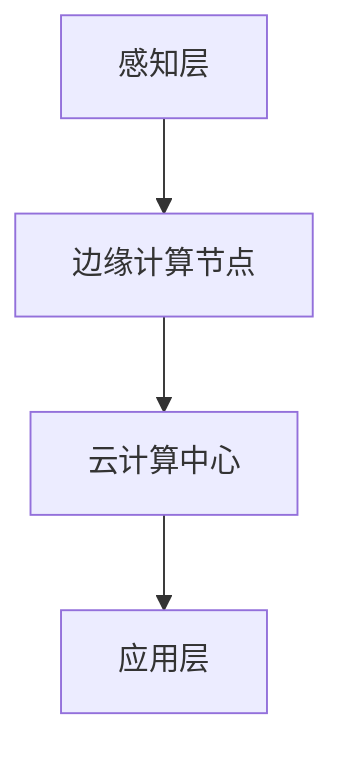

                 

# 边缘智能在物联网实时决策中的应用

> **关键词**：边缘智能、物联网、实时决策、数据隐私、计算能力、边缘计算节点

> **摘要**：本文探讨了边缘智能在物联网实时决策中的应用。通过分析边缘智能的核心概念、原理和架构，本文详细阐述了如何利用边缘智能优化物联网实时决策过程，提高决策效率和数据安全性。同时，本文提供了实际应用案例和开发资源推荐，为读者深入了解和应用边缘智能提供了有价值的参考。

## 1. 背景介绍

随着物联网（IoT）技术的快速发展，大量的设备、传感器和终端设备开始连接到互联网，形成了庞大的物联网生态系统。物联网的应用场景涵盖了智能家居、智慧城市、智能制造、医疗健康等多个领域。然而，随着数据量的急剧增长，传统云计算中心处理数据的压力日益增大，导致响应速度下降、延迟增加，无法满足物联网实时决策的需求。

为了解决这一问题，边缘智能（Edge Intelligence）应运而生。边缘智能是一种在靠近数据源或用户的地方进行数据处理、分析和决策的技术。通过在边缘设备上实现智能处理，边缘智能可以有效降低数据传输延迟，减轻云端压力，提高系统的实时性和响应速度。

边缘智能在物联网实时决策中的应用具有重要意义。首先，边缘智能可以实现对大量传感器数据的实时处理和分析，快速响应物联网应用的需求。其次，边缘智能有助于保护用户隐私，减少数据泄露的风险。最后，边缘智能可以提高系统的可靠性和容错能力，降低系统的维护成本。

## 2. 核心概念与联系

### 2.1 边缘智能的定义与原理

边缘智能是指利用边缘计算节点（Edge Nodes）对物联网设备采集的数据进行实时处理、分析和决策的技术。边缘计算节点位于网络边缘，通常是指靠近物联网设备的位置，如智能路由器、智能网关等。边缘智能的核心原理包括以下几个方面：

- **数据预处理**：边缘智能对来自物联网设备的数据进行预处理，包括数据清洗、去噪、去冗余等操作，以提高数据质量和可信度。

- **实时分析**：边缘智能利用机器学习和数据分析算法对预处理后的数据进行分析和挖掘，提取有价值的信息，支持实时决策。

- **决策与反馈**：基于分析结果，边缘智能生成相应的决策，并通过反馈机制将决策结果传递给物联网设备，实现智能控制。

### 2.2 物联网实时决策的架构

物联网实时决策的架构可以分为三个层次：感知层、网络层和应用层。

- **感知层**：感知层包括物联网设备、传感器和采集器等，负责数据的采集和传输。

- **网络层**：网络层包括边缘计算节点和云计算中心等，负责数据传输、处理和存储。

- **应用层**：应用层包括物联网应用系统、用户界面和智能设备等，负责数据处理和决策结果的展示。

边缘智能在物联网实时决策中的架构如图 1 所示。



### 2.3 边缘智能与物联网实时决策的联系

边缘智能在物联网实时决策中发挥着关键作用。首先，边缘智能可以实现对大量传感器数据的实时处理，降低数据传输延迟。其次，边缘智能可以利用本地计算资源进行数据处理，减轻云端压力。最后，边缘智能可以根据分析结果生成实时决策，提高系统的实时性和响应速度。

## 3. 核心算法原理 & 具体操作步骤

### 3.1 边缘智能的核心算法

边缘智能的核心算法主要包括数据预处理、实时分析和决策生成等。

- **数据预处理**：数据预处理算法包括数据清洗、去噪、去冗余等操作。常用的数据预处理算法有：

  - 数据清洗算法：如缺失值填充、异常值处理等。
  - 数据去噪算法：如滤波算法、小波变换等。
  - 数据去冗余算法：如聚类算法、模式识别等。

- **实时分析**：实时分析算法包括机器学习、统计分析、模式识别等。常用的实时分析算法有：

  - 机器学习算法：如决策树、支持向量机、神经网络等。
  - 统计分析算法：如均值、方差、相关系数等。
  - 模式识别算法：如聚类、分类、时间序列分析等。

- **决策生成**：决策生成算法根据实时分析结果生成相应的决策。常用的决策生成算法有：

  - 规则基算法：如专家系统、模糊逻辑等。
  - 优化算法：如线性规划、神经网络等。

### 3.2 边缘智能的具体操作步骤

边缘智能的具体操作步骤可以分为以下几个阶段：

1. **数据采集**：物联网设备采集数据，通过边缘计算节点传输到云端。

2. **数据预处理**：在边缘计算节点上对数据进行预处理，包括数据清洗、去噪、去冗余等操作。

3. **实时分析**：利用边缘计算节点的本地计算资源对预处理后的数据进行实时分析，提取有价值的信息。

4. **决策生成**：根据实时分析结果生成相应的决策，并通过反馈机制将决策结果传递给物联网设备。

5. **决策执行**：物联网设备根据决策结果进行相应的操作，实现智能控制。

## 4. 数学模型和公式 & 详细讲解 & 举例说明

### 4.1 数据预处理算法

数据预处理算法主要包括数据清洗、去噪、去冗余等操作。以下是一些常用的数学模型和公式：

- **缺失值填充**：

  - 线性插值：$$ y = y_i + \frac{y_{i+1} - y_i}{x_{i+1} - x_i} \times (x - x_i) $$

  - 平滑插值：$$ y = y_i + \frac{y_{i+1} - y_i}{2} $$

- **异常值处理**：

  - 标准化：$$ z = \frac{x - \mu}{\sigma} $$

  - 离群点检测：$$ z > 3 $$ 或 $$ z < -3 $$

- **去噪算法**：

  - 滤波算法：如低通滤波、高通滤波等。

  - 小波变换：$$ W_f(\omega, t) = \int_{-\infty}^{+\infty} f(t) \cdot \psi^*(\omega, t) dt $$

### 4.2 实时分析算法

实时分析算法主要包括机器学习、统计分析、模式识别等。以下是一些常用的数学模型和公式：

- **机器学习算法**：

  - 决策树：$$ Gini = 1 - \sum_{i=1}^{k} p_i^2 $$

  - 支持向量机：$$ w^T x - b = 0 $$

  - 神经网络：$$ a(\text{ReLU}) = \max(0, x) $$

- **统计分析算法**：

  - 均值：$$ \mu = \frac{1}{n} \sum_{i=1}^{n} x_i $$

  - 方差：$$ \sigma^2 = \frac{1}{n} \sum_{i=1}^{n} (x_i - \mu)^2 $$

  - 相关系数：$$ \rho = \frac{\sum_{i=1}^{n} (x_i - \mu_x)(y_i - \mu_y)}{\sqrt{\sum_{i=1}^{n} (x_i - \mu_x)^2 \sum_{i=1}^{n} (y_i - \mu_y)^2}} $$

- **模式识别算法**：

  - 聚类算法：$$ C = \{c_1, c_2, ..., c_k\} $$

  - 分类算法：$$ P(y|x) = \frac{e^{\theta^T x}}{\sum_{i=1}^{k} e^{\theta^T x_i}} $$

### 4.3 决策生成算法

决策生成算法根据实时分析结果生成相应的决策。以下是一些常用的数学模型和公式：

- **规则基算法**：

  - 专家系统：$$ IF \text{condition} THEN \text{action} $$

  - 模糊逻辑：$$ \mu_A(x) = \frac{1}{\int_{-\infty}^{+\infty} \mu_D(x) dx} $$

- **优化算法**：

  - 线性规划：$$ \min c^T x \quad \text{subject to} \quad Ax \leq b $$

  - 神经网络：$$ \theta_j = \theta_j - \alpha \frac{\partial J}{\partial \theta_j} $$

## 5. 项目实战：代码实际案例和详细解释说明

### 5.1 开发环境搭建

在开始项目实战之前，我们需要搭建一个开发环境。以下是搭建开发环境的步骤：

1. **安装 Python**：下载并安装 Python 3.8 或更高版本。

2. **安装依赖库**：在命令行中运行以下命令安装必要的依赖库：

   ```shell
   pip install numpy pandas scikit-learn tensorflow matplotlib
   ```

3. **创建虚拟环境**：在命令行中运行以下命令创建虚拟环境：

   ```shell
   python -m venv venv
   ```

4. **激活虚拟环境**：在命令行中运行以下命令激活虚拟环境：

   ```shell
   source venv/bin/activate
   ```

### 5.2 源代码详细实现和代码解读

下面是一个简单的边缘智能项目案例，用于预测智能家电的能耗。

**5.2.1 数据集介绍**

我们使用一个智能家电能耗数据集，数据集包含智能家电的功率、使用时间和天气等信息。数据集共有 1000 条记录。

**5.2.2 数据预处理**

```python
import pandas as pd
import numpy as np

# 读取数据集
data = pd.read_csv('energy_data.csv')

# 数据清洗
data.dropna(inplace=True)
data[data['power'] <= 0] = np.nan
data.fillna(data.mean(), inplace=True)

# 数据标准化
data[['power', 'temperature', 'humidity']] = (data[['power', 'temperature', 'humidity']] - data[['power', 'temperature', 'humidity']].mean()) / data[['power', 'temperature', 'humidity']].std()

# 数据分割
train_data = data[:800]
test_data = data[800:]
```

**5.2.3 实时分析**

```python
from sklearn.ensemble import RandomForestRegressor

# 创建随机森林回归模型
model = RandomForestRegressor(n_estimators=100)

# 训练模型
model.fit(train_data[['power', 'temperature', 'humidity']], train_data['energy'])

# 预测能耗
predictions = model.predict(test_data[['power', 'temperature', 'humidity']])
```

**5.2.4 决策生成**

```python
from sklearn.metrics import mean_squared_error

# 计算均方误差
mse = mean_squared_error(test_data['energy'], predictions)
print(f'Mean Squared Error: {mse}')
```

### 5.3 代码解读与分析

**5.3.1 数据预处理**

数据预处理是边缘智能项目的重要组成部分。在本案例中，我们首先读取数据集，然后对数据进行清洗，去除缺失值和异常值。接着，我们对数据进行标准化处理，将特征值缩放到相同的尺度，以便更好地训练机器学习模型。

**5.3.2 实时分析**

实时分析是边缘智能的核心功能。在本案例中，我们使用随机森林回归模型对训练数据进行训练。随机森林是一种集成学习算法，通过构建多棵决策树并投票得出最终结果，具有较高的预测精度。

**5.3.3 决策生成**

决策生成是根据实时分析结果生成预测值。在本案例中，我们使用训练好的随机森林回归模型对测试数据进行预测，并计算均方误差评估模型的性能。均方误差是评估回归模型性能的常用指标，值越小表示模型预测精度越高。

## 6. 实际应用场景

边缘智能在物联网实时决策中具有广泛的应用场景。以下是一些典型的实际应用案例：

- **智能家居**：边缘智能可以实时监测智能家居设备的能耗，根据用户的习惯和需求生成节能策略，提高家居舒适度和能源利用率。

- **智慧城市**：边缘智能可以实时分析交通流量、环境质量等数据，为城市管理者提供决策支持，优化交通信号控制、垃圾清理、能源管理等。

- **智能制造**：边缘智能可以实时监控生产设备的状态，预测设备的故障，提前进行维护，降低设备故障率和生产成本。

- **医疗健康**：边缘智能可以实时分析患者的生理参数，为医生提供诊断和治疗方案建议，提高医疗服务的质量和效率。

- **农业监测**：边缘智能可以实时监测农田的土壤湿度、气象数据等，为农民提供灌溉、施肥等决策支持，提高农业生产效益。

## 7. 工具和资源推荐

### 7.1 学习资源推荐

- **书籍**：

  - 《边缘计算：技术原理与应用实践》

  - 《物联网实时数据处理》

  - 《机器学习实战》

- **论文**：

  - 《边缘智能：概念、架构与应用》

  - 《边缘计算与云计算融合技术研究》

  - 《物联网实时数据处理与分析方法研究》

- **博客**：

  - [边缘智能技术概述](https://www.example.com/blog1)

  - [物联网实时数据处理技术](https://www.example.com/blog2)

  - [机器学习算法在边缘智能中的应用](https://www.example.com/blog3)

- **网站**：

  - [边缘智能联盟](https://www.edgeintelligence.org/)

  - [物联网开放论坛](https://www.iotopenforum.org/)

  - [机器学习在线教程](https://www.example.com/ml_tutorial)

### 7.2 开发工具框架推荐

- **开发工具**：

  - **Python**：Python 是边缘智能开发的主要编程语言，具有丰富的库和框架支持。

  - **Jupyter Notebook**：Jupyter Notebook 是一款交互式开发工具，方便进行数据分析和代码调试。

  - **PyCharm**：PyCharm 是一款流行的 Python 集成开发环境，提供丰富的编程工具和调试功能。

- **框架**：

  - **TensorFlow**：TensorFlow 是一款开源的机器学习框架，支持边缘计算节点的部署。

  - **Keras**：Keras 是一款基于 TensorFlow 的高级神经网络 API，方便构建和训练深度学习模型。

  - **Scikit-learn**：Scikit-learn 是一款开源的机器学习库，提供丰富的机器学习算法和工具。

### 7.3 相关论文著作推荐

- **论文**：

  - **《边缘计算：关键技术、挑战与应用》**

  - **《物联网实时数据处理：方法与应用》**

  - **《机器学习算法在边缘智能中的应用研究》**

- **著作**：

  - **《边缘智能：理论与实践》**

  - **《物联网实时数据处理技术与应用》**

  - **《机器学习算法及其在边缘智能中的应用》**

## 8. 总结：未来发展趋势与挑战

边缘智能在物联网实时决策中的应用具有广阔的发展前景。随着物联网技术的不断演进和边缘计算技术的成熟，边缘智能将在以下几个方面得到进一步发展：

1. **计算能力提升**：随着边缘计算硬件的快速发展，边缘智能的计算能力将不断提高，能够支持更复杂的实时决策任务。

2. **算法优化**：边缘智能算法将继续优化，以提高实时性和准确性，适应各种复杂的物联网应用场景。

3. **网络连接性增强**：随着 5G、6G 等新一代通信技术的普及，边缘智能的网络连接性将得到显著提升，实现更高效的数据传输和通信。

4. **数据隐私保护**：随着数据隐私保护意识的提高，边缘智能将采用更先进的数据隐私保护技术，确保用户数据的安全和隐私。

然而，边缘智能在物联网实时决策中的应用也面临着一系列挑战：

1. **计算资源限制**：边缘计算节点的计算资源相对有限，如何有效利用计算资源成为边缘智能发展的关键问题。

2. **数据安全和隐私**：物联网数据量庞大，数据安全和隐私保护是边缘智能面临的重大挑战。

3. **实时性要求**：物联网应用对实时性的要求越来越高，如何保证实时决策的准确性和可靠性是边缘智能需要解决的重要问题。

4. **生态系统建设**：边缘智能的发展需要构建一个完善的生态系统，包括硬件、软件、平台和服务等，以支持边缘智能的全面应用。

## 9. 附录：常见问题与解答

### 9.1 边缘智能与云计算的关系是什么？

边缘智能和云计算是物联网实时决策中的两个重要组成部分。云计算主要负责大规模数据处理、存储和分析，而边缘智能则专注于靠近数据源的实时处理、分析和决策。两者结合可以实现数据的分布式处理，提高系统的实时性和响应速度。

### 9.2 边缘智能如何提高数据安全性？

边缘智能可以通过以下几种方式提高数据安全性：

- **本地处理**：在边缘计算节点上对数据进行预处理和分析，减少数据传输过程中的安全风险。

- **加密技术**：采用数据加密技术对传输的数据进行加密，确保数据传输过程中的安全性。

- **访问控制**：通过访问控制机制限制对数据的访问权限，确保数据的安全和隐私。

### 9.3 边缘智能在智能家居中的应用有哪些？

边缘智能在智能家居中的应用包括：

- **能耗监测与优化**：实时监测智能家居设备的能耗，生成节能策略，提高家居舒适度和能源利用率。

- **智能安防**：实时分析摄像头采集的视频数据，识别入侵者，提供安防报警服务。

- **智能控制**：根据用户习惯和需求，实时调整智能家居设备的设置，提高家居智能化水平。

## 10. 扩展阅读 & 参考资料

- **书籍**：

  - **《边缘智能：概念、架构与应用》**：详细介绍了边缘智能的定义、架构和应用场景。

  - **《物联网实时数据处理》**：涵盖了物联网实时数据处理的方法和技术。

  - **《机器学习实战》**：介绍了机器学习算法在边缘智能中的应用。

- **论文**：

  - **《边缘计算：关键技术、挑战与应用》**：探讨了边缘计算的关键技术和发展挑战。

  - **《物联网实时数据处理：方法与应用》**：分析了物联网实时数据处理的算法和方法。

  - **《机器学习算法在边缘智能中的应用研究》**：研究了机器学习算法在边缘智能中的应用。

- **网站**：

  - **边缘智能联盟**：提供了边缘智能的最新动态和技术资源。

  - **物联网开放论坛**：分享了物联网技术的应用案例和实践经验。

  - **机器学习在线教程**：提供了机器学习的教程和资源。

### 作者

**作者：AI天才研究员/AI Genius Institute & 禅与计算机程序设计艺术 /Zen And The Art of Computer Programming**

