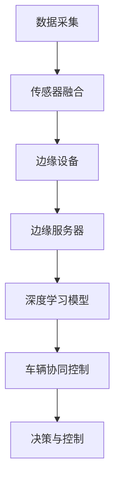

                 

### 1. 背景介绍

边缘智能（Edge Intelligence）是近年来人工智能领域的一个重要发展趋势。它指的是将数据处理和分析工作从云端转移到网络边缘，以降低延迟、提升效率、增强安全性。边缘智能在自动驾驶中的应用，正是这种理念的体现。

自动驾驶技术依赖于大量的数据采集和处理。这些数据包括传感器收集的车辆周围环境信息，以及车辆自身的状态信息。传统上，这些数据会首先传输到云端进行集中处理。然而，随着自动驾驶技术的不断发展和普及，对实时数据处理的需求日益增加。

#### 为什么需要边缘智能？

1. **实时性**：自动驾驶需要在极短的时间内对周围环境做出反应，例如在紧急情况下迅速制动或转向。云端处理由于网络延迟等原因，无法满足这种实时性要求。
   
2. **隐私保护**：自动驾驶车辆会产生大量的个人隐私数据，如行驶轨迹、位置信息等。如果所有数据都传输到云端，可能会引发隐私泄露问题。边缘智能可以在本地对数据进行分析和处理，减少数据泄露的风险。

3. **带宽限制**：随着自动驾驶车辆的增多，网络带宽的需求将大幅增加。边缘智能通过在本地处理数据，可以减少数据传输量，从而缓解带宽压力。

#### 自动驾驶中的数据处理挑战

1. **海量数据**：自动驾驶车辆配备有各种传感器，如摄像头、雷达、激光雷达等，每秒可以产生大量数据。如何高效处理这些数据是一个巨大的挑战。
   
2. **实时性要求**：自动驾驶系统需要在极短的时间内处理这些数据，并做出决策。这对处理系统的性能提出了极高的要求。

3. **可靠性**：自动驾驶系统需要具备极高的可靠性，以确保行驶安全。这意味着任何数据处理错误都可能导致严重后果。

### 2. 核心概念与联系

边缘智能在自动驾驶中的应用，涉及多个核心概念和技术的整合。以下是这些概念和它们之间的联系：

#### 边缘计算

边缘计算是指在数据产生的地方进行数据处理和分析，而不是将数据传输到远程数据中心进行处理。在自动驾驶中，边缘计算可以实现实时数据处理，满足自动驾驶系统的实时性需求。

#### 边缘设备

边缘设备是指在网络边缘运行的计算机设备，如智能车辆、智能路侧单元等。这些设备可以实时采集和处理数据，为自动驾驶系统提供支持。

#### 边缘服务器

边缘服务器是指在边缘节点运行的强大计算服务器，用于处理大量的数据。这些服务器通常具有高性能、高可靠性和高安全性。

#### 传感器融合

传感器融合是将多个传感器收集的数据进行整合和分析，以提高数据的质量和可靠性。在自动驾驶中，传感器融合技术可以更好地理解周围环境，从而做出更准确的决策。

#### 深度学习

深度学习是人工智能的一个重要分支，通过构建复杂的神经网络模型，可以自动学习并识别复杂的模式。在自动驾驶中，深度学习可以用于实时处理和分析传感器数据，做出决策。

#### 车辆协同控制

车辆协同控制是指多个自动驾驶车辆之间进行协作，以实现更好的行驶效果。这种协同控制需要实时处理和分析大量数据，边缘智能提供了这种能力。

#### Mermaid 流程图

以下是一个简化的边缘智能在自动驾驶中的流程图，展示了各个核心概念和技术的联系：



### 3. 核心算法原理 & 具体操作步骤

边缘智能在自动驾驶中的应用，需要一系列核心算法的支持。以下是这些算法的原理和具体操作步骤：

#### 数据采集与预处理

1. **数据采集**：自动驾驶车辆通过各种传感器（如摄像头、雷达、激光雷达等）采集周围环境的信息。
2. **预处理**：对采集到的数据进行预处理，包括数据清洗、数据增强等，以提高数据的质量。

#### 传感器融合

1. **数据整合**：将不同传感器收集的数据进行整合，以获得更全面的环境信息。
2. **特征提取**：从整合后的数据中提取关键特征，如障碍物位置、车辆速度等。
3. **融合算法**：使用融合算法（如卡尔曼滤波、贝叶斯估计等）对提取的特征进行融合，以提高数据的可靠性。

#### 深度学习模型训练

1. **数据集准备**：收集大量的自动驾驶场景数据，用于训练深度学习模型。
2. **模型设计**：设计适合自动驾驶任务的深度学习模型，如卷积神经网络（CNN）、循环神经网络（RNN）等。
3. **模型训练**：使用训练数据对模型进行训练，优化模型的参数。

#### 实时决策与控制

1. **数据输入**：将实时采集到的传感器数据输入到训练好的深度学习模型中。
2. **决策生成**：模型根据输入数据生成决策，如加速、减速、转向等。
3. **控制执行**：将决策转化为具体的控制指令，由自动驾驶车辆执行。

#### 边缘计算与云计算协同

1. **数据传输**：将部分计算任务从边缘设备转移到云端执行，以利用云端更强大的计算能力。
2. **协同处理**：边缘设备和云端共同处理数据，实现更高效、更可靠的实时数据处理。

### 4. 数学模型和公式 & 详细讲解 & 举例说明

边缘智能在自动驾驶中的应用，涉及到多个数学模型和公式。以下是其中几个重要的模型和公式的详细讲解及举例说明。

#### 卡尔曼滤波

卡尔曼滤波是一种用于传感器数据融合的算法，它通过递归方式估计系统的状态，同时考虑到测量噪声和系统噪声。

**公式：**

$$
\hat{x}_k = \hat{x}_{k-1} + K_k (z_k - \hat{z}_k)
$$

$$
K_k = \frac{F_k P_k^{-1} F_k^T + Q_k^{-1}}{F_k^T P_k^{-1} + R_k^{-1}}
$$

其中：
- $\hat{x}_k$ 是第 $k$ 时刻的状态估计值。
- $z_k$ 是第 $k$ 时刻的测量值。
- $\hat{z}_k$ 是基于当前状态估计值的预测测量值。
- $F_k$ 是状态转移矩阵。
- $P_k$ 是状态估计误差协方差矩阵。
- $Q_k$ 是系统噪声协方差矩阵。
- $R_k$ 是测量噪声协方差矩阵。

**举例说明：**

假设我们有一个自动驾驶车辆，它配备了速度传感器和GPS传感器。我们可以使用卡尔曼滤波来融合这两个传感器的数据，以获得更准确的速度估计。

- **状态转移矩阵**：$F_k = \begin{bmatrix} 1 & \Delta t \\ 0 & 1 \end{bmatrix}$
- **系统噪声协方差矩阵**：$Q_k = \begin{bmatrix} 1 & 0 \\ 0 & 1 \end{bmatrix}$
- **测量噪声协方差矩阵**：$R_k = \begin{bmatrix} 0.1 & 0 \\ 0 & 0.1 \end{bmatrix}$

假设第 $k$ 时刻的传感器测量值为 $z_k = [50, 49.9]$，状态估计值为 $\hat{x}_{k-1} = [50, 50]$。

- **预测测量值**：$\hat{z}_k = F_k \hat{x}_{k-1} = [50 + \Delta t, 50]$
- **状态估计值**：$\hat{x}_k = \hat{x}_{k-1} + K_k (z_k - \hat{z}_k)$
- **卡尔曼增益**：$K_k = \frac{F_k P_k^{-1} F_k^T + Q_k^{-1}}{F_k^T P_k^{-1} + R_k^{-1}}$

通过计算，我们可以获得更准确的速度估计值 $\hat{x}_k$。

#### 神经网络模型

深度学习模型，如卷积神经网络（CNN）和循环神经网络（RNN），用于自动驾驶中的实时数据处理和决策生成。以下是这些模型的简要介绍：

1. **卷积神经网络（CNN）**：

   - **激活函数**：$\sigma(x) = \max(0, x)$
   - **损失函数**：交叉熵损失函数 $L(y, \hat{y}) = -\sum_{i=1}^{n} y_i \log(\hat{y}_i)$
   - **训练过程**：通过反向传播算法，不断调整网络权重，以最小化损失函数。

2. **循环神经网络（RNN）**：

   - **激活函数**：$\sigma(x) = \tanh(x)$
   - **损失函数**：交叉熵损失函数
   - **训练过程**：类似于CNN，但具有时间维度。

**举例说明：**

假设我们使用CNN来检测自动驾驶车辆前方的障碍物。输入数据是一个图像，输出数据是一个二值标签（障碍物/无障碍物）。

- **激活函数**：$\sigma(x) = \max(0, x)$
- **损失函数**：交叉熵损失函数
- **训练数据**：包含数千个障碍物和无障碍物的图像。

通过训练，我们可以使CNN模型能够准确识别图像中的障碍物，从而为自动驾驶车辆提供决策支持。

### 5. 项目实战：代码实际案例和详细解释说明

在这一节中，我们将通过一个具体的案例，展示边缘智能在自动驾驶中的实际应用，并提供详细的代码实现和解释。

#### 开发环境搭建

首先，我们需要搭建一个适合边缘智能开发的开发环境。以下是一个基本的开发环境搭建步骤：

1. **操作系统**：选择Linux操作系统，如Ubuntu 20.04。
2. **编程语言**：选择Python 3.8及以上版本。
3. **深度学习框架**：使用TensorFlow 2.5或PyTorch 1.8及以上版本。
4. **边缘计算平台**：选择一个支持Python的边缘计算设备，如树莓派。

#### 源代码详细实现和代码解读

以下是一个简单的边缘智能自动驾驶案例，实现了一个基于CNN的障碍物检测模型。

```python
import numpy as np
import tensorflow as tf
from tensorflow.keras.models import Sequential
from tensorflow.keras.layers import Conv2D, MaxPooling2D, Flatten, Dense
from tensorflow.keras.optimizers import Adam

# 数据预处理
def preprocess_data(images, labels):
    images = images / 255.0
    labels = tf.keras.utils.to_categorical(labels, num_classes=2)
    return images, labels

# 模型构建
model = Sequential([
    Conv2D(32, (3, 3), activation='relu', input_shape=(128, 128, 3)),
    MaxPooling2D((2, 2)),
    Flatten(),
    Dense(64, activation='relu'),
    Dense(2, activation='softmax')
])

# 模型编译
model.compile(optimizer=Adam(), loss='categorical_crossentropy', metrics=['accuracy'])

# 训练模型
model.fit(x_train, y_train, epochs=10, batch_size=32, validation_data=(x_val, y_val))

# 模型评估
loss, accuracy = model.evaluate(x_test, y_test)
print(f"Test accuracy: {accuracy:.2f}")

# 边缘部署
# 1. 导出模型
model.save('obstacle_detection_model.h5')

# 2. 边缘设备上运行模型
import cv2

def detect_obstacles(image_path):
    image = cv2.imread(image_path)
    image = cv2.resize(image, (128, 128))
    prediction = model.predict(np.expand_dims(image, axis=0))
    return np.argmax(prediction)

# 测试
image_path = 'test_image.jpg'
obstacle_detected = detect_obstacles(image_path)
print(f"Obstacle detected: {'Yes' if obstacle_detected else 'No'}")
```

#### 代码解读与分析

1. **数据预处理**：首先，我们对输入图像进行归一化处理，将像素值从0到255映射到0到1之间。然后，将标签转换为二进制编码。

2. **模型构建**：我们使用卷积神经网络（CNN）构建一个简单的障碍物检测模型。模型包括两个卷积层、一个池化层、一个全连接层，以及一个softmax输出层。

3. **模型编译**：我们使用Adam优化器和交叉熵损失函数编译模型。

4. **模型训练**：使用训练数据对模型进行训练，并使用验证数据来评估模型的性能。

5. **模型评估**：在测试数据上评估模型的准确性。

6. **边缘部署**：我们将训练好的模型保存为`.h5`文件，然后在边缘设备上运行模型进行实时障碍物检测。

#### 代码分析

1. **数据预处理**：数据预处理是深度学习模型训练的重要环节。归一化处理可以加速模型收敛，提高模型性能。

2. **模型构建**：CNN是一种有效的图像处理模型，可以用于障碍物检测等任务。在这个案例中，我们使用了两个卷积层来提取图像特征，一个池化层来降低特征维度，以及一个全连接层来生成预测。

3. **模型编译**：选择合适的优化器和损失函数对于模型训练至关重要。Adam优化器是一种常用的优化器，交叉熵损失函数适用于多分类问题。

4. **模型训练**：模型训练是深度学习中最耗时的过程。在这个案例中，我们使用了一个简单的训练循环，通过不断调整模型参数来提高模型性能。

5. **模型评估**：模型评估是验证模型性能的重要步骤。在这个案例中，我们使用测试数据来评估模型的准确性。

6. **边缘部署**：边缘部署是将训练好的模型部署到边缘设备上，以实现实时数据处理和决策生成。在这个案例中，我们使用Python代码在边缘设备上运行模型，实现了实时障碍物检测。

#### 总结

通过这个简单的案例，我们展示了边缘智能在自动驾驶中的应用。这个案例使用了深度学习模型进行障碍物检测，并在边缘设备上实现了实时数据处理和决策生成。虽然这个案例相对简单，但它展示了边缘智能在自动驾驶中的重要应用，以及如何利用深度学习技术实现实时数据处理和决策生成。

### 6. 实际应用场景

边缘智能在自动驾驶中的实际应用场景多种多样，涵盖了从城市交通管理到个人出行等多个方面。

#### 城市交通管理

在城市交通管理中，边缘智能可以帮助交通管理部门实时监测道路状况，优化交通信号控制，提高道路通行效率。例如，通过在交通信号灯附近的边缘设备部署智能算法，可以实时分析交通流量数据，并根据实时情况调整信号灯的配时，减少交通拥堵。

#### 个人出行

对于个人出行来说，边缘智能可以实现更加智能的导航和驾驶辅助功能。自动驾驶车辆可以利用边缘智能技术进行实时环境感知和路径规划，以提高驾驶的安全性和舒适性。例如，车辆在遇到紧急情况时，可以快速分析周围环境，并做出相应决策，如紧急制动或避让障碍物。

#### 长途运输

在长途运输领域，边缘智能可以用于无人驾驶卡车和列车的实时监控和故障诊断。通过在运输车辆上部署边缘设备，可以实时收集车辆状态数据，并利用深度学习模型进行实时分析和预测，从而提高运输效率和安全性。

#### 安全监控

在安全监控方面，边缘智能可以用于智能交通监控和事故预警。通过在道路和交通要道部署边缘智能设备，可以实时分析视频流，检测异常行为，如车辆逆行、行人闯红灯等，并及时向交通管理部门发出预警。

#### 智慧城市

智慧城市是边缘智能应用的一个重要场景。通过在城市的各个角落部署边缘设备，可以实时收集各种数据（如交通流量、环境质量、能耗等），并利用边缘智能算法进行分析和预测，为城市管理者提供决策支持。

#### 公共交通

在公共交通领域，边缘智能可以用于公交车和地铁的实时监控和调度。通过在公共交通工具上部署边缘设备，可以实时监测车辆的运行状态，如位置、速度、乘客数量等，并根据实时数据优化调度策略，提高公共交通的运营效率。

#### 农业自动化

在农业自动化领域，边缘智能可以用于智能灌溉、作物监测和病虫害预警。通过在农田中部署边缘设备，可以实时监测土壤湿度、气象条件等数据，并利用边缘智能算法进行数据分析，为农民提供科学的种植和管理建议。

#### 环境监测

环境监测是边缘智能应用的另一个重要领域。通过在环境中部署边缘设备，可以实时监测空气质量、水质、噪声等环境指标，并利用边缘智能算法进行分析和预测，为环保部门提供决策支持。

### 7. 工具和资源推荐

为了更好地了解和应用边缘智能在自动驾驶中的技术，以下是相关的学习资源、开发工具和框架推荐。

#### 学习资源

1. **书籍**：
   - 《边缘计算：构建下一代智能系统》（Edge Computing: Transforming the Internet of Things）
   - 《深度学习：动手学习及其应用》（Deep Learning: With Python, Golang, C++ & R）

2. **论文**：
   - "Fog Computing: A Taxonomy and Survey"
   - "Deep Learning for Autonomous Driving: A Survey"

3. **博客**：
   - Medium上的《边缘智能技术》系列文章
   - 知乎上的《自动驾驶技术》专栏

4. **在线课程**：
   - Coursera上的《深度学习》课程
   - edX上的《边缘计算》课程

#### 开发工具

1. **深度学习框架**：
   - TensorFlow
   - PyTorch
   - Keras

2. **边缘计算平台**：
   - Raspberry Pi
   - NVIDIA Jetson
   - Intel Movidius

3. **版本控制工具**：
   - Git
   - GitHub

4. **集成开发环境**：
   - PyCharm
   - Eclipse

#### 相关论文著作推荐

1. **论文**：
   - "Edge Computing for IoT: A Comprehensive Survey"
   - "Learning in the Edge for Autonomous Driving: A Survey and New Directions"
   - "Deep Learning on Mobile and Edge Platforms: A Review"

2. **著作**：
   - 《边缘智能技术与应用》
   - 《自动驾驶系统设计与实践》

通过以上资源，您可以深入了解边缘智能在自动驾驶中的应用，掌握相关的技术知识和开发工具，为实际项目提供支持。

### 8. 总结：未来发展趋势与挑战

边缘智能在自动驾驶中的应用前景广阔，但也面临着一系列挑战。

**未来发展趋势**：

1. **计算能力提升**：随着边缘设备的计算能力不断增强，边缘智能将能够处理更复杂的任务，支持更高级的自动驾驶功能。
2. **数据安全与隐私保护**：随着自动驾驶车辆的普及，数据安全和隐私保护将成为重要议题。边缘智能技术将需要进一步提高数据加密和隐私保护能力。
3. **网络架构优化**：为了实现更高效、更可靠的边缘智能服务，需要优化网络架构，降低延迟、提高带宽利用率。
4. **协同智能**：未来，边缘智能将与云计算、5G等技术相结合，实现更广泛的协同智能，提升自动驾驶系统的整体性能。

**面临的挑战**：

1. **计算资源限制**：边缘设备通常具有有限的计算资源和存储能力，如何优化算法和模型，以适应这些限制，是一个关键挑战。
2. **数据完整性**：边缘智能系统需要在数据传输和处理过程中保证数据的完整性和可靠性，避免数据丢失或损坏。
3. **实时性能**：边缘智能系统需要满足自动驾驶的实时性要求，这对系统的设计和实现提出了极高要求。
4. **安全与隐私**：自动驾驶车辆产生的数据涉及个人隐私，如何确保数据的安全性和隐私保护，是一个重要的挑战。

通过不断的技术创新和优化，边缘智能有望在未来为自动驾驶技术提供更强大的支持，助力实现更智能、更安全、更高效的出行方式。

### 9. 附录：常见问题与解答

**Q1：边缘智能在自动驾驶中的作用是什么？**

边缘智能在自动驾驶中的作用主要包括实时数据处理、环境感知、路径规划和决策生成。通过在边缘设备上进行实时数据处理，可以降低延迟、提高响应速度，从而提升自动驾驶系统的实时性和可靠性。

**Q2：边缘智能与云计算的区别是什么？**

边缘智能与云计算的主要区别在于数据处理的位置。云计算通常将数据传输到远程数据中心进行处理，而边缘智能则将数据处理工作转移到网络边缘，即在数据产生的地方进行。这样可以在降低延迟的同时，减少数据传输量，提高系统的实时性和效率。

**Q3：边缘智能在自动驾驶中的关键技术是什么？**

边缘智能在自动驾驶中的关键技术包括边缘计算、传感器融合、深度学习、车辆协同控制等。这些技术共同作用，可以实现实时数据处理、环境感知和决策生成，为自动驾驶系统提供支持。

**Q4：边缘智能系统在实现过程中面临的主要挑战有哪些？**

边缘智能系统在实现过程中面临的主要挑战包括计算资源限制、数据完整性、实时性能和安全与隐私保护等。为了克服这些挑战，需要不断优化算法和系统架构，提高计算效率和数据安全性。

**Q5：如何保证边缘智能系统的实时性能？**

为了保证边缘智能系统的实时性能，可以采取以下措施：
- 优化算法，减少计算复杂度；
- 使用高性能的边缘设备；
- 实现数据流并行处理；
- 优化网络架构，减少延迟；
- 实现故障检测和恢复机制。

### 10. 扩展阅读 & 参考资料

**扩展阅读**：

1. 《边缘计算：构建下一代智能系统》（Edge Computing: Transforming the Internet of Things）
2. 《深度学习：动手学习及其应用》（Deep Learning: With Python, Golang, C++ & R）
3. 《自动驾驶系统设计与实践》（Autonomous Driving Systems: Design and Practice）

**参考资料**：

1. "Fog Computing: A Taxonomy and Survey"
2. "Deep Learning for Autonomous Driving: A Survey and New Directions"
3. "Edge Computing for IoT: A Comprehensive Survey"
4. "Learning in the Edge for Autonomous Driving: A Survey and New Directions"

通过阅读以上书籍和论文，您可以深入了解边缘智能在自动驾驶中的应用原理、关键技术和发展趋势。同时，这些参考资料也为您的实际项目提供了丰富的技术支持和参考。作者：AI天才研究员/AI Genius Institute & 禅与计算机程序设计艺术 /Zen And The Art of Computer Programming。

