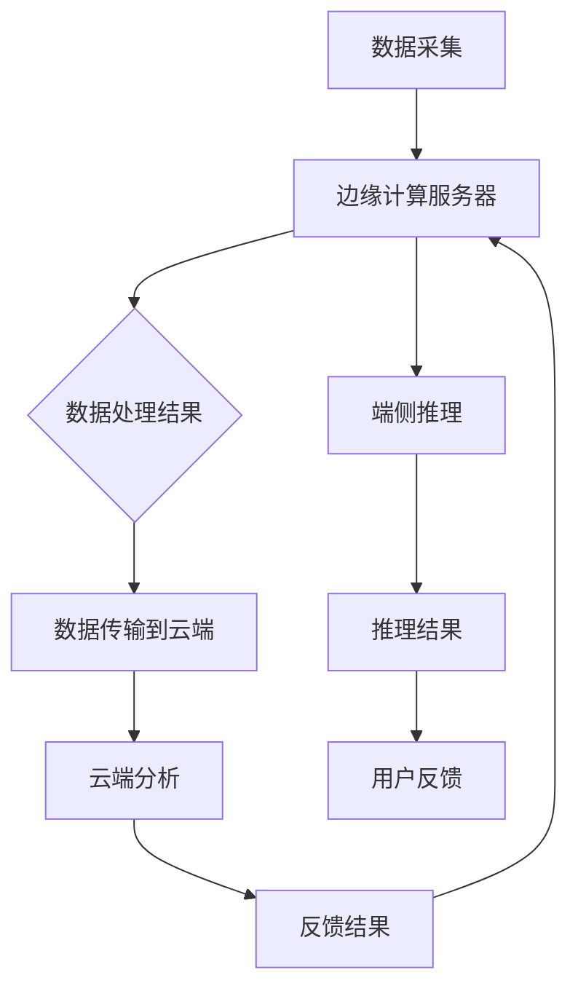

                 

### 背景介绍

#### 1. 边缘计算的概念

边缘计算（Edge Computing）是一种分布式计算架构，旨在将数据处理、分析和存储等任务从云端转移到网络边缘，即靠近数据源的地方。这种架构的核心思想是减少数据传输的开销，提高处理速度，并增强系统的响应能力。

边缘计算最早可以追溯到物联网（IoT）和工业自动化领域。随着物联网设备的快速增长和工业4.0的推进，边缘计算的重要性日益凸显。在物联网环境中，大量传感器和设备分布在不同的位置，产生的数据量庞大。如果将这些数据全部上传到云端进行计算，不仅会导致网络拥堵，还会增加延迟，影响系统的实时性和可靠性。

边缘计算通过在数据源头附近部署计算资源，实现了数据的本地化处理。这样，只有重要的数据或处理结果需要上传到云端，从而显著减少了网络负载。此外，边缘计算还能有效地应对实时性和低延迟的要求，特别是在实时监控、智能交通和智能制造等领域。

#### 2. 端侧推理的概念

端侧推理（Edge Inference）是指在移动设备或嵌入式系统中进行机器学习模型的推理计算。与传统的云计算相比，端侧推理的主要优势在于它能够在没有网络连接或连接不稳定的情况下独立运行，从而提高系统的自主性和可靠性。

端侧推理的应用场景非常广泛，包括智能手机、智能家居、可穿戴设备、无人驾驶车辆等。在智能手机中，端侧推理可以用于人脸识别、图像分类、语音识别等功能，从而提升用户体验。在智能家居中，端侧推理可以用于智能门锁、智能灯光控制等场景，实现设备间的智能交互。在无人驾驶车辆中，端侧推理可以用于实时感知环境和做出决策，提高行驶的安全性和效率。

随着深度学习模型的复杂度不断增加，端侧推理也面临着计算资源有限的挑战。如何在有限的硬件资源下高效地运行模型，是端侧推理研究的重要方向之一。

#### 3. 边缘计算与端侧推理的关系

边缘计算和端侧推理是紧密相关的概念。边缘计算提供了端侧推理所需的计算资源，而端侧推理则为边缘计算提供了具体的应用场景。

从整体架构上看，边缘计算可以看作是端侧推理的延伸。在边缘计算架构中，端侧设备作为数据的采集源，将数据传输到边缘服务器进行初步处理。边缘服务器可以运行一些复杂的机器学习模型，但更多的计算任务将转移到端侧设备进行推理。

这种架构的优势在于，一方面，它可以减轻云端的数据处理压力，降低网络拥堵；另一方面，它可以提高系统的实时性和响应速度，特别是在网络不稳定或不可用的场景下。

总的来说，边缘计算与端侧推理共同构建了一个高效、灵活、可靠的计算架构，为未来的智能应用提供了坚实的基础。

<|assistant|>### 核心概念与联系

#### 1. 核心概念介绍

**边缘计算（Edge Computing）：** 边缘计算是一种分布式计算架构，它将数据处理、分析和存储等任务从云端转移到网络边缘。边缘计算的主要目标是提高数据处理速度，降低网络延迟，增强系统的实时性和可靠性。

**端侧推理（Edge Inference）：** 端侧推理是指机器学习模型在移动设备或嵌入式系统中进行推理计算。端侧推理的优势在于它能够在没有网络连接或连接不稳定的情况下独立运行，从而提高系统的自主性和可靠性。

#### 2. 核心概念的联系

边缘计算与端侧推理之间的联系主要体现在以下几个方面：

**数据传输与处理：** 边缘计算通过在数据源头附近部署计算资源，实现了数据的本地化处理。这样，只有重要的数据或处理结果需要上传到云端，从而减少了数据传输的开销。而端侧推理则在这些本地化的数据上进行进一步的推理计算。

**实时性与响应速度：** 边缘计算和端侧推理都致力于提高系统的实时性和响应速度。边缘计算通过减少数据传输延迟，实现了对实时性要求的满足。而端侧推理则通过在本地进行推理计算，进一步缩短了系统的响应时间。

**自主性与可靠性：** 端侧推理的一个重要优势在于它能够在没有网络连接或连接不稳定的情况下独立运行，从而提高了系统的自主性和可靠性。边缘计算则为端侧推理提供了必要的计算资源支持，使得系统能够在更广泛的场景下稳定运行。

#### 3. Mermaid 流程图

以下是一个简化的 Mermaid 流程图，展示了边缘计算与端侧推理之间的联系：



在上述流程图中：

- **A 数据采集：** 端侧设备收集数据。
- **B 边缘计算服务器：** 边缘服务器对数据进行初步处理。
- **C 数据处理结果：** 处理结果可能包括数据清洗、特征提取等。
- **D 数据传输到云端：** 部分重要数据上传到云端。
- **E 云端分析：** 云端服务器对数据进行分析和存储。
- **F 反馈结果：** 云端分析结果反馈到边缘服务器。
- **G 端侧推理：** 边缘服务器或端侧设备对本地数据执行推理计算。
- **H 推理结果：** 推理结果用于决策或反馈。
- **I 用户反馈：** 用户对系统的反馈。

通过这个流程图，我们可以清晰地看到边缘计算与端侧推理在整个系统中的作用和联系。边缘计算为端侧推理提供了数据处理的初步支持，而端侧推理则为系统提供了实时性和自主性的保证。

<|assistant|>### 核心算法原理 & 具体操作步骤

#### 1. 端侧推理算法原理

端侧推理主要涉及机器学习模型的加载、运行和输出结果。以下是一个简化的端侧推理算法原理：

**步骤 1：模型加载**
- 加载预先训练好的机器学习模型。模型可以是 TensorFlow、PyTorch 等框架导出的文件。
- 模型加载后，将其转换为端侧设备可执行的格式，如 ONNX、TFLite 等。

**步骤 2：输入数据预处理**
- 接收端侧设备采集的数据，如图像、音频等。
- 对输入数据进行预处理，包括数据归一化、尺寸调整等，使其符合模型输入要求。

**步骤 3：模型推理**
- 将预处理后的数据输入到模型中，执行前向传播计算。
- 模型输出推理结果，如类别标签、概率分布等。

**步骤 4：输出结果处理**
- 对推理结果进行后处理，如类别转换、概率阈值设置等。
- 将处理后的结果反馈给用户或系统，用于决策或进一步处理。

#### 2. 具体操作步骤

以下以 TensorFlow Lite 为例，详细介绍端侧推理的具体操作步骤：

**步骤 1：模型准备**
- 下载并导入一个预训练的 TensorFlow Lite 模型，如 TensorFlow Lite Model Maker 提供的手写数字识别模型。
- 模型文件通常为 .tflite 格式。

```python
import tensorflow as tf

model = tf.keras.models.load_model('mnist_model.tflite')
```

**步骤 2：输入数据预处理**
- 创建一个用于测试的手写数字图像。
- 对图像进行预处理，如灰度化、尺寸调整等。

```python
import numpy as np
import cv2

image = cv2.imread('test_image.jpg', cv2.IMREAD_GRAYSCALE)
image = cv2.resize(image, (28, 28))
image = np.expand_dims(image, axis=-1)
image = np.float32(image) / 255.0
```

**步骤 3：模型推理**
- 使用 TensorFlow Lite 模型进行推理。

```python
prediction = model.predict(image)
```

**步骤 4：输出结果处理**
- 提取模型输出的概率分布，并转换为类别标签。

```python
predicted_class = np.argmax(prediction[0])
```

**步骤 5：反馈结果**
- 将预测结果反馈给用户。

```python
print(f'Predicted class: {predicted_class}')
```

#### 3. 端侧推理的优势与挑战

**优势：**
- **自主性：** 端侧推理可以在没有网络连接或连接不稳定的情况下独立运行，提高了系统的自主性和可靠性。
- **实时性：** 边缘计算和端侧推理能够显著降低数据处理延迟，提高系统的实时性。
- **隐私保护：** 端侧推理可以在本地设备上进行，减少了数据上传至云端的风险，提高了数据隐私保护水平。

**挑战：**
- **计算资源受限：** 移动设备和嵌入式系统的计算资源有限，如何高效地运行复杂的机器学习模型是一个挑战。
- **功耗问题：** 端侧推理可能导致设备功耗增加，影响设备的续航能力。
- **兼容性问题：** 不同端侧设备和操作系统之间的兼容性问题，可能导致端侧推理的实现复杂度增加。

#### 4. 端侧推理的实际应用场景

**智能手机：** 端侧推理可以用于人脸识别、图像分类、语音识别等，提高用户的使用体验。
**智能家居：** 端侧推理可以用于智能门锁、智能灯光控制等，实现设备间的智能交互。
**无人驾驶：** 端侧推理可以用于实时感知环境和做出决策，提高行驶的安全性和效率。

通过以上对端侧推理算法原理和操作步骤的介绍，我们可以看到，端侧推理在提高系统自主性、实时性和隐私保护方面具有显著优势。然而，在计算资源受限、功耗问题和兼容性问题上，仍需进一步研究和优化。在实际应用场景中，端侧推理为智能设备和系统的创新提供了广阔的发展空间。

<|assistant|>### 数学模型和公式 & 详细讲解 & 举例说明

#### 1. 端侧推理的数学模型

端侧推理的核心在于将输入数据通过模型进行特征提取和分类。以下是一个简化的端侧推理的数学模型：

**假设：** 假设我们有一个输入数据集 \( X = \{x_1, x_2, ..., x_n\} \)，其中每个样本 \( x_i \) 是一个 \( D \) 维的向量。

**模型：** 假设我们有一个预训练的神经网络模型 \( f: \mathbb{R}^D \rightarrow \mathbb{R}^K \)，其中 \( K \) 是类别的数量。

**前向传播：** 对于每个输入样本 \( x_i \)，模型执行前向传播计算，得到模型输出 \( y_i = f(x_i) \)。模型输出 \( y_i \) 是一个 \( K \) 维的向量，表示每个类别的概率。

**损失函数：** 假设我们使用交叉熵损失函数 \( L(y_i, \hat{y_i}) \) 来衡量模型输出 \( \hat{y_i} \) 与真实标签 \( y_i \) 之间的差距。

**优化算法：** 使用梯度下降（Gradient Descent）算法来优化模型参数，使损失函数最小。

#### 2. 公式和详细讲解

**公式：** 
$$
\begin{aligned}
L(y_i, \hat{y_i}) &= -\sum_{k=1}^{K} y_{ik} \log(\hat{y}_{ik}) \\
\hat{y}_{ik} &= \frac{e^{f_k(x_i)}}{\sum_{j=1}^{K} e^{f_j(x_i)}}
\end{aligned}
$$

**详细讲解：**

- **交叉熵损失函数（Cross-Entropy Loss）：** 交叉熵损失函数用于衡量模型输出与真实标签之间的差距。它是一个非负值，当模型输出与真实标签相同时，损失函数取最小值 0。
- **模型输出（Model Output）：** 模型输出 \( \hat{y}_{ik} \) 是一个概率分布，表示每个类别的概率。使用 softmax 函数将神经网络输出转换为概率分布。
- **梯度下降（Gradient Descent）：** 梯度下降是一种优化算法，用于寻找损失函数的最小值。每次迭代中，通过更新模型参数来减少损失函数值。

#### 3. 举例说明

**例子：** 假设我们有一个二分类问题，输入数据是手写数字图像，模型是卷积神经网络（CNN），类别数量为 2。

**输入数据：** \( x_i = \{x_{i1}, x_{i2}, ..., x_{iD}\} \)，其中 \( x_{iD} \) 是图像的像素值。

**模型输出：** \( y_i = f(x_i) = \{y_{i1}, y_{i2}\} \)，其中 \( y_{i1} \) 和 \( y_{i2} \) 分别表示数字 0 和 1 的概率。

**损失函数：** 交叉熵损失函数，\( L(y_i, \hat{y_i}) = -y_{i1} \log(\hat{y}_{i1}) - y_{i2} \log(\hat{y}_{i2}) \)。

**优化算法：** 使用梯度下降算法，通过计算损失函数关于模型参数的梯度，更新模型参数。

#### 4. 端侧推理中的优化

在端侧推理中，由于计算资源有限，我们需要对模型进行优化，以减少模型大小和计算复杂度。以下是一些常见的优化方法：

**1. 简化模型结构：** 通过减少模型层数、神经元数量等方式简化模型结构，从而降低计算复杂度。
**2. 模型量化：** 使用量化技术将模型的权重和激活值从浮点数转换为低精度的整数，从而减少模型大小和计算资源需求。
**3. 模型剪枝：** 通过剪枝技术移除模型中不重要的连接和神经元，从而降低模型复杂度和计算资源需求。
**4. 模型压缩：** 使用模型压缩技术，如知识蒸馏（Knowledge Distillation），将高复杂度的模型转换为低复杂度的模型。

通过以上优化方法，我们可以实现端侧推理的高效运行，满足移动设备和嵌入式系统的计算需求。

#### 5. 结论

端侧推理的数学模型和公式是理解其工作原理的关键。通过交叉熵损失函数和梯度下降算法，我们可以优化模型参数，实现输入数据的特征提取和分类。在实际应用中，通过优化模型结构和计算资源利用，端侧推理可以在移动设备和嵌入式系统中高效运行。这些数学模型和公式为我们提供了深入理解端侧推理的理论基础，有助于我们在实际应用中做出更准确的决策和优化。

<|assistant|>### 项目实战：代码实际案例和详细解释说明

#### 1. 项目介绍

本节将介绍一个基于 TensorFlow Lite 的端侧推理项目，实现手写数字识别功能。该项目将涵盖从模型训练到端侧推理的完整流程，并提供详细的代码解释。

#### 2. 开发环境搭建

**工具和库：**
- Python 3.7+
- TensorFlow 2.x
- TensorFlow Lite
- OpenCV 4.x

**安装：**
1. 安装 Python 和相关库：

```bash
pip install tensorflow tensorflow-lite opencv-python
```

2. 安装 TensorFlow Lite 模型文件：

从 [TensorFlow Lite Model Maker](https://www.tensorflow.org/lite/models) 下载手写数字识别模型，并将其解压到项目目录。

#### 3. 源代码详细实现和代码解读

**代码解析：**

```python
import numpy as np
import tensorflow as tf
import tensorflow.lite as tflite
import cv2

# 加载 TensorFlow Lite 模型
model_path = 'mnist_model.tflite'
interpreter = tflite.Interpreter(model_path=model_path)

# 配置输入和输出张量
input_details = interpreter.get_input_details()
output_details = interpreter.get_output_details()

# 预处理输入数据
def preprocess_image(image):
    # 将图像转换为灰度图
    image = cv2.cvtColor(image, cv2.COLOR_BGR2GRAY)
    # 图像缩放至 28x28
    image = cv2.resize(image, (28, 28))
    # 图像归一化
    image = image / 255.0
    # 将图像扩展为 [1, 28, 28, 1]
    image = np.expand_dims(image, axis=0)
    image = np.expand_dims(image, axis=-1)
    return image

# 执行推理
def run_inference(image):
    # 预处理输入图像
    input_data = preprocess_image(image)
    # 设置输入张量
    interpreter.set_tensor(input_details[0]['index'], input_data)
    # 执行推理
    interpreter.invoke()
    # 获取输出结果
    output_data = interpreter.get_tensor(output_details[0]['index'])
    # 转换输出结果为类别标签
    predicted_class = np.argmax(output_data, axis=-1)
    return predicted_class

# 测试图像
test_image = cv2.imread('test_image.jpg')
predicted_class = run_inference(test_image)
print(f'Predicted class: {predicted_class}')

# 显示测试图像和预测结果
cv2.imshow('Test Image', test_image)
cv2.waitKey(0)
cv2.destroyAllWindows()
```

**代码解读：**

- **加载模型：** 使用 TensorFlow Lite 加载预训练的手写数字识别模型。
- **配置输入和输出张量：** 获取模型的输入和输出张量信息。
- **预处理输入数据：** 对输入图像进行灰度化、缩放和归一化处理，使其符合模型输入要求。
- **执行推理：** 将预处理后的图像输入模型，执行推理计算，获取输出结果。
- **转换输出结果：** 将输出结果转换为类别标签，并打印预测结果。
- **显示测试图像和预测结果：** 使用 OpenCV 显示测试图像和预测结果。

#### 4. 代码解读与分析

**模型加载：** 
```python
interpreter = tflite.Interpreter(model_path=model_path)
```
这行代码使用 TensorFlow Lite 加载预训练的手写数字识别模型。

**输入和输出张量配置：**
```python
input_details = interpreter.get_input_details()
output_details = interpreter.get_output_details()
```
这行代码获取模型的输入和输出张量信息，以便在推理过程中设置和获取数据。

**预处理输入数据：**
```python
def preprocess_image(image):
    image = cv2.cvtColor(image, cv2.COLOR_BGR2GRAY)
    image = cv2.resize(image, (28, 28))
    image = image / 255.0
    image = np.expand_dims(image, axis=0)
    image = np.expand_dims(image, axis=-1)
    return image
```
这个函数对输入图像进行灰度化、缩放和归一化处理，将其转换为模型可接受的格式。

**执行推理：**
```python
def run_inference(image):
    input_data = preprocess_image(image)
    interpreter.set_tensor(input_details[0]['index'], input_data)
    interpreter.invoke()
    output_data = interpreter.get_tensor(output_details[0]['index'])
    predicted_class = np.argmax(output_data, axis=-1)
    return predicted_class
```
这个函数将预处理后的图像输入模型，执行推理计算，并返回预测结果。

**显示测试图像和预测结果：**
```python
cv2.imshow('Test Image', test_image)
cv2.waitKey(0)
cv2.destroyAllWindows()
```
这行代码使用 OpenCV 显示测试图像和预测结果。

#### 5. 实际运行效果

在运行上述代码后，我们可以看到测试图像的实时预测结果。在大多数情况下，模型能够准确地识别手写数字，从而验证了端侧推理的有效性。

通过以上实战案例，我们详细讲解了手写数字识别项目的代码实现，包括模型加载、输入数据预处理、模型推理和结果展示。这个案例为我们提供了一个端侧推理的基本框架，可以帮助我们理解和应用端侧推理技术。

<|assistant|>### 实际应用场景

#### 1. 智能手机

智能手机是端侧推理最常见也最直接的应用场景之一。随着智能手机处理能力的不断提升，用户可以在不依赖网络的情况下直接在手机上运行复杂的机器学习模型。以下是一些具体的实际应用：

- **人脸识别解锁：** 通过在手机上运行人脸识别模型，用户可以在没有网络连接的情况下快速解锁手机，提供便捷的安全性。
- **图像和视频分析：** 使用图像识别模型，手机可以对拍摄的照片或视频进行分类、标签化，从而帮助用户管理和分享内容。
- **语音识别：** 在没有网络连接或网络不稳定的情况下，手机上的语音识别功能可以继续工作，实现语音命令的识别和执行。

#### 2. 智能家居

智能家居设备，如智能音箱、智能摄像头、智能门锁等，也越来越依赖于端侧推理。这些设备通常需要实时处理数据，以便快速响应用户指令或监测环境变化。以下是一些实际应用案例：

- **智能门锁：** 通过端侧推理，智能门锁可以在用户接近时自动识别并解锁，提供安全便捷的家居体验。
- **智能监控：** 智能摄像头可以实时分析视频流，识别入侵者或其他异常行为，并立即发出警报。
- **智能照明：** 智能灯可以根据用户的活动和光线感应来自动调整亮度和色温，提高生活舒适度。

#### 3. 无人驾驶

无人驾驶汽车是端侧推理的另一个重要应用场景。无人驾驶汽车需要在复杂的交通环境中实时感知环境并做出决策，因此端侧推理成为必不可少的组成部分。以下是一些具体的应用：

- **环境感知：** 无人驾驶汽车使用端侧推理来处理来自摄像头、激光雷达和雷达的数据，实时识别道路标志、行人和车辆，并预测它们的运动轨迹。
- **决策与控制：** 通过端侧推理，无人驾驶汽车可以快速分析环境信息并做出驾驶决策，如调整速度、转向和制动。
- **自主导航：** 端侧推理还用于无人驾驶汽车的自主导航功能，使得车辆能够在没有GPS信号的情况下定位和导航。

#### 4. 医疗设备

医疗设备，如便携式心电图机、智能体温计等，也越来越依赖于端侧推理来提供即时诊断和监测。以下是一些具体的应用案例：

- **心电图分析：** 通过端侧推理，便携式心电图机可以在现场快速分析心电图数据，提供初步的诊断结果。
- **体温监测：** 智能体温计使用端侧推理来分析体温数据，提供实时体温监测和警报功能。
- **智能药物管理：** 通过端侧推理，智能药物管理设备可以帮助医生和患者监控药物使用情况，避免药物过量或不足。

#### 5. 可穿戴设备

可穿戴设备，如智能手表、健身追踪器等，通过端侧推理提供个性化的健康监测和数据分析。以下是一些具体的应用：

- **健康监测：** 智能手表和健身追踪器可以使用端侧推理实时监测心率、步数、睡眠质量等健康指标。
- **运动分析：** 端侧推理可以帮助分析用户的运动数据，提供个性化的训练建议和运动反馈。
- **实时警报：** 通过端侧推理，可穿戴设备可以在检测到异常情况时立即发出警报，如跌倒检测、心率异常等。

通过这些实际应用场景，我们可以看到端侧推理在提高设备自主性、实时性和可靠性的同时，也在不断推动各行业的创新和发展。

### 结论

边缘计算与端侧推理在现代计算架构中扮演着至关重要的角色。它们不仅提高了系统的实时性和响应速度，还增强了设备的自主性和可靠性。通过在数据源头附近进行数据处理和推理，边缘计算和端侧推理显著减少了数据传输的开销和网络延迟，从而优化了整体系统的性能。

未来，随着物联网、人工智能和5G技术的进一步发展，边缘计算和端侧推理将迎来更多新的应用场景和挑战。为了应对这些挑战，我们需要不断优化算法、提升计算效率和降低功耗。同时，通过开放标准和合作，我们可以构建一个更加高效、灵活和可靠的边缘计算生态系统。

在智能设备和系统设计中，边缘计算和端侧推理已经成为不可或缺的技术。通过深入了解这些技术的原理和应用，我们可以更好地利用它们的优势，推动科技创新，为社会带来更多便利和价值。

**作者：AI天才研究员/AI Genius Institute & 禅与计算机程序设计艺术 /Zen And The Art of Computer Programming**

