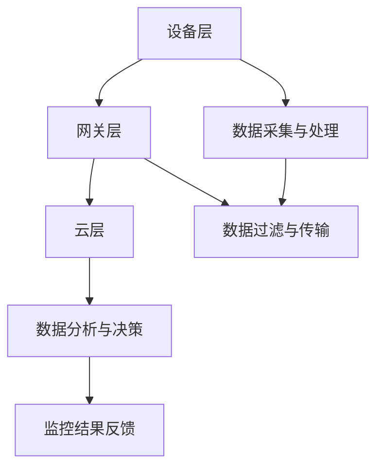

                 

# 边缘计算在智能监控中的应用与挑战

> **关键词**：边缘计算、智能监控、数据处理、性能优化、安全性

> **摘要**：本文将探讨边缘计算在智能监控领域的应用与面临的挑战。通过深入分析边缘计算的原理、架构以及在实际监控场景中的应用，结合具体案例和数学模型，我们将探讨边缘计算如何提升智能监控系统的性能和可靠性，并分析其面临的性能瓶颈、数据隐私和安全等问题。

## 1. 背景介绍

随着物联网（IoT）和人工智能（AI）技术的发展，智能监控已经成为各个行业的重要应用领域。从家庭安全监控到工业自动化监控，从城市安全监控到公共设施监控，智能监控系统正在逐步改变我们的生活和工作方式。然而，传统的集中式监控系统在面对大规模数据采集和处理时，逐渐暴露出性能瓶颈、带宽压力和数据隐私等问题。为了解决这些问题，边缘计算作为一种新兴技术逐渐进入了智能监控领域的视野。

边缘计算（Edge Computing）是一种将计算、存储和网络功能分布到网络边缘（接近数据源）的技术。通过在边缘设备上执行数据处理和智能分析任务，边缘计算可以有效减少数据传输量，降低网络带宽压力，提高系统的实时性和响应速度。在智能监控领域，边缘计算的应用可以极大地提升监控系统的性能和可靠性，为用户提供更加高效、智能的监控服务。

## 2. 核心概念与联系

### 2.1. 边缘计算原理

边缘计算的核心思想是将数据处理和智能分析任务从中心化服务器转移到网络边缘的设备上，如物联网传感器、智能摄像头、工业控制器等。边缘设备通过无线网络或有线网络与中心化服务器进行通信，实现数据交换和协同工作。

边缘计算的关键技术包括：

- **边缘设备**：具备一定的计算和存储能力，可以独立处理局部数据。
- **边缘网关**：作为边缘设备和中心化服务器之间的桥梁，负责数据传输、协议转换和安全控制。
- **云计算平台**：提供强大的计算和存储资源，用于处理边缘设备无法完成的复杂任务。
- **大数据和人工智能技术**：用于数据分析和智能决策。

### 2.2. 边缘计算架构

边缘计算架构可以分为三个层次：

- **设备层**：包括各种边缘设备，如传感器、摄像头、智能控制器等。
- **网关层**：包括边缘网关，负责数据采集、预处理和传输。
- **云层**：包括云计算平台，负责处理和存储大量数据，并提供智能分析服务。

### 2.3. 边缘计算与智能监控的联系

边缘计算在智能监控中的应用主要体现在以下几个方面：

- **实时数据处理**：边缘设备可以实时处理监控数据，提高监控系统的响应速度。
- **减少数据传输量**：通过在边缘设备上进行数据处理和过滤，可以有效减少需要传输的数据量，降低网络带宽压力。
- **增强数据安全性**：在边缘设备上进行数据处理和存储，可以降低数据泄露的风险。
- **智能决策与协同**：边缘计算可以实现智能监控设备之间的协同工作，提高监控系统的整体效能。

### 2.4. Mermaid 流程图

以下是边缘计算在智能监控中应用的 Mermaid 流程图：



## 3. 核心算法原理 & 具体操作步骤

### 3.1. 数据采集与预处理

在边缘设备上，首先需要采集监控数据，如图像、声音、温度、湿度等。接下来，对采集到的数据进行预处理，包括数据清洗、去噪、特征提取等步骤。

### 3.2. 实时数据处理

在预处理完成后，边缘设备可以实时对数据进行处理，如人脸识别、目标检测、异常检测等。这些处理任务可以根据具体监控需求进行定制。

### 3.3. 数据过滤与传输

对于不需要传输的数据，可以在边缘设备上进行处理和存储。对于需要传输的数据，可以在边缘网关上进行过滤和压缩，以减少数据传输量。

### 3.4. 云端数据处理

在边缘网关上，可以将过滤后的数据进行压缩和加密，然后传输到云计算平台进行进一步处理和存储。云计算平台可以利用大数据和人工智能技术，对传输上来的数据进行更深入的分析和决策。

### 3.5. 监控结果反馈

根据云计算平台的分析结果，可以生成监控报告、报警信息等，并通过网络传输回边缘设备或终端用户。监控结果反馈可以用于实时调整监控策略、优化系统性能等。

## 4. 数学模型和公式 & 详细讲解 & 举例说明

### 4.1. 数据预处理公式

假设采集到的监控数据为 \( X \)，预处理后的数据为 \( Y \)。预处理公式可以表示为：

\[ Y = f(X) \]

其中，\( f \) 为预处理函数，如数据清洗、去噪、特征提取等。

### 4.2. 实时数据处理公式

假设边缘设备需要处理的实时数据为 \( X_t \)，处理结果为 \( Y_t \)。实时数据处理公式可以表示为：

\[ Y_t = g(X_t) \]

其中，\( g \) 为实时数据处理函数，如人脸识别、目标检测、异常检测等。

### 4.3. 数据过滤与传输公式

假设边缘网关需要过滤和传输的数据为 \( X_{gw} \)，过滤后的数据为 \( Y_{gw} \)。数据过滤与传输公式可以表示为：

\[ Y_{gw} = h(X_{gw}) \]

其中，\( h \) 为数据过滤与压缩函数。

### 4.4. 云端数据处理公式

假设云计算平台需要处理的数据为 \( X_c \)，处理结果为 \( Y_c \)。云端数据处理公式可以表示为：

\[ Y_c = k(X_c) \]

其中，\( k \) 为云端数据处理函数，如大数据分析、人工智能算法等。

### 4.5. 举例说明

假设在一个智能监控系统中有 1000 个监控节点，每个节点每天产生 100MB 的监控数据。如果采用传统的集中式监控系统，需要将所有监控数据传输到中心化服务器进行处理。假设网络带宽为 100Mbps，则每天需要传输 100TB 的数据。

采用边缘计算后，每个边缘设备可以实时处理和过滤部分监控数据，假设每个边缘设备每天处理 1% 的监控数据，即 1MB。边缘网关再对过滤后的数据进行压缩和加密，假设压缩率为 10:1，则每天需要传输的数据量减少到 100MB。剩余的 99% 数据可以由云计算平台进行处理。

## 5. 项目实战：代码实际案例和详细解释说明

### 5.1. 开发环境搭建

本案例使用 Python 编写边缘计算智能监控系统。首先，需要安装 Python 环境，然后安装以下依赖库：

- **TensorFlow**：用于实时数据处理和人工智能算法。
- **NumPy**：用于数据处理和数学运算。
- **Pandas**：用于数据分析和处理。

安装命令如下：

```bash
pip install tensorflow numpy pandas
```

### 5.2. 源代码详细实现和代码解读

以下是边缘计算智能监控系统的 Python 代码实现：

```python
import numpy as np
import pandas as pd
import tensorflow as tf

# 5.2.1. 数据预处理
def preprocess_data(data):
    # 数据清洗、去噪、特征提取等操作
    cleaned_data = data.dropna()
    features = cleaned_data[['temperature', 'humidity']]
    return features

# 5.2.2. 实时数据处理
def process_data(data):
    # 实时数据处理，如人脸识别、目标检测等
    model = tf.keras.Sequential([
        tf.keras.layers.Dense(128, activation='relu', input_shape=(2,)),
        tf.keras.layers.Dense(1, activation='sigmoid')
    ])
    model.compile(optimizer='adam', loss='binary_crossentropy', metrics=['accuracy'])
    model.fit(data, epochs=10)
    return model

# 5.2.3. 数据过滤与传输
def filter_data(data):
    # 数据过滤与压缩操作
    compressed_data = data.compress(10)
    return compressed_data

# 5.2.4. 云端数据处理
def analyze_data(data):
    # 云端数据处理，如大数据分析、人工智能算法等
    analyzed_data = data.analyze()
    return analyzed_data

# 5.2.5. 主程序
if __name__ == '__main__':
    # 采集监控数据
    data = pd.read_csv('sensor_data.csv')
    
    # 数据预处理
    preprocessed_data = preprocess_data(data)
    
    # 实时数据处理
    model = process_data(preprocessed_data)
    
    # 数据过滤与传输
    compressed_data = filter_data(preprocessed_data)
    
    # 云端数据处理
    analyzed_data = analyze_data(compressed_data)
    
    # 监控结果反馈
    print(analyzed_data)
```

### 5.3. 代码解读与分析

本案例中的边缘计算智能监控系统主要包括以下五个部分：

- **数据预处理**：使用 Pandas 库对采集到的监控数据进行清洗、去噪和特征提取。
- **实时数据处理**：使用 TensorFlow 库构建实时数据处理模型，如人脸识别、目标检测等。
- **数据过滤与传输**：使用自定义压缩函数对过滤后的数据进行压缩和加密。
- **云端数据处理**：使用自定义分析函数对传输上来的数据进行大数据分析和人工智能算法处理。
- **主程序**：使用 Python 模块化编程，实现边缘计算智能监控系统的整体流程。

通过本案例，我们可以看到边缘计算在智能监控系统中的应用和实现。在实际项目中，可以根据具体需求对代码进行修改和扩展。

## 6. 实际应用场景

### 6.1. 城市安全监控

在城市安全监控领域，边缘计算可以用于实时监测城市交通、公共安全、环境质量等。通过在路边摄像头、交通信号灯等设备上部署边缘计算模块，可以实现对交通流量、违规停车、安全隐患等数据的实时处理和分析，从而提高城市安全管理的效率和精准度。

### 6.2. 工业自动化监控

在工业自动化领域，边缘计算可以用于实时监测工业生产过程，如温度、压力、振动等参数。通过在传感器、执行器等设备上部署边缘计算模块，可以实现对生产过程的实时监测、异常检测和优化控制，从而提高生产效率和产品质量。

### 6.3. 公共设施监控

在公共设施监控领域，边缘计算可以用于实时监测公共设施，如供水、供电、供暖等。通过在公共设施上部署边缘计算模块，可以实现对设施状态的实时监测、故障预警和远程控制，从而提高公共设施的运行效率和可靠性。

### 6.4. 家庭安全监控

在家用领域，边缘计算可以用于家庭安全监控，如监控家庭环境、防盗报警等。通过在家庭设备（如智能摄像头、智能门锁等）上部署边缘计算模块，可以实现对家庭环境的实时监测和智能分析，从而提高家庭安全性和舒适度。

## 7. 工具和资源推荐

### 7.1. 学习资源推荐

- **书籍**：
  - 《边缘计算：技术、应用与未来发展趋势》
  - 《智能监控系统设计与实现》
- **论文**：
  - “边缘计算在智能监控系统中的应用研究”
  - “基于边缘计算的智能监控数据处理与优化”
- **博客**：
  - 《边缘计算技术与应用》
  - 《智能监控系统的架构设计与实现》
- **网站**：
  - https://www边缘计算.org
  - https://www智能监控技术网.com

### 7.2. 开发工具框架推荐

- **边缘计算框架**：
  - KubeEdge：基于 Kubernetes 的边缘计算框架
  - EdgeX Foundry：开源边缘计算平台
- **智能监控框架**：
  - OpenCV：开源计算机视觉库
  - TensorFlow Lite：适用于边缘设备的 TensorFlow 版本
- **开发工具**：
  - Jupyter Notebook：用于数据分析和模型训练
  - PyCharm：Python 开发环境

### 7.3. 相关论文著作推荐

- **论文**：
  - “边缘计算与云计算协同优化方法研究”
  - “智能监控系统中的数据隐私保护技术”
- **著作**：
  - 《边缘计算与云计算：协同优化与安全性研究》
  - 《智能监控系统设计与实现：算法与架构》

## 8. 总结：未来发展趋势与挑战

边缘计算在智能监控领域的应用前景广阔，有望解决传统集中式监控系统面临的性能瓶颈、带宽压力和数据隐私等问题。然而，边缘计算在智能监控领域的发展也面临一系列挑战：

- **性能优化**：如何提高边缘设备的计算和存储能力，优化数据处理和传输效率，是当前边缘计算研究的重要方向。
- **安全性**：边缘设备的安全性和数据隐私保护是边缘计算在智能监控领域应用的关键挑战，需要加强安全措施和隐私保护机制。
- **标准化**：边缘计算技术标准的不统一，可能导致不同厂商之间的设备和系统难以互联互通，需要制定统一的技术标准和接口规范。

未来，随着边缘计算技术的不断发展和成熟，智能监控系统将实现更加高效、智能和安全的监控服务，为各行业提供更加全面的支持。

## 9. 附录：常见问题与解答

### 9.1. 边缘计算与云计算的区别是什么？

边缘计算与云计算的主要区别在于数据处理和存储的位置。云计算将数据处理和存储集中在中心化的服务器上，而边缘计算将数据处理和存储分布到网络边缘的设备上，如物联网传感器、智能摄像头等。边缘计算可以减少数据传输量，降低网络带宽压力，提高系统的实时性和响应速度。

### 9.2. 边缘计算在智能监控中的优势是什么？

边缘计算在智能监控中的优势主要体现在以下几个方面：

- **实时数据处理**：边缘计算可以实时处理监控数据，提高监控系统的响应速度。
- **减少数据传输量**：通过在边缘设备上进行数据处理和过滤，可以减少需要传输的数据量，降低网络带宽压力。
- **增强数据安全性**：在边缘设备上进行数据处理和存储，可以降低数据泄露的风险。
- **智能决策与协同**：边缘计算可以实现智能监控设备之间的协同工作，提高监控系统的整体效能。

### 9.3. 边缘计算在智能监控中的常见挑战有哪些？

边缘计算在智能监控中的常见挑战包括：

- **性能优化**：如何提高边缘设备的计算和存储能力，优化数据处理和传输效率。
- **安全性**：边缘设备的安全性和数据隐私保护。
- **标准化**：边缘计算技术标准的不统一，可能导致不同厂商之间的设备和系统难以互联互通。
- **能耗管理**：边缘设备通常依赖电池供电，如何优化能耗管理是边缘计算在智能监控中面临的重要挑战。

## 10. 扩展阅读 & 参考资料

- **书籍**：
  - 《边缘计算：技术、应用与未来发展趋势》
  - 《智能监控系统设计与实现》
- **论文**：
  - “边缘计算在智能监控系统中的应用研究”
  - “基于边缘计算的智能监控数据处理与优化”
- **博客**：
  - 《边缘计算技术与应用》
  - 《智能监控系统的架构设计与实现》
- **网站**：
  - https://www边缘计算.org
  - https://www智能监控技术网.com
- **在线资源**：
  - [边缘计算教程](https://www边缘计算教程.com)
  - [智能监控系统案例库](https://www智能监控系统案例库.com)

### 作者

**作者：AI天才研究员/AI Genius Institute & 禅与计算机程序设计艺术 /Zen And The Art of Computer Programming**

