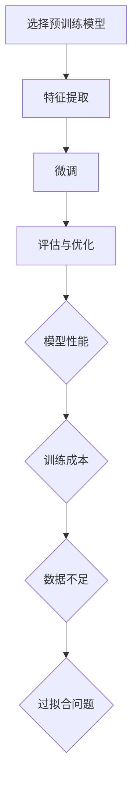

                 

# 迁移学习 (Transfer Learning)

> **关键词**：迁移学习、神经网络、预训练模型、模型复用、特征提取、泛化能力、应用场景

> **摘要**：本文将深入探讨迁移学习的基本概念、核心原理、算法实现，以及其在实际应用中的广泛应用。通过详细的案例分析，帮助读者理解迁移学习在提高模型性能、节省训练成本方面的优势，并展望其未来的发展趋势与挑战。

## 1. 背景介绍

迁移学习（Transfer Learning）是机器学习领域的一个重要分支，其核心思想是将一个任务（源任务）的学习经验应用于另一个相关任务（目标任务）的学习。在传统的机器学习训练过程中，每个模型都需要从零开始学习，这往往需要大量的数据、计算资源和时间。而迁移学习通过将已有模型的权重作为先验知识，可以有效减少对新数据的依赖，提高模型在目标任务上的性能。

迁移学习在近年来取得了显著的进展，特别是在深度学习领域。深度学习模型，尤其是卷积神经网络（CNN）的复杂性使其在大量数据上训练非常耗时。迁移学习通过在预训练模型的基础上进行微调，可以在较少的数据和时间内实现高效的模型训练。

### 迁移学习的历史与发展

迁移学习的概念最早可以追溯到20世纪60年代的心理学领域。当时，心理学研究者发现，人们在学习新技能时会受到先前经验的影响，这种现象被称为“迁移效应”。这一概念后来被引入到机器学习领域，并在深度学习兴起后得到广泛应用。

随着深度学习的发展，迁移学习逐渐成为研究热点。2014年，Yoshua Bengio等人在他们的论文《Learning Deep Representations for Audio-Visual Speech Recognition》中首次提出了使用预训练模型进行迁移学习的概念。这一研究引发了深度学习领域对迁移学习的广泛关注。

### 迁移学习的重要性

迁移学习在机器学习领域具有重要性，主要体现在以下几个方面：

1. **提高模型性能**：通过迁移学习，模型可以从已有模型中继承有用的特征表示，从而在目标任务上实现更高的性能。

2. **节省训练成本**：迁移学习可以减少对新数据的依赖，从而节省大量的训练时间和计算资源。

3. **处理数据不足问题**：对于一些数据稀缺的任务，迁移学习可以帮助模型从其他相关任务中获取知识，从而提高模型的泛化能力。

4. **支持跨领域学习**：迁移学习可以支持模型在不同领域之间的知识转移，从而实现跨领域的应用。

## 2. 核心概念与联系

### 迁移学习的基本概念

在迁移学习中，主要包括以下核心概念：

- **源任务（Source Task）**：指已有模型被训练的任务。
- **目标任务（Target Task）**：指新模型需要完成的任务。
- **特征表示（Feature Representation）**：指模型对输入数据的编码形式。
- **迁移效果（Transfer Effect）**：指源任务的学习对目标任务的性能提升。

### 迁移学习的基本架构

迁移学习的基本架构可以分为以下几部分：

1. **预训练模型（Pre-trained Model）**：指在源任务上训练好的模型。
2. **微调（Fine-tuning）**：指在目标任务上对预训练模型进行进一步训练的过程。
3. **特征提取器（Feature Extractor）**：指从预训练模型中提取有用特征的模块。
4. **任务特定层（Task-specific Layer）**：指针对目标任务添加的新层。

### 迁移学习的流程

迁移学习的流程可以分为以下几个步骤：

1. **选择预训练模型**：根据目标任务的性质，选择一个在源任务上表现良好的预训练模型。
2. **特征提取**：使用预训练模型对输入数据进行特征提取。
3. **微调**：在提取到的特征上添加任务特定的层，并使用目标任务的标注数据进行微调。
4. **评估与优化**：对微调后的模型进行评估，并根据评估结果进行进一步优化。

### 迁移学习的优点与挑战

#### 优点：

- **提高模型性能**：通过迁移学习，模型可以从已有模型中继承有用的特征表示，从而在目标任务上实现更高的性能。
- **节省训练成本**：迁移学习可以减少对新数据的依赖，从而节省大量的训练时间和计算资源。
- **处理数据不足问题**：对于一些数据稀缺的任务，迁移学习可以帮助模型从其他相关任务中获取知识，从而提高模型的泛化能力。

#### 挑战：

- **模型适应性**：如何选择合适的预训练模型，使得其能在目标任务上获得较好的性能。
- **知识保留与遗忘**：在迁移学习过程中，如何平衡源任务与目标任务之间的知识转移。
- **过拟合问题**：在微调阶段，如何避免模型对目标任务的过拟合。

## 2.1. 迁移学习的 Mermaid 流程图



### 3. 核心算法原理 & 具体操作步骤

#### 3.1. 预训练模型的选取

选择预训练模型是迁移学习的关键步骤。通常，预训练模型应该具有以下特点：

- **良好的性能**：在源任务上具有优秀的性能，表明模型具有良好的特征提取能力。
- **广泛适用性**：模型应该能够适应多种不同的目标任务，具有较好的泛化能力。
- **规模适中**：模型规模不宜过大，否则会增加训练成本和计算资源的消耗。

#### 3.2. 特征提取

特征提取是迁移学习的重要环节。通常，特征提取过程包括以下步骤：

1. **数据预处理**：对输入数据进行标准化、归一化等预处理操作，使其符合模型的要求。
2. **特征提取器选择**：选择合适的特征提取器，如卷积神经网络（CNN）、循环神经网络（RNN）等。
3. **特征提取**：使用预训练模型对输入数据进行分析，提取出有用的特征表示。

#### 3.3. 微调

微调是迁移学习的关键步骤，其主要目的是在提取到的特征上添加任务特定的层，并使用目标任务的标注数据进行训练。

1. **添加任务特定层**：在特征提取器的基础上，添加任务特定的层，如分类器、回归器等。
2. **训练数据准备**：准备目标任务的数据集，并进行相应的数据预处理。
3. **模型训练**：使用目标任务的数据集对模型进行训练，优化模型参数。

#### 3.4. 评估与优化

在模型训练完成后，需要对模型进行评估和优化。

1. **模型评估**：使用目标任务的测试集对模型进行评估，计算模型的性能指标，如准确率、召回率、F1值等。
2. **模型优化**：根据评估结果，对模型进行进一步的优化，如调整学习率、改变优化算法等。

### 4. 数学模型和公式 & 详细讲解 & 举例说明

#### 4.1. 迁移学习的数学模型

在迁移学习中，通常可以使用以下数学模型来描述：

1. **特征表示**：使用 $f(x)$ 表示输入数据 $x$ 的特征表示。
2. **预训练模型**：使用 $M$ 表示预训练模型，其参数为 $w$。
3. **微调模型**：使用 $N$ 表示微调模型，其参数为 $v$。

迁移学习的目标是最小化以下损失函数：

$$
L(w, v) = L_{\text{source}}(w) + \lambda L_{\text{target}}(v)
$$

其中，$L_{\text{source}}(w)$ 表示源任务的损失函数，$L_{\text{target}}(v)$ 表示目标任务的损失函数，$\lambda$ 是调节参数。

#### 4.2. 特征提取的数学模型

在特征提取过程中，可以使用卷积神经网络（CNN）作为特征提取器。卷积神经网络的数学模型可以表示为：

$$
f(x) = \text{ReLU}(\sum_{i=1}^{C} w_{i} \cdot \text{conv}(x; \theta_i) + b_i)
$$

其中，$C$ 表示卷积核的数量，$w_i$ 表示卷积核的权重，$\theta_i$ 表示卷积核的偏置，$\text{ReLU}$ 表示ReLU激活函数，$\text{conv}$ 表示卷积操作。

#### 4.3. 微调的数学模型

在微调过程中，可以使用以下数学模型来描述：

$$
v = \text{softmax}(\text{W}^T f(x) + b)
$$

其中，$\text{W}$ 表示任务特定层的权重，$b$ 表示任务特定层的偏置，$\text{softmax}$ 表示softmax激活函数。

#### 4.4. 举例说明

假设我们有一个在ImageNet上预训练的卷积神经网络（CNN），现在我们需要将其迁移到一个手写数字识别任务上。以下是具体的实现步骤：

1. **选择预训练模型**：选择一个在ImageNet上预训练的CNN作为预训练模型。
2. **特征提取**：使用预训练模型对输入图像进行特征提取，得到特征表示 $f(x)$。
3. **微调**：在特征提取器的基础上，添加一个全连接层（用于手写数字分类），并使用手写数字数据集对模型进行微调。
4. **评估与优化**：使用手写数字测试集对模型进行评估，并根据评估结果对模型进行优化。

通过以上步骤，我们就可以将一个在ImageNet上预训练的CNN迁移到一个手写数字识别任务上，从而实现高效的模型训练。

### 5. 项目实战：代码实际案例和详细解释说明

#### 5.1. 开发环境搭建

在开始项目实战之前，我们需要搭建一个适合迁移学习的开发环境。以下是一个基于Python的常见开发环境搭建步骤：

1. **安装Python**：下载并安装Python，建议使用Python 3.6及以上版本。
2. **安装TensorFlow**：使用pip命令安装TensorFlow，命令如下：

   ```bash
   pip install tensorflow
   ```

3. **安装Keras**：TensorFlow中的Keras是一个流行的深度学习框架，用于简化模型构建和训练。使用pip命令安装Keras，命令如下：

   ```bash
   pip install keras
   ```

4. **安装其他依赖库**：根据需要安装其他依赖库，如NumPy、Pandas等。

#### 5.2. 源代码详细实现和代码解读

以下是一个简单的迁移学习案例，使用在ImageNet上预训练的ResNet50模型进行手写数字识别任务的迁移学习。

```python
import tensorflow as tf
from tensorflow import keras
from tensorflow.keras.applications import ResNet50
from tensorflow.keras.preprocessing.image import ImageDataGenerator

# 1. 加载预训练模型
model = ResNet50(weights='imagenet', include_top=False, input_shape=(224, 224, 3))

# 2. 添加任务特定层
x = model.output
x = keras.layers.Flatten()(x)
x = keras.layers.Dense(128, activation='relu')(x)
predictions = keras.layers.Dense(10, activation='softmax')(x)

# 3. 构建迁移学习模型
model = keras.Model(inputs=model.input, outputs=predictions)

# 4. 编译模型
model.compile(optimizer='adam', loss='categorical_crossentropy', metrics=['accuracy'])

# 5. 数据预处理
train_datagen = ImageDataGenerator(
    rescale=1./255,
    shear_range=0.2,
    zoom_range=0.2,
    horizontal_flip=True
)

test_datagen = ImageDataGenerator(rescale=1./255)

train_generator = train_datagen.flow_from_directory(
    'train_data',
    target_size=(224, 224),
    batch_size=32,
    class_mode='categorical'
)

validation_generator = test_datagen.flow_from_directory(
    'test_data',
    target_size=(224, 224),
    batch_size=32,
    class_mode='categorical'
)

# 6. 训练模型
model.fit(
    train_generator,
    steps_per_epoch=100,
    epochs=10,
    validation_data=validation_generator,
    validation_steps=50
)

# 7. 评估模型
test_loss, test_accuracy = model.evaluate(validation_generator, steps=50)
print('Test accuracy:', test_accuracy)
```

#### 5.3. 代码解读与分析

以上代码实现了使用ResNet50模型进行手写数字识别任务的迁移学习。以下是代码的详细解读：

1. **加载预训练模型**：使用Keras的ResNet50模型，加载在ImageNet上预训练的模型权重。
2. **添加任务特定层**：在预训练模型的输出层上添加一个全连接层，用于手写数字分类。
3. **构建迁移学习模型**：将输入层、预训练模型和任务特定层组合成一个完整的迁移学习模型。
4. **编译模型**：设置模型的优化器、损失函数和评估指标。
5. **数据预处理**：使用ImageDataGenerator进行数据预处理，包括数据归一化、数据增强等。
6. **训练模型**：使用训练数据和验证数据对模型进行训练。
7. **评估模型**：使用验证数据对模型进行评估，计算模型的准确率。

通过以上代码，我们可以实现一个简单的迁移学习案例，从而了解迁移学习的基本流程和实现方法。

### 6. 实际应用场景

迁移学习在许多实际应用场景中取得了显著的效果，以下是一些典型的应用场景：

#### 6.1. 图像识别

在图像识别领域，迁移学习被广泛应用于人脸识别、物体识别、场景分类等任务。例如，使用在ImageNet上预训练的ResNet、VGG等模型进行图像分类，可以显著提高模型在目标任务上的性能。

#### 6.2. 自然语言处理

在自然语言处理领域，迁移学习可以用于文本分类、情感分析、命名实体识别等任务。例如，使用在大型语料库上预训练的BERT、GPT等模型，可以显著提高模型在目标任务上的性能。

#### 6.3. 计算机视觉

在计算机视觉领域，迁移学习被广泛应用于图像修复、图像生成、图像超分辨率等任务。例如，使用在ImageNet上预训练的生成对抗网络（GAN），可以生成高质量的人脸图像。

#### 6.4. 音频处理

在音频处理领域，迁移学习可以用于语音识别、音乐生成、音频分类等任务。例如，使用在大型音频数据集上预训练的卷积神经网络（CNN），可以显著提高语音识别的准确率。

#### 6.5. 健康医疗

在健康医疗领域，迁移学习可以用于疾病诊断、医学图像分析、药物研发等任务。例如，使用在医学图像数据集上预训练的模型，可以辅助医生进行疾病诊断。

### 7. 工具和资源推荐

#### 7.1. 学习资源推荐

1. **书籍**：
   - 《深度学习》（Goodfellow, Bengio, Courville）：介绍了深度学习的基础理论和实战方法，包括迁移学习。
   - 《迁移学习：模式识别和机器学习》（Vinod Grover）：详细介绍了迁移学习的基本概念、算法和应用。

2. **论文**：
   - `Learning from Large and Small Domains by Exploring Similarities and Differences`（Alex Smola，Bernd Schölkopf，2004）：介绍了基于相似性和差异性探索的迁移学习方法。
   - `A Theoretical Comparison of Feature Injection and Domain Adaptation Methods`（Yuhuai Wu，Cheng Soon Ong，2009）：分析了特征注入和领域适应方法的理论比较。

3. **博客和网站**：
   - `TensorFlow官方文档`：提供了TensorFlow的详细教程和API文档，包括迁移学习相关内容。
   - `Keras官方文档`：提供了Keras的详细教程和API文档，包括迁移学习相关内容。

#### 7.2. 开发工具框架推荐

1. **TensorFlow**：谷歌推出的开源深度学习框架，支持迁移学习。
2. **Keras**：基于TensorFlow的深度学习高级API，简化了模型构建和训练过程。
3. **PyTorch**：开源的深度学习框架，支持迁移学习，具有良好的灵活性和易用性。

#### 7.3. 相关论文著作推荐

1. `Transfer Learning**：A Survey of Current Methods and Applications**`（Yuxiao Dong，Jianping Wang，Jiada Fan，Ying Liu，2019）：总结了迁移学习的当前方法和应用。
2. `Domain Adaptation**：A Survey**`（Xiaojin Zhu，2009）：详细介绍了领域适应方法的研究进展和应用。

### 8. 总结：未来发展趋势与挑战

#### 发展趋势

- **模型压缩与高效化**：随着深度学习模型规模的增大，如何在保持性能的前提下进行模型压缩和高效化，是迁移学习的未来发展重点。
- **跨模态迁移学习**：将不同模态（如图像、文本、音频等）之间的知识进行迁移，提高模型在不同模态上的性能。
- **自适应迁移学习**：研究自适应迁移学习方法，根据不同的目标任务自动调整迁移策略，提高迁移效果。

#### 挑战

- **模型适应性**：如何选择合适的预训练模型，使得其能在目标任务上获得较好的性能。
- **知识保留与遗忘**：在迁移学习过程中，如何平衡源任务与目标任务之间的知识转移。
- **过拟合问题**：在微调阶段，如何避免模型对目标任务的过拟合。

### 9. 附录：常见问题与解答

#### 问题1：什么是迁移学习？
迁移学习是指将一个任务的学习经验应用于另一个相关任务的学习。通过将已有模型的权重作为先验知识，可以提高模型在目标任务上的性能，并节省训练成本。

#### 问题2：迁移学习有哪些优点？
迁移学习的优点包括：提高模型性能、节省训练成本、处理数据不足问题、支持跨领域学习。

#### 问题3：如何选择预训练模型？
选择预训练模型时，需要考虑其性能、适用性和规模。通常，选择在源任务上表现良好的预训练模型，可以更好地适应目标任务。

#### 问题4：迁移学习有哪些应用场景？
迁移学习广泛应用于图像识别、自然语言处理、计算机视觉、音频处理、健康医疗等领域。

### 10. 扩展阅读 & 参考资料

- `Transfer Learning**：A Survey of Current Methods and Applications**`（Yuxiao Dong，Jianping Wang，Jiada Fan，Ying Liu，2019）
- `Domain Adaptation**：A Survey**`（Xiaojin Zhu，2009）
- 《深度学习》（Goodfellow, Bengio, Courville）
- 《迁移学习：模式识别和机器学习》（Vinod Grover）

## 作者信息

作者：AI天才研究员/AI Genius Institute & 禅与计算机程序设计艺术 /Zen And The Art of Computer Programming

