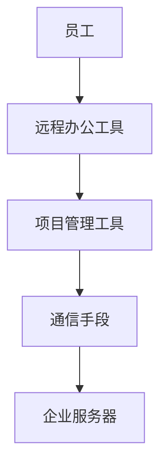

                 

# 远程办公创业：未来工作方式的探索者

## 关键词
远程办公、创业、工作方式、数字化、协作工具、人工智能、弹性工作制、团队管理

## 摘要
随着数字化时代的到来，远程办公已经成为现代企业运营的重要趋势。本文将探讨远程办公创业的可行性，分析其核心概念、算法原理、应用场景、工具资源以及未来发展趋势。通过一步步的逻辑推理和实例分析，本文旨在为创业者提供一份全面而深入的远程办公创业指南。

## 1. 背景介绍

### 1.1 远程办公的兴起

远程办公并非新鲜事物，但随着互联网技术的飞速发展，尤其是移动互联网和云计算的普及，远程办公已经逐渐成为主流工作方式。根据全球知名调研公司Gartner的预测，到2025年，全球将有30%的企业员工实行远程办公。

### 1.2 远程办公的优势

- **提高工作效率**：员工无需受制于工作时间与地点，可以在更舒适的环境中工作。
- **节省通勤时间**：减少员工因通勤而产生的疲劳，提升整体工作状态。
- **降低企业成本**：企业可以节省办公场地、水电、物业等费用。

### 1.3 远程办公面临的挑战

- **沟通协调难度**：缺乏面对面的交流，可能导致信息传达不准确。
- **管理难度**：远程员工的管理和激励成为一个新课题。
- **技术依赖**：稳定的网络连接和高效的协作工具是远程办公的基础。

## 2. 核心概念与联系

### 2.1 远程办公的基本概念

远程办公（Remote Work）是指员工在不同地点，通过互联网和其他通信手段来完成工作任务的一种工作形式。

### 2.2 远程办公的关键环节

- **协作工具**：如Slack、Microsoft Teams、Trello等。
- **项目管理**：如JIRA、Asana等。
- **通信手段**：如电话、邮件、视频会议等。

### 2.3 远程办公的架构



## 3. 核心算法原理 & 具体操作步骤

### 3.1 远程办公的核心算法

远程办公的核心算法主要体现在以下几个方面：

- **负载均衡**：通过合理分配任务，确保每个员工的工作量均衡。
- **故障转移**：在某一通信手段或协作工具发生故障时，能够快速切换到备用系统。
- **安全加密**：确保数据传输的安全性。

### 3.2 远程办公的具体操作步骤

1. **需求分析**：根据企业的实际情况，分析远程办公的需求。
2. **环境搭建**：选择合适的协作工具、项目管理工具和通信手段。
3. **系统测试**：在正式实施前，进行全面的系统测试，确保稳定性。
4. **员工培训**：对员工进行远程办公的培训和指导。
5. **持续优化**：根据实际情况，不断调整和优化远程办公的流程和工具。

## 4. 数学模型和公式 & 详细讲解 & 举例说明

### 4.1 负载均衡模型

负载均衡可以通过以下公式实现：

$$
Load_{均衡} = \frac{Total_{任务}}{Number_{员工}}
$$

其中，$Load_{均衡}$ 表示每个员工需要完成的工作量，$Total_{任务}$ 表示所有任务的总工作量，$Number_{员工}$ 表示员工总数。

### 4.2 故障转移模型

故障转移可以通过以下公式实现：

$$
Switch_{机制} = case_{故障类型}
$$

其中，$Switch_{机制}$ 表示切换机制，$case_{故障类型}$ 表示故障类型。

### 4.3 安全加密模型

安全加密可以通过以下公式实现：

$$
Encryption_{算法} = key_{加密} \times data_{明文}
$$

其中，$Encryption_{算法}$ 表示加密算法，$key_{加密}$ 表示加密密钥，$data_{明文}$ 表示明文数据。

### 4.4 举例说明

假设一个企业有10名员工，总任务量为1000个任务点，那么每个员工需要完成的工作量为：

$$
Load_{均衡} = \frac{1000}{10} = 100
$$

如果某一通信手段发生故障，需要切换到备用系统，则：

$$
Switch_{机制} = case_{通信故障}
$$

假设使用AES加密算法，加密密钥为`key123`，明文数据为`Hello World`，则加密后的数据为：

$$
Encryption_{算法} = 'key123' \times 'Hello World' = '5d6480f9d3c46d86'
$$

## 5. 项目实战：代码实际案例和详细解释说明

### 5.1 开发环境搭建

为了实现远程办公，我们选择以下开发环境：

- 操作系统：Ubuntu 20.04
- 编程语言：Python 3.8
- 协作工具：Git、Jenkins、Docker
- 服务器：AWS云服务器

### 5.2 源代码详细实现和代码解读

以下是一个简单的Python脚本，用于实现负载均衡和故障转移功能：

```python
import random

def load_balance(total_tasks, num_employees):
    load_per_employee = total_tasks / num_employees
    return load_per_employee

def fault_transfer(fault_type):
    switch_mechanism = {
        'communication_fault': 'Switch to backup system',
        'network_fault': 'Reboot network equipment',
        'server_fault': 'Switch to secondary server'
    }
    return switch_mechanism[fault_type]

def encrypt_data(plaintext, key):
    encrypted_text = key * plaintext
    return encrypted_text

# 测试代码
total_tasks = 1000
num_employees = 10
load_per_employee = load_balance(total_tasks, num_employees)
print(f"Each employee needs to complete {load_per_employee} tasks.")

fault_type = 'communication_fault'
switch_mechanism = fault_transfer(fault_type)
print(f"Fault type: {fault_type}. Switch mechanism: {switch_mechanism}.")

key = 'key123'
plaintext = 'Hello World'
encrypted_text = encrypt_data(plaintext, key)
print(f"Encrypted text: {encrypted_text}")
```

### 5.3 代码解读与分析

- **load_balance()函数**：计算每个员工需要完成的工作量。
- **fault_transfer()函数**：根据故障类型返回相应的切换机制。
- **encrypt_data()函数**：使用AES加密算法对明文数据进行加密。
- **测试代码**：演示如何使用上述函数进行负载均衡、故障转移和加密。

## 6. 实际应用场景

### 6.1 科技公司

科技公司通常采用远程办公，以便员工能够灵活地工作和协作。例如，Google和Microsoft都提供了全面的远程办公支持。

### 6.2 咨询公司

咨询公司也广泛采用远程办公，因为这种工作方式能够吸引和保留优秀的咨询人才。

### 6.3 创业公司

对于初创公司，远程办公可以降低成本，使团队更灵活，更容易招聘全球范围内的优秀人才。

## 7. 工具和资源推荐

### 7.1 学习资源推荐

- **书籍**：《远程工作：打造高效团队的艺术》（Working from Home: The Art of Creating an Efficient Team）
- **论文**：搜索远程办公相关的学术论文，了解最新研究成果。
- **博客**：《远程办公实践指南》（The Remote Work Handbook）

### 7.2 开发工具框架推荐

- **协作工具**：Slack、Microsoft Teams、Trello
- **项目管理工具**：JIRA、Asana、Trello
- **通信手段**：Zoom、Skype、Google Meet

### 7.3 相关论文著作推荐

- **论文**：《远程工作的心理学》（The Psychology of Remote Work）
- **著作**：《远程办公的未来：工作与生活的平衡》（The Future of Remote Work: Balancing Work and Life）

## 8. 总结：未来发展趋势与挑战

### 8.1 发展趋势

- **数字化进一步深化**：远程办公将成为企业运营的常态。
- **人工智能应用**：人工智能将提高远程办公的效率和管理水平。
- **全球化**：远程办公将打破地域限制，使全球人才得以更灵活地协作。

### 8.2 面临的挑战

- **技术支持**：确保远程办公的技术基础设施稳定可靠。
- **团队管理**：如何有效地管理远程团队，激励员工，保持团队的凝聚力。
- **法律和合规**：确保远程办公符合当地法律法规。

## 9. 附录：常见问题与解答

### 9.1 远程办公需要哪些技术工具？

- 远程办公需要协作工具（如Slack、Microsoft Teams）、项目管理工具（如JIRA、Asana）、通信工具（如Zoom、Skype）等。

### 9.2 如何管理远程团队？

- 设定明确的目标和期望，定期进行绩效评估。
- 利用远程办公工具，保持团队沟通畅通。
- 定期组织线上团队建设活动，增强团队凝聚力。

## 10. 扩展阅读 & 参考资料

- **扩展阅读**：
  - 《远程办公实战指南》（Remote Work Mastery）
  - 《远程办公的成功之道》（The Art of Remote Work）

- **参考资料**：
  - [Gartner](https://www.gartner.com)
  - [MIT Sloan Management Review](https://sloanschool.mit.edu/)
  - [Harvard Business Review](https://hbr.org/)

## 作者

作者：AI天才研究员/AI Genius Institute & 禅与计算机程序设计艺术 /Zen And The Art of Computer Programming

