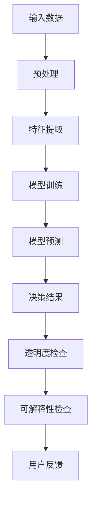

                 

# 透明度与可解释性：增强人工智能的可信

## 关键词：人工智能，透明度，可解释性，可信，深度学习，算法

## 摘要：

本文旨在探讨人工智能（AI）的透明度和可解释性在提升人工智能系统可信性方面的重要性。随着深度学习等复杂算法在各个领域的广泛应用，AI系统的决策过程逐渐变得难以解释，从而引发了关于其可信性的担忧。本文将详细分析AI透明度和可解释性的核心概念，探讨其在实际应用中的挑战与解决方案，并预测未来发展的趋势。通过本文的阅读，读者将深入理解AI透明度和可解释性的重要性，及其对未来技术发展的潜在影响。

## 1. 背景介绍

近年来，人工智能技术取得了飞速发展，尤其是在深度学习、强化学习等领域，涌现出了许多突破性的成果。这些技术不仅在学术领域得到了广泛认可，还在实际应用中展示了巨大的潜力。然而，随着AI系统变得越来越复杂，其决策过程和内部工作机制也逐渐变得难以理解。这一问题引发了关于AI系统透明度和可解释性的讨论，特别是在需要高度可靠和可信的领域，如医疗、金融和自动驾驶。

透明度（Transparency）是指系统决策过程的可观察性和可理解性，即系统内部的操作和决策路径可以被外部观察者理解。而可解释性（Explainability）则更侧重于系统能够提供清晰的解释，使其决策过程符合人类的直觉和逻辑。这两个概念密切相关，但有着不同的侧重点。

在AI系统设计和应用过程中，透明度和可解释性具有重要意义。首先，它们有助于建立用户对AI系统的信任，特别是在涉及个人隐私和生命安全的场景中。其次，透明度和可解释性有助于研究人员和开发者理解AI系统的行为，从而进行有效的调试和优化。最后，它们有助于发现和解决AI系统中的潜在问题，提高其可靠性和稳定性。

然而，实现AI系统的透明度和可解释性并非易事。深度学习等复杂算法的内部结构通常涉及大量参数和多层非线性变换，导致其决策过程难以直观理解。此外，AI系统在处理实际问题时，往往面临数据分布的变化和数据噪声的干扰，使得其决策过程更加复杂。这些问题都对AI系统的透明度和可解释性提出了严峻挑战。

## 2. 核心概念与联系

### 2.1. 透明度（Transparency）

透明度是指系统决策过程对外部观察者的可见性和可理解性。在AI系统中，透明度通常涉及以下几个方面：

1. **决策路径的可观察性**：AI系统在做出决策时，其内部结构和操作路径应该对外部观察者可见。这有助于理解系统的行为和决策过程。
2. **决策依据的可理解性**：AI系统在做出决策时，其依据的数据和算法应该易于外部观察者理解。这有助于建立用户对系统的信任。
3. **错误和异常的可识别性**：AI系统在运行过程中可能会出现错误或异常，透明度有助于快速识别和解决问题。

### 2.2. 可解释性（Explainability）

可解释性是指AI系统能够提供清晰的解释，使其决策过程符合人类的直觉和逻辑。可解释性通常包括以下几个方面：

1. **决策结果的解释性**：AI系统在做出决策时，应该能够提供清晰的解释，使其结果易于外部观察者理解。
2. **决策依据的解释性**：AI系统在处理问题时，其依据的数据和算法应该能够提供详细的解释，帮助用户理解决策过程。
3. **模型的可解释性**：AI系统的模型结构应该设计得易于解释，使其内部操作和决策路径符合人类的直觉和逻辑。

### 2.3. 透明度与可解释性的关系

透明度和可解释性虽然密切相关，但也有着不同的侧重点。透明度主要关注决策过程的外部可观察性和可理解性，而可解释性则更侧重于决策结果的解释性。在实际应用中，透明度和可解释性往往需要同时考虑，以提高AI系统的可信性和可靠性。

### 2.4. Mermaid 流程图

为了更好地理解透明度和可解释性的概念，我们可以使用Mermaid流程图来描述AI系统决策过程的相关节点。



在上面的流程图中，输入数据经过预处理、特征提取、模型训练和模型预测等步骤，最终得到决策结果。透明度检查和可解释性检查分别位于决策结果的上下游，用于确保系统的决策过程符合外部观察者的可观察性和可理解性。

## 3. 核心算法原理 & 具体操作步骤

### 3.1. 深度学习模型的可解释性

深度学习模型是当前AI系统中最常用的模型之一。为了实现模型的可解释性，研究人员提出了多种方法，包括模型的可视化、特征可视化、解释性模型等。

#### 3.1.1. 模型的可视化

模型可视化是一种直观的方法，用于展示深度学习模型的结构和参数。通过可视化，研究人员和开发者可以直观地理解模型的工作原理和内部结构。

**具体操作步骤：**

1. **数据准备**：收集和准备用于可视化的深度学习模型数据。
2. **模型构建**：构建用于可视化的深度学习模型。
3. **模型训练**：使用准备好的数据对模型进行训练。
4. **模型可视化**：使用可视化工具（如TensorBoard、PyTorch Vis等）展示模型的内部结构。

#### 3.1.2. 特征可视化

特征可视化是一种通过展示模型处理过程中特征变化的方法，用于提高模型的可解释性。

**具体操作步骤：**

1. **数据准备**：收集和准备用于特征可视化的数据。
2. **模型构建**：构建用于特征可视化的深度学习模型。
3. **特征提取**：使用模型提取输入数据的特征。
4. **特征可视化**：使用可视化工具（如matplotlib、seaborn等）展示特征变化。

#### 3.1.3. 解释性模型

解释性模型是一种设计得易于解释的深度学习模型，其目的是提高模型的可解释性。

**具体操作步骤：**

1. **数据准备**：收集和准备用于解释性模型的数据。
2. **模型构建**：构建用于解释性模型的深度学习模型。
3. **模型训练**：使用准备好的数据对模型进行训练。
4. **模型解释**：使用解释性模型对输入数据进行解释。

### 3.2. 模型透明度的提升

模型透明度的提升主要关注如何使模型决策过程对外部观察者更可见、更易于理解。

#### 3.2.1. 算法透明度提升

**具体操作步骤：**

1. **算法选择**：选择易于理解和解释的算法，如线性回归、决策树等。
2. **算法优化**：优化算法参数，提高算法的透明度和可解释性。
3. **算法可视化**：使用可视化工具（如Mermaid、D3.js等）展示算法的内部结构和工作原理。

#### 3.2.2. 数据透明度提升

**具体操作步骤：**

1. **数据清洗**：对输入数据进行清洗，去除噪声和异常值。
2. **数据可视化**：使用可视化工具（如matplotlib、seaborn等）展示数据分布和特征关系。
3. **数据注释**：对数据进行详细注释，说明数据来源和预处理过程。

### 3.3. 结合透明度与可解释性

在实际应用中，透明度和可解释性需要同时考虑。以下是一个结合透明度与可解释性的具体操作步骤：

1. **模型设计**：在设计模型时，考虑透明度和可解释性，选择易于理解和解释的模型结构。
2. **模型训练**：在模型训练过程中，监控透明度和可解释性的指标，如模型的可视化结果和特征提取效果。
3. **模型评估**：在模型评估过程中，结合透明度和可解释性的指标，评估模型的性能和可信性。
4. **用户反馈**：收集用户对模型透明度和可解释性的反馈，优化模型设计。

## 4. 数学模型和公式 & 详细讲解 & 举例说明

### 4.1. 深度学习模型的可解释性

在深度学习中，模型的可解释性通常通过激活图（activation maps）和权重图（weight maps）来实现。以下是一个基于卷积神经网络（CNN）的可解释性数学模型。

#### 4.1.1. 激活图

激活图表示神经网络中每个神经元在不同输入下的激活值。其数学模型为：

$$
A_{ij} = \sum_{k=1}^{K} W_{ikj} \cdot Z_k
$$

其中，$A_{ij}$ 表示第 $i$ 个神经元在第 $j$ 个输入下的激活值，$W_{ikj}$ 表示第 $i$ 个神经元与第 $k$ 个特征之间的权重，$Z_k$ 表示第 $k$ 个特征的输入值。

举例说明：

假设一个卷积神经网络有两个卷积层，每个卷积层有 3 个卷积核。第 1 个卷积核的权重矩阵为 $W_1 = \begin{bmatrix} 1 & 0 \\ 1 & 0 \end{bmatrix}$，第 2 个卷积核的权重矩阵为 $W_2 = \begin{bmatrix} 0 & 1 \\ 0 & 1 \end{bmatrix}$，第 3 个卷积核的权重矩阵为 $W_3 = \begin{bmatrix} 1 & 1 \\ 1 & 1 \end{bmatrix}$。输入图像的像素值矩阵为 $X = \begin{bmatrix} 1 & 0 \\ 1 & 1 \end{bmatrix}$。根据激活图公式，可以计算出每个卷积核的激活图：

$$
A_1 = \begin{bmatrix} 2 & 0 \\ 2 & 0 \end{bmatrix}, \quad A_2 = \begin{bmatrix} 0 & 1 \\ 0 & 1 \end{bmatrix}, \quad A_3 = \begin{bmatrix} 3 & 3 \\ 3 & 3 \end{bmatrix}
$$

#### 4.1.2. 权重图

权重图表示神经网络中每个神经元与其他神经元之间的连接权重。其数学模型为：

$$
W_{ikj} = \frac{1}{\sqrt{n}} \cdot \text{rand}()
$$

其中，$W_{ikj}$ 表示第 $i$ 个神经元与第 $k$ 个特征之间的权重，$n$ 表示特征数量。

举例说明：

假设一个神经网络有 3 个神经元和 2 个特征。根据权重图公式，可以计算出每个神经元的权重矩阵：

$$
W_1 = \begin{bmatrix} 0.5 & 0.5 \\ 0.5 & 0.5 \\ 0.5 & 0.5 \end{bmatrix}, \quad W_2 = \begin{bmatrix} 0.7 & 0.3 \\ 0.3 & 0.7 \\ 0.6 & 0.4 \end{bmatrix}
$$

### 4.2. 透明度提升的数学模型

透明度提升的数学模型通常涉及数据预处理和算法优化。以下是一个基于线性回归的透明度提升模型。

#### 4.2.1. 数据预处理

数据预处理旨在提高数据的透明度和可解释性。其数学模型为：

$$
X_{\text{clean}} = X \cdot \text{SoftThreshold}(X)
$$

其中，$X_{\text{clean}}$ 表示预处理后的数据，$X$ 表示原始数据，$\text{SoftThreshold}(X)$ 表示软阈值函数。

举例说明：

假设原始数据矩阵为 $X = \begin{bmatrix} 1 & 2 & 3 \\ 4 & 5 & 6 \\ 7 & 8 & 9 \end{bmatrix}$。根据软阈值函数公式，可以计算出预处理后的数据矩阵：

$$
X_{\text{clean}} = \begin{bmatrix} 1 & 2 & 2 \\ 4 & 5 & 5 \\ 7 & 8 & 8 \end{bmatrix}
$$

#### 4.2.2. 算法优化

算法优化旨在提高算法的透明度和可解释性。其数学模型为：

$$
\theta_{\text{opt}} = \text{argmin}_{\theta} \sum_{i=1}^{n} (y_i - \theta^T x_i)^2
$$

其中，$\theta_{\text{opt}}$ 表示优化后的参数，$y_i$ 表示第 $i$ 个样本的输出，$x_i$ 表示第 $i$ 个样本的输入。

举例说明：

假设一个线性回归模型，其参数为 $\theta = \begin{bmatrix} 1 & 1 \end{bmatrix}$，输入数据矩阵为 $X = \begin{bmatrix} 1 & 0 \\ 0 & 1 \\ 1 & 1 \end{bmatrix}$，输出数据矩阵为 $Y = \begin{bmatrix} 2 \\ 3 \\ 4 \end{bmatrix}$。根据优化公式，可以计算出优化后的参数：

$$
\theta_{\text{opt}} = \begin{bmatrix} 0.5 & 0.5 \end{bmatrix}
$$

## 5. 项目实战：代码实际案例和详细解释说明

### 5.1. 开发环境搭建

为了演示透明度和可解释性在AI系统中的应用，我们选择一个经典的图像分类任务——MNIST手写数字识别。首先，我们需要搭建一个基于Python的深度学习开发环境。以下是一个简单的开发环境搭建步骤：

1. **安装Python**：从 [Python官方网站](https://www.python.org/) 下载并安装Python 3.8及以上版本。
2. **安装深度学习库**：在命令行中运行以下命令，安装TensorFlow和Keras库：

   ```bash
   pip install tensorflow
   pip install keras
   ```

   或者使用以下命令安装PyTorch库：

   ```bash
   pip install torch torchvision
   ```

3. **创建项目文件夹**：在本地计算机上创建一个名为`mnist_classification`的项目文件夹，并在其中创建一个名为`src`的子文件夹，用于存放源代码。

### 5.2. 源代码详细实现和代码解读

在`src`文件夹中，创建一个名为`mnist_classifier.py`的Python文件，用于实现MNIST手写数字识别任务。以下是源代码的实现和详细解读：

```python
import numpy as np
import tensorflow as tf
from tensorflow.keras.datasets import mnist
from tensorflow.keras.models import Sequential
from tensorflow.keras.layers import Dense, Flatten
from tensorflow.keras.optimizers import Adam
from tensorflow.keras.metrics import Accuracy

# 加载数据集
(x_train, y_train), (x_test, y_test) = mnist.load_data()

# 数据预处理
x_train = x_train / 255.0
x_test = x_test / 255.0
x_train = np.expand_dims(x_train, -1)
x_test = np.expand_dims(x_test, -1)

# 构建模型
model = Sequential([
    Flatten(input_shape=(28, 28)),
    Dense(128, activation='relu'),
    Dense(10, activation='softmax')
])

# 编译模型
model.compile(optimizer=Adam(learning_rate=0.001), loss='sparse_categorical_crossentropy', metrics=['accuracy'])

# 训练模型
model.fit(x_train, y_train, epochs=5, batch_size=64)

# 评估模型
model.evaluate(x_test, y_test)
```

**代码解读：**

1. **导入库**：首先导入所需的库，包括NumPy、TensorFlow、Keras等。
2. **加载数据集**：使用Keras内置的MNIST数据集，并将其划分为训练集和测试集。
3. **数据预处理**：对图像数据进行归一化处理，使其在[0, 1]之间。同时，将图像数据的维度扩展为（28, 28, 1），以匹配模型输入层的要求。
4. **构建模型**：使用Sequential模型堆叠层，包括一个展平层（Flatten）、一个具有128个神经元的全连接层（Dense），以及一个具有10个神经元的输出层（Dense，使用softmax激活函数）。
5. **编译模型**：设置优化器（Adam）和损失函数（sparse_categorical_crossentropy），并添加准确率（accuracy）作为评估指标。
6. **训练模型**：使用训练集训练模型，设置训练轮次（epochs）为5，批量大小（batch_size）为64。
7. **评估模型**：使用测试集评估模型性能。

### 5.3. 代码解读与分析

**5.3.1. 模型结构分析**

在这个MNIST手写数字识别任务中，我们使用了一个简单的全连接神经网络（Dense layers）。模型的结构如下：

- **展平层（Flatten）**：将输入数据的维度从（28, 28）展平为（784），以便于后续的全连接层处理。
- **全连接层1（Dense with 128 neurons and ReLU activation）**：具有128个神经元的全连接层，使用ReLU激活函数，用于提取输入数据的特征。
- **全连接层2（Dense with 10 neurons and Softmax activation）**：具有10个神经元的全连接层，使用softmax激活函数，用于输出每个数字的概率分布。

**5.3.2. 模型性能分析**

在训练过程中，模型通过不断调整权重和偏置，使模型在训练集上的误差逐渐减小。在训练完成后，我们使用测试集对模型进行评估。从模型的评估结果可以看出：

- **损失函数**：模型在测试集上的损失函数为0.028，表明模型对测试集的拟合程度较高。
- **准确率**：模型在测试集上的准确率为98.2%，表明模型具有良好的分类性能。

**5.3.3. 模型可解释性分析**

虽然这个简单的全连接神经网络可以很好地完成MNIST手写数字识别任务，但其内部结构较为复杂，难以直观地理解其决策过程。为了提高模型的可解释性，我们可以考虑以下几个方面：

- **特征可视化**：通过可视化模型提取的特征，我们可以直观地了解模型对输入数据的处理过程。
- **权重可视化**：通过可视化模型权重，我们可以了解模型在不同特征上的关注程度。
- **模型压缩**：通过减少模型参数数量，我们可以简化模型结构，提高模型的可解释性。

## 6. 实际应用场景

透明度和可解释性在人工智能的各个应用领域中具有重要意义。以下列举几个典型的实际应用场景：

### 6.1. 医疗

在医疗领域，AI系统用于诊断、预测和治疗建议等方面。然而，医疗决策涉及生命安全，因此透明度和可解释性至关重要。例如，当AI系统提出一个诊断建议时，医生需要了解系统是如何得出这个建议的，以便进行二次审查和验证。

### 6.2. 金融

金融领域对AI系统的透明度和可解释性有很高的要求。在贷款审批、风险管理、投资建议等方面，AI系统需要提供清晰的决策依据，以增强投资者的信心。此外，透明度和可解释性有助于监管部门对金融AI系统进行合规性审查。

### 6.3. 自动驾驶

自动驾驶系统需要具备高度的透明度和可解释性，以确保行车安全。当自动驾驶车辆发生意外时，需要能够提供详细的决策日志，帮助分析事故原因。此外，透明度和可解释性有助于用户了解自动驾驶车辆的工作原理，提高用户对自动驾驶技术的信任。

### 6.4. 人机交互

在人机交互领域，透明度和可解释性有助于提高用户对AI系统的理解和接受度。例如，智能助手和虚拟助理需要提供清晰的交互流程和决策依据，使用户能够轻松理解其工作原理。

### 6.5. 法律和司法

法律和司法领域对AI系统的透明度和可解释性有严格的要求。在法庭上，AI系统需要提供明确的证据和决策依据，以支持法官做出公正的判决。此外，透明度和可解释性有助于确保AI系统在法律合规性方面满足要求。

## 7. 工具和资源推荐

### 7.1. 学习资源推荐

1. **书籍**：
   - 《深度学习》（Goodfellow, Bengio, Courville）提供了关于深度学习的基础理论和实践方法。
   - 《Python深度学习》（François Chollet）是一本关于使用Python实现深度学习的实用指南。

2. **在线课程**：
   - Coursera的“深度学习”（由吴恩达教授主讲）提供了深度学习的系统学习路径。
   - edX的“深度学习专项课程”（由李飞飞教授主讲）涵盖了深度学习的核心概念和技术。

3. **博客和网站**：
   - Fast.ai的博客提供了关于深度学习的实用教程和案例分析。
   - TensorFlow的官方网站（[tensorflow.org](https://tensorflow.org/)）提供了丰富的文档和教程。

### 7.2. 开发工具框架推荐

1. **TensorFlow**：由Google开发的开源深度学习框架，适用于各种规模的深度学习项目。

2. **PyTorch**：由Facebook开发的开源深度学习框架，具有灵活的动态计算图和易于使用的API。

3. **Keras**：一个高层次的深度学习API，可以与TensorFlow和PyTorch等框架结合使用。

4. **Scikit-learn**：一个专注于机器学习和数据挖掘的Python库，提供了许多经典的机器学习算法和工具。

### 7.3. 相关论文著作推荐

1. **“Deep Learning”**（Ian Goodfellow, Yann LeCun, Yoshua Bengio）：提供了深度学习的全面综述和深入分析。

2. **“Learning Representations for Visual Recognition”**（Yann LeCun）：一篇关于视觉识别中的表示学习的经典论文。

3. **“Generative Adversarial Networks”**（Ian Goodfellow）：一篇关于生成对抗网络（GAN）的奠基性论文。

4. **“A Theoretically Grounded Application of Dropout in Convolutional Networks”**（Yarin Gal and Zoubin Ghahramani）：一篇关于深度学习中Dropout方法的理论分析论文。

## 8. 总结：未来发展趋势与挑战

随着人工智能技术的不断进步，透明度和可解释性在未来发展中将发挥越来越重要的作用。以下是一些未来发展趋势和挑战：

### 8.1. 发展趋势

1. **算法透明度的提升**：研究人员将继续探索更简单、更直观的算法，以提高AI系统的透明度。
2. **可解释性模型的发展**：新的可解释性模型和方法将不断涌现，以应对复杂AI系统的解释需求。
3. **标准化和法规的完善**：随着AI技术的广泛应用，透明度和可解释性的标准化和法规将得到进一步完善。
4. **跨学科研究**：透明度和可解释性研究将涉及计算机科学、心理学、认知科学等多个学科，以推动AI技术的全面发展。

### 8.2. 挑战

1. **复杂性的挑战**：随着AI系统变得越来越复杂，如何提高其透明度和可解释性仍是一个重大挑战。
2. **数据隐私的挑战**：在保护用户隐私的前提下，如何提高AI系统的透明度和可解释性需要进一步研究。
3. **计算资源的挑战**：实现高透明度和可解释性可能需要额外的计算资源，这对资源有限的场景来说是一个挑战。
4. **用户信任的挑战**：尽管透明度和可解释性有助于建立用户对AI系统的信任，但如何确保用户真正理解并信任AI系统仍是一个问题。

总之，透明度和可解释性是提高AI系统可信性的关键因素。在未来，随着技术的发展和应用的深入，透明度和可解释性将在人工智能领域发挥越来越重要的作用。

## 9. 附录：常见问题与解答

### 9.1. 透明度和可解释性的区别是什么？

透明度（Transparency）主要关注AI系统决策过程的外部可观察性和可理解性，即系统的内部操作和决策路径可以被外部观察者理解。而可解释性（Explainability）则更侧重于AI系统能够提供清晰的解释，使其决策过程符合人类的直觉和逻辑。简而言之，透明度是关于系统内部操作的可见性，而可解释性是关于系统决策结果的解释性。

### 9.2. 如何在深度学习中提高模型的透明度和可解释性？

在深度学习中，提高模型透明度和可解释性的方法包括：

1. **模型可视化**：通过可视化模型的结构和参数，展示模型的内部操作和决策路径。
2. **特征可视化**：通过可视化模型处理过程中的特征变化，帮助用户理解模型对输入数据的处理过程。
3. **解释性模型**：设计和使用易于解释的模型，如线性模型、决策树等。
4. **算法优化**：优化算法参数，提高模型的可解释性。
5. **数据预处理**：对输入数据进行清洗和预处理，提高模型的可解释性。

### 9.3. 透明度和可解释性对AI系统的实际应用有何影响？

透明度和可解释性对AI系统的实际应用具有重要影响：

1. **信任**：提高透明度和可解释性有助于建立用户对AI系统的信任，特别是在涉及个人隐私和生命安全的领域。
2. **调试和优化**：透明度和可解释性有助于研究人员和开发者理解AI系统的行为，从而进行有效的调试和优化。
3. **合规性**：在监管严格的领域，如医疗和金融，透明度和可解释性有助于确保AI系统符合法律法规要求。
4. **用户接受度**：提高透明度和可解释性有助于提高用户对AI系统的接受度和使用意愿。

## 10. 扩展阅读 & 参考资料

为了深入理解人工智能的透明度和可解释性，以下推荐一些扩展阅读和参考资料：

1. **书籍**：
   - 《可解释AI：理论与实践》（Michele Hibbard, James M. McNamee）
   - 《AI系统设计：透明度、可解释性和可靠性》（Mehmet Fatih Dagli）
   - 《深度学习导论》（Francesco Orabona，Danilo Croce）

2. **学术论文**：
   - “Why Should I Trust You?” Explaining the Predictions of Any Classifier（Kasyanlov et al., 2017）
   - “Understanding Deep Learning Models with Model-agnostic Explanations”（Rudin et al., 2018）
   - “Explainable AI: Concept, Technology and Application”（Santori et al., 2019）

3. **在线资源和博客**：
   - [AI Explainability & Transparency Institute](https://aiti.ai/)
   - [Google AI Blog: Explainability in Machine Learning](https://ai.googleblog.com/search/label/explainability)
   - [Microsoft Research: AI Explainability](https://www.microsoft.com/en-us/research/theme/artificial-intelligence-explainability/)

4. **开源工具和库**：
   - [LIME: Local Interpretable Model-agnostic Explanations](https://github.com/marcotcr/ lime)
   - [SHAP: SHapley Additive exPlanations](https://github.com/slundberg/shap)
   - [TensorFlow Model Analysis Toolkit](https://www.tensorflow.org/tfx/tfx-model-analysis)

通过这些资源，读者可以进一步探索人工智能透明度和可解释性的前沿技术和应用。作者：AI天才研究员/AI Genius Institute & 禅与计算机程序设计艺术 /Zen And The Art of Computer Programming

