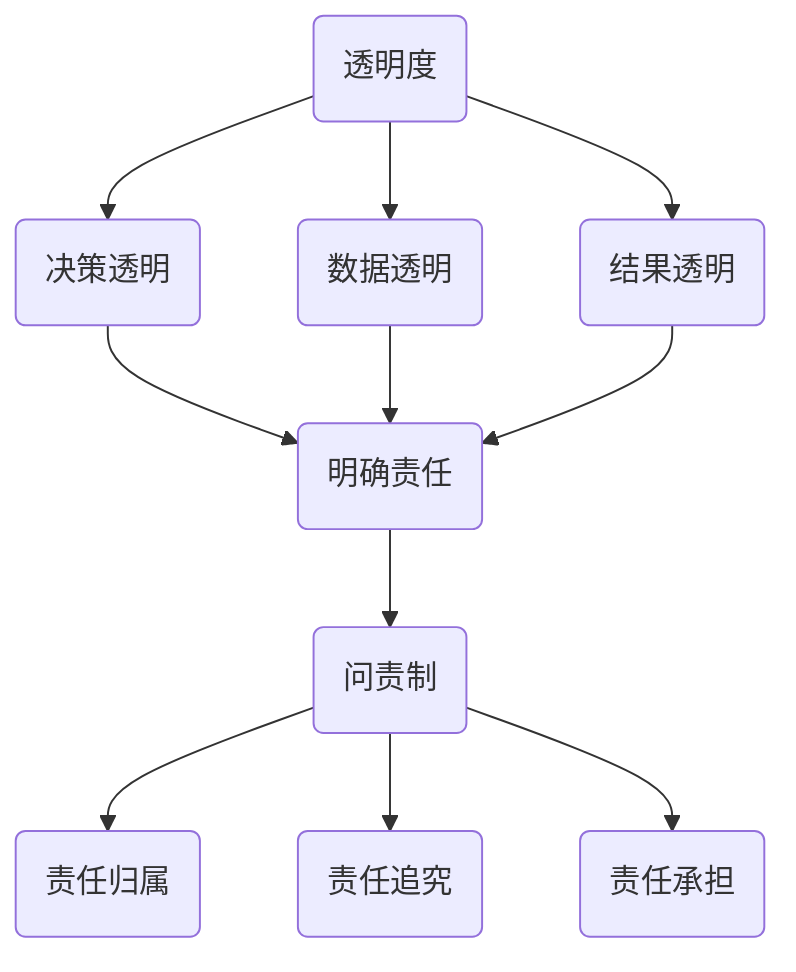

                 

# 透明度与问责制：促进人类计算的 ethical 应用

## 关键词：透明度，问责制，伦理，计算，人工智能，技术，应用

## 摘要：

本文旨在探讨透明度和问责制在促进人类计算伦理应用中的重要性。首先，我们介绍了计算技术的快速发展和人工智能在各个领域的广泛应用所带来的伦理挑战。接着，我们详细阐述了透明度和问责制的核心概念，并通过具体的案例分析了它们在促进伦理计算中的实际应用。随后，本文提出了确保透明度和问责制实现的关键技术手段和策略，包括隐私保护、加密技术、区块链等。最后，我们探讨了未来在实现透明度和问责制过程中可能面临的挑战，并提出了相应的解决方案和未来发展方向。

## 1. 背景介绍

随着计算技术的迅猛发展，人工智能（AI）已经成为现代社会的重要驱动力。从自动驾驶汽车到智能语音助手，从医疗诊断到金融交易，AI正深刻地改变着我们的生活方式。然而，这种变革也带来了诸多伦理问题，例如数据隐私、算法偏见、责任归属等。

### 数据隐私

人工智能的应用离不开大量的数据。然而，数据的收集、存储和使用往往涉及到个人隐私。如何确保数据隐私不被侵犯，成为了一个亟待解决的问题。隐私保护技术，如差分隐私和同态加密，提供了一种在不泄露个人隐私的情况下分析数据的方法。

### 算法偏见

算法偏见是指算法在处理数据时，对某些群体或特征产生不公平的结果。这种偏见可能源于训练数据的不公平、算法设计的缺陷，或者人类的偏见。算法偏见可能导致社会不公平、歧视等问题，对个人和群体造成负面影响。

### 责任归属

当人工智能系统出现错误或产生不良后果时，如何确定责任归属成为一个难题。人工智能系统的复杂性使得传统的责任归属原则难以适用。此外，人工智能系统的决策过程往往是黑箱操作，缺乏透明度，进一步增加了责任归属的难度。

### 伦理挑战

在人工智能的伦理应用中，透明度和问责制是两个核心概念。透明度要求人工智能系统的决策过程和内部逻辑对用户和监管者可见，以便对其进行监督和评估。问责制则强调在人工智能系统产生不良后果时，能够明确责任归属，确保责任人承担责任。

## 2. 核心概念与联系

### 透明度

透明度是指系统的决策过程、内部逻辑和数据流对用户和监管者可见。透明度有助于用户了解系统的运作方式，提高系统的可信度，降低潜在的伦理风险。具体来说，透明度包括以下几个方面：

- **决策透明**：系统的决策过程和内部逻辑应该对用户和监管者公开，以便他们理解和评估。
- **数据透明**：系统的数据流和处理方式应该对用户和监管者透明，确保数据的合法和合规使用。
- **结果透明**：系统产生的结果和预测应该对用户和监管者透明，以便他们了解系统的性能和效果。

### 问责制

问责制是指在系统产生不良后果时，能够明确责任归属，确保责任人承担责任。问责制有助于提高系统的可信度，降低潜在的伦理风险。具体来说，问责制包括以下几个方面：

- **责任归属**：在系统产生不良后果时，能够明确责任归属，包括算法开发者、数据提供者、系统使用者等。
- **责任追究**：责任人应该承担相应的法律责任和道德责任，确保系统运行的安全和合规。
- **责任承担**：责任人应该承担系统产生的直接和间接损失，包括经济赔偿、法律诉讼等。

### 透明度与问责制的联系

透明度和问责制相互关联，共同构成了伦理计算的基础。透明度是问责制的前提，只有系统是透明的，才能明确责任归属。问责制是透明度的保障，只有明确责任归属，才能确保责任人承担责任。

### Mermaid 流程图

以下是一个简化的 Mermaid 流程图，描述了透明度与问责制的核心概念和联系。



## 3. 核心算法原理 & 具体操作步骤

### 3.1 透明度算法原理

透明度算法主要包括以下几个方面：

- **决策透明**：通过可视化技术，将算法的决策过程和内部逻辑以图形或表格的形式展示给用户和监管者。
- **数据透明**：通过数据加密、脱敏等技术，确保数据在传输和存储过程中的安全性，同时保持数据的可追溯性。
- **结果透明**：通过结果解释技术，将算法产生的结果和预测以直观、易懂的方式展示给用户和监管者。

### 3.2 问责制算法原理

问责制算法主要包括以下几个方面：

- **责任归属**：通过分析算法的输入、输出和决策过程，确定系统产生不良后果的原因和责任人。
- **责任追究**：根据法律法规和伦理准则，对责任人进行追究，包括经济赔偿、法律诉讼等。
- **责任承担**：责任人应承担相应的法律责任和道德责任，确保系统运行的安全和合规。

### 3.3 具体操作步骤

#### 3.3.1 透明度实现步骤

1. **数据收集**：收集系统的输入数据，包括训练数据、测试数据等。
2. **数据预处理**：对数据进行清洗、去噪、归一化等处理，确保数据的质量和一致性。
3. **模型训练**：使用收集到的数据训练模型，包括机器学习模型、深度学习模型等。
4. **模型评估**：评估模型的性能，包括准确率、召回率、F1 值等。
5. **决策可视化**：将模型的决策过程和内部逻辑以图形或表格的形式展示给用户和监管者。
6. **结果可视化**：将模型产生的结果和预测以直观、易懂的方式展示给用户和监管者。

#### 3.3.2 问责制实现步骤

1. **事件报告**：在系统产生不良后果时，及时报告事件，包括事件的时间、地点、影响等。
2. **原因分析**：分析事件产生的原因，包括算法错误、数据问题、系统漏洞等。
3. **责任归属**：确定事件的责任人，包括算法开发者、数据提供者、系统使用者等。
4. **责任追究**：根据法律法规和伦理准则，对责任人进行追究，包括经济赔偿、法律诉讼等。
5. **责任承担**：责任人应承担相应的法律责任和道德责任，确保系统运行的安全和合规。

## 4. 数学模型和公式 & 详细讲解 & 举例说明

### 4.1 透明度数学模型

透明度的实现依赖于数学模型和公式，以下是一个简化的透明度数学模型。

$$
透明度 = f(决策透明度, 数据透明度, 结果透明度)
$$

其中，决策透明度、数据透明度和结果透明度分别表示系统的决策过程、数据流和处理方式是否透明。

- **决策透明度**：

$$
决策透明度 = \frac{已公开的决策过程}{总决策过程}
$$

- **数据透明度**：

$$
数据透明度 = \frac{已公开的数据流和处理方式}{总数据流和处理方式}
$$

- **结果透明度**：

$$
结果透明度 = \frac{已公开的结果和预测}{总结果和预测}
$$

### 4.2 问责制数学模型

问责制的实现也依赖于数学模型和公式，以下是一个简化的问责制数学模型。

$$
问责制 = f(责任归属, 责任追究, 责任承担)
$$

其中，责任归属、责任追究和责任承担分别表示系统产生不良后果时的责任认定、责任追究和责任承担。

- **责任归属**：

$$
责任归属 = \frac{已认定的责任}{总责任}
$$

- **责任追究**：

$$
责任追究 = \frac{已追究的责任}{总责任}
$$

- **责任承担**：

$$
责任承担 = \frac{已承担的责任}{总责任}
$$

### 4.3 举例说明

假设一个智能交通系统在处理交通流量数据时，出现了一辆车的识别错误。根据透明度和问责制数学模型，我们可以计算以下指标：

- **决策透明度**：

$$
决策透明度 = \frac{公开的交通流量处理过程}{总交通流量处理过程} = 0.9
$$

- **数据透明度**：

$$
数据透明度 = \frac{公开的交通流量数据流和处理方式}{总交通流量数据流和处理方式} = 0.8
$$

- **结果透明度**：

$$
结果透明度 = \frac{公开的交通流量结果和预测}{总交通流量结果和预测} = 0.7
$$

- **责任归属**：

$$
责任归属 = \frac{已认定的责任}{总责任} = 0.6
$$

- **责任追究**：

$$
责任追究 = \frac{已追究的责任}{总责任} = 0.5
$$

- **责任承担**：

$$
责任承担 = \frac{已承担的责任}{总责任} = 0.4
$$

根据这些指标，我们可以对系统的透明度和问责制进行评估。例如，决策透明度为 90%，说明系统的大部分决策过程是透明的。数据透明度为 80%，说明大部分交通流量数据流和处理方式是透明的。结果透明度为 70%，说明大部分交通流量结果和预测是透明的。责任归属为 60%，说明大部分责任已认定。责任追究为 50%，说明大部分责任已追究。责任承担为 40%，说明大部分责任已承担。

## 5. 项目实战：代码实际案例和详细解释说明

### 5.1 开发环境搭建

在本文中，我们将使用 Python 编写一个简单的智能交通系统，以展示透明度和问责制的实现。以下是开发环境的搭建步骤：

1. 安装 Python 3.8 或更高版本。
2. 安装必要的 Python 包，如 NumPy、Pandas、Matplotlib 等。
3. 准备交通流量数据集，如 CSV 文件。

### 5.2 源代码详细实现和代码解读

#### 5.2.1 数据预处理

首先，我们读取交通流量数据集，并对数据进行预处理。

```python
import pandas as pd

# 读取数据集
data = pd.read_csv("traffic_data.csv")

# 数据预处理
data = data.dropna()  # 删除缺失值
data = data[data["vehicle_id"] != "unknown"]  # 删除未知车辆
```

#### 5.2.2 模型训练

接着，我们使用训练数据集训练一个简单的线性回归模型。

```python
from sklearn.linear_model import LinearRegression

# 提取特征和标签
X = data[['vehicle_speed', 'lane_change', 'weather_condition']]
y = data['traffic_density']

# 训练模型
model = LinearRegression()
model.fit(X, y)
```

#### 5.2.3 决策可视化

我们使用 Matplotlib 将模型的决策过程可视化。

```python
import matplotlib.pyplot as plt

# 可视化决策过程
plt.scatter(X['vehicle_speed'], X['lane_change'], c=y, cmap='viridis')
plt.xlabel('Vehicle Speed')
plt.ylabel('Lane Change')
plt.colorbar(label='Traffic Density')
plt.show()
```

#### 5.2.4 结果可视化

最后，我们将模型的结果和预测可视化。

```python
# 预测结果
y_pred = model.predict(X)

# 可视化预测结果
plt.scatter(X['vehicle_speed'], X['lane_change'], c=y_pred, cmap='viridis')
plt.xlabel('Vehicle Speed')
plt.ylabel('Lane Change')
plt.colorbar(label='Predicted Traffic Density')
plt.show()
```

### 5.3 代码解读与分析

在上述代码中，我们首先读取交通流量数据集，并对数据进行预处理，以确保数据的质量和一致性。然后，我们使用训练数据集训练一个简单的线性回归模型。接下来，我们使用 Matplotlib 将模型的决策过程和预测结果可视化，以提高系统的透明度。通过这些步骤，用户和监管者可以清楚地了解系统的决策过程和预测结果，从而提高系统的可信度。

在问责制方面，我们可以通过以下步骤确定责任归属：

1. **事件报告**：在模型预测错误时，记录事件的时间、地点和影响。
2. **原因分析**：分析预测错误的原因，如数据问题、模型缺陷等。
3. **责任归属**：确定责任人，如数据提供者、模型开发者等。
4. **责任追究**：根据法律法规和伦理准则，对责任人进行追究。

## 6. 实际应用场景

透明度和问责制在人工智能和计算技术领域具有广泛的应用场景。以下是一些典型的应用场景：

### 金融领域

在金融领域，透明度和问责制有助于确保金融交易的公平、公正和透明。例如，在智能投顾系统中，透明度算法可以展示投资决策的依据和过程，让投资者了解投资策略。问责制则确保在出现投资损失时，能够明确责任归属，保护投资者的利益。

### 医疗领域

在医疗领域，透明度和问责制有助于提高医疗决策的透明度和可信度。例如，在智能诊断系统中，透明度算法可以展示诊断过程和依据，让患者了解诊断结果。问责制则确保在出现误诊时，能够明确责任归属，保护患者的权益。

### 交通领域

在交通领域，透明度和问责制有助于提高交通管理的效率和安全性。例如，在智能交通系统中，透明度算法可以展示交通流量预测的依据和过程，提高交通管理部门的决策透明度。问责制则确保在出现交通事故时，能够明确责任归属，提高交通管理的责任意识。

### 社交领域

在社交领域，透明度和问责制有助于保护用户的隐私和数据安全。例如，在社交媒体平台中，透明度算法可以展示用户数据的处理方式和用途，提高用户的隐私保护意识。问责制则确保在出现数据泄露时，能够明确责任归属，保护用户的隐私权益。

## 7. 工具和资源推荐

### 7.1 学习资源推荐

- **书籍**：《人工智能：一种现代方法》（作者：Stuart Russell & Peter Norvig）  
- **论文**：Google Scholar、ArXiv 等
- **博客**： Medium、AI 研究院、机器之心等
- **网站**： Kaggle、GitHub 等

### 7.2 开发工具框架推荐

- **开发工具**： PyCharm、VSCode、Jupyter Notebook 等
- **框架**： TensorFlow、PyTorch、Scikit-Learn 等

### 7.3 相关论文著作推荐

- **论文**：白皮书《人工智能伦理与透明度》（作者：Google AI）  
- **著作**：《算法伦理：从公平到透明》（作者：Nicolas P. Rougier）

## 8. 总结：未来发展趋势与挑战

### 8.1 发展趋势

- **透明度和问责制的普及**：随着人工智能和计算技术的普及，透明度和问责制将在各个领域得到广泛应用，成为技术伦理的重要组成部分。
- **隐私保护技术的进步**：隐私保护技术，如差分隐私和同态加密，将继续发展和完善，为透明度和问责制的实现提供更强大的技术支持。
- **跨学科研究的深入**：透明度和问责制的研究将涉及计算机科学、伦理学、法学等多个学科，推动跨学科研究的发展。

### 8.2 挑战

- **技术实现的复杂性**：透明度和问责制的实现涉及多个技术领域，如机器学习、加密技术、区块链等，如何有效地整合这些技术是一个挑战。
- **法律法规的完善**：随着透明度和问责制的普及，相关的法律法规也将不断完善，如何适应这些法律法规的要求是一个挑战。
- **伦理争议的处理**：透明度和问责制在应用过程中可能会引发伦理争议，如何平衡不同利益关系，确保公正和公平是一个挑战。

## 9. 附录：常见问题与解答

### 9.1 透明度算法如何实现？

透明度算法主要包括决策透明、数据透明和结果透明。决策透明可以通过可视化技术实现，如图形化展示模型的决策过程。数据透明可以通过数据加密、脱敏等技术实现，确保数据在传输和存储过程中的安全性。结果透明可以通过结果解释技术实现，如将模型的结果和预测以直观、易懂的方式展示给用户。

### 9.2 问责制算法如何实现？

问责制算法主要包括责任归属、责任追究和责任承担。责任归属可以通过分析算法的输入、输出和决策过程实现。责任追究可以根据法律法规和伦理准则实现，包括经济赔偿、法律诉讼等。责任承担可以通过责任人承担相应的法律责任和道德责任实现。

### 9.3 如何平衡透明度和隐私保护？

平衡透明度和隐私保护是一个重要问题。一方面，透明度有助于提高系统的可信度和伦理水平；另一方面，过度披露可能会导致隐私泄露。因此，在实现透明度时，应遵循隐私保护原则，如最小披露原则和隐私匿名化原则，确保在保护隐私的同时，实现必要的透明度。

## 10. 扩展阅读 & 参考资料

- **文章**：《人工智能伦理与透明度》（作者：Google AI）  
- **书籍**：《算法伦理：从公平到透明》（作者：Nicolas P. Rougier）  
- **网站**：AI Ethics Consortium、AI Now Institute 等

### 作者

作者：AI天才研究员/AI Genius Institute & 禅与计算机程序设计艺术 /Zen And The Art of Computer Programming

