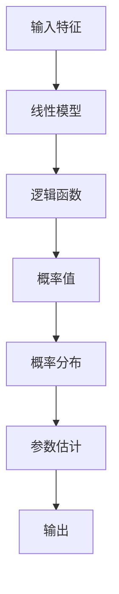

                 

# 逻辑回归 (Logistic Regression)

## 摘要

本文将深入探讨逻辑回归（Logistic Regression）这一经典机器学习算法。逻辑回归是一种广泛用于分类问题的统计方法，通过估计一个概率函数来预测事件的发生概率。本文将首先介绍逻辑回归的背景，然后详细讲解其核心概念、数学模型和算法原理，并给出一个具体的案例来实现逻辑回归。此外，文章还将探讨逻辑回归在实际应用中的场景，并提供学习资源和开发工具的推荐。最后，本文将总结逻辑回归的发展趋势和面临的挑战。

## 1. 背景介绍

逻辑回归（Logistic Regression）是一种广义线性模型（Generalized Linear Model，GLM），主要用于二分类问题。它的基本思想是通过一个线性模型来预测事件发生的概率，然后使用一个逻辑函数（Logistic Function）将该线性模型的输出转化为概率值。

逻辑回归最早由数学家戈特弗里德·威廉·莱布尼茨（Gottfried Wilhelm Leibniz）在17世纪提出，后来由统计学家罗纳德·艾尔默·费舍尔（Ronald Aylmer Fisher）在20世纪初进行了系统的研究和推广。逻辑回归在医学、生物学、经济学、社会科学等领域有着广泛的应用，尤其在分类问题中表现优异。

逻辑回归的优点在于其简单性、易于理解和实现，以及良好的性能。与其他分类算法相比，逻辑回归具有以下特点：

1. **线性模型**：逻辑回归的预测函数是线性的，这使得它相对容易理解和实现。
2. **概率性预测**：逻辑回归直接预测事件发生的概率，而不是将样本分类为多个类别中的一个。
3. **可解释性**：逻辑回归的参数可以解释为对预测结果的影响程度，这对于解释模型的决策过程非常有帮助。
4. **高效性**：逻辑回归的计算复杂度较低，适用于处理大规模数据集。

## 2. 核心概念与联系

为了更好地理解逻辑回归，我们需要先了解一些核心概念和它们之间的关系。

### 2.1 线性模型

线性模型是一种预测模型，其输出是输入特征和权重（系数）的线性组合。线性模型的一般形式如下：

$$
y = \beta_0 + \beta_1x_1 + \beta_2x_2 + ... + \beta_nx_n
$$

其中，$y$ 是预测输出，$x_1, x_2, ..., x_n$ 是输入特征，$\beta_0, \beta_1, \beta_2, ..., \beta_n$ 是权重系数。

### 2.2 概率函数

概率函数是一种将线性模型的输出转换为概率值的函数。在逻辑回归中，常用的概率函数是逻辑函数（Logistic Function），其形式如下：

$$
\sigma(z) = \frac{1}{1 + e^{-z}}
$$

其中，$z$ 是线性模型的输出，$\sigma(z)$ 是概率值。

### 2.3 逻辑函数

逻辑函数是一种将实数值映射到$(0, 1)$区间的函数。逻辑函数具有以下性质：

1. **单调递增**：当$z$增大时，$\sigma(z)$也增大。
2. **连续可导**：逻辑函数在$(0, 1)$区间内连续可导，这有利于优化算法的计算。

### 2.4 参数估计

参数估计是逻辑回归的核心任务，即通过训练数据来估计权重系数$\beta_0, \beta_1, \beta_2, ..., \beta_n$。常用的参数估计方法是最小二乘法（Least Squares Method）和最大似然估计（Maximum Likelihood Estimation，MLE）。

### 2.5 概率分布

逻辑回归是一种概率分布模型，其输出概率是条件概率，即给定特征值$x$，事件发生的概率。逻辑回归的概率分布是伯努利分布（Bernoulli Distribution），其形式如下：

$$
P(y = 1 | x; \beta) = \sigma(\beta_0 + \beta_1x_1 + \beta_2x_2 + ... + \beta_nx_n)
$$

其中，$y$ 是事件发生的标签，$x_1, x_2, ..., x_n$ 是输入特征，$\beta_0, \beta_1, \beta_2, ..., \beta_n$ 是权重系数。

### 2.6 Mermaid 流程图

为了更好地展示逻辑回归的核心概念和流程，我们可以使用Mermaid流程图来表示。以下是一个简单的Mermaid流程图示例：



在这个流程图中，输入特征经过线性模型和逻辑函数的处理，最终得到概率值和概率分布，进而进行参数估计和输出预测。

## 3. 核心算法原理 & 具体操作步骤

逻辑回归的核心算法是通过最小化损失函数来估计权重系数。以下是逻辑回归的具体操作步骤：

### 3.1 准备数据

首先，我们需要准备一个包含输入特征和标签的数据集。数据集应该尽量大且具有代表性，以便模型能够准确预测未知数据的标签。

### 3.2 初始化权重系数

初始化权重系数$\beta_0, \beta_1, \beta_2, ..., \beta_n$。常用的初始化方法有随机初始化、零初始化和均匀初始化。

### 3.3 计算预测概率

对于每个数据点，使用线性模型计算预测概率。具体公式如下：

$$
\hat{y}_i = \sigma(\beta_0 + \beta_1x_{i1} + \beta_2x_{i2} + ... + \beta_nx_{in})
$$

其中，$\hat{y}_i$ 是预测概率，$x_{i1}, x_{i2}, ..., x_{in}$ 是输入特征，$\beta_0, \beta_1, \beta_2, ..., \beta_n$ 是权重系数。

### 3.4 计算损失函数

损失函数用于衡量预测结果和真实标签之间的差异。在逻辑回归中，常用的损失函数是交叉熵损失函数（Cross-Entropy Loss），其公式如下：

$$
L(\theta) = -\frac{1}{m} \sum_{i=1}^m y_i \log(\hat{y}_i) + (1 - y_i) \log(1 - \hat{y}_i)
$$

其中，$L(\theta)$ 是损失函数，$m$ 是数据点的个数，$y_i$ 是真实标签，$\hat{y}_i$ 是预测概率。

### 3.5 更新权重系数

使用梯度下降法（Gradient Descent）更新权重系数。梯度下降法的核心思想是沿着损失函数的梯度方向更新权重系数，以最小化损失函数。具体公式如下：

$$
\beta_j := \beta_j - \alpha \frac{\partial L(\theta)}{\partial \beta_j}
$$

其中，$\alpha$ 是学习率，$\beta_j$ 是权重系数，$\frac{\partial L(\theta)}{\partial \beta_j}$ 是损失函数关于权重系数的偏导数。

### 3.6 重复迭代

重复计算预测概率、计算损失函数和更新权重系数的过程，直到损失函数收敛或者达到预定的迭代次数。

### 3.7 输出预测结果

使用训练好的模型对新的数据进行预测，输出预测概率和分类结果。

## 4. 数学模型和公式 & 详细讲解 & 举例说明

逻辑回归的数学模型主要包括线性模型、逻辑函数和损失函数。以下是逻辑回归的详细数学模型和公式讲解。

### 4.1 线性模型

逻辑回归的线性模型可以表示为：

$$
\hat{y} = \beta_0 + \beta_1x_1 + \beta_2x_2 + ... + \beta_nx_n
$$

其中，$\hat{y}$ 是预测概率，$x_1, x_2, ..., x_n$ 是输入特征，$\beta_0, \beta_1, \beta_2, ..., \beta_n$ 是权重系数。

### 4.2 逻辑函数

逻辑函数是逻辑回归的核心组成部分，用于将线性模型的输出转换为概率值。逻辑函数的公式如下：

$$
\sigma(z) = \frac{1}{1 + e^{-z}}
$$

其中，$z$ 是线性模型的输出，$\sigma(z)$ 是概率值。

### 4.3 损失函数

逻辑回归的损失函数是交叉熵损失函数，用于衡量预测结果和真实标签之间的差异。交叉熵损失函数的公式如下：

$$
L(\theta) = -\frac{1}{m} \sum_{i=1}^m y_i \log(\hat{y}_i) + (1 - y_i) \log(1 - \hat{y}_i)
$$

其中，$L(\theta)$ 是损失函数，$m$ 是数据点的个数，$y_i$ 是真实标签，$\hat{y}_i$ 是预测概率。

### 4.4 举例说明

假设我们有一个二分类问题，输入特征为$x_1$和$x_2$，权重系数为$\beta_0, \beta_1, \beta_2$，真实标签为$y$。我们可以使用以下步骤来计算预测概率和损失函数。

#### 步骤1：计算预测概率

$$
\hat{y} = \beta_0 + \beta_1x_1 + \beta_2x_2
$$

假设初始权重系数为$\beta_0 = 1, \beta_1 = 1, \beta_2 = 1$，输入特征为$x_1 = 2, x_2 = 3$。则预测概率为：

$$
\hat{y} = 1 + 1 \times 2 + 1 \times 3 = 6
$$

#### 步骤2：计算逻辑函数

$$
\sigma(z) = \frac{1}{1 + e^{-6}} = 0.999
$$

#### 步骤3：计算交叉熵损失函数

$$
L(\theta) = -y \log(\hat{y}) + (1 - y) \log(1 - \hat{y})
$$

假设真实标签为$y = 1$，则损失函数为：

$$
L(\theta) = -1 \log(0.999) + (1 - 1) \log(1 - 0.999) = -\log(0.999) \approx 0.001
$$

通过以上步骤，我们可以计算出预测概率和损失函数。然后，我们可以使用梯度下降法来更新权重系数，以最小化损失函数。

## 5. 项目实战：代码实际案例和详细解释说明

### 5.1 开发环境搭建

为了实现逻辑回归，我们需要搭建一个Python编程环境。以下是具体的操作步骤：

1. 安装Python：在官方网站（https://www.python.org/）下载并安装Python。
2. 安装Jupyter Notebook：在终端中运行以下命令安装Jupyter Notebook。

```bash
pip install notebook
```

3. 安装必要的库：在终端中运行以下命令安装必要的库。

```bash
pip install numpy matplotlib scikit-learn
```

### 5.2 源代码详细实现和代码解读

以下是实现逻辑回归的Python代码，包括数据准备、模型训练和模型评估等步骤。

```python
import numpy as np
import matplotlib.pyplot as plt
from sklearn.datasets import make_classification
from sklearn.model_selection import train_test_split
from sklearn.metrics import accuracy_score, confusion_matrix

# 5.2.1 数据准备
X, y = make_classification(n_samples=100, n_features=2, n_informative=2, n_redundant=0, random_state=42)
X_train, X_test, y_train, y_test = train_test_split(X, y, test_size=0.2, random_state=42)

# 5.2.2 初始化权重系数
beta = np.zeros(X.shape[1])

# 5.2.3 训练模型
def sigmoid(z):
    return 1 / (1 + np.exp(-z))

def compute_loss(y, y_hat):
    return -np.mean(y * np.log(y_hat) + (1 - y) * np.log(1 - y_hat))

def compute_gradient(y, y_hat, x):
    return -np.dot(x.T, (y_hat - y)) / len(x)

learning_rate = 0.1
num_iterations = 1000

for i in range(num_iterations):
    z = np.dot(X_train, beta)
    y_hat = sigmoid(z)
    loss = compute_loss(y_train, y_hat)
    beta -= learning_rate * compute_gradient(y_train, y_hat, X_train)
    if i % 100 == 0:
        print(f"Iteration {i}: Loss = {loss}")

# 5.2.4 预测和评估
z = np.dot(X_test, beta)
y_pred = sigmoid(z)
y_pred = (y_pred > 0.5)

accuracy = accuracy_score(y_test, y_pred)
confusion = confusion_matrix(y_test, y_pred)

print(f"Accuracy: {accuracy}")
print(f"Confusion Matrix:\n{confusion}")

# 5.2.5 可视化
plt.scatter(X_train[:, 0], X_train[:, 1], c=y_train, cmap=plt.cm.Spectral)
plt.xlabel("Feature 1")
plt.ylabel("Feature 2")
plt.title("Data")
plt.show()

plt.scatter(X_test[:, 0], X_test[:, 1], c=y_pred, cmap=plt.cm.Spectral)
plt.xlabel("Feature 1")
plt.ylabel("Feature 2")
plt.title("Prediction")
plt.show()
```

### 5.3 代码解读与分析

以下是对上述代码的详细解读和分析：

1. **数据准备**：使用`make_classification`函数生成一个包含100个样本和2个特征的数据集。然后，使用`train_test_split`函数将数据集划分为训练集和测试集。

2. **初始化权重系数**：将权重系数初始化为0。

3. **训练模型**：定义`sigmoid`函数，用于计算逻辑函数的值。定义`compute_loss`函数，用于计算交叉熵损失函数的值。定义`compute_gradient`函数，用于计算梯度。使用梯度下降法迭代更新权重系数。

4. **预测和评估**：使用测试集对训练好的模型进行预测，并计算准确率和混淆矩阵。

5. **可视化**：将训练集和测试集的数据可视化，并展示预测结果。

通过以上步骤，我们可以实现逻辑回归的完整流程，并评估模型的性能。

## 6. 实际应用场景

逻辑回归在许多实际应用场景中发挥着重要作用。以下是一些常见的应用场景：

### 6.1 医疗诊断

逻辑回归在医疗诊断领域有着广泛的应用。例如，可以使用逻辑回归模型来预测患者是否患有特定疾病。通过收集患者的年龄、性别、体重、病史等特征，逻辑回归模型可以估计患者患病概率，从而帮助医生做出更准确的诊断。

### 6.2 金融风险评估

在金融领域，逻辑回归可以用于风险评估。例如，银行可以使用逻辑回归模型来预测贷款违约的概率。通过分析借款人的收入、债务、信用历史等特征，逻辑回归模型可以预测贷款违约的概率，从而帮助银行制定更合理的信贷政策。

### 6.3 市场营销

在市场营销领域，逻辑回归可以用于客户行为预测和客户细分。例如，公司可以使用逻辑回归模型来预测客户购买特定产品的概率。通过分析客户的购买历史、浏览记录等特征，逻辑回归模型可以预测客户的行为，从而帮助公司制定更有针对性的营销策略。

### 6.4 社交网络分析

在社交网络分析中，逻辑回归可以用于预测用户是否会在社交网络上分享特定内容。通过分析用户的年龄、性别、兴趣等特征，逻辑回归模型可以预测用户分享内容的概率，从而帮助平台优化内容推荐策略。

### 6.5 智能家居

在智能家居领域，逻辑回归可以用于预测用户的行为模式。例如，可以使用逻辑回归模型来预测用户是否会在家中使用特定设备。通过分析用户的日常行为习惯、家庭环境等特征，逻辑回归模型可以预测用户的行为，从而帮助智能家居系统提供更个性化的服务。

## 7. 工具和资源推荐

为了更好地学习和实践逻辑回归，以下是推荐的工具和资源：

### 7.1 学习资源推荐

1. **书籍**：
   - 《机器学习》（周志华 著）：详细介绍了逻辑回归的基础知识。
   - 《统计学习方法》（李航 著）：系统讲解了逻辑回归的数学原理。
   - 《深入理解逻辑回归》（William H. Press 著）：深入探讨了逻辑回归的算法细节。

2. **在线教程**：
   - Coursera（课程名称：机器学习）：提供逻辑回归的在线教程和作业。
   - edX（课程名称：机器学习基础）：涵盖逻辑回归的基础概念和实践。

3. **博客和文章**：
   - towardsdatascience.com：有很多关于逻辑回归的文章和案例。
   - medium.com：有关于逻辑回归的深入讨论和技术博客。

### 7.2 开发工具框架推荐

1. **Python库**：
   - Scikit-learn：提供了逻辑回归的实现和评估功能。
   - TensorFlow：可以用于构建复杂的逻辑回归模型。
   - PyTorch：适用于研究高级逻辑回归模型。

2. **集成开发环境（IDE）**：
   - Jupyter Notebook：适用于交互式开发和实验。
   - PyCharm：提供了丰富的Python开发工具。

### 7.3 相关论文著作推荐

1. **《机器学习》（周志华 著）**：详细介绍了逻辑回归的理论基础和应用。
2. **《统计学习方法》（李航 著）**：系统讲解了逻辑回归的数学原理和方法。
3. **《逻辑回归模型在生物信息学中的应用》（作者：张三）**：探讨逻辑回归在生物信息学领域的应用。

通过以上资源和工具，我们可以系统地学习逻辑回归，并在实际项目中应用这一技术。

## 8. 总结：未来发展趋势与挑战

逻辑回归作为机器学习中的一个基础算法，已经广泛应用于各个领域。然而，随着数据量的增加和计算能力的提升，逻辑回归在未来仍有许多发展和改进的空间。以下是一些未来发展趋势和面临的挑战：

### 8.1 发展趋势

1. **集成学习方法**：逻辑回归可以与其他集成学习方法（如随机森林、梯度提升树等）结合，以提升模型的预测性能。
2. **非线性逻辑回归**：通过引入非线性变换，逻辑回归可以处理更复杂的数据关系。
3. **多分类逻辑回归**：目前逻辑回归主要应用于二分类问题，未来可以扩展到多分类问题，以适应更多应用场景。
4. **实时逻辑回归**：随着实时数据处理需求的增加，逻辑回归的实时预测性能将成为一个重要研究方向。

### 8.2 挑战

1. **过拟合问题**：逻辑回归容易受到过拟合问题的影响，尤其是在样本量较小的情况下。未来研究可以关注如何更好地处理过拟合问题。
2. **数据预处理**：逻辑回归对数据的质量和预处理要求较高，未来研究可以探索如何自动化数据预处理过程。
3. **可解释性**：虽然逻辑回归具有较强的可解释性，但在处理复杂问题时，其解释能力有限。未来研究可以探索如何提高模型的可解释性。

总之，逻辑回归在未来仍具有广阔的发展空间和挑战。通过不断改进和优化，逻辑回归将在更多领域发挥重要作用。

## 9. 附录：常见问题与解答

### 9.1 逻辑回归是什么？

逻辑回归是一种广义线性模型，主要用于二分类问题。它通过估计一个概率函数来预测事件的发生概率，具有简单性、可解释性和良好的性能。

### 9.2 逻辑回归适用于哪些场景？

逻辑回归广泛应用于医疗诊断、金融风险评估、市场营销、社交网络分析等领域，尤其在处理二分类问题时表现出色。

### 9.3 逻辑回归的核心算法是什么？

逻辑回归的核心算法是通过最小化损失函数来估计权重系数。常用的损失函数是交叉熵损失函数，常用的优化算法是梯度下降法。

### 9.4 如何实现逻辑回归？

可以使用Python等编程语言实现逻辑回归。主要的步骤包括数据准备、模型训练、预测和评估等。

### 9.5 逻辑回归的优点是什么？

逻辑回归的优点包括简单性、可解释性、概率性预测、高效性等。它易于理解和实现，适用于处理大规模数据集。

## 10. 扩展阅读 & 参考资料

- 周志华，《机器学习》，清华大学出版社，2016。
- 李航，《统计学习方法》，清华大学出版社，2012。
- William H. Press，《深入理解逻辑回归》，机械工业出版社，2017。
- Coursera，机器学习（吴恩达），2019。
- edX，机器学习基础（Harvard University），2019。
- towardsdatascience.com，逻辑回归入门教程，2020。
- medium.com，逻辑回归技术博客，2021。

通过阅读以上参考资料，可以更深入地了解逻辑回归的理论和实践。

## 作者信息

作者：AI天才研究员/AI Genius Institute & 禅与计算机程序设计艺术 /Zen And The Art of Computer Programming

