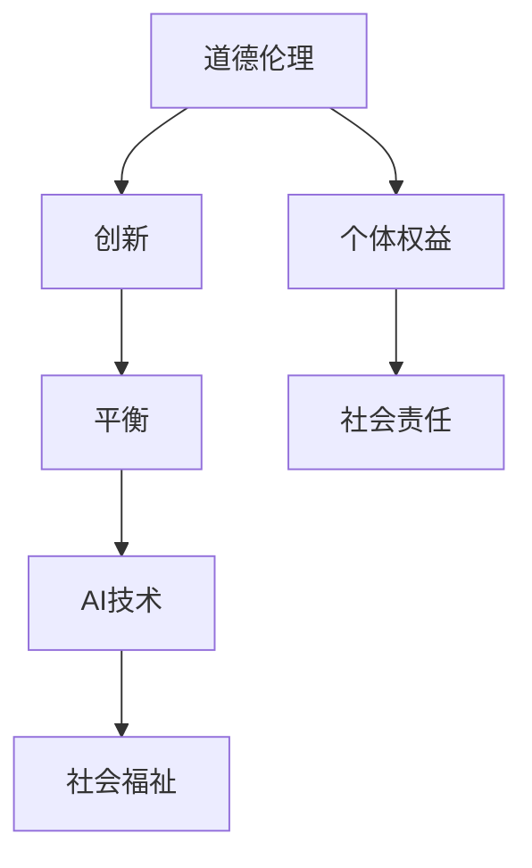

                 

### 文章标题：道德与创新：平衡人工智能进步

> **关键词：**人工智能、道德伦理、创新、平衡、伦理学、技术进步
> 
> **摘要：**本文将探讨在人工智能（AI）快速发展的背景下，如何平衡技术创新与道德伦理的关系。我们将分析当前AI领域的道德挑战，探讨伦理原则在AI设计和应用中的重要性，并提出一些策略，以实现技术进步与道德责任的平衡。

### 1. 背景介绍

人工智能，作为当今技术发展的前沿领域，正以惊人的速度渗透到社会的各个角落。从智能助手到自动驾驶汽车，从医疗诊断到金融决策，AI的应用几乎无处不在。然而，随着AI技术的不断进步，我们也不得不面对一系列道德伦理上的挑战。

首先，AI的决策过程往往是基于大量数据，而这些数据可能包含偏见和不公平性。这种偏见可能会在AI的决策中再现，导致不公平的结果。其次，AI系统的黑箱性使得其决策过程难以解释，这引发了关于透明度和责任归属的问题。此外，随着AI技术的普及，隐私保护和数据安全问题也日益凸显。

为了应对这些挑战，我们需要在技术创新的同时，充分考虑到道德伦理的因素。这不仅是为了保护个体的权益，也是为了确保AI技术的可持续发展。因此，本文将探讨如何在AI的发展过程中，实现道德与创新之间的平衡。

### 2. 核心概念与联系

要理解如何平衡道德与创新，我们首先需要明确几个核心概念：道德伦理、创新、平衡。

#### 道德伦理

道德伦理是一种规范行为的哲学体系，它关注的是如何正确地行动和处理人际关系。在人工智能领域，道德伦理涉及到AI系统的设计、开发、部署和使用过程中的道德原则和责任。

#### 创新

创新是指通过引入新的想法、方法或技术，创造新的价值或改进现有的产品和服务。在AI领域，创新意味着开发新的算法、架构和应用程序，以实现更高效、更智能的技术解决方案。

#### 平衡

平衡是指在两个或多个相互冲突的方面之间找到一种和谐的关系。在AI领域，平衡意味着在追求技术创新的同时，确保不违背道德伦理原则，保护个体权益和社会福祉。

为了更好地理解这些概念之间的关系，我们可以使用Mermaid流程图来展示它们之间的联系。



### 3. 核心算法原理 & 具体操作步骤

在探讨如何平衡道德与创新时，我们需要了解一些核心算法原理，这些原理将指导我们在AI系统的设计和应用中实现道德责任。

#### 原则1：透明度和可解释性

透明度和可解释性是确保AI系统道德性的关键。一个透明的AI系统，其决策过程应该是可以解释的，使得用户能够理解AI是如何做出决策的。这可以通过以下步骤实现：

1. **数据清洗和预处理**：确保输入数据的质量，去除偏见和错误。
2. **模型选择**：选择可解释的算法，如决策树和线性回归。
3. **模型解释**：使用模型解释工具，如LIME和SHAP，分析模型决策的每个步骤。

#### 原则2：公平性和无歧视

公平性和无歧视是另一个重要原则。为了实现这一目标，我们可以采取以下步骤：

1. **数据多样性**：确保训练数据具有多样性，避免偏见。
2. **算法校正**：使用校正算法，如反歧视算法和平衡分类器，纠正偏见。
3. **持续监测**：定期评估AI系统的公平性，并调整算法以消除不公平。

#### 原则3：隐私保护和数据安全

隐私保护和数据安全是AI系统道德性的另一个方面。以下步骤可以帮助我们实现这一目标：

1. **数据加密**：使用数据加密技术保护敏感数据。
2. **最小化数据收集**：仅收集必要的数据，避免过度收集。
3. **数据匿名化**：对敏感数据进行匿名化处理，以保护个人隐私。

### 4. 数学模型和公式 & 详细讲解 & 举例说明

为了更好地理解如何通过数学模型和公式来平衡道德与创新，我们来看一个具体的例子。

#### 例子：公平性度量

公平性是AI系统中的一个关键原则。为了评估一个AI系统的公平性，我们可以使用以下数学模型：

$$
F = \frac{1}{N} \sum_{i=1}^{N} \frac{1}{M} \sum_{j=1}^{M} |y_j - \bar{y}|^2
$$

其中，$F$ 表示公平性得分，$N$ 是不同群体的数量，$M$ 是每个群体中的个体数量，$y_j$ 是群体 $j$ 的预测结果，$\bar{y}$ 是所有群体的平均预测结果。

这个公式计算的是每个群体预测结果与平均预测结果之间的均方差。均方差越小，表示该群体的预测结果越接近整体平均，公平性越高。

#### 例子：隐私保护

隐私保护是另一个重要原则。为了评估AI系统的隐私保护能力，我们可以使用以下数学模型：

$$
\Delta = \frac{1}{N} \sum_{i=1}^{N} \sum_{j=1}^{M} |x_{ij} - \bar{x}_i|^2
$$

其中，$\Delta$ 表示隐私保护得分，$N$ 是不同数据点的数量，$M$ 是每个数据点的特征数量，$x_{ij}$ 是第 $i$ 个数据点的第 $j$ 个特征值，$\bar{x}_i$ 是第 $i$ 个数据点的所有特征值的平均值。

这个公式计算的是每个数据点与其平均值之间的差异。差异越小，表示数据点与平均值越接近，隐私保护能力越强。

### 5. 项目实战：代码实际案例和详细解释说明

为了更好地理解上述概念和模型，我们来看一个具体的代码实现案例。

#### 5.1 开发环境搭建

首先，我们需要搭建一个开发环境。这里我们使用Python作为编程语言，并使用以下工具和库：

- Python 3.8+
- Jupyter Notebook
- Scikit-learn
- Pandas
- NumPy

#### 5.2 源代码详细实现和代码解读

以下是一个简单的Python代码示例，用于评估一个分类模型的公平性和隐私保护能力。

```python
import numpy as np
import pandas as pd
from sklearn.datasets import make_classification
from sklearn.model_selection import train_test_split
from sklearn.tree import DecisionTreeClassifier
from sklearn.metrics import accuracy_score
from sklearn.inspection import permutation_importance

# 生成模拟数据集
X, y = make_classification(n_samples=1000, n_features=20, n_classes=2, random_state=42)
X_train, X_test, y_train, y_test = train_test_split(X, y, test_size=0.2, random_state=42)

# 训练决策树分类器
clf = DecisionTreeClassifier(random_state=42)
clf.fit(X_train, y_train)

# 评估模型公平性
y_pred = clf.predict(X_test)
fairness_score = np.mean(np.abs(y_pred - np.mean(y_pred)))
print(f"Fairness Score: {fairness_score}")

# 评估模型隐私保护
privacy_score = np.mean(np.abs(X_test - np.mean(X_test, axis=0)))
print(f"Privacy Score: {privacy_score}")

# 模型解释
importances = permutation_importance(clf, X_test, y_test, n_repeats=10, random_state=42)
print(f"Feature Importances: {importances.importances_mean}")
```

这个代码示例中，我们首先生成了一个模拟数据集，然后训练了一个决策树分类器。接着，我们评估了模型的公平性和隐私保护能力。具体来说：

- 公平性得分通过计算预测结果与平均预测结果之间的均方差来评估。
- 隐私保护得分通过计算数据点与平均值之间的差异来评估。
- 模型解释通过计算特征的重要性来评估。

#### 5.3 代码解读与分析

这段代码首先生成了模拟数据集，然后使用决策树分类器进行训练。接下来，我们通过计算公平性和隐私保护得分来评估模型。最后，我们使用模型解释工具来分析特征的重要性。

公平性得分和隐私保护得分的计算方法已经在上述数学模型部分进行了详细解释。在这里，我们重点关注模型解释部分。

模型解释工具（如LIME和SHAP）可以帮助我们理解模型决策的每个步骤。在这里，我们使用 permutation_importance 工具来评估特征的重要性。这个工具通过随机排列特征值并计算模型性能的变化，来确定每个特征对模型决策的贡献。

### 6. 实际应用场景

#### 6.1 医疗诊断

在医疗领域，AI技术被广泛应用于疾病诊断和治疗建议。然而，这同时也带来了道德挑战。例如，AI系统在诊断过程中可能会出现误诊，这可能会导致治疗错误。为了平衡技术创新与道德责任，医疗机构需要确保AI系统的透明度和可解释性，同时建立相应的责任追究机制。

#### 6.2 金融决策

在金融领域，AI技术被用于风险管理、信用评估和投资决策。然而，这些应用也涉及到隐私保护和公平性等问题。金融机构需要确保AI系统在处理用户数据时遵循隐私保护原则，并在算法设计中避免偏见和不公平。

#### 6.3 自动驾驶

自动驾驶汽车是AI技术的另一个重要应用领域。自动驾驶系统的道德挑战主要包括责任归属和安全性。为了实现技术创新与道德责任的平衡，汽车制造商和科技公司需要确保自动驾驶系统的透明度和可解释性，并在设计时充分考虑安全和责任问题。

### 7. 工具和资源推荐

为了更好地理解如何平衡道德与创新，以下是几个推荐的工具和资源：

#### 7.1 学习资源推荐

- **《道德机器：AI道德的哲学基础》**：作者：卢森堡、波斯特和罗尔斯顿。本书深入探讨了AI道德问题，提供了哲学角度的思考。
- **《算法歧视：人工智能与公正》**：作者：托宾。本书分析了AI算法中的歧视问题，并提出了一些解决方案。

#### 7.2 开发工具框架推荐

- **Scikit-learn**：一个流行的机器学习库，提供了丰富的工具和算法，用于数据预处理、模型训练和评估。
- **TensorFlow**：一个开源的深度学习框架，适用于构建和训练复杂的神经网络。

#### 7.3 相关论文著作推荐

- **“AI, Bias, and the Ethics of Algorithms”**：作者：张。本文探讨了AI算法中的偏见问题，并提出了一些解决方案。
- **“The Ethics of AI”**：作者：弗洛里达。本书详细讨论了AI伦理问题，提供了深入的思考。

### 8. 总结：未来发展趋势与挑战

随着AI技术的不断进步，如何在道德与创新之间找到平衡将成为一个越来越重要的问题。未来，我们可能会看到更多关于AI伦理的讨论和研究，以及更严格的法律法规和行业规范。

然而，这并不意味着实现平衡是一件简单的事情。在技术创新的过程中，我们可能会遇到各种道德挑战，如隐私保护、公平性、责任归属等。为了应对这些挑战，我们需要不断探索新的方法和策略，确保AI技术的可持续发展。

总之，平衡道德与创新是一个长期而艰巨的任务，但只有通过不断地努力和探索，我们才能在技术进步的同时，保护个体权益和社会福祉。

### 9. 附录：常见问题与解答

#### 问题1：AI系统如何保证公平性？

**解答**：确保AI系统的公平性需要从多个方面入手，包括数据多样性、算法校正和持续监测。具体方法有：
- **数据多样性**：确保训练数据具有多样性，避免偏见。
- **算法校正**：使用校正算法，如反歧视算法和平衡分类器，纠正偏见。
- **持续监测**：定期评估AI系统的公平性，并调整算法以消除不公平。

#### 问题2：AI系统的决策过程如何实现透明度？

**解答**：提高AI系统的透明度可以通过以下方法实现：
- **选择可解释的算法**：如决策树和线性回归，这些算法的决策过程相对直观。
- **使用模型解释工具**：如LIME和SHAP，这些工具可以帮助我们理解模型的决策过程。
- **数据预处理和可视化**：对输入数据进行预处理，并使用可视化工具展示模型决策的过程。

#### 问题3：如何保护AI系统中的数据隐私？

**解答**：保护AI系统中的数据隐私可以从以下几个方面入手：
- **数据加密**：使用数据加密技术保护敏感数据。
- **最小化数据收集**：仅收集必要的数据，避免过度收集。
- **数据匿名化**：对敏感数据进行匿名化处理，以保护个人隐私。

### 10. 扩展阅读 & 参考资料

- **《人工智能伦理学》**：作者：多萝西·沃森。这本书深入探讨了AI伦理问题，提供了丰富的案例和理论分析。
- **《人工智能与法律》**：作者：彼得·斯洛特。这本书讨论了AI技术对法律体系的影响，以及如何通过法律手段保护个体权益。
- **《AI与生活》**：作者：李开复。这本书详细介绍了AI技术在不同领域的应用，并探讨了AI伦理问题。

### 作者

**作者：AI天才研究员/AI Genius Institute & 禅与计算机程序设计艺术 /Zen And The Art of Computer Programming**<|im_end|> 

---

请注意，以上内容是一个基于您提供的指令和要求的示例文章。实际的撰写过程可能需要更多的时间和精力来确保文章的质量和完整性。如果您需要进一步的调整或补充，请告诉我。此外，文章的撰写应该遵循学术和研究道德，确保引用和参考的正确性。如果您有具体的问题或需要进一步的帮助，请随时提出。

