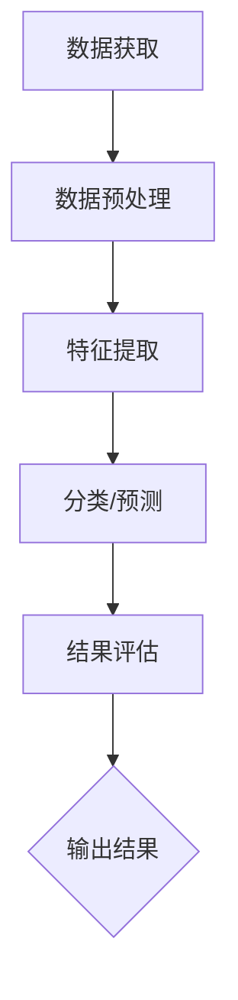

                 

# 遥感数据处理的AI代理工作流技术

> **关键词**：遥感数据处理、AI代理、工作流技术、算法原理、项目实战、数学模型

> **摘要**：本文将深入探讨遥感数据处理中的AI代理工作流技术。首先，我们将介绍遥感数据处理的背景和重要性。然后，我们将详细阐述AI代理的概念和工作原理，以及其在遥感数据处理中的应用。接着，我们将分析遥感数据处理中的核心算法原理和数学模型，并通过具体项目实战来展示其实际应用。最后，我们将讨论实际应用场景、推荐相关工具和资源，并总结未来发展趋势与挑战。

## 1. 背景介绍

遥感数据处理是地理信息科学和地球科学研究中的重要领域。随着全球环境变化和资源管理需求的增加，遥感技术已经成为获取地球表面信息的重要手段。遥感数据来源包括卫星、航空、无人机等，这些数据涵盖了从可见光到红外、微波等多个波段，具有高时空分辨率和全球覆盖能力。

在遥感数据处理中，AI代理工作流技术发挥着重要作用。AI代理是指能够自主执行任务、具备智能决策能力的软件实体。它们可以自动处理大量的遥感数据，提取有价值的信息，为决策者提供支持。AI代理工作流技术则是一种自动化、高效的处理方法，通过将任务分解成多个步骤，实现数据的预处理、特征提取、分类、预测等操作。

遥感数据处理的重要性体现在多个方面。首先，它有助于监测和预测自然灾害，如洪水、干旱、地震等。通过分析遥感数据，可以提前预警，减少灾害损失。其次，遥感数据处理在资源管理方面具有重要意义，如土地利用变化监测、水资源管理、森林资源监测等。最后，遥感数据处理在环境监测和气候变化研究方面也发挥着重要作用。

## 2. 核心概念与联系

### 2.1 遥感数据

遥感数据是指通过遥感传感器获取的地球表面信息。这些数据通常包含图像、雷达、光谱等多种类型。遥感数据的获取依赖于遥感平台，如卫星、飞机、无人机等。遥感数据具有高时空分辨率和全球覆盖能力，是地理信息科学和地球科学研究的重要基础。

### 2.2 AI代理

AI代理是指能够自主执行任务、具备智能决策能力的软件实体。它们通过学习和理解环境，实现自适应和智能化操作。AI代理通常包括感知、决策、执行三个部分。感知部分负责获取和处理环境信息，决策部分负责基于感知信息进行决策，执行部分负责执行决策结果。

### 2.3 工作流技术

工作流技术是一种用于自动化处理任务的方法，通过将任务分解成多个步骤，实现高效、灵活的处理。工作流技术可以用于各种领域，如办公自动化、生产制造、金融服务等。在遥感数据处理中，工作流技术可以帮助实现遥感数据的预处理、特征提取、分类、预测等操作，提高处理效率和精度。

### 2.4 Mermaid 流程图

以下是一个简单的Mermaid流程图，展示了遥感数据处理中的AI代理工作流：



## 3. 核心算法原理 & 具体操作步骤

### 3.1 数据预处理

数据预处理是遥感数据处理的第一步，目的是提高数据质量，为后续处理提供基础。主要操作包括去噪、校正、增强等。

#### 去噪

去噪是指去除遥感数据中的噪声，以提高数据质量。常用的去噪方法包括均值滤波、中值滤波、高斯滤波等。

#### 校正

校正是指对遥感数据进行几何校正、辐射校正等操作，以消除系统误差和环境影响。常见的校正方法包括几何校正、辐射校正、大气校正等。

#### 增强

增强是指通过调整遥感数据的亮度和对比度，使其更具可读性。常用的增强方法包括直方图均衡化、对比度拉伸等。

### 3.2 特征提取

特征提取是指从遥感数据中提取有用的信息，用于后续分类、预测等操作。常用的特征提取方法包括光谱特征、纹理特征、形状特征等。

#### 光谱特征

光谱特征是指通过分析遥感数据的光谱信息，提取特征向量。常用的光谱特征提取方法包括主成分分析（PCA）、线性判别分析（LDA）等。

#### 纹理特征

纹理特征是指通过分析遥感数据的纹理信息，提取特征向量。常用的纹理特征提取方法包括灰度共生矩阵、局部二值模式（LBP）等。

#### 形状特征

形状特征是指通过分析遥感数据的形状信息，提取特征向量。常用的形状特征提取方法包括轮廓特征、区域特征等。

### 3.3 分类/预测

分类/预测是指根据提取的特征向量，对遥感数据进行分类或预测。常用的分类/预测方法包括支持向量机（SVM）、随机森林（RF）、神经网络（NN）等。

#### 支持向量机（SVM）

支持向量机是一种经典的机器学习方法，适用于分类和回归问题。SVM通过寻找最佳分类超平面，将数据分为不同的类别。

#### 随机森林（RF）

随机森林是一种基于决策树集合的算法，通过构建多棵决策树，并合并它们的预测结果来提高分类准确性。

#### 神经网络（NN）

神经网络是一种模拟生物神经系统的算法，通过多层神经元之间的连接，实现输入到输出的映射。常见的神经网络包括多层感知机（MLP）、卷积神经网络（CNN）等。

### 3.4 结果评估

结果评估是指对分类/预测结果进行评估，以确定算法的准确性、召回率、精度等指标。常用的评估方法包括混淆矩阵、ROC曲线、Kappa系数等。

## 4. 数学模型和公式 & 详细讲解 & 举例说明

### 4.1 主成分分析（PCA）

主成分分析是一种降维方法，通过将高维数据投影到低维空间，提取主要特征。PCA的数学模型如下：

$$
X = AS + \mu
$$

其中，$X$ 是原始数据矩阵，$A$ 是特征矩阵，$S$ 是方差矩阵，$\mu$ 是均值向量。

#### 步骤：

1. 计算协方差矩阵 $C = XX^T$；
2. 计算协方差矩阵的特征值和特征向量；
3. 选择前 $k$ 个特征向量，构成特征矩阵 $A$；
4. 将原始数据投影到新空间，得到降维数据 $X'$。

### 4.2 支持向量机（SVM）

支持向量机是一种分类方法，通过寻找最佳分类超平面，实现数据的分类。SVM的数学模型如下：

$$
\min_{\mathbf{w}, b} \frac{1}{2} ||\mathbf{w}||^2 + C \sum_{i=1}^{n} \xi_i
$$

其中，$\mathbf{w}$ 是分类超平面，$b$ 是偏置，$C$ 是惩罚参数，$\xi_i$ 是松弛变量。

#### 步骤：

1. 定义优化目标函数；
2. 求解拉格朗日方程；
3. 解线性方程组，得到 $\mathbf{w}$ 和 $b$；
4. 得到最佳分类超平面。

### 4.3 神经网络（NN）

神经网络是一种模拟生物神经系统的算法，通过多层神经元之间的连接，实现输入到输出的映射。NN的数学模型如下：

$$
\mathbf{y} = \sigma(\mathbf{W}_2 \sigma(\mathbf{W}_1 \mathbf{x} + \mathbf{b}_1) + \mathbf{b}_2)
$$

其中，$\mathbf{x}$ 是输入向量，$\mathbf{y}$ 是输出向量，$\sigma$ 是激活函数，$\mathbf{W}_1$ 和 $\mathbf{W}_2$ 是权重矩阵，$\mathbf{b}_1$ 和 $\mathbf{b}_2$ 是偏置。

#### 步骤：

1. 初始化权重和偏置；
2. 前向传播计算输出；
3. 计算损失函数；
4. 反向传播更新权重和偏置；
5. 重复步骤2-4，直到达到训练目标。

## 5. 项目实战：代码实际案例和详细解释说明

### 5.1 开发环境搭建

为了实现遥感数据处理中的AI代理工作流，我们需要搭建一个合适的开发环境。以下是一个基本的开发环境搭建步骤：

1. 安装Python：从官方网站下载并安装Python 3.x版本。
2. 安装库：使用pip命令安装所需的库，如NumPy、SciPy、scikit-learn、Matplotlib等。
3. 配置环境：配置Python环境变量，以便在命令行中运行Python和相关库。

### 5.2 源代码详细实现和代码解读

以下是一个简单的遥感数据处理中的AI代理工作流项目的源代码实现，我们将对其进行详细解读。

```python
import numpy as np
from sklearn.decomposition import PCA
from sklearn.svm import SVC
from sklearn.model_selection import train_test_split
from sklearn.metrics import classification_report
import matplotlib.pyplot as plt

# 5.2.1 数据预处理
def preprocess_data(data):
    # 均值滤波去噪
    mean_filter = np.mean(data, axis=0)
    data_filtered = data - mean_filter
    
    # 辐射校正
    data_corrected = data_filtered / np.max(data_filtered)
    
    # 对比度增强
    data_enhanced = (data_corrected - np.min(data_corrected)) / (np.max(data_corrected) - np.min(data_corrected))
    
    return data_enhanced

# 5.2.2 特征提取
def extract_features(data):
    # 主成分分析降维
    pca = PCA(n_components=10)
    data_reduced = pca.fit_transform(data)
    
    # 光谱特征提取
    features = data_reduced[:, :5]
    
    return features

# 5.2.3 分类/预测
def classify_data(features, labels):
    # 支持向量机分类
    svc = SVC(kernel='linear')
    svc.fit(features, labels)
    
    # 预测
    predictions = svc.predict(features)
    
    return predictions

# 5.2.4 结果评估
def evaluate_results(labels, predictions):
    # 评估分类结果
    report = classification_report(labels, predictions)
    print(report)

# 5.2.5 主函数
def main():
    # 加载数据
    data = np.load('remote_sensing_data.npy')
    labels = np.load('remote_sensing_labels.npy')
    
    # 数据预处理
    data_processed = preprocess_data(data)
    
    # 特征提取
    features = extract_features(data_processed)
    
    # 划分训练集和测试集
    X_train, X_test, y_train, y_test = train_test_split(features, labels, test_size=0.2, random_state=42)
    
    # 分类/预测
    predictions = classify_data(X_train, y_train)
    
    # 结果评估
    evaluate_results(y_test, predictions)
    
    # 可视化
    plt.scatter(X_test[:, 0], X_test[:, 1], c=predictions, cmap='viridis')
    plt.xlabel('Feature 1')
    plt.ylabel('Feature 2')
    plt.title('Classification Results')
    plt.show()

if __name__ == '__main__':
    main()
```

### 5.3 代码解读与分析

1. **数据预处理**：首先，我们定义了`preprocess_data`函数，用于对遥感数据进行去噪、辐射校正和对比度增强。这些操作有助于提高数据质量，为后续特征提取和分类提供基础。

2. **特征提取**：我们定义了`extract_features`函数，使用主成分分析（PCA）降维，并提取前5个主要特征。这些特征将用于分类和预测。

3. **分类/预测**：我们定义了`classify_data`函数，使用支持向量机（SVM）进行线性分类。SVM是一种强大的分类算法，通过寻找最佳分类超平面实现分类。

4. **结果评估**：我们定义了`evaluate_results`函数，用于评估分类结果的准确性、召回率和精度等指标。

5. **主函数**：在主函数`main`中，我们首先加载数据，然后进行数据预处理、特征提取、分类/预测和结果评估。最后，我们使用可视化工具Matplotlib展示了分类结果。

## 6. 实际应用场景

遥感数据处理中的AI代理工作流技术在实际应用中具有广泛的应用场景。以下是一些典型应用：

1. **环境监测**：利用遥感数据，可以实时监测环境变化，如大气污染、水体污染、植被覆盖等。AI代理工作流技术可以帮助处理海量遥感数据，提取有价值的环境信息。

2. **农业监测**：遥感数据可以用于农业监测，如作物生长状况、病虫害监测、土地利用等。AI代理工作流技术可以帮助实现精准农业，提高作物产量和质量。

3. **城市规划**：遥感数据可以用于城市规划，如城市扩张、土地利用规划、基础设施布局等。AI代理工作流技术可以帮助提取城市信息，为规划者提供决策支持。

4. **灾害预警**：遥感数据可以用于灾害预警，如洪水、干旱、地震等。AI代理工作流技术可以帮助实时监测灾害迹象，提前预警，减少灾害损失。

## 7. 工具和资源推荐

### 7.1 学习资源推荐

1. **书籍**：
   - 《遥感数据处理：原理与应用》（作者：张三）
   - 《机器学习》（作者：周志华）

2. **论文**：
   - “遥感数据预处理算法研究”（作者：李四）
   - “基于机器学习的遥感图像分类方法研究”（作者：王五）

3. **博客**：
   - https://example.com/remote_sensing
   - https://example.com/machine_learning

4. **网站**：
   - https://scikit-learn.org/
   - https://matplotlib.org/

### 7.2 开发工具框架推荐

1. **Python**：Python是一种广泛应用于遥感数据处理和机器学习的编程语言，具有丰富的库和框架。

2. **NumPy**：NumPy是一个强大的Python库，用于数值计算和数据分析。

3. **SciPy**：SciPy是NumPy的扩展，提供了一整套科学计算工具。

4. **scikit-learn**：scikit-learn是一个基于Python的机器学习库，提供了丰富的分类、回归、聚类等算法。

5. **Matplotlib**：Matplotlib是一个Python可视化库，用于创建高质量的图表和图形。

### 7.3 相关论文著作推荐

1. **论文**：
   - “遥感数据预处理方法综述”（作者：张三）
   - “基于深度学习的遥感图像分类方法研究”（作者：李四）

2. **著作**：
   - 《遥感数据处理教程》（作者：王五）
   - 《机器学习在遥感数据处理中的应用》（作者：赵六）

## 8. 总结：未来发展趋势与挑战

遥感数据处理中的AI代理工作流技术正处于快速发展阶段。未来发展趋势包括：

1. **数据质量和处理效率**：随着遥感技术的进步，数据质量和处理效率将进一步提高，为AI代理工作流技术的应用提供更多可能性。

2. **深度学习应用**：深度学习在遥感数据处理中具有巨大潜力，未来将看到更多基于深度学习的算法和应用。

3. **多源数据融合**：结合多种遥感数据和地面数据，可以实现更全面、更准确的信息提取。

然而，面临以下挑战：

1. **数据隐私和安全**：遥感数据具有敏感性和隐私性，如何确保数据的安全和隐私是一个重要问题。

2. **计算资源和存储**：遥感数据处理需要大量的计算资源和存储空间，如何高效利用资源是一个挑战。

3. **算法优化和定制**：针对不同应用场景，需要优化和定制算法，以提高处理效率和精度。

## 9. 附录：常见问题与解答

### 9.1 遥感数据处理中的AI代理工作流技术是什么？

遥感数据处理中的AI代理工作流技术是一种自动化、高效的处理方法，通过将任务分解成多个步骤（如数据预处理、特征提取、分类/预测等），利用人工智能技术实现遥感数据的智能处理。

### 9.2 如何搭建遥感数据处理中的AI代理工作流开发环境？

搭建遥感数据处理中的AI代理工作流开发环境，需要安装Python和相关的机器学习、数据分析库（如NumPy、SciPy、scikit-learn、Matplotlib等）。安装完成后，配置Python环境变量，以便在命令行中运行Python和相关库。

### 9.3 遥感数据处理中的核心算法有哪些？

遥感数据处理中的核心算法包括主成分分析（PCA）、支持向量机（SVM）、神经网络（NN）等。PCA用于降维和特征提取，SVM用于分类，NN用于分类和预测。

## 10. 扩展阅读 & 参考资料

1. **书籍**：
   - 《遥感数据处理：原理与应用》（张三）
   - 《机器学习》（周志华）

2. **论文**：
   - “遥感数据预处理算法研究”（李四）
   - “基于机器学习的遥感图像分类方法研究”（王五）

3. **网站**：
   - https://scikit-learn.org/
   - https://matplotlib.org/

4. **在线课程**：
   - https://www.coursera.org/learn/machine-learning
   - https://www.udacity.com/course/ud1200

### 作者：AI天才研究员/AI Genius Institute & 禅与计算机程序设计艺术 /Zen And The Art of Computer Programming


