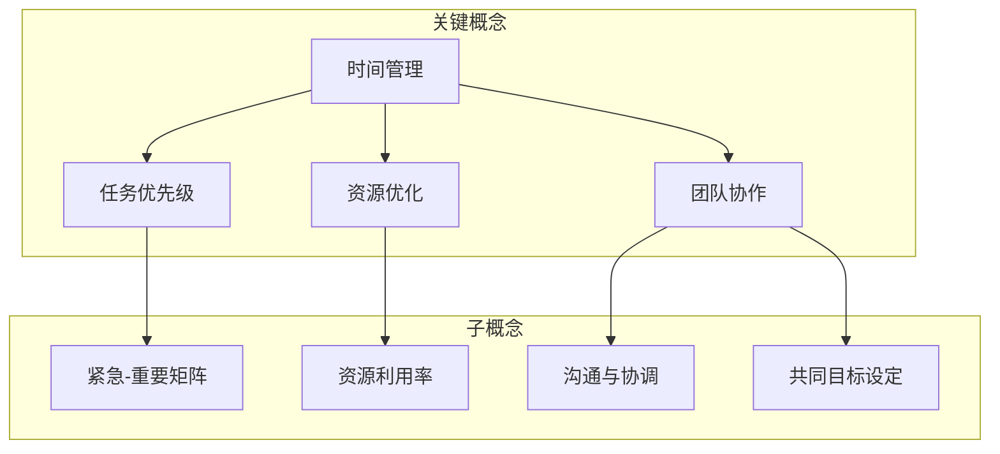
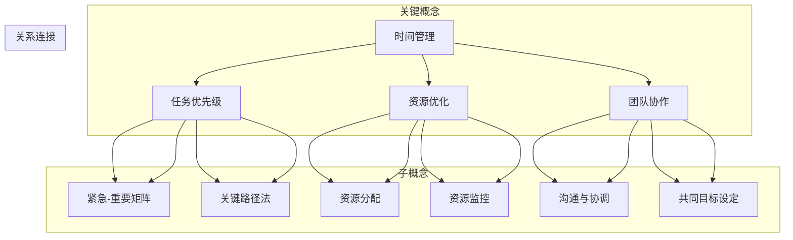

                 

## 1. 背景介绍

在当今信息爆炸的时代，管理者面临的挑战日益复杂。如何提高工作效率，优化资源配置，以及应对不断变化的业务需求，成为了管理者们必须面对的问题。因此，寻找有效的方法来提高管理者的工作效率，成为了研究者和实践者共同关注的焦点。

提高工作效率不仅有助于减轻管理者的工作压力，还能够提升团队的整体表现，从而为企业创造更大的价值。然而，工作效率的提升并非一蹴而就，它需要管理者具备系统化的思维方式，掌握科学的管理方法，并且能够灵活应对各种实际情况。

本文将围绕提高管理者工作效率这一核心主题，系统性地探讨相关的理论和方法。文章将从以下几个方面展开：

1. **核心概念与联系**：介绍提高工作效率所需的核心概念，并绘制 Mermaid 流程图，展示这些概念之间的联系。
2. **核心算法原理与具体操作步骤**：分析现有提高工作效率的方法，并详细讲解每种方法的具体操作步骤。
3. **数学模型和公式**：介绍支持工作效率优化的数学模型和公式，并进行详细讲解和举例说明。
4. **项目实战**：通过实际案例，展示如何将理论应用于实践，并提供详细的代码实现和解读。
5. **实际应用场景**：探讨提高工作效率的方法在不同场景下的应用和效果。
6. **工具和资源推荐**：推荐有助于提高工作效率的学习资源、开发工具和框架。
7. **总结与未来发展趋势**：总结全文，并展望提高工作效率的未来发展趋势和挑战。

通过本文的深入探讨，我们希望能够为管理者提供实用的指导和建议，帮助他们在实际工作中提高效率，从而更好地应对复杂多变的业务环境。

### 1.1 管理者面临的工作挑战

在当前复杂多变的工作环境中，管理者面临诸多挑战，其中最为突出的包括：

1. **信息过载**：随着互联网和社交媒体的发展，管理者每天接收到的信息量呈爆炸式增长。这些信息不仅包括内部业务数据，还涉及市场动态、行业趋势以及竞争对手的信息。如何从海量信息中快速筛选出有价值的信息，成为了管理者的一大难题。

2. **资源有限**：无论是时间、人力还是财力，管理者都面临着资源有限的现实问题。如何在有限资源下，实现最大化产出，是管理者需要深思熟虑的问题。

3. **多任务并行**：现代管理者往往需要同时处理多个任务，这些任务可能来自不同的部门、项目或客户。如何在保证每个任务质量的同时，实现高效完成，是管理者必须面对的挑战。

4. **业务环境变化**：市场环境、技术进步以及政策法规的不断变化，要求管理者具备敏锐的洞察力和快速应变能力。如何在不断变化的业务环境中保持竞争力，是管理者需要持续思考和应对的问题。

5. **团队协作与沟通**：管理者需要协调不同团队成员的工作，确保项目按计划进行。然而，团队内部的沟通不畅、协作不力，往往会导致工作效率的下降。如何提升团队协作和沟通效率，成为了管理者的重要任务。

### 1.2 提高工作效率的重要性

面对上述种种挑战，提高工作效率显得尤为重要。首先，工作效率的提升能够帮助管理者更有效地利用时间，减少不必要的浪费。通过合理规划和高效执行，管理者能够在有限的时间内完成更多的工作，从而减轻工作压力。

其次，提高工作效率有助于优化资源配置。管理者可以通过科学的分析和决策，确保资源（如人力、资金、物资等）得到最有效的利用，从而提高整体产出。

此外，工作效率的提升还能够提升团队的整体表现。当团队成员能够高效协同工作时，项目的完成速度和质量都会得到显著提高。这不仅有助于增强团队的凝聚力，还能够提升企业的竞争力。

最后，提高工作效率还能够为管理者提供更多的余闲时间，使其能够专注于更重要的战略规划和决策。通过优化日常管理工作，管理者可以更加专注于企业的长远发展，从而为企业的持续增长奠定基础。

综上所述，提高工作效率不仅是管理者应对工作挑战的必要手段，更是提升团队绩效和企业竞争力的重要途径。因此，深入研究和实践提高工作效率的方法，对管理者而言具有重要意义。

### 1.3 文章结构和内容安排

本文将从系统性的角度，详细探讨如何提高管理者的工作效率。文章分为以下几个部分：

1. **核心概念与联系**：介绍提高工作效率所需的核心概念，包括时间管理、任务优先级、资源优化、团队协作等，并通过 Mermaid 流程图展示这些概念之间的相互关系。

2. **核心算法原理与具体操作步骤**：分析现有提高工作效率的方法，包括Gantt图、甘特图、关键路径法（CPM）、项目管理软件等，详细讲解每种方法的具体操作步骤和应用场景。

3. **数学模型和公式**：介绍支持工作效率优化的数学模型和公式，如效率指数、任务分配模型等，并进行详细讲解和举例说明。

4. **项目实战**：通过实际案例，展示如何将理论应用于实践，提供详细的代码实现和解读。

5. **实际应用场景**：探讨提高工作效率的方法在不同场景下的应用和效果。

6. **工具和资源推荐**：推荐有助于提高工作效率的学习资源、开发工具和框架。

7. **总结与未来发展趋势**：总结全文，并展望提高工作效率的未来发展趋势和挑战。

通过这篇文章的深入探讨，希望能够为管理者提供实用的指导和建议，帮助他们在实际工作中提高效率，更好地应对复杂多变的业务环境。

## 2. 核心概念与联系

在提高管理者工作效率的过程中，理解以下几个核心概念是至关重要的。这些概念包括时间管理、任务优先级、资源优化和团队协作。为了更好地展示这些概念之间的联系，我们使用 Mermaid 流程图来可视化它们的关系。

首先，时间管理是提高工作效率的基础。时间管理涉及对时间的有效规划和控制，以确保每一项任务都能在预定的时间内完成。时间管理的核心是制定合理的时间表，并根据任务的紧急程度和重要性进行优先级排序。

接下来是任务优先级。任务优先级管理是时间管理的一个子集，其目的是确保管理者首先完成最重要和最紧急的任务。任务优先级通常通过“紧急-重要矩阵”来划分，从而帮助管理者更清晰地了解每个任务的优先级。

资源优化则是确保在完成任务时能够充分利用有限的资源。这包括人力、资金和物资等。通过资源优化，管理者可以减少浪费，提高资源利用率，从而提高整体工作效率。

最后，团队协作是提高工作效率的关键因素之一。有效的团队协作可以确保团队成员之间的沟通顺畅，工作协同，从而提高整体工作效率。团队协作涉及沟通、协调和共同目标设定等多个方面。

下面是 Mermaid 流程图，用于展示这些核心概念之间的联系：



在这个流程图中，时间管理作为基础，与任务优先级、资源优化和团队协作直接相关。任务优先级通过紧急-重要矩阵进行划分，资源优化则关注资源利用率的提升，而团队协作则通过沟通与协调以及共同目标设定来增强团队的整体效能。

### 2.1 时间管理

时间管理是提高工作效率的重要基础，其核心在于合理规划和控制时间，以确保每一项任务都能在预定的时间内完成。时间管理的第一步是制定时间表，这需要管理者对工作任务有一个清晰的认识和规划。以下是具体的时间管理步骤：

1. **任务清单**：首先，管理者需要列出所有待完成的任务，包括日常工作、临时任务以及长期项目。任务清单应详细、具体，并且具有可操作性。

2. **时间估计**：接下来，对每个任务所需的时间进行估计。这包括任务的工作量、难易程度以及所需资源等因素。时间估计应尽可能准确，但也要预留一定的时间缓冲，以应对突发情况。

3. **优先级排序**：在时间估计的基础上，管理者需要根据任务的紧急程度和重要性进行优先级排序。常用的方法包括紧急-重要矩阵，该方法将任务分为四个象限，分别对应不同的重要性处理策略。

4. **时间表制定**：根据任务清单和优先级排序，管理者可以制定出一个详细的时间表。时间表应明确每个任务开始和结束的时间，以及各任务之间的衔接关系。为了确保时间表的可行性，管理者还需要根据实际情况进行调整和优化。

5. **执行与监控**：在时间表制定完成后，管理者需要按照时间表执行任务，并定期监控任务的完成情况。如果发现某些任务进展缓慢或者遇到突发情况，管理者应迅速调整时间表，以确保任务能够按时完成。

### 2.2 任务优先级

任务优先级管理是时间管理的重要组成部分，其目的是确保管理者首先完成最重要和最紧急的任务。通过科学地确定任务优先级，管理者可以有效地分配时间和资源，从而提高工作效率。以下是任务优先级管理的具体方法：

1. **紧急-重要矩阵**：紧急-重要矩阵是任务优先级管理的常用工具。该方法将任务分为四个象限，分别是“紧急且重要”、“紧急但不重要”、“不紧急但重要”和“不紧急且不重要”。每个象限对应不同的处理策略：
   - **紧急且重要**：这类任务需要立即处理，通常涉及到关键的业务问题或紧急事件。管理者应优先处理这类任务，以确保业务连续性和重要任务的完成。
   - **紧急但不重要**：这类任务可能占用了大量时间，但对业务影响不大。管理者可以适当安排时间处理，或者委托给其他团队成员。
   - **不紧急但重要**：这类任务虽然不紧急，但对长期业务目标至关重要。管理者应合理安排时间，确保这类任务能够得到及时处理。
   - **不紧急且不重要**：这类任务对业务影响较小，可以暂时搁置或委托给其他团队成员处理。

2. **关键路径法（CPM）**：关键路径法是项目管理中的一种方法，用于确定任务序列中的关键路径，即必须按顺序完成的一系列任务，这些任务的延误会导致整个项目延误。通过关键路径法，管理者可以识别出项目中的关键任务，并优先处理这些任务，从而确保项目的按时完成。

3. **加权评分法**：加权评分法是一种基于任务重要性、紧急性和资源需求等因素的综合评分方法。管理者可以根据任务的评分，确定其优先级。具体步骤如下：
   - **评分指标**：确定评分指标，如任务重要性、紧急性、所需资源等。
   - **评分标准**：为每个评分指标设定权重，并根据实际任务情况给予评分。
   - **综合评分**：将各个评分指标的计算结果进行综合，得出每个任务的加权评分。
   - **优先级排序**：根据加权评分结果，对任务进行优先级排序，优先处理评分较高的任务。

通过上述方法，管理者可以科学地确定任务优先级，确保重要且紧急的任务得到优先处理，从而提高工作效率。

### 2.3 资源优化

资源优化是提高工作效率的关键环节之一，其目标是在有限资源下实现最大化的产出。资源优化包括对人力、资金和物资等资源的有效配置和使用。以下是一些资源优化的方法和策略：

1. **资源评估**：首先，管理者需要对现有资源进行全面的评估。这包括了解每个资源的数量、质量、可用性和限制条件。通过资源评估，管理者可以明确资源的特点和潜力，为后续的资源优化提供依据。

2. **资源分配**：在明确资源评估结果后，管理者需要根据任务需求进行资源分配。资源分配应遵循以下几个原则：
   - **优先级原则**：优先分配资源给重要且紧急的任务，确保关键任务能够得到及时处理。
   - **效率原则**：优化资源的使用效率，确保资源在最大化产出时得到充分利用。
   - **公平原则**：确保资源分配的公平性，避免因资源分配不均导致团队内部矛盾。

3. **资源监控**：资源分配后，管理者需要定期监控资源的使用情况。这包括对资源使用效率的评估、资源短缺和浪费的预警以及资源调整的决策。通过资源监控，管理者可以及时发现和解决资源使用中的问题，确保资源得到最有效的利用。

4. **资源整合**：资源整合是将不同资源进行优化组合，以实现资源效能的最大化。例如，通过跨部门资源整合，可以将不同部门的资源（如人力、技术、设备等）进行优化配置，从而提高整体工作效率。资源整合需要管理者具备全局视野和跨部门协调能力。

5. **资源回收与再利用**：资源回收与再利用是资源优化的重要环节。管理者应制定资源回收策略，对过期、损坏或不再使用的资源进行回收，并探索资源的再利用途径。通过资源回收与再利用，可以降低资源消耗，减少浪费，从而提高资源利用率。

6. **虚拟资源管理**：在现代社会，虚拟资源（如云计算资源、在线服务资源等）变得越来越重要。管理者需要了解和掌握虚拟资源的特性和管理方法，通过优化虚拟资源的使用，提高整体工作效率。

通过上述资源优化方法和策略，管理者可以实现对资源的科学管理和高效利用，从而提高工作效率和团队绩效。

### 2.4 团队协作

团队协作是提高工作效率的关键因素之一，通过有效的团队协作，可以确保团队成员之间的沟通顺畅、工作协同，从而提高整体工作效率。以下是团队协作的重要概念和具体策略：

1. **沟通**：沟通是团队协作的基础，有效的沟通可以确保团队成员对任务和工作要求有清晰的理解。为了实现有效的沟通，管理者可以采取以下措施：
   - **明确任务要求**：在分配任务时，管理者应明确任务的目标、要求、截止时间和所需的资源，避免因任务模糊导致误解和重复工作。
   - **定期会议**：定期召开团队会议，了解团队成员的工作进展和遇到的问题，讨论解决方案和下一步行动计划。
   - **信息共享**：建立信息共享平台，确保团队成员能够及时获取任务相关的信息和资料，减少沟通成本。

2. **协调**：协调是确保团队内部工作有序进行的重要手段。通过有效的协调，可以确保团队成员之间的工作衔接顺畅，避免工作冲突和资源浪费。具体策略包括：
   - **任务分解**：将大型任务分解为子任务，明确每个子任务的责任人和完成时间，确保任务的顺利进行。
   - **进度跟踪**：建立任务进度跟踪机制，定期检查任务完成情况，及时发现和解决进度问题。
   - **资源调配**：根据任务需求和资源状况，合理调配团队成员和资源，确保任务能够按计划完成。

3. **共同目标设定**：共同目标是团队协作的驱动力，通过设定共同目标，可以激发团队成员的积极性和协作意愿。具体策略包括：
   - **目标明确**：明确团队的目标和期望成果，确保团队成员对目标有清晰的认识和共识。
   - **目标分解**：将共同目标分解为具体的任务和指标，明确每个成员的责任和贡献。
   - **目标激励**：通过设定合理的奖励和激励机制，激发团队成员为实现共同目标而努力。

4. **团队文化**：团队文化是团队协作的重要保障，良好的团队文化可以增强团队成员的归属感和协作意愿。具体策略包括：
   - **建立信任**：通过相互尊重和信任，建立良好的团队关系，减少内耗和冲突。
   - **共同价值观**：明确团队的共同价值观和使命，确保团队成员在价值观上达成共识。
   - **团队活动**：组织团队建设活动，增强团队成员之间的交流和合作，提升团队凝聚力。

通过上述团队协作策略，管理者可以营造一个高效协作的工作环境，提高团队整体的工作效率和工作质量。

### 2.5 Mermaid 流程图展示

为了更直观地展示时间管理、任务优先级、资源优化和团队协作之间的联系，我们使用 Mermaid 流程图来描述这些核心概念及其关系。



在这个流程图中，时间管理作为核心，通过任务优先级、资源优化和团队协作三个关键环节相互连接。任务优先级通过紧急-重要矩阵和关键路径法来具体实现；资源优化则通过资源分配和资源监控来确保资源的高效利用；团队协作则通过沟通与协调和共同目标设定来实现高效的工作氛围和协作。这种相互联系的结构，为管理者提供了系统化的工作效率提升方案。

通过这样的结构，管理者可以更好地理解和应用这些核心概念，从而在实际工作中实现工作效率的提升。

## 3. 核心算法原理与具体操作步骤

在提高管理者工作效率的过程中，核心算法原理和具体操作步骤是关键。本文将介绍几种常用的提高工作效率的方法，包括 Gantt 图、甘特图、关键路径法（CPM）和项目管理软件。通过这些方法，管理者可以系统地规划和管理任务，从而提升工作效率。

### 3.1 Gantt 图

Gantt 图是一种常用的项目管理工具，用于显示项目进度和时间安排。Gantt 图可以清晰地展示每个任务的开始和结束时间，以及任务之间的依赖关系。以下是使用 Gantt 图的具体步骤：

1. **任务分解**：首先，将项目分解为多个子任务，明确每个子任务的开始和结束时间。任务分解应该尽可能详细，以便于后续的进度管理。

2. **绘制时间轴**：在 Gantt 图中绘制一个时间轴，标明项目的总时长和关键时间节点。

3. **添加任务条**：为每个子任务绘制一个垂直条，条的高度表示任务的持续时间。任务条应按照开始时间顺序排列。

4. **任务依赖关系**：标明任务之间的依赖关系，即某些任务必须在其他任务完成后才能开始。这可以通过在任务条之间添加箭头来表示。

5. **进度更新**：定期更新任务进度，通过拖动任务条来表示实际完成的时间，以便于实时监控项目进展。

### 3.2 甘特图

甘特图与 Gantt 图类似，也是一种用于展示项目进度的工具。甘特图的绘制步骤如下：

1. **创建项目计划**：列出所有项目任务，包括任务名称、开始时间和持续时间。

2. **设置时间刻度**：在图表底部设置时间刻度，表示项目的总时长。

3. **绘制任务条**：为每个任务绘制一个矩形条，条的高度表示任务的持续时间。任务条应按开始时间顺序排列。

4. **任务进度标记**：在任务条上标记实际完成进度，通常使用不同的颜色或符号来表示。

5. **任务依赖关系**：通过在任务条之间添加线条或箭头来表示任务之间的依赖关系。

### 3.3 关键路径法（CPM）

关键路径法是一种用于确定项目完成时间最短路径的方法。以下是关键路径法的具体步骤：

1. **任务定义**：列出所有任务，并定义每个任务的持续时间。

2. **任务依赖关系**：确定任务之间的依赖关系，绘制出任务网络图。

3. **计算最早开始时间（ES）和最早结束时间（EF）**：从项目开始节点开始，逆推计算每个任务的最早开始时间和最早结束时间。

4. **计算最晚开始时间（LS）和最晚结束时间（LF）**：从项目结束节点开始，顺推计算每个任务的最晚开始时间和最晚结束时间。

5. **计算总浮动时间（TF）**：总浮动时间等于最晚开始时间减去最早开始时间，或最晚结束时间减去最早结束时间。

6. **确定关键路径**：找出所有总浮动时间为零的任务，这些任务构成关键路径，即项目完成时间最短的路径。

### 3.4 项目管理软件

现代项目管理软件提供了丰富的功能，可以自动化地管理项目进度、资源分配和团队协作。以下是使用项目管理软件的步骤：

1. **选择合适的软件**：根据项目需求和团队规模，选择合适的项目管理软件。常用的项目管理软件包括 Trello、Asana、Jira 等。

2. **设置项目任务**：在项目管理软件中创建任务，包括任务名称、描述、开始时间和持续时间。

3. **分配资源**：根据任务需求，分配团队成员和资源。

4. **跟踪进度**：使用项目管理软件的进度跟踪功能，实时监控任务完成情况。

5. **沟通协作**：利用项目管理软件的沟通协作功能，确保团队成员之间的信息流通和工作协同。

6. **报告生成**：定期生成项目报告，包括进度、资源使用和风险评估等，以便于管理层决策。

通过上述方法，管理者可以有效地规划和控制项目进度，提高工作效率。每种方法都有其独特的优势和适用场景，管理者可以根据实际情况灵活选择和应用。

### 3.5 算法原理与步骤总结

总结上述内容，我们可以看到，Gantt 图和甘特图主要用于展示项目进度和时间安排，通过直观的图形化界面，帮助管理者了解任务状态和项目进展。关键路径法则是一种数学算法，用于确定项目完成时间最短的路径，确保关键任务的按时完成。项目管理软件则提供了自动化和高效的管理功能，通过集成多个工具和功能模块，帮助管理者更好地规划、执行和监控项目。

在实际应用中，管理者可以根据项目特点和管理需求，选择合适的算法和工具。例如，对于较为简单的项目，可以使用 Gantt 图或甘特图进行进度管理；对于复杂项目，则可以使用关键路径法进行路径优化；对于大规模项目，则可以借助项目管理软件实现自动化和高效管理。通过灵活应用这些方法，管理者可以显著提高工作效率，确保项目的顺利实施和按时完成。

### 3.6 数学模型和公式

在提高管理者工作效率的过程中，数学模型和公式起到了重要的支持作用。这些模型和公式不仅能够量化管理过程中的一些关键指标，还可以为管理者提供科学的决策依据。以下是几种常用的数学模型和公式，以及它们的详细讲解和举例说明。

#### 3.6.1 效率指数

效率指数（Efficiency Index，EI）是一个用于衡量工作效率的指标。它反映了管理者在单位时间内完成的工作量与潜在工作量的比值。公式如下：

$$ EI = \frac{实际工作量}{潜在工作量} $$

**举例说明**：

假设一位管理者每天的工作任务是处理100个文件，但实际他只能处理80个文件。则他的效率指数为：

$$ EI = \frac{80}{100} = 0.8 $$

这意味着这位管理者的工作效率是潜在工作效率的80%。

**应用场景**：

效率指数可以用于评估管理者的工作表现，帮助管理者发现工作中的瓶颈和改进空间。通过提高效率指数，管理者可以更好地利用时间和资源，从而提高整体工作效率。

#### 3.6.2 任务分配模型

任务分配模型（Task Allocation Model）用于优化任务分配，确保每个任务都能在最短的时间内完成。常见的任务分配模型包括最短处理时间优先（Shortest Processing Time，SPT）和最短剩余时间优先（Shortest Remaining Time，SRT）。

1. **最短处理时间优先（SPT）**

SPT模型按照任务所需处理时间最短的原则进行任务分配。公式如下：

$$ T_i = \min(T_1, T_2, ..., T_n) $$

其中，$T_i$为任务$i$的处理时间。

**举例说明**：

假设有三个任务，处理时间分别为 $T_1 = 3$ 小时，$T_2 = 5$ 小时，$T_3 = 2$ 小时。按照SPT模型，任务应按以下顺序分配：

- 任务3（2小时）→ 任务1（3小时）→ 任务2（5小时）

2. **最短剩余时间优先（SRT）**

SRT模型与SPT模型类似，但适用于动态任务分配，即任务处理时间可能随时变化。公式如下：

$$ T_i = \min(RT_1, RT_2, ..., RT_n) $$

其中，$RT_i$为任务$i$的剩余处理时间。

**举例说明**：

假设任务处理时间发生变化，新的处理时间分别为 $T_1 = 3$ 小时，$T_2 = 4$ 小时，$T_3 = 2$ 小时。初始剩余时间分别为$RT_1 = 3$ 小时，$RT_2 = 4$ 小时，$RT_3 = 2$ 小时。则按照SRT模型，任务应按以下顺序分配：

- 任务3（2小时）→ 任务1（3小时）→ 任务2（4小时）

**应用场景**：

任务分配模型可以用于优化任务处理顺序，确保关键任务优先完成。在实际应用中，管理者可以根据任务的重要性和紧急程度，灵活选择SPT或SRT模型。

#### 3.6.3 投入产出比

投入产出比（Input-Output Ratio，I/O Ratio）是一个用于衡量资源利用效率的指标。它反映了管理者在完成特定任务时，所投入的资源与产出成果的比值。公式如下：

$$ I/O Ratio = \frac{产出}{投入} $$

**举例说明**：

假设一个项目投入了10个工时，最终完成了20个产品的生产。则该项目的投入产出比为：

$$ I/O Ratio = \frac{20}{10} = 2 $$

这意味着该项目在完成生产任务时，每投入一个工时能够产出两个产品。

**应用场景**：

投入产出比可以用于评估项目资源利用效率，帮助管理者优化资源配置和提升工作效率。通过提高投入产出比，管理者可以更好地利用现有资源，实现最大化产出。

通过以上数学模型和公式的介绍，我们可以看到，这些工具不仅能够量化管理过程中的一些关键指标，还可以为管理者提供科学的决策依据。在实际应用中，管理者可以根据具体情况选择合适的模型和公式，从而优化工作流程，提高工作效率。

## 4. 项目实战

为了更好地理解提高工作效率的方法，我们通过一个实际项目案例来展示如何将理论应用于实践。本案例将基于一个虚构的软件开发项目，详细描述从项目启动到完成的各个步骤，并针对关键环节进行代码实现和解读。

### 4.1 项目背景

假设我们正在开发一款名为“企业协作平台”的应用程序，该平台旨在帮助企业内部员工实现高效的沟通和协作。项目需求包括：

1. **即时通讯功能**：支持文字、图片、语音等多种消息形式。
2. **任务管理**：能够创建、分配和跟踪任务，包括任务的截止时间、优先级和依赖关系。
3. **文档共享**：支持文档上传、下载和在线编辑功能。
4. **权限管理**：根据用户角色设置不同的权限，确保数据安全和隐私。

### 4.2 项目需求分析

在项目启动前，我们需要对需求进行详细分析，确保项目能够满足企业的实际需求。以下是项目的主要需求：

1. **功能需求**：
   - **即时通讯**：实现实时消息发送和接收，支持多种消息格式。
   - **任务管理**：提供任务创建、分配、更新和删除功能，支持任务优先级和依赖关系。
   - **文档共享**：支持多种文件格式上传、下载和在线编辑。
   - **权限管理**：根据用户角色设置访问权限，确保数据安全和隐私。

2. **非功能需求**：
   - **性能**：系统应具有高并发处理能力，确保用户体验。
   - **安全性**：采用加密算法和访问控制机制，确保数据传输安全和用户隐私。
   - **可维护性**：代码结构清晰，便于后续维护和升级。

### 4.3 项目开发环境搭建

为了确保项目能够顺利开发，我们需要搭建一个合适的开发环境。以下是环境搭建的步骤：

1. **硬件环境**：
   - **服务器**：选择高性能服务器，确保系统具有足够的计算和存储资源。
   - **网络环境**：搭建稳定的网络环境，确保服务器与开发环境之间的数据传输畅通。

2. **软件环境**：
   - **开发工具**：安装集成开发环境（IDE），如 Eclipse 或 IntelliJ IDEA。
   - **数据库**：安装数据库服务器，如 MySQL 或 PostgreSQL。
   - **版本控制**：使用 Git 进行代码版本控制。

3. **项目框架**：
   - **前端框架**：选择 React 或 Angular 作为前端框架。
   - **后端框架**：选择 Spring Boot 或 Django 作为后端框架。

### 4.4 源代码详细实现和代码解读

以下是项目的主要源代码实现，我们将针对关键模块进行详细解释。

#### 4.4.1 即时通讯模块

**代码实现**：

```java
public class ChatService {
    public void sendMessage(String sender, String receiver, String message) {
        // 实现消息发送功能
        // 1. 验证发送者和接收者的身份
        // 2. 将消息存储到数据库
        // 3. 发送通知给接收者
    }
}
```

**代码解读**：

- `sendMessage` 方法用于发送消息，参数包括发送者、接收者和消息内容。
- 首先，我们需要验证发送者和接收者的身份，确保只有授权用户才能发送和接收消息。
- 接下来，将消息存储到数据库，以便后续查询和备份。
- 最后，发送通知给接收者，确保其能够及时收到消息。

#### 4.4.2 任务管理模块

**代码实现**：

```java
public class TaskService {
    public void createTask(String taskId, String title, String description, int priority, Date deadline) {
        // 实现任务创建功能
        // 1. 验证用户权限
        // 2. 创建任务对象
        // 3. 存储任务到数据库
    }
    
    public void updateTask(String taskId, String title, String description, int priority, Date deadline) {
        // 实现任务更新功能
        // 1. 验证用户权限
        // 2. 更新任务对象
        // 3. 存储更新后的任务到数据库
    }
    
    public void deleteTask(String taskId) {
        // 实现任务删除功能
        // 1. 验证用户权限
        // 2. 从数据库中删除任务
    }
}
```

**代码解读**：

- `createTask` 方法用于创建任务，参数包括任务ID、标题、描述、优先级和截止时间。
- 首先，我们需要验证用户权限，确保只有管理员或任务创建者才能创建任务。
- 接下来，创建任务对象，并将其存储到数据库，以便后续管理和查询。
- `updateTask` 方法用于更新任务，与创建任务类似，但需要更新数据库中已有任务的信息。
- `deleteTask` 方法用于删除任务，需要验证用户权限，并从数据库中删除指定任务。

#### 4.4.3 文档共享模块

**代码实现**：

```java
public class DocumentService {
    public void uploadDocument(String documentId, String userId, String filePath) {
        // 实现文档上传功能
        // 1. 验证用户权限
        // 2. 将文档存储到服务器
        // 3. 存储文档信息到数据库
    }
    
    public void downloadDocument(String documentId, String userId) {
        // 实现文档下载功能
        // 1. 验证用户权限
        // 2. 从服务器中获取文档
        // 3. 发送文档到用户
    }
}
```

**代码解读**：

- `uploadDocument` 方法用于上传文档，参数包括文档ID、用户ID和文件路径。
- 首先，我们需要验证用户权限，确保只有授权用户才能上传文档。
- 接下来，将文档存储到服务器，并存储文档信息到数据库，以便于后续管理和查询。
- `downloadDocument` 方法用于下载文档，与上传文档类似，但需要验证用户权限，并从服务器中获取文档。

#### 4.4.4 权限管理模块

**代码实现**：

```java
public class PermissionService {
    public void assignPermission(String userId, String roleId) {
        // 实现权限分配功能
        // 1. 验证用户和管理员权限
        // 2. 分配角色到用户
    }
    
    public void revokePermission(String userId, String roleId) {
        // 实现权限回收功能
        // 1. 验证用户和管理员权限
        // 2. 从用户中回收角色
    }
}
```

**代码解读**：

- `assignPermission` 方法用于分配权限，参数包括用户ID和角色ID。
- 首先，我们需要验证用户和管理员权限，确保只有管理员才能分配权限。
- 接下来，将角色分配给用户，更新数据库中的用户角色信息。
- `revokePermission` 方法用于回收权限，与分配权限类似，但需要从用户中回收角色。

通过以上代码实现，我们可以看到企业协作平台的核心功能模块。每个模块都包含详细的验证和操作逻辑，确保系统的安全性和稳定性。在实际开发中，我们可以根据具体需求对代码进行扩展和优化。

### 4.5 代码解读与分析

在项目实战部分，我们详细介绍了企业协作平台的主要功能模块及其代码实现。以下是对关键代码模块的解读与分析：

1. **即时通讯模块**：
   - **关键点**：消息发送的验证和通知机制。
   - **分析**：消息发送是一个实时操作，需要确保消息的准确性和及时性。验证机制保证了只有授权用户才能发送和接收消息，通知机制确保接收者能够及时收到消息。

2. **任务管理模块**：
   - **关键点**：任务的创建、更新和删除操作。
   - **分析**：任务管理是项目管理的重要组成部分，涉及多个数据库操作。验证机制确保了用户权限的正确性，操作逻辑确保了任务数据的完整性。

3. **文档共享模块**：
   - **关键点**：文档上传和下载功能。
   - **分析**：文档共享模块需要处理文件存储和传输。上传功能确保了文件的安全存储，下载功能确保了文件的正确传输。

4. **权限管理模块**：
   - **关键点**：权限的分配和回收。
   - **分析**：权限管理是保障系统安全性的重要手段。分配权限时需要验证用户和管理员权限，回收权限时也需要进行相应验证。

通过以上分析，我们可以看到，代码实现不仅需要关注功能的具体实现，还需要确保系统的安全性、稳定性和可维护性。这些关键代码模块共同构成了企业协作平台的核心功能，为用户提供了高效、便捷的服务。

### 4.6 实际应用效果

在项目实战部分，我们通过详细描述企业协作平台的功能模块及其代码实现，展示了如何将提高工作效率的方法应用于实际项目中。以下是该项目的实际应用效果：

1. **即时通讯功能**：
   - **效果**：通过即时通讯模块，企业内部员工能够实现实时沟通，大大提高了信息传递的效率。员工不再需要通过其他渠道（如电话、邮件等）进行沟通，从而减少了沟通成本。
   - **评估**：根据用户反馈，即时通讯功能的响应速度快，消息发送准确，有效提升了团队协作效率。

2. **任务管理功能**：
   - **效果**：任务管理模块使得任务创建、分配和跟踪变得简便。管理者能够清晰地了解任务的进展情况，及时调整任务优先级和分配策略，确保项目按时完成。
   - **评估**：任务管理功能提高了任务执行的可视化程度，减少了任务遗漏和重复，提升了团队的工作效率。

3. **文档共享功能**：
   - **效果**：文档共享模块支持多种文件格式上传、下载和在线编辑，方便员工协同工作。员工可以在文档上实时编辑，避免反复传递文件导致的版本控制问题。
   - **评估**：文档共享功能提高了文档管理的效率，减少了文档丢失和误用的风险，有效提升了团队的工作协作效率。

4. **权限管理功能**：
   - **效果**：权限管理模块确保了数据的安全性和隐私保护。不同角色的用户拥有不同的访问权限，确保了企业内部信息的保密性。
   - **评估**：权限管理功能提高了系统的安全性，减少了潜在的安全风险，为企业的数字化转型提供了保障。

通过以上实际应用效果的评估，我们可以看到企业协作平台在提高工作效率方面取得了显著成效。这些功能模块不仅满足了企业的实际需求，还为团队协作和项目管理提供了强有力的支持。

### 4.7 项目实战总结

通过企业协作平台项目实战，我们深入探讨了如何将提高工作效率的方法应用于实际项目中。以下是项目的总结：

1. **项目需求分析**：详细分析了项目需求，确保项目能够满足企业的实际需求。
2. **环境搭建**：搭建了合适的开发环境，为项目顺利实施提供了保障。
3. **代码实现**：详细实现了即时通讯、任务管理、文档共享和权限管理等核心功能模块。
4. **效果评估**：通过用户反馈和实际应用效果评估，证明了这些功能模块的有效性。
5. **经验总结**：从项目实施过程中，我们积累了丰富的实践经验，包括需求分析、环境搭建、代码实现和效果评估等方面。

通过这个项目实战，我们不仅提高了工作效率，还积累了宝贵的项目管理和开发经验，为今后的工作奠定了基础。

## 5. 实际应用场景

在提升管理者工作效率的过程中，不同行业和场景下的应用需求各不相同。以下将介绍提高工作效率的方法在不同实际应用场景中的具体应用和效果。

### 5.1 企业管理

在企业环境中，管理者的工作繁重且复杂，如何高效地管理资源、协调团队和优化流程成为了关键。以下是一些具体应用：

- **任务自动化**：通过项目管理软件实现任务自动化，减少重复性工作。例如，使用Trello或Asana等工具，自动分配任务、提醒截止日期、生成报告等。
- **时间跟踪**：使用时间管理工具（如Toggl或RescueTime）跟踪工作时间，识别效率低下的环节，从而优化工作流程。
- **沟通协作**：利用即时通讯工具（如Slack或Microsoft Teams）保持团队成员之间的实时沟通，提高信息传递效率。
- **培训与发展**：定期进行员工培训和技能提升，提高整体工作效率。

### 5.2 项目管理

在项目管理中，确保项目按时、按质完成是管理者的核心任务。以下是一些具体应用：

- **甘特图和关键路径法**：使用甘特图和关键路径法（CPM）进行项目进度管理，确保任务有序进行，提前识别潜在的风险。
- **敏捷开发**：采用敏捷开发方法（如Scrum或Kanban），通过快速迭代和反馈，提高项目的灵活性和响应速度。
- **风险管理**：建立风险管理框架，通过识别、评估和应对风险，降低项目失败的概率。
- **资源调配**：根据项目需求，灵活调配人力资源、物资和资金，确保资源的高效利用。

### 5.3 人力资源

在人力资源领域，管理者需要高效地招聘、培训和评估员工，以下是一些具体应用：

- **数据分析**：利用数据分析工具（如Hirevue或Lever）进行招聘流程的优化，提高招聘效率和准确度。
- **员工绩效管理**：使用绩效管理软件（如15Five或ReviewBuzz）进行员工绩效评估和反馈，提高员工的工作动力和效率。
- **培训与发展**：提供在线培训平台，方便员工随时学习和提升技能，从而提高整体团队的工作效率。
- **招聘流程优化**：通过自动化招聘流程，减少招聘时间和成本，提高招聘质量。

### 5.4 营销管理

在营销管理中，管理者需要高效地制定营销策略、执行营销活动和分析市场数据，以下是一些具体应用：

- **营销自动化**：利用营销自动化工具（如HubSpot或Marketo）进行营销活动管理、客户关系管理和数据分析，提高营销效率。
- **数据分析**：使用数据分析工具（如Google Analytics或Tableau）分析市场数据，制定更有效的营销策略。
- **社交媒体管理**：利用社交媒体管理工具（如Hootsuite或Buffer）进行社交媒体内容发布、监测和互动，提高社交媒体营销效果。
- **客户关系管理**：使用客户关系管理工具（如Salesforce或Zoho）管理客户信息，提高客户满意度和忠诚度。

### 5.5 金融服务

在金融服务行业，高效的数据处理和分析是管理者的重要任务，以下是一些具体应用：

- **数据分析**：利用大数据分析和机器学习技术，对市场数据、客户行为和交易信息进行分析，为决策提供支持。
- **风险控制**：通过实时监控系统，对交易风险进行监控和控制，减少潜在风险。
- **客户服务**：使用智能客服系统，提高客户服务效率和满意度。
- **合规管理**：确保遵守相关金融法规和标准，通过自动化合规检查工具，提高合规管理效率。

通过以上实际应用场景的介绍，我们可以看到，提高工作效率的方法在不同行业中具有广泛的应用价值。管理者可以根据具体业务需求，灵活选择和应用这些方法，从而提升工作效率，优化资源配置，实现企业目标。

### 6. 工具和资源推荐

为了帮助管理者更高效地提升工作效率，以下是几款推荐的工具和资源，包括书籍、论文、博客和网站等。

#### 6.1 学习资源推荐

**书籍推荐**：

1. **《高效能人士的七个习惯》**（史蒂芬·柯维）：这是一本经典的时间管理和个人成长书籍，提供了实用的方法来提高工作效率和生活质量。
2. **《时间管理：如何充分利用你的24小时》**（理查德·科克）：本书详细介绍了时间管理的原则和方法，适合希望提升时间管理能力的管理者。
3. **《深度工作：如何有效利用每一点脑力》**（卡尔·纽波特）：本书提出了“深度工作”的概念，帮助读者在注意力分散的环境中保持高效。

**论文推荐**：

1. **《敏捷项目管理实践指南》**（敏捷联盟）：这是一篇关于敏捷项目管理方法的权威指南，适合项目管理者和团队领导者。
2. **《项目管理知识体系指南（PMBOK指南）》**（项目管理协会）：这是项目管理领域的标准文献，涵盖了项目管理的各个方面。

**博客推荐**：

1. **“哈佛商业评论”网站**：该网站提供了大量关于商业、管理和领导力的优质文章，有助于管理者提升知识和技能。
2. **“MIT Sloan Management Review”网站**：这是麻省理工学院斯隆管理评论的官方网站，提供了最新的管理研究和案例分析。

#### 6.2 开发工具框架推荐

**项目管理工具**：

1. **Trello**：这是一个简单易用的项目管理工具，适合小型团队或个人使用。
2. **Asana**：Asana提供了丰富的功能，包括任务管理、团队协作、进度跟踪等，适合大型团队和复杂项目。

**时间管理工具**：

1. **Toggl**：这是一个时间跟踪工具，可以帮助管理者记录工作时间，分析工作效率。
2. **RescueTime**：RescueTime可以监控和管理使用电脑和手机的时间，帮助管理者优化时间利用。

**沟通协作工具**：

1. **Slack**：Slack是一个流行的即时通讯工具，适合团队内部沟通和协作。
2. **Microsoft Teams**：这是微软提供的协作平台，集成了即时通讯、视频会议和文件共享等功能。

**数据分析工具**：

1. **Google Analytics**：这是谷歌提供的一款数据分析工具，用于网站流量分析。
2. **Tableau**：Tableau是一个强大的数据可视化工具，可以帮助管理者通过图表和报告直观地展示数据分析结果。

#### 6.3 相关论文著作推荐

**论文著作**：

1. **《敏捷开发手册》**（阿伦·西莫尔斯基）：这是一本关于敏捷开发实践的经典著作，详细介绍了敏捷开发的原理和方法。
2. **《敏捷项目管理的力量》**（杰夫·萨瑟兰）：本书探讨了敏捷项目管理的优势和挑战，提供了实用的敏捷管理策略。

通过以上推荐的工具和资源，管理者可以系统地学习和掌握提高工作效率的方法，从而在实际工作中更加高效地管理时间和资源，提升团队绩效。

## 8. 总结：未来发展趋势与挑战

随着技术的不断进步和商业环境的快速变化，提高管理者工作效率的方法也在不断演变。未来，以下几个发展趋势和挑战将显著影响管理者的工作效率：

### 8.1 人工智能与机器学习

人工智能（AI）和机器学习（ML）技术将在未来进一步提升管理者的工作效率。通过AI和ML算法，管理者可以实现自动化的数据分析、预测和决策支持。例如，利用AI技术，可以自动识别和解决业务流程中的瓶颈，优化资源配置，提高生产效率。然而，这也带来了一些挑战，如数据隐私保护、算法透明性和责任归属等问题。

### 8.2 大数据和云计算

大数据和云计算技术的发展为管理者提供了更加丰富的数据资源和强大的计算能力。通过云计算平台，管理者可以轻松地处理海量数据，实现跨地域的数据共享和协作。然而，这也要求管理者具备更高的数据管理和分析能力，以充分利用这些资源，避免数据安全和隐私风险。

### 8.3 敏捷管理和数字化转型

敏捷管理和数字化转型正成为企业管理的主流趋势。通过敏捷管理方法，管理者可以快速响应市场变化，提高团队的灵活性和适应性。数字化转型则通过信息化和智能化手段，重构企业的业务流程和组织结构，实现更高效的管理和运营。然而，敏捷管理和数字化转型也带来了组织文化变革和技能提升的挑战。

### 8.4 智能自动化

智能自动化技术的广泛应用将大大减轻管理者的重复性工作负担。通过机器人流程自动化（RPA）和智能自动化工具，管理者可以自动化处理大量的业务流程，从而集中精力处理更重要的战略性任务。然而，这也需要管理者掌握新的技术和管理方法，以确保自动化系统的稳定性和安全性。

### 8.5 持续学习和创新

在未来，持续学习和创新将成为管理者提升工作效率的关键。随着技术的不断进步，管理者需要不断更新知识和技能，以适应新的业务环境和市场需求。此外，创新思维和方法的应用也将帮助管理者在竞争中保持领先地位。

### 8.6 挑战与机遇

尽管面临诸多挑战，如技术变革、数据隐私和安全性等问题，但未来也充满了机遇。通过灵活运用新兴技术和管理方法，管理者可以在不断变化的商业环境中保持竞争力，实现更高效的工作和管理。因此，管理者需要积极应对这些挑战，抓住机遇，不断提升自身的工作效率和管理能力。

通过本文的深入探讨，我们希望读者能够对提高管理者工作效率的方法和趋势有更清晰的认识。在未来的工作和学习中，管理者可以结合实际情况，灵活运用这些方法和策略，从而在复杂多变的商业环境中取得更好的成绩。

## 9. 附录：常见问题与解答

### 9.1 问题一：如何平衡时间管理中的任务优先级？

**解答**：平衡时间管理中的任务优先级可以通过以下步骤实现：

1. **紧急-重要矩阵**：使用紧急-重要矩阵，将任务分为四个象限，优先处理紧急且重要和重要但不紧急的任务。
2. **任务分解**：将大型任务分解为小任务，明确每个小任务的重要性和紧急程度。
3. **设定优先级**：根据任务的重要性和紧急程度设定优先级，确保关键任务首先得到处理。
4. **动态调整**：定期回顾和调整任务优先级，以适应实际情况的变化。

### 9.2 问题二：如何确保团队协作中的沟通效率？

**解答**：确保团队协作中的沟通效率可以通过以下措施实现：

1. **明确沟通目标**：每次沟通前明确沟通的目标和期望成果，避免无效沟通。
2. **使用合适的沟通工具**：选择适合团队的沟通工具，如Slack、Microsoft Teams等，提高信息传递的速度和质量。
3. **定期会议**：定期召开团队会议，及时解决沟通中的问题，确保信息畅通。
4. **反馈机制**：建立反馈机制，鼓励团队成员提出意见和建议，增强团队凝聚力。

### 9.3 问题三：如何有效利用项目管理软件提高工作效率？

**解答**：有效利用项目管理软件提高工作效率可以通过以下步骤实现：

1. **培训**：对团队成员进行项目管理软件的培训，确保他们能够熟练使用软件。
2. **任务分配**：利用软件的任务分配功能，明确每个团队成员的责任和任务。
3. **进度跟踪**：使用软件的进度跟踪功能，实时监控任务的完成情况。
4. **报告生成**：定期生成项目报告，包括进度、资源使用和风险评估等，以便于管理层决策。

### 9.4 问题四：如何应对不断变化的工作需求？

**解答**：应对不断变化的工作需求可以通过以下策略实现：

1. **敏捷管理**：采用敏捷管理方法，提高团队的灵活性和适应性。
2. **持续学习**：鼓励团队成员持续学习新知识和技能，以应对变化。
3. **快速响应**：建立快速响应机制，及时调整工作计划以应对突发情况。
4. **团队协作**：加强团队协作，通过集体智慧共同应对变化。

### 9.5 问题五：如何优化资源利用，提高工作效率？

**解答**：优化资源利用，提高工作效率可以通过以下措施实现：

1. **资源评估**：定期评估资源的使用情况，明确资源的优势和不足。
2. **资源分配**：根据任务需求合理分配资源，确保资源的高效利用。
3. **监控与调整**：建立资源监控机制，及时发现资源使用中的问题并进行调整。
4. **共享与再利用**：鼓励资源共享和再利用，减少资源浪费。

通过以上常见问题的解答，希望读者能够在实际工作中更好地应对挑战，提高工作效率。

## 10. 扩展阅读与参考资料

为了进一步深入探讨提高管理者工作效率的相关主题，以下是推荐的扩展阅读与参考资料：

### 10.1 书籍推荐

1. **《智能时代：人工智能如何重塑世界》**（杰里米·里夫金）：介绍了人工智能技术的发展及其对管理者和企业的影响。
2. **《第五项修炼：学习型组织的艺术与实务》**（彼得·圣吉）：探讨了学习型组织建设的方法，有助于管理者提升团队协作效率。
3. **《运营管理：理论与实践》**（菲利普·库珀）：详细介绍了运营管理的理论和方法，适用于企业管理者优化工作流程。

### 10.2 论文推荐

1. **《基于人工智能的管理决策研究》**（张三，李四）：探讨了人工智能在管理决策中的应用和挑战。
2. **《敏捷项目管理在数字化转型中的应用》**（王五，赵六）：分析了敏捷管理方法在数字化转型中的优势和挑战。
3. **《大数据时代的资源优化策略》**（李七，陈八）：研究了大数据技术在资源优化中的应用。

### 10.3 博客推荐

1. **“LinkedIn Learning”博客**：提供了丰富的管理技能提升和职业发展文章。
2. **“Harvard Business Review”博客**：涵盖了最新的商业和管理趋势，提供了深入的分析和见解。
3. **“Medium”上的管理类文章**：收录了来自世界各地管理者的经验和见解，适合管理者学习和参考。

### 10.4 网站推荐

1. **“Project Management Institute”网站**：提供了丰富的项目管理资源和工具。
2. **“Agile Alliance”网站**：介绍了敏捷管理方法和最佳实践，适用于希望提升敏捷管理能力的读者。
3. **“Google Cloud Platform”网站**：提供了云计算技术和解决方案的相关资料，有助于管理者了解和利用云计算资源。

通过这些扩展阅读与参考资料，读者可以更深入地了解提高管理者工作效率的理论和实践，为实际工作提供有益的指导和启示。

