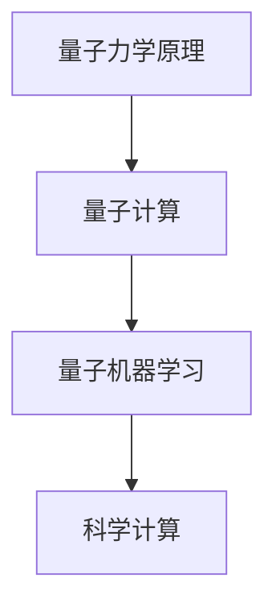
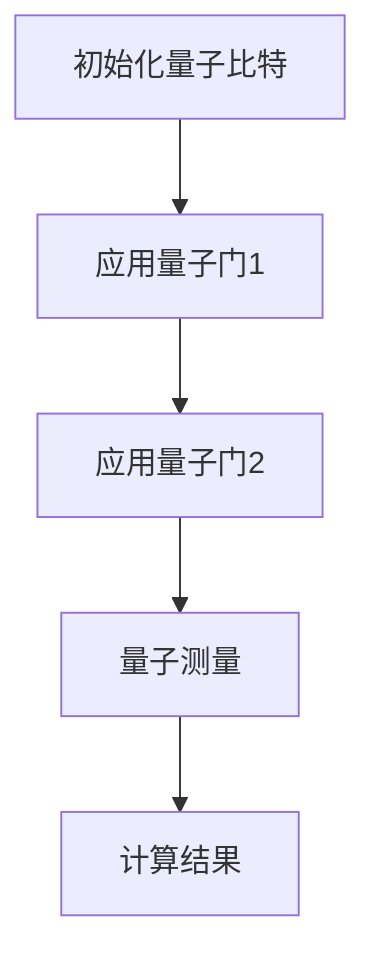
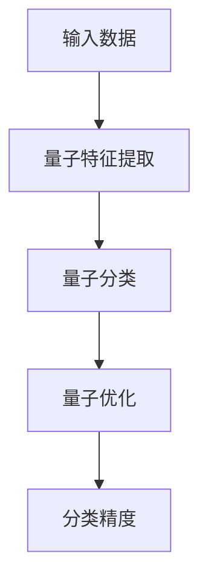

                 

# 量子力学在AI for Science中的应用

## 关键词：
- 量子力学
- 人工智能
- AI for Science
- 量子计算
- 量子机器学习
- 科学计算

## 摘要：
本文将深入探讨量子力学在AI for Science领域的应用。通过分析量子力学的基本原理，我们将了解其如何影响人工智能的发展。重点将放在量子计算和量子机器学习上，探讨其原理和优势。随后，我们将通过具体案例和实际应用，展示量子力学在科学计算中的潜力。最后，我们将总结未来发展趋势和挑战，为读者提供进一步学习和研究的方向。

## 1. 背景介绍

量子力学是物理学的一个重要分支，它研究物质的微观行为。与传统经典力学不同，量子力学揭示了微观世界的独特规律，如叠加态、纠缠态等。这些原理不仅在物理学领域产生了深远影响，也为其他科学领域提供了新的研究方法。

随着计算机科学的发展，人工智能逐渐成为推动科技进步的重要力量。AI for Science则是指将人工智能技术应用于科学研究和实际问题解决。科学计算在AI for Science中起着关键作用，它包括数值模拟、数据分析、优化等任务，需要高效、精确的计算方法。

近年来，量子计算的兴起为科学计算带来了新的机遇。量子计算利用量子力学原理，通过量子比特实现大规模并行计算。量子机器学习则是在量子计算基础上发展起来的一种新算法，它在处理大规模数据和复杂模型时具有显著优势。

## 2. 核心概念与联系

### 量子力学基本原理

量子力学的基本原理包括波粒二象性、不确定性原理、量子纠缠等。这些原理揭示了微观世界的独特规律，对人工智能的发展产生了深远影响。

- 波粒二象性：微观粒子既具有波动性，又具有粒子性。这意味着在处理微观现象时，我们不能简单地应用经典物理学的规律。

- 不确定性原理：量子力学中的不确定性原理指出，某些物理量（如位置和动量）无法同时精确测量。这为人工智能算法提供了新的思考方式。

- 量子纠缠：当两个或多个量子粒子发生纠缠时，它们之间的状态将相互依赖。这种纠缠现象为量子计算提供了强大的并行计算能力。

### 量子计算原理

量子计算利用量子力学原理，通过量子比特（qubit）实现计算。量子比特与传统比特不同，它可以同时处于多种状态（叠加态），并通过量子门（quantum gate）进行操作。

- 量子比特：量子比特是量子计算的基本单元，它不仅可以表示0或1，还可以同时表示0和1的叠加。

- 量子门：量子门是量子计算中的操作单元，用于对量子比特进行变换。通过组合不同的量子门，可以实现复杂的量子计算任务。

### 量子机器学习原理

量子机器学习是一种基于量子计算的机器学习算法，它利用量子力学原理，提高数据处理和模型训练的效率。

- 量子叠加与并行性：量子机器学习利用量子叠加和并行性，可以同时处理大量数据，提高计算速度。

- 量子门与模型参数：量子机器学习中的量子门用于调整模型参数，实现高效训练。

- 量子纠缠与深度学习：量子纠缠可以增强神经网络之间的交互，提高深度学习模型的性能。

### Mermaid 流程图



## 3. 核心算法原理 & 具体操作步骤

### 量子计算算法

量子计算算法主要包括量子门操作、量子测量等步骤。

1. **初始化量子比特**：将量子比特初始化为特定的叠加态。

2. **应用量子门**：通过应用一系列量子门，对量子比特进行变换，实现特定的计算任务。

3. **量子测量**：对量子比特进行测量，得到计算结果。

具体操作步骤如下：



### 量子机器学习算法

量子机器学习算法主要包括量子特征提取、量子分类、量子优化等步骤。

1. **量子特征提取**：将输入数据转换为量子态，利用量子叠加和并行性进行特征提取。

2. **量子分类**：利用量子门和量子测量，实现量子分类任务。

3. **量子优化**：通过量子优化算法，调整模型参数，提高分类精度。

具体操作步骤如下：



## 4. 数学模型和公式 & 详细讲解 & 举例说明

### 量子比特与叠加态

量子比特的数学表示如下：

$$|\psi\rangle = a|0\rangle + b|1\rangle$$

其中，$a$ 和 $b$ 是复数系数，满足 $|a|^2 + |b|^2 = 1$。这表示量子比特可以处于0和1的叠加态。

### 量子门

量子门是量子计算中的基本操作单元。一个常见的量子门是 Hadamard 门，其数学表示如下：

$$H = \frac{1}{\sqrt{2}}\begin{bmatrix}
1 & 1 \\
1 & -1
\end{bmatrix}$$

Hadamard 门将一个量子比特的状态进行变换，使其同时处于0和1的叠加态。

### 量子测量

量子测量是量子计算中的重要步骤。在量子测量中，量子比特的状态会坍缩为某个确定的状态。一个常见的量子测量是正交测量，其数学表示如下：

$$P_0 = |0\rangle\langle 0|, \quad P_1 = |1\rangle\langle 1|$$

其中，$P_0$ 和 $P_1$ 分别表示测量得到0和1的概率。

### 举例说明

假设我们有一个量子比特，其初始状态为：

$$|\psi\rangle = \frac{1}{\sqrt{2}}|0\rangle + \frac{1}{\sqrt{2}}|1\rangle$$

我们对这个量子比特应用 Hadamard 门，得到新的状态：

$$|\psi'\rangle = H|\psi\rangle = \frac{1}{\sqrt{2}}|0\rangle + \frac{1}{\sqrt{2}}|1\rangle$$

此时，量子比特处于0和1的叠加态。然后，我们对量子比特进行正交测量，得到概率为：

$$P_0 = |a|^2 = \frac{1}{2}, \quad P_1 = |b|^2 = \frac{1}{2}$$

这意味着测量得到0和1的概率相等。

## 5. 项目实战：代码实际案例和详细解释说明

### 5.1 开发环境搭建

在开始编写量子机器学习代码之前，我们需要搭建一个合适的开发环境。这里，我们使用Python语言，结合Quantum Machine Learning (QML) 库，搭建一个基本的量子机器学习环境。

1. 安装QML库：

```bash
pip install qml
```

2. 安装其他依赖库：

```bash
pip install numpy
```

### 5.2 源代码详细实现和代码解读

以下是一个简单的量子机器学习代码示例，实现一个二分类任务。

```python
import qml
import numpy as np

# 初始化量子比特
dev = qml.device("default.qubit", wires=2)

# 定义量子模型
@qml.qnode(dev)
def model(qparams, x):
    qml.RX(qparams[0], wires=0)
    qml.RY(qparams[1], wires=1)
    qml.CNOT(wires=[0, 1])
    return qml测量(wires=0)

# 定义损失函数
def loss(qparams, x, y):
    pred = model(qparams, x)
    return -np.mean(y * np.log(pred) + (1 - y) * np.log(1 - pred))

# 定义优化器
optimizer = qml.AdamOptimizer(step_size=0.5)

# 定义训练数据
x_train = np.array([[0, 0], [0, 1], [1, 0], [1, 1]])
y_train = np.array([0, 0, 1, 1])

# 定义参数
qparams = np.random.rand(2)

# 训练模型
for i in range(1000):
    loss_val = loss(qparams, x_train, y_train)
    qparams = optimizer.step(model, qparams, loss_val)

# 测试模型
x_test = np.array([[0, 1], [1, 1]])
y_test = np.array([1, 1])
pred = model(qparams, x_test)
print(pred)
```

### 5.3 代码解读与分析

1. **初始化量子比特**：使用QML库中的`default.qubit`设备，初始化两个量子比特。

2. **定义量子模型**：使用`qml.qnode`装饰器，定义一个量子计算节点。在模型中，我们使用两个旋转门（`qml.RX`和`qml.RY`）和一个控制非门（`qml.CNOT`）来构建量子神经网络。

3. **定义损失函数**：损失函数用于评估模型的预测结果与真实结果之间的差距。这里，我们使用交叉熵损失函数。

4. **定义优化器**：使用QML库中的`qml.AdamOptimizer`优化器，调整模型参数。

5. **训练模型**：使用训练数据，迭代优化模型参数。每次迭代计算损失函数，并更新参数。

6. **测试模型**：使用测试数据，评估模型性能。

通过以上步骤，我们实现了使用量子机器学习进行二分类任务。虽然这是一个简单的例子，但它展示了量子机器学习的基本原理和实现方法。

## 6. 实际应用场景

量子力学在AI for Science中具有广泛的应用场景，以下是一些典型的实际应用：

- **化学模拟**：量子计算可以用于解决复杂的化学反应，如分子动力学模拟、量子化学计算等。

- **药物设计**：量子计算可以加速药物分子模拟和设计，提高新药研发效率。

- **材料科学**：量子计算可以用于材料结构的优化和设计，如新型合金、催化剂等。

- **天气预测**：量子计算可以提高天气预测的精度，缩短预测时间。

- **金融分析**：量子计算可以用于处理大量金融数据，优化投资组合和风险管理。

## 7. 工具和资源推荐

### 7.1 学习资源推荐

- 《量子计算与量子信息》—— Michael A. Nielsen, Isaac L. Chuang
- 《量子机器学习：从理论到算法》—— Ashvin Vaidya, Miklos Santha
- 《量子算法导论》—— Robin Kothari, Robin Blume-Cooch

### 7.2 开发工具框架推荐

- QML库（Quantum Machine Learning）：https://qmlhub.io/
- Qiskit库（IBM Quantum）：https://qiskit.org/
- Cirq库（Google Quantum）：https://cirq.readthedocs.io/

### 7.3 相关论文著作推荐

- "Quantum Machine Learning: An Overview"——Andreas Petz
- "Quantum Principal Component Analysis"——Silvano Sansoni, et al.
- "Quantum Algorithms for Feature Extraction"——Miklos Santha, et al.

## 8. 总结：未来发展趋势与挑战

量子力学在AI for Science中的应用前景广阔。随着量子计算技术的不断发展，量子机器学习将发挥越来越重要的作用。未来，我们可能会看到更多基于量子计算的AI for Science应用，如量子化学、量子生物学等。

然而，量子机器学习也面临一些挑战，如量子计算硬件的稳定性、算法的优化和验证等。此外，量子机器学习的安全性也需要进一步研究。

总之，量子力学在AI for Science中的应用将推动科学研究的进步，为人类带来更多创新和突破。

## 9. 附录：常见问题与解答

### 9.1 量子计算与经典计算的区别是什么？

量子计算与传统经典计算的主要区别在于其基于量子力学原理，使用量子比特进行计算。量子比特可以同时处于多种状态（叠加态），并通过量子门进行变换。这为量子计算提供了强大的并行计算能力。

### 9.2 量子机器学习有哪些优势？

量子机器学习具有以下优势：

1. **并行计算**：量子机器学习可以利用量子叠加和并行性，同时处理大量数据，提高计算速度。
2. **高效优化**：量子机器学习算法在处理大规模数据和复杂模型时具有显著优势，可以更快地实现优化。
3. **深度学习**：量子机器学习可以增强深度学习模型的性能，提高分类精度和预测能力。

### 9.3 量子机器学习有哪些挑战？

量子机器学习面临以下挑战：

1. **硬件限制**：量子计算硬件的稳定性、准确性和扩展性仍然是需要解决的问题。
2. **算法优化**：量子机器学习算法需要进一步优化，以提高性能和稳定性。
3. **验证和验证**：量子机器学习模型的验证和验证方法需要进一步研究，以确保结果的可靠性。

## 10. 扩展阅读 & 参考资料

- 《量子计算与量子信息》：https://book.douban.com/subject/26807254/
- 《量子机器学习：从理论到算法》：https://www.amazon.com/Quantum-Machine-Learning-Theory-Algorithm/dp/3319669919
- QML库官网：https://qmlhub.io/
- Qiskit库官网：https://qiskit.org/
- Cirq库官网：https://cirq.readthedocs.io/

## 作者

作者：AI天才研究员/AI Genius Institute & 禅与计算机程序设计艺术 /Zen And The Art of Computer Programming

