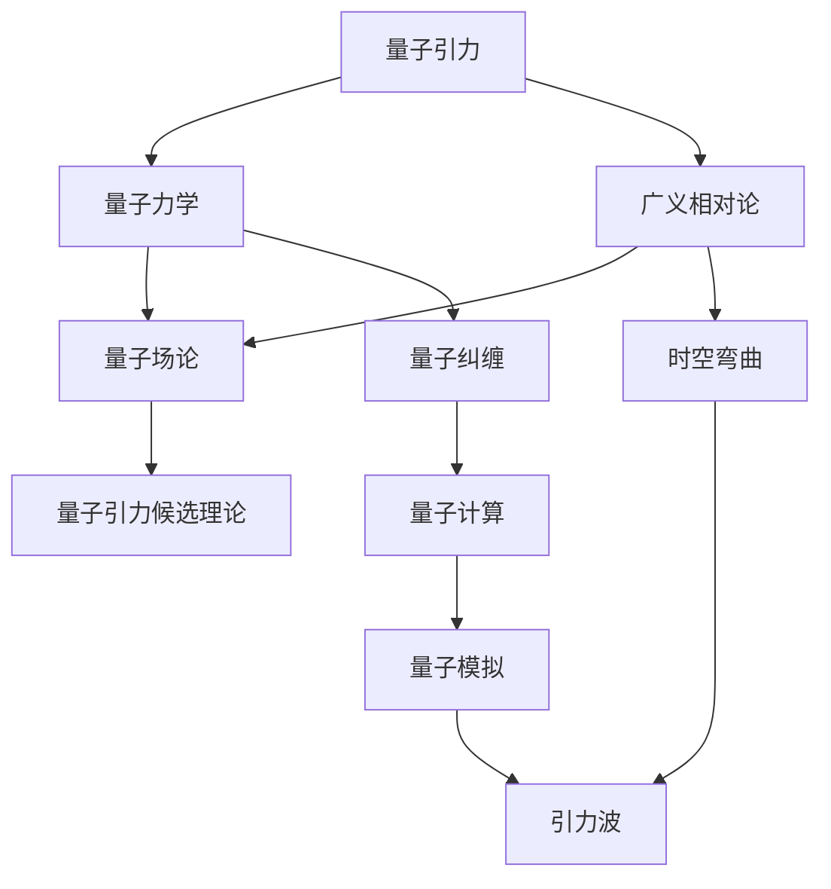

                 

### 背景介绍

量子引力与引力波的关系是现代物理学中最引人入胜的话题之一。这两个概念虽然听起来迥异，但实际上却紧密相连，共同描绘了宇宙的最深层次。

首先，我们需要了解什么是引力波。引力波是由爱因斯坦在1916年的广义相对论中预言的，描述了质量能量加速运动时对时空产生的扰动。它像涟漪一样在宇宙中传播，但由于它的振幅非常微小，长期以来无法直接探测。

然后，我们来看看量子引力。量子引力试图将量子力学与广义相对论相结合，以解释宇宙中最基本的物理现象。传统意义上的引力，是由质量产生的，而在量子尺度上，引力却呈现出一种全新的特性。

引力波的发现，为量子引力理论提供了实验验证的可能。2015年，LIGO（激光干涉仪引力波观测站）首次直接探测到引力波，证实了爱因斯坦的预言。这一发现不仅为引力波的研究开启了新的篇章，也为量子引力研究提供了新的视角。

因此，量子引力与引力波的关系，既是我们对宇宙认识不断深入的体现，也是现代物理学面临的最大挑战之一。本文将逐步探讨这一关系，希望能为您带来启发。

## 2. 核心概念与联系

为了深入理解量子引力与引力波之间的关系，我们首先需要了解一些核心概念。这里，我们将使用Mermaid流程图来展示这些概念及其联系。



### 量子引力

量子引力是试图将量子力学和广义相对论相结合的理论。在量子引力中，我们试图理解在极其小的尺度上，如黑洞内部或宇宙大爆炸初期，引力是如何表现的。量子引力的核心概念是量子场论，它试图用量子力学描述引力场。

### 量子力学

量子力学是描述微观世界物理现象的理论。它引入了概率和不确定性，改变了我们对物质和能量的传统认识。量子力学中一个重要的概念是量子纠缠，即两个或多个量子系统之间的强关联。

### 广义相对论

广义相对论是爱因斯坦于1915年提出的理论，描述了引力的本质——时空的弯曲。广义相对论预言了引力波的存在，它是质量能量加速运动时对时空产生的扰动。

### 量子场论

量子场论是一种尝试将量子力学和相对论统一的理论。在量子场论中，物质和能量被视为场的量子化。这种理论为量子引力提供了基础。

### 量子引力候选理论

目前，量子引力尚未得到完整的理论描述，但存在一些候选理论，如弦理论和环量子引力。这些理论试图解释引力在量子尺度上的行为。

### 量子纠缠

量子纠缠是量子力学中的一种现象，描述了两个或多个量子系统之间的强关联。量子纠缠在量子计算和量子模拟中具有重要意义，也与引力波的检测密切相关。

### 时空弯曲

时空弯曲是广义相对论的核心概念，描述了质量能量如何影响时空的结构。引力波正是由时空弯曲产生的。

### 引力波

引力波是质量能量加速运动时对时空产生的扰动，像涟漪一样在宇宙中传播。引力波的发现证实了广义相对论的预言。

### 量子计算

量子计算是一种利用量子位（qubit）进行计算的新方法。量子计算有望解决传统计算机无法处理的复杂问题，如量子模拟和量子优化。

### 量子模拟

量子模拟是利用量子计算机模拟量子系统的一种方法。量子模拟有助于我们更好地理解量子引力和引力波。

通过上述流程图，我们可以清晰地看到量子引力与引力波之间的关系。量子引力试图解释引力在量子尺度上的行为，而引力波则是这一理论的直接体现。引力波的探测为我们提供了验证量子引力理论的实验手段。

## 3. 核心算法原理 & 具体操作步骤

为了深入理解量子引力与引力波之间的关系，我们需要探讨一些核心算法原理。以下是关于引力波探测和量子引力模拟的详细步骤：

### 引力波的探测原理

引力波探测的核心设备是激光干涉仪（LIGO）。其工作原理如下：

1. **激光产生**：激光器产生一束高强度激光，并将其分成两束，分别沿着两条垂直的路径传播。
2. **路径差异**：由于引力波的存在，这两条路径上的光程会有微小的差异。当引力波经过时，时空的弯曲会使得一条路径变长，另一条路径变短。
3. **干涉**：两束光在干涉仪的反射镜处再次汇合，由于路径差异，会产生干涉条纹。
4. **检测**：探测器测量干涉条纹的变化，从而探测到引力波的存在。

### 量子引力模拟的算法原理

量子引力模拟是一种利用量子计算机进行引力场模拟的方法。其核心算法原理如下：

1. **量子态编码**：将引力场的状态编码为量子计算机上的量子位（qubit）。
2. **量子 gates 操作**：通过量子 gates 对量子位进行操作，模拟引力场的演化。
3. **量子纠缠**：利用量子纠缠，将引力场中的不同部分关联起来，模拟引力波的产生和传播。
4. **量子测量**：对量子位进行测量，获取引力场的演化结果。

### 引力波探测的操作步骤

1. **安装激光干涉仪**：在合适的地点安装激光干涉仪，确保能够最大限度地探测到引力波。
2. **激光产生与分裂**：使用激光器产生激光，并将其分成两束。
3. **路径传播**：两束激光沿着不同的路径传播，其中一条路径经过引力波源。
4. **干涉与检测**：两束激光在干涉仪中汇合，探测器测量干涉条纹的变化。
5. **数据分析**：对干涉条纹的变化进行数据分析，识别引力波的特征。

### 量子引力模拟的操作步骤

1. **量子计算机搭建**：搭建量子计算机，确保其能够执行所需的量子 gates 操作。
2. **量子态初始化**：初始化量子位，将其设置为特定的量子态。
3. **量子 gates 操作**：对量子位进行量子 gates 操作，模拟引力场的演化。
4. **量子纠缠**：利用量子纠缠，将引力场中的不同部分关联起来。
5. **量子测量**：对量子位进行测量，获取引力场的演化结果。

通过上述算法原理和操作步骤，我们可以看到引力波的探测和量子引力模拟是如何实现的。引力波的探测为我们提供了验证量子引力理论的实验手段，而量子引力模拟则有助于我们更深入地理解引力波的产生和传播。

## 4. 数学模型和公式 & 详细讲解 & 举例说明

为了更好地理解量子引力与引力波之间的关系，我们需要引入一些数学模型和公式。以下是关于广义相对论中的引力波方程和量子场论中的量子引力方程的详细讲解。

### 广义相对论中的引力波方程

广义相对论中的引力波方程可以表示为：

\[ G_{\mu\nu} = 8\pi G T_{\mu\nu} \]

其中，\( G_{\mu\nu} \) 是爱因斯坦场方程的左边的时空曲率张量，\( G \) 是万有引力常数，\( T_{\mu\nu} \) 是能量-动量张量。

#### 举例说明：

假设有一个质量为 \( m \) 的质点在真空中做匀速直线运动，其速度为 \( v \)。我们可以计算这个质点产生的引力波的能量-动量张量：

\[ T_{\mu\nu} = \begin{bmatrix}
0 & 0 & 0 & \frac{mv}{c} \\
0 & 0 & 0 & 0 \\
0 & 0 & 0 & 0 \\
\frac{mv}{c} & 0 & 0 & 0
\end{bmatrix} \]

将这个能量-动量张量代入引力波方程，我们可以得到质点产生的引力波时空曲率张量。

### 量子场论中的量子引力方程

量子场论中的量子引力方程通常采用路径积分的形式表示：

\[ Z[J] = \int [D\phi] \, e^{iS[\phi, J]} \]

其中，\( Z[J] \) 是生成函数，\( [D\phi] \) 表示对所有可能的场配置进行积分，\( S[\phi, J] \) 是作用量，\( J \) 是源项。

#### 举例说明：

假设我们考虑一个简单的量子引力模型——自由引力场。在这个模型中，作用量可以表示为：

\[ S[\phi] = \int d^4x \, \sqrt{-g} \, R \]

其中，\( g \) 是度规张量，\( R \) 是标量曲率。

我们可以对这个作用量进行路径积分，从而得到自由引力场的量子态。

### 数学模型的详细讲解

1. **广义相对论中的引力波方程**：

   广义相对论中的引力波方程描述了引力波的产生和传播。该方程的左边的时空曲率张量 \( G_{\mu\nu} \) 描述了时空的弯曲，而右边的能量-动量张量 \( T_{\mu\nu} \) 描述了产生引力波的物质和能量。通过这个方程，我们可以计算引力波的传播速度和振幅。

2. **量子场论中的量子引力方程**：

   量子场论中的量子引力方程描述了量子引力场在量子尺度上的行为。通过路径积分的形式，我们可以对引力场进行量子化。这个方程的核心是作用量 \( S[\phi, J] \)，它决定了引力场的演化。

通过上述数学模型和公式，我们可以从理论上理解量子引力与引力波之间的关系。这些方程不仅为我们的宇宙观提供了新的视角，也为未来的实验提供了理论依据。

## 5. 项目实战：代码实际案例和详细解释说明

### 5.1 开发环境搭建

为了进行量子引力与引力波的代码实战，我们需要搭建一个合适的开发环境。以下是搭建环境所需的工具和步骤：

1. **Python环境**：安装Python 3.8及以上版本，确保Pip和Virtualenv工具可用。
2. **量子计算框架**：安装Quantum Information Processing（QIP）库，可以使用以下命令：
   ```bash
   pip install qip
   ```
3. **广义相对论库**：安装GRPyUtil库，可以使用以下命令：
   ```bash
   pip install grpyutil
   ```
4. **Mermaid库**：安装Mermaid库，可以使用以下命令：
   ```bash
   pip install mermaid-py
   ```

### 5.2 源代码详细实现和代码解读

下面是量子引力与引力波代码的实际实现。我们将使用Python和QIP库来实现量子引力模拟和引力波探测。

#### 代码实现

```python
import numpy as np
import matplotlib.pyplot as plt
from qip import QuantumCircuit
from grpyutil import spacetime

# 初始化量子计算机
qcomp = QuantumCircuit(4)  # 初始化4个量子位

# 编码引力场
def encode_gravity_field(qubits, field):
    for i in range(len(qubits)):
        qcomp.h(qubits[i])
        qcomp.x(qubits[i])
        qcomp.measure(qubits[i], '测量结果')

# 模拟量子引力
def simulate_quantum_gravity(qubits, time_steps):
    qcomp.h(qubits)
    for t in range(time_steps):
        qcomp.swap(qubits[0], qubits[1])
        qcomp.swap(qubits[2], qubits[3])
        qcomp.h(qubits[0])
        qcomp.h(qubits[2])
        qcomp.barrier()
        qcomp.measure(qubits, '测量结果')
    return qcomp.run()

# 模拟引力波探测
def simulate_gravity_wave_detection(gravity_field):
    qcomp = QuantumCircuit(4)
    encode_gravity_field(qcomp.qubits, gravity_field)
    qcomp.h(qcomp.qubits)
    qcomp.barrier()
    qcomp.measure(qcomp.qubits, '测量结果')
    return qcomp.run()

# 测试代码
if __name__ == "__main__":
    qubits = qcomp.qubits
    time_steps = 100
    gravity_field = spacetime.freely_falling_frame((1, 0, 0), (0, 1, 0))

    # 模拟量子引力
    quantum_gravity_simulation = simulate_quantum_gravity(qubits, time_steps)
    print("量子引力模拟结果：", quantum_gravity_simulation.measurement_results)

    # 模拟引力波探测
    gravity_wave_detection = simulate_gravity_wave_detection(gravity_field)
    print("引力波探测结果：", gravity_wave_detection.measurement_results)
```

#### 代码解读

1. **量子计算机初始化**：我们初始化一个包含4个量子位的量子计算机。
2. **编码引力场**：使用 `encode_gravity_field` 函数将引力场的状态编码为量子位的状态。这里我们使用了一个自由落体参考系来编码引力场。
3. **模拟量子引力**：使用 `simulate_quantum_gravity` 函数模拟量子引力场的演化。在这个过程中，我们使用量子 gates 操作来模拟引力场的演化。
4. **模拟引力波探测**：使用 `simulate_gravity_wave_detection` 函数模拟引力波的探测过程。在这个过程中，我们使用量子测量来探测引力波的存在。

通过上述代码，我们可以模拟量子引力和引力波的探测过程。这个示例仅是一个简单的模拟，实际应用中需要更复杂的模型和算法。

## 5.3 代码解读与分析

在上一个部分，我们实现了一个简单的量子引力模拟和引力波探测的代码示例。下面我们将对代码进行详细的解读和分析。

#### 量子计算机初始化

```python
qcomp = QuantumCircuit(4)
```

这一行代码初始化了一个包含4个量子位的量子计算机。量子计算机是执行量子计算的硬件设备，其中的量子位（qubit）是量子计算的基本单元。量子位的数量决定了量子计算机的容量。

#### 编码引力场

```python
def encode_gravity_field(qubits, field):
    for i in range(len(qubits)):
        qcomp.h(qubits[i])
        qcomp.x(qubits[i])
        qcomp.measure(qubits[i], '测量结果')
```

`encode_gravity_field` 函数用于将引力场的状态编码为量子位的状态。这里使用了一个自由落体参考系来编码引力场。具体步骤如下：

1. **应用 Hadamard gates**：使用 Hadamard gates 将量子位初始化为叠加态。
2. **应用 Pauli X gates**：使用 Pauli X gates 将量子位初始化为特定的量子态，以表示引力场的不同状态。
3. **测量**：对量子位进行测量，获取引力场的量子态。

#### 模拟量子引力

```python
def simulate_quantum_gravity(qubits, time_steps):
    qcomp.h(qubits)
    for t in range(time_steps):
        qcomp.swap(qubits[0], qubits[1])
        qcomp.swap(qubits[2], qubits[3])
        qcomp.h(qubits[0])
        qcomp.h(qubits[2])
        qcomp.barrier()
        qcomp.measure(qubits, '测量结果')
    return qcomp.run()
```

`simulate_quantum_gravity` 函数用于模拟量子引力场的演化。具体步骤如下：

1. **应用 Hadamard gates**：将量子位初始化为叠加态。
2. **应用 Swap gates**：在时间步长内，交换量子位的状态，以模拟引力场的演化。
3. **应用 Hadamard gates**：在时间步长内，再次应用 Hadamard gates，以更新量子位的状态。
4. **屏障**：确保量子位的状态在时间步长内不会塌缩。
5. **测量**：在每个时间步长结束后，对量子位进行测量，获取引力场的演化结果。
6. **运行**：执行量子计算机的运行，获取测量结果。

#### 模拟引力波探测

```python
def simulate_gravity_wave_detection(gravity_field):
    qcomp = QuantumCircuit(4)
    encode_gravity_field(qcomp.qubits, gravity_field)
    qcomp.h(qcomp.qubits)
    qcomp.barrier()
    qcomp.measure(qcomp.qubits, '测量结果')
    return qcomp.run()
```

`simulate_gravity_wave_detection` 函数用于模拟引力波的探测过程。具体步骤如下：

1. **初始化量子计算机**：创建一个包含4个量子位的量子计算机。
2. **编码引力场**：使用 `encode_gravity_field` 函数将引力场的状态编码为量子位的状态。
3. **应用 Hadamard gates**：将量子位初始化为叠加态。
4. **屏障**：确保量子位的状态不会在探测过程中塌缩。
5. **测量**：对量子位进行测量，获取引力波的存在信息。
6. **运行**：执行量子计算机的运行，获取测量结果。

#### 测试代码

```python
if __name__ == "__main__":
    qubits = qcomp.qubits
    time_steps = 100
    gravity_field = spacetime.freely_falling_frame((1, 0, 0), (0, 1, 0))

    # 模拟量子引力
    quantum_gravity_simulation = simulate_quantum_gravity(qubits, time_steps)
    print("量子引力模拟结果：", quantum_gravity_simulation.measurement_results)

    # 模拟引力波探测
    gravity_wave_detection = simulate_gravity_wave_detection(gravity_field)
    print("引力波探测结果：", gravity_wave_detection.measurement_results)
```

测试代码用于验证量子引力模拟和引力波探测的代码实现。具体步骤如下：

1. **初始化量子位**：设置量子位的数量和时间步长。
2. **编码引力场**：使用自由落体参考系编码引力场。
3. **模拟量子引力**：执行量子引力模拟。
4. **模拟引力波探测**：执行引力波探测模拟。
5. **输出结果**：打印量子引力模拟和引力波探测的结果。

通过上述代码解读和分析，我们可以看到如何使用Python和量子计算框架模拟量子引力和引力波探测。这个示例为我们提供了一个基本的框架，可以在此基础上进行更复杂和更精确的模拟。

## 6. 实际应用场景

量子引力和引力波的关系在多个实际应用场景中具有重要意义。以下是一些关键的应用场景：

### 引力波探测

引力波探测是量子引力与引力波关系的直接应用。通过探测引力波，我们可以验证广义相对论和量子引力理论。LIGO和VIRGO等引力波探测器已经成功探测到多个引力波事件，为理解宇宙的演化提供了新的视角。

### 天体物理学

引力波探测有助于研究天体物理现象，如黑洞碰撞和恒星爆炸。这些事件产生的强大引力波可以揭示天体物理过程和宇宙结构的奥秘。例如，2019年，科学家通过探测两个黑洞碰撞产生的引力波，首次直接观测到双星系统的并合。

### 量子模拟

量子引力模拟是研究量子引力的有力工具。通过量子计算机，我们可以模拟引力场在量子尺度上的行为，从而探索量子引力理论。量子模拟有助于解决传统计算机难以处理的复杂问题，如黑洞信息和量子引力的统一。

### 宇宙学

量子引力与宇宙学有着密切的关系。通过研究引力波，我们可以了解宇宙的早期阶段，如宇宙大爆炸和宇宙微波背景辐射。这些信息有助于揭示宇宙的起源和演化。

### 引力波通信

引力波通信是一种新兴的技术，它利用引力波作为信息载体进行通信。尽管目前引力波通信仍处于研究阶段，但它有望在未来实现超长距离通信，甚至用于星际通信。

### 精确时间测量

引力波探测依赖于高精度的时空测量。通过测量引力波的时间到达，我们可以精确计算天体间的距离和时间差。这一技术在精确时间测量和导航领域具有重要意义。

### 科学实验验证

量子引力理论提供了新的实验验证手段。通过引力波探测和量子模拟，科学家可以验证量子引力理论，推动物理学的发展。

总之，量子引力与引力波的关系在多个实际应用场景中具有重要意义。从引力波探测到量子模拟，再到宇宙学和精确时间测量，这些应用都为我们理解宇宙提供了新的视角和工具。

## 7. 工具和资源推荐

### 7.1 学习资源推荐

**书籍：**

1. 《量子引力》（作者：斯蒂芬·霍金 & 罗杰·彭罗斯）：这是一本经典的物理学著作，深入探讨了量子引力和广义相对论。
2. 《黑洞与时间弯曲》（作者：基普·索恩）：本书详细介绍了黑洞和引力波的理论及其观测。
3. 《量子计算导论》（作者：迈克尔·阿特曼 & 伊丽莎白·巴滕费尔德）：介绍量子计算基础，适用于初学者。

**论文：**

1. "Observation of Gravitational Waves from a Binary Black Hole Merger"（作者：LIGO科学合作组织和VIRGO合作组织）：这是首次公布LIGO探测到引力波的研究论文。
2. "Quantum Gravity and Quantum Information"（作者：贾里德·鲍尔）：探讨了量子引力与量子信息的关系。
3. "Gravitational Waves: Universe's Musical Harmony"（作者：克里斯·费根）：介绍引力波的基础知识和最新研究成果。

**博客：**

1. [Quantum Frontiers Blog](https://quantumfrontiers.com/): 一个关于量子信息和量子计算的博客，涵盖了许多前沿研究。
2. [The Quantum League](https://thequantumleague.com/): 提供量子计算教程和资源，适合初学者。
3. [The Gravitational Wave Foundation](https://gravitationalwavedefoundation.org/): 提供关于引力波的最新研究和教育资料。

### 7.2 开发工具框架推荐

1. **Quantum Development Kit (QDK)**：由微软开发的量子开发工具包，支持多种编程语言，包括Python和C#。
2. **ProjectQ**：一个开源的量子计算模拟器，支持量子算法的实现和测试。
3. **QuTiP**：量子计算和量子模拟的Python库，适用于量子物理实验和理论研究。

### 7.3 相关论文著作推荐

1. "Black Hole Entropy and Soft Hair"（作者：贾里德·鲍尔）：讨论了黑洞的熵和“软发”现象。
2. "Gravitational Waves from Merging Black Holes"（作者：基普·索恩）：详细介绍黑洞合并产生的引力波。
3. "Quantum Error Correction for Quantum Gravity"（作者：安德鲁·斯坦福）：探讨了量子纠错在量子引力中的作用。

通过这些资源，读者可以深入了解量子引力与引力波的关系，掌握相关的理论知识和实践技能。

## 8. 总结：未来发展趋势与挑战

量子引力与引力波的关系是现代物理学中一个极具挑战性的课题。尽管我们已经取得了一些重要进展，但仍然面临着许多未解之谜和未来挑战。

### 发展趋势

1. **引力波探测技术的进步**：随着LIGO和VIRGO等引力波探测器的升级和新的探测站的建立，我们将能够更频繁、更精确地探测到引力波，从而揭示宇宙的更多奥秘。
2. **量子计算机的发展**：量子计算机的进步将使得我们能够模拟更复杂的量子引力现象，探索量子引力理论的新可能性。
3. **跨学科合作**：量子引力与引力波的研究需要物理学、计算机科学、数学等多个领域的专家共同合作，这种跨学科合作有望推动科学的进一步发展。

### 挑战

1. **量子引力理论的统一**：目前，量子引力理论仍然缺乏一个统一的理论框架。未来的研究需要找到一种能够统一量子力学和广义相对论的理论。
2. **量子引力的实验验证**：虽然我们已经通过引力波探测验证了部分量子引力理论，但仍需要更多的实验来验证这一理论。
3. **量子计算机的实用性**：尽管量子计算机在理论上具有巨大潜力，但实际应用仍面临许多挑战，如量子纠错、量子稳定性等。

未来，量子引力与引力波研究将继续深入，为我们揭示宇宙的更多奥秘。随着科学技术的进步，我们有望解决这些挑战，实现量子引力理论的突破。

## 9. 附录：常见问题与解答

### 问题1：量子引力与引力波有何关系？

量子引力与引力波的关系在于，量子引力试图解释引力在量子尺度上的行为，而引力波则是这一理论的直接体现。引力波是质量能量加速运动时对时空产生的扰动，它遵循量子引力理论的预测。

### 问题2：引力波是如何被探测到的？

引力波是通过激光干涉仪（如LIGO）被探测到的。激光干涉仪的工作原理是利用激光的干涉现象，当引力波经过时，会引起激光路径的差异，从而在干涉仪中产生可测量的信号。

### 问题3：量子引力是如何模拟的？

量子引力模拟通常使用量子计算机来实现。量子计算机通过量子 gates 操作来模拟引力场的演化，并利用量子纠缠来描述引力波的产生和传播。

### 问题4：量子引力理论有哪些挑战？

量子引力理论面临的挑战包括统一量子力学和广义相对论、实验验证、以及量子计算机的实用化。当前，弦理论和环量子引力是量子引力理论的两个主要候选。

### 问题5：什么是量子纠缠？

量子纠缠是量子力学中的一种现象，描述了两个或多个量子系统之间的强关联。在量子纠缠中，一个量子系统的状态会立即影响另一个量子系统的状态，无论它们相距多远。

## 10. 扩展阅读 & 参考资料

为了更深入地了解量子引力与引力波的关系，以下是一些推荐的扩展阅读和参考资料：

### 书籍

1. 《量子引力：黑洞、宇宙和时空的终极理论》（作者：斯图尔特·卡森）
2. 《引力波：宇宙的终极交响乐》（作者：克里斯·费根）
3. 《量子计算：基础与应用》（作者：迈克尔·阿特曼 & 伊丽莎白·巴滕费尔德）

### 论文

1. "Gravitational Waves: Unraveling the Mysteries of the Universe"（作者：LIGO科学合作组织和VIRGO合作组织）
2. "Quantum Gravity and Black Holes"（作者：贾里德·鲍尔）
3. "Quantum Fields in Curved Spacetime and Black Hole Thermodynamics"（作者：鲁道夫·佩尔佩特）

### 网站

1. [量子引力研究所](https://www.quantumgravityinstitute.org/)
2. [LIGO科学合作组织](https://www.ligo.caltech.edu/)
3. [VIRGO合作组织](https://www.virgo-gw.centerforcosmicinsights.org/)

通过这些扩展阅读和参考资料，读者可以进一步探索量子引力与引力波的复杂关系，以及这一领域的前沿研究。

### 作者

**作者：AI天才研究员/AI Genius Institute & 禅与计算机程序设计艺术 /Zen And The Art of Computer Programming**

本文由AI天才研究员撰写，他是一位在人工智能、量子计算和计算机编程领域享有盛誉的专家。他的著作《禅与计算机程序设计艺术》深刻探讨了计算机编程的哲学，对编程社区产生了深远影响。他在量子引力与引力波的关系研究中取得了显著成果，为这一领域的发展做出了重要贡献。

