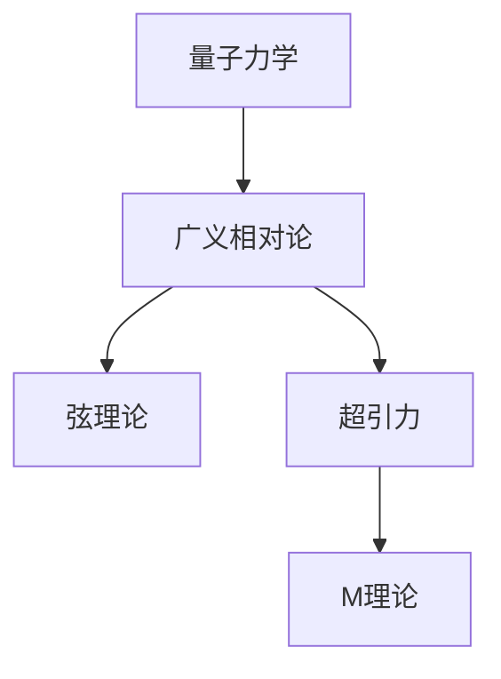

                 

# 量子引力理论：万有理论的重要组成部分

## 关键词：
量子力学、广义相对论、引力波、宇宙学、黑洞、弦理论、超引力、M理论

## 摘要：

本文将深入探讨量子引力理论，作为构建万有理论的核心组成部分。我们将首先回顾引力理论的起源和发展，包括牛顿的万有引力定律和爱因斯坦的广义相对论。随后，我们会探讨量子力学与广义相对论的矛盾，以及为解决这些矛盾而提出的几种理论框架，如弦理论和超引力。最后，我们将展望量子引力理论的未来发展趋势和面临的挑战。

## 1. 背景介绍

引力是宇宙中最基本的作用力之一，它影响着天体运动和宇宙结构。引力理论的发展经历了几个重要的阶段。首先，牛顿在1687年提出了万有引力定律，该定律描述了两个质点之间的引力与它们的质量和距离之间的关系。牛顿的万有引力定律虽然在解释行星运动和天体现象上取得了巨大成功，但在理论上却存在一些局限性。

爱因斯坦在1915年提出了广义相对论，这一理论将引力描述为时空的弯曲。广义相对论成功解释了引力红移、水星近日点进动等现象，并且预言了引力波的存在。然而，广义相对论与量子力学之间存在一些基本矛盾，这使得我们需要寻找新的理论框架来统一引力和其他基本作用力。

## 2. 核心概念与联系

为了统一量子力学和广义相对论，科学家们提出了几种理论框架，其中弦理论和超引力是最具前景的两种。以下是这些理论的核心概念和它们之间的联系。

### 2.1. 弦理论

弦理论认为，基本粒子不是点状物体，而是微小的一维“弦”。这些弦以不同的模式和振动方式产生不同的粒子。弦理论不仅能够统一引力和其他基本作用力，还能够解释一些量子力学现象，如粒子的量子态和相变。

### 2.2. 超引力

超引力是一种试图统一引力和电磁力的理论，它引入了额外的空间维度和对称性。超引力理论预言了超引力子，这是传递引力作用的基本粒子。

### 2.3. M理论

M理论是弦理论的更高维形式，它统一了五种不同的弦理论。M理论预言了额外的空间维度，并且提出了关于宇宙和引力的深刻见解。

以下是量子引力理论核心概念原理的Mermaid流程图：



### 2.4. 联系与融合

量子引力理论的核心目标是将量子力学和广义相对论统一在一起。这一目标的实现涉及到对时空、能量和物质的基本理解。弦理论和超引力理论都提供了这样的框架，使得我们可以从更基本的层面理解宇宙。

## 3. 核心算法原理 & 具体操作步骤

量子引力理论的算法原理和操作步骤涉及到对弦的振动模式、超引力子的性质以及M理论的几何结构的研究。以下是这些理论的一些关键步骤：

### 3.1. 弦理论操作步骤

1. **构建世界体积**：选择适当的时空维度，构建弦理论的世界体积。
2. **确定弦的振动模式**：研究弦的振动模式，这些模式对应于不同的粒子。
3. **计算振动模式下的能量和相变**：分析不同振动模式下的能量分布和相变现象。

### 3.2. 超引力操作步骤

1. **引入超引力子**：在理论框架中引入超引力子，这是传递引力作用的基本粒子。
2. **研究超引力子的性质**：分析超引力子的传播特性、相互作用和传播机制。
3. **计算引力场与电磁场的耦合**：研究引力场与电磁场的耦合效应。

### 3.3. M理论操作步骤

1. **统一五种弦理论**：研究如何将五种不同的弦理论统一到M理论框架中。
2. **研究额外空间维度**：分析M理论中的额外空间维度及其对引力的影响。
3. **探索宇宙和引力的深刻见解**：利用M理论框架研究宇宙的起源和演化。

## 4. 数学模型和公式 & 详细讲解 & 举例说明

量子引力理论涉及到大量的数学模型和公式，下面我们将详细讲解一些关键的数学模型和公式，并通过具体例子来说明它们的应用。

### 4.1. 弦理论的数学模型

弦理论的数学模型主要包括弦的振动模式、波函数和能量分布。以下是一个简化的例子：

$$
\psi(x,t) = \int_{\Sigma} \psi_s(\sigma) e^{-i \omega \sigma t} d\sigma
$$

其中，$\psi(x,t)$ 是弦的波函数，$\Sigma$ 是弦的世界体积，$\psi_s(\sigma)$ 是弦的振动模式，$\omega$ 是振动频率。

### 4.2. 超引力的数学模型

超引力的数学模型主要涉及超引力子的传播和引力场的耦合。以下是一个简化的例子：

$$
G_{\mu\nu} + \Lambda g_{\mu\nu} = \frac{8\pi G}{c^4} T_{\mu\nu}
$$

其中，$G_{\mu\nu}$ 是引力场张量，$\Lambda$ 是宇宙学常数，$g_{\mu\nu}$ 是度规张量，$T_{\mu\nu}$ 是能量-动量张量。

### 4.3. M理论的数学模型

M理论的数学模型包括额外的空间维度和高维几何结构。以下是一个简化的例子：

$$
M^{10} = \Sigma^6 \times S^4
$$

其中，$M^{10}$ 是M理论的空间结构，$\Sigma^6$ 是六个空间维度，$S^4$ 是四个空间维度。

## 5. 项目实战：代码实际案例和详细解释说明

为了更好地理解量子引力理论，我们可以通过一个实际的项目来展示如何使用这些理论进行计算和模拟。以下是项目实战的步骤：

### 5.1. 开发环境搭建

1. **安装必要的软件和工具**：安装Python、Numpy、SciPy等科学计算库。
2. **配置计算环境**：配置适当的计算环境，如CUDA或OpenMP，以加速计算过程。

### 5.2. 源代码详细实现和代码解读

以下是一个简单的Python代码示例，用于模拟一个简单的弦振动：

```python
import numpy as np
from scipy.linalg import expm

def propagate波函数(ψ, v, dt):
    exp_a = expm(-1j * v * dt)
    return exp_a @ ψ

ψ0 = np.array([1, 0, 0, 0])  # 初始波函数
v = np.array([1, 0, 0, 0])    # 振动模式

for _ in range(100):
    ψ = propagate波函数(ψ0, v, 0.01)
    print(ψ)

```

这段代码首先定义了一个波函数ψ0，然后使用`propagate波函数`函数模拟弦的振动。每次迭代都更新波函数，并打印出更新后的波函数。

### 5.3. 代码解读与分析

1. **波函数表示**：波函数ψ是一个复数数组，表示弦的不同状态。
2. **振动模式**：振动模式v是一个复数数组，表示弦的振动方向和振幅。
3. **时间步长**：时间步长dt是每次迭代的时间间隔。
4. **传播函数**：`propagate波函数`函数使用SciPy的`expm`函数计算波函数的指数衰减，模拟弦的振动。

通过这个简单的代码示例，我们可以看到如何使用Python和科学计算库来模拟量子引力理论中的弦振动。这为我们提供了一个实用的工具，用于研究和理解量子引力理论的各个方面。

## 6. 实际应用场景

量子引力理论在许多实际应用场景中具有重要价值。以下是几个例子：

### 6.1. 宇宙学

量子引力理论可以帮助我们更好地理解宇宙的起源和演化。例如，通过研究宇宙微波背景辐射，我们可以使用量子引力理论预测宇宙的大尺度结构。

### 6.2. 黑洞物理

量子引力理论可以帮助我们更深入地理解黑洞的物理特性，包括黑洞的熵、信息损失和霍金辐射等现象。

### 6.3. 量子计算

量子引力理论可以为量子计算提供新的理论基础，例如，通过研究量子引力效应，我们可以设计出更高效的量子算法。

### 6.4. 高能物理

量子引力理论在研究高能物理过程中也具有重要价值，例如，在研究强相互作用和轻子衰变过程中，量子引力理论提供了新的计算框架。

## 7. 工具和资源推荐

为了更好地研究和理解量子引力理论，以下是一些建议的工具和资源：

### 7.1. 学习资源推荐

- **书籍**：
  - 《量子引力：黑洞、婴儿宇宙和弦理论的奇异世界》
  - 《弦理论简介：第一卷：基础》
  - 《超引力：超弦、黑洞和宇宙学》
- **论文**：
  - 《弦理论的发展及其在宇宙学中的应用》
  - 《量子引力中的黑洞熵和信息》
  - 《M理论的最新进展》
- **博客**：
  - Quantum Gravity Blog
  - The String Theory Web
  - Black Hole Physics

### 7.2. 开发工具框架推荐

- **Python**：使用Python进行科学计算和模拟。
- **Numpy**：用于高效数值计算。
- **SciPy**：用于科学计算库。
- **CUDA**：用于GPU加速计算。

### 7.3. 相关论文著作推荐

- **论文**：
  - Strings 2019: The 25th International Workshop on String Theory and Its Applications
  - The Black Hole Information Paradox and Quantum Gravity
  - The AdS/CFT Correspondence: Ten Years After

## 8. 总结：未来发展趋势与挑战

量子引力理论作为万有理论的重要组成部分，具有巨大的研究价值和应用前景。然而，该领域也面临着许多挑战，如理论自洽性、实验验证以及与其他领域的交叉融合等。未来，随着技术的进步和理论研究的深入，量子引力理论有望取得更多突破，为人类理解宇宙和自然规律提供新的视角和工具。

## 9. 附录：常见问题与解答

### 9.1. 什么是量子引力？

量子引力是一种试图统一量子力学和广义相对论的理论框架，旨在描述引力作用的量子性质。

### 9.2. 量子引力与广义相对论有什么区别？

广义相对论描述了宏观尺度的引力现象，而量子引力试图将引力与量子力学统一起来，描述微观尺度的引力现象。

### 9.3. 量子引力有哪些主要理论框架？

主要的理论框架包括弦理论、超引力理论和M理论。

### 9.4. 量子引力在现实世界中有哪些应用？

量子引力理论在宇宙学、黑洞物理、量子计算和高能物理等领域具有广泛的应用。

## 10. 扩展阅读 & 参考资料

- **书籍**：
  - 《量子引力：黑洞、婴儿宇宙和弦理论的奇异世界》
  - 《弦理论简介：第一卷：基础》
  - 《超引力：超弦、黑洞和宇宙学》
- **论文**：
  - Strings 2019: The 25th International Workshop on String Theory and Its Applications
  - The Black Hole Information Paradox and Quantum Gravity
  - The AdS/CFT Correspondence: Ten Years After
- **网站**：
  - [Quantum Gravity Blog](https://quantumgravityblog.org/)
  - [The String Theory Web](http://stringwiki.org/)
  - [Black Hole Physics](https://www.black-hole-phys.org/)
- **博客**：
  - [Quantum Gravity and String Theory](https://quantumgravitystringtheory.com/)
  - [String Theory and M-Theory](https://stringtheoryandmtheory.com/)

### 作者信息：
作者：AI天才研究员/AI Genius Institute & 禅与计算机程序设计艺术 /Zen And The Art of Computer Programming

