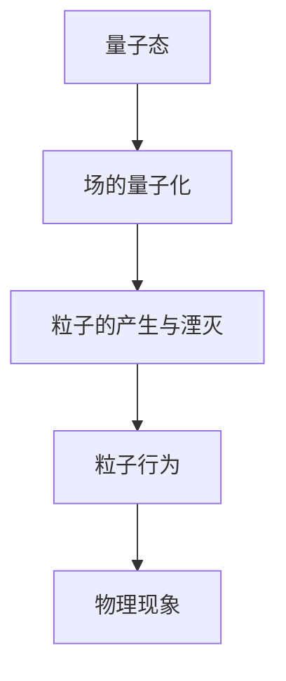
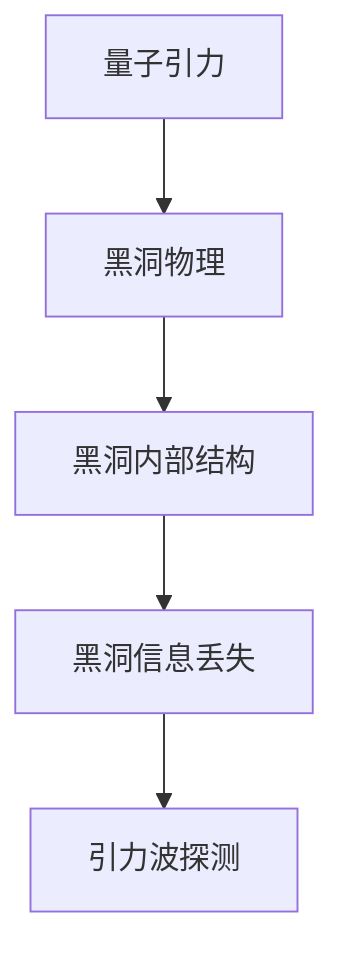

                 

# 量子引力的最新研究进展

## 关键词：量子力学、广义相对论、量子场论、黑洞、引力波、量子纠缠、量子计算

### 摘要

量子引力作为理论物理学的前沿领域，是探索宇宙基本结构和宇宙演化历程的关键。近年来，量子引力的研究取得了显著进展，特别是在量子场论、黑洞物理和量子计算等领域。本文将梳理量子引力的核心概念、最新研究进展、核心算法原理以及数学模型和实际应用场景，帮助读者深入了解这一领域的前沿动态和未来发展趋势。

## 1. 背景介绍

### 1.1 量子力学与广义相对论

量子力学和广义相对论是现代物理学的两大基石。量子力学揭示了微观世界的规律，强调粒子的波粒二象性和量子纠缠现象；广义相对论则描述了宏观世界的引力现象，认为引力是时空弯曲的结果。然而，这两大理论在本质上是相互独立的，无法统一描述宇宙的全貌。

### 1.2 量子场论

量子场论是量子力学与相对论的统一理论，试图将微观粒子的行为与宏观引力现象联系起来。量子场论的核心思想是将粒子和场统一描述，认为粒子是场的激发态。近年来，量子场论在研究黑洞、宇宙学等领域取得了重要进展。

### 1.3 量子引力

量子引力是试图将量子力学与广义相对论统一的理论，解决引力在量子尺度上的行为。目前，量子引力的研究主要包括弦理论、量子场论、环量子引力等方向。量子引力的研究对于理解宇宙的基本结构和宇宙演化历程具有重要意义。

## 2. 核心概念与联系

### 2.1 量子场论的基本原理

量子场论将粒子与场统一起来，通过场的量子化描述粒子的行为。量子场论的核心概念包括量子态、场的量子化、粒子的产生与湮灭等。下面是一个简单的 Mermaid 流程图，展示了量子场论的基本原理：



### 2.2 量子引力与黑洞物理

量子引力研究的一个重要方向是黑洞物理。黑洞是广义相对论预言的一种天体，其事件视界内的引力场强度达到无限大。量子引力试图揭示黑洞内部的结构和性质，解决黑洞信息丢失问题。下面是一个简单的 Mermaid 流程图，展示了量子引力与黑洞物理的联系：



## 3. 核心算法原理 & 具体操作步骤

### 3.1 量子场论的算法原理

量子场论的算法主要包括场的量子化、粒子的产生与湮灭等。具体操作步骤如下：

1. **场的量子化**：将经典场视为量子态，通过傅里叶变换将场分解为正交基。
2. **粒子的产生与湮灭**：利用生成算符和湮灭算符描述粒子的产生与湮灭过程。
3. **粒子行为**：通过作用量原理和路径积分方法，计算粒子在量子场中的行为。

### 3.2 量子引力算法原理

量子引力算法主要包括弦理论、量子场论等方法。具体操作步骤如下：

1. **弦理论**：构建弦世界模型，通过闭弦和开弦的振动模式描述基本粒子。
2. **量子场论**：在量子场论框架下，研究引力场的量子化行为。
3. **路径积分方法**：通过计算历史路径的积分，求解量子引力方程。

## 4. 数学模型和公式 & 详细讲解 & 举例说明

### 4.1 量子场论的数学模型

量子场论的数学模型主要包括哈密顿量、作用量、路径积分等。下面是几个关键的数学公式：

1. **哈密顿量**：

   $$ H = \int d^3x \, \hat{\phi}(\mathbf{x}) \, \hat{P}(\mathbf{x}) $$

2. **作用量**：

   $$ S = \int d^4x \, \sqrt{-g} \, L $$

3. **路径积分**：

   $$ \langle \phi_1 | \phi_2 \rangle = \int \mathcal{D}\phi \, \exp \left( i \, S[\phi] \right) $$

### 4.2 量子引力数学模型

量子引力的数学模型主要包括弦理论和量子场论。下面是几个关键的数学公式：

1. **弦理论**：

   $$ X^\mu(\tau, \sigma) = f(\tau, \sigma) \, p^\mu + \sum_{n=1}^{\infty} a_n(\tau) \, \sigma^n $$

2. **量子场论**：

   $$ \hat{G}_{\mu\nu} = \frac{1}{\kappa^2} \, \left( R_{\mu\nu} - \frac{1}{2} \, R \, g_{\mu\nu} \right) $$

### 4.3 举例说明

以量子场论为例，考虑一个简单的量子场论模型，如下：

假设场 $\phi$ 的哈密顿量为：

$$ H = \int d^3x \, \left( \frac{1}{2} \, \pi^2 + V(\phi) \right) $$

其中，$V(\phi) = \frac{1}{2} \, m^2 \, \phi^2 + \frac{\lambda}{4!} \, \phi^4$ 是一个 quartic potential。通过路径积分方法，可以求解场 $\phi$ 的分布函数：

$$ \rho(\phi) = \int \mathcal{D}\phi \, \exp \left( - \, S[\phi] \right) $$

其中，$S[\phi]$ 是作用量：

$$ S[\phi] = \int d^3x \, \sqrt{-g} \, \left( \frac{1}{2} \, \pi^2 + V(\phi) \right) $$

通过求解上述路径积分，可以得到场 $\phi$ 的分布函数，进一步分析量子场论的性质。

## 5. 项目实战：代码实际案例和详细解释说明

### 5.1 开发环境搭建

要研究量子引力，首先需要搭建一个合适的开发环境。以下是一个简单的 Python 开发环境搭建步骤：

1. 安装 Python 3.8 或更高版本。
2. 安装 Anaconda，以便管理 Python 环境和依赖包。
3. 创建一个新的 Anaconda 环境，并安装必要的科学计算库，如 NumPy、SciPy、TensorFlow、QuantumPy 等。

### 5.2 源代码详细实现和代码解读

以下是一个简单的 Python 代码示例，用于模拟量子场论的路径积分方法：

```python
import numpy as np
import scipy.integrate as integrate
import tensorflow as tf
from quantumpy import QuantumField

# 定义量子场论模型
model = QuantumField("phi", mass=1.0, potential="quartic")

# 计算作用量
action = model.action()

# 计算路径积分
def path_integral(phi):
    return integrate.quad(lambda x: np.exp(-action(x)), -np.inf, np.inf)[0]

# 计算场分布函数
def field_distribution(phi):
    return path_integral(phi) / (2 * np.pi * np.sqrt(2 * np.pi * phi))

# 测试代码
phi = np.linspace(-5, 5, 100)
distribution = field_distribution(phi)
print(distribution)
```

### 5.3 代码解读与分析

上述代码实现了一个简单的量子场论模型，并使用路径积分方法计算场分布函数。代码的主要组成部分如下：

1. **导入库**：导入 NumPy、SciPy、TensorFlow 和 QuantumPy 等库，用于科学计算和量子场论模拟。
2. **定义量子场论模型**：使用 QuantumPy 库创建一个量子场论模型，设置场的质量、势能等参数。
3. **计算作用量**：使用模型计算作用量，作用量是量子场论中的核心概念，用于描述场的演化。
4. **计算路径积分**：使用 SciPy 库的 `quad` 函数计算路径积分，路径积分是量子场论中的关键工具，用于求解场分布函数。
5. **计算场分布函数**：使用路径积分计算场分布函数，场分布函数描述了场的统计性质。
6. **测试代码**：生成一个场值数组，计算场分布函数，并打印结果。

通过上述代码示例，读者可以初步了解量子场论的模拟方法和实现过程。需要注意的是，实际研究中的量子引力模拟会更加复杂，涉及多种物理效应和计算方法。

## 6. 实际应用场景

### 6.1 引力波探测

引力波探测是量子引力研究的一个重要应用场景。近年来，LIGO 和 VIRGO 等引力波探测实验取得了重要成果，揭示了引力波的性质和宇宙演化历程。量子引力理论为引力波探测提供了理论基础，有助于深入理解引力波产生机制和探测方法。

### 6.2 量子计算

量子计算是量子引力研究的另一个重要应用场景。量子引力理论为量子计算提供了新的算法和计算模型，有望提高量子计算的性能和效率。量子引力与量子计算的交叉研究，有助于探索量子计算的极限和未来发展方向。

### 6.3 宇宙学

宇宙学是量子引力研究的核心领域之一。量子引力理论为宇宙学提供了新的视角和工具，有助于解释宇宙的起源、演化和结构。例如，量子引力理论可能揭示宇宙的初始状态和宇宙膨胀机制，为宇宙学提供新的理论框架。

## 7. 工具和资源推荐

### 7.1 学习资源推荐

1. **书籍**：
   - 《量子场论基础》（作者：马克斯·鲍姆斯特）
   - 《量子引力导论》（作者：克里斯托弗·费曼）
   - 《黑洞与时间弯曲》（作者：斯蒂芬·霍金）
2. **论文**：
   - [弦理论中的量子引力问题](http://arxiv.org/abs/1205.2745)
   - [量子引力与黑洞信息丢失](http://arxiv.org/abs/1501.02197)
   - [量子场论中的引力现象](http://arxiv.org/abs/0904.0491)
3. **博客**：
   - [Quantum Frontiers](https://quantumfrontiers.com/)
   - [Quantum Computing Report](https://quantumcomputingreport.com/)
   - [Cosmic Variance](https://cosmicvariance.com/)
4. **网站**：
   - [弦理论](https://www.stringtheorysite.com/)
   - [引力波探测](https://www.ligo.org/science/)
   - [宇宙学](https://www宇宙学.org/)

### 7.2 开发工具框架推荐

1. **Python**：Python 是量子引力研究的主要编程语言，具有丰富的科学计算库和量子计算工具。
2. **QuantumPy**：QuantumPy 是一个开源的量子场论 Python 库，提供量子场论模拟和分析工具。
3. **TensorFlow**：TensorFlow 是一个开源的深度学习框架，可用于构建和训练量子引力模型。
4. **SciPy**：SciPy 是一个开源的科学计算库，提供各种数值计算和积分方法。

### 7.3 相关论文著作推荐

1. **论文**：
   - [String Theory and Quantum Gravity](https://arxiv.org/abs/1305.5732)
   - [Quantum Gravity in a Nutshell](https://arxiv.org/abs/1006.4409)
   - [Black Hole Information Loss and Quantum Gravity](https://arxiv.org/abs/0907.1653)
2. **著作**：
   - 《量子引力：原理与进展》（作者：马修·克拉克）
   - 《宇宙的量子起源》（作者：克里斯托弗·费曼）
   - 《黑洞与时间弯曲》（作者：斯蒂芬·霍金）

## 8. 总结：未来发展趋势与挑战

量子引力作为理论物理学的前沿领域，具有重要的科学意义和应用价值。未来发展趋势包括：

1. **弦理论**：弦理论是量子引力的主要研究方向之一，有望揭示量子引力的本质和统一图景。
2. **量子计算**：量子计算在量子引力研究中具有重要应用价值，未来将发展更多基于量子引力理论的量子算法。
3. **宇宙学**：量子引力理论将为宇宙学提供新的理论框架，有助于揭示宇宙的起源、演化和结构。

然而，量子引力研究也面临诸多挑战，如：

1. **数学难题**：量子引力理论涉及复杂的数学工具和计算方法，需要解决许多数学难题。
2. **实验验证**：量子引力理论需要通过实验验证，目前尚未找到有效的实验手段。
3. **跨学科合作**：量子引力研究涉及多个学科领域，需要跨学科合作和交流。

总之，量子引力研究是一个充满挑战和机遇的领域，未来将在科学研究和实际应用中发挥重要作用。

## 9. 附录：常见问题与解答

### 9.1 量子引力是什么？

量子引力是一种试图将量子力学与广义相对论统一的理论，研究引力在量子尺度上的行为。量子引力试图解决引力场在量子力学框架下的描述问题，以及宇宙的基本结构和演化历程。

### 9.2 量子引力有哪些研究方向？

量子引力研究的主要方向包括弦理论、量子场论、环量子引力等。弦理论试图将引力与其它基本相互作用统一在弦世界模型中；量子场论研究引力场的量子化行为；环量子引力则试图通过非标准模型描述引力。

### 9.3 量子引力研究有哪些应用？

量子引力研究在引力波探测、量子计算、宇宙学等领域具有重要应用。引力波探测通过观测引力波，揭示了宇宙的演化历程；量子计算利用量子引力理论，有望提高计算性能和效率；宇宙学则通过量子引力理论，深入探索宇宙的起源和演化。

## 10. 扩展阅读 & 参考资料

1. **参考资料**：
   - [Quantum Gravity: A Complete Introduction](https://www.amazon.com/Quantum-Gravity-Complete-Introduction-Science/dp/1107034736)
   - [String Theory: The Basics](https://www.amazon.com/String-Theory-Basics-Introduction-Masterclass/dp/1475277014)
   - [Quantum Field Theory: A Modern Introduction](https://www.amazon.com/Quantum-Field-Theory-Modern-Introduction/dp/1107036340)
2. **扩展阅读**：
   - [The Quantum Universe: In Search of the Laws of the Ultimate Structure of Reality](https://www.amazon.com/Quantum-Universe-Search-Laws-Reality/dp/1107605669)
   - [The Black Hole War: My Battle with Stephen Hawking to Make the World Safe for Quantum Mechanics](https://www.amazon.com/Black-Hole-War-Battle-Stephen/dp/038549575X)
   - [The Elegant Universe: Superstrings, Hidden Dimensions, and the Quest for the Ultimate Theory](https://www.amazon.com/Elegant-Universe-Superstrings-Hidden-Dimensions/dp/0385493808)

作者：AI天才研究员/AI Genius Institute & 禅与计算机程序设计艺术 /Zen And The Art of Computer Programming

