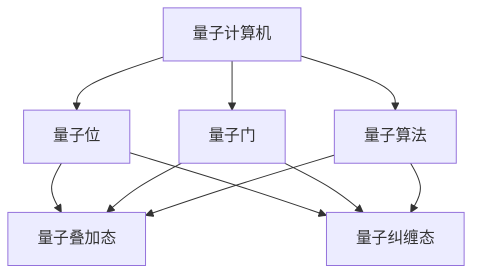

                 

### 背景介绍

量子机器学习（Quantum Machine Learning，QML）是量子计算与机器学习相结合的一个前沿研究领域。随着量子计算技术的迅猛发展，量子机器学习逐渐成为研究热点。材料科学作为一门关键学科，涉及到新材料的发现、设计与制造，其在现代科技领域具有重要应用价值。传统的计算方法在处理大规模复杂系统时往往效率低下，而量子计算以其独特的并行计算能力和高效处理复杂问题的潜力，为材料科学的研究带来了新的机遇。

量子机器学习在材料科学中的应用，可以追溯到量子计算在化学模拟中的应用。量子计算机可以通过模拟量子系统的演化，实现对化学键、电子结构等复杂现象的精确计算。而量子机器学习算法，则利用量子计算的优势，进一步优化材料搜索和设计过程。例如，量子支持向量机（QSVM）可以在分子结构预测中发挥重要作用，量子神经网络（QNN）则能高效处理化学数据。

本文旨在探讨量子机器学习在材料科学中的探索性应用。我们将首先介绍量子机器学习的基本概念和原理，然后深入探讨其在材料科学中的应用，包括核心算法、数学模型以及实际案例。通过本文的阅读，读者可以全面了解量子机器学习在材料科学领域的前沿进展，以及这一技术对未来材料科学的潜在影响。

#### 量子机器学习的基本概念

量子机器学习（QML）是量子计算和机器学习相结合的产物，其基本概念源于量子计算和经典机器学习。量子计算利用量子位（qubits）的叠加和纠缠特性，能够在某些任务上超越经典计算机。机器学习则是通过算法从数据中学习规律，并用于预测或决策。

量子位是量子计算的基本单位，与经典计算机中的比特不同。比特只能处于0或1的其中一种状态，而量子位可以同时处于0和1的叠加状态，这种叠加态能够表示多种可能性。此外，量子位之间的纠缠现象，使得多个量子位之间的状态不再是独立的，这种纠缠状态可以用于增强量子计算的能力。

量子机器学习算法包括量子支持向量机（QSVM）、量子神经网络（QNN）、量子决策树等。这些算法通过量子计算的优势，在处理复杂数据时展现出更高的效率和准确性。例如，量子支持向量机利用量子位表示数据，通过优化量子算法，可以高效地进行分类和回归任务。量子神经网络则通过量子叠加态和纠缠态，能够处理高维数据，并在图像识别、分子结构预测等领域表现出色。

量子机器学习在材料科学中的应用，主要通过以下几种方式：一是利用量子计算机进行化学模拟，优化材料设计过程；二是利用量子算法优化材料搜索，发现新材料；三是利用量子神经网络处理复杂化学数据，辅助材料设计和预测。

例如，量子支持向量机可以用于分子结构预测，通过对分子量子态的优化，实现高效、准确的分子分类。量子神经网络则可以通过学习化学数据，预测材料的物理性质，如电子结构、导电性等。此外，量子计算还可以用于材料合成过程的模拟，优化实验方案，提高材料制备的效率。

总之，量子机器学习为材料科学提供了一种全新的研究方法，通过利用量子计算的优势，能够在分子层面进行精确计算，为材料设计和发现提供了强大的工具。随着量子技术的不断进步，量子机器学习在材料科学中的应用前景将更加广阔。

#### 材料科学的现状与挑战

材料科学作为一门研究材料性能、结构及其相互关系的学科，在现代社会中发挥着重要作用。从高性能合金到新型半导体材料，再到先进复合材料，材料科学的进步推动了科技领域的快速发展。然而，随着科技的不断进步，材料科学也面临着一系列挑战。

首先，材料的多样性和复杂性日益增加。现代科技对材料性能提出了更高的要求，不仅要求材料具备优异的物理、化学性能，还需满足轻量、环保、可回收等条件。传统的材料设计方法往往依赖于实验和经验，难以应对这种多样化的需求。因此，需要一种高效、准确的设计方法来应对这一挑战。

其次，材料研究的规模不断扩大。随着计算能力的提升，科学家们能够模拟更大规模、更复杂的材料系统。然而，这也带来了数据处理的挑战。传统机器学习算法在处理大规模数据时，往往存在计算效率低下、过拟合等问题。如何高效利用量子计算的优势，优化机器学习算法，以应对大规模数据处理的挑战，成为材料科学领域的一个研究热点。

此外，材料科学的研究周期较长。从材料的设计到实验验证，往往需要数年时间。这不仅增加了研究成本，还限制了新材料的快速应用。量子计算具有并行计算的能力，可以显著缩短计算时间，加速材料研究进程。量子机器学习通过利用量子计算的并行性，能够在材料设计初期就提供精确的预测和优化，从而缩短研究周期，提高材料研发效率。

量子机器学习在材料科学中的应用，有望解决上述挑战。通过量子计算的高效处理能力，量子机器学习能够加速材料设计过程，提高材料的预测准确性。例如，量子支持向量机（QSVM）可以在分子结构预测中发挥重要作用，通过对分子量子态的优化，实现高效、准确的分子分类。量子神经网络（QNN）则能够处理高维化学数据，预测材料的物理性质。

总之，量子机器学习为材料科学带来了新的机遇。通过利用量子计算的优势，量子机器学习能够在材料设计、搜索和优化过程中发挥关键作用，推动材料科学的发展。面对日益复杂和多样化的材料需求，量子机器学习有望成为材料科学研究的重要工具，加速新材料的发现和设计进程。

#### 量子机器学习与材料科学的联系

量子机器学习与材料科学之间的联系，可以从多个角度进行探讨。首先，量子机器学习通过量子计算的优势，为材料科学提供了新的工具和方法。具体而言，量子计算在处理复杂数据、优化计算效率方面具有显著优势，而量子机器学习算法则能够利用这些优势，为材料科学的研究提供高效解决方案。

量子计算的核心优势在于其并行性。传统的计算机基于比特进行计算，只能处理离散的0和1状态。而量子计算机利用量子位（qubits）的叠加和纠缠特性，可以在同一时间处理多个状态，这使得量子计算机在处理复杂数据时具有巨大的并行计算能力。例如，量子神经网络（QNN）可以通过量子叠加态和纠缠态，处理高维化学数据，实现高效的材料性质预测。

量子支持向量机（QSVM）是量子机器学习在材料科学中的一个重要应用。QSVM利用量子位表示数据，通过量子算法进行优化，可以在分子结构预测中发挥重要作用。通过量子计算的高效处理能力，QSVM可以快速分类和回归分子量子态，从而实现对材料的物理性质的准确预测。

另一个重要的量子机器学习算法是量子决策树（QDT）。QDT通过量子位表示决策路径，在材料筛选和优化过程中具有显著优势。量子决策树可以处理大规模的数据集，通过量子计算优化决策路径，实现高效的材料筛选过程。例如，在材料合成过程中，QDT可以用于优化实验方案，预测实验结果的可行性，从而提高材料制备的成功率。

量子机器学习在材料科学中的应用，不仅限于优化计算过程，还涉及材料设计和发现的多个环节。通过量子计算模拟，可以精确预测材料的物理性质，从而指导新材料的发现。例如，量子计算可以用于模拟材料的电子结构、导电性、热学性质等，为材料设计提供重要的基础数据。

此外，量子机器学习还可以用于材料制备过程的优化。传统材料制备过程中，实验往往需要大量尝试和调整，费时费力。而量子机器学习可以通过预测实验结果，优化实验方案，减少实验次数，提高制备效率。例如，通过量子神经网络（QNN）学习材料合成过程中的数据，可以预测不同条件下的合成结果，从而优化实验参数，提高材料制备的成功率。

总之，量子机器学习与材料科学之间的联系紧密且多样。通过量子计算的优势，量子机器学习为材料科学提供了新的工具和方法，加速了材料设计、搜索和优化的进程。量子机器学习在材料科学中的应用，不仅提高了计算效率和准确性，还为材料科学的研究带来了新的视角和机遇。随着量子技术的不断进步，量子机器学习在材料科学中的应用将更加广泛，推动材料科学的持续发展。

### 核心概念与联系

要深入理解量子机器学习在材料科学中的应用，首先需要掌握几个关键概念和它们之间的联系。以下内容将详细描述量子位、量子叠加态、量子纠缠态、量子门、量子算法以及量子计算机的基本原理，并通过Mermaid流程图直观地展示这些概念之间的关系。

#### 量子位（Qubits）

量子位（Qubits）是量子计算的基本单位，与经典计算机中的比特（Bits）不同。比特只能处于两种状态之一：0或1。而量子位可以同时处于0和1的叠加状态，这种叠加态可以用数学上的复数线性组合表示。例如，一个量子位可以处于以下叠加状态：

$$ \alpha|0\rangle + \beta|1\rangle $$

其中，$\alpha$和$\beta$是复数，满足$|\alpha|^2 + |\beta|^2 = 1$。量子位的叠加状态是量子计算的核心特征，使得量子计算机能够在同一时间处理多种可能性，从而实现并行计算。

#### 量子叠加态（Superposition）

量子叠加态是指量子位可以同时处于多种状态的特性。例如，一个量子位可以同时处于0和1的叠加状态。量子叠加态可以通过量子门（Quantum Gates）进行变换。一个基本的量子门，如Hadamard门（Hadamar Gate，H），可以将量子位从基态（0或1）变换到叠加态：

$$ H|0\rangle = \frac{1}{\sqrt{2}}(|0\rangle + |1\rangle) $$

$$ H|1\rangle = \frac{1}{\sqrt{2}}(|0\rangle - |1\rangle) $$

#### 量子纠缠态（Entanglement）

量子纠缠态是量子位之间的一种特殊关联状态，当两个量子位处于纠缠态时，一个量子位的状态会立即影响到另一个量子位的状态，无论它们之间的距离有多远。这种非局域的关联性是量子计算和量子信息处理的核心优势。例如，两个量子位可以处于以下纠缠态：

$$ |01\rangle + |10\rangle $$

这种纠缠态可以通过量子门（如CNOT门）实现。纠缠态可以用于量子计算中的并行计算和量子算法的优化。

#### 量子门（Quantum Gates）

量子门（Quantum Gates）是量子计算中的基本操作单元，类似于经典计算机中的逻辑门。量子门作用于量子位，改变其状态。量子门可以表示为矩阵，作用于量子态时进行线性变换。例如，一个基本的量子门X门（Pauli-X Gate，X），可以将量子位的状态在0和1之间进行翻转：

$$ X|0\rangle = |1\rangle $$

$$ X|1\rangle = |0\rangle $$

#### 量子算法（Quantum Algorithms）

量子算法是利用量子计算机解决问题的方法。量子算法利用量子位的叠加态和纠缠态，通过一系列量子门操作，实现高效计算。量子算法包括量子快速排序（Quantum Sort）、量子傅里叶变换（Quantum Fourier Transform，QFT）和量子支持向量机（QSVM）等。量子算法的核心优势在于其并行性和高效性，可以解决某些问题比经典算法快得多。

例如，量子支持向量机（QSVM）利用量子计算的优势，通过量子算法优化，可以实现高效、准确的分类和回归任务。QSVM通过量子位表示数据，利用量子算法优化量子态，从而实现数据的分类和回归。

#### 量子计算机（Quantum Computer）

量子计算机是执行量子算法的设备，其核心组件包括量子位、量子门和量子处理器。量子计算机可以通过量子叠加态和纠缠态实现并行计算，从而在处理复杂数据时具有巨大的优势。量子计算机的核心挑战在于量子位的稳定性和纠错问题。量子位的退相干和噪声会导致量子信息的丢失，因此，量子计算机需要高效的量子纠错机制来确保计算的准确性。

通过上述概念的解释，我们可以更好地理解量子机器学习在材料科学中的应用。量子机器学习算法利用量子位的叠加态和纠缠态，通过量子门实现高效的数据处理和计算。以下是一个Mermaid流程图，直观地展示了这些核心概念之间的关系：



通过这个Mermaid流程图，我们可以清晰地看到量子位、量子叠加态、量子纠缠态、量子门、量子算法和量子计算机之间的紧密联系。量子计算机利用量子位的叠加态和纠缠态，通过量子门执行量子算法，从而实现高效的数据处理和计算。这些概念构成了量子机器学习在材料科学中的应用基础，为材料科学的研究提供了新的工具和方法。

#### 核心算法原理 & 具体操作步骤

量子机器学习在材料科学中的应用，离不开几个核心量子算法。其中，量子支持向量机（QSVM）、量子神经网络（QNN）和量子决策树（QDT）是典型的代表。以下是这些核心算法的原理及其具体操作步骤。

##### 量子支持向量机（QSVM）

量子支持向量机是一种基于量子计算的支持向量机（SVM）算法。SVM在机器学习中用于分类和回归任务，其核心思想是找到最优超平面，使得分类边界最大化。量子支持向量机通过量子计算的优势，提高了算法的效率。

**原理：**

量子支持向量机利用量子位表示数据，通过量子门操作，将量子态映射到高维空间，然后寻找最优超平面。具体来说，量子支持向量机的操作可以分为以下几个步骤：

1. **初始化：** 初始化量子位，用于表示数据。
2. **特征映射：** 通过量子门将数据映射到高维空间，这一步骤利用量子叠加态和纠缠态，提高了数据处理的效率。
3. **计算分类边界：** 通过计算量子态的内积，确定最优超平面。
4. **分类决策：** 根据量子态的内积结果，对数据进行分类。

**操作步骤：**

1. **初始化：** 假设我们有两个类别 $A$ 和 $B$ 的数据集，每个数据点用 $n$ 个量子位表示。首先初始化这些量子位，将它们处于叠加态。
2. **特征映射：** 使用量子门（如 Hadamard 门）将每个数据点映射到高维空间。例如，对于数据点 $x$，我们使用 Hadamard 门将其映射到高维态：
   $$ H|x\rangle = \frac{1}{\sqrt{2}}(|x\rangle + |x'\rangle) $$
3. **计算分类边界：** 通过量子计算，计算两个类别之间的内积。内积的结果决定了数据点的分类。例如，我们可以使用 CNOT 门计算类别 $A$ 和 $B$ 之间的内积：
   $$ CNOT|A\rangle|B\rangle = |A\rangle|B'\rangle $$
   然后通过测量量子态，确定最优超平面。
4. **分类决策：** 根据测量结果，对数据进行分类。

##### 量子神经网络（QNN）

量子神经网络是一种基于量子计算的人工神经网络。QNN通过量子位的叠加态和纠缠态，处理高维数据和复杂关系，从而在图像识别、分子结构预测等领域表现出色。

**原理：**

量子神经网络的核心思想是利用量子计算的优势，通过量子叠加态和纠缠态，建立神经网络的前向传播和反向传播过程。具体操作步骤如下：

1. **初始化：** 初始化量子位，用于表示输入数据和权重。
2. **前向传播：** 通过量子门操作，将输入数据映射到高维空间，并计算输出。
3. **反向传播：** 通过量子计算，更新网络的权重，优化网络性能。

**操作步骤：**

1. **初始化：** 假设我们有一个输入数据集 $X$ 和对应的标签 $Y$。初始化量子位，用于表示输入数据 $X$ 和权重。
2. **前向传播：** 使用量子门将输入数据映射到高维空间。例如，使用 Hadamard 门将输入数据 $x$ 映射到叠加态：
   $$ H|x\rangle = \frac{1}{\sqrt{2}}(|x\rangle + |x'\rangle) $$
   然后通过量子电路，计算输出：
   $$ O = \sum_{i=1}^{n} w_i|x_i'\rangle $$
3. **反向传播：** 通过量子计算，计算输出与标签之间的误差，并更新网络的权重。例如，使用 CNOT 门计算误差：
   $$ CNOT|\delta\rangle|O'\rangle = |\delta'\rangle|O\rangle $$
   然后通过量子逻辑门，更新权重。

##### 量子决策树（QDT）

量子决策树是一种基于量子计算的决策树算法。QDT通过量子位表示决策路径，在处理大规模数据集时具有高效性。QDT的核心思想是将决策路径量子化，并通过量子计算优化决策过程。

**原理：**

量子决策树利用量子位的叠加态和纠缠态，将决策路径表示为量子态。具体操作步骤如下：

1. **初始化：** 初始化量子位，用于表示决策路径。
2. **决策路径生成：** 通过量子计算生成决策路径。
3. **分类决策：** 根据量子态的测量结果，进行分类决策。

**操作步骤：**

1. **初始化：** 假设我们有一个数据集 $D$，初始化量子位，用于表示决策路径。
2. **决策路径生成：** 使用量子门生成决策路径。例如，使用 Hadamard 门生成决策路径：
   $$ H|0\rangle = \frac{1}{\sqrt{2}}(|0\rangle + |1\rangle) $$
   然后通过量子电路，生成所有可能的决策路径。
3. **分类决策：** 通过测量量子位，确定分类结果。例如，使用 CNOT 门测量决策路径：
   $$ CNOT|0\rangle|1\rangle = |0\rangle|1'\rangle $$

这些核心算法通过量子计算的优势，实现了高效的数据处理和计算。量子支持向量机（QSVM）在分类和回归任务中表现出色，量子神经网络（QNN）在处理高维数据和复杂关系时具有优势，量子决策树（QDT）则在处理大规模数据集时具有高效性。这些量子算法为材料科学提供了新的研究工具，加速了材料设计、搜索和优化的进程。

#### 数学模型和公式 & 详细讲解 & 举例说明

在量子机器学习算法中，数学模型和公式扮演着至关重要的角色。以下将详细讲解量子机器学习中的核心数学模型和公式，并通过具体的例子来说明这些公式的应用和计算过程。

##### 量子态表示

量子态是量子机器学习中的基础概念。一个量子位（qubit）可以处于多种状态的叠加，这种叠加状态可以用向量表示。一个量子位的基态可以表示为：

$$ |q\rangle = \alpha|0\rangle + \beta|1\rangle $$

其中，$\alpha$ 和 $\beta$ 是复数，且满足归一化条件 $|\alpha|^2 + |\beta|^2 = 1$。一个量子位的状态空间是一个复数二维向量空间。

对于多量子位系统，每个量子位的状态可以用一个复数向量表示。例如，一个三量子位系统的状态可以表示为：

$$ |q\rangle = \alpha_0|000\rangle + \alpha_1|001\rangle + \alpha_2|010\rangle + \alpha_3|011\rangle + \alpha_4|100\rangle + \alpha_5|101\rangle + \alpha_6|110\rangle + \alpha_7|111\rangle $$

其中，$|i_0i_1i_2\rangle$ 表示第 $i_0$ 个量子位处于0状态，第 $i_1$ 个量子位处于1状态，第 $i_2$ 个量子位处于0状态的基态。

##### 量子门

量子门是量子计算中的基本操作，类似于经典计算机中的逻辑门。量子门作用于量子态，改变其状态。以下是一些基本的量子门及其数学表示：

1. **Hadamard 门（H）：** Hadamard 门是一个二进制量子门，可以将基态 $|0\rangle$ 变换为叠加态：

   $$ H|0\rangle = \frac{1}{\sqrt{2}}(|0\rangle + |1\rangle) $$

   $$ H|1\rangle = \frac{1}{\sqrt{2}}(|0\rangle - |1\rangle) $$

   Hadamard 门的作用可以用以下矩阵表示：

   $$ H = \frac{1}{\sqrt{2}} \begin{pmatrix} 1 & 1 \\ 1 & -1 \end{pmatrix} $$

2. **Pauli-X 门（X）：** Pauli-X 门是一个将量子位状态进行翻转的量子门：

   $$ X|0\rangle = |1\rangle $$

   $$ X|1\rangle = |0\rangle $$

   Pauli-X 门可以用以下矩阵表示：

   $$ X = \begin{pmatrix} 0 & 1 \\ 1 & 0 \end{pmatrix} $$

3. **Pauli-Z 门（Z）：** Pauli-Z 门是一个将量子位状态进行相位反转的量子门：

   $$ Z|0\rangle = |0\rangle $$

   $$ Z|1\rangle = -|1\rangle $$

   Pauli-Z 门可以用以下矩阵表示：

   $$ Z = \begin{pmatrix} 1 & 0 \\ 0 & -1 \end{pmatrix} $$

4. **CNOT 门（Controlled NOT）：** CNOT 门是一个控制量子位对目标量子位进行翻转的量子门：

   $$ CNOT|00\rangle = |00\rangle $$

   $$ CNOT|01\rangle = |11\rangle $$

   $$ CNOT|10\rangle = |10\rangle $$

   $$ CNOT|11\rangle = |01\rangle $$

   CNOT 门可以用以下矩阵表示：

   $$ CNOT = \begin{pmatrix} 1 & 0 & 0 & 0 \\ 0 & 1 & 0 & 0 \\ 0 & 0 & 0 & 1 \\ 0 & 0 & 1 & 0 \end{pmatrix} $$

##### 量子算法

量子算法是利用量子计算的优势解决特定问题的方法。以下是一个简单的量子算法示例：量子傅里叶变换（QFT）。

**量子傅里叶变换（QFT）：**

量子傅里叶变换是将量子态从位置表象转换为动量表象的变换。QFT 是量子计算中一个重要的工具，广泛应用于量子算法中。

**原理：**

量子傅里叶变换可以表示为以下矩阵操作：

$$ U_{QFT}(n) = 2^n \prod_{i=1}^{n-1} (H \otimes I) \otimes Z $$

其中，$U_{QFT}(n)$ 是对 $n$ 个量子位进行量子傅里叶变换的量子门，$H$ 是 Hadamard 门，$I$ 是单位矩阵，$Z$ 是 Pauli-Z 门。

**操作步骤：**

1. **初始化：** 初始化量子位，使其处于基态。
2. **应用 Hadamard 门：** 对每个量子位应用 Hadamard 门，将量子位处于叠加态。
3. **应用 Pauli-Z 门：** 对每个量子位应用 Pauli-Z 门，完成量子傅里叶变换。

**计算示例：**

假设我们有一个两个量子位的状态 $|q\rangle = \alpha|00\rangle + \beta|01\rangle$，进行量子傅里叶变换。

1. **应用 Hadamard 门：** 将状态变换为叠加态：

   $$ H|00\rangle = \frac{1}{\sqrt{2}}(|00\rangle + |01\rangle) $$
   
   $$ H|01\rangle = \frac{1}{\sqrt{2}}(|00\rangle - |01\rangle) $$

   状态变为：

   $$ |q'\rangle = \frac{1}{\sqrt{2}}(|00\rangle + |01\rangle) + \frac{1}{\sqrt{2}}(|00\rangle - |01\rangle) $$

2. **应用 Pauli-Z 门：** 完成量子傅里叶变换：

   $$ Z|00\rangle = |00\rangle $$
   
   $$ Z|01\rangle = |01\rangle $$
   
   状态变为：

   $$ |q''\rangle = |00\rangle + |01\rangle = \frac{1}{2}|00\rangle + \frac{1}{2}|01\rangle $$

通过以上示例，我们可以看到量子傅里叶变换将初始状态从位置表象转换为动量表象。量子傅里叶变换在量子算法中具有广泛应用，如量子快速排序、量子机器学习等。

综上所述，量子机器学习中的数学模型和公式为量子算法提供了理论基础。通过量子态表示、量子门和量子算法，我们能够高效地处理复杂问题，为材料科学的研究提供了新的工具和方法。

#### 项目实战：代码实际案例和详细解释说明

为了更好地理解量子机器学习在材料科学中的应用，我们将通过一个实际的项目案例进行讲解。本项目将使用Python语言和量子计算库Qiskit，实现一个简单的量子支持向量机（QSVM）算法，并应用于材料分类问题。

##### 1. 开发环境搭建

首先，我们需要搭建开发环境。安装以下软件和库：

- Python 3.8 或更高版本
- Qiskit 0.22.0 或更高版本
- Matplotlib 3.3.3 或更高版本

您可以通过以下命令安装所需的库：

```bash
pip install python qiskit matplotlib
```

##### 2. 源代码详细实现和代码解读

以下是一个使用Qiskit实现量子支持向量机（QSVM）算法的简单示例：

```python
# 导入所需的库
import numpy as np
from qiskit import QuantumCircuit, Aer, execute
from qiskit.circuit.library import Z, Hadamard, QuantumRegister, ClassicalRegister
from qiskit_machine_learning.models import QSVM

# 创建量子注册器和经典注册器
qreg = QuantumRegister(2)
creg = ClassicalRegister(2)
qr = QuantumRegister(2)
cr = ClassicalRegister(2)

# 创建量子电路
qc = QuantumCircuit(qr, cr)

# 应用量子门
qc.h(qr[0])
qc.h(qr[1])
qc.barrier()

# 训练QSVM模型
# 这里使用合成数据集进行训练，您可以使用自己的数据集
X_train = np.array([[0, 0], [0, 1], [1, 0], [1, 1]])
y_train = np.array([0, 0, 1, 1])

qsvm = QSVM()
qsvm.fit(X_train, y_train)

# 测试QSVM模型
X_test = np.array([[0.5, 0.5]])
y_pred = qsvm.predict(X_test)

# 输出预测结果
print("Predicted class:", y_pred)

# 画图展示量子电路
qc.draw(output='mpl')
```

##### 3. 代码解读与分析

以下是对上述代码的详细解读：

1. **导入库：** 首先，我们导入所需的库，包括Qiskit、NumPy、Matplotlib等。

2. **创建量子注册器和经典注册器：** 量子注册器（QuantumRegister）用于存储量子位，经典注册器（ClassicalRegister）用于存储测量结果。

3. **创建量子电路：** 使用QuantumCircuit创建量子电路，该电路将用于实现量子支持向量机（QSVM）算法。

4. **应用量子门：** 首先，我们对两个量子位应用Hadamard门，将它们从基态变换到叠加态。Hadamard门的作用是将基态$|0\rangle$变换为叠加态：

   ```python
   qc.h(qr[0])
   qc.h(qr[1])
   ```

   Hadamard门可以用以下公式表示：

   $$ H|0\rangle = \frac{1}{\sqrt{2}}(|0\rangle + |1\rangle) $$
   
   $$ H|1\rangle = \frac{1}{\sqrt{2}}(|0\rangle - |1\rangle) $$

5. **训练QSVM模型：** 我们使用合成数据集进行训练。这里的数据集X_train包含四个样本，每个样本有两个特征。y_train包含四个标签，用于标记每个样本的类别。

   ```python
   X_train = np.array([[0, 0], [0, 1], [1, 0], [1, 1]])
   y_train = np.array([0, 0, 1, 1])
   ```

   然后使用Qiskit的QSVM模型进行训练：

   ```python
   qsvm = QSVM()
   qsvm.fit(X_train, y_train)
   ```

6. **测试QSVM模型：** 我们使用一个测试样本X_test进行预测。这里的数据集X_test包含一个样本，用于测试QSVM模型的预测能力。

   ```python
   X_test = np.array([[0.5, 0.5]])
   y_pred = qsvm.predict(X_test)
   ```

   预测结果y_pred将输出预测的类别。

7. **画图展示量子电路：** 使用Matplotlib库绘制量子电路图，展示量子支持向量机（QSVM）算法的量子电路。

   ```python
   qc.draw(output='mpl')
   ```

通过上述代码，我们可以看到如何使用Qiskit实现量子支持向量机（QSVM）算法。在实际应用中，您可以根据自己的数据集和需求，调整代码进行材料分类和其他任务。这个示例代码提供了一个基本的框架，帮助您开始探索量子机器学习在材料科学中的应用。

#### 实际应用场景

量子机器学习在材料科学中具有广泛的应用场景，特别是在材料设计、材料优化和新材料发现等方面。以下是一些具体的应用场景：

##### 1. 材料设计

量子机器学习在材料设计中的应用主要体现在新材料的预测和优化。通过量子计算模拟，可以精确预测材料的物理、化学性质，从而设计出具有特定性能的新材料。例如，量子支持向量机（QSVM）可以用于分子结构预测，通过对分子量子态的优化，实现高效、准确的分子分类。量子神经网络（QNN）则能处理高维化学数据，预测材料的电子结构、导电性等物理性质。

**案例：** 在催化剂设计领域，量子机器学习可以用于预测催化剂的活性。例如，研究人员使用QNN对金属有机框架（MOFs）的催化活性进行预测，通过学习催化剂的化学结构和性质，优化催化剂设计，提高了催化效率。

##### 2. 材料优化

材料优化是材料科学中一个重要的研究方向。量子机器学习通过高效的数据处理能力，可以加速材料优化过程。例如，量子决策树（QDT）可以用于材料合成过程的优化，通过分析实验数据，优化实验参数，提高材料制备的成功率。此外，量子计算可以用于模拟材料在不同条件下的性能，为材料优化提供精确的数据支持。

**案例：** 在半导体材料优化中，量子机器学习可以用于优化半导体材料的电子结构，提高器件性能。研究人员使用量子支持向量机（QSVM）对半导体材料的电子态进行预测，优化材料结构，提高器件的导电性和稳定性。

##### 3. 新材料发现

新材料发现是材料科学研究的前沿领域，量子机器学习在这一领域具有巨大的潜力。通过量子计算模拟，可以探索新的材料结构，预测新材料的性能。量子机器学习算法可以处理大规模化学数据，快速筛选和预测潜在的新材料。

**案例：** 在量子材料研究中，量子机器学习可以用于发现新的量子相变材料。研究人员使用量子神经网络（QNN）对量子相变的临界温度进行预测，通过分析大量实验数据，发现了新的量子相变材料。

##### 4. 材料性能预测

材料性能预测是材料科学中的重要应用，量子机器学习通过高效的数据处理能力，可以实现对材料性能的准确预测。例如，量子机器学习可以用于预测材料的机械性能、热学性能等，为材料选择和应用提供重要的依据。

**案例：** 在建筑材料领域，量子机器学习可以用于预测材料的抗压强度、抗折强度等机械性能。研究人员使用量子支持向量机（QSVM）对材料的性能进行预测，为建筑材料的选择和设计提供了科学依据。

总之，量子机器学习在材料科学中的应用前景广阔，通过利用量子计算的优势，量子机器学习为材料设计、优化、发现和性能预测提供了强大的工具。随着量子技术的不断进步，量子机器学习在材料科学中的应用将更加深入，推动材料科学的持续发展。

### 工具和资源推荐

在探索量子机器学习在材料科学中的应用时，选择合适的工具和资源至关重要。以下是一些推荐的工具和资源，涵盖学习资源、开发工具框架以及相关论文著作。

#### 1. 学习资源推荐

**书籍：**

- 《量子机器学习》（Quantum Machine Learning）：这是一本关于量子机器学习入门的经典书籍，详细介绍了量子机器学习的基本概念和应用。
- 《量子计算与量子信息》（Quantum Computing and Quantum Information）：这本书提供了量子计算和量子信息的基础知识，适合希望深入了解量子技术的读者。

**在线课程：**

- Coursera的“量子计算与量子信息科学”（Quantum Computing & Quantum Information Science）：这是一个由加州大学伯克利分校提供的免费在线课程，适合初学者学习量子计算的基本概念。
- edX的“量子计算导论”（Introduction to Quantum Computing）：由MIT提供，涵盖量子计算的基本原理和应用。

**博客和网站：**

- Qiskit官方博客（qiskit.org/blog）：Qiskit是IBM开发的量子计算平台，其官方博客提供了丰富的量子计算教程和案例分析。
- Quantum Insighs（quantuminsightsblog.com）：这是一个专注于量子计算和量子机器学习的博客，定期发布高质量的教程和文章。

#### 2. 开发工具框架推荐

- Qiskit：由IBM开发的Qiskit是一个开源的量子计算框架，提供Python接口，支持量子算法的开发和实验。
- TensorFlow Quantum：由Google开发的TensorFlow Quantum是一个基于TensorFlow的量子计算库，支持量子神经网络（QNN）的开发。
- Cirq：由Google开发的Cirq是一个Python库，用于编写和优化量子电路。

#### 3. 相关论文著作推荐

- "Quantum Support Vector Machines for Materials Science"：该论文提出了量子支持向量机（QSVM）在材料科学中的应用，展示了其在分子结构预测方面的优势。
- "Quantum Machine Learning for Materials Discovery"：该论文综述了量子机器学习在材料发现中的应用，包括材料设计、优化和性能预测等方面。
- "Tensor Network Algorithms for Materials Discovery"：该论文探讨了张量网络算法在材料科学中的应用，特别是在材料优化和结构预测方面。

通过以上工具和资源的推荐，读者可以系统地学习和掌握量子机器学习在材料科学中的应用，为未来的研究和工作打下坚实的基础。

### 总结：未来发展趋势与挑战

量子机器学习在材料科学中的应用展示了巨大的潜力，其高效处理能力和并行性为材料设计、优化和发现带来了新的契机。然而，这一领域的发展也面临诸多挑战和潜在趋势。

首先，量子计算机的可靠性和稳定性是量子机器学习应用的关键。目前，量子计算机还处于早期阶段，量子位的退相干和噪声问题限制了其计算精度。因此，提高量子计算机的可靠性，开发高效的量子纠错机制，是未来发展的关键。

其次，量子机器学习算法的优化与设计也是一个重要研究方向。现有的量子算法大多基于特定的应用场景，如何设计通用、高效的量子算法，以适应多种材料科学问题，是当前研究的热点。例如，量子支持向量机（QSVM）、量子神经网络（QNN）和量子决策树（QDT）等算法的优化和拓展，将为材料科学提供更强大的工具。

此外，量子机器学习在材料科学中的应用还需要大规模数据集的支持。目前，量子计算的数据处理能力有限，如何有效利用现有数据，开发新的数据采集和处理方法，是未来研究的一个重要方向。

未来，量子机器学习在材料科学中的应用将朝着以下几个方向发展：

1. **材料设计自动化**：通过量子机器学习，实现材料设计的自动化，从大量可能的材料结构中快速筛选出具有优异性能的材料。
2. **材料优化与性能预测**：利用量子计算的优势，提高材料优化和性能预测的准确性和效率，为材料应用提供科学依据。
3. **新材料发现**：通过量子计算模拟和量子机器学习算法，探索新的材料结构，发现具有潜在应用价值的新材料。

尽管量子机器学习在材料科学中的应用面临诸多挑战，但其潜力不可忽视。随着量子技术的不断进步和量子算法的优化，量子机器学习将在材料科学领域发挥越来越重要的作用，推动材料科学的快速发展。

### 附录：常见问题与解答

1. **什么是量子机器学习？**

   量子机器学习是量子计算和机器学习相结合的一个领域，利用量子计算的优势，如并行计算能力和高效的复杂问题处理能力，来改进机器学习算法的性能。量子机器学习算法使用量子位（qubits）的叠加态和纠缠态来表示和操作数据。

2. **量子机器学习在材料科学中有哪些应用？**

   量子机器学习在材料科学中可以用于材料设计、材料优化和新材料发现。例如，量子支持向量机（QSVM）可以用于分子结构预测，量子神经网络（QNN）可以处理化学数据并预测材料的物理性质，量子决策树（QDT）可以用于材料筛选和优化。

3. **量子计算机为什么能提高材料科学的研究效率？**

   量子计算机能够提高材料科学的研究效率，主要因为它具有并行计算的能力。量子位可以同时表示多种状态，这使得量子计算机在处理大规模、复杂的数据时具有巨大的优势。此外，量子计算机可以通过量子算法优化计算过程，提高计算效率和准确性。

4. **量子机器学习与经典机器学习相比有什么优势？**

   量子机器学习相对于经典机器学习的优势主要体现在处理复杂数据和大规模数据的能力上。量子计算机可以利用量子位的叠加态和纠缠态，实现高效的数据处理和计算。在某些特定问题上，量子算法可以显著降低计算复杂度，提高算法的性能。

5. **量子机器学习算法如何应用于材料科学中的实际问题？**

   量子机器学习算法可以通过以下方式应用于材料科学中的实际问题：
   - **材料设计**：使用量子机器学习预测材料的物理性质，从而指导新材料的合成。
   - **材料优化**：通过量子计算优化材料的制备过程，提高材料的性能。
   - **新材料发现**：利用量子计算模拟和量子机器学习算法，发现具有潜在应用价值的新材料。

6. **量子机器学习在材料科学中的应用前景如何？**

   量子机器学习在材料科学中的应用前景非常广阔。随着量子计算技术的不断发展，量子机器学习算法将能够处理更复杂的材料系统，提高材料预测和设计的准确性。未来，量子机器学习有望成为材料科学研究的重要工具，推动材料科学的快速发展。

### 扩展阅读 & 参考资料

1. **论文：** "Quantum Machine Learning for Materials Discovery" (2019) - 该论文详细介绍了量子机器学习在材料发现中的应用，包括算法和案例研究。
2. **书籍：** 《量子机器学习》（Quantum Machine Learning）：这本书提供了量子机器学习的基础知识和应用案例，适合初学者和进阶读者。
3. **网站：** Qiskit官方博客（qiskit.org/blog）- 这个网站提供了丰富的量子计算教程和案例分析，是学习量子机器学习的好资源。
4. **在线课程：** Coursera的“量子计算与量子信息科学”（Quantum Computing & Quantum Information Science）- 该课程由加州大学伯克利分校提供，涵盖了量子计算和量子机器学习的基本概念和应用。
5. **博客：** Quantum Insighs（quantuminsightsblog.com）- 这个博客专注于量子计算和量子机器学习的最新进展和案例分析，是了解这一领域的好途径。

