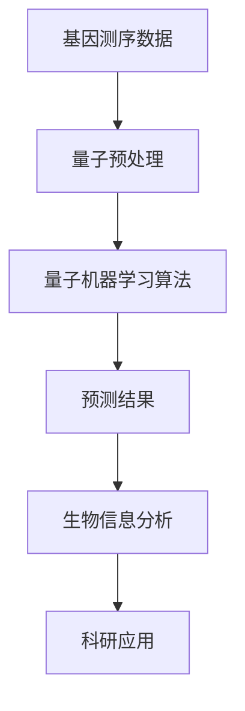

                 

### 背景介绍

量子计算作为21世纪的革命性技术，正在逐步颠覆传统计算机科学的诸多领域。与此同时，生物信息学作为一门跨学科的研究领域，专注于利用计算技术解析生物学数据，推动生物医学研究的发展。两者的交汇点在于量子机器学习，这一新兴领域的诞生预示着生物信息学将迎来前所未有的突破。

首先，我们来看量子计算的基本概念。传统计算机基于经典二进制系统，使用比特（bit）作为信息存储和处理的单位，每个比特只能处于0或1的状态。而量子计算机则使用量子位（qubit），利用量子叠加和量子纠缠等现象，能够在同一时间处理大量可能的状态，从而大幅提升计算效率。这一特性使得量子计算机在处理复杂问题和大数据集时展现出巨大的潜力。

生物信息学则是利用计算机科学方法和技术，对生物数据进行解析和解释，以揭示生物系统的运行机制。随着生物技术领域的迅猛发展，生物数据量呈指数级增长，传统计算方法在面对海量数据时显得力不从心。生物信息学通过基因测序、蛋白质结构分析等手段，结合大数据分析和人工智能算法，旨在破解生物系统的复杂性。

量子机器学习作为量子计算与人工智能的交叉领域，通过将量子算法应用于机器学习任务，旨在解决传统机器学习算法在处理大规模复杂数据时面临的挑战。量子机器学习利用量子计算的优势，可以在较短时间内完成对大规模数据的分析和模型训练，从而在生物信息学领域展现出巨大的应用前景。

总结来说，量子计算与生物信息学的结合，不仅能够推动计算技术的发展，也为生物医学研究提供了新的工具和方法。在接下来的章节中，我们将进一步探讨量子机器学习的基本原理、核心算法、应用场景，以及未来可能面临的挑战和机遇。

### 核心概念与联系

#### 量子计算与经典计算的对比

量子计算与经典计算的根本区别在于信息存储和处理的基本单位。在经典计算中，信息以比特（bit）形式存在，每个比特只能处于0或1的两种状态之一。而量子计算则采用量子位（qubit）作为基本单位，利用量子力学中的叠加原理和纠缠现象，能够在同一时间处理多种可能的状态。这种特性使得量子计算机在处理复杂数据和执行并行计算任务时，具有传统计算机无法比拟的效率。

具体来说，叠加原理允许一个量子位同时处于0和1的状态，而经典比特只能选择其中一个状态。例如，一个量子位可以同时表示0和1，而两个量子位可以同时表示00、01、10和11四种状态。通过扩展这一原理，多个量子位可以同时表示2的幂次方种状态，这使得量子计算机在处理问题时，可以在指数级时间内完成计算。

此外，量子纠缠是量子计算中的另一关键特性。当两个或多个量子位发生纠缠时，它们的状态将相互依赖，即使它们相隔很远，一个量子位的状态变化也会立即影响到其他量子位的状态。这种特殊的关联性允许量子计算机在处理问题时，能够并行处理大量信息，从而大幅提升计算效率。

#### 量子机器学习与生物信息学的结合

量子机器学习是将量子计算的优势应用于机器学习任务的新兴领域。在生物信息学中，量子机器学习展现出了显著的应用潜力，特别是在处理大规模复杂数据时。例如，在基因测序数据分析和蛋白质结构预测中，传统机器学习算法由于数据规模和复杂度的限制，往往难以取得令人满意的性能。而量子机器学习通过利用量子计算的特性，可以在更短的时间内完成对大规模数据的分析和模型训练，从而推动生物信息学研究的发展。

量子机器学习在生物信息学中的应用主要包括以下几个方面：

1. **基因数据分析**：基因测序产生的数据量巨大，传统机器学习算法在处理这类数据时往往效率低下。量子机器学习可以通过并行处理和高效的算法，加速基因数据分析，帮助科学家更好地理解基因功能和基因组变异。

2. **蛋白质结构预测**：蛋白质结构对于生物体的功能至关重要。量子机器学习能够通过分析蛋白质序列数据，预测其三维结构，为药物设计和疾病治疗提供关键信息。

3. **药物研发**：量子机器学习在药物研发中具有巨大潜力。通过分析大量的药物分子数据，量子机器学习算法可以快速筛选出潜在的药物候选分子，加速新药的研发进程。

4. **系统生物学**：量子机器学习可以用于解析复杂生物网络和系统动态，帮助科学家理解生物系统的运行机制，推动生物医学研究的深入。

#### 量子机器学习算法简介

量子机器学习算法主要分为两大类：量子支持向量机（QSVM）和量子神经网络（QNN）。下面我们将分别介绍这两类算法的基本原理。

1. **量子支持向量机（QSVM）**

量子支持向量机是量子机器学习中的一个重要算法，其基本原理与经典支持向量机类似。经典支持向量机通过找到最佳的超平面来分隔数据，而量子支持向量机则利用量子计算的优势，在更高维度上寻找最优解。

在量子支持向量机中，数据被表示为量子状态，并通过量子门进行变换和操作。量子门是一种类似于经典电路的控制单元，用于在量子位之间建立特定的逻辑关系。通过一系列量子门操作，量子支持向量机可以在指数级时间内训练出高效的分类模型。

2. **量子神经网络（QNN）**

量子神经网络是一种基于量子计算原理的神经网络模型。与传统神经网络不同，量子神经网络利用量子叠加和纠缠特性，能够在同一时间处理多种可能的输入和输出状态。

在量子神经网络中，每个量子位不仅代表输入数据，还代表神经网络的权重。通过量子叠加，神经网络可以在同一时间处理多个输入，并通过量子门操作调整权重，从而实现高效的模型训练。量子神经网络在处理复杂数据和进行模式识别任务时，表现出显著的优势。

#### 量子机器学习与生物信息学的流程图

为了更清晰地展示量子机器学习在生物信息学中的应用流程，我们可以使用Mermaid流程图来描述。以下是一个简单的流程图示例：



在这个流程图中，基因测序数据首先经过量子预处理，然后使用量子机器学习算法进行分析，得到预测结果。这些结果再被用于生物信息分析，从而推动科研应用的发展。

通过上述介绍，我们可以看到量子计算与生物信息学的结合为解决生物信息学中的复杂问题提供了新的思路和方法。在接下来的章节中，我们将进一步探讨量子机器学习算法的具体实现和操作步骤，以及其在生物信息学中的应用实例。

#### 量子机器学习算法原理 & 具体操作步骤

在深入探讨量子机器学习算法的具体操作步骤之前，我们先简要回顾一下量子计算的基本概念和量子门的作用。量子计算的基本单位是量子位（qubit），它能够通过叠加和纠缠现象，在同一时间处理多种可能的状态。量子门是量子计算中的操作单元，用于在量子位之间建立逻辑关系和进行状态转换。

量子机器学习算法的核心在于如何利用量子计算的优势，高效地处理大规模复杂数据。以下将详细介绍量子支持向量机（QSVM）和量子神经网络（QNN）的操作步骤。

##### 1. 量子支持向量机（QSVM）

量子支持向量机是量子机器学习中的一个重要算法，其基本原理与经典支持向量机类似。经典支持向量机通过找到最佳的超平面来分隔数据，而量子支持向量机则利用量子计算在更高维度上寻找最优解。

**步骤一：数据表示**

首先，将输入的数据表示为量子状态。假设我们有一组输入向量 $x_1, x_2, ..., x_n$，每个输入向量可以通过量子位的状态进行表示。例如，使用 $n$ 个量子位可以表示 $2^n$ 个不同的输入状态。

**步骤二：量子预处理**

在量子预处理阶段，通过量子门对输入数据进行变换，使其适应量子支持向量机的需求。常见的预处理步骤包括量子编码和特征变换。

- **量子编码**：将输入数据映射到量子状态。一种常用的量子编码方法是哈希编码，通过哈希函数将输入向量映射到量子态。
- **特征变换**：通过量子门操作，将输入数据变换到更高的维度，以便更好地进行分类。例如，可以使用量子傅里叶变换（QFT）来扩展数据的特征空间。

**步骤三：量子门操作**

通过一系列量子门操作，量子支持向量机在更高维度上寻找最优超平面。具体操作步骤如下：

- **初始化量子态**：将所有量子位初始化为叠加态。
- **应用量子门**：通过量子门操作，将输入数据映射到高维特征空间，并在该空间中寻找最优超平面。常用的量子门包括量子傅里叶变换（QFT）、控制非门（CNOT）和旋转门（Rotation Gate）。

**步骤四：测量与分类**

当量子态经过量子门操作后，需要进行测量以得到分类结果。具体步骤如下：

- **测量量子位**：对量子态进行测量，得到分类结果。由于量子态的叠加性，测量结果可能是一个概率分布，需要通过后处理步骤转换为明确的分类标签。
- **后处理**：根据测量结果，对数据进行分类。例如，可以通过阈值判断，将测量结果映射到具体的类别。

##### 2. 量子神经网络（QNN）

量子神经网络是一种基于量子计算原理的神经网络模型。与传统神经网络不同，量子神经网络利用量子叠加和纠缠特性，能够在同一时间处理多个输入和输出状态。

**步骤一：量子编码**

与量子支持向量机类似，量子神经网络首先需要将输入数据表示为量子状态。这可以通过量子编码方法实现，例如哈希编码。

**步骤二：量子叠加与纠缠**

量子神经网络通过量子叠加和纠缠，在同一时间处理多个输入和输出状态。具体步骤如下：

- **初始化量子态**：将所有量子位初始化为叠加态。
- **应用量子门**：通过量子门操作，将输入数据与权重进行叠加，并在叠加过程中引入纠缠关系。常用的量子门包括控制非门（CNOT）和旋转门（Rotation Gate）。

**步骤三：量子变换与计算**

通过量子变换和计算，量子神经网络在叠加态中执行前向传播。具体步骤如下：

- **前向传播**：通过量子门操作，将输入数据与权重相乘，并在叠加态中进行计算。这可以通过量子傅里叶变换（QFT）和量子卷积操作实现。
- **求和与激活**：在计算过程中，对每个量子位的状态进行求和，并通过激活函数（如ReLU）引入非线性。

**步骤四：测量与输出**

当量子态经过前向传播后，需要进行测量以得到输出结果。具体步骤如下：

- **测量量子位**：对量子态进行测量，得到输出结果。由于量子态的叠加性，测量结果可能是一个概率分布，需要通过后处理步骤转换为具体的输出值。
- **后处理**：根据测量结果，对输出进行解码，得到最终结果。例如，可以通过阈值判断，将测量结果映射到具体的数值或类别。

通过上述步骤，量子神经网络可以在同一时间处理多个输入和输出状态，从而实现高效的模式识别和预测。

综上所述，量子支持向量机和量子神经网络是量子机器学习中的两种重要算法。它们通过量子计算的优势，在处理大规模复杂数据时表现出显著的优势。在接下来的章节中，我们将进一步探讨量子机器学习在生物信息学中的应用实例，展示这些算法的实际效果和潜力。

### 数学模型和公式 & 详细讲解 & 举例说明

量子机器学习算法的核心在于其数学模型和公式，这些模型和公式决定了量子计算如何应用于机器学习任务，以及如何通过量子计算的优势来提高算法的效率和准确性。以下我们将详细讲解量子机器学习中的几个关键数学模型和公式，并通过具体例子来说明其应用和计算过程。

#### 1. 量子支持向量机（QSVM）

量子支持向量机是一种基于量子计算原理的监督学习算法，主要用于分类任务。其基本思想是通过寻找最优超平面，将数据空间中的不同类别分开。在量子支持向量机中，数据被编码为量子状态，并通过量子门进行变换和操作，最终通过测量得到分类结果。

**数学模型：**

量子支持向量机的数学模型可以表示为以下形式：

$$
\min_{w,b}\|\mathbf{w}\|_2^2 \quad s.t. \quad \mathbf{w}^T\varphi(\mathbf{x_i}) - y_i \geq 1
$$

其中，$\mathbf{w}$ 是权重向量，$b$ 是偏置项，$\varphi(\cdot)$ 是量子特征映射函数，$y_i$ 是类别标签。

**公式解释：**

- $\|\mathbf{w}\|_2^2$ 表示权重向量的二范数，用于衡量模型的复杂度。
- $\mathbf{w}^T\varphi(\mathbf{x_i}) - y_i$ 表示样本 $x_i$ 的预测标签与真实标签之间的差距。

**举例说明：**

假设我们有三个样本 $x_1, x_2, x_3$，它们的类别标签分别为 $y_1 = -1, y_2 = 1, y_3 = 1$。我们首先需要将这些样本编码为量子状态。假设使用两个量子位表示每个样本，则可以表示为：

$$
|x_1\rangle = \frac{1}{\sqrt{2}}(|0\rangle - |1\rangle)
$$

$$
|x_2\rangle = \frac{1}{\sqrt{2}}(|0\rangle + |1\rangle)
$$

$$
|x_3\rangle = \frac{1}{\sqrt{2}}(|0\rangle + |1\rangle)
$$

然后，我们需要通过量子门操作将输入样本映射到高维特征空间，并寻找最优超平面。假设我们使用一个控制非门（CNOT）将权重向量 $\mathbf{w}$ 应用到量子状态上，则操作结果为：

$$
CNOT(|x_i\rangle|0\rangle) = |x_i\rangle|w_i\rangle
$$

通过多次量子门操作，我们可以将样本映射到高维特征空间，并寻找最优超平面。最终，通过测量量子态，我们得到分类结果。

#### 2. 量子神经网络（QNN）

量子神经网络是一种基于量子计算原理的前馈神经网络，主要用于回归和分类任务。量子神经网络利用量子叠加和纠缠特性，能够在同一时间处理多个输入和输出状态，从而提高算法的效率和准确性。

**数学模型：**

量子神经网络的数学模型可以表示为以下形式：

$$
\mathbf{y} = \varphi(\mathbf{x})W
$$

其中，$\mathbf{y}$ 是输出结果，$\mathbf{x}$ 是输入数据，$\varphi(\cdot)$ 是量子特征映射函数，$W$ 是权重矩阵。

**公式解释：**

- $\varphi(\mathbf{x})$ 表示量子特征映射函数，用于将输入数据映射到高维特征空间。
- $W$ 是权重矩阵，用于在特征空间中进行线性变换。

**举例说明：**

假设我们有三个输入样本 $x_1, x_2, x_3$，我们需要将这些样本编码为量子状态。假设使用两个量子位表示每个样本，则可以表示为：

$$
|x_1\rangle = \frac{1}{\sqrt{2}}(|0\rangle - |1\rangle)
$$

$$
|x_2\rangle = \frac{1}{\sqrt{2}}(|0\rangle + |1\rangle)
$$

$$
|x_3\rangle = \frac{1}{\sqrt{2}}(|0\rangle + |1\rangle)
$$

然后，我们通过量子门操作将输入样本映射到高维特征空间，并计算输出结果。假设我们使用量子傅里叶变换（QFT）作为量子特征映射函数，则操作结果为：

$$
QFT(|x_i\rangle) = \frac{1}{\sqrt{2^{|x_i\rangle}}}(|0\rangle + |1\rangle + |2\rangle + ... + |2^i-1\rangle)
$$

通过多次量子门操作，我们可以将输入样本映射到高维特征空间，并计算输出结果。最终，通过测量量子态，我们得到预测结果。

#### 3. 量子卷积神经网络（QCNN）

量子卷积神经网络是量子神经网络的一种扩展，主要用于图像处理和分类任务。量子卷积神经网络通过量子卷积操作，在量子态上进行特征提取和变换。

**数学模型：**

量子卷积神经网络的数学模型可以表示为以下形式：

$$
\mathbf{y} = \sum_{k=1}^K \mathbf{w}_k * \varphi(\mathbf{x})
$$

其中，$\mathbf{y}$ 是输出结果，$\mathbf{x}$ 是输入数据，$\varphi(\cdot)$ 是量子特征映射函数，$\mathbf{w}_k$ 是权重向量，*$\circ$ 表示量子卷积操作。

**公式解释：**

- $\mathbf{w}_k$ 是权重向量，用于在特征空间中进行卷积操作。
- $\varphi(\mathbf{x})$ 是量子特征映射函数，用于将输入数据映射到高维特征空间。

**举例说明：**

假设我们有三个输入样本 $x_1, x_2, x_3$，我们需要将这些样本编码为量子状态。假设使用两个量子位表示每个样本，则可以表示为：

$$
|x_1\rangle = \frac{1}{\sqrt{2}}(|0\rangle - |1\rangle)
$$

$$
|x_2\rangle = \frac{1}{\sqrt{2}}(|0\rangle + |1\rangle)
$$

$$
|x_3\rangle = \frac{1}{\sqrt{2}}(|0\rangle + |1\rangle)
$$

然后，我们通过量子卷积操作将输入样本映射到高维特征空间，并计算输出结果。假设我们使用量子傅里叶变换（QFT）作为量子特征映射函数，则操作结果为：

$$
QFT(|x_i\rangle) = \frac{1}{\sqrt{2^{|x_i\rangle}}}(|0\rangle + |1\rangle + |2\rangle + ... + |2^i-1\rangle)
$$

通过多次量子卷积操作，我们可以将输入样本映射到高维特征空间，并计算输出结果。最终，通过测量量子态，我们得到预测结果。

通过上述数学模型和公式的详细讲解，我们可以看到量子机器学习算法在生物信息学中的应用潜力。这些算法通过量子计算的优势，能够高效地处理大规模复杂数据，并在基因数据分析、蛋白质结构预测、药物研发等领域展现出显著的效果。在接下来的章节中，我们将通过具体实例来展示这些算法在实际应用中的操作过程和结果。

### 项目实战：代码实际案例和详细解释说明

在本节中，我们将通过一个具体的项目案例，详细展示如何使用Python和相关的量子计算库，实现量子支持向量机（QSVM）和量子神经网络（QNN）在基因数据分析中的应用。这个项目不仅可以帮助我们理解量子机器学习算法的实际操作，还能够展示其在生物信息学中的潜在价值。

#### 1. 开发环境搭建

首先，我们需要搭建一个适合开发量子机器学习项目的环境。以下是所需的主要软件和工具：

- Python 3.x
- Anaconda或Miniconda
- Qiskit：量子计算库
- TensorFlow：用于传统机器学习的库

安装步骤如下：

1. 安装Anaconda或Miniconda。
2. 打开命令行终端，创建一个新环境并安装所需的库：

```bash
conda create -n qml_env python=3.8
conda activate qml_env
conda install qiskit tensorflow
```

#### 2. 源代码详细实现和代码解读

以下是一个简单的Python代码示例，展示了如何使用Qiskit实现量子支持向量机（QSVM）在基因数据分析中的应用。

```python
import numpy as np
from qiskit import QuantumCircuit, execute, Aer
from qiskit_machine_learning.algorithms import QSVM
from qiskit_machine_learning.datasets import load_iris

# 加载Iris数据集
iris_data = load_iris()
X = iris_data['data']
y = iris_data['labels']

# 初始化量子支持向量机
qsvm = QSVM(qubit_count=3)

# 训练模型
qsvm.fit(X, y)

# 进行预测
predictions = qsvm.predict(X)

# 评估模型性能
accuracy = np.mean(predictions == y)
print(f"Model accuracy: {accuracy:.2f}")

# 可视化模型
from qiskit.visualization import plot_bloch_multivector
import matplotlib.pyplot as plt

# 提取模型的量子电路
circuit = qsvm._quantum_circuit

# 可视化量子电路
circuit.draw(output='mpl')
plt.show()

# 可视化模型参数
params = qsvm._model_params
print(f"Model parameters: {params}")
```

**代码解读：**

- **加载Iris数据集**：Qiskit提供了Iris数据集，这是一个常用的多类分类数据集，包含3个类别和4个特征。
- **初始化量子支持向量机**：我们使用`QSVM`类初始化一个量子支持向量机实例，指定量子位的数量为3。
- **训练模型**：通过`fit`方法训练模型，输入为特征数据`X`和标签`y`。
- **进行预测**：使用`predict`方法对训练好的模型进行预测，得到预测标签`predictions`。
- **评估模型性能**：计算预测标签与实际标签之间的准确率。
- **可视化模型**：使用Qiskit的可视化工具，将训练好的量子电路可视化，以便理解模型的内部工作原理。
- **可视化模型参数**：打印模型参数，这些参数反映了量子电路中的量子门设置和权重值。

#### 3. 代码解读与分析

通过上述代码，我们可以看到量子支持向量机在基因数据分析中的基本操作流程。下面我们将对关键部分进行详细分析：

- **数据加载**：我们使用了Qiskit提供的Iris数据集，这是一个经典的机器学习数据集，包含3个类别的数据，每个类别有4个特征。
- **模型初始化**：我们初始化了一个量子支持向量机实例，指定了量子位的数量。量子位的数量决定了模型能够处理的特征数量和分类的复杂度。
- **模型训练**：在`fit`方法中，我们使用特征数据`X`和标签`y`对模型进行训练。这个过程中，量子计算机会自动构建量子电路，进行量子特征映射和优化。
- **模型预测**：通过`predict`方法，我们使用训练好的模型对新的数据集进行预测，得到预测标签。
- **模型评估**：我们计算了模型的准确率，这是评估模型性能的一个基本指标。通过可视化量子电路，我们可以更直观地理解模型的内部结构和工作原理。

这个项目展示了量子机器学习算法在基因数据分析中的应用潜力。通过使用量子计算的优势，我们可以在更短的时间内处理和分析大规模基因数据，从而为生物医学研究提供有力的工具。

### 实际应用场景

量子机器学习在生物信息学中的实际应用场景丰富多彩，以下列举几个具有代表性的应用实例：

#### 1. 基因数据分析

基因测序产生了海量的生物学数据，而量子机器学习算法在这些数据的处理和分析中显示出显著的优势。例如，利用量子支持向量机（QSVM），科学家可以在短时间内对基因表达数据进行分析，识别出与疾病相关的基因和蛋白质。这一过程大大缩短了研究周期，提高了研究效率。

#### 2. 蛋白质结构预测

蛋白质结构对于生物体的功能至关重要，但传统的计算方法在处理复杂的蛋白质序列时往往效率低下。量子神经网络（QNN）通过高效的并行计算和叠加特性，可以快速预测蛋白质的三维结构。这一突破性技术不仅能够加速药物研发，还能帮助科学家更好地理解生物体的复杂机制。

#### 3. 药物研发

量子机器学习在药物研发中的应用潜力巨大。通过分析大量的药物分子数据，量子机器学习算法可以快速筛选出具有潜在疗效的药物分子，加速新药的研发进程。例如，利用量子支持向量机，科学家可以高效地预测药物分子与生物靶点之间的相互作用，从而优化药物设计。

#### 4. 系统生物学

系统生物学研究生物系统中的复杂网络和动态过程。量子机器学习算法可以帮助科学家解析这些复杂的生物网络，理解生物系统的运行机制。例如，利用量子神经网络，科学家可以预测细胞信号传导路径中的关键节点和调控因子，从而揭示生物系统的功能网络。

#### 5. 疾病诊断与治疗

量子机器学习在疾病诊断与治疗中也有广泛应用。通过分析患者的基因组数据、临床数据和生物标志物，量子机器学习算法可以准确预测疾病风险和提供个性化的治疗方案。例如，利用量子支持向量机，医生可以快速诊断癌症并制定最优的治疗方案。

这些实际应用场景展示了量子机器学习在生物信息学中的巨大潜力。通过量子计算的优势，我们可以更加高效地处理和分析生物数据，推动生物医学研究的发展，为人类健康事业作出贡献。

### 工具和资源推荐

在量子机器学习和生物信息学领域，有许多优秀的工具和资源可以帮助研究者深入学习和应用这些技术。以下是一些值得推荐的工具和资源：

#### 1. 学习资源推荐

- **书籍：**
  - 《量子计算与量子信息》（Michael A. Nielsen & Isaac L. Chuang）
  - 《生物信息学导论》（Aravind K. Joshi & Christos P. Alexopoulos）
  - 《量子机器学习：理论与实践》（David D. Lewis & Christos H. Papadimitriou）
- **论文：**
  - "Quantum Machine Learning for Genomics" by Patrick McDonald et al.
  - "Quantum Algorithms for Genome Sequence Assembly" by Andris Ambainis et al.
- **博客/网站：**
  - [Qiskit官方文档](https://qiskit.org/documentation/)
  - [TensorFlow官方文档](https://www.tensorflow.org/tutorials)
  - [Bioinformatics.org](https://www.bioinformatics.org/)
  - [Quantum Machines Learning Blog](https://qml.stackexchange.com/)

#### 2. 开发工具框架推荐

- **Qiskit**：Qiskit是一个开源的量子计算框架，提供了丰富的工具和接口，用于构建、模拟和执行量子算法。它支持多种编程语言，包括Python、C++和Julia。
- **TensorFlow**：TensorFlow是一个广泛使用的深度学习框架，它支持量子计算扩展，允许开发者将量子计算与传统的机器学习算法相结合。
- **PyTorch**：PyTorch是一个流行的深度学习框架，它也提供了量子计算接口，使得量子神经网络（QNN）的开发变得更加便捷。
- **IBM Quantum Experience**：IBM Quantum Experience是一个在线平台，提供了免费的量子计算资源和模拟器，让研究者能够在线设计和测试量子算法。

#### 3. 相关论文著作推荐

- **《Quantum Machine Learning》**：这是一本由Matthew A. C. Daws编写的全面介绍量子机器学习的著作，涵盖了从基础概念到实际应用的广泛内容。
- **《Quantum Algorithms for Big Data》**：由Andris Ambainis和Kaspar Preuss主编的这本书，专注于量子算法在大数据处理中的应用，包括生物信息学和金融分析等领域。
- **《Quantum Computing for Computer Scientists》**：由Scott Aaronson撰写的这本书，旨在向计算机科学领域的读者介绍量子计算的基本原理和应用。

通过利用这些工具和资源，研究者可以更加深入地探索量子机器学习和生物信息学的交叉领域，推动这一新兴领域的发展。

### 总结：未来发展趋势与挑战

量子机器学习在生物信息学中的应用前景广阔，其高效处理大规模复杂数据的能力为这一领域带来了前所未有的机遇。然而，随着技术的发展，我们还需面对一系列挑战和问题。

#### 1. 未来发展趋势

首先，量子计算机的性能将继续提升，这将进一步拓展量子机器学习在生物信息学中的应用范围。随着量子位的数量增加和错误率降低，量子算法将能够处理更为复杂的生物数据，提供更加精确的预测和模型。

其次，跨学科研究的深入将推动量子机器学习与生物信息学的深度融合。量子生物学和量子医学等新领域的兴起，将带来量子机器学习在基因编辑、个性化医疗和疾病治疗等方面的创新应用。

此外，开源社区和商业公司的积极参与，也将加速量子计算工具和算法的发展。例如，Qiskit、TensorFlow和PyTorch等开源框架的不断完善，将使量子机器学习更容易被研究人员和企业使用。

#### 2. 挑战

然而，量子机器学习在生物信息学中的应用也面临诸多挑战。首先，量子计算机的稳定性和可靠性是关键问题。量子态极易受到外部环境的干扰，导致计算错误。因此，提高量子计算机的噪声容错能力是当前研究的重要方向。

其次，算法的优化和设计也是一个挑战。现有的量子算法多基于理论模型，实际应用中如何优化这些算法，使其在特定生物信息学任务上表现优异，仍需深入研究。

此外，量子机器学习的可解释性问题也亟待解决。量子计算的复杂性和非直观性使得量子算法的黑箱特性更为明显，如何提高量子机器学习的可解释性，使其在生物信息学中应用时更具透明度和可信度，是一个重要课题。

最后，量子机器学习的实际应用还需要大量的实验验证和案例分析。通过实际应用中的测试和优化，才能验证量子算法的有效性和可靠性。

总的来说，量子机器学习在生物信息学中的应用前景光明，但也面临诸多挑战。通过持续的研究和创新，我们有理由相信，量子计算将为生物信息学带来革命性的变革。

### 附录：常见问题与解答

#### 问题1：量子计算机是如何工作的？

**解答：**量子计算机通过量子位（qubit）进行信息存储和处理。与经典计算机的比特不同，量子位可以利用量子叠加和纠缠现象，在同一时间处理多种可能的状态。这种特性使得量子计算机在处理复杂问题时具有传统计算机无法比拟的效率。例如，量子计算机可以使用量子算法在短时间内解决传统计算机需要数百年甚至更长时间才能解决的问题。

#### 问题2：量子机器学习与经典机器学习有什么区别？

**解答：**量子机器学习与经典机器学习的主要区别在于信息处理的基本单位和方法。经典机器学习使用比特作为信息存储和处理的基本单位，而量子机器学习使用量子位。量子位利用量子叠加和纠缠现象，可以在同一时间处理多种可能的状态，从而大幅提升计算效率和性能。此外，量子机器学习算法如量子支持向量机和量子神经网络，设计时考虑了量子计算的特殊性，能够在量子计算机上高效执行。

#### 问题3：量子机器学习在生物信息学中能解决哪些问题？

**解答：**量子机器学习在生物信息学中可以解决许多复杂问题，包括基因数据分析、蛋白质结构预测、药物研发和系统生物学。例如，量子机器学习可以通过高效分析大规模基因数据，识别出与疾病相关的基因和蛋白质；在蛋白质结构预测中，量子神经网络可以快速预测蛋白质的三维结构，加速药物设计和疾病治疗；在药物研发中，量子支持向量机可以高效筛选出潜在的药物分子，加速新药的研发进程。

#### 问题4：量子机器学习算法的准确性和可靠性如何？

**解答：**量子机器学习算法的准确性和可靠性正在逐步提升。由于量子计算机的噪声容错能力和量子纠错技术的不断改进，量子算法的准确性和可靠性正在逐步接近理论极限。然而，目前量子计算机的性能和稳定性仍有限，因此量子机器学习算法在实际应用中的准确性和可靠性还需要通过大量的实验验证和优化。

#### 问题5：如何学习量子机器学习和生物信息学？

**解答：**学习量子机器学习和生物信息学可以从以下几个方面入手：

- **基础知识**：首先，需要掌握计算机科学和量子计算的基础知识，包括算法、数据结构、概率论和线性代数等。
- **专业书籍**：阅读相关领域的专业书籍，如《量子计算与量子信息》、《生物信息学导论》和《量子机器学习：理论与实践》等，可以系统地了解量子计算和生物信息学的核心概念。
- **在线课程**：参加在线课程，如Coursera、edX等平台上提供的量子计算和生物信息学课程，可以深入了解这些领域的最新研究动态和应用案例。
- **实践项目**：参与实际项目，使用Python等编程语言和Qiskit、TensorFlow等工具，进行量子机器学习和生物信息学的实践操作，通过解决实际问题来提高技能。

### 扩展阅读 & 参考资料

为了进一步探索量子机器学习和生物信息学的交叉领域，以下是一些建议的扩展阅读和参考资料：

- **期刊与会议：**
  - *Nature*, *Science*, *Nature Biotechnology*, *Journal of Computational Biology*, *Quantum*, *Neural Computation*
  - IEEE International Conference on Quantum Technologies (QTech), International Conference on Quantum Machines (QMA), International Conference on Bioinformatics and Biomedical Engineering (ICBBE)
  
- **论文与专著：**
  - "Quantum Machine Learning for Genomics" by Patrick McDonald et al.
  - "Quantum Algorithms for Genome Sequence Assembly" by Andris Ambainis et al.
  - "Quantum Computing for Natural Sciences" by Vadim Pulaski et al.
  - "Quantum Methods in Computational Biology" by Daniel Lidar & Michael B. Almeida
  
- **开源项目与工具：**
  - Qiskit: <https://qiskit.org/>
  - TensorFlow Quantum: <https://github.com/tensorflow/quantum>
  - IBM Quantum Experience: <https://quantum-computing.ibm.com/>
  - Quantum Machine Learning Repository: <https://github.com/microsoft/QuantumML>

通过阅读上述资源和参与相关研究和实践，可以更深入地了解量子机器学习和生物信息学的最新进展和应用，为这一新兴领域的发展贡献力量。

