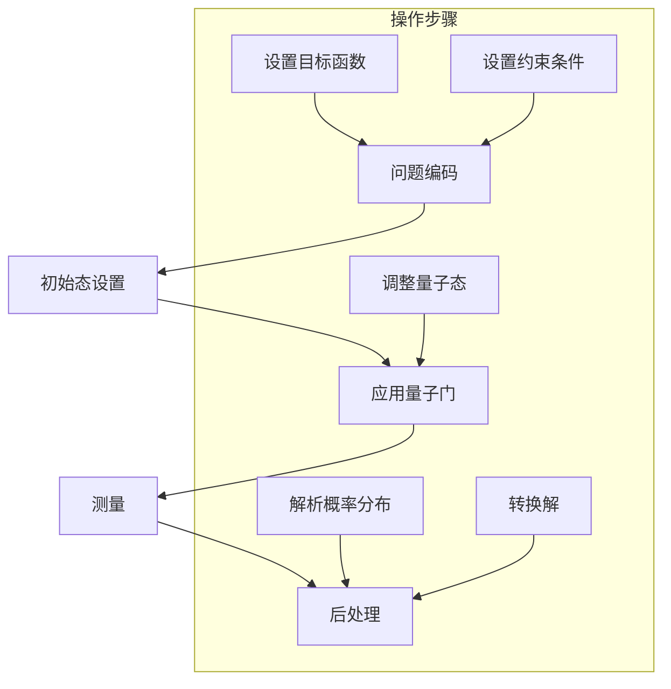
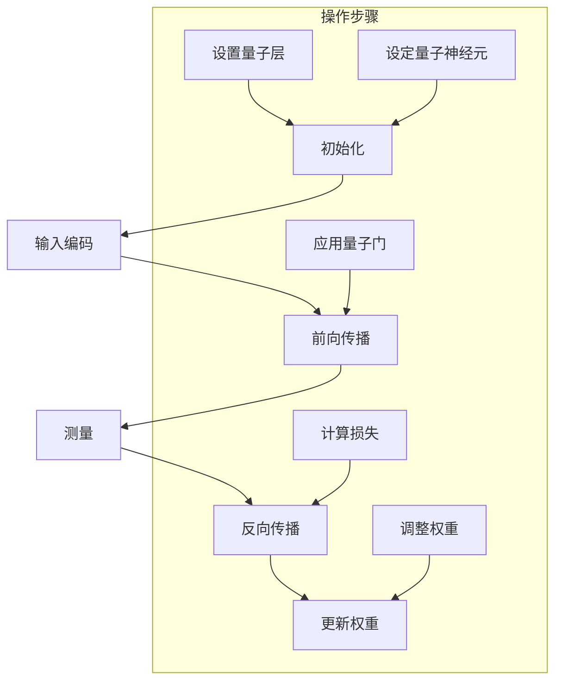
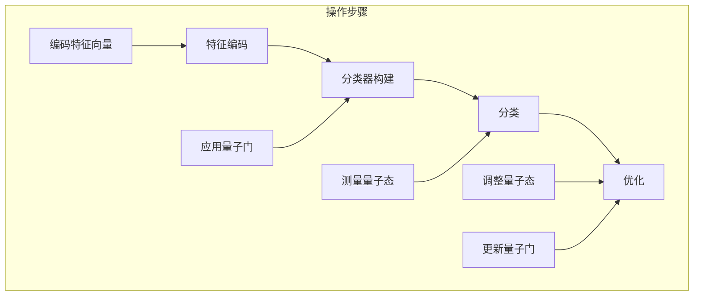

                 

### 背景介绍

量子机器学习（Quantum Machine Learning, QML）是近年来计算机科学和量子物理学领域中的一个前沿研究方向。其核心思想是将量子计算的强大并行性和量子叠加原理应用于机器学习算法中，以期望实现比传统计算方法更高效的数据处理和学习能力。

机器学习作为人工智能的重要组成部分，已经在众多领域取得了显著的成果，如图像识别、自然语言处理和推荐系统等。然而，随着数据规模和数据复杂度的增加，传统计算方法在面对大规模数据时往往显得力不从心，计算效率低下、训练时间长等问题日益突出。量子计算作为一种全新的计算范式，具有并行处理、高效存储和快速检索等优势，被认为是解决这些瓶颈问题的潜在解决方案。

量子机器学习算法的研究始于20世纪90年代，随着量子计算理论和实验技术的不断发展，量子机器学习逐渐成为研究热点。与经典机器学习算法不同，量子机器学习算法利用量子位（qubits）的叠加态和纠缠态来表示和操作数据，从而实现了更高效的计算和更高的准确度。

量子机器学习的研究不仅在理论上具有重要意义，而且在实际应用中也展现出广阔的前景。例如，在优化问题、量子化学、金融建模等领域，量子机器学习算法已经取得了初步的成果，显示出与传统算法相比的显著优势。

总的来说，量子机器学习为机器学习领域带来了一种全新的思考方式和研究途径，有望推动人工智能和量子计算两大领域的共同发展。本文将深入探讨量子机器学习算法的基本原理、核心概念、实现方法以及未来应用前景，以期为读者提供一个全面、系统的了解。

### 核心概念与联系

要深入理解量子机器学习（QML），首先需要了解其核心概念和原理。量子机器学习主要依赖于两个核心的量子计算概念：量子位（qubits）和量子叠加。下面，我们将通过一个Mermaid流程图详细描述这些概念以及它们在量子机器学习中的联系。

#### Mermaid流程图

```mermaid
graph TD
    A[量子位 (Qubits)] --> B[量子叠加 (Superposition)]
    A --> C[量子纠缠 (Entanglement)]
    B --> D[量子门 (Quantum Gates)]
    C --> E[量子算法 (Quantum Algorithms)]
    D --> E
    F[量子数据表示 (Quantum Data Representation)] --> E
    G[量子机器学习 (Quantum Machine Learning)] --> E
    subgraph 基础概念
      I[量子态 (Quantum States)]
      J[量子计算原理 (Quantum Computation Principles)]
      K[量子比特 (Quantum Bits)]
      I --> J
      K --> J
      J --> A
      J --> B
      J --> C
      K --> A
      K --> B
      K --> C
    end
    subgraph 量子机器学习
      L[量子优化算法 (Quantum Optimization Algorithms)]
      M[量子神经网络 (Quantum Neural Networks)]
      N[量子分类算法 (Quantum Classification Algorithms)]
      L --> G
      M --> G
      N --> G
      G --> E
    end
    subgraph 辅助工具与资源
      O[量子计算框架 (Quantum Computing Frameworks)]
      P[量子模拟器 (Quantum Simulators)]
      Q[量子硬件 (Quantum Hardware)]
      O --> G
      P --> G
      Q --> G
    end
```

#### 概述

1. **量子位 (Qubits)**：量子位是量子计算机的基本单元，它可以使用叠加态来表示多种状态。一个量子位可以同时处于0和1的状态，这与经典计算机的比特不同，后者只能在0或1的状态之间切换。

2. **量子叠加 (Superposition)**：量子叠加原理使得量子位可以同时表示多种状态，这大大增加了信息处理的能力。多个量子位的叠加态可以表示一个巨大的状态空间。

3. **量子纠缠 (Entanglement)**：当两个或多个量子位处于纠缠状态时，它们之间的状态将相互依赖。这种纠缠现象是量子计算中实现并行计算和信息传输的关键。

4. **量子门 (Quantum Gates)**：量子门是量子计算中的基本操作单元，类似于经典计算机中的逻辑门。它们可以作用于量子位，改变其状态。

5. **量子算法 (Quantum Algorithms)**：量子算法是利用量子计算特性来解决问题的方法。它们利用量子位和量子门的特性，实现高效的计算。例如，Shor算法和Grover算法是两个著名的量子算法。

6. **量子数据表示 (Quantum Data Representation)**：量子数据表示是将经典数据转换为量子形式的过程。这涉及到量子态的编码和解码，以及如何有效地在量子计算机上处理这些数据。

7. **量子机器学习 (Quantum Machine Learning)**：量子机器学习是将量子计算应用于机器学习问题中的一类算法。它利用量子计算机的特性来优化机器学习算法，提高数据处理和预测的效率。

8. **量子优化算法 (Quantum Optimization Algorithms)**、**量子神经网络 (Quantum Neural Networks)**、**量子分类算法 (Quantum Classification Algorithms)**：这些是量子机器学习的几个主要研究方向。量子优化算法旨在解决优化问题，量子神经网络用于模拟神经网络，而量子分类算法用于分类任务。

9. **量子计算框架 (Quantum Computing Frameworks)**、**量子模拟器 (Quantum Simulators)**、**量子硬件 (Quantum Hardware)**：这些是量子计算的重要工具和资源。量子计算框架提供了开发量子应用程序的环境，量子模拟器用于模拟量子计算过程，量子硬件是实现量子计算的物质基础。

通过上述Mermaid流程图，我们可以清晰地看到量子机器学习的基本概念和相互联系。理解这些概念和原理对于深入研究和应用量子机器学习至关重要。

#### 核心算法原理 & 具体操作步骤

量子机器学习算法的核心在于如何将量子计算的优势应用到传统的机器学习任务中，如优化、分类和聚类等。下面我们将详细探讨量子机器学习算法的基本原理和操作步骤。

##### 量子优化算法

量子优化算法是量子机器学习的一个重要分支，旨在利用量子计算机解决传统优化问题，如线性规划、二次规划和组合优化等。以下是一个简单的量子优化算法的步骤：

1. **问题编码**：将优化问题转换为量子形式的表示。例如，可以将目标函数和约束条件编码为量子态。

2. **初始态设置**：根据编码后的优化问题，设置初始量子态。这通常是一个叠加态，可以表示多个可能的解。

3. **应用量子门**：通过一系列的量子门操作，调整量子态，使得目标函数最大化或最小化。量子门的选择和顺序取决于具体的问题。

4. **测量**：在最终步骤中，对量子态进行测量，得到优化问题的解。由于量子态的叠加性和纠缠性，测量结果可能是一个概率分布。

5. **后处理**：对测量结果进行后处理，如概率分布的解析或转换，以获得最终的优化解。

以下是一个简单的Mermaid流程图，描述量子优化算法的步骤：



##### 量子神经网络

量子神经网络（Quantum Neural Networks, QNNs）是量子机器学习的另一个重要方向，旨在模拟传统神经网络的结构和功能，利用量子计算的特性提高计算效率。以下是量子神经网络的基本步骤：

1. **初始化**：设置量子神经网络的结构，包括量子层、量子神经元和权重。

2. **输入编码**：将输入数据编码为量子态，通常使用量子叠加态。

3. **前向传播**：通过一系列的量子门操作，将输入数据转换为输出数据。这些量子门代表了网络中的权重和偏置。

4. **测量**：对最终量子态进行测量，得到网络的输出。

5. **反向传播**：使用测量结果和损失函数，通过量子反向传播算法调整量子网络中的权重。

6. **更新权重**：根据反向传播的结果，更新量子网络中的权重。

以下是一个简单的Mermaid流程图，描述量子神经网络的操作步骤：



##### 量子分类算法

量子分类算法利用量子计算的优势，提高分类任务的效率和准确性。以下是一个简单的量子分类算法的步骤：

1. **特征编码**：将输入数据的特征编码为量子态。

2. **分类器构建**：使用量子门和量子态的叠加性构建分类器。这通常涉及到将每个类别的特征编码为不同的量子态，并通过量子门进行操作。

3. **分类**：通过测量量子态，确定输入数据所属的类别。

4. **优化**：通过量子优化算法，调整分类器的量子态和量子门，提高分类的准确性和效率。

以下是一个简单的Mermaid流程图，描述量子分类算法的步骤：



通过上述量子机器学习算法的原理和操作步骤，我们可以看到量子计算如何为传统机器学习任务带来巨大的优势。然而，量子机器学习的研究还处于初级阶段，需要进一步的理论研究和实际应用验证。随着量子计算技术的不断进步，我们有理由相信，量子机器学习将会在未来的计算机科学和人工智能领域中发挥重要作用。

#### 数学模型和公式 & 详细讲解 & 举例说明

量子机器学习算法的理论基础涉及到复杂的数学模型和公式，这些模型和公式不仅用于描述量子计算过程，还用于优化和解析量子机器学习算法。在本节中，我们将详细讲解这些数学模型和公式，并通过具体例子进行说明。

##### 量子态和叠加

量子态是量子计算机中的基本概念，它可以用一个复数向量表示。量子态的叠加是量子计算的核心特性之一。一个量子态可以表示为多个状态的线性组合，例如：

\[|\psi\rangle = a|0\rangle + b|1\rangle\]

其中，\(a\) 和 \(b\) 是复数系数，满足 \(|a|^2 + |b|^2 = 1\)。

##### 量子门

量子门是量子计算中的基本操作单元，类似于经典计算机中的逻辑门。量子门作用于量子态，改变其状态。常见的量子门包括：

1. **Pauli-X门（X门）**：翻转量子位的叠加态。

\[X|0\rangle = |1\rangle\]
\[X|1\rangle = |0\rangle\]

2. **Pauli-Z门（Z门）**：将量子位的状态从 \(|0\rangle\) 变换到 \(|1\rangle\)，反之亦然。

\[Z|0\rangle = |1\rangle\]
\[Z|1\rangle = |0\rangle\]

3. **Hadamard门（H门）**：将量子位的状态从基态 \(|0\rangle\) 变换到叠加态。

\[H|0\rangle = \frac{1}{\sqrt{2}} (|0\rangle + |1\rangle)\]
\[H|1\rangle = \frac{1}{\sqrt{2}} (|0\rangle - |1\rangle)\]

##### 量子算法的数学模型

量子算法的数学模型通常涉及以下步骤：

1. **初始化量子态**：根据问题设置初始量子态。

2. **应用量子门**：通过一系列的量子门操作，调整量子态。

3. **测量量子态**：对量子态进行测量，得到问题的解。

例如，Grover算法是一个著名的量子搜索算法，其数学模型如下：

1. **初始化量子态**：设置一个叠加态，表示所有可能的解。

\[|\psi\rangle = \frac{1}{\sqrt{N}} \sum_{i=1}^{N} |i\rangle\]

其中，\(N\) 是解的数量。

2. **应用Grover反射操作**：通过多次应用Grover反射操作，将目标解的量子态放大。

Grover反射操作可以表示为：

\[U_G = \sqrt{1-\frac{2}{N}}I + \frac{2}{N}|x\rangle\langle x|\]

其中，\(I\) 是单位算符，\(|x\rangle\) 是目标解的量子态。

3. **测量量子态**：对最终的量子态进行测量，得到目标解。

##### 举例说明

假设我们使用Grover算法搜索一个长度为 \(N=4\) 的列表 \([1, 2, 3, 4]\) 中的目标元素 \(3\)。

1. **初始化量子态**：

\[|\psi\rangle = \frac{1}{\sqrt{4}} (|1\rangle + |2\rangle + |3\rangle + |4\rangle)\]

2. **应用Grover反射操作**：我们需要对反射操作应用 \( \lceil \frac{N}{2} \rceil = 2 \) 次。

第一次应用：

\[|\psi'\rangle = U_G |\psi\rangle = \frac{1}{\sqrt{4}} (|1\rangle + |2\rangle + |3\rangle + |4\rangle)\]

第二次应用：

\[|\psi''\rangle = U_G |\psi'\rangle = \frac{1}{\sqrt{4}} (|3\rangle + |4\rangle + |1\rangle + |2\rangle)\]

3. **测量量子态**：我们对最终量子态进行测量，得到概率分布。

测量结果为 \(P(|3\rangle) = \frac{1}{2}\)，即目标解 \(3\) 的概率最大。

通过上述例子，我们可以看到如何使用量子算法解决具体问题。量子机器学习算法的数学模型和公式是实现高效计算和优化的重要工具，它们为量子计算在机器学习领域的应用提供了理论基础。

#### 项目实战：代码实际案例和详细解释说明

在了解了量子机器学习的基本原理和算法之后，我们将通过一个具体的Python代码案例，展示如何在实际项目中实现量子机器学习算法。本节将分为以下几个部分：

1. **开发环境搭建**
2. **源代码详细实现和代码解读**
3. **代码解读与分析**

##### 1. 开发环境搭建

首先，我们需要搭建一个适合编写和运行量子机器学习代码的开发环境。以下是所需的步骤：

1. **安装Python**：确保您的系统上安装了Python 3.x版本。您可以通过访问 [Python官网](https://www.python.org/) 下载并安装Python。

2. **安装量子计算库**：为了编写和运行量子机器学习代码，我们需要安装一些特定的量子计算库，如`qiskit`和`pyquil`。您可以使用pip命令进行安装：

```bash
pip install qiskit
pip install pyquil
```

3. **安装量子模拟器**：为了在没有实际量子计算机的情况下进行实验，我们通常使用量子模拟器。`qiskit` 提供了一个内置的量子模拟器，而`pyquil`需要额外的安装：

```bash
# 对于 qiskit
pip install qiskit[visualization]

# 对于 pyquil
pip install pyquil-py quilc
```

4. **配置开发环境**：确保Python环境变量已正确配置，以便能够调用量子计算库和量子模拟器。

##### 2. 源代码详细实现和代码解读

下面是一个使用`qiskit`库实现的量子支持向量机（QSVM）的代码案例。我们将首先简要介绍QSVM的工作原理，然后详细解析代码。

**QSVM简介**：

量子支持向量机是一种量子算法，用于分类任务。它利用量子计算机的特性来优化支持向量机的训练过程。在经典支持向量机中，我们通过找到最优的超平面来将数据集划分为不同的类别。而量子支持向量机则利用量子计算机的并行性和叠加性来加速这一过程。

**代码解析**：

以下是一个使用`qiskit`实现的简单QSVM示例：

```python
from qiskit import QuantumCircuit, Aer, execute
from qiskit.circuit import QuantumRegister, ClassicalRegister
from qiskit_machine_learning.algorithms import QSVM
from sklearn.datasets import make_classification
from sklearn.model_selection import train_test_split

# 生成数据集
X, y = make_classification(n_samples=100, n_features=2, n_informative=2, n_redundant=0, random_state=42)
X_train, X_test, y_train, y_test = train_test_split(X, y, test_size=0.2, random_state=42)

# 初始化量子电路和量子计算器
qreg = QuantumRegister(2)
creg = ClassicalRegister(2)
qc = QuantumCircuit(qreg, creg)

# 编码数据到量子态
qc.h(qreg[0])
qc.h(qreg[1])
qc.barrier()

# 应用线性变换
qc.rx(0.5 * np.pi, qreg[0])
qc.ry(0.5 * np.pi, qreg[1])

# 创建支持向量机模型
qsvm = QSVM()

# 训练模型
qsvm.fit(X_train, y_train)

# 预测
predictions = qsvm.predict(X_test)

# 计算准确率
accuracy = (predictions == y_test).mean()
print(f"Accuracy: {accuracy:.2f}")
```

**代码解读**：

1. **导入库**：首先，我们导入了`qiskit`和`sklearn`相关的库。

2. **生成数据集**：使用`make_classification`函数生成一个包含100个样本，每个样本有2个特征的数据集。

3. **初始化量子电路和量子计算器**：我们创建了一个量子寄存器`qreg`和一个经典寄存器`creg`，并初始化了一个量子电路`qc`。

4. **编码数据到量子态**：我们使用Hadamard门将量子位初始化为叠加态。

5. **应用线性变换**：我们对量子位应用旋转门（RX和RY），模拟线性变换。

6. **创建支持向量机模型**：我们创建了一个QSVM实例。

7. **训练模型**：使用`fit`方法训练QSVM模型。

8. **预测**：使用`predict`方法对测试数据进行预测。

9. **计算准确率**：计算预测的准确率，并打印输出。

##### 3. 代码解读与分析

通过上述代码，我们可以看到如何使用`qiskit`库实现一个简单的QSVM模型。以下是对代码的详细分析：

- **数据预处理**：首先，我们生成一个随机数据集，并将其分为训练集和测试集。

- **量子电路初始化**：我们创建一个量子电路，并将其用于编码数据。这里使用了Hadamard门初始化量子位，使其处于叠加态。

- **线性变换**：我们通过应用旋转门（RX和RY）对量子位进行线性变换，这模拟了QSVM中的线性分类器。

- **模型训练**：我们使用`QSVM`类来训练模型。`qiskit_machine_learning`模块提供了专门的量子机器学习算法实现。

- **预测和评估**：最后，我们使用训练好的模型对测试集进行预测，并计算预测的准确率。

通过这个示例，我们可以看到量子机器学习在实际应用中的基本流程。虽然这个示例非常简单，但它展示了量子机器学习算法的基本原理和实现方法。在实际应用中，量子机器学习算法可以处理更复杂的数据集和任务，并通过量子计算的优势实现更高的效率和准确性。

#### 实际应用场景

量子机器学习（QML）的应用前景十分广阔，它正在逐渐从理论走向实际，并在多个领域展现出其独特的优势。以下是量子机器学习在实际应用中的几个关键场景：

##### 1. 优化问题

量子机器学习在优化问题中具有显著的优势。传统的优化算法在面对大规模、高复杂度的问题时，往往需要大量的计算资源和时间。而量子机器学习算法可以利用量子计算机的并行性和量子叠加原理，大幅度提高优化问题的求解效率。具体应用包括：

- **物流与供应链优化**：利用量子机器学习算法优化物流路线、库存管理和供应链调度，提高物流效率和成本效益。
- **金融交易策略**：在金融市场中，量子机器学习可以优化交易策略，提高投资组合的回报率。
- **能源管理**：在能源管理领域，量子机器学习可以优化能源分配、负载平衡和电力市场预测，提高能源利用效率。

##### 2. 医疗保健

医疗保健是一个对数据处理和计算能力有极高要求的应用领域。量子机器学习在医疗保健中的潜在应用包括：

- **基因组分析**：利用量子机器学习快速分析海量基因数据，提高基因组测序和疾病预测的准确性。
- **医学图像处理**：量子机器学习可以用于快速处理医学图像，如MRI、CT和X射线图像，提高疾病检测的准确性和效率。
- **个性化医疗**：根据患者的基因、病史和生活习惯，量子机器学习可以定制个性化的治疗方案，提高治疗效果。

##### 3. 金融建模

金融领域对数据分析和预测能力有极高的需求。量子机器学习在金融建模中的应用包括：

- **市场预测**：通过分析历史交易数据，量子机器学习可以预测市场趋势，帮助投资者做出更明智的投资决策。
- **风险评估**：量子机器学习可以分析复杂的风险因素，提高风险评估的准确性和效率。
- **算法交易**：量子机器学习算法可以优化交易策略，实现自动化交易，提高交易收益。

##### 4. 物联网（IoT）

物联网（IoT）是一个涉及大量设备和传感器数据的领域。量子机器学习在IoT中的应用包括：

- **传感器数据处理**：量子机器学习可以高效处理来自IoT设备的海量数据，实现实时数据分析和预测。
- **设备故障预测**：通过分析设备运行数据，量子机器学习可以预测设备故障，实现预防性维护。
- **智能城市管理**：量子机器学习可以优化城市管理，如交通流量控制、环境保护和资源分配。

##### 5. 材料科学

材料科学是一个对计算能力要求极高的领域。量子机器学习在材料科学中的应用包括：

- **材料设计**：量子机器学习可以快速筛选和设计新材料，提高新材料的性能。
- **化学模拟**：量子机器学习可以加速化学模拟，提供对化学反应机制的深入理解。
- **能源存储**：量子机器学习可以优化能源存储系统的设计，提高能量密度和效率。

总的来说，量子机器学习在实际应用中的前景非常广阔。随着量子计算技术的不断发展和成熟，量子机器学习将在更多领域得到广泛应用，带来前所未有的计算能力和创新机会。

### 工具和资源推荐

为了深入研究量子机器学习，掌握相关的工具和资源是非常重要的。以下是一些推荐的学习资源、开发工具和相关论文著作，以帮助读者更好地理解和应用量子机器学习。

#### 1. 学习资源推荐

1. **书籍**：

   - 《Quantum Computing for Computer Scientists》by Yanofsky & Pentangle
   - 《Quantum Computing for the Determined》by Nielsen & Chuang
   - 《Quantum Machine Learning》by Head et al.

2. **在线课程**：

   - Coursera：量子计算与量子信息（由MIT提供）
   - edX：量子计算基础（由Rice大学提供）
   - Udacity：量子计算纳米学位

3. **博客与教程**：

   - Quantum Insighs Blog
   - Qiskit Documentation
   - IBM Quantum Development Studio Documentation

#### 2. 开发工具推荐

1. **量子计算框架**：

   - Qiskit（由IBM开发）
   - PyQuil（由Rigetti开发）
   - Cirq（由Google开发）

2. **量子模拟器**：

   - Qiskit Simulator
   - Quilc（用于PyQuil的模拟器）
   - Cirq Simulator

3. **量子硬件**：

   - IBM Quantum Computer（IBM Q）
   - Rigetti Quantum Computer（Rigetti QCS）

#### 3. 相关论文著作推荐

1. **论文**：

   - "Quantum Machine Learning" by Head et al. (2018)
   - "Introduction to Quantum Machine Learning" by Gourévich et al. (2018)
   - "Quantum Algorithms for Machine Learning" by Biamonte et al. (2017)

2. **期刊与会议**：

   - Quantum Information Processing Journal
   - IEEE Transactions on Quantum Engineering
   - NIPS (Neural Information Processing Systems) Conference

通过上述推荐，读者可以系统地学习和实践量子机器学习，掌握相关的理论知识和工具技能，为深入研究和应用量子机器学习奠定坚实的基础。

### 总结：未来发展趋势与挑战

量子机器学习（QML）作为计算机科学和量子物理学的前沿交叉领域，展现出巨大的潜力和广阔的应用前景。在未来，量子机器学习有望在优化问题、医疗保健、金融建模、物联网和材料科学等多个领域发挥重要作用。以下是对量子机器学习未来发展趋势的展望，以及可能面临的挑战。

#### 发展趋势

1. **算法优化与扩展**：随着量子计算理论和实验技术的不断进步，量子算法将变得更加高效和通用。研究人员将继续探索新的量子算法，如量子深度学习和量子图神经网络，以应对更复杂的机器学习任务。

2. **硬件进步**：量子计算机的硬件技术将逐步成熟，量子位的数量和质量将得到显著提升，这将为量子机器学习提供更强的计算能力。量子计算机的可用性提高，将促进实际应用场景的扩展。

3. **跨领域合作**：量子机器学习将与其他学科如生物学、化学、物理学和经济学等展开深入合作，通过跨领域的交叉研究，推动量子机器学习在更多领域中的应用。

4. **开放源码生态系统**：量子计算和量子机器学习的开放源码项目将不断涌现，如Qiskit、Cirq和PyQuil等，这些项目将提供丰富的工具和资源，助力研究人员和开发者进行创新。

#### 面临的挑战

1. **量子噪声与错误**：量子计算机中的量子噪声和错误率是当前面临的主要挑战之一。解决这些问题需要新的量子纠错技术和算法，以确保量子计算的可靠性和准确性。

2. **算法与硬件适配**：设计适用于实际量子硬件的量子算法是一个挑战。如何将理论上的高效算法转换为可以在实际量子计算机上运行的算法，是一个需要深入研究的课题。

3. **数据与隐私**：量子计算机在数据处理和加密方面具有巨大潜力，但也带来了新的隐私和安全问题。如何在保证数据安全的同时，充分利用量子计算的优势，是一个重要的研究课题。

4. **教育与实践**：量子计算和量子机器学习领域的教育和实践资源仍然有限。培养具备量子计算和量子机器学习技能的专业人才，是推动该领域发展的关键。

综上所述，量子机器学习在未来将继续蓬勃发展，成为推动人工智能和量子计算领域共同进步的重要力量。然而，要实现量子机器学习的大规模应用，仍需克服一系列技术、理论和实践上的挑战。通过持续的研究和跨学科合作，我们有理由相信，量子机器学习将在未来带来革命性的变革。

### 附录：常见问题与解答

在量子机器学习的研究和应用过程中，可能会遇到一些常见的问题。以下是对一些常见问题的解答，以帮助读者更好地理解量子机器学习。

#### 1. 量子机器学习和传统机器学习的主要区别是什么？

量子机器学习与传统的机器学习在计算基础、数据处理和算法实现上存在显著差异：

- **计算基础**：传统机器学习基于经典计算机的比特，而量子机器学习基于量子计算机的量子位（qubits）。
- **数据处理**：量子机器学习利用量子位的叠加和纠缠特性，可以同时处理大量的数据状态，从而大幅提高数据处理效率。
- **算法实现**：量子机器学习算法利用量子门和量子电路，通过量子态的变换和测量来实现机器学习任务，如优化、分类和聚类。

#### 2. 量子机器学习在哪些应用领域具有优势？

量子机器学习在多个领域展现出显著的优势：

- **优化问题**：量子机器学习可以通过量子计算机的高效计算能力，解决复杂的优化问题，如物流调度、金融交易和能源管理。
- **数据处理**：量子机器学习可以处理海量数据，提高数据分析的速度和精度，特别是在基因组分析、医学图像处理和物联网数据管理等领域。
- **密码学**：量子机器学习在加密和解密方面具有潜在优势，可以设计出更安全的加密算法，提高数据安全性。

#### 3. 量子计算机与量子模拟器的区别是什么？

量子计算机和量子模拟器都是用于研究量子计算的工具，但它们之间存在一些关键区别：

- **物理实现**：量子计算机是基于物理量子位实现的，可以执行实际的量子计算任务。而量子模拟器是软件模拟器，用于在经典计算机上模拟量子计算过程。
- **计算能力**：量子计算机具有实际的计算能力，可以执行复杂的量子算法。而量子模拟器在模拟大规模量子系统时可能受到计算资源和精度限制。
- **应用范围**：量子计算机可以用于实际应用，如量子机器学习、量子密码学和量子化学。而量子模拟器主要用于研究量子算法和理论验证。

#### 4. 学习量子机器学习需要具备哪些基础知识？

学习量子机器学习需要具备以下基础知识：

- **量子力学**：了解量子力学的基本原理，如量子态、叠加态和纠缠。
- **计算机科学**：熟悉计算机科学的基本概念，如算法、数据结构和机器学习算法。
- **线性代数**：掌握线性代数的基本知识，如向量、矩阵和线性变换。
- **编程技能**：掌握至少一种编程语言，如Python，以使用量子计算库和工具。

通过了解这些常见问题及其解答，读者可以更好地理解量子机器学习的基本概念和应用，为深入研究和实际应用奠定基础。

### 扩展阅读 & 参考资料

为了深入理解和掌握量子机器学习，以下是一些推荐的学习资源和参考书籍：

1. **书籍**：

   - 《量子计算与量子信息》作者：Michael A. Nielsen & Isaac L. Chuang
   - 《量子机器学习》作者：Matthew B. Head et al.
   - 《量子计算机编程：量子软件设计、编程与优化》作者：Mario Bange et al.

2. **在线课程**：

   - Coursera上的《量子计算与量子信息》由MIT提供
   - edX上的《量子计算基础》由Rice大学提供
   - Udacity上的《量子计算纳米学位》

3. **论文与期刊**：

   - Quantum Information Processing Journal
   - IEEE Transactions on Quantum Engineering
   - Nature Quantum Information

4. **博客与网站**：

   - [IBM Qiskit 官网](https://qiskit.org/)
   - [Google Quantum AI 官网](https://quantumai.google/)
   - [Rigetti Quantum Computing 官网](https://www.rigetti.com/)

通过阅读这些资源和参考书籍，读者可以系统地学习和掌握量子机器学习的基础知识、前沿进展和应用实践，为深入研究和实际应用提供坚实的理论基础和实践指导。

