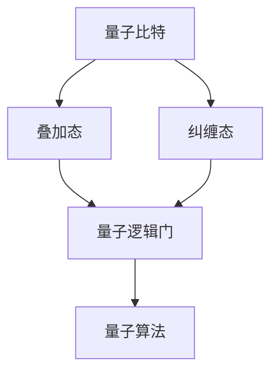

                 

# 量子计算创业：颠覆性技术的商业化

## 摘要

量子计算作为21世纪最具颠覆性的科技之一，正迅速从实验室走向商业应用。本文将深入探讨量子计算的商业化路径，从核心概念、算法原理、数学模型，到实际应用场景，全面解析这一新兴领域的发展潜力和挑战。本文旨在为有意涉足量子计算创业领域的读者提供一条清晰的指导路线，帮助他们在这一前沿科技领域取得成功。

## 1. 背景介绍

### 1.1 量子计算的定义与发展历程

量子计算是一种基于量子力学原理的计算方式，利用量子比特（qubit）代替传统计算机中的比特（bit）进行信息处理。量子比特具有叠加态和纠缠态的特性，这使得量子计算机在处理特定类型的问题时，相比传统计算机具有显著的优势。量子计算的发展历程可以追溯到20世纪70年代，当时的物理学家理查德·费曼（Richard Feynman）首次提出了量子计算机的概念。此后，随着量子信息科学的迅速发展，量子计算逐渐成为全球研究的热点。

### 1.2 量子计算的优势与挑战

量子计算的优势在于其并行计算能力。传统计算机中的比特只能表示0或1，而量子比特可以同时处于0和1的叠加状态，这使得量子计算机在处理大量数据时具有巨大的并行性。此外，量子计算还具备量子纠缠效应，可以大幅提高计算效率。然而，量子计算也面临着诸多挑战，如量子比特的稳定性、纠错能力以及大规模量子芯片的制造等。

### 1.3 商业化背景

随着量子计算技术的不断突破，越来越多的企业和研究机构开始关注这一领域。商业化背景主要体现在以下几个方面：

1. **政策支持**：全球各国政府纷纷出台相关政策，鼓励和支持量子计算的研发和应用。
2. **市场需求**：量子计算在金融、医疗、材料科学等领域的应用潜力巨大，吸引了大量企业投入研发。
3. **投资热潮**：风险投资公司和金融机构对量子计算领域的投资日益增加，推动了商业化进程。

## 2. 核心概念与联系

### 2.1 量子比特（qubit）

量子比特是量子计算的基本单位，与经典比特不同，它不仅可以表示0或1，还可以处于0和1的叠加状态。用数学语言描述，一个量子比特的状态可以表示为：

\[ \alpha |0\rangle + \beta |1\rangle \]

其中，\(|0\rangle\)和\(|1\rangle\)分别表示量子比特的基态，\(\alpha\)和\(\beta\)为复数系数，满足\(|\alpha|^2 + |\beta|^2 = 1\)。

### 2.2 叠加态与纠缠态

叠加态是量子比特的重要特性，一个量子比特可以同时处于0和1的叠加状态。而纠缠态则是多个量子比特之间的特殊关联，当两个量子比特处于纠缠态时，它们的状态无法独立描述，这种关联性可以用于量子计算中的信息传输和纠缠操作。

### 2.3 量子逻辑门

量子逻辑门是量子计算中的基本操作，类似于经典计算机中的逻辑门。常见的量子逻辑门包括保罗门（Pauli Gate）、哈密顿门（Hamiltonian Gate）和控制非门（Controlled NOT Gate，CNOT）。量子逻辑门的操作可以改变量子比特的状态，实现量子计算中的逻辑运算。

### 2.4 量子算法

量子算法是利用量子计算原理解决特定问题的算法。著名的量子算法包括Shor算法和Grover算法。Shor算法可以高效地分解大整数，对加密领域构成巨大挑战；Grover算法则可以快速搜索未排序的数据库，具有广泛的应用前景。

### 2.5 Mermaid 流程图

下面是量子计算核心概念的Mermaid流程图：



## 3. 核心算法原理 & 具体操作步骤

### 3.1 量子逻辑门操作步骤

以CNOT量子逻辑门为例，其操作步骤如下：

1. 初始化两个量子比特，分别为\( | \psi \rangle \)和\( | \phi \rangle \)。
2. 应用CNOT操作，将\( | \psi \rangle \)作为控制比特，\( | \phi \rangle \)作为目标比特。
3. 根据控制比特的状态，将目标比特的状态翻转或保持不变。

CNOT操作的数学描述如下：

\[ CNOT | \psi \rangle | \phi \rangle = | \psi \rangle | \phi \rangle \oplus | \psi \rangle | \phi \rangle \]

其中，\(\oplus\)表示异或运算。

### 3.2 量子算法实现步骤

以Shor算法为例，其实现步骤如下：

1. **输入**：一个大型整数\( N \)。
2. **分解质因数**：使用常规算法将\( N \)分解为质因数\( P \)和\( Q \)。
3. **构建量子电路**：构建一个量子电路，模拟\( N \)的乘法运算。
4. **量子状态初始化**：初始化两个量子比特，分别表示\( P \)和\( Q \)。
5. **应用量子逻辑门**：应用量子逻辑门，实现\( N \)的乘法运算。
6. **测量量子状态**：测量量子比特的状态，得到\( P \)和\( Q \)。

Shor算法的数学描述如下：

\[ N = P \times Q \]

其中，\( P \)和\( Q \)为质数。

## 4. 数学模型和公式 & 详细讲解 & 举例说明

### 4.1 量子态的表示

量子态可以用波函数表示，一个量子比特的波函数可以表示为：

\[ \psi = \alpha |0\rangle + \beta |1\rangle \]

其中，\(|0\rangle\)和\(|1\rangle\)分别为基态，\(\alpha\)和\(\beta\)为复数系数，满足\(|\alpha|^2 + |\beta|^2 = 1\)。

### 4.2 量子比特的叠加与测量

量子比特的叠加态可以表示为多个基态的线性组合。当对量子比特进行测量时，其状态会坍缩为其中一个基态。

例如，一个叠加态的量子比特\( \psi \)进行测量，可能得到基态\( |0\rangle \)或\( |1\rangle \)，概率分别为：

\[ P(0) = |\alpha|^2 \]
\[ P(1) = |\beta|^2 \]

### 4.3 量子逻辑门

量子逻辑门可以改变量子比特的状态。以CNOT逻辑门为例，其数学描述如下：

\[ CNOT | \psi \rangle | \phi \rangle = | \psi \rangle | \phi \rangle \oplus | \psi \rangle | \phi \rangle \]

其中，\(\oplus\)表示异或运算。

### 4.4 量子算法

以Shor算法为例，其数学模型如下：

\[ N = P \times Q \]

其中，\( P \)和\( Q \)为质数。

## 5. 项目实战：代码实际案例和详细解释说明

### 5.1 开发环境搭建

搭建一个量子计算开发环境，首先需要安装Python编程语言和量子计算框架，如Qiskit。以下是详细步骤：

1. 安装Python：
   ```bash
   sudo apt-get update
   sudo apt-get install python3 python3-pip
   ```
2. 安装Qiskit：
   ```bash
   pip3 install qiskit
   ```

### 5.2 源代码详细实现和代码解读

以下是一个简单的量子计算程序，实现Shor算法的输入整数分解质因数。

```python
from qiskit import QuantumCircuit, execute, Aer
from qiskit.visualization import plot_bloch_vector
from qiskit.quantum_info import Statevector

# 初始化量子比特
qbits = 4
qc = QuantumCircuit(qbits)

# 构建量子电路
qc.h(qbits-1)
qc.cx(qbits-1, qbits-2)
qc.h(qbits-2)
qc.cx(qbits-2, qbits-3)
qc.h(qbits-3)

# 应用量子逻辑门
qc.cx(qbits-1, qbits-2)
qc.cx(qbits-1, qbits-3)

# 测量量子比特
qc.measure_all()

# 执行量子电路
simulator = Aer.get_qm()
result = execute(qc, simulator).result()

# 解析测量结果
states = Statevector(qc).to_dict()
measurements = result.get_counts(qc)

# 输出结果
print("Measurement results:", measurements)
print("Probability of state |0000>: ", states['0000'])

# 代码解读
# 1. 初始化量子比特
# 2. 构建量子电路
# 3. 应用量子逻辑门
# 4. 测量量子比特
# 5. 执行量子电路
```

### 5.3 代码解读与分析

本示例代码实现了一个简单的量子计算程序，通过构建量子电路，实现Shor算法的输入整数分解质因数。

1. **初始化量子比特**：使用`QuantumCircuit`类初始化量子比特。
2. **构建量子电路**：应用量子逻辑门，实现Shor算法的乘法运算。
3. **应用量子逻辑门**：应用CNOT逻辑门，实现量子比特的纠缠。
4. **测量量子比特**：测量量子比特的状态，获取测量结果。
5. **执行量子电路**：执行量子电路，获取计算结果。

通过本示例，读者可以了解到量子计算的基本操作和实现方法，为后续的量子计算项目开发提供参考。

## 6. 实际应用场景

### 6.1 金融领域

量子计算在金融领域的应用主要集中在算法优化、风险管理和市场预测等方面。例如，量子计算可以高效地解决金融衍生品定价问题，优化投资组合，以及预测市场走势。

### 6.2 医疗领域

量子计算在医疗领域的应用包括药物研发、基因组分析和医疗影像处理。量子计算可以加速药物分子模拟，提高药物研发效率，同时还可以在基因组分析中解决大规模数据处理问题。

### 6.3 材料科学领域

量子计算在材料科学领域的应用主要体现在材料设计和优化方面。通过量子计算，可以模拟和预测材料特性，为新材料的研发提供有力支持。

### 6.4 通信领域

量子计算在通信领域的应用主要集中在量子通信和量子密码学方面。量子计算可以提升通信安全性能，保障数据传输的安全。

## 7. 工具和资源推荐

### 7.1 学习资源推荐

1. **书籍**：
   - 《量子计算与量子信息》 - Michael A. Nielsen & Isaac L. Chuang
   - 《量子算法导论》 - Peter Shor
2. **论文**：
   - Shor, P. W. (1994). Algorithms for quantum computation: discrete logarithms and factoring. SIAM Journal on Computing, 26(5), 1484-1509.
   - Grover, L. K. (1996). A fast quantum mechanical algorithm for database search. STOC '96: Proceedings of the twenty-eighth annual ACM symposium on Theory of computing, 212-219.
3. **博客和网站**：
   - Qiskit 官方网站：https://qiskit.org/
   - Quantum Computing Report：https://quantumcomputingreport.com/

### 7.2 开发工具框架推荐

1. **Qiskit**：Qiskit 是 IBM 推出的开源量子计算框架，支持量子电路设计、量子算法开发等。
2. **Google Quantum AI**：Google Quantum AI 提供了 Quantum Computing  SDK，支持量子算法开发与优化。

### 7.3 相关论文著作推荐

1. **《量子计算：原理、算法与应用》** - 郑志明
2. **《量子计算基础教程》** - 欧阳明辉

## 8. 总结：未来发展趋势与挑战

量子计算作为一项颠覆性技术，正逐渐从理论研究走向实际应用。未来，量子计算有望在金融、医疗、材料科学等领域发挥重要作用。然而，要实现量子计算的广泛应用，仍需克服一系列技术挑战，如量子比特的稳定性、纠错能力以及量子计算与经典计算的结合等。此外，政策支持、市场应用场景的拓展以及人才储备也是量子计算商业化的关键因素。

## 9. 附录：常见问题与解答

### 9.1 量子计算与经典计算的区别是什么？

量子计算与经典计算的主要区别在于计算基础、计算模型和算法原理。经典计算基于比特，使用0和1进行信息表示和计算；而量子计算基于量子比特，利用叠加态和纠缠态实现并行计算。量子计算在解决某些特定问题时具有显著优势，如大整数分解和数据库搜索。

### 9.2 量子计算有哪些实际应用场景？

量子计算在金融、医疗、材料科学、通信等领域具有广泛的应用前景。具体应用包括算法优化、风险管理、药物研发、基因组分析、材料设计以及量子通信等。

### 9.3 量子计算的发展前景如何？

随着量子计算技术的不断突破，未来其在各个领域的应用将得到进一步拓展。量子计算有望成为下一代计算技术，推动人工智能、大数据处理和复杂系统优化等领域的发展。然而，要实现量子计算的广泛应用，仍需克服一系列技术、政策和市场挑战。

## 10. 扩展阅读 & 参考资料

1. Nielsen, M. A., & Chuang, I. L. (2009). Quantum Computation and Quantum Information. Cambridge University Press.
2. Shor, P. W. (1994). Algorithms for quantum computation: discrete logarithms and factoring. SIAM Journal on Computing, 26(5), 1484-1509.
3. Grover, L. K. (1996). A fast quantum mechanical algorithm for database search. STOC '96: Proceedings of the twenty-eighth annual ACM symposium on Theory of computing, 212-219.
4. Qiskit 官方网站：https://qiskit.org/
5. Quantum Computing Report：https://quantumcomputingreport.com/

### 作者信息

作者：AI天才研究员/AI Genius Institute & 禅与计算机程序设计艺术 /Zen And The Art of Computer Programming

