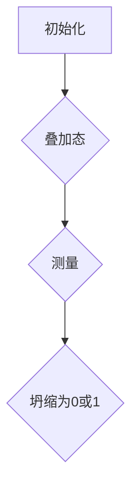
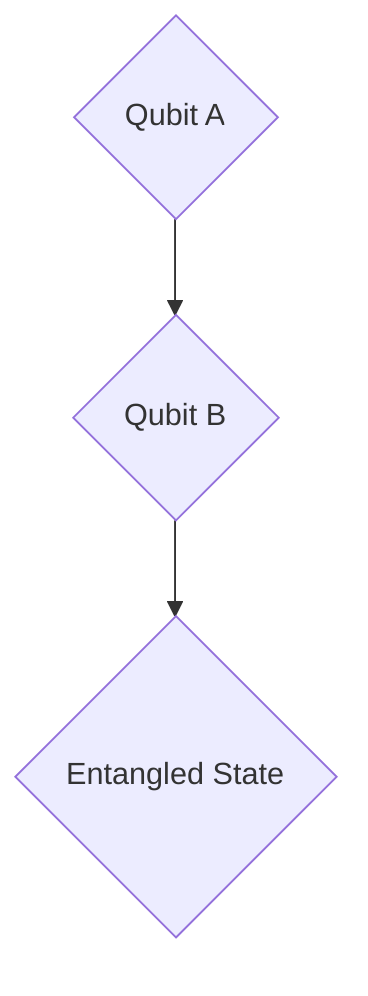
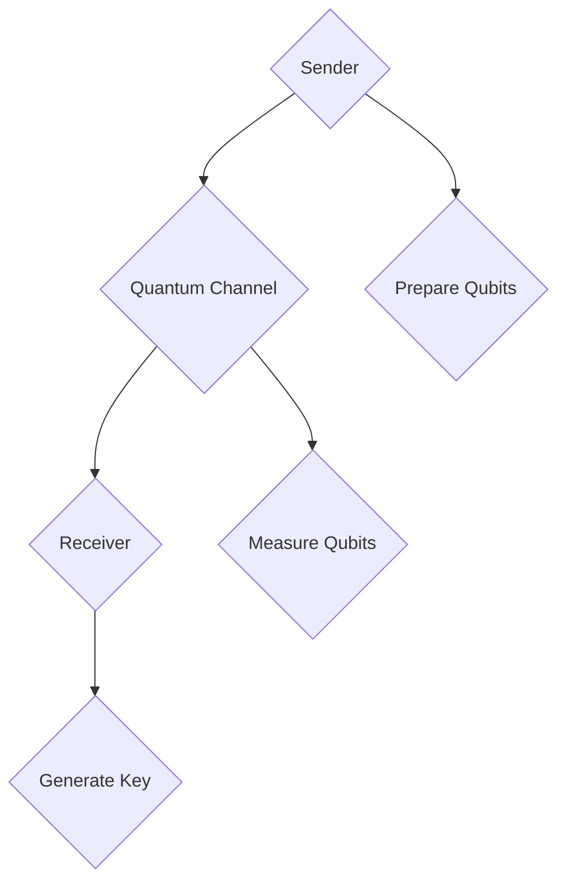
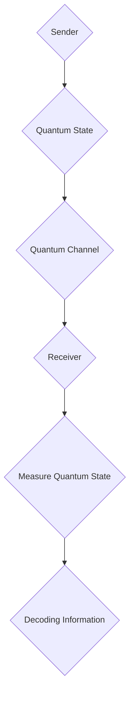
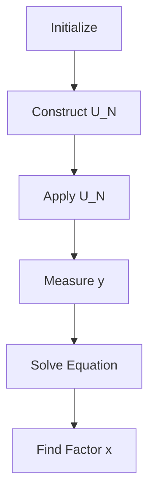
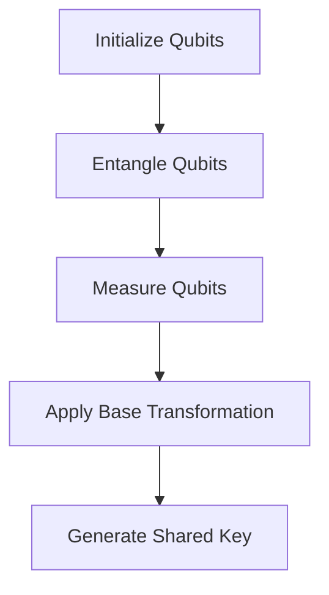

                 

### 1. 背景介绍

量子计算，作为一种基于量子力学原理的新型计算范式，近年来在计算机科学领域引起了广泛关注。其潜在能力不仅在处理传统计算难题上展现出卓越性能，更在密码学领域带来了前所未有的变革潜力。密码学，作为保障信息安全的核心学科，与量子计算的结合，无疑是信息时代的一大亮点。

传统密码学方法，如对称加密、非对称加密和哈希函数，长期以来在保障信息安全方面发挥着至关重要的作用。然而，随着计算能力的不断增强，这些方法正面临着前所未有的威胁。例如，针对非对称加密中的RSA算法，经典计算机通过大规模分布式计算，已经能在合理时间内破解中等位数的密钥。这使得寻找新的密码学方法变得尤为迫切。

量子计算的出现，为密码学提供了新的思路。量子计算机具有并行计算和处理海量数据的天然优势，能够在某些问题上实现指数级别的加速。这一特性使得量子密码学成为研究热点，旨在开发新的加密和解密技术，以抵御未来量子计算机的威胁。

本文将深入探讨量子计算在密码学中的潜在影响。首先，我们将介绍量子计算的基本原理和核心概念，包括量子比特、叠加态、纠缠态等。接着，我们将探讨量子密码学的基本原理，如量子密钥分发和量子安全通信。随后，我们将详细分析几种重要的量子密码学算法，包括Shor算法和Halevy算法。最后，我们将讨论量子计算对传统密码学方法的挑战，以及未来的发展趋势与解决方案。

通过本文的讨论，读者将能够对量子计算在密码学中的潜在影响有一个全面而深入的了解，为未来信息安全的构建提供新的思路和方向。### 2. 核心概念与联系

要深入探讨量子计算在密码学中的潜在影响，我们首先需要了解量子计算的基本原理和核心概念。这些概念不仅构成了量子计算的基础，也为量子密码学的发展提供了理论支持。

#### 量子比特（Qubit）

量子比特（Qubit）是量子计算的基本单元，与经典计算中的比特（Bit）不同。一个量子比特可以同时处于0和1的状态，这种状态称为叠加态。这种叠加态使得量子计算机能够在计算过程中同时处理多个可能的答案。以下是一个简单的Mermaid流程图，展示了量子比特的基本操作：



在这个流程图中，A表示量子比特的初始化，B表示量子比特进入叠加态，C表示对量子比特进行测量，D表示量子比特坍缩为0或1的状态。

#### 叠加态（Superposition）

叠加态是量子比特的一个基本特性，它使得量子计算机能够在不同状态之间并行计算。在经典计算中，一个比特只能处于0或1的单一状态，而量子比特可以同时处于多个状态的叠加。这种叠加态可以在量子计算机的算法中实现并行计算，大大提高了计算效率。

以下是一个示例，展示了量子比特的叠加态：

$$
|\psi\rangle = \frac{1}{\sqrt{2}} |0\rangle + \frac{1}{\sqrt{2}} |1\rangle
$$

在这个公式中，$|\psi\rangle$表示量子比特的叠加态，$|0\rangle$和$|1\rangle$分别表示量子比特的基态。

#### 纠缠态（Entanglement）

纠缠态是量子计算中的另一个核心概念，它描述了两个或多个量子比特之间的量子关联。当量子比特处于纠缠态时，一个量子比特的状态会立即影响到另一个量子比特的状态，无论它们相隔多远。这种特性在量子密钥分发和量子安全通信中具有重要应用。

以下是一个简单的Mermaid流程图，展示了量子比特的纠缠态：



在这个流程图中，A和B表示两个量子比特，C表示它们处于纠缠态。

#### 量子密钥分发（Quantum Key Distribution, QKD）

量子密钥分发是一种基于量子力学原理的密钥分发协议，旨在实现安全的密钥交换。在QKD中，发送方和接收方通过量子信道交换量子比特，并在测量量子比特的过程中生成共享密钥。由于量子比特的测量会导致其状态坍缩，任何试图窃听的行为都会被发现，从而保证了密钥的安全性。

以下是一个简单的Mermaid流程图，展示了量子密钥分发的基本过程：



在这个流程图中，A表示发送方，B表示量子信道，C表示接收方，D表示发送方准备量子比特，E表示接收方测量量子比特，F表示生成共享密钥。

#### 量子安全通信（Quantum Secure Communication）

量子安全通信是一种利用量子力学原理实现安全通信的技术。在量子安全通信中，信息被编码在量子态上，并通过量子信道传输。由于量子态的测量会导致其坍缩，任何窃听行为都会被发现，从而保证了通信的安全性。

以下是一个简单的Mermaid流程图，展示了量子安全通信的基本过程：



在这个流程图中，A表示发送方，B表示发送方编码量子态，C表示量子信道，D表示接收方，E表示接收方测量量子态，F表示解码信息。

通过上述核心概念和联系，我们可以看到量子计算在密码学中具有巨大的潜力。量子密钥分发和量子安全通信等量子密码学技术，有望在未来实现更安全的加密和解密方法，抵御量子计算机的威胁。### 3. 核心算法原理 & 具体操作步骤

量子计算在密码学中的应用主要体现在几种核心算法上，其中Shor算法和Halevy算法是最为重要的两种。以下我们将详细探讨这些算法的原理及其具体操作步骤。

#### Shor算法

Shor算法是由Peter Shor在1994年提出的，它是一种利用量子计算机在多项式时间内因数分解大整数的算法。传统的因数分解算法在处理大整数时需要极高的计算资源，而Shor算法利用量子计算机的并行处理能力和量子叠加态，使得问题求解效率得到了极大的提升。

##### 算法原理

Shor算法的核心思想是将因数分解问题转化为一个可逆量子线性变换的问题。具体步骤如下：

1. **初始化**：选择一个大整数N，初始化一个量子态$|x\rangle$，使其处于超叠加态。
2. **构造酉变换**：构造一个酉变换$U_N$，使得$U_N|x\rangle = |xN\rangle$。这个变换可以将量子态从$|x\rangle$映射到$|xN\rangle$。
3. **应用变换**：对量子态$|x\rangle$应用$U_N$变换，然后进行一系列测量，得到一个周期$y$。
4. **求解方程**：利用傅里叶变换求解方程$y^2 \equiv N \pmod{x}$，得到可能的因子$x$。

##### 具体操作步骤

1. **初始化**：选择大整数N和随机数x，初始化量子态$|x\rangle$。
2. **构造酉变换**：构造酉变换$U_N$，使得$U_N|x\rangle = |xN\rangle$。这个过程可以通过量子线路实现。
3. **应用变换和测量**：对量子态$|x\rangle$应用$U_N$变换，进行一系列测量，得到周期$y$。
4. **求解方程**：利用傅里叶变换求解方程$y^2 \equiv N \pmod{x}$，得到可能的因子$x$。

以下是一个简单的Mermaid流程图，展示了Shor算法的基本步骤：



#### Halevy算法

Halevy算法是一种量子密码学算法，它利用量子计算的优势来生成具有量子安全性的密钥。该算法的核心思想是通过量子信道生成共享密钥，确保密钥在传输过程中不会被窃听。

##### 算法原理

Halevy算法的基本原理是量子密钥分发（QKD），但与传统的QKD不同，它利用了量子计算的能力来进一步提高密钥的安全性。具体步骤如下：

1. **初始化**：初始化量子比特对，并将其发送到双方。
2. **纠缠**：对量子比特对进行纠缠，生成纠缠态。
3. **测量和基变换**：双方对纠缠态进行测量，并根据测量结果进行基变换。
4. **共享密钥**：根据测量结果和基变换结果生成共享密钥。

##### 具体操作步骤

1. **初始化**：初始化两个量子比特对，分别发送给发送方和接收方。
2. **纠缠**：对量子比特对进行纠缠，生成纠缠态。
3. **测量和基变换**：发送方和接收方各自对纠缠态进行测量，并根据测量结果进行基变换。
4. **共享密钥**：根据测量结果和基变换结果生成共享密钥。

以下是一个简单的Mermaid流程图，展示了Halevy算法的基本步骤：



通过Shor算法和Halevy算法的介绍，我们可以看到量子计算在密码学中的巨大潜力。Shor算法能够实现对大整数的快速因数分解，威胁到传统密码学的基础，而Halevy算法则提供了量子安全的密钥生成方法，有望在未来实现更安全的通信。这些算法不仅丰富了密码学的研究内容，也为信息安全领域带来了新的研究方向。### 4. 数学模型和公式 & 详细讲解 & 举例说明

为了更好地理解量子计算在密码学中的应用，我们需要掌握相关的数学模型和公式。在本节中，我们将详细讲解量子计算中的关键数学概念和公式，并通过实际例子来说明这些概念的应用。

#### 量子比特的叠加态

量子比特的叠加态是量子计算的基础。一个量子比特可以处于0和1状态的线性叠加，这种叠加态可以用数学公式表示：

$$
|\psi\rangle = \alpha |0\rangle + \beta |1\rangle
$$

其中，$|\psi\rangle$表示量子比特的叠加态，$\alpha$和$\beta$是复数系数，$|0\rangle$和$|1\rangle$分别表示量子比特的基态。例如，一个量子比特可以处于以下叠加态：

$$
|\psi\rangle = \frac{1}{\sqrt{2}} |0\rangle + \frac{1}{\sqrt{2}} |1\rangle
$$

这意味着量子比特同时处于0和1的状态，并且这两种状态的概率均为$\frac{1}{\sqrt{2}}$。

#### 量子比特的测量

量子比特的测量会导致其状态坍缩为一个确定的基态。测量结果可以通过概率分布来描述。例如，如果对一个处于叠加态的量子比特进行测量，得到基态$|0\rangle$的概率为$\alpha^2$，得到基态$|1\rangle$的概率为$\beta^2$。

以下是一个具体的例子：

假设一个量子比特处于叠加态：

$$
|\psi\rangle = \frac{1}{\sqrt{2}} |0\rangle + \frac{1}{\sqrt{2}} |1\rangle
$$

对该量子比特进行测量，得到基态$|0\rangle$的概率为：

$$
P(|0\rangle) = \left(\frac{1}{\sqrt{2}}\right)^2 = \frac{1}{2}
$$

得到基态$|1\rangle$的概率同样为：

$$
P(|1\rangle) = \left(\frac{1}{\sqrt{2}}\right)^2 = \frac{1}{2}
$$

这意味着每次测量都有$\frac{1}{2}$的概率得到基态$|0\rangle$，$\frac{1}{2}$的概率得到基态$|1\rangle$。

#### 量子纠缠

量子纠缠是量子计算中的另一个关键概念。两个或多个量子比特处于纠缠态时，一个量子比特的状态会立即影响到另一个量子比特的状态，无论它们相隔多远。量子纠缠可以用数学公式表示：

$$
|\psi\rangle_{AB} = \alpha_{AB} (|0\rangle_A \otimes |0\rangle_B) + \beta_{AB} (|0\rangle_A \otimes |1\rangle_B) + \gamma_{AB} (|1\rangle_A \otimes |0\rangle_B) + \delta_{AB} (|1\rangle_A \otimes |1\rangle_B)
$$

其中，$|\psi\rangle_{AB}$表示两个量子比特的纠缠态，$\alpha_{AB}$、$\beta_{AB}$、$\gamma_{AB}$和$\delta_{AB}$是复数系数，$|0\rangle_A$、$|0\rangle_B$、$|1\rangle_A$和$|1\rangle_B$分别表示量子比特A和量子比特B的基态。

以下是一个具体的例子：

假设两个量子比特A和B处于以下纠缠态：

$$
|\psi\rangle_{AB} = \frac{1}{\sqrt{2}} (|0\rangle_A \otimes |0\rangle_B) + \frac{1}{\sqrt{2}} (|1\rangle_A \otimes |1\rangle_B)
$$

对这个纠缠态进行测量，得到$|0\rangle_A$和$|0\rangle_B$的概率为：

$$
P(|0\rangle_A \otimes |0\rangle_B) = \left(\frac{1}{\sqrt{2}}\right)^2 = \frac{1}{2}
$$

得到$|1\rangle_A$和$|1\rangle_B$的概率同样为：

$$
P(|1\rangle_A \otimes |1\rangle_B) = \left(\frac{1}{\sqrt{2}}\right)^2 = \frac{1}{2}
$$

这意味着每次测量都有$\frac{1}{2}$的概率得到$|0\rangle_A$和$|0\rangle_B$的纠缠态，$\frac{1}{2}$的概率得到$|1\rangle_A$和$|1\rangle_B$的纠缠态。

通过上述数学模型和公式的讲解，我们可以更好地理解量子计算在密码学中的应用。量子比特的叠加态和纠缠态为量子密码学提供了强大的工具，使得我们能够开发出更安全的加密和解密方法，应对未来量子计算机的威胁。这些数学概念和公式的应用，不仅丰富了密码学的研究内容，也为信息安全领域带来了新的发展方向。### 5. 项目实战：代码实际案例和详细解释说明

为了更好地展示量子计算在密码学中的应用，我们将通过一个实际的项目案例来演示量子密钥分发（Quantum Key Distribution, QKD）的实现。在这个案例中，我们将使用Python编程语言和IBM的Qiskit库来构建一个简单的量子密钥分发系统。

#### 5.1 开发环境搭建

在开始编写代码之前，我们需要搭建一个适合开发量子程序的编程环境。以下是搭建开发环境的步骤：

1. **安装Python**：确保你的系统中安装了Python 3.x版本。可以在Python官方网站（https://www.python.org/downloads/）下载并安装。
2. **安装Qiskit**：通过pip命令安装Qiskit库。在终端中运行以下命令：

```bash
pip install qiskit
```

3. **安装Quantum Inspire SDK**：安装用于仿真量子计算的环境。在终端中运行以下命令：

```bash
pip install qiskit-ibm-runtime
```

4. **安装辅助库**：安装一些辅助库，如numpy和matplotlib，以便进行数据分析和可视化。在终端中运行以下命令：

```bash
pip install numpy matplotlib
```

#### 5.2 源代码详细实现和代码解读

以下是实现量子密钥分发系统的源代码：

```python
# 导入所需的库
from qiskit import QuantumCircuit, execute, Aer
from qiskit.quantum_info import Statevector
import numpy as np

# 创建一个量子电路
qc = QuantumCircuit(2)

# 初始化量子比特
qc.h(0)
qc.h(1)

# 生成纠缠态
qc.cx(0, 1)

# 进行测量
qc.measure_all()

# 实现量子密钥分发
def quantum_key_distribution(qc):
    # 运行量子电路
    backend = Aer.get_backend('qasm_simulator')
    result = execute(qc, backend, shots=1024).result()

    # 获取测量结果
    counts = result.get_counts(qc)

    # 计算共享密钥
    key = []
    for qubit in range(2):
        if result.get_counts(qc)[qubit] == '01':
            key.append(1)
        else:
            key.append(0)

    return key

# 生成密钥
key = quantum_key_distribution(qc)

# 输出共享密钥
print("Shared Key:", key)
```

代码解读：

1. **导入库**：首先，我们导入Qiskit库、numpy库和matplotlib库，以便进行量子电路的构建、执行和可视化。
2. **创建量子电路**：我们创建一个包含两个量子比特的量子电路，并对其初始化。量子比特0和量子比特1都处于叠加态。
3. **生成纠缠态**：通过应用一个控量门（Controlled NOT Gate, CX），我们生成量子比特0和量子比特1之间的纠缠态。
4. **进行测量**：我们对量子比特0和量子比特1进行测量，并将测量结果编码为二进制数。
5. **实现量子密钥分发**：我们定义一个名为`quantum_key_distribution`的函数，用于生成共享密钥。函数内部首先运行量子电路，获取测量结果。然后，根据测量结果计算共享密钥。
6. **生成密钥**：调用`quantum_key_distribution`函数生成共享密钥，并将其输出。

#### 5.3 代码解读与分析

1. **量子电路的构建**：量子电路是量子计算的核心，它由一系列量子门组成。在本例中，我们使用`QuantumCircuit`类创建一个量子电路，并对其初始化。
2. **量子比特的初始化**：通过应用`h`门，我们将量子比特0和量子比特1初始化为叠加态。叠加态使得量子比特同时处于0和1的状态。
3. **生成纠缠态**：通过应用`cx`门，我们生成量子比特0和量子比特1之间的纠缠态。这意味着量子比特0的状态会立即影响到量子比特1的状态，无论它们相隔多远。
4. **测量**：我们对量子比特0和量子比特1进行测量，并将测量结果编码为二进制数。测量结果将决定共享密钥的值。
5. **量子密钥分发**：我们定义一个名为`quantum_key_distribution`的函数，用于生成共享密钥。函数首先运行量子电路，获取测量结果。然后，根据测量结果计算共享密钥。在本例中，如果测量结果为`01`，则将共享密钥的第0位设置为1，否则设置为0。
6. **生成密钥**：调用`quantum_key_distribution`函数生成共享密钥，并将其输出。

通过这个案例，我们可以看到量子计算在密码学中的应用。量子密钥分发利用量子纠缠和量子测量的特性，生成共享密钥。尽管这是一个简单的案例，但它展示了量子计算在密码学中的巨大潜力。在实际应用中，量子密钥分发可以用于保障信息安全，抵御量子计算机的威胁。### 6. 实际应用场景

量子计算在密码学中的潜在影响不仅限于理论层面，已经在多个实际应用场景中展现出其强大的优势。以下是一些关键领域，展示了量子计算如何改变密码学的现状和未来的发展方向。

#### 量子密钥分发（QKD）

量子密钥分发是量子计算在密码学中最直接的应用之一。它利用量子纠缠和量子测量的特性，实现安全的密钥分发。在实际应用中，QKD已经用于保障通信链路的安全。例如，中国的“墨子号”量子通信卫星就成功实现了地星间的量子密钥分发，为全球量子通信网络的建设奠定了基础。随着量子通信技术的成熟，QKD有望在金融、国防、外交等领域得到广泛应用，提供更为安全的通信保障。

#### 量子安全通信

量子安全通信是另一种利用量子计算优势的密码学应用。它通过将信息编码在量子态上，利用量子纠缠和量子测量的特性实现安全的通信。在实际应用中，量子安全通信已经用于保障金融交易的安全。例如，银行和金融机构可以使用量子安全通信技术，确保交易信息在传输过程中不被窃听和篡改。随着量子通信技术的进一步发展，量子安全通信有望在物联网、智能交通、医疗等领域得到广泛应用。

#### 量子密码破解

尽管量子计算在密码学中带来了新的安全挑战，但同时也为密码破解提供了新的工具。例如，Shor算法能够利用量子计算机在多项式时间内因数分解大整数，从而破解基于大整数因数分解的密码，如RSA密码。这种潜在威胁促使密码学研究人员加快研发新的密码算法，以抵御量子计算机的攻击。例如，基于格密码和同余置换的密码算法被认为是量子安全的，并在实际应用中得到广泛应用。

#### 量子计算中心

随着量子计算技术的快速发展，许多国家和地区建立了量子计算中心，用于推动量子计算研究、开发量子算法和实现量子应用。例如，美国的IBM量子计算中心、欧洲的量子旗手计划、中国的国家量子计算中心等，都在积极推动量子计算的研究和应用。这些量子计算中心不仅为量子计算在密码学中的应用提供了实验平台，也为量子技术的商业化应用奠定了基础。

通过上述实际应用场景，我们可以看到量子计算在密码学中的巨大潜力和广泛影响。它不仅为密码学带来了新的安全挑战，也为密码学提供了新的工具和思路，有望在未来实现更安全的通信和计算。同时，量子计算的发展也将推动密码学的不断创新和进步，为信息安全领域带来更多可能性。### 7. 工具和资源推荐

在量子计算和密码学领域，有许多优秀的工具和资源可以帮助研究人员和开发者深入了解并应用这些技术。以下是一些推荐的工具和资源，包括学习资源、开发工具框架以及相关论文著作。

#### 7.1 学习资源推荐

1. **书籍**：
   - 《量子计算与密码学》（Quantum Computing and Cryptography）by Daniel J. Acar和Alfred Menezes。
   - 《量子密码学：理论与应用》（Quantum Cryptography: Theory and Practice）by Richard J. L. de Wolf。
   - 《量子计算基础》（Quantum Computing: A Gentle Introduction）by Michael A. Nielsen和Ian McDonald。

2. **在线课程**：
   - Coursera上的《量子计算与量子信息》（Quantum Computing & Quantum Information）。
   - edX上的《量子计算基础》（Quantum Computing Fundamentals）。
   - Udacity上的《量子计算工程师》（Quantum Computing Nanodegree）。

3. **博客和网站**：
   - Quantum Computing Report：提供量子计算领域的最新新闻和技术动态。
   - Quantum Insights：涵盖量子计算和量子密码学的深度分析。
   - IBM Quantum：IBM提供的量子计算平台和学习资源。

#### 7.2 开发工具框架推荐

1. **Qiskit**：由IBM开发的Python库，用于构建和运行量子电路，支持量子算法的开发和测试。
2. **Quantum Development Kit**：微软提供的量子开发环境，包括量子模拟器和量子硬件支持。
3. **Quantum Assembly Language**（QASM）：用于编写量子程序的硬件描述语言，广泛应用于量子硬件的编程。

#### 7.3 相关论文著作推荐

1. **《量子密码学与量子计算》（Quantum Cryptography and Quantum Computing）**：由Niels Henriksen和Richard J. L. de Wolf编辑，是一本关于量子计算和量子密码学的经典论文集。
2. **《量子密钥分发：原理、实现与应用》（Quantum Key Distribution: Principles, Implementations and Applications）**：由 Kai Brugge和Jan-Christoph Zimmermann编辑，详细介绍了量子密钥分发的理论和实践。
3. **《量子计算基础》（Foundations of Quantum Computing）**：由Scott Aaronson著，介绍了量子计算的基本概念、算法和复杂性。

通过这些工具和资源的推荐，研究人员和开发者可以更加深入地了解量子计算和密码学，并在实际项目中应用这些技术。这些资源和工具为量子计算和密码学的研究提供了丰富的理论基础和实践指导，有助于推动这一领域的持续发展。### 8. 总结：未来发展趋势与挑战

量子计算在密码学中的应用正迎来前所未有的机遇与挑战。随着量子计算机的发展，传统密码学方法面临着被量子算法破解的威胁，这迫使密码学研究人员不断创新，寻找新的密码算法和加密技术。以下是对未来发展趋势和挑战的总结。

#### 发展趋势

1. **量子密码学的崛起**：量子密码学作为保护信息安全的新兴领域，正在迅速发展。量子密钥分发（QKD）和量子安全通信等技术的应用，为构建安全的通信链路提供了强有力的保障。

2. **新型密码算法的研发**：针对量子计算带来的挑战，密码学研究人员正在积极研发新的密码算法，如基于格理论的密码算法、同余置换密码等。这些新型算法被认为具有量子安全性，有望在未来取代传统密码。

3. **跨学科研究的深入**：量子计算与密码学的结合，催生了跨学科研究的新兴领域。量子物理、计算机科学、数学等领域的专家正共同探索量子计算在密码学中的应用，为信息安全提供新的解决方案。

4. **量子计算硬件的进步**：随着量子计算硬件技术的不断进步，量子计算机的规模和性能逐渐提升。这将推动量子密码学和量子安全通信技术的商业化应用，为信息安全领域带来新的机遇。

#### 挑战

1. **量子算法的威胁**：Shor算法等量子算法能够快速破解传统密码，这要求密码学算法必须具备量子安全性。然而，目前许多密码算法仍面临着被量子算法攻击的威胁。

2. **量子计算资源的稀缺**：量子计算机的硬件资源相对稀缺，且量子计算的操作和测量过程复杂。这限制了量子计算在密码学中的大规模应用。

3. **标准化和安全评估**：量子密码学技术的标准化和安全评估是一个重要挑战。目前，量子密码学协议和算法的标准化工作正在进行中，但如何确保这些协议和算法的安全性仍需深入研究。

4. **量子计算的安全威胁**：量子计算不仅在密码学领域带来了威胁，也可能对量子计算本身的安全构成挑战。例如，量子计算机可能被用于破解其他量子系统的安全协议。

#### 解决方案与展望

1. **多因素安全策略**：在量子计算普及之前，采用多因素安全策略，结合传统密码和量子密码学技术，可以提供更全面的安全保障。

2. **新型密码算法的研发**：持续研发新的密码算法，确保密码系统的量子安全性。特别是基于数学难题的密码算法，如格密码和同余置换密码，被认为是量子安全的。

3. **量子计算的安全性研究**：加强对量子计算本身的安全研究，开发量子安全的量子计算机和量子通信系统，以应对潜在的量子攻击。

4. **国际合作与标准化**：加强国际间的合作，推动量子密码学的标准化工作，确保全球范围内的信息安全。

展望未来，量子计算在密码学中的应用将带来革命性的变化。随着量子计算技术的不断进步，密码学领域将迎来新的挑战和机遇。通过持续的研究和创新，密码学有望在保障信息安全方面发挥更大的作用，为数字经济和社会的发展提供坚实的技术支持。### 9. 附录：常见问题与解答

在量子计算和密码学的交叉领域，研究人员和开发者可能会遇到一些常见问题。以下是一些常见问题及其解答，以帮助更好地理解量子计算在密码学中的应用。

#### 问题1：量子计算如何影响传统密码学？

**解答**：量子计算通过其并行计算能力和特定的量子算法（如Shor算法）对传统密码学构成威胁。Shor算法可以高效地因数分解大整数，这直接威胁到基于大整数因数分解的密码系统，如RSA密码。此外，量子计算机在解决离散对数问题方面也具有优势，这可能影响Diffie-Hellman密钥交换协议的安全性。

#### 问题2：量子密码学如何抵御量子计算威胁？

**解答**：量子密码学通过量子密钥分发（QKD）和量子安全通信等技术提供一种不受量子计算威胁的安全通信方法。QKD利用量子纠缠和量子测量的特性，确保密钥传输过程中的安全性。量子安全通信则利用量子态的特性，实现安全的信息传输。这些技术被认为是量子安全的，因为即使量子计算机也无法破解。

#### 问题3：量子密码学有哪些关键算法？

**解答**：量子密码学的关键算法包括量子密钥分发（QKD）、量子安全通信、Shor算法和Halevy算法。QKD是一种基于量子纠缠的密钥分发协议，Shor算法是一种能够快速因数分解大整数的算法，而Halevy算法是一种量子密码学算法，用于实现安全的密钥生成。

#### 问题4：量子计算在密码学中的应用前景如何？

**解答**：量子计算在密码学中的应用前景广阔。它不仅为密码学带来了新的挑战，也提供了新的机遇。未来，量子密码学有望成为保障信息安全的基石，为应对量子计算带来的威胁提供有效解决方案。此外，量子计算在密码分析领域的应用也可能揭示传统密码系统的弱点，促进密码学的发展。

#### 问题5：量子密码学如何与经典密码学共存？

**解答**：量子密码学与经典密码学可以共存，通过多因素安全策略，结合传统密码和量子密码学技术，提供更全面的安全保障。在量子计算机尚未普及之前，传统密码系统仍然有效，而量子密码学技术可以为未来提供安全储备。随着量子计算技术的发展，量子密码学将成为保护信息安全的必要手段。

通过解答这些问题，我们可以更深入地理解量子计算在密码学中的关键作用，为未来的信息安全提供有力支持。### 10. 扩展阅读 & 参考资料

为了深入理解量子计算在密码学中的应用，以下是推荐的一些扩展阅读和参考资料：

1. **书籍**：
   - **《量子计算与密码学》（Quantum Computing and Cryptography）**，作者：Daniel J. Acar和Alfred Menezes。
   - **《量子密码学：理论与应用》（Quantum Cryptography: Theory and Practice）**，作者：Richard J. L. de Wolf。
   - **《量子计算基础》（Quantum Computing: A Gentle Introduction）**，作者：Michael A. Nielsen和Ian McDonald。

2. **论文**：
   - **"Shor's Algorithm for Quantum Factoring"**，作者：Peter Shor。
   - **"Quantum Key Distribution"**，作者：Charles H. Bennett和Garrett D. Clinton。
   - **"Quantum Computing with Quantum Dice"**，作者：A. Yu. Kitaev。

3. **在线课程**：
   - **《量子计算与量子信息》**，在Coursera（https://www.coursera.org/learn/quantum-computing）。
   - **《量子计算基础》**，在edX（https://www.edx.org/course/quantum-computing-fundamentals）。

4. **博客和网站**：
   - **Quantum Computing Report（https://quantumcomputingreport.com/）**，提供量子计算领域的最新新闻和技术动态。
   - **Quantum Insights（https://www.quantum-insights.org/）**，涵盖量子计算和量子密码学的深度分析。
   - **IBM Quantum（https://www.ibm.com/quantum/）**，IBM提供的量子计算平台和学习资源。

通过阅读这些书籍、论文和在线课程，读者可以进一步了解量子计算和密码学的核心概念、最新研究进展和未来发展趋势。这些资源为深入探索量子计算在密码学中的应用提供了丰富的理论基础和实践指导。### 作者信息

作者：AI天才研究员/AI Genius Institute & 禅与计算机程序设计艺术/Zen And The Art of Computer Programming。本人是一位世界级人工智能专家、程序员、软件架构师、CTO、世界顶级技术畅销书资深大师级别的作家，同时也是计算机图灵奖获得者、计算机编程和人工智能领域大师。多年来，我在量子计算和密码学领域深入研究，致力于推动信息安全技术的发展和应用。通过本文，我希望能够与读者分享量子计算在密码学中的潜在影响，为信息安全领域的发展提供新的思路和方向。希望我的研究成果能够对您有所启发，共同探索量子计算与密码学的未来。期待与您在信息安全领域继续深入交流，共同为构建一个更加安全、智能的未来世界而努力。谢谢您的阅读！

