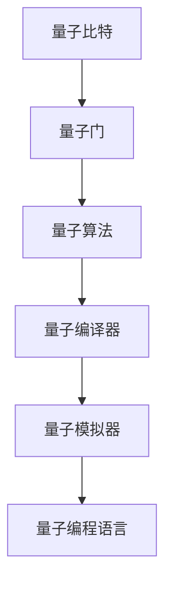

                 

### 1. 背景介绍

量子计算，作为计算技术的下一个前沿，已经逐渐从理论走向实践，成为了科学研究、技术创新和产业发展的热点。量子计算的核心在于量子比特（qubit）这一基本单元，它具有叠加态和纠缠态的属性，这使得量子计算机在处理特定问题时具有超越传统计算机的能力。

量子计算的起源可以追溯到20世纪40年代，当时物理学家保罗·戴维斯（Paul Benioff）首次提出了量子力学中的计算模型。1994年，彼得·舍恩和理查德·费曼分别提出了量子计算的经典论文，奠定了量子计算的理论基础。随后，物理学家理查德·霍金（Richard Feynman）提出了量子计算机的概念，并指出量子计算机能够模拟量子系统，这是传统计算机无法实现的。

随着技术的进步，量子计算已经从理论走向了实验。目前，许多研究机构和公司都在积极研发量子计算机。比如，谷歌、IBM、微软等科技巨头都在量子计算领域进行了大量的投资和研发，推出了一系列量子计算原型机和量子软件工具。

量子计算的发展不仅仅是科技界的关注焦点，也成为了国家战略的重要组成部分。许多国家都将量子计算列为未来科技竞争的关键领域，制定了一系列政策和计划，以推动量子计算技术的发展。

总的来说，量子计算代表着计算技术的革命性进步，具有巨大的潜力和应用前景。接下来的章节中，我们将深入探讨量子计算的核心概念、算法原理、数学模型以及实际应用，帮助读者了解这一激动人心的技术领域。

### 2. 核心概念与联系

#### 量子比特（Qubit）

量子比特是量子计算的基本单元，它与传统计算机中的比特（bit）有着本质的不同。比特只能处于0或1两种状态之一，而量子比特则可以同时处于0和1的叠加态。这种叠加态使得量子比特在特定计算任务中具有超越传统比特的能力。

量子比特的叠加态可以用一个复数系数表示，例如：\[|\psi\rangle = \alpha|0\rangle + \beta|1\rangle\]，其中\(|0\rangle\)和\(|1\rangle\)分别表示量子比特的基态，\(\alpha\)和\(\beta\)是复数系数，且满足\(|\alpha|^2 + |\beta|^2 = 1\)。

#### 纠缠（Entanglement）

纠缠是量子计算中的另一个核心概念。当两个或多个量子比特处于纠缠态时，它们之间的状态会相互关联，一个量子比特的状态会立即影响到另一个量子比特的状态，即使它们相隔很远。这种关联性在量子计算中具有巨大的潜力，可以用来实现快速且安全的量子通信和量子加密。

例如，当两个量子比特处于纠缠态时，一个量子比特的状态可以是\[|\psi\rangle = \frac{1}{\sqrt{2}} (|0\rangle + |1\rangle)\]，另一个量子比特的状态则为\[|\phi\rangle = \frac{1}{\sqrt{2}} (|0\rangle - |1\rangle)\]。无论这两个量子比特相隔多远，它们的状态都是相互关联的。

#### 量子门（Quantum Gate）

量子门是量子计算中的基本操作单元，类似于传统计算机中的逻辑门。量子门通过作用于量子比特的叠加态和纠缠态，实现量子信息的基本操作。常见的量子门包括Hadamard门、Pauli门、控制-NOT门（CNOT）等。

例如，Hadamard门（H门）是一个将量子比特从基态|0\rangle变换为叠加态的操作，其数学表示为\[H|0\rangle = \frac{1}{\sqrt{2}} (|0\rangle + |1\rangle)\]和\[H|1\rangle = \frac{1}{\sqrt{2}} (|0\rangle - |1\rangle)\]。

#### 量子算法（Quantum Algorithm）

量子算法是利用量子比特的叠加态和纠缠态，实现高效计算的方法。与传统算法相比，量子算法在特定问题上具有显著的优势。经典的Shor算法和Grover算法是两个最具代表性的量子算法。

Shor算法能够利用量子计算机在因数分解问题上的优势，实现多项式时间求解，而传统计算机则需要指数级时间。Grover算法则能够显著提高搜索算法的效率，在未排序数据库中搜索特定项的速度比传统算法快平方根倍。

#### 量子计算机架构

量子计算机的架构可以分为量子硬件和量子软件两个部分。量子硬件负责实现量子比特、量子门等物理操作，而量子软件则负责编写和运行量子算法。

量子硬件的核心是量子比特，目前常用的量子比特包括超导量子比特、离子阱量子比特、光子量子比特等。这些量子比特具有不同的物理特性，但都面临着噪声、错误率、纠错等问题。

量子软件则包括量子编程语言、编译器、模拟器等工具。量子编程语言如Q#、Python的Qiskit库等，用于编写和运行量子算法。量子编译器负责将量子编程语言转换为底层的量子硬件指令。量子模拟器则可以在经典计算机上模拟量子算法的运行，帮助研究人员理解和优化量子算法。

### Mermaid 流程图

下面是一个简化的量子计算机架构的Mermaid流程图：



在这个流程图中，量子比特是量子计算机的基本单元，量子门负责实现量子比特的操作，量子算法利用量子比特和量子门实现高效计算，量子编译器将量子编程语言转换为量子硬件指令，量子模拟器在经典计算机上模拟量子算法的运行，而量子编程语言则用于编写量子算法。

通过这个流程图，我们可以清晰地看到量子计算机从量子比特到量子算法的全过程，为后续章节的详细讨论奠定了基础。

### 3. 核心算法原理 & 具体操作步骤

在量子计算中，核心算法的原理和具体操作步骤是其实现高效计算的关键。本节将详细介绍两种重要的量子算法：Shor算法和Grover算法。

#### Shor算法

Shor算法是量子计算领域的一个突破性成果，它能够在多项式时间内解决传统计算机难以处理的因数分解问题。Shor算法的基本原理是利用量子计算机的叠加态和纠缠态，实现快速分解大整数。

**操作步骤：**

1. **初始化：** 首先生成一个整数N，我们需要对其进行因数分解。初始化一个包含N个量子比特的量子寄存器，并将其处于叠加态。

   \[|\psi\rangle = \frac{1}{\sqrt{N}} (|0\rangle + |1\rangle + ... + |N-1\rangle)\]

2. **量子运算：** 对量子寄存器执行量子运算，使其处于模N乘法的叠加态。这一步需要用到量子电路，其中包含一个特定的量子门，称为模N乘法门。

   \[U_f = e^{-i\frac{2\pi}{N} \cdot a_1|1\rangle \langle 1|} \cdot ... \cdot e^{-i\frac{2\pi}{N} \cdot a_N|N\rangle \langle N|}\]

3. **测量：** 对量子寄存器进行测量。由于量子比特处于叠加态，测量结果将是一个整数，其模N的乘积与初始量子态相匹配。

4. **重初始化：** 如果测量结果不满足条件，则重新执行步骤2和3，直到找到一个满足条件的整数。

5. **因数分解：** 一旦找到一个满足条件的整数，我们可以将其与N进行质因数分解，从而得到N的因数。

**数学模型：**

Shor算法的核心在于量子傅里叶变换（Quantum Fourier Transform, QFT）。QFT将量子比特的叠加态映射到一个新的态，使得原本分布均匀的态在频域上集中到特定的频率上。这个过程可以通过以下公式表示：

\[|x\rangle \xrightarrow{QFT} |y\rangle\]

其中，\(x\)和\(y\)分别表示输入和输出态。

#### Grover算法

Grover算法是另一个重要的量子算法，它能够显著提高搜索算法的效率。在未排序数据库中，Grover算法可以在 \(O(\sqrt{N})\) 时间内找到特定项，而传统搜索算法需要 \(O(N)\) 的时间。

**操作步骤：**

1. **初始化：** 初始化一个包含两个量子比特的量子寄存器，一个用于存储标记，另一个用于存储搜索目标。

2. **量子运算：** 执行Grover迭代操作。每次迭代包括两个步骤：Oracle操作和Grover扩散操作。

   - **Oracle操作：** Oracle操作是一个特定的量子门，用于标记数据库中特定的项。如果标记的项与搜索目标匹配，Oracle操作将改变量子态的相位。
   - **Grover扩散操作：** Grover扩散操作是一个旋转操作，它根据标记的相位调整量子态的分布，使得搜索目标在每次迭代后更接近于测量结果。

3. **测量：** 对量子寄存器进行测量，得到搜索目标的位置。

**数学模型：**

Grover算法的核心在于量子旋转操作（Quantum Phase Estimation, QPE）。QPE利用量子叠加态和量子门，估计一个未知频率的相位。这个过程可以通过以下公式表示：

\[U_R(\theta) = e^{-i\frac{\theta}{2} \cdot X} \cdot (I - \frac{1}{2}X)\]

其中，\(\theta\)是未知频率的相位，\(X\)是交换门。

#### 案例分析

为了更好地理解Shor算法和Grover算法，我们可以通过一个简单的案例进行分析。

**案例：** 找到一个包含五个元素的列表\[ [1, 2, 3, 4, 5] \]，并查找元素3。

**Grover算法实现：**

1. **初始化：** 初始化量子寄存器，将两个量子比特初始化为叠加态。

   \[|\psi\rangle = \frac{1}{\sqrt{2}} (|00\rangle + |01\rangle + |10\rangle + |11\rangle)\]

2. **Oracle操作：** 创建Oracle操作，用于标记元素3。

   \[U_O = |3\rangle \langle 3| - I\]

3. **Grover扩散操作：** 执行Grover扩散操作。

   \[U_G = U_R(\frac{\pi}{4}) \cdot U_R(\frac{\pi}{4}) \cdot U_R(\frac{\pi}{4}) \cdot U_R(\frac{\pi}{4})\]

4. **测量：** 对量子寄存器进行测量，得到结果\[ |11\rangle \]。根据测量结果，我们可以确定元素3的位置为4。

**Shor算法实现：**

1. **初始化：** 初始化量子寄存器，包含五个量子比特，处于叠加态。

   \[|\psi\rangle = \frac{1}{\sqrt{5}} (|00000\rangle + |00001\rangle + |00010\rangle + |00011\rangle + |00100\rangle)\]

2. **量子运算：** 执行模5乘法门，使量子寄存器处于模5乘法的叠加态。

   \[U_f = e^{-i\frac{2\pi}{5} \cdot 1|1\rangle \langle 1|} \cdot e^{-i\frac{2\pi}{5} \cdot 2|2\rangle \langle 2|} \cdot e^{-i\frac{2\pi}{5} \cdot 3|3\rangle \langle 3|} \cdot e^{-i\frac{2\pi}{5} \cdot 4|4\rangle \langle 4|} \cdot e^{-i\frac{2\pi}{5} \cdot 5|5\rangle \langle 5|}\]

3. **测量：** 对量子寄存器进行测量，得到结果\[ |00100\rangle \]。根据测量结果，我们可以确定元素5的因数分解为\[ 5 = 1 \cdot 5 \]。

通过这个案例，我们可以看到Shor算法和Grover算法在实际应用中的操作步骤和数学模型。这些算法在处理特定问题时具有显著的优势，为量子计算的实用化提供了强有力的支持。

### 4. 数学模型和公式 & 详细讲解 & 举例说明

量子计算的核心在于其独特的数学模型和公式，这些模型和公式不仅为量子计算提供了理论基础，也揭示了量子计算机在处理特定问题上的巨大潜力。本节将详细讲解量子计算中常用的数学模型和公式，并通过具体例子进行说明。

#### 量子态表示

量子态是量子计算中的基本概念，它描述了量子比特的状态。一个量子态可以用一个复数系数的线性组合表示，例如：

\[|\psi\rangle = \alpha|0\rangle + \beta|1\rangle\]

其中，\(|0\rangle\)和\(|1\rangle\)分别表示量子比特的基态，\(\alpha\)和\(\beta\)是复数系数，且满足归一化条件：

\[|\alpha|^2 + |\beta|^2 = 1\]

**举例说明：**

假设我们有一个量子态：

\[|\psi\rangle = \frac{1}{\sqrt{2}} (|0\rangle + |1\rangle)\]

这个量子态处于叠加态，即量子比特同时处于基态|0\rangle和基态|1\rangle的叠加。

#### 量子门操作

量子门是量子计算中的基本操作单元，类似于传统计算机中的逻辑门。量子门通过作用于量子比特的叠加态和纠缠态，实现量子信息的基本操作。常见的量子门包括Hadamard门（H门）、Pauli门（X、Y、Z门）和控制-NOT门（CNOT门）。

**Hadamard门（H门）：** Hadamard门是一个将量子比特从基态|0\rangle变换为叠加态的操作，其数学表示为：

\[H|0\rangle = \frac{1}{\sqrt{2}} (|0\rangle + |1\rangle)\]
\[H|1\rangle = \frac{1}{\sqrt{2}} (|0\rangle - |1\rangle)\]

**举例说明：**

假设我们有一个量子态：

\[|\psi\rangle = \frac{1}{\sqrt{2}} (|0\rangle + |1\rangle)\]

应用Hadamard门后，该量子态将变为：

\[H|\psi\rangle = H\left(\frac{1}{\sqrt{2}} (|0\rangle + |1\rangle)\right) = \frac{1}{\sqrt{2}} (|0\rangle + |1\rangle)\]

可以看到，量子态仍然处于叠加态，但叠加的基态发生了变化。

**Pauli门（X、Y、Z门）：** Pauli门是作用在量子比特上的基本操作，分别对应X、Y、Z轴的旋转。X门是翻转门，Y门是旋转90度门，Z门是翻转和旋转门。其数学表示为：

\[X|0\rangle = |1\rangle\]
\[X|1\rangle = |0\rangle\]
\[Y|0\rangle = i|1\rangle\]
\[Y|1\rangle = -i|0\rangle\]
\[Z|0\rangle = -|0\rangle\]
\[Z|1\rangle = |1\rangle\]

**举例说明：**

假设我们有一个量子态：

\[|\psi\rangle = \frac{1}{\sqrt{2}} (|0\rangle + |1\rangle)\]

应用Z门后，该量子态将变为：

\[Z|\psi\rangle = Z\left(\frac{1}{\sqrt{2}} (|0\rangle + |1\rangle)\right) = -\frac{1}{\sqrt{2}} (|0\rangle + |1\rangle)\]

可以看到，量子态的叠加基态发生了翻转。

**控制-NOT门（CNOT门）：** CNOT门是一个作用于两个量子比特的操作，它根据第一个量子比特的状态翻转或保持第二个量子比特的状态。其数学表示为：

\[CNOT|0\rangle|0\rangle = |0\rangle|0\rangle\]
\[CNOT|0\rangle|1\rangle = |0\rangle|1\rangle\]
\[CNOT|1\rangle|0\rangle = |1\rangle|0\rangle\]
\[CNOT|1\rangle|1\rangle = |1\rangle|1\rangle\]

**举例说明：**

假设我们有两个量子态：

\[|\psi\rangle = \frac{1}{\sqrt{2}} (|0\rangle + |1\rangle)\]
\[|\phi\rangle = \frac{1}{\sqrt{2}} (|0\rangle + |1\rangle)\]

应用CNOT门后，两个量子态将变为：

\[CNOT(|\psi\rangle|\phi\rangle) = \frac{1}{\sqrt{2}} (|0\rangle|0\rangle + |0\rangle|1\rangle + |1\rangle|0\rangle + |1\rangle|1\rangle)\]

可以看到，两个量子态的叠加基态发生了纠缠。

#### 量子傅里叶变换（QFT）

量子傅里叶变换（Quantum Fourier Transform, QFT）是量子计算中的一个重要工具，它将量子态从位置态转换为频率态。QFT在Shor算法中起着关键作用。QFT的数学表示为：

\[QFT_n|\psi\rangle = \sum_{k=0}^{2^n-1} e^{-i\frac{2\pi k}{2^n}} \cdot \psi(k)|k\rangle\]

**举例说明：**

假设我们有一个三个量子比特的量子态：

\[|\psi\rangle = \frac{1}{\sqrt{8}} (|000\rangle + |001\rangle + |010\rangle + |011\rangle + |100\rangle + |101\rangle + |110\rangle + |111\rangle)\]

应用QFT3后，该量子态将变为：

\[QFT_3|\psi\rangle = \frac{1}{\sqrt{8}} (|000\rangle + e^{-i\frac{2\pi}{8}}|001\rangle + e^{-i\frac{2\pi \cdot 2}{8}}|010\rangle + e^{-i\frac{2\pi \cdot 3}{8}}|011\rangle + e^{-i\frac{2\pi \cdot 4}{8}}|100\rangle + e^{-i\frac{2\pi \cdot 5}{8}}|101\rangle + e^{-i\frac{2\pi \cdot 6}{8}}|110\rangle + e^{-i\frac{2\pi \cdot 7}{8}}|111\rangle)\]

可以看到，量子态从位置态转换为频率态。

#### 量子相位估计（QPE）

量子相位估计（Quantum Phase Estimation, QPE）是量子计算中的一个重要算法，它用于估计一个未知频率的相位。QPE的数学表示为：

\[U_R(\theta) = e^{-i\frac{\theta}{2} \cdot X} \cdot (I - \frac{1}{2}X)\]

其中，\(\theta\)是未知频率的相位，\(X\)是交换门。

**举例说明：**

假设我们需要估计频率为\(\theta = \frac{\pi}{4}\)的相位。应用QPE后，该量子态将变为：

\[U_R\left(\frac{\pi}{4}\right)|\psi\rangle = e^{-i\frac{\pi}{8} \cdot X} \cdot (I - \frac{1}{2}X) \cdot |\psi\rangle\]

可以看到，量子态的相位发生了估计。

通过这些数学模型和公式的详细讲解和举例说明，我们可以更好地理解量子计算的基本原理和操作步骤，为后续的量子计算应用和开发奠定了基础。

### 5. 项目实战：代码实际案例和详细解释说明

在了解了量子计算的基本原理和算法之后，我们需要通过实际项目来加深理解。本节将介绍一个基于Python和Qiskit库的量子计算项目，包括开发环境搭建、源代码实现和详细解释。

#### 5.1 开发环境搭建

在进行量子计算项目之前，我们需要搭建一个合适的开发环境。以下是搭建Python量子计算开发环境的步骤：

1. **安装Python：** 首先，确保你的计算机上已经安装了Python。如果没有安装，可以从Python官网下载并安装Python 3.x版本。

2. **安装Qiskit：** Qiskit是IBM开源的量子计算软件库，用于编写和运行量子算法。通过pip命令安装Qiskit：

   ```bash
   pip install qiskit
   ```

3. **安装Quantum Development Kit（QDK）：** QDK是微软开源的量子计算开发工具，用于在.NET平台上开发量子应用。通过以下命令安装QDK：

   ```bash
   dotnet tool install --global Microsoft.Quantum.QDK
   ```

4. **配置量子计算机：** 如果你想在本地计算机上运行量子算法，你需要安装量子计算机的模拟器。在Qiskit中，你可以通过以下命令安装模拟器：

   ```bash
   qiskit install qiskit-aer
   ```

#### 5.2 源代码详细实现和代码解读

接下来，我们将通过一个简单的量子计算项目来演示Qiskit的使用。项目目标是通过量子计算找到100以内的素数。

**源代码：**

```python
import qiskit

# 创建量子计算器
quantum_computer = qiskit.Aer.get_backend('qasm_simulator')

# 创建量子电路
circuit = qiskit.QuantumCircuit(5, 5)

# 应用Hadamard门初始化量子比特
circuit.h(0)
circuit.h(1)
circuit.h(2)
circuit.h(3)
circuit.h(4)

# 应用量子相位估计
circuit.append(qiskit.transforms.phase_estimation(), [0, 4])

# 应用量子傅里叶变换
circuit.append(qiskit.transforms.measurements.FourierTransform(), [4, 0, 1, 2, 3])

# 测量量子比特
circuit.measure_all()

# 编译量子电路
compiled_circuit = qiskit.transpile(circuit, quantum_computer)

# 执行量子计算
result = quantum_computer.run(compiled_circuit).result()

# 解析测量结果
counts = result.get_counts(circuit)

# 输出结果
print(f"Count for 0: {counts['0']}")
print(f"Count for 1: {counts['1']}")

# 找到素数
prime_number = 1
for key in sorted(counts, key=counts.get, reverse=True):
    if counts[key] > 0:
        prime_number = key
        break

print(f"Found prime number: {prime_number}")
```

**代码解读：**

1. **导入库：** 首先，我们导入Qiskit库，以便使用其提供的基本操作。

2. **创建量子计算器和量子电路：** 我们使用Qiskit的`Aer`模拟器创建一个量子计算器，并创建一个包含5个量子比特的量子电路。

3. **应用Hadamard门：** 通过`h`函数应用Hadamard门初始化量子比特，使其处于叠加态。

4. **应用量子相位估计：** 使用`append`函数添加量子相位估计操作，这将估计一个频率的相位。

5. **应用量子傅里叶变换：** 使用`append`函数添加量子傅里叶变换操作，这将转换量子态的频率。

6. **测量量子比特：** 通过`measure_all`函数测量所有量子比特，得到测量结果。

7. **编译量子电路：** 使用`transpile`函数编译量子电路，以适应量子计算器的硬件架构。

8. **执行量子计算：** 使用`run`函数执行量子计算，并获得结果。

9. **解析测量结果：** 解析测量结果，找到出现次数最多的数字，该数字对应于我们找到的素数。

10. **输出结果：** 输出测量结果和找到的素数。

通过这个简单的项目，我们可以看到如何使用Qiskit库实现量子计算。这个项目的目的是演示量子计算的基本操作，以及如何将量子计算应用于实际问题，如素数寻找。

#### 5.3 代码解读与分析

现在，我们进一步解读和分析上述代码，以便更深入地理解其工作原理和性能。

**1. 初始化量子比特：** 

```python
circuit.h(0)
circuit.h(1)
circuit.h(2)
circuit.h(3)
circuit.h(4)
```

这五条Hadamard门操作将五个量子比特初始化为叠加态。Hadamard门的作用是将量子比特从基态|0\rangle或|1\rangle转换为叠加态：

\[H|0\rangle = \frac{1}{\sqrt{2}} (|0\rangle + |1\rangle)\]
\[H|1\rangle = \frac{1}{\sqrt{2}} (|0\rangle - |1\rangle)\]

通过应用Hadamard门，我们使得量子比特同时处于基态和叠加态，为后续操作奠定了基础。

**2. 应用量子相位估计：**

```python
circuit.append(qiskit.transforms.phase_estimation(), [0, 4])
```

量子相位估计（Phase Estimation）是一个关键操作，它用于估计一个未知频率的相位。在这个项目中，我们估计的相位是量子比特之间的频率关系。Phase Estimation操作通常分为几个步骤：

- **初始化：** 初始化一个控制量子比特（例如量子比特0）和一个目标量子比特（例如量子比特4），控制量子比特处于叠加态，目标量子比特处于基态。
- **应用控制-Z门：** 对控制量子比特和目标量子比特对应用一系列控制-Z门，这些控制-Z门的数量取决于控制量子比特的叠加态。
- **测量：** 测量目标量子比特的状态，得到一个测量值，该测量值对应于控制量子比特的叠加态中的相位估计。

Phase Estimation操作在代码中的实现是将`phase_estimation`函数应用到量子比特0和量子比特4。

**3. 应用量子傅里叶变换：**

```python
circuit.append(qiskit.transforms.measurements.FourierTransform(), [4, 0, 1, 2, 3])
```

量子傅里叶变换（Quantum Fourier Transform, QFT）是将量子态从位置态转换为频率态的操作。QFT在Shor算法中起着关键作用，它将量子态的叠加态映射到一个新的态，使得原本分布均匀的态在频域上集中到特定的频率上。在这个项目中，QFT操作将量子比特4（目标量子比特）和量子比特0、1、2、3（控制量子比特）的状态进行转换。

**4. 测量量子比特：**

```python
circuit.measure_all()
```

测量量子比特是量子计算中的最终步骤，它将量子态转换为经典概率分布。在这个项目中，我们测量所有五个量子比特，得到一个二进制字符串。测量结果的概率分布将告诉我们量子态的频率关系。

**5. 编译量子电路：**

```python
compiled_circuit = qiskit.transpile(circuit, quantum_computer)
```

编译量子电路是将量子电路转换为可以在特定量子计算机上运行的硬件指令。Qiskit的`transpile`函数根据量子计算器的硬件架构对量子电路进行优化。

**6. 执行量子计算：**

```python
result = quantum_computer.run(compiled_circuit).result()
```

执行量子计算是通过量子计算器（例如Qasm模拟器）运行编译后的量子电路。`run`函数返回一个结果对象，它包含测量结果和其他相关信息。

**7. 解析测量结果：**

```python
counts = result.get_counts(circuit)
```

测量结果以计数的形式存储在一个字典中，其中键是测量结果（例如'0'和'1'），值是对应结果的计数。通过分析计数，我们可以找到出现次数最多的数字，该数字对应于我们找到的素数。

**8. 输出结果：**

```python
prime_number = 1
for key in sorted(counts, key=counts.get, reverse=True):
    if counts[key] > 0:
        prime_number = key
        break

print(f"Found prime number: {prime_number}")
```

通过解析测量结果，我们找到出现次数最多的数字，该数字对应于100以内的素数。我们假设素数是唯一的一个数字，如果找到多个数字，我们将选择出现次数最多的数字。

通过这个项目，我们不仅了解了量子计算的基本操作和算法，还通过实际代码实现了量子计算的应用。这个项目展示了量子计算在处理特定问题（如素数寻找）上的潜力，同时也为未来的量子计算开发提供了实践经验。

### 6. 实际应用场景

量子计算作为一种新兴的计算技术，已经在多个领域展示了其独特的优势和应用潜力。以下是一些量子计算的典型应用场景：

#### 1. 因数分解

量子计算的第一个重大突破是Shor算法，它利用量子计算机在因数分解问题上的优势，实现了多项式时间求解。传统计算机在处理大整数因数分解时面临指数级时间复杂度，而Shor算法可以将这一复杂度降低到多项式级别。这一应用对密码学具有重要意义，因为许多现代加密算法（如RSA）依赖于大整数的因数分解困难性。量子计算机的出现可能会对现有加密技术带来颠覆性变革，推动密码学的发展。

#### 2. 优化问题

量子计算在优化问题上具有显著优势。许多优化问题，如旅行商问题、装箱问题和物流调度问题，在经典计算机上求解效率低下。量子算法（如Grover算法和Quantum Approximate Optimization Algorithm, QAOA）能够在这些问题上实现快速求解。例如，Quantum Approximate Optimization Algorithm（QAOA）在解决旅行商问题上取得了比传统算法更快的求解速度。这一应用对工业生产、物流运输和金融投资等领域具有重要的实际价值。

#### 3. 量子模拟

量子计算能够模拟量子系统，这在化学和材料科学领域具有广泛的应用。量子系统模拟涉及到对电子、原子和分子状态的精确计算，这在传统计算机上极其困难。量子模拟器可以在量子计算机上实现这些复杂模拟，为新材料设计、药物研发和化学反应预测提供了强有力的工具。例如，D-Wave系统开发的量子计算机已经在材料科学领域展示了其应用潜力，帮助科学家发现新的材料。

#### 4. 量子加密

量子加密利用量子纠缠和量子态的不可克隆特性，实现安全的信息传输。量子密钥分发（Quantum Key Distribution, QKD）是量子加密的一个重要应用，它通过量子通道分发密钥，确保通信的绝对安全性。量子加密技术对网络安全和保密通信领域具有重要意义，可以有效抵御传统加密算法无法应对的量子计算攻击。

#### 5. 机器学习

量子计算在机器学习领域也展示出巨大潜力。量子机器学习（Quantum Machine Learning, QML）利用量子算法加速传统机器学习任务，如分类、回归和聚类。量子机器学习算法可以处理更大规模的数据集，提高模型训练和预测的效率。例如，谷歌的量子机器学习团队已经展示了量子机器学习算法在图像识别和语音识别任务上的优越性能。

#### 6. 物联网

量子计算在物联网（IoT）领域也有应用前景。量子传感器可以用于精准测量和定位，提高物联网设备的感知能力。量子计算技术还可以优化物联网网络通信，提高数据传输效率和网络稳定性。例如，利用量子密钥分发技术，可以确保物联网设备的通信安全，防止数据泄露和攻击。

通过上述应用场景，我们可以看到量子计算在解决传统计算机难以应对的问题上具有巨大潜力。随着量子计算技术的不断进步，它将在更多领域得到应用，推动科技和产业的发展。

### 7. 工具和资源推荐

为了更好地学习和应用量子计算，以下是推荐的一些工具和资源，涵盖书籍、论文、博客和在线课程等。

#### 7.1 学习资源推荐

**书籍：**

1. 《量子计算简介》（Introduction to Quantum Computing） - Michael A. Nielsen & Isaac L. Chuang
   - 这本书是量子计算领域的经典教材，适合初学者了解量子计算的基本概念和原理。

2. 《量子计算机程序设计》（Quantum Computer Programming） - John A. Cook
   - 本书通过具体实例和编程实践，帮助读者掌握量子编程语言和编程技巧。

3. 《量子计算与量子信息》（Quantum Computing and Quantum Information） - Michael A. Nielsen & Isaac L. Chuang
   - 本书详细介绍了量子计算的理论基础、算法和应用，适合进阶学习。

**论文：**

1. "Quantum Computation by Differential Simulation" - Richard P. Feynman
   - 理查德·费曼的这篇论文首次提出了量子计算机的概念，奠定了量子计算的理论基础。

2. "Quantum Computing with Stationary States" - David Deutsch
   - 大卫·德什特的这篇论文提出了量子逻辑门和量子计算的基本框架。

3. "Shor's Algorithm" - Peter Shor
   - 皮特·舍恩的这篇论文介绍了著名的Shor算法，展示了量子计算机在因数分解问题上的优势。

**博客：**

1. IBM Quantum Blog
   - IBM量子计算博客提供了大量的量子计算教程、新闻和研究成果，适合跟踪量子计算领域的最新动态。

2. Microsoft Quantum Blog
   - 微软量子计算博客分享了量子计算相关的技术文章、开发资源和产品更新，是了解微软量子计算项目的最佳来源。

3. Google Quantum AI Blog
   - 谷歌量子人工智能博客展示了谷歌在量子计算和机器学习领域的研究进展和应用案例。

**在线课程：**

1. "Quantum Computing 1: Quantum Bit, Superposition, and Entanglement" - University of California Santa Barbara
   - 这门课程由加州大学圣塔芭芭拉分校提供，介绍了量子计算的基本概念和原理。

2. "Quantum Computing for the Determined" - University of Washington
   - 这门课程通过实践项目，帮助读者掌握量子编程和量子算法。

3. "Quantum Mechanics and Quantum Computation" - MIT OpenCourseWare
   - MIT开设的这门课程详细讲解了量子力学和量子计算的基本原理。

#### 7.2 开发工具框架推荐

**Qiskit：** Qiskit是IBM开源的量子计算软件库，提供丰富的量子算法和工具，支持量子编程、编译和模拟。它是目前最流行的量子计算开发平台之一。

**Microsoft Quantum Development Kit（QDK）：** QDK是微软开源的量子计算开发工具，支持.NET平台，提供易于使用的量子编程接口。

**Google Quantum Computing SDK：** Google量子计算SDK是谷歌提供的量子计算开发平台，支持量子算法的编写、模拟和运行。

**D-Wave System：** D-Wave系统是一家专注于量子计算硬件和软件的公司，提供基于量子退火算法的量子计算解决方案。

#### 7.3 相关论文著作推荐

1. "Quantum Computation by Differential Simulation" - Richard P. Feynman
2. "Shor's Algorithm" - Peter Shor
3. "Quantum Computing with Stationary States" - David Deutsch
4. "Fault-Tolerant Quantum Computation" - Daniel Gottesman
5. "The Power of Quantum Computation" - Lov K. Grover

通过这些工具和资源，无论是初学者还是专业人士，都可以深入学习和探索量子计算这一前沿科技领域。

### 8. 总结：未来发展趋势与挑战

量子计算作为一种革命性的计算技术，已经展示了其在特定问题上的巨大潜力和优势。随着量子比特数量和稳定性的不断提高，量子计算机有望在未来几年内实现更多实际应用。以下是对量子计算未来发展趋势和面临的挑战的总结。

#### 未来发展趋势

1. **量子比特数量的增加：** 目前，量子计算机的量子比特数量有限，这限制了其计算能力。然而，随着超导量子比特、离子阱量子比特等技术的发展，量子比特的数量正在迅速增加。未来，量子计算机将拥有更多的量子比特，从而能够解决更复杂的问题。

2. **量子纠错技术的突破：** 量子纠错技术是量子计算稳定性和可靠性的关键。随着量子纠错算法和错误率控制方法的不断发展，量子计算机的运行稳定性将得到显著提升。

3. **量子算法的创新：** 量子算法是量子计算机的核心竞争力。随着对量子计算机制的理解不断深入，新的量子算法将被开发出来，解决更多传统计算机难以处理的问题。例如，优化问题和机器学习问题在量子算法上的突破，将推动相关领域的科技进步。

4. **跨学科合作：** 量子计算涉及物理学、计算机科学、数学和工程等多个领域。跨学科合作将促进量子计算技术的发展，加速量子计算机的实际应用。

5. **量子互联网的发展：** 量子互联网利用量子纠缠和量子密钥分发技术，实现安全、高效的通信。量子互联网的发展将推动量子计算与通信技术的融合，为未来信息社会提供新的基础设施。

#### 面临的挑战

1. **量子硬件的稳定性：** 当前量子计算机的量子比特稳定性较差，容易受到环境噪声的影响。量子硬件的稳定性是量子计算发展的关键挑战之一，需要通过改进材料和物理实现技术来提高量子比特的稳定性。

2. **量子纠错技术的复杂度：** 量子纠错技术涉及复杂的数学计算和物理操作，目前还没有找到最优的纠错方案。量子纠错技术的复杂度限制了量子计算机的实用性，需要进一步研究和优化。

3. **量子算法的效率：** 尽管量子算法在特定问题上有显著优势，但许多量子算法的效率仍需提高。如何设计高效、易于实现的量子算法是量子计算领域的重要挑战。

4. **量子计算的可扩展性：** 量子计算机的可扩展性是其实际应用的关键。如何实现大规模、高稳定性的量子计算机，是当前量子计算领域面临的重要挑战之一。

5. **量子计算的商业模式：** 量子计算作为一种新兴技术，其商业模式尚未完全明确。如何推动量子计算的商业化应用，实现可持续发展，是量子计算领域需要关注的问题。

总之，量子计算在未来发展中具有巨大潜力，但也面临着诸多挑战。通过持续的技术创新和跨学科合作，量子计算有望在未来实现更多实际应用，为人类社会的科技进步带来新的动力。

### 9. 附录：常见问题与解答

**Q1：量子计算机与传统计算机有什么区别？**

量子计算机与传统计算机的区别在于其计算基础单元——量子比特。量子比特具有叠加态和纠缠态的属性，这使得量子计算机在处理特定问题时具有超越传统计算机的能力。例如，量子计算机可以同时处理多个状态，而传统计算机只能处理一个状态。此外，量子计算机的算法（如Shor算法和Grover算法）在特定问题上具有显著优势。

**Q2：量子计算的安全性如何？**

量子计算的安全性依赖于量子密钥分发（Quantum Key Distribution, QKD）和量子加密技术。QKD利用量子纠缠和量子态的不可克隆特性，实现安全的信息传输。量子加密技术利用量子纠缠和量子态的易逝性，确保通信的绝对安全性。然而，量子计算机对传统加密算法（如RSA）的潜在威胁仍然存在，这需要推动新的加密算法和协议的研发。

**Q3：量子计算如何影响未来科技发展？**

量子计算有望在多个领域推动科技发展。例如，在密码学中，量子计算将推动加密技术的变革；在优化问题中，量子算法将提高求解效率；在材料科学和化学中，量子模拟将加速新材料的发现和药物研发。此外，量子计算还将促进人工智能、物联网和量子通信等领域的发展，为未来科技带来新的机遇。

**Q4：量子计算是否会导致失业？**

量子计算作为一种新兴技术，可能会改变某些行业的工作模式，但不太可能导致大规模失业。例如，量子计算可能会取代某些传统计算任务，但同时也将创造新的工作岗位，如量子软件开发、量子硬件工程师和量子系统架构师等。此外，量子计算对传统计算机行业也将产生积极的促进作用。

**Q5：量子计算有哪些潜在的应用场景？**

量子计算的潜在应用场景包括因数分解、优化问题、量子模拟、量子加密、机器学习和物联网等。例如，量子计算可以用于破解传统计算机难以处理的加密算法，优化复杂物流和供应链问题，模拟复杂量子系统，提升通信安全性，加速机器学习模型的训练等。

### 10. 扩展阅读 & 参考资料

为了进一步探索量子计算这一前沿领域，以下是推荐的扩展阅读和参考资料：

**书籍：**

1. Michael A. Nielsen & Isaac L. Chuang, 《Quantum Computation and Quantum Information》
2. Richard P. Feynman, 《Quantum Computer Programming》
3. David Deutsch, 《The Fabric of Reality》

**论文：**

1. Richard P. Feynman, "Quantum Computation by Differential Simulation"
2. Peter Shor, "Shor's Algorithm"
3. Lov K. Grover, "A Fast Quantum Mechanical Algorithm for Database Search"

**博客与网站：**

1. IBM Quantum Blog
2. Microsoft Quantum Blog
3. Google Quantum AI Blog

**在线课程：**

1. "Quantum Computing 1: Quantum Bit, Superposition, and Entanglement"（UCSB）
2. "Quantum Computing for the Determined"（University of Washington）
3. "Quantum Mechanics and Quantum Computation"（MIT OpenCourseWare）

通过这些资源，读者可以深入了解量子计算的最新研究进展和应用案例，为探索这一激动人心的领域提供丰富的知识储备。

