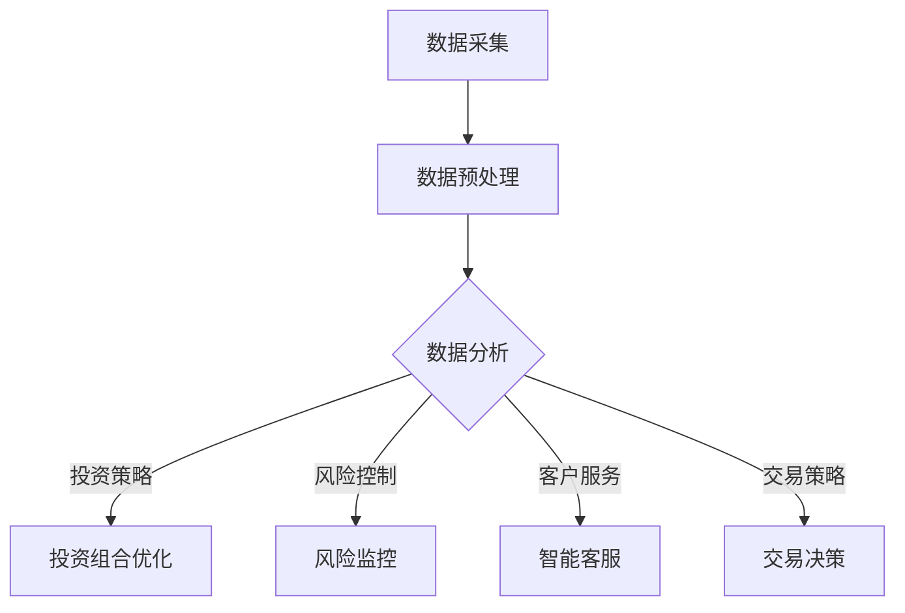
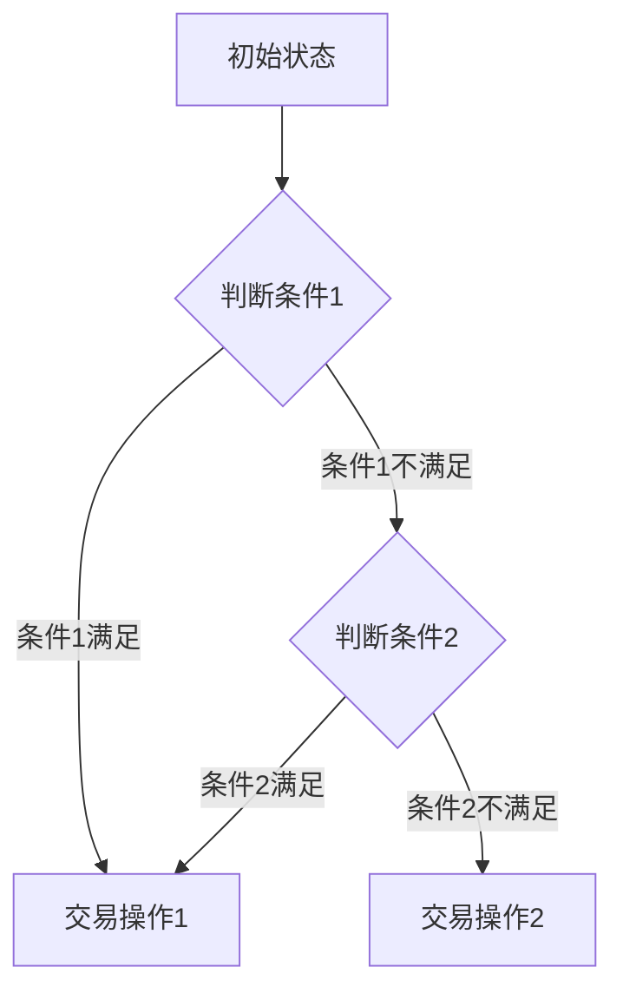

                 

# 金融领域的AI搜索应用

> 关键词：金融，人工智能，搜索应用，数据分析，投资策略，风险控制

> 摘要：随着人工智能技术的快速发展，其在金融领域的应用逐渐深入。本文将探讨AI搜索技术在金融领域的应用，包括投资策略、风险控制和数据分析等方面，分析其优势与挑战，并展望未来发展趋势。

## 1. 背景介绍

近年来，人工智能技术在全球范围内得到了广泛关注。特别是在金融领域，人工智能的应用已经成为一种趋势。通过利用大数据、机器学习和深度学习等技术，AI搜索应用在金融领域发挥了巨大的作用，提高了金融决策的效率和质量。

金融领域的AI搜索应用主要包括以下几个方面：

1. **投资策略优化**：利用AI技术对大量市场数据进行分析，以发现潜在的投资机会，优化投资组合，降低风险。

2. **风险控制**：通过AI技术对市场风险进行实时监控，及时发现并应对市场变化，降低风险。

3. **客户服务**：利用自然语言处理技术，提供智能客服，提高客户满意度。

4. **交易策略**：利用AI技术对市场数据进行实时分析，生成交易策略，提高交易效率。

## 2. 核心概念与联系

### 2.1 数据分析

数据分析是金融领域AI搜索应用的基础。通过对历史数据和实时数据的分析，可以提取出有价值的洞察，为投资决策提供支持。常用的数据分析方法包括：

- **时间序列分析**：用于分析市场走势和预测未来价格。

- **分类与聚类**：用于识别市场中的不同群体和模式。

- **回归分析**：用于预测市场变量之间的关系。

### 2.2 机器学习

机器学习是AI搜索应用的核心技术。通过训练模型，机器学习算法可以从数据中自动学习并提取模式，从而实现智能决策。在金融领域，常用的机器学习方法包括：

- **监督学习**：通过已知的输入和输出数据训练模型，预测未知数据。

- **无监督学习**：通过分析未标记的数据，发现数据中的模式。

- **强化学习**：通过试错和反馈，优化决策策略。

### 2.3 深度学习

深度学习是机器学习的一个分支，通过多层神经网络模拟人脑的学习过程，实现复杂模式的自动提取。在金融领域，深度学习技术被广泛应用于：

- **图像识别**：用于识别金融图表和市场走势。

- **自然语言处理**：用于处理金融文本数据，如新闻、报告等。

### 2.4 Mermaid 流程图

下面是一个简单的Mermaid流程图，展示了金融领域AI搜索应用的核心概念和流程：



## 3. 核心算法原理 & 具体操作步骤

### 3.1 投资策略优化

投资策略优化是金融领域AI搜索应用的一个重要方面。具体操作步骤如下：

1. **数据采集**：收集历史市场数据、公司财务报表等。

2. **数据预处理**：清洗和格式化数据，为后续分析做准备。

3. **特征提取**：从原始数据中提取有助于预测的关键特征。

4. **模型训练**：利用历史数据训练机器学习模型，如线性回归、支持向量机等。

5. **模型评估**：使用验证集评估模型性能，调整模型参数。

6. **投资决策**：根据模型预测，生成投资组合。

7. **回测与优化**：在历史数据上回测策略，优化策略参数。

### 3.2 风险控制

风险控制是金融领域AI搜索应用的另一个重要方面。具体操作步骤如下：

1. **数据采集**：收集市场数据、信用评级、宏观经济指标等。

2. **数据预处理**：清洗和格式化数据，为后续分析做准备。

3. **风险指标计算**：计算各种风险指标，如波动率、违约概率等。

4. **风险建模**：利用机器学习技术建立风险模型。

5. **风险监控**：实时监控市场变化，评估风险。

6. **风险预警**：根据风险模型，生成风险预警信号。

7. **风险应对**：根据风险预警信号，采取相应的风险应对措施。

### 3.3 客户服务

客户服务是金融领域AI搜索应用的又一重要方面。具体操作步骤如下：

1. **数据采集**：收集客户互动数据，如客服聊天记录、交易记录等。

2. **数据预处理**：清洗和格式化数据，为后续分析做准备。

3. **自然语言处理**：使用自然语言处理技术，解析客户问题。

4. **智能客服生成**：根据解析结果，生成智能客服回答。

5. **交互优化**：根据客户反馈，优化智能客服回答。

6. **个性化推荐**：根据客户偏好，推荐相关产品和服务。

### 3.4 交易策略

交易策略是金融领域AI搜索应用的最后一环。具体操作步骤如下：

1. **数据采集**：收集市场数据、技术指标等。

2. **数据预处理**：清洗和格式化数据，为后续分析做准备。

3. **交易信号生成**：利用技术指标，生成交易信号。

4. **交易策略生成**：根据交易信号，生成交易策略。

5. **策略评估**：评估交易策略的性能。

6. **策略优化**：根据评估结果，优化交易策略。

7. **执行交易**：根据优化后的策略，执行交易操作。

## 4. 数学模型和公式 & 详细讲解 & 举例说明

### 4.1 投资策略优化

投资策略优化的核心是资产定价模型。下面是一个简化的CAPM（资本资产定价模型）：

$$
E(R_i) = \alpha_i + \beta_i \cdot \sigma_m^2
$$

其中，$E(R_i)$ 表示资产 $i$ 的预期收益率，$\alpha_i$ 表示资产 $i$ 的风险溢价，$\beta_i$ 表示资产 $i$ 对市场收益的敏感度，$\sigma_m^2$ 表示市场收益的方差。

举例说明：假设市场预期收益率为 $10\%$，市场收益的方差为 $0.02$，一个股票的 $\beta$ 值为 $1.5$，求该股票的预期收益率。

解：代入公式得：

$$
E(R_i) = \alpha_i + 1.5 \cdot 0.02 = 0.02 + 0.03 = 0.05
$$

所以该股票的预期收益率为 $5\%$。

### 4.2 风险控制

风险控制的核心是风险度量。下面是一个常用的风险度量指标——价值在风险（Value at Risk，VaR）：

$$
VaR = F^{-1}(1 - \alpha) \cdot \sigma
$$

其中，$F$ 是累积分布函数，$\alpha$ 是置信水平，$\sigma$ 是资产收益的标准差。

举例说明：假设资产收益的累积分布函数为正态分布，置信水平为 $95\%$，资产收益的标准差为 $0.1$，求该资产的 $95\%$ 置信水平的 VaR。

解：代入公式得：

$$
VaR = F^{-1}(0.05) \cdot 0.1 = 0.1 \cdot 0.1 = 0.01
$$

所以该资产的 $95\%$ 置信水平的 VaR 为 $0.01$。

### 4.3 客户服务

客户服务的核心是自然语言处理。下面是一个简单的情感分析模型——朴素贝叶斯分类器：

$$
P(C|X) = \frac{P(X|C) \cdot P(C)}{P(X)}
$$

其中，$C$ 表示类别，$X$ 表示特征向量，$P(C|X)$ 表示给定特征向量 $X$ 的类别 $C$ 的概率，$P(X|C)$ 表示给定类别 $C$ 的特征向量 $X$ 的概率，$P(C)$ 表示类别 $C$ 的概率，$P(X)$ 表示特征向量 $X$ 的概率。

举例说明：假设有如下数据：

| 类别 | 特征1 | 特征2 | 特征3 |
| ---- | ---- | ---- | ---- |
| 正面 | 0.8  | 0.6  | 0.4  |
| 负面 | 0.2  | 0.4  | 0.6  |

给定特征向量 $X = (0.7, 0.5, 0.3)$，求类别正面的概率。

解：代入公式得：

$$
P(C=正面|X) = \frac{P(X|C=正面) \cdot P(C=正面)}{P(X)}
$$

计算得：

$$
P(X|C=正面) = 0.8 \cdot 0.6 \cdot 0.4 = 0.192
$$

$$
P(C=正面) = 0.8
$$

$$
P(X) = P(X|C=正面) \cdot P(C=正面) + P(X|C=负面) \cdot P(C=负面) = 0.192 \cdot 0.8 + 0.2 \cdot 0.4 = 0.384 + 0.08 = 0.464
$$

$$
P(C=正面|X) = \frac{0.192 \cdot 0.8}{0.464} = 0.324
$$

所以给定特征向量 $X = (0.7, 0.5, 0.3)$ 时，类别正面的概率为 $0.324$。

### 4.4 交易策略

交易策略的核心是决策树模型。下面是一个简单的决策树模型：



举例说明：假设有两个交易条件：

- 条件1：如果市场波动率大于 $10\%$，则交易操作1。
- 条件2：如果公司基本面良好，则交易操作2。

给定当前市场波动率为 $12\%$，公司基本面良好，求交易策略。

解：根据决策树模型，首先判断条件1，由于市场波动率大于 $10\%$，所以条件1满足，执行交易操作1。

## 5. 项目实战：代码实际案例和详细解释说明

### 5.1 开发环境搭建

为了演示金融领域AI搜索应用，我们将使用Python作为主要编程语言，并依赖以下库：

- **NumPy**：用于数值计算。
- **Pandas**：用于数据处理。
- **Scikit-learn**：用于机器学习。
- **Matplotlib**：用于数据可视化。
- **TensorFlow**：用于深度学习。

安装这些库后，开发环境搭建完成。

### 5.2 源代码详细实现和代码解读

下面是一个简单的Python代码示例，展示了金融领域AI搜索应用的基本流程。

```python
import numpy as np
import pandas as pd
from sklearn.linear_model import LinearRegression
from sklearn.model_selection import train_test_split
from sklearn.metrics import mean_squared_error
import matplotlib.pyplot as plt

# 5.2.1 数据采集
# 假设我们已经有了一个包含历史市场数据的CSV文件，文件名为data.csv
data = pd.read_csv('data.csv')

# 5.2.2 数据预处理
# 数据清洗和特征提取
data['Open'] = data['Open'].fillna(data['Open'].mean())
data['Close'] = data['Close'].fillna(data['Close'].mean())
data['Volume'] = data['Volume'].fillna(0)

# 提取特征
data['MA5'] = data['Close'].rolling(window=5).mean()
data['MA20'] = data['Close'].rolling(window=20).mean()

# 5.2.3 模型训练
# 将数据分为特征和标签
X = data[['MA5', 'MA20']]
y = data['Close']

# 分割训练集和测试集
X_train, X_test, y_train, y_test = train_test_split(X, y, test_size=0.2, random_state=42)

# 训练线性回归模型
model = LinearRegression()
model.fit(X_train, y_train)

# 5.2.4 模型评估
y_pred = model.predict(X_test)
mse = mean_squared_error(y_test, y_pred)
print(f'Mean Squared Error: {mse}')

# 5.2.5 数据可视化
plt.scatter(X_test['MA5'], y_pred)
plt.xlabel('MA5')
plt.ylabel('Predicted Close')
plt.show()
```

### 5.3 代码解读与分析

- **5.3.1 数据采集**：从CSV文件中读取数据。
- **5.3.2 数据预处理**：处理缺失值，提取特征。
- **5.3.3 模型训练**：使用线性回归模型训练数据。
- **5.3.4 模型评估**：计算均方误差，评估模型性能。
- **5.3.5 数据可视化**：绘制散点图，展示预测结果。

这个示例代码展示了金融领域AI搜索应用的基本流程，虽然它是一个简单的线性回归模型，但为我们提供了一个参考框架，可以在实际应用中进行扩展和优化。

## 6. 实际应用场景

金融领域的AI搜索应用已经广泛应用于多个场景，以下是一些典型的实际应用场景：

1. **高频交易**：利用AI技术进行高频交易，通过实时数据分析和快速决策，实现高额利润。

2. **量化投资**：利用机器学习算法，从海量数据中挖掘潜在的投资机会，构建量化投资策略。

3. **风险控制**：利用AI技术进行实时风险监控，识别市场风险，优化投资组合。

4. **智能投顾**：通过分析用户偏好和风险承受能力，为用户提供个性化的投资建议。

5. **金融欺诈检测**：利用AI技术检测金融欺诈行为，提高交易安全。

6. **金融知识图谱**：构建金融知识图谱，实现金融信息的高效搜索和推荐。

## 7. 工具和资源推荐

### 7.1 学习资源推荐

- **书籍**：
  - 《人工智能：一种现代方法》（M. Mitchell）
  - 《Python机器学习》（S. Raschka）
  - 《深度学习》（I. Goodfellow et al.）

- **论文**：
  - 《一种高效的前向网络》（Y. LeCun et al.）
  - 《深度置信网络》（G. Hinton）
  - 《自然语言处理综论》（D. Jurafsky & J. Martin）

- **博客/网站**：
  - [机器学习 Mastery](https://machinelearningmastery.com/)
  - [深度学习博客](http://www.deeplearning.net/)
  - [量化投资博客](https://quant investing blog.com/)

### 7.2 开发工具框架推荐

- **开发环境**：Jupyter Notebook、PyCharm、Visual Studio Code
- **机器学习库**：Scikit-learn、TensorFlow、PyTorch
- **数据处理库**：Pandas、NumPy
- **可视化工具**：Matplotlib、Seaborn、Plotly

### 7.3 相关论文著作推荐

- **《人工智能：一种现代方法》**：全面介绍了人工智能的基础理论和应用方法。
- **《深度学习》**：深入讲解了深度学习的基本原理和实战技巧。
- **《量化投资：技术分析+基本面分析+机器学习》**：结合了量化投资的各种方法和技术。

## 8. 总结：未来发展趋势与挑战

金融领域的AI搜索应用正迅速发展，但仍面临一些挑战：

1. **数据隐私与安全**：随着数据量的增加，保护用户隐私和数据安全成为重要议题。
2. **模型解释性**：提高模型的解释性，使决策过程更加透明和可信。
3. **算法透明度**：确保算法公平、无偏见，避免歧视性决策。
4. **监管合规**：遵守相关法规和标准，确保AI技术的合法合规。

未来，金融领域的AI搜索应用将继续发展，结合更多新技术，如区块链、边缘计算等，为金融行业带来更多创新和变革。

## 9. 附录：常见问题与解答

### 9.1 如何处理金融数据？

**答**：处理金融数据时，需要注意以下方面：

- 数据清洗：处理缺失值、异常值和重复数据。
- 特征提取：从原始数据中提取有价值的信息。
- 数据标准化：将不同特征的范围统一，便于模型训练。

### 9.2 AI搜索应用在金融领域有哪些挑战？

**答**：AI搜索应用在金融领域面临的主要挑战包括：

- 数据隐私与安全：保护用户隐私和数据安全。
- 模型解释性：提高模型的可解释性，确保决策过程透明。
- 算法透明度：确保算法公平、无偏见。
- 监管合规：遵守相关法规和标准，确保AI技术的合法合规。

### 9.3 如何评估AI搜索应用的效果？

**答**：评估AI搜索应用的效果可以从以下几个方面进行：

- 准确率：预测结果与实际结果的匹配程度。
- 召回率：识别出真正有价值的投资机会。
- 回测结果：在历史数据上验证策略的有效性。
- 实际收益：在实战中验证策略的实际效果。

## 10. 扩展阅读 & 参考资料

- **《机器学习实战》**：提供大量的实战案例，帮助读者理解并应用机器学习技术。
- **《深度学习实践》**：详细介绍了深度学习的基本原理和实践方法。
- **《量化投资：从理论到实践》**：系统地介绍了量化投资的理论和实践方法。
- **《金融技术：理论与实践》**：探讨金融技术与传统金融理论的结合与应用。

