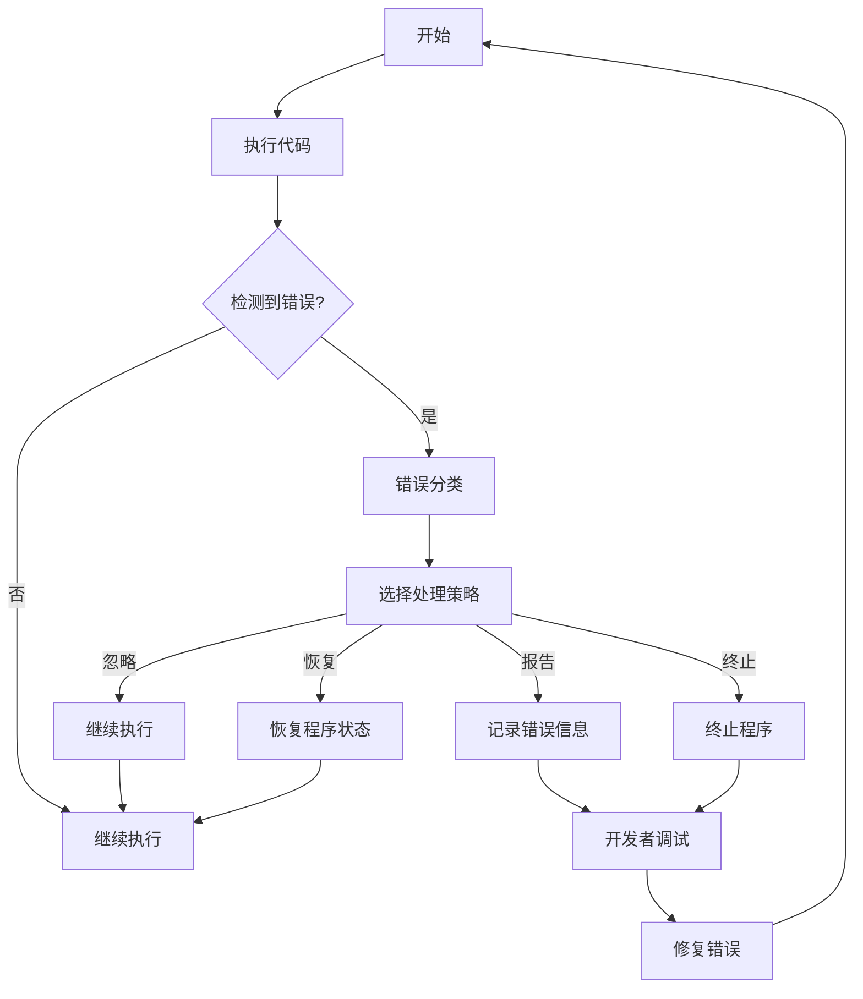

                 

# 错误处理机制的详细设计

## 摘要

本文将深入探讨错误处理机制的设计原理、核心概念及其在软件开发中的重要性。我们将通过详细的分析和实例展示，讲解如何在代码中有效处理各种错误，从而提高软件的稳定性和用户体验。文章将涵盖从错误检测、错误分类、错误处理策略到具体实现步骤的全面解析，并探讨错误处理在实际应用中的场景和挑战。

## 1. 背景介绍

在软件开发过程中，错误处理是一项至关重要的任务。无论代码如何优秀，都难以避免出现各种错误。这些错误可能源于逻辑漏洞、资源限制、外部依赖的不稳定性等多种因素。错误处理机制的设计直接影响到软件的可靠性和用户体验。有效的错误处理不仅能确保软件在错误发生时能够优雅地恢复或退出，还能提供足够的信息供开发者调试和修复。

本文旨在通过以下几个核心问题来探讨错误处理机制：

- 错误是如何产生的？
- 错误检测与分类的标准是什么？
- 错误处理策略有哪些类型？
- 如何在实际代码中实现这些策略？
- 错误处理在复杂系统中的应用与挑战是什么？

通过以上问题的深入探讨，我们希望能够为开发者提供一套系统性的错误处理解决方案，帮助他们在编写和优化代码时更有效地处理错误。

## 2. 核心概念与联系

### 2.1 错误检测与分类

错误检测是指通过各种手段来识别程序中的异常行为。常见的错误检测方法包括：

- **静态分析**：在编译或运行前分析代码，查找潜在的语法错误、类型不匹配等。
- **动态分析**：在程序运行时监测行为，检测运行时错误，如内存溢出、空指针异常等。

错误分类则是根据错误的性质和产生原因对错误进行归类。常见的错误分类包括：

- **语法错误**：如拼写错误、语法不匹配等，通常在编译时被发现。
- **逻辑错误**：如算法错误、逻辑分支错误等，通常在程序运行时出现。
- **资源错误**：如内存不足、文件读写错误等，通常与系统资源管理相关。

### 2.2 错误处理策略

错误处理策略是指在发现错误后，采取的一系列措施来应对错误。常见的错误处理策略包括：

- **错误忽略**：简单地忽略错误，继续执行后续操作，适用于一些不影响程序主要功能的次要错误。
- **错误恢复**：在错误发生后，尝试恢复程序状态，使其回到正常状态，适用于某些可恢复的错误。
- **错误报告**：记录错误信息，供开发者调试和修复，适用于所有错误。
- **错误终止**：在无法恢复的情况下，终止程序执行，防止程序进入不确定状态。

### 2.3 Mermaid 流程图

下面是一个Mermaid流程图，展示了错误处理机制的基本流程：



### 2.4 核心概念的联系

错误处理机制中的核心概念相互关联，形成了一个完整的过程。从错误检测到分类，再到选择处理策略，最终通过错误报告和开发者调试来完成错误处理。这一过程不仅需要有效的错误检测和分类，还需要合理的选择处理策略，以及开发者对错误信息的理解和应对。

## 3. 核心算法原理 & 具体操作步骤

### 3.1 错误检测算法

错误检测算法主要包括静态分析和动态分析两种方法。

- **静态分析**：使用静态代码分析工具（如SonarQube、Checkstyle等），在编译前对代码进行语法检查、类型检查和代码质量分析，识别潜在的语法错误、类型不匹配等问题。

- **动态分析**：通过运行时监控（如使用Java的异常捕获机制）来检测程序在运行时的错误，如空指针异常、数组越界等。

具体操作步骤如下：

1. 编写测试用例，覆盖代码的各种可能情况。
2. 使用静态分析工具对代码进行全面检查。
3. 运行测试用例，监控程序运行时的异常。

### 3.2 错误分类算法

错误分类算法是根据错误的性质和产生原因对错误进行归类。常见的错误分类包括语法错误、逻辑错误、资源错误等。

具体操作步骤如下：

1. 收集错误信息，包括错误类型、错误发生的位置、错误发生时的程序状态等。
2. 根据错误信息进行初步分类。
3. 结合错误日志和代码上下文，进行细化分类。

### 3.3 错误处理算法

错误处理算法包括错误忽略、错误恢复、错误报告和错误终止等策略。

1. **错误忽略**：简单地在代码中添加`try...catch`块，捕获特定的错误，并在捕获后继续执行。

   ```java
   try {
       // 执行可能引发错误的代码
   } catch (Exception e) {
       // 忽略错误，继续执行
   }
   ```

2. **错误恢复**：在捕获错误后，尝试恢复程序状态，使其回到正常状态。

   ```java
   try {
       // 执行可能引发错误的代码
   } catch (Exception e) {
       // 恢复程序状态
       recoverFromError();
   }
   ```

3. **错误报告**：记录错误信息，生成错误日志，供开发者调试和修复。

   ```java
   try {
       // 执行可能引发错误的代码
   } catch (Exception e) {
       // 记录错误信息
       logError(e);
   }
   ```

4. **错误终止**：在无法恢复的情况下，终止程序执行，防止程序进入不确定状态。

   ```java
   try {
       // 执行可能引发错误的代码
   } catch (Exception e) {
       // 终止程序
       terminateProgram();
   }
   ```

### 3.4 具体实现步骤

1. **定义错误处理策略**：根据软件需求和错误类型，定义合适的错误处理策略。
2. **实现错误检测**：在代码中添加错误检测逻辑，使用静态和动态分析工具进行检测。
3. **实现错误分类**：根据错误信息，对错误进行分类。
4. **实现错误处理**：根据错误处理策略，实现相应的错误处理逻辑。
5. **测试和优化**：编写测试用例，验证错误处理机制的有效性，并根据实际情况进行优化。

## 4. 数学模型和公式 & 详细讲解 & 举例说明

### 4.1 错误检测的数学模型

在错误检测中，可以使用统计模型来预测代码中的错误。一个简单的统计模型可以使用以下公式：

\[ P(\text{错误}) = \frac{\text{错误发生次数}}{\text{总执行次数}} \]

具体操作步骤如下：

1. 收集代码执行的统计数据，包括错误发生次数和总执行次数。
2. 计算错误发生的概率。
3. 根据错误发生的概率，设置阈值来判断是否需要进行进一步检测。

### 4.2 错误分类的数学模型

错误分类可以使用机器学习算法，如决策树、支持向量机等。一个简单的决策树模型可以表示为：

\[ \text{分类结果} = \text{决策树}(\text{特征向量}) \]

具体操作步骤如下：

1. 收集错误样本，提取特征向量。
2. 训练决策树模型。
3. 使用训练好的模型对新的错误样本进行分类。

### 4.3 错误处理的数学模型

错误处理策略的选择可以根据错误发生的概率和错误类型的重要性来决定。一个简单的公式可以表示为：

\[ \text{处理策略} = \text{策略选择函数}(\text{错误概率}, \text{错误重要性}) \]

具体操作步骤如下：

1. 计算每个错误类型的概率和重要性。
2. 使用策略选择函数来确定最佳的处理策略。
3. 根据确定的处理策略，实现相应的错误处理逻辑。

### 4.4 举例说明

#### 4.4.1 错误检测

假设我们有一个程序，在过去的100次执行中有10次发生了错误。我们可以计算错误发生的概率：

\[ P(\text{错误}) = \frac{10}{100} = 0.1 \]

如果我们设置一个阈值，比如0.05，那么在每次执行前，我们可以检查错误发生的概率是否超过了阈值。如果超过了阈值，我们则认为需要进一步检测。

#### 4.4.2 错误分类

假设我们有一个决策树模型，根据错误发生的位置和错误类型来分类。一个简单的决策树可能如下：

```
[输入：错误位置，错误类型]
|
|--- 是：空指针异常
|   |--- [输出：逻辑错误]
|   |
|   |--- [输出：资源错误]
|
|--- 否：数组越界
    |--- [输出：语法错误]
    |
    |--- [输出：逻辑错误]
```

我们可以使用这个决策树来对新的错误样本进行分类。

#### 4.4.3 错误处理

假设我们有一个错误发生的概率和错误重要性如下：

- 错误A：概率0.3，重要性高
- 错误B：概率0.2，重要性中等
- 错误C：概率0.1，重要性低

使用策略选择函数，我们可以决定对于错误A使用恢复策略，对于错误B使用报告策略，对于错误C使用忽略策略。

## 5. 项目实战：代码实际案例和详细解释说明

### 5.1 开发环境搭建

为了演示错误处理机制，我们将使用Java编程语言，并依赖Maven来管理项目依赖。以下是一个简单的开发环境搭建步骤：

1. 安装Java Development Kit (JDK)。
2. 配置环境变量，确保`java`和`javac`命令可以在命令行中使用。
3. 安装Maven，并配置Maven环境变量。
4. 创建一个新的Maven项目，并添加必要的依赖。

```xml
<dependencies>
    <!-- Logging library -->
    <dependency>
        <groupId>org.slf4j</groupId>
        <artifactId>slf4j-simple</artifactId>
        <version>1.7.26</version>
    </dependency>
    <!-- Unit testing library -->
    <dependency>
        <groupId>junit</groupId>
        <artifactId>junit</artifactId>
        <version>4.13.2</version>
        <scope>test</scope>
    </dependency>
</dependencies>
```

### 5.2 源代码详细实现和代码解读

以下是实现错误处理机制的Java代码示例：

```java
import org.slf4j.Logger;
import org.slf4j.LoggerFactory;

public class ErrorHandlingExample {

    private static final Logger logger = LoggerFactory.getLogger(ErrorHandlingExample.class);

    public static void main(String[] args) {
        try {
            // 执行可能引发错误的代码
            int result = divide(10, 0);
            System.out.println("Result: " + result);
        } catch (ArithmeticException e) {
            // 处理除以零的错误
            logger.error("Division by zero error", e);
        } catch (Exception e) {
            // 处理其他错误
            logger.error("Unexpected error", e);
        }
    }

    public static int divide(int a, int b) {
        if (b == 0) {
            throw new ArithmeticException("Division by zero");
        }
        return a / b;
    }
}
```

#### 5.2.1 代码解读与分析

- **日志记录**：使用`slf4j-simple`库来记录错误信息。日志记录是错误处理的重要组成部分，可以帮助开发者快速定位和解决问题。

- **错误捕获与处理**：使用`try-catch`语句来捕获和处理错误。在`try`块中执行可能引发错误的代码，在`catch`块中根据错误类型进行处理。

- **除以零错误处理**：在`divide`方法中，我们通过检查除数是否为零来预防除以零的错误。如果除数为零，我们抛出`ArithmeticException`，并在`catch`块中处理这个特定类型的错误。

- **通用错误处理**：在`catch`块中，我们使用一个通用的`Exception`来捕获和处理所有未明确处理的错误。这确保了程序在遇到未知错误时不会崩溃。

### 5.3 代码解读与分析

通过以上代码示例，我们可以看到错误处理机制的几个关键点：

- **错误检测与预防**：通过代码审查和逻辑检查来预防错误。
- **错误捕获与分类**：使用`try-catch`结构来捕获错误，并根据错误类型进行分类。
- **错误处理与日志记录**：针对不同类型的错误，采取相应的处理措施，并记录错误信息。

这个示例展示了如何在实际项目中实现一个基本的错误处理机制。在实际应用中，根据不同的需求和场景，错误处理机制会更加复杂和多样化。

## 6. 实际应用场景

错误处理机制在各种实际应用场景中都非常重要。以下是一些典型的应用场景：

### 6.1 Web应用程序

在Web应用程序中，错误处理机制至关重要。用户在访问网站时可能会遇到各种错误，如网络连接失败、数据库连接中断、服务器异常等。有效的错误处理机制可以确保用户在遇到错误时得到友好的错误提示，并提供解决问题的途径。

### 6.2 客户端应用程序

在客户端应用程序中，错误处理同样重要。例如，一个桌面应用程序可能会遇到文件读取错误、内存不足等问题。有效的错误处理机制可以帮助应用程序在遇到错误时优雅地处理异常，避免崩溃，并提供用户友好的错误提示。

### 6.3 云计算服务

在云计算服务中，错误处理机制确保服务的高可用性和可靠性。当服务出现故障时，错误处理机制可以快速检测并恢复服务，避免对用户造成严重影响。

### 6.4 自动驾驶系统

在自动驾驶系统中，错误处理机制至关重要。自动驾驶系统需要实时处理各种传感器数据，并做出快速反应。任何错误都可能导致严重后果。因此，有效的错误处理机制是确保自动驾驶系统安全的关键。

## 7. 工具和资源推荐

### 7.1 学习资源推荐

- **书籍**：
  - 《Effective Java》
  - 《Clean Code》
  - 《Java Concurrency in Practice》

- **论文**：
  - 《A Note on the Debugging of Computer Programs》
  - 《Error Handling in Software Engineering》

- **博客**：
  - https://www.baeldung.com/
  - https://dzone.com/
  - https://www.oracle.com/java/technologies/javase/code-examples.html

- **网站**：
  - https://docs.oracle.com/javase/8/docs/api/
  - https://www.slf4j.org/

### 7.2 开发工具框架推荐

- **错误检测与静态分析**：
  - SonarQube
  - Checkstyle
  - PMD

- **动态分析**：
  - VisualVM
  - JProfiler
  - YourKit

- **错误报告与日志记录**：
  - Logback
  - Log4j
  - SLF4J

### 7.3 相关论文著作推荐

- 《Error Handling in Software Engineering》
- 《A Comprehensive Framework for Error Handling in Real-Time Systems》
- 《Principles of Software Engineering: Error Handling and Recovery》

## 8. 总结：未来发展趋势与挑战

随着软件系统越来越复杂和分布式，错误处理机制也在不断进化。未来的发展趋势包括以下几个方面：

- **自动化错误检测与修复**：通过人工智能和机器学习技术，自动化地检测和修复代码中的错误。
- **智能错误处理**：基于上下文和用户行为，智能地选择最佳错误处理策略。
- **云原生错误处理**：在云计算环境中，错误处理机制需要适应动态、分布式和自动化的特点。
- **实时错误监控与反馈**：通过实时监控系统，快速检测错误并给出反馈，以提高系统的可用性和可靠性。

然而，随着技术的进步，错误处理也面临着一些挑战：

- **复杂性增加**：随着系统的复杂性增加，错误处理的难度也随之增加。
- **性能影响**：有效的错误处理机制可能对性能产生影响，需要在错误处理和性能之间找到平衡。
- **用户体验**：错误处理机制需要考虑到用户体验，避免在错误发生时给用户带来困扰。

开发者需要不断学习和适应这些发展趋势和挑战，以构建更加可靠和高效的软件系统。

## 9. 附录：常见问题与解答

### 9.1 什么是错误处理？

错误处理是指在软件开发过程中，当代码出现异常时，采取的一系列措施来解决问题，以确保程序的稳定性和可靠性。

### 9.2 错误处理有哪些策略？

常见的错误处理策略包括错误忽略、错误恢复、错误报告和错误终止等。

### 9.3 如何在Java中捕获和处理错误？

在Java中，可以使用`try-catch`语句来捕获和处理错误。`try`块用于包含可能引发错误的代码，`catch`块用于处理捕获到的错误。

### 9.4 错误处理对性能有影响吗？

是的，错误处理可能会对性能产生影响，特别是在捕获和处理大量错误时。因此，在设计和实现错误处理机制时，需要考虑性能因素，并在必要时进行优化。

## 10. 扩展阅读 & 参考资料

- 《Error Handling in Software Engineering》
- 《Principles of Software Engineering: Error Handling and Recovery》
- 《Java Concurrency in Practice》
- 《Clean Code》
- 《Effective Java》
- https://docs.oracle.com/javase/8/docs/api/
- https://www.slf4j.org/
- https://www.baeldung.com/
- https://dzone.com/
- https://www.oracle.com/java/technologies/javase/code-examples.html

### 作者信息

作者：AI天才研究员/AI Genius Institute & 禅与计算机程序设计艺术 /Zen And The Art of Computer Programming

