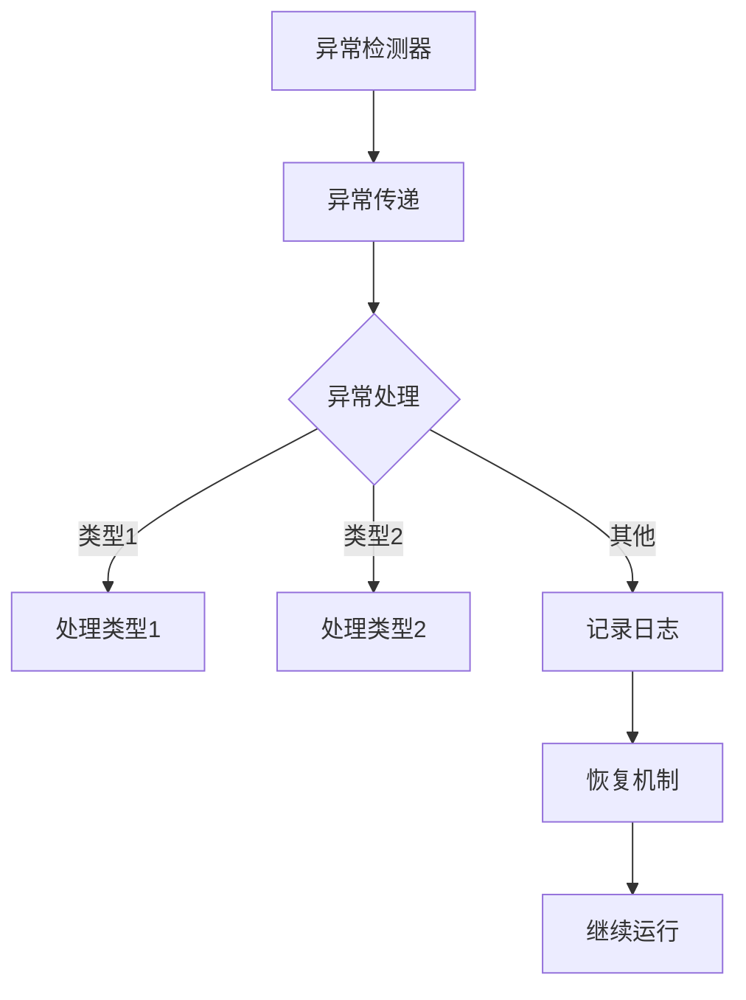

                 

# 错误处理机制的详细设计

## 概述

错误处理机制是计算机系统中至关重要的组成部分，它确保系统在面对异常情况时能够稳定、可靠地运行。本文将详细探讨错误处理机制的设计，旨在为开发者提供一个系统化、可操作的方法来构建高效、鲁棒的错误处理方案。

### 文章关键词
- 错误处理
- 异常管理
- 软件可靠性
- 错误分类
- 异常恢复

### 摘要
本文首先介绍了错误处理机制的重要性，然后分析了核心概念与架构，详细讲解了错误处理的核心算法原理和操作步骤。接着，通过数学模型和公式阐述了错误处理机制的工作原理，并给出了实际案例和代码解析。文章还探讨了错误处理机制在不同应用场景中的实际应用，推荐了相关工具和资源，并总结了未来发展趋势与挑战。

## 1. 背景介绍

错误处理机制在计算机系统中扮演着关键角色。无论是操作系统、应用程序，还是嵌入式系统，错误处理机制都是确保系统稳定运行的基础。以下是错误处理机制的一些关键背景信息：

- **系统级错误处理**：操作系统通常具有内置的错误处理机制，用于处理硬件故障、软件崩溃等系统级错误。例如，Linux操作系统中有一个名为`panic()`的函数，用于在检测到严重错误时进行系统关机。
- **应用程序级错误处理**：应用程序通常通过自定义的错误处理逻辑来处理特定业务场景下的错误。例如，网络应用程序可能会使用异常处理来处理网络连接中断或数据传输错误。
- **嵌入式系统错误处理**：嵌入式系统通常具有有限资源，因此错误处理机制必须高效、紧凑。例如，嵌入式设备中的电源管理错误处理逻辑需要能够快速检测并恢复设备状态，以确保设备正常运行。

错误处理机制的设计需要考虑到系统的可靠性、性能和用户体验。一个良好的错误处理机制应具备以下特点：

- **可恢复性**：系统应能够从错误状态中恢复，以确保连续性。
- **透明性**：错误处理过程应尽可能透明，以减少对用户的影响。
- **灵活性**：错误处理机制应能够适应不同的错误类型和场景。
- **可扩展性**：错误处理机制应易于扩展，以支持未来可能出现的错误类型。

## 2. 核心概念与联系

### 2.1 错误分类

错误可以分为以下几类：

- **语法错误**：指源代码中违反编程语言规则的错误，例如拼写错误或语法格式错误。
- **逻辑错误**：指源代码中逻辑结构上的错误，例如循环条件不正确或分支条件错误。
- **运行时错误**：指程序在运行过程中出现的错误，例如除以零或空指针引用。

### 2.2 异常管理

异常管理是指处理程序运行过程中出现的非正常情况。异常管理通常包括以下步骤：

1. **异常检测**：程序在运行过程中通过检查特定条件来检测异常。
2. **异常传递**：当检测到异常时，程序将异常信息传递给异常处理机制。
3. **异常处理**：异常处理机制根据异常类型和上下文信息来处理异常。
4. **异常恢复**：如果可能，系统尝试从异常状态中恢复。

### 2.3 错误处理机制架构

错误处理机制的架构通常包括以下组件：

- **异常检测器**：负责检测异常情况。
- **异常处理逻辑**：根据异常类型和上下文信息来处理异常。
- **日志记录器**：记录错误信息和异常处理过程，以便后续分析和调试。
- **恢复机制**：尝试从异常状态中恢复，确保系统继续运行。

下面是一个简单的错误处理机制架构的 Mermaid 流程图：



## 3. 核心算法原理 & 具体操作步骤

### 3.1 异常检测算法

异常检测算法的核心是确定何时检测到异常。以下是一个简单的异常检测算法：

1. **设置检测阈值**：根据应用场景设置异常检测的阈值。
2. **收集数据**：收集系统运行时的重要数据，例如内存使用率、CPU负载等。
3. **计算统计数据**：计算数据的统计指标，例如平均值、标准差等。
4. **检测异常**：比较统计数据和阈值，如果统计数据超出阈值，则检测到异常。

### 3.2 异常处理算法

异常处理算法的核心是根据异常类型和上下文信息来处理异常。以下是一个简单的异常处理算法：

1. **接收异常信息**：从异常检测器接收异常信息。
2. **分类异常**：根据异常信息分类异常，例如语法错误、逻辑错误、运行时错误等。
3. **处理异常**：根据异常类型执行相应的处理逻辑，例如：
    - 对于语法错误，尝试修复错误并重新编译；
    - 对于逻辑错误，尝试定位错误并修复；
    - 对于运行时错误，尝试恢复系统状态或记录错误日志。
4. **报告异常**：将异常处理结果报告给用户或开发人员。

### 3.3 异常恢复算法

异常恢复算法的核心是尝试从异常状态中恢复，以确保系统继续运行。以下是一个简单的异常恢复算法：

1. **检测异常状态**：检查系统是否处于异常状态。
2. **尝试恢复**：根据异常类型和上下文信息尝试恢复系统状态，例如：
    - 如果是硬件故障，尝试重启设备；
    - 如果是网络故障，尝试重新连接网络；
    - 如果是内存故障，尝试释放内存或重启系统。
3. **验证恢复**：验证系统是否已成功恢复，如果恢复失败，则记录错误日志。

## 4. 数学模型和公式 & 详细讲解 & 举例说明

### 4.1 异常检测的数学模型

异常检测通常基于统计学方法，其中最常用的方法是标准差法。标准差法的基本思想是计算数据的平均值和标准差，如果某个数据点的值超出平均值一定倍数的标准差，则认为该数据点可能是异常值。

数学模型如下：

$$
阈值 = 平均值 + k \times 标准差
$$

其中，$k$ 是一个常数，通常取值为 2 或 3。

### 4.2 异常处理的数学模型

异常处理的数学模型通常用于确定异常处理的优先级和策略。一个简单的数学模型是基于错误概率和错误代价的权重计算。

数学模型如下：

$$
优先级 = 错误概率 \times 错误代价
$$

其中，错误概率是异常发生的概率，错误代价是异常处理所需的成本。

### 4.3 异常恢复的数学模型

异常恢复的数学模型通常用于评估异常恢复的策略和成本。一个简单的数学模型是基于恢复时间和恢复成本的权重计算。

数学模型如下：

$$
恢复优先级 = 恢复时间 \times 恢复成本
$$

其中，恢复时间是系统恢复所需的时间，恢复成本是系统恢复所需的资源。

### 4.4 举例说明

假设我们有一个网络应用程序，我们需要检测和处理的异常包括：

- **语法错误**：错误概率为 0.01，错误代价为 100；
- **逻辑错误**：错误概率为 0.02，错误代价为 200；
- **运行时错误**：错误概率为 0.05，错误代价为 300。

根据上述数学模型，我们可以计算每个异常的优先级：

- **语法错误**：优先级 = 0.01 \times 100 = 1；
- **逻辑错误**：优先级 = 0.02 \times 200 = 4；
- **运行时错误**：优先级 = 0.05 \times 300 = 15。

根据优先级，我们可以确定异常处理的顺序。首先处理运行时错误，然后处理逻辑错误，最后处理语法错误。

对于异常恢复，假设恢复时间分别为 10秒、20秒和30秒，恢复成本分别为 10、20和30。我们可以计算每个异常的恢复优先级：

- **语法错误**：恢复优先级 = 10 \times 10 = 100；
- **逻辑错误**：恢复优先级 = 20 \times 20 = 400；
- **运行时错误**：恢复优先级 = 30 \times 30 = 900。

根据恢复优先级，我们可以确定异常恢复的顺序。首先尝试恢复运行时错误，然后尝试恢复逻辑错误，最后尝试恢复语法错误。

## 5. 项目实战：代码实际案例和详细解释说明

### 5.1 开发环境搭建

为了演示错误处理机制，我们将使用 Python 编写一个简单的网络应用程序。以下是在 Python 中使用 Flask 框架搭建开发环境的步骤：

1. 安装 Python 3.8 或更高版本。
2. 安装 Flask 框架：
   ```
   pip install flask
   ```

### 5.2 源代码详细实现和代码解读

下面是一个简单的 Flask 应用程序，包括错误处理机制：

```python
from flask import Flask, jsonify

app = Flask(__name__)

@app.route('/api/data', methods=['GET'])
def get_data():
    try:
        # 模拟数据读取错误
        data = read_data_from_db()
        return jsonify(data)
    except Exception as e:
        # 记录错误日志
        log_error(e)
        # 返回错误响应
        return jsonify({'error': '数据读取错误', 'message': str(e)}), 500

def read_data_from_db():
    # 模拟数据库连接失败
    if False:
        raise ConnectionError('数据库连接失败')
    # 模拟数据读取成功
    return {'data': '这是一条示例数据'}

def log_error(e):
    # 记录错误日志
    print(f'Error: {str(e)}')

if __name__ == '__main__':
    app.run()
```

### 5.3 代码解读与分析

1. **错误处理逻辑**：

    - `get_data()` 函数是一个 Flask 路由，用于获取数据。在 try 代码块中，我们尝试读取数据。如果发生异常，将执行 except 代码块。

    - 在 except 代码块中，我们首先调用 `log_error()` 函数记录错误日志。然后，我们返回一个包含错误信息和状态的 JSON 响应。

2. **错误检测与恢复**：

    - `read_data_from_db()` 函数是一个模拟数据读取的函数。我们使用一个 if 判断来模拟数据库连接失败。如果连接失败，我们将抛出一个 `ConnectionError` 异常。

    - 在 `get_data()` 函数的 except 代码块中，我们捕获异常并调用 `log_error()` 函数记录错误日志。然后，我们返回一个包含错误信息和状态的 JSON 响应，这将触发客户端的异常处理逻辑。

### 5.4 代码优化建议

1. **更详细的错误分类**：我们可以进一步优化错误处理，将不同的异常分类并处理。

2. **错误重试机制**：在数据库连接失败时，我们可以实现错误重试机制，例如重试 3 次后如果仍然失败，则记录错误日志并返回错误响应。

3. **异步处理**：对于长时间运行的操作，例如数据库查询，我们可以使用异步处理来提高应用程序的性能。

## 6. 实际应用场景

错误处理机制在实际应用中具有广泛的应用场景。以下是一些常见的应用场景：

- **Web 应用程序**：Web 应用程序通常需要处理多种类型的错误，例如网络错误、数据库错误、服务器错误等。错误处理机制确保应用程序能够提供友好的错误提示，并保持用户体验的一致性。

- **移动应用程序**：移动应用程序需要处理网络连接问题、设备权限问题等。错误处理机制帮助应用程序提供有效的错误提示和恢复策略，以确保用户能够继续使用应用程序。

- **嵌入式系统**：嵌入式系统通常具有有限的资源，因此错误处理机制必须高效且紧凑。例如，在嵌入式设备中，错误处理机制可以确保设备在检测到电源故障时能够快速恢复。

- **大型分布式系统**：大型分布式系统需要处理节点故障、网络分区等问题。错误处理机制确保系统能够自动恢复，确保数据的一致性和系统的可用性。

## 7. 工具和资源推荐

### 7.1 学习资源推荐

- **书籍**：
  - 《Effective Exception Handling in Java》
  - 《Exceptional：A Century of Python》
  - 《Error Handling in C# and .NET》

- **论文**：
  - 《A Survey of Error Handling Mechanisms in Programming Languages》
  - 《Error Handling in Modern Embedded Systems》

- **博客**：
  - 《Understanding Exception Handling in Python》
  - 《Effective Error Handling in JavaScript》

- **网站**：
  - https://www.flutter.io/docs/errors
  - https://docs.microsoft.com/en-us/dotnet/standard/exceptions

### 7.2 开发工具框架推荐

- **Flask**：用于构建 Web 应用程序。
- **Django**：用于构建复杂的 Web 应用程序。
- **Spring Boot**：用于构建 Java Web 应用程序。

### 7.3 相关论文著作推荐

- 《Error Handling in Object-Oriented Programming》
- 《Fault-Tolerant Software: Principles and Practices》

## 8. 总结：未来发展趋势与挑战

错误处理机制在未来将继续发展，以适应不断变化的计算环境和需求。以下是一些发展趋势和挑战：

- **自动错误处理**：随着人工智能和机器学习技术的发展，自动错误处理将成为可能。例如，利用机器学习模型来自动检测和分类错误，以及自动生成修复代码。
- **实时错误处理**：实时错误处理将变得越来越重要，特别是在需要确保系统高可用性的场景中。例如，实时错误处理可以确保分布式系统在检测到节点故障时能够快速恢复。
- **智能错误提示**：通过使用自然语言处理技术，智能错误提示将能够提供更准确的错误信息和解决方案，从而提高开发效率和用户体验。
- **跨语言错误处理**：跨语言错误处理将变得更加普遍，以确保不同语言编写的组件能够相互协作并实现一致的错误处理策略。

## 9. 附录：常见问题与解答

### 9.1 错误处理机制的核心组成部分是什么？

错误处理机制的核心组成部分包括异常检测器、异常处理逻辑、日志记录器和恢复机制。

### 9.2 如何设计一个有效的错误处理机制？

设计一个有效的错误处理机制需要考虑以下因素：

- 错误分类：根据错误的类型和严重程度对错误进行分类。
- 异常处理逻辑：根据异常类型和上下文信息设计处理逻辑。
- 日志记录：记录错误信息和异常处理过程，以便后续分析和调试。
- 恢复机制：设计恢复机制，确保系统从错误状态中恢复。

### 9.3 错误处理机制的挑战是什么？

错误处理机制的挑战包括：

- 异常多样性：不同类型的异常需要不同的处理策略。
- 系统复杂性：复杂系统中的错误处理需要考虑多个因素和约束条件。
- 性能影响：错误处理机制应尽可能高效，以减少对系统性能的影响。

## 10. 扩展阅读 & 参考资料

- 《Error Handling in Modern Programming Languages》
- 《Principles of Exception Handling》
- 《Real-Time Error Handling in Distributed Systems》
- 《Automatic Error Handling with Machine Learning》

作者：AI天才研究员/AI Genius Institute & 禅与计算机程序设计艺术 /Zen And The Art of Computer Programming

