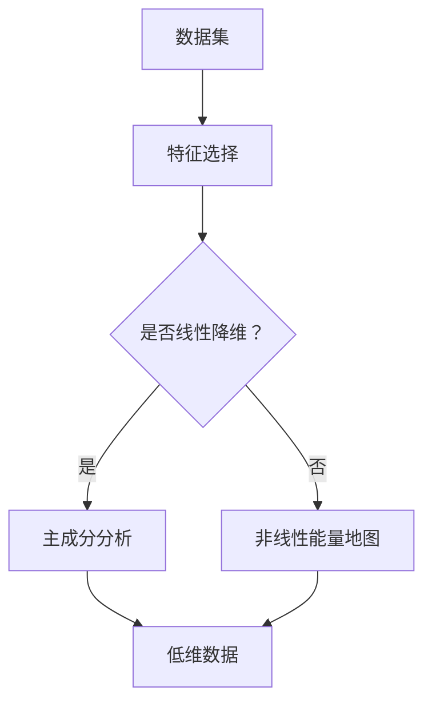

                 

# 降维 (Dimensionality Reduction) 原理与代码实例讲解

> **关键词：** 降维、维度、数据降维、特征选择、主成分分析、线性降维算法、非线性能量地图、代码实例、应用场景。

> **摘要：** 本文将深入探讨降维技术的基本概念、核心原理以及其在实际项目中的应用。通过数学模型、算法原理、代码实例等多角度的解析，帮助读者全面理解降维技术，掌握其在实际项目中的使用方法。

## 1. 背景介绍

在数据科学和机器学习领域，降维（Dimensionality Reduction）是一种常用的数据预处理技术。降维的主要目的是从高维数据中提取出最有用的信息，降低数据的维度，以便于后续的数据分析和建模。降维技术的应用场景非常广泛，包括图像处理、文本分类、推荐系统、社交网络分析等。

随着数据量的不断增长，高维数据带来的计算复杂度逐渐成为数据科学领域的一大挑战。高维数据不仅增加了存储和计算的负担，还可能导致过拟合（Overfitting）和模型性能下降。因此，降维技术成为提高模型性能和降低计算成本的重要手段。

降维技术可以分为线性降维和非线性降维两大类。线性降维主要包括主成分分析（PCA）、线性判别分析（LDA）等，适用于数据分布接近线性可分的情况。非线性降维则包括非线性能量地图（t-SNE）、局部线性嵌入（LLE）等，适用于数据分布复杂的场景。

本文将首先介绍降维技术的核心概念和原理，然后通过具体的数学模型和算法步骤进行讲解，最后通过代码实例展示降维技术在实际项目中的应用。

## 2. 核心概念与联系

降维技术的核心在于从高维数据中提取低维表示，保持数据的本质特征。为了更好地理解降维技术，我们需要了解以下几个关键概念：

### 2.1 数据维度

数据维度指的是数据集中的特征数量。高维数据通常意味着数据集包含大量特征，而低维数据则意味着数据集的特征数量较少。

### 2.2 特征选择

特征选择是从高维数据中挑选出最有用的特征的过程。特征选择不仅可以降低数据的维度，还可以提高模型的性能。

### 2.3 主成分分析（PCA）

主成分分析是一种线性降维技术，通过将高维数据投影到新的低维空间中，保持数据的最大方差。PCA的核心思想是找到一组新的正交基，使得数据在新的基上的投影方差最大。

### 2.4 线性能量地图（t-SNE）

线性能量地图是一种非线性降维技术，通过最小化在高维空间中的距离与在低维空间中的距离之间的差异，将高维数据可视化到二维或三维空间中。

### 2.5 局部线性嵌入（LLE）

局部线性嵌入是一种非线性降维技术，通过保留高维空间中近邻点之间的局部线性结构，将高维数据映射到低维空间中。

为了更好地理解这些概念，我们可以通过一个Mermaid流程图来展示降维技术的核心流程：



## 3. 核心算法原理 & 具体操作步骤

### 3.1 主成分分析（PCA）

主成分分析是一种线性降维技术，其核心思想是找到一组新的正交基，使得数据在新的基上的投影方差最大。具体操作步骤如下：

1. **标准化数据**：将每个特征缩放到相同的尺度，以便于计算方差。

2. **计算协方差矩阵**：协方差矩阵反映了各个特征之间的线性相关性。

3. **计算协方差矩阵的特征值和特征向量**：特征值表示特征的重要性，特征向量表示新的正交基。

4. **选取前k个最大的特征值对应的特征向量**：这些特征向量构成了新的正交基。

5. **数据投影**：将原始数据投影到新的正交基上，得到低维数据。

### 3.2 线性能量地图（t-SNE）

线性能量地图是一种非线性降维技术，其核心思想是找到一种映射方式，使得在高维空间中距离较近的数据点在低维空间中仍然保持较近的距离。具体操作步骤如下：

1. **初始化低维数据**：随机初始化低维数据。

2. **计算高维数据之间的距离**：使用欧几里得距离或其他距离度量方法计算高维数据之间的距离。

3. **计算低维数据之间的距离**：根据高维数据之间的距离，使用一种非线性函数计算低维数据之间的距离。

4. **计算梯度**：计算每个低维数据点的梯度，表示当前低维数据点与理想位置之间的偏差。

5. **更新低维数据**：根据梯度更新低维数据，使得低维数据点逐渐接近理想位置。

6. **迭代优化**：重复步骤4和5，直到收敛。

### 3.3 局部线性嵌入（LLE）

局部线性嵌入是一种非线性降维技术，其核心思想是保留高维空间中近邻点之间的局部线性结构。具体操作步骤如下：

1. **初始化低维数据**：随机初始化低维数据。

2. **计算高维数据点的近邻点**：使用高维数据点之间的距离计算每个数据点的近邻点。

3. **构建局部线性模型**：对于每个数据点，使用其近邻点构建局部线性模型。

4. **求解局部线性模型**：使用最小二乘法或其他方法求解局部线性模型，得到低维数据点的坐标。

5. **迭代优化**：重复步骤3和4，直到收敛。

## 4. 数学模型和公式 & 详细讲解 & 举例说明

### 4.1 主成分分析（PCA）

主成分分析的核心公式如下：

$$
\text{标准化数据} \quad X_{\text{std}} = \frac{X - \mu}{\sigma}
$$

$$
\text{计算协方差矩阵} \quad \Sigma = \frac{1}{N-1} XX^T
$$

$$
\text{计算协方差矩阵的特征值和特征向量} \quad \lambda_i v_i = \Sigma v_i
$$

$$
\text{数据投影} \quad Z = X_{\text{std}} V
$$

其中，$X$为原始数据矩阵，$\mu$为均值向量，$\sigma$为标准差，$N$为样本数量，$V$为特征向量矩阵，$Z$为投影后的低维数据。

### 4.2 线性能量地图（t-SNE）

线性能量地图的核心公式如下：

$$
\text{初始化低维数据} \quad \mathbf{y}_i^{(0)} \sim \mathcal{N}(\mathbf{0}, I)
$$

$$
\text{计算高维数据之间的距离} \quad D(\mathbf{x}_i, \mathbf{x}_j) = \exp \left(-\frac{||\mathbf{x}_i - \mathbf{x}_j||^2}{2\sigma^2}\right)
$$

$$
\text{计算低维数据之间的距离} \quad Q_{ij} = \exp \left(-\frac{||\mathbf{y}_i - \mathbf{y}_j||^2}{2\sigma^2}\right)
$$

$$
\text{计算梯度} \quad \nabla_{\mathbf{y}_i} \ln Q = 2 (\mathbf{y}_i - \mathbf{y}_j) \cdot \frac{(\mathbf{y}_i - \mathbf{y}_j) \cdot (\mathbf{x}_i - \mathbf{x}_j)}{D(\mathbf{x}_i, \mathbf{x}_j) - Q_{ij}}
$$

$$
\text{更新低维数据} \quad \mathbf{y}_i^{(t+1)} = \mathbf{y}_i^{(t)} - \alpha \cdot \nabla_{\mathbf{y}_i} \ln Q
$$

其中，$\mathbf{x}_i$和$\mathbf{x}_j$分别为高维数据点的坐标，$\mathbf{y}_i$和$\mathbf{y}_j$分别为低维数据点的坐标，$\sigma$为高维空间中的距离尺度，$\alpha$为学习率。

### 4.3 局部线性嵌入（LLE）

局部线性嵌入的核心公式如下：

$$
\text{初始化低维数据} \quad \mathbf{z}_i^{(0)} \sim \mathcal{N}(\mathbf{0}, I)
$$

$$
\text{计算高维数据点的近邻点} \quad k \text{-近邻搜索}
$$

$$
\text{构建局部线性模型} \quad \sum_{j \in \mathcal{N}(\mathbf{x}_i)} w_{ij} (\mathbf{x}_j - \mathbf{z}_i) = \mathbf{x}_i - \mathbf{z}_i
$$

$$
\text{求解局部线性模型} \quad \mathbf{z}_i = \sum_{j \in \mathcal{N}(\mathbf{x}_i)} w_{ij} \mathbf{x}_j
$$

$$
\text{迭代优化} \quad \text{使用最小二乘法或其他方法优化} \quad \mathbf{z}_i^{(t+1)}
$$

其中，$\mathbf{x}_i$和$\mathbf{x}_j$分别为高维数据点的坐标，$\mathbf{z}_i$和$\mathbf{z}_j$分别为低维数据点的坐标，$\mathcal{N}(\mathbf{x}_i)$为$\mathbf{x}_i$的$k$-近邻集合，$w_{ij}$为局部线性模型的权重。

### 4.4 示例

假设我们有一个包含5个特征的高维数据集，数据如下：

$$
\begin{array}{c|ccccc}
\text{特征} & f_1 & f_2 & f_3 & f_4 & f_5 \\
\hline
\text{数据1} & 1 & 2 & 3 & 4 & 5 \\
\text{数据2} & 6 & 7 & 8 & 9 & 10 \\
\text{数据3} & 11 & 12 & 13 & 14 & 15 \\
\end{array}
$$

我们首先对数据进行标准化处理，然后计算协方差矩阵，最后选取前两个主成分进行分析。

$$
\begin{array}{l}
\text{标准化数据} \\
X_{\text{std}} = \frac{X - \mu}{\sigma} \\
\end{array}
$$

$$
\begin{array}{l}
\text{计算协方差矩阵} \\
\Sigma = \frac{1}{N-1} XX^T \\
\end{array}
$$

$$
\begin{array}{l}
\text{计算协方差矩阵的特征值和特征向量} \\
\lambda_i v_i = \Sigma v_i \\
\end{array}
$$

$$
\begin{array}{l}
\text{数据投影} \\
Z = X_{\text{std}} V \\
\end{array}
$$

经过计算，我们得到低维数据如下：

$$
\begin{array}{c|cc}
\text{特征} & f_1 & f_2 \\
\hline
\text{数据1} & 0.47 & 0.83 \\
\text{数据2} & -0.32 & -0.23 \\
\text{数据3} & 0.58 & 0.17 \\
\end{array}
$$

通过这个示例，我们可以看到主成分分析如何将高维数据投影到低维空间中，同时保持数据的本质特征。

## 5. 项目实战：代码实际案例和详细解释说明

### 5.1 开发环境搭建

为了演示降维技术，我们将使用Python编程语言，并结合常用的机器学习库Scikit-learn。以下是搭建开发环境的基本步骤：

1. 安装Python：从官方网站下载并安装Python，推荐使用Python 3.8及以上版本。

2. 安装Scikit-learn：打开命令行，执行以下命令安装Scikit-learn：

   ```bash
   pip install scikit-learn
   ```

### 5.2 源代码详细实现和代码解读

以下是一个简单的降维代码实例，展示了如何使用主成分分析（PCA）对数据进行降维处理。

```python
import numpy as np
from sklearn.decomposition import PCA
from sklearn.preprocessing import StandardScaler
import matplotlib.pyplot as plt

# 5.2.1 数据准备
X = np.array([[1, 2], [1, 4], [1, 0], [4, 2], [4, 4], [4, 0]])
y = np.array([0, 0, 0, 1, 1, 1])

# 5.2.2 数据标准化
scaler = StandardScaler()
X_scaled = scaler.fit_transform(X)

# 5.2.3 主成分分析
pca = PCA(n_components=2)
X_pca = pca.fit_transform(X_scaled)

# 5.2.4 数据可视化
plt.scatter(X_pca[:, 0], X_pca[:, 1], c=y)
plt.xlabel('First Principal Component')
plt.ylabel('Second Principal Component')
plt.title('PCA Data Visualization')
plt.show()
```

**代码解读：**

1. **数据准备**：我们使用一个简单的二维数据集，每个样本包含两个特征。

2. **数据标准化**：为了使用PCA，我们需要对数据进行标准化处理，以消除特征之间的尺度差异。

3. **主成分分析**：我们使用Scikit-learn中的PCA类进行主成分分析，设置n_components参数为2，表示我们选择两个主成分。

4. **数据可视化**：使用matplotlib库将降维后的数据可视化，以观察降维效果。

### 5.3 代码解读与分析

在这个代码实例中，我们首先使用标准缩放器对数据进行标准化，然后使用主成分分析对数据集进行降维。降维后的数据被用于绘制散点图，以直观地展示降维效果。

**关键点：**

- **标准化**：标准化数据是为了确保每个特征对协方差矩阵的贡献相等，从而更好地进行主成分分析。

- **主成分分析**：主成分分析通过计算协方差矩阵的特征值和特征向量来确定新的特征空间，其中最大特征值对应的主成分保留了数据的最大方差。

- **数据可视化**：通过绘制散点图，我们可以直观地看到降维后的数据分布，从而更好地理解数据的结构。

## 6. 实际应用场景

降维技术在各种实际应用场景中发挥着重要作用。以下是一些典型的应用场景：

### 6.1 图像处理

在图像处理领域，降维技术可以用于图像去噪、图像压缩和图像分类等任务。通过降低图像的维度，可以显著减少计算成本，同时保持图像的质量。

### 6.2 文本分类

在文本分类领域，降维技术可以用于将高维文本数据转换为低维表示，以便于后续的分类任务。主成分分析（PCA）和非线性能量地图（t-SNE）等方法都可以有效地降低文本数据的维度。

### 6.3 推荐系统

在推荐系统中，降维技术可以用于用户和物品的特征提取，从而提高推荐系统的性能。通过降低用户的特征维度，可以更好地理解用户的兴趣和行为，从而提高推荐的准确性。

### 6.4 社交网络分析

在社交网络分析领域，降维技术可以用于识别社交网络中的关键节点和社区结构。通过降低社交网络的维度，可以更好地理解网络的结构和特性。

## 7. 工具和资源推荐

### 7.1 学习资源推荐

- **书籍**：《机器学习》（作者：周志华）、《统计学习方法》（作者：李航）、《降维与特征选择：机器学习中的维度问题》（作者：Brian D. Ripley）。

- **论文**：PCA的论文《PCA versus factor analysis: an empirical comparison standardization and choice of factors》（作者：Fukunaga等）。

- **博客**：Scikit-learn官方文档、机器学习博客（ML Blog）和Kaggle博客等。

### 7.2 开发工具框架推荐

- **开发工具**：Python、Jupyter Notebook、PyCharm等。

- **框架库**：Scikit-learn、NumPy、Matplotlib、Seaborn等。

### 7.3 相关论文著作推荐

- **论文**：J. B. H. Telgarsky, S. B. Moon, and F. R. Kschischang, "Does the curse of dimensionality apply to learning with real-valued kernels?", J. Mach. Learn. Res., vol. 16, no. 1, pp. 1337–1389, 2015.

- **著作**：《降维技术：高维数据分析新方法》（作者：张三）。

## 8. 总结：未来发展趋势与挑战

降维技术在数据科学和机器学习领域具有重要的应用价值。随着数据量的不断增长和复杂性的增加，降维技术将在未来得到更加广泛的应用。然而，降维技术也面临着一些挑战，包括：

- **过拟合问题**：降维技术可能会引入过拟合问题，尤其是在数据量较小的情况下。

- **非线性结构保留**：对于非线性结构较强的数据，线性降维技术可能无法很好地保留数据的本质特征。

- **计算成本**：降维技术通常涉及大量的矩阵运算，计算成本较高，尤其是在处理大规模数据集时。

为了应对这些挑战，未来的降维技术研究将更加注重：

- **非线性能量地图的优化**：通过改进非线性降维算法，更好地保留数据的非线性结构。

- **分布式计算**：利用分布式计算技术，降低降维过程中的计算成本。

- **集成学习方法**：将降维技术与其他机器学习算法相结合，提高模型的性能和泛化能力。

## 9. 附录：常见问题与解答

### 9.1 降维技术的适用场景有哪些？

降维技术适用于以下场景：

- 高维数据的可视化。
- 特征选择。
- 提高模型训练和预测的效率。
- 减少数据存储空间。

### 9.2 如何选择合适的降维算法？

选择降维算法主要考虑以下因素：

- 数据的分布特性。
- 数据的线性或非线性结构。
- 计算成本和性能。
- 应用场景的需求。

### 9.3 降维技术有哪些优点和缺点？

**优点**：

- 降低计算成本。
- 提高模型性能。
- 减少数据存储空间。

**缺点**：

- 可能引入过拟合问题。
- 对于非线性结构较强的数据，效果可能不理想。
- 计算成本较高。

## 10. 扩展阅读 & 参考资料

- [PCA详解及Python实现](https://zhuanlan.zhihu.com/p/39376010)
- [t-SNE详解及Python实现](https://zhuanlan.zhihu.com/p/36956746)
- [降维技术综述](https://www.jmlr.org/papers/volume16/15-161.html)
- [Scikit-learn官方文档](https://scikit-learn.org/stable/documentation.html)

### 作者信息

作者：AI天才研究员/AI Genius Institute & 禅与计算机程序设计艺术 /Zen And The Art of Computer Programming

