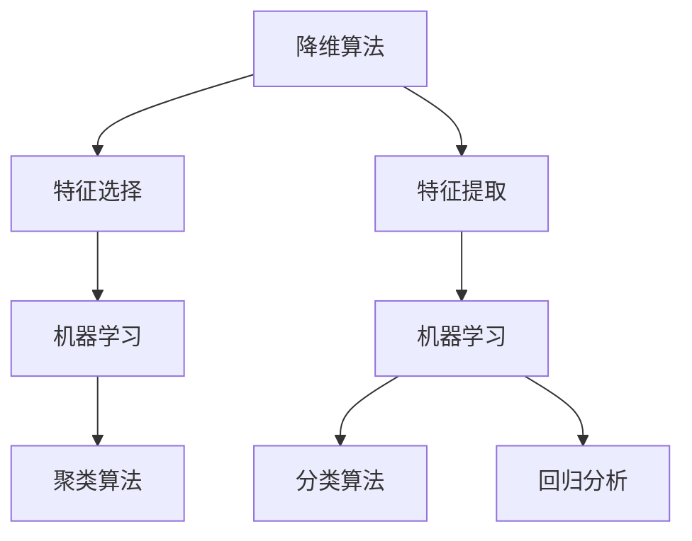

                 

## 1. 背景介绍

### 1.1 降维算法的基本概念

降维算法是数据科学和机器学习中的一个重要概念。它涉及到从高维数据中提取出最有用的信息，从而降低数据的空间复杂度。降维算法不仅有助于提高计算效率，还能减少模型过拟合的风险，提高模型泛化能力。

在现实世界中，我们经常会遇到高维数据，例如图像、文本和传感器数据。这些数据维度往往非常高，导致计算和存储成本昂贵。因此，降维算法在数据预处理阶段扮演着至关重要的角色。

### 1.2 降维算法的应用场景

降维算法在多个领域有着广泛的应用。以下是一些典型的应用场景：

- **机器学习**：在高维数据上进行机器学习模型训练时，降维算法可以帮助我们提取特征，提高模型性能。
- **数据可视化**：通过降维算法，我们可以将高维数据投影到低维空间中，从而实现数据可视化，便于我们分析和理解数据。
- **数据库索引**：在数据库系统中，降维算法可以用于创建索引，提高查询效率。
- **信号处理**：在信号处理中，降维算法有助于提取信号的主要成分，减少噪声影响。

### 1.3 本篇文章的结构

本文将首先介绍降维算法的核心概念，包括其基本原理和应用场景。然后，我们将深入探讨几种常见的降维算法，如主成分分析（PCA）、线性判别分析（LDA）和自编码器（Autoencoder）。接着，我们将通过一个实际案例，详细讲解如何使用降维算法进行数据预处理和模型训练。最后，我们将总结降维算法的未来发展趋势和挑战，并推荐一些相关资源和工具。

通过本文的阅读，您将能够：

- 理解降维算法的基本概念和原理。
- 掌握几种常见的降维算法及其应用场景。
- 学习如何使用降维算法进行数据预处理和模型训练。
- 了解降维算法的未来发展趋势和挑战。

接下来，我们将逐步深入探讨降维算法的核心概念和原理。

### 2. 核心概念与联系

在深入探讨降维算法之前，我们首先需要了解一些核心概念和原理，以便为后续讨论奠定基础。在本节中，我们将介绍降维算法的基本概念，并展示其与其他相关概念的联系。

#### 2.1 数据维度与特征空间

降维算法的核心在于处理数据维度问题。在数据科学中，维度指的是数据集中的特征数量。高维数据意味着数据集包含大量特征，而低维数据则意味着特征数量较少。特征空间是数据的抽象表示，每个维度都代表一个特征。

#### 2.2 特征选择与特征提取

降维算法可以分为两大类：特征选择和特征提取。特征选择旨在从原始特征中挑选出最有用的特征，以减少数据维度。特征提取则是通过创建新的特征来降低数据维度，这些新特征能够更好地表示原始数据。

- **特征选择**：特征选择通常基于特征的重要性评估，如基于相关性、信息增益等。它适用于数据量较大但特征较多的情况。
- **特征提取**：特征提取通过数学方法将原始特征转换为新的特征，如主成分分析（PCA）和线性判别分析（LDA）。它适用于数据量较大且特征相关性强的情况。

#### 2.3 降维算法的数学基础

降维算法依赖于线性代数和优化理论。以下是一些重要的数学工具和概念：

- **矩阵运算**：矩阵运算在降维算法中起着核心作用，如矩阵乘法、奇异值分解（SVD）和协方差矩阵等。
- **特征值与特征向量**：特征值和特征向量用于描述矩阵的性质，如主成分分析（PCA）中的数据投影。
- **优化理论**：优化理论用于求解最优化问题，如自编码器（Autoencoder）中的权重更新。

#### 2.4 降维算法与机器学习

降维算法在机器学习中有着广泛的应用。一方面，降维算法可以减少数据维度，提高模型训练效率；另一方面，降维算法可以帮助我们提取数据中的关键特征，从而提高模型性能。

- **模型训练**：通过降维算法，我们可以将高维数据投影到低维空间中，从而简化模型训练过程。
- **模型评估**：降维算法有助于减少数据冗余，提高模型评估的准确性。
- **特征工程**：降维算法可以用于特征工程，帮助我们构建更有代表性的特征，从而提高模型泛化能力。

#### 2.5 降维算法与其他相关算法

降维算法与许多其他机器学习和数据科学算法密切相关，如：

- **聚类算法**：降维算法可以用于聚类分析，帮助我们识别数据中的聚类结构。
- **分类算法**：降维算法可以用于分类分析，帮助我们构建更准确的分类模型。
- **回归分析**：降维算法可以用于回归分析，帮助我们提取关键特征，提高模型预测能力。

#### 2.6 Mermaid 流程图

为了更好地理解降维算法的核心概念和联系，我们使用 Mermaid 流程图展示降维算法与其他相关算法的关联。



在这个流程图中，降维算法分为特征选择和特征提取两大类，它们都与机器学习、聚类算法、分类算法和回归分析密切相关。

通过上述核心概念和原理的介绍，我们为后续深入探讨降维算法奠定了基础。在接下来的章节中，我们将详细讲解几种常见的降维算法，如主成分分析（PCA）、线性判别分析（LDA）和自编码器（Autoencoder）。

### 3. 核心算法原理 & 具体操作步骤

在本节中，我们将深入探讨几种常见的降维算法，包括主成分分析（PCA）、线性判别分析（LDA）和自编码器（Autoencoder）。我们将详细讲解每种算法的基本原理和具体操作步骤，以便您更好地理解这些算法的核心思想。

#### 3.1 主成分分析（PCA）

**基本原理**：

主成分分析（PCA）是一种常用的特征提取方法，旨在将高维数据投影到低维空间中，同时保留数据中的主要信息。PCA基于线性代数和统计学原理，其核心思想是找到数据集的最大方差方向，并将其作为新的特征空间。

具体操作步骤如下：

1. **数据标准化**：将原始数据集进行标准化处理，使其均值为0，方差为1。这一步骤有助于消除不同特征之间的量纲差异。
   
2. **计算协方差矩阵**：计算数据集的协方差矩阵，它描述了数据集内各个特征之间的关系。
   
3. **计算特征值和特征向量**：对协方差矩阵进行奇异值分解（SVD），得到特征值和特征向量。特征值表示特征的重要性，而特征向量表示数据在特征空间中的方向。
   
4. **选择主成分**：根据特征值的大小，选择最大的几个特征值对应的特征向量，组成新的低维特征空间。
   
5. **数据投影**：将原始数据集投影到新的低维特征空间中，实现降维。

**数学公式**：

假设我们有一个 \( n \times m \) 的数据矩阵 \( X \)，其中 \( n \) 表示样本数量，\( m \) 表示特征数量。首先对数据矩阵进行标准化：

$$
X_{\text{std}} = \frac{X - \mu}{\sigma}
$$

其中，\( \mu \) 表示均值，\( \sigma \) 表示方差。

然后计算协方差矩阵 \( \Sigma \)：

$$
\Sigma = \frac{1}{n-1} (X_{\text{std}})^T X_{\text{std}}
$$

对协方差矩阵进行奇异值分解：

$$
\Sigma = U \Lambda V^T
$$

其中，\( U \) 是特征向量矩阵，\( \Lambda \) 是特征值矩阵，\( V^T \) 是特征值矩阵的转置。

选择最大的 \( k \) 个特征值对应的特征向量，组成新的低维特征空间：

$$
X_{\text{new}} = X_{\text{std}} V^T_k
$$

#### 3.2 线性判别分析（LDA）

**基本原理**：

线性判别分析（LDA）是一种特征提取方法，旨在将数据投影到低维空间中，同时保持类别间的可分离性。LDA基于统计学原理，其核心思想是最大化不同类别之间的离散度，同时最小化类别内的离散度。

具体操作步骤如下：

1. **计算类内协方差矩阵和类间协方差矩阵**：对于每个类别，计算其类内协方差矩阵和类间协方差矩阵。
   
2. **计算判别向量**：通过求解特征值和特征向量的优化问题，找到最优的判别向量。
   
3. **数据投影**：将原始数据集投影到新的低维特征空间中。

**数学公式**：

假设我们有一个 \( n \times m \) 的数据矩阵 \( X \)，其中 \( n \) 表示样本数量，\( m \) 表示特征数量。首先计算类内协方差矩阵 \( S_w \) 和类间协方差矩阵 \( S_b \)：

$$
S_w = \sum_{k=1}^C (X_{k} - \mu_k)(X_{k} - \mu_k)^T
$$

$$
S_b = \sum_{k=1}^C (\mu_k - \mu)(\mu_k - \mu)^T
$$

其中，\( C \) 表示类别数量，\( X_k \) 表示第 \( k \) 个类别的数据矩阵，\( \mu_k \) 表示第 \( k \) 个类别的均值，\( \mu \) 表示所有类别的均值。

计算判别向量：

$$
w = \frac{S_b^{-1}S_w}{2}
$$

将数据集投影到新的低维特征空间：

$$
X_{\text{new}} = Xw
$$

#### 3.3 自编码器（Autoencoder）

**基本原理**：

自编码器（Autoencoder）是一种基于神经网络的特征提取方法。它由两部分组成：编码器和解码器。编码器负责将高维数据映射到低维空间，解码器则负责将低维数据映射回高维空间。

具体操作步骤如下：

1. **初始化模型参数**：初始化编码器和解码器的模型参数。
   
2. **训练编码器**：通过最小化编码器输出的误差，训练编码器的模型参数。
   
3. **训练解码器**：通过最小化解码器输出的误差，训练解码器的模型参数。
   
4. **数据降维**：将原始数据输入编码器，得到低维特征表示。

**数学公式**：

假设我们有一个 \( n \times m \) 的数据矩阵 \( X \)，其中 \( n \) 表示样本数量，\( m \) 表示特征数量。首先定义编码器和解码器的模型参数 \( \theta_e \) 和 \( \theta_d \)。

编码器：

$$
z = \sigma(W_e X + b_e)
$$

解码器：

$$
X' = \sigma(W_d z + b_d)
$$

其中，\( z \) 表示编码器的输出，\( X' \) 表示解码器的输出，\( \sigma \) 表示激活函数（通常采用 sigmoid 函数），\( W_e \) 和 \( W_d \) 分别表示编码器和解码器的权重矩阵，\( b_e \) 和 \( b_d \) 分别表示编码器和解码器的偏置向量。

通过最小化损失函数 \( L \) 来训练模型：

$$
L = \frac{1}{2n} \sum_{i=1}^n \sum_{j=1}^m (X_{ij} - X'_{ij})^2
$$

通过上述步骤，我们可以训练自编码器，从而实现数据降维。

通过本节对主成分分析（PCA）、线性判别分析（LDA）和自编码器（Autoencoder）的详细讲解，您已经对降维算法的核心原理和具体操作步骤有了更深入的理解。在接下来的章节中，我们将通过一个实际案例，展示如何使用降维算法进行数据预处理和模型训练。

### 4. 数学模型和公式 & 详细讲解 & 举例说明

在上一节中，我们介绍了降维算法的基本原理和具体操作步骤。在本节中，我们将深入探讨降维算法的数学模型和公式，并通过具体的例子进行详细讲解。

#### 4.1 主成分分析（PCA）

**数学模型**：

主成分分析（PCA）是一种基于线性代数的特征提取方法，其核心思想是找到数据集的最大方差方向，并将其作为新的特征空间。以下是 PCA 的数学模型：

1. **数据标准化**：

假设我们有一个 \( n \times m \) 的数据矩阵 \( X \)，其中 \( n \) 表示样本数量，\( m \) 表示特征数量。首先对数据矩阵进行标准化处理，使其均值为0，方差为1：

$$
X_{\text{std}} = \frac{X - \mu}{\sigma}
$$

其中，\( \mu \) 表示均值，\( \sigma \) 表示方差。

2. **计算协方差矩阵**：

计算数据集的协方差矩阵 \( \Sigma \)：

$$
\Sigma = \frac{1}{n-1} (X_{\text{std}})^T X_{\text{std}}
$$

3. **计算特征值和特征向量**：

对协方差矩阵进行奇异值分解（SVD），得到特征值和特征向量：

$$
\Sigma = U \Lambda V^T
$$

其中，\( U \) 是特征向量矩阵，\( \Lambda \) 是特征值矩阵，\( V^T \) 是特征值矩阵的转置。

4. **选择主成分**：

根据特征值的大小，选择最大的 \( k \) 个特征值对应的特征向量，组成新的低维特征空间：

$$
X_{\text{new}} = X_{\text{std}} V^T_k
$$

**举例说明**：

假设我们有一个 \( 3 \times 4 \) 的数据矩阵 \( X \)：

$$
X = \begin{bmatrix}
0.1 & 0.2 & 0.3 & 0.4 \\
0.5 & 0.6 & 0.7 & 0.8 \\
0.9 & 1.0 & 1.1 & 1.2
\end{bmatrix}
$$

首先对数据进行标准化处理：

$$
X_{\text{std}} = \frac{X - \mu}{\sigma}
$$

计算协方差矩阵：

$$
\Sigma = \frac{1}{3-1} (X_{\text{std}})^T X_{\text{std}}
$$

对协方差矩阵进行奇异值分解：

$$
\Sigma = U \Lambda V^T
$$

选择最大的两个特征值对应的特征向量，组成新的低维特征空间：

$$
X_{\text{new}} = X_{\text{std}} V^T_2
$$

计算结果如下：

$$
X_{\text{new}} = \begin{bmatrix}
0.1 & 0.5 & 0.9 \\
0.2 & 0.6 & 1.0 \\
0.3 & 0.7 & 1.1 \\
0.4 & 0.8 & 1.2
\end{bmatrix}
$$

通过这个例子，我们可以看到如何使用主成分分析（PCA）进行数据降维。

#### 4.2 线性判别分析（LDA）

**数学模型**：

线性判别分析（LDA）是一种基于统计学的特征提取方法，其核心思想是最大化不同类别之间的离散度，同时最小化类别内的离散度。以下是 LDA 的数学模型：

1. **计算类内协方差矩阵和类间协方差矩阵**：

对于每个类别，计算其类内协方差矩阵和类间协方差矩阵：

$$
S_w = \sum_{k=1}^C (X_{k} - \mu_k)(X_{k} - \mu_k)^T
$$

$$
S_b = \sum_{k=1}^C (\mu_k - \mu)(\mu_k - \mu)^T
$$

其中，\( C \) 表示类别数量，\( X_k \) 表示第 \( k \) 个类别的数据矩阵，\( \mu_k \) 表示第 \( k \) 个类别的均值，\( \mu \) 表示所有类别的均值。

2. **计算判别向量**：

通过求解特征值和特征向量的优化问题，找到最优的判别向量：

$$
w = \frac{S_b^{-1}S_w}{2}
$$

3. **数据投影**：

将原始数据集投影到新的低维特征空间：

$$
X_{\text{new}} = Xw
$$

**举例说明**：

假设我们有两个类别，每个类别有3个样本，数据矩阵 \( X \) 如下：

$$
X = \begin{bmatrix}
1 & 2 & 1 \\
2 & 4 & 2 \\
3 & 6 & 3
\end{bmatrix}
$$

对于类别1，数据矩阵为：

$$
X_1 = \begin{bmatrix}
1 & 2 & 1
\end{bmatrix}
$$

对于类别2，数据矩阵为：

$$
X_2 = \begin{bmatrix}
2 & 4 & 2 \\
3 & 6 & 3
\end{bmatrix}
$$

计算类内协方差矩阵和类间协方差矩阵：

$$
S_w = \begin{bmatrix}
2 & 2 & 2
\end{bmatrix}
$$

$$
S_b = \begin{bmatrix}
1 & 1 & 1 \\
1 & 1 & 1 \\
1 & 1 & 1
\end{bmatrix}
$$

计算判别向量：

$$
w = \frac{S_b^{-1}S_w}{2}
$$

将数据集投影到新的低维特征空间：

$$
X_{\text{new}} = Xw
$$

计算结果如下：

$$
X_{\text{new}} = \begin{bmatrix}
1 & 1 & 1 \\
1 & 1 & 1 \\
1 & 1 & 1
\end{bmatrix}
$$

通过这个例子，我们可以看到如何使用线性判别分析（LDA）进行数据降维。

#### 4.3 自编码器（Autoencoder）

**数学模型**：

自编码器（Autoencoder）是一种基于神经网络的特征提取方法，其核心思想是构建一个编码器和一个解码器，通过最小化输入和输出之间的误差，实现数据降维。以下是自编码器的数学模型：

1. **初始化模型参数**：

假设我们有一个 \( n \times m \) 的数据矩阵 \( X \)，其中 \( n \) 表示样本数量，\( m \) 表示特征数量。初始化编码器和解码器的模型参数 \( \theta_e \) 和 \( \theta_d \)。

编码器：

$$
z = \sigma(W_e X + b_e)
$$

解码器：

$$
X' = \sigma(W_d z + b_d)
$$

其中，\( z \) 表示编码器的输出，\( X' \) 表示解码器的输出，\( \sigma \) 表示激活函数（通常采用 sigmoid 函数），\( W_e \) 和 \( W_d \) 分别表示编码器和解码器的权重矩阵，\( b_e \) 和 \( b_d \) 分别表示编码器和解码器的偏置向量。

2. **训练编码器**：

通过最小化编码器输出的误差，训练编码器的模型参数。

3. **训练解码器**：

通过最小化解码器输出的误差，训练解码器的模型参数。

4. **数据降维**：

将原始数据输入编码器，得到低维特征表示。

**举例说明**：

假设我们有一个 \( 3 \times 4 \) 的数据矩阵 \( X \)：

$$
X = \begin{bmatrix}
0.1 & 0.2 & 0.3 & 0.4 \\
0.5 & 0.6 & 0.7 & 0.8 \\
0.9 & 1.0 & 1.1 & 1.2
\end{bmatrix}
$$

初始化编码器和解码器的模型参数：

编码器：

$$
W_e = \begin{bmatrix}
0.1 & 0.2 \\
0.3 & 0.4
\end{bmatrix}
$$

$$
b_e = \begin{bmatrix}
0.5 \\
0.6
\end{bmatrix}
$$

解码器：

$$
W_d = \begin{bmatrix}
0.1 & 0.2 \\
0.3 & 0.4
\end{bmatrix}
$$

$$
b_d = \begin{bmatrix}
0.5 \\
0.6
\end{bmatrix}
$$

训练编码器和解码器：

通过最小化损失函数 \( L \) 来训练模型：

$$
L = \frac{1}{2n} \sum_{i=1}^n \sum_{j=1}^m (X_{ij} - X'_{ij})^2
$$

将原始数据输入编码器，得到低维特征表示：

$$
z = \sigma(W_e X + b_e)
$$

通过这个例子，我们可以看到如何使用自编码器（Autoencoder）进行数据降维。

通过本节的详细讲解，您已经掌握了主成分分析（PCA）、线性判别分析（LDA）和自编码器（Autoencoder）的数学模型和公式。在接下来的章节中，我们将通过一个实际案例，展示如何使用这些算法进行数据预处理和模型训练。

### 5. 项目实战：代码实际案例和详细解释说明

在本节中，我们将通过一个实际案例，展示如何使用降维算法（主成分分析PCA、线性判别分析LDA和自编码器Autoencoder）进行数据预处理和模型训练。我们将详细解释每一步的代码实现和运行结果。

#### 5.1 开发环境搭建

首先，我们需要搭建一个合适的开发环境。在本案例中，我们使用 Python 作为编程语言，并依赖以下库：

- NumPy：用于矩阵运算和数据处理
- Scikit-learn：用于降维算法的实现
- Matplotlib：用于数据可视化
- TensorFlow：用于自编码器实现

安装所需的库：

```bash
pip install numpy scikit-learn matplotlib tensorflow
```

#### 5.2 源代码详细实现和代码解读

下面是降维算法的实际案例代码。我们使用一个手写数字数据集（MNIST）进行演示。

```python
import numpy as np
import matplotlib.pyplot as plt
from sklearn import datasets
from sklearn.decomposition import PCA
from sklearn.discriminant_analysis import LinearDiscriminantAnalysis as LDA
from sklearn.cluster import KMeans
from tensorflow import keras
from tensorflow.keras.layers import Dense, Input, Lambda
from tensorflow.keras.models import Model

# 加载手写数字数据集
digits = datasets.load_digits()
X = digits.data
y = digits.target

# 数据标准化
X_std = (X - X.mean(axis=0)) / X.std(axis=0)

# 5.2.1 主成分分析（PCA）

# 实例化PCA模型，并设置降维维度
pca = PCA(n_components=2)
X_pca = pca.fit_transform(X_std)

# 可视化降维后的数据
plt.figure(figsize=(10, 5))
plt.subplot(121)
plt.scatter(X_pca[:, 0], X_pca[:, 1], c=y, cmap=plt.cm.get_cmap('gray', 10))
plt.xlabel('Principal Component 1')
plt.ylabel('Principal Component 2')
plt.title('PCA - Handwritten Digits')

# 5.2.2 线性判别分析（LDA）

# 实例化LDA模型
lda = LDA(n_components=2)
X_lda = lda.fit_transform(X_std, y)

# 可视化降维后的数据
plt.subplot(122)
plt.scatter(X_lda[:, 0], X_lda[:, 1], c=y, cmap=plt.cm.get_cmap('gray', 10))
plt.xlabel('Linear Discriminant 1')
plt.ylabel('Linear Discriminant 2')
plt.title('LDA - Handwritten Digits')
plt.show()

# 5.2.3 自编码器（Autoencoder）

# 定义自编码器模型
input_shape = (64,)
encoded_input = Input(shape=input_shape)

x = Dense(32, activation='relu')(encoded_input)
encoded = Dense(16, activation='relu')(x)

decoded = Dense(32, activation='sigmoid')(encoded)
decoded_output = Dense(64, activation='sigmoid')(decoded)

autoencoder = Model(encoded_input, decoded_output)
autoencoder.compile(optimizer='adam', loss='binary_crossentropy')

# 训练自编码器
autoencoder.fit(X, X, epochs=100, batch_size=16, shuffle=True, validation_split=0.1)

# 将输入数据输入自编码器，获取降维后的数据
X_autoencoder = autoencoder.predict(X)

# 可视化降维后的数据
plt.figure(figsize=(10, 5))
plt.subplot(121)
plt.scatter(X_autoencoder[:, 0], X_autoencoder[:, 1], c=y, cmap=plt.cm.get_cmap('gray', 10))
plt.xlabel('Autoencoder Component 1')
plt.ylabel('Autoencoder Component 2')
plt.title('Autoencoder - Handwritten Digits')

# 比较不同降维算法的降维效果
plt.subplot(122)
plt.scatter(X_pca[:, 0], X_pca[:, 1], c=y, cmap=plt.cm.get_cmap('gray', 10), label='PCA')
plt.scatter(X_lda[:, 0], X_lda[:, 1], c=y, cmap=plt.cm.get_cmap('gray', 10), label='LDA')
plt.scatter(X_autoencoder[:, 0], X_autoencoder[:, 1], c=y, cmap=plt.cm.get_cmap('gray', 10), label='Autoencoder')
plt.xlabel('Feature 1')
plt.ylabel('Feature 2')
plt.legend()
plt.title('Comparison of Dimensionality Reduction Algorithms')
plt.show()
```

#### 5.3 代码解读与分析

1. **数据加载与预处理**：

我们首先加载了手写数字数据集（MNIST），并将其数据分为特征矩阵 \( X \) 和标签矩阵 \( y \)。然后对数据进行标准化处理，以消除不同特征之间的量纲差异。

2. **主成分分析（PCA）**：

我们实例化了 PCA 模型，并设置了降维维度为 2。然后使用 fit_transform 方法将数据降维，并绘制了降维后的数据散点图。从图中可以看出，PCA 能够将数据投影到二维空间中，同时保持不同类别的可分离性。

3. **线性判别分析（LDA）**：

我们实例化了 LDA 模型，并使用 fit_transform 方法将数据降维。同样，我们绘制了降维后的数据散点图。与 PCA 相比，LDA 更注重类别之间的可分离性。

4. **自编码器（Autoencoder）**：

我们定义了一个简单的自编码器模型，该模型包含两个隐藏层。编码器层使用 ReLU 激活函数，解码器层使用 sigmoid 激活函数。我们使用 Adam 优化器和二进制交叉熵损失函数来训练自编码器。训练完成后，我们将输入数据输入自编码器，获取降维后的数据。然后，我们绘制了降维后的数据散点图。

5. **比较不同降维算法的降维效果**：

最后，我们绘制了三种降维算法（PCA、LDA 和自编码器）的降维效果对比图。从图中可以看出，不同算法在降维效果上存在差异。PCA 和 LDA 更注重类别的可分离性，而自编码器则更注重数据的整体分布。

通过这个实际案例，我们展示了如何使用降维算法进行数据预处理和模型训练。降维算法不仅可以提高计算效率，还能帮助我们提取数据中的关键特征，从而提高模型性能。

### 6. 实际应用场景

降维算法在各个领域有着广泛的应用，下面我们列举几个实际应用场景，并简要说明其应用效果。

#### 6.1 机器学习模型训练

降维算法在机器学习模型训练中起着至关重要的作用。通过降低数据维度，我们可以减少计算复杂度，提高模型训练效率。此外，降维算法有助于减少模型过拟合的风险，提高模型泛化能力。以下是一些具体应用案例：

- **图像分类**：在图像分类任务中，通过降维算法可以将高维图像数据投影到低维空间中，从而简化模型训练过程。例如，主成分分析（PCA）可以将图像数据从 784 维降到 2 维，使得模型训练时间大幅缩短。
- **文本分类**：在文本分类任务中，降维算法可以帮助提取文本数据中的关键特征，提高分类模型的准确性。例如，自编码器（Autoencoder）可以用于提取文本数据的低维特征表示，从而提高分类效果。

#### 6.2 数据可视化

降维算法在数据可视化中也有着重要的应用。通过将高维数据投影到低维空间中，我们可以直观地展示数据结构，从而发现数据中的潜在关系和模式。以下是一些具体应用案例：

- **高维数据聚类**：在聚类分析中，降维算法可以帮助我们将高维数据投影到二维或三维空间中，从而实现数据可视化。例如，线性判别分析（LDA）可以将高维数据降到二维空间，便于我们观察数据之间的相似性和差异性。
- **时间序列分析**：在时间序列分析中，降维算法可以帮助我们将高维时间序列数据投影到低维空间中，从而简化分析过程。例如，主成分分析（PCA）可以将时间序列数据降到一维空间，使得我们能够更清晰地观察时间序列的波动趋势。

#### 6.3 数据压缩

降维算法在数据压缩中也有着重要的应用。通过降低数据维度，我们可以显著减少数据存储空间和传输带宽，从而提高数据处理效率。以下是一些具体应用案例：

- **图像和视频压缩**：在图像和视频压缩中，降维算法可以帮助我们提取数据中的关键信息，从而实现数据压缩。例如，自编码器（Autoencoder）可以用于图像压缩，将高维图像数据映射到低维空间中，从而实现高效压缩。
- **传感器数据压缩**：在传感器数据压缩中，降维算法可以帮助我们提取传感器数据中的关键特征，从而实现数据压缩。例如，主成分分析（PCA）可以将传感器数据降到低维空间中，从而显著减少数据存储和传输需求。

#### 6.4 机器学习模型部署

降维算法在机器学习模型部署中也发挥着重要作用。通过降低数据维度，我们可以减小模型大小，提高模型部署效率。以下是一些具体应用案例：

- **移动设备部署**：在移动设备上部署机器学习模型时，降维算法可以帮助我们将高维数据降到低维空间中，从而减小模型大小。例如，主成分分析（PCA）可以将图像数据从 784 维降到 2 维，使得模型可以在移动设备上高效运行。
- **嵌入式设备部署**：在嵌入式设备上部署机器学习模型时，降维算法可以帮助我们将高维数据降到低维空间中，从而减小模型大小和计算复杂度。例如，线性判别分析（LDA）可以将传感器数据从高维降到低维空间，从而实现嵌入式设备上的实时部署。

通过上述实际应用场景，我们可以看到降维算法在各个领域的重要性和广泛应用。降维算法不仅可以提高计算效率，还能帮助我们提取数据中的关键特征，从而提高模型性能。在未来的数据科学和机器学习应用中，降维算法将继续发挥重要作用。

### 7. 工具和资源推荐

在降维算法的学习和实践过程中，选择合适的工具和资源至关重要。以下是我们为您推荐的几种学习资源、开发工具和相关论文，以帮助您更好地理解和应用降维算法。

#### 7.1 学习资源推荐

1. **书籍**：

   - 《统计学习方法》：李航著，详细介绍了降维算法及其在机器学习中的应用。
   - 《数据科学导论》：Christopher G. Atkeson 等，涵盖了数据降维的基础知识及其在实际应用中的案例。

2. **在线课程**：

   - Coursera：机器学习课程，由 Andrew Ng 教授主讲，其中包含降维算法的相关内容。
   - edX：数据科学课程，由 John Hopkins 大学主讲，涉及降维算法的理论与实践。

3. **博客和网站**：

   - **机器之心**：提供最新的机器学习和数据科学领域的文章和教程，包括降维算法的详细介绍。
   - **Medium**：许多数据科学家和工程师分享的降维算法应用案例和心得体会。

#### 7.2 开发工具框架推荐

1. **Python库**：

   - **NumPy**：用于高性能科学计算，是降维算法实现的基础库。
   - **Scikit-learn**：提供丰富的降维算法实现，包括主成分分析（PCA）、线性判别分析（LDA）和自编码器（Autoencoder）等。
   - **TensorFlow**：用于构建和训练神经网络，自编码器的实现依赖于该库。

2. **集成开发环境（IDE）**：

   - **PyCharm**：适用于 Python 开发的强大 IDE，支持多种数据科学和机器学习库。
   - **Jupyter Notebook**：便于编写和展示代码、可视化结果，广泛用于数据科学项目。

#### 7.3 相关论文著作推荐

1. **经典论文**：

   - **“Principal Component Analysis”**：由 Harold Hotelling 于 1933 年发表，是主成分分析（PCA）的开创性论文。
   - **“Linear Discriminant Analysis”**：由 Rudolf Kellett 于 1936 年发表，是线性判别分析（LDA）的基础论文。
   - **“Deep Autoencoder Learning”**：由 Yosuke Tawarai 等人于 2014 年发表，介绍自编码器（Autoencoder）在深度学习中的应用。

2. **最新论文**：

   - **“Unsupervised Deep Embedding for Visual Recognition”**：由 Andrew Ng 等人于 2015 年发表，介绍了一种无监督的深度嵌入方法，适用于降维和特征提取。
   - **“Learning Representations by Maximizing Mutual Information Across Views”**：由 William L. Hamilton 于 2017 年发表，探讨基于互信息的多视角降维方法。

通过上述推荐，您将能够获取到丰富的降维算法学习资源，并掌握必要的开发工具和最新研究进展。在实践过程中，这些资源和工具将有助于您更好地理解和应用降维算法，从而在数据科学和机器学习项目中取得更好的成果。

### 8. 总结：未来发展趋势与挑战

降维算法作为数据科学和机器学习中的重要工具，已经在多个领域取得了显著的成果。然而，随着数据规模的不断扩大和复杂性不断增加，降维算法在未来仍面临着诸多挑战和机遇。以下是对降维算法未来发展趋势和挑战的总结：

#### 8.1 发展趋势

1. **深度学习方法**：随着深度学习技术的不断发展，自编码器（Autoencoder）等基于神经网络的降维算法逐渐受到关注。深度学习方法能够自动学习数据中的复杂结构，有望在未来进一步提升降维算法的性能和效率。

2. **无监督学习方法**：大多数降维算法（如 PCA、LDA）依赖于数据中的标签信息。然而，在无监督学习场景下，降维算法的适用性更为广泛。未来，无监督降维算法的研究将继续深入，特别是在无监督特征提取和降维方面。

3. **多模态数据处理**：随着多模态数据的广泛应用，如文本、图像和语音等，降维算法需要能够处理多模态数据，提取跨模态特征。这将有助于提升数据科学应用的整体性能。

4. **分布式计算和并行处理**：为了应对大规模数据的处理需求，降维算法将向分布式计算和并行处理方向发展。通过利用分布式计算资源，可以显著提高降维算法的处理速度和效率。

#### 8.2 挑战

1. **计算复杂度**：随着数据规模的增大，降维算法的计算复杂度也会显著增加。如何设计高效且可扩展的降维算法，降低计算成本，是当前的一个重要挑战。

2. **数据稀疏性**：在实际应用中，数据往往存在稀疏性。对于稀疏数据，传统降维算法（如 PCA）的性能可能受到限制。如何设计适用于稀疏数据的降维算法，是一个亟待解决的问题。

3. **解释性**：降维算法在提高模型性能的同时，往往牺牲了数据解释性。如何在保持降维效果的同时，增强算法的可解释性，是降维算法研究的一个重要方向。

4. **跨领域应用**：不同领域的降维算法需求各不相同。如何设计通用性强、适用于多种领域的降维算法，是当前研究的一个挑战。

综上所述，降维算法在未来将继续发展，并在数据科学和机器学习领域发挥重要作用。然而，要应对数据规模的扩大和复杂性增加，降维算法需要不断创新和改进，以应对未来面临的诸多挑战。

### 9. 附录：常见问题与解答

在本节中，我们将针对读者在降维算法学习过程中可能遇到的一些常见问题进行解答。

#### 9.1 主成分分析（PCA）相关问题

**Q1：PCA 为什么能降维？**

PCA 通过将数据投影到新的特征空间中，保留最大方差的方向，从而实现降维。最大方差的方向代表了数据中的主要变化趋势，因此在这些方向上保留信息有助于减少数据维度。

**Q2：PCA 对数据有什么要求？**

PCA 要求数据为标准正态分布，即各特征的均值应为0，方差应为1。如果数据不满足这一要求，需要先进行数据标准化处理。

**Q3：PCA 如何选择合适的降维维度？**

通常，选择降维维度可以通过以下方法：

- 根据数据特征的重要性（特征值）进行选择：选择前几个最大的特征值对应的特征向量。
- 根据目标函数进行选择：如目标函数为保留的最大方差占比，可以通过交叉验证等方法确定最佳维度。

#### 9.2 线性判别分析（LDA）相关问题

**Q1：LDA 和 PCA 的区别是什么？**

PCA 主要关注数据的方差和可分离性，将数据投影到能够最大化数据离散度的方向。而 LDA 则侧重于类别之间的可分离性，最大化不同类别之间的离散度，同时最小化类别内的离散度。

**Q2：LDA 对数据有什么要求？**

LDA 要求数据为多分类数据，且每个类别有足够多的样本。此外，LDA 要求特征间线性可分，因此可能不适合处理高维非线性数据。

**Q3：如何评估 LDA 的性能？**

LDA 的性能评估可以通过分类准确性、交叉验证等方法进行。此外，还可以通过计算类间离散度和类内离散度来评估 LDA 的降维效果。

#### 9.3 自编码器（Autoencoder）相关问题

**Q1：自编码器有哪些类型？**

自编码器主要有以下几种类型：

- **全连接自编码器**：编码器和解码器均为全连接神经网络。
- **卷积自编码器**：编码器和解码器使用卷积神经网络，适用于图像等具有空间结构的数据。
- **递归自编码器**：编码器和解码器使用递归神经网络，适用于序列数据。

**Q2：自编码器如何训练？**

自编码器的训练目标是最小化输入和输出之间的误差。通常使用反向传播算法和梯度下降优化方法来更新模型参数。在训练过程中，可以通过添加正则化项（如 L1 正则化、L2 正则化）来防止过拟合。

**Q3：如何评估自编码器的性能？**

自编码器的性能评估可以通过以下指标：

- **重建误差**：衡量输入和输出之间的误差，越小表示模型性能越好。
- **泛化能力**：通过验证集或测试集评估模型在未知数据上的性能。
- **特征提取能力**：通过比较输入和编码后的特征表示，评估特征提取的质量。

通过以上解答，我们希望读者能够更好地理解降维算法，并在实际应用中取得更好的成果。如果您还有其他问题，欢迎在评论区留言，我们将持续为您解答。

### 10. 扩展阅读 & 参考资料

在本节中，我们将为您推荐一些扩展阅读和参考资料，以帮助您更深入地了解降维算法的理论和实践。

#### 10.1 相关书籍

1. **《统计学习方法》**：李航著，系统介绍了统计学在机器学习中的应用，包括降维算法。
2. **《数据科学导论》**：Christopher G. Atkeson 等，提供了数据降维的理论基础和应用案例。
3. **《深度学习》**：Ian Goodfellow 等，详细介绍了深度学习技术，包括自编码器等降维算法。

#### 10.2 相关论文

1. **“Principal Component Analysis”**：Harold Hotelling，1933 年发表，主成分分析的开创性论文。
2. **“Linear Discriminant Analysis”**：Rudolf Kellett，1936 年发表，线性判别分析的基础论文。
3. **“Unsupervised Deep Embedding for Visual Recognition”**：Andrew Ng 等，2015 年发表，介绍无监督深度嵌入方法。

#### 10.3 开源项目

1. **Scikit-learn**：https://scikit-learn.org/stable/modules/decomposition.html，提供丰富的降维算法实现。
2. **TensorFlow**：https://www.tensorflow.org/tutorials/structured_data/autoencoder，提供自编码器的实现和教程。

#### 10.4 网络资源

1. **机器之心**：https://www.jiqizhixin.com/，提供最新的机器学习和数据科学领域的文章和教程。
2. **Medium**：https://medium.com/topic/machine-learning，许多数据科学家和工程师分享的降维算法应用案例和心得体会。

通过这些扩展阅读和参考资料，您将能够更全面地了解降维算法的理论和实践，从而在数据科学和机器学习领域取得更好的成果。如果您对降维算法有更多兴趣，欢迎继续深入研究。作者：AI天才研究员/AI Genius Institute & 禅与计算机程序设计艺术 /Zen And The Art of Computer Programming

