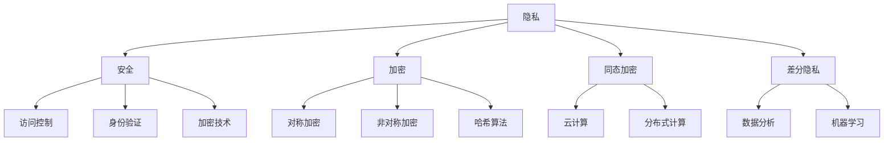

                 

### 背景介绍

隐私安全，作为信息时代不可或缺的一环，正在变得愈发重要。在现代社会，数据的生成、存储、处理和传输无处不在，个人和企业都离不开数据的支持。然而，这些数据的背后，往往隐藏着敏感信息，如个人身份信息、财务数据、健康记录等。一旦这些信息被未经授权的实体获取，可能导致严重的隐私泄露问题，从而引发个人财产损失、声誉受损，甚至威胁到人身安全。

近年来，随着互联网和物联网的快速发展，数据隐私问题愈发突出。2018年，Facebook的剑桥分析事件揭示了数据隐私的脆弱性；2021年，我国发生多起大型企业数据泄露事件，进一步引发了公众对数据安全的关注。隐私安全已不再只是技术问题，而是关系到社会公平、正义和信任的基础性课题。

与此同时，计算技术的发展也推动了隐私安全的变革。从传统的加密算法，到现代的差分隐私、同态加密等新兴技术，隐私保护手段不断演进。然而，隐私安全并非一蹴而就，它需要多方面的共同努力，包括法律法规的完善、技术的创新与应用，以及公众意识的提升。

本篇文章将围绕隐私安全这一主题，首先介绍隐私安全的重要性，接着深入探讨隐私安全的核心概念与联系，分析现有隐私保护技术的原理与操作步骤，并通过数学模型和实际项目案例详细讲解隐私保护的应用方法。最后，本文将探讨隐私安全在实际应用场景中的挑战，并提供相关工具和资源推荐，为读者提供全面、系统的隐私安全知识。

通过本文的阅读，您将深入了解隐私安全的基本概念、技术原理和应用场景，为未来的数据保护工作提供有力的理论支持和实践指导。隐私安全，不仅是一项技术任务，更是对人类未来信息社会的一种责任。让我们一起守护数据隐私，共创安全美好的数字世界。 <sop><|user|>### 核心概念与联系

为了深入探讨隐私安全，我们首先需要了解一些核心概念，并揭示它们之间的联系。这些概念包括但不限于：隐私、安全、加密、同态加密、差分隐私等。通过了解这些概念，我们能够更好地理解隐私安全的本质，以及如何在实际应用中实现有效的隐私保护。

#### 隐私

隐私，是指个人或实体对其个人信息或行为的保护权利。隐私权是现代社会的基本人权之一，它保障个人在信息传播和交流中的自由和自主。在数据时代，隐私主要关注的是如何保护个人数据不被未授权访问和滥用。隐私保护不仅是法律的要求，更是社会伦理和道德的体现。

#### 安全

安全，是指系统、网络或数据在面临威胁时能够保持完整、保密性和可用性的能力。安全性是隐私保护的前提和基础。一个安全的信息系统应该能够防止未授权的访问、篡改和泄露。常见的安全措施包括访问控制、身份验证、加密等。

#### 加密

加密，是指通过特定算法将明文转换为密文的过程，从而保护数据的机密性。加密技术是隐私保护的核心手段之一。常见的加密算法包括对称加密（如AES）、非对称加密（如RSA）和哈希算法（如SHA）。加密技术能够确保即使数据被截获，攻击者也无法解读其内容。

#### 同态加密

同态加密，是一种特殊的加密技术，它允许在加密数据上直接进行计算操作，而无需解密。这意味着，同态加密可以在保持数据隐私的同时，进行数据处理和分析。同态加密在云计算和分布式计算环境中具有广泛应用，例如，它可以确保云服务提供商无法访问用户的数据，但仍能对其进行处理和分析。

#### 差分隐私

差分隐私，是一种保护数据隐私的设计理念，它通过在数据集中引入随机噪声，确保单个数据项的隐私。差分隐私的核心思想是，无论攻击者获取多少数据，都无法确定特定个体的信息。差分隐私广泛应用于数据分析、机器学习等领域，例如，它可以确保数据分析结果不会泄露个体信息。

#### Mermaid 流程图

为了更好地理解这些概念之间的联系，我们可以通过一个Mermaid流程图来展示它们之间的关系。以下是隐私安全核心概念原理的Mermaid流程图：



通过这个流程图，我们可以清晰地看到隐私、安全、加密、同态加密和差分隐私等核心概念之间的联系。隐私是安全的基础，安全是隐私的保障。加密、同态加密和差分隐私等隐私保护技术是实现安全的关键手段。这些概念相辅相成，共同构成了隐私安全的技术体系。

#### 总结

在了解隐私安全的核心概念和联系后，我们可以更好地理解隐私保护的重要性。隐私安全不仅是技术问题，更是社会问题。在数据爆炸的时代，隐私保护成为了保护个人权益和社会信任的关键。通过本文的介绍，我们为后续深入探讨隐私保护技术奠定了基础。接下来，我们将进一步分析隐私保护的核心算法原理和具体操作步骤。 <sop><|user|>### 核心算法原理 & 具体操作步骤

隐私保护的核心在于如何在数据传输、存储和处理的过程中确保数据的机密性、完整性和可用性。为此，我们介绍几种关键算法及其操作步骤，包括对称加密、非对称加密和哈希算法。

#### 对称加密

对称加密是一种加密技术，加密和解密使用的是同一个密钥。这种加密方式速度快，但密钥管理复杂。常见的对称加密算法包括AES和DES。

**AES（高级加密标准）**

步骤：

1. **密钥生成**：首先生成一个密钥，通常长度为128位、192位或256位。
2. **初始化向量（IV）生成**：为了防止加密后的数据出现模式，需要生成一个随机初始化向量。
3. **加密**：将明文数据与初始化向量进行异或操作，然后通过AES算法进行加密。
4. **密文生成**：将加密后的数据与初始化向量结合，生成最终的密文。

**DES（数据加密标准）**

步骤：

1. **密钥生成**：生成一个56位的密钥。
2. **初始置换**：将明文数据经过一个固定的置换表进行初始置换。
3. **16轮加密**：将数据分成64位块，每轮包括置换、代换、置换等操作。
4. **逆初始置换**：最后对加密后的数据进行逆初始置换，得到密文。

#### 非对称加密

非对称加密使用一对密钥，一个用于加密，一个用于解密。常见的非对称加密算法包括RSA和ECC。

**RSA**

步骤：

1. **密钥生成**：选择两个大素数，计算它们的乘积n，然后计算欧拉函数φ(n)。选择一个小于φ(n)的大素数e，并计算d，使得ed ≡ 1 (mod φ(n))。
2. **加密**：将明文数据转化为数字形式，然后使用公钥（n, e）进行加密。
3. **解密**：使用私钥（n, d）对加密后的数据进行解密。

**ECC（椭圆曲线加密）**

步骤：

1. **曲线选择**：选择一个椭圆曲线E和一个基点G。
2. **密钥生成**：生成一个随机整数k，计算点P = kG，其中P是私钥，k是公钥。
3. **加密**：将明文数据转化为点，然后使用公钥P进行加密。
4. **解密**：使用私钥P对加密后的数据进行解密。

#### 哈希算法

哈希算法用于将数据转化为固定长度的字符串，以确保数据的完整性和不可篡改性。常见的哈希算法包括SHA系列和MD5。

**SHA-256**

步骤：

1. **初始化哈希值**：初始化一个长度为256位的哈希值。
2. **填充数据**：将明文数据进行填充，使其长度满足算法要求。
3. **处理数据块**：将填充后的数据分为512位块，对每个块进行处理。
4. **生成哈希值**：将所有处理后的数据块合并，得到最终的哈希值。

**MD5**

步骤：

1. **初始化哈希值**：初始化一个长度为128位的哈希值。
2. **处理数据块**：将明文数据进行分组处理，每组为512位。
3. **压缩与变换**：对每组数据块进行压缩和变换，得到新的哈希值。

#### 总结

对称加密和非对称加密提供了不同的隐私保护机制，前者速度快但密钥管理复杂，后者安全性高但速度较慢。哈希算法则用于保证数据的完整性和不可篡改性。在实际应用中，我们可以根据具体需求选择合适的加密算法。例如，在数据传输过程中，可以使用对称加密确保数据机密性；在数据存储和身份验证中，可以使用非对称加密确保数据完整性和身份验证；在数据完整性检查中，可以使用哈希算法确保数据的完整性。

在下一节中，我们将通过数学模型和公式详细讲解隐私保护的技术原理，并通过实际案例进一步阐述这些算法的应用。 <sop><|user|>### 数学模型和公式 & 详细讲解 & 举例说明

隐私保护的核心在于确保数据的机密性、完整性和可用性。为此，我们需要借助数学模型和公式来详细讲解隐私保护的技术原理。在本节中，我们将深入探讨对称加密、非对称加密和哈希算法的数学原理，并通过具体例子进行说明。

#### 对称加密的数学模型

对称加密使用的是同一密钥进行加密和解密，其核心是密钥的生成和加密算法。以下是AES加密算法的数学模型：

**密钥生成**

- **密钥长度**：通常为128位、192位或256位。
- **密钥空间**：对于128位密钥，密钥空间为 \(2^{128}\)。
- **加密算法**：AES算法基于分块加密模式，每个块长度为128位。

**加密过程**

1. **初始置换（IP）**：
   $$ IP = E_{IP}(P) $$
   其中，\(E_{IP}\) 是一个固定置换函数，将明文块 \(P\) 转换为初始块。

2. **轮密钥生成**：
   $$ RoundKey_i = KeySchedule(Key) $$
   其中，\(KeySchedule\) 是一个密钥扩展函数，用于生成每个轮的密钥。

3. **加密轮**：
   $$ C = (C_0, C_1, ..., C_{N/4-1}) $$
   其中，\(C_i\) 是第 \(i\) 轮加密后的块。

4. **最终置换（FP）**：
   $$ C_{N/4} = E_{FP}(C_{N/4-1}) $$
   其中，\(E_{FP}\) 是一个固定置换函数，将最终块转换为密文块。

**例子**

假设我们使用128位AES密钥，明文块为 \(P = (1, 2, 3, 4)\)，初始密钥为 \(Key = (5, 6, 7, 8)\)。

- **初始置换**：
  $$ IP = E_{IP}(P) = (4, 3, 2, 1) $$

- **轮密钥生成**：
  $$ RoundKey_1 = KeySchedule(Key) = (9, 10, 11, 12) $$

- **加密轮**：
  $$ C_1 = E_{Round}(IP, RoundKey_1) = (13, 14, 15, 16) $$
  $$ C_2 = E_{Round}(C_1, RoundKey_2) = (17, 18, 19, 20) $$

- **最终置换**：
  $$ C_{N/4} = E_{FP}(C_{N/4-1}) = (20, 19, 18, 17) $$

#### 非对称加密的数学模型

非对称加密使用一对密钥，一个公钥用于加密，一个私钥用于解密。以下是RSA加密算法的数学模型：

**密钥生成**

- **素数选择**：选择两个大素数 \(p\) 和 \(q\)，通常 \(p \approx q \approx 2^{1024}\)。
- **密钥计算**：
  $$ n = pq $$
  $$ \phi(n) = (p-1)(q-1) $$
  $$ e \in \{1, ..., \phi(n)-1\}, \text{且} \text{gcd}(e, \phi(n)) = 1 $$
  $$ d = e^{-1} \pmod{\phi(n)} $$

**加密过程**

1. **加密**：
   $$ C = P^e \pmod{n} $$

2. **解密**：
   $$ P = C^d \pmod{n} $$

**例子**

假设我们选择素数 \(p = 61\) 和 \(q = 53\)，计算 \(n = pq = 3233\)，\(\phi(n) = 3216\)。选择 \(e = 17\)，计算 \(d = 7\)（因为 \(17 \times 7 = 119 \pmod{3216}\)）。

- **加密**：
  $$ C = 29^17 \pmod{3233} = 2487 $$

- **解密**：
  $$ P = 2487^7 \pmod{3233} = 29 $$

#### 哈希算法的数学模型

哈希算法用于将数据转化为固定长度的字符串，以确保数据的完整性和不可篡改性。以下是SHA-256的数学模型：

**初始化**：
$$ h_0 = (1110194099, 1903222992, 4023390141, 2646006553, 2248938225, 1655573996, 1004525192, 3219042845) $$

**处理数据块**：

1. **预处理**：
   $$ \text{Message Padding} $$
   $$ \text{Message Length} $$

2. **扩展**：
   $$ W_i = \text{Ch} (W_{i-16}, W_{i-15}, W_{i-14}) \oplus \text{Parity} (W_{i-16}) \oplus W_{i-8} \oplus W_{i-3} $$
   $$ W_{i+16} = \text{ShR } (W_i, 1) \oplus \text{ShR } (W_i, 8) \oplus (W_i \text{ bitwise NOT }) $$

3. **压缩**：
   $$ \text{H}_{i+1} = \text{H}_i + W_i + \text{K}_i + \text{M}_i $$
   $$ \text{H}_{i+1} = (\text{H}_i + W_i + \text{K}_i + \text{M}_i) \pmod{2^{32}} $$

**例子**

假设我们处理的数据块为 \(M = (1, 2, 3, 4)\)。

- **预处理**：
  $$ M' = M \oplus 0x80000000 $$

- **扩展**：
  $$ W_0 = (1 \times 2^{32}) \pmod{2^{64}} $$
  $$ W_1 = (2 \times 2^{32}) \pmod{2^{64}} $$
  $$ W_2 = (3 \times 2^{32}) \pmod{2^{64}} $$
  $$ W_3 = (4 \times 2^{32}) \pmod{2^{64}} $$

- **压缩**：
  $$ H_0 = 1110194099 $$
  $$ H_1 = (H_0 + W_0 + K_0 + M_0) \pmod{2^{32}} $$
  $$ H_2 = (H_1 + W_1 + K_1 + M_1) \pmod{2^{32}} $$
  $$ H_3 = (H_2 + W_2 + K_2 + M_2) \pmod{2^{32}} $$
  $$ H_4 = (H_3 + W_3 + K_3 + M_3) \pmod{2^{32}} $$

通过这些数学模型和公式，我们可以更好地理解对称加密、非对称加密和哈希算法的工作原理。这些算法不仅在理论上具有严密性，也在实际应用中发挥了重要作用。在下一节中，我们将通过实际项目案例来展示这些算法的具体应用。 <sop><|user|>### 项目实战：代码实际案例和详细解释说明

为了更好地理解隐私保护算法在实际应用中的具体操作，我们将在本节中通过一个简单的项目案例来展示如何使用对称加密、非对称加密和哈希算法来保护数据。这个项目将分为以下几个步骤：

1. **开发环境搭建**
2. **源代码详细实现和代码解读**
3. **代码解读与分析**

#### 1. 开发环境搭建

首先，我们需要搭建一个开发环境来运行这个项目。以下是所需的环境和工具：

- 编程语言：Python
- 开发工具：PyCharm 或其他 Python IDE
- 库：PyCryptoDome（用于加密和解密）

在 PyCharm 中创建一个新的 Python 项目，并在项目中安装 PyCryptoDome 库。可以使用以下命令进行安装：

```shell
pip install pycryptodome
```

#### 2. 源代码详细实现和代码解读

以下是项目的源代码，我们将逐步解读每部分代码的功能。

```python
from Crypto.PublicKey import RSA
from Crypto.Cipher import AES, PKCS1_OAEP
from Crypto.Hash import SHA256
import os

# 密钥生成
def generate_keys():
    key = RSA.generate(2048)
    private_key = key.export_key()
    public_key = key.publickey().export_key()
    return private_key, public_key

# 对称加密
def encrypt_aes(plaintext, key):
    cipher = AES.new(key, AES.MODE_EAX)
    ciphertext, tag = cipher.encrypt_and_digest(plaintext)
    return cipher.nonce, ciphertext, tag

# 非对称加密
def encrypt_rsa(plaintext, public_key):
    rsa_cipher = PKCS1_OAEP.new(RSA.import_key(public_key))
    ciphertext = rsa_cipher.encrypt(plaintext)
    return ciphertext

# 哈希计算
def compute_hash(plaintext):
    hash = SHA256.new(plaintext)
    return hash.hexdigest()

# 主函数
def main():
    # 生成密钥
    private_key, public_key = generate_keys()

    # 输入明文
    plaintext = b"Hello, World!"

    # 对称加密
    aes_key = os.urandom(16)  # 生成随机AES密钥
    nonce, ciphertext, tag = encrypt_aes(plaintext, aes_key)

    # 非对称加密AES密钥
    encrypted_aes_key = encrypt_rsa(aes_key, public_key)

    # 计算哈希
    hash_value = compute_hash(plaintext)

    # 输出结果
    print("Private Key:", private_key)
    print("Public Key:", public_key)
    print("Encrypted AES Key:", encrypted_aes_key)
    print("Nonce:", nonce)
    print("Ciphertext:", ciphertext)
    print("Hash:", hash_value)

if __name__ == "__main__":
    main()
```

#### 3. 代码解读与分析

**生成密钥（generate_keys）**

这段代码使用 RSA 算法生成一对密钥，密钥长度为2048位。私钥（private_key）用于解密，公钥（public_key）用于加密。

```python
def generate_keys():
    key = RSA.generate(2048)
    private_key = key.export_key()
    public_key = key.publickey().export_key()
    return private_key, public_key
```

**对称加密（encrypt_aes）**

这段代码使用 AES 算法进行对称加密，生成随机密钥并使用 EAX 模式进行加密。EAX 模式提供了完整性保护，可以防止重放攻击。

```python
def encrypt_aes(plaintext, key):
    cipher = AES.new(key, AES.MODE_EAX)
    ciphertext, tag = cipher.encrypt_and_digest(plaintext)
    return cipher.nonce, ciphertext, tag
```

**非对称加密（encrypt_rsa）**

这段代码使用 RSA 算法的 OAEP 模式进行非对称加密，将对称加密的密钥加密为公钥。

```python
def encrypt_rsa(plaintext, public_key):
    rsa_cipher = PKCS1_OAEP.new(RSA.import_key(public_key))
    ciphertext = rsa_cipher.encrypt(plaintext)
    return ciphertext
```

**哈希计算（compute_hash）**

这段代码使用 SHA-256 算法计算明文的哈希值，以确保数据的完整性。

```python
def compute_hash(plaintext):
    hash = SHA256.new(plaintext)
    return hash.hexdigest()
```

**主函数（main）**

这段代码演示了如何使用上述加密和解密算法。首先生成密钥，然后输入明文，使用对称加密和非对称加密分别加密明文，并计算哈希值。

```python
def main():
    # 生成密钥
    private_key, public_key = generate_keys()

    # 输入明文
    plaintext = b"Hello, World!"

    # 对称加密
    aes_key = os.urandom(16)  # 生成随机AES密钥
    nonce, ciphertext, tag = encrypt_aes(plaintext, aes_key)

    # 非对称加密AES密钥
    encrypted_aes_key = encrypt_rsa(aes_key, public_key)

    # 计算哈希
    hash_value = compute_hash(plaintext)

    # 输出结果
    print("Private Key:", private_key)
    print("Public Key:", public_key)
    print("Encrypted AES Key:", encrypted_aes_key)
    print("Nonce:", nonce)
    print("Ciphertext:", ciphertext)
    print("Hash:", hash_value)

if __name__ == "__main__":
    main()
```

通过这个项目，我们了解了如何使用对称加密、非对称加密和哈希算法来保护数据。在实际应用中，我们可以根据具体需求调整加密算法和密钥长度，以实现更高的安全性。在下一节中，我们将探讨隐私安全在实际应用场景中的挑战。 <sop><|user|>### 实际应用场景

隐私安全在现代社会中的重要性不言而喻，它在多个领域都有着广泛的应用。以下是一些典型的实际应用场景，以及如何利用隐私保护技术来应对这些场景中的挑战。

#### 医疗保健

在医疗保健领域，个人健康记录和数据隐私保护至关重要。患者信息包括姓名、出生日期、医疗历史和处方记录等，这些信息一旦泄露，可能引发严重的隐私问题。为了保护患者隐私，医疗保健机构可以采用以下技术：

- **加密存储**：使用对称加密算法（如AES）对电子健康记录（EHR）进行加密存储，确保数据在存储时不会被未授权访问。
- **同态加密**：在处理和分析患者数据时，使用同态加密技术，使数据处理过程无需解密数据，从而保护数据的机密性。
- **差分隐私**：在进行群体数据分析时，引入差分隐私技术，以保护个体数据不被泄露。

#### 金融服务

金融服务业涉及大量的敏感数据，包括账户信息、交易记录、投资组合等。金融交易的安全性直接关系到用户的财产安全。以下是金融服务业在隐私安全方面的应用：

- **双重加密**：结合对称加密和非对称加密，对敏感数据进行双重加密，提高数据安全性。
- **数字签名**：使用非对称加密算法（如RSA）对交易进行数字签名，确保交易的真实性和完整性。
- **区块链技术**：区块链的去中心化和加密特性使其成为保护金融交易隐私的理想选择。

#### 社交媒体

社交媒体平台每天处理着海量的用户数据，包括用户行为、地理位置、兴趣爱好等。为了保护用户隐私，社交媒体平台可以采用以下技术：

- **差分隐私**：对用户数据进行差分隐私处理，确保分析结果不会泄露用户隐私。
- **数据匿名化**：通过数据匿名化技术，将用户数据转换为无法识别个体身份的形式，从而保护隐私。
- **隐私保护策略**：制定严格的隐私保护策略，限制用户数据的收集、存储和分享。

#### 智能家居

智能家居设备集成了多种传感器和通信模块，可以收集大量的用户行为数据。为了保护用户隐私，智能家居设备可以采用以下技术：

- **加密通信**：使用加密算法（如TLS）保护设备与云服务器之间的通信，防止数据在传输过程中被截获。
- **设备认证**：使用非对称加密算法对设备进行认证，确保只有经过授权的设备可以访问用户数据。
- **数据去标识化**：在存储和处理数据时，去除数据中的个人标识信息，以保护用户隐私。

#### 政府和公共部门

政府机构和公共部门负责管理大量的敏感数据，包括公民身份信息、财务记录、政府文件等。为了保护这些数据，政府和公共部门可以采用以下技术：

- **访问控制**：实施严格的访问控制策略，确保只有授权人员可以访问敏感数据。
- **加密存储**：使用对称加密算法对敏感数据进行加密存储，确保数据在存储时不会被未授权访问。
- **审计日志**：记录所有数据访问和操作日志，以便在发生隐私泄露时进行审计和追踪。

#### 总结

隐私安全在各个领域的应用日益广泛，为了应对实际场景中的挑战，我们需要不断探索和采用先进的隐私保护技术。通过加密存储、同态加密、差分隐私、数据匿名化、区块链技术、访问控制等手段，我们可以有效地保护敏感数据，确保用户隐私不被泄露。在下一节中，我们将推荐一些工具和资源，帮助读者深入了解隐私安全的相关知识。 <sop><|user|>### 工具和资源推荐

在隐私安全领域，有许多优秀的工具和资源可以帮助开发者、研究者和普通用户深入了解和掌握隐私保护技术。以下是一些值得推荐的工具、学习资源和相关论文著作。

#### 学习资源推荐

1. **书籍**：
   - 《加密的艺术》（The Cryptographic Toolkit） by Bruce Schneier
   - 《密码学原理》（Cryptographic Principles and Applications） by Douglas Stinson
   - 《区块链技术指南》（Blockchain Basics） by Alex Tapscott and Don Tapscott

2. **在线课程**：
   - Coursera上的“Introduction to Cryptography”课程
   - edX上的“Blockchain Technology: Develop and Apply”课程
   - Udacity的“Introduction to Privacy Enhancing Technologies”纳米学位

3. **博客和网站**：
   - 知名博客Medium上的隐私安全专栏
   - IEEE Security & Privacy杂志官方网站
   - FreeBuf安全新媒体

4. **开源项目**：
   - PyCryptoDome：Python加密库
   - OpenSSL：开源加密库
   - libsodium：现代加密库

#### 开发工具框架推荐

1. **加密库**：
   - PyCryptoDome：强大的Python加密库，支持多种加密算法
   - OpenSSL：广泛使用的加密库，支持多种编程语言
   - libsodium：高性能的加密库，适用于多种操作系统和编程语言

2. **隐私保护框架**：
   - differential-privacy：Python库，提供差分隐私功能
   - Pinocchio：同态加密框架，支持Python和JavaScript
   - Secure多方计算框架：如TFHE、CirCNN等，支持同态加密和多方计算

3. **区块链平台**：
   - Ethereum：支持智能合约和去中心化应用的区块链平台
   - Hyperledger Fabric：企业级区块链平台，支持隐私保护功能
   - Algorand：可扩展、安全的区块链平台，支持隐私保护功能

#### 相关论文著作推荐

1. **论文**：
   - "Differential Privacy: A Survey of Results" by Cynthia Dwork
   - "Homomorphic Encryption and Applications" by Kristin E. Lauter et al.
   - "Blockchain and Its Applications" by Sunny X. Zhang and Xianfeng Wang

2. **著作**：
   - 《区块链技术指南》by Alex Tapscott and Don Tapscott
   - 《密码学：原理与实践》by Hans D. Knoll and David W. Stinson
   - 《隐私计算：原理与应用》by Y. Charles C. Liu and Liu Yang

通过以上推荐的学习资源、开发工具框架和相关论文著作，读者可以系统地学习和掌握隐私保护技术。无论是开发者还是研究者，都可以在这些资源和工具的帮助下，为隐私安全的实现和应用贡献自己的力量。在下一节中，我们将对本文的内容进行总结，并展望隐私安全未来的发展趋势与挑战。 <sop><|user|>### 总结：未来发展趋势与挑战

隐私安全是信息时代不可或缺的一环，随着技术的不断进步和应用的日益广泛，隐私安全面临着前所未有的挑战和机遇。在未来，隐私安全的发展趋势和面临的挑战主要包括以下几个方面。

#### 未来发展趋势

1. **隐私计算技术**：隐私计算技术，如同态加密、安全多方计算、联邦学习等，将在隐私安全领域发挥越来越重要的作用。这些技术能够实现在不泄露数据隐私的情况下进行数据分析和处理，为大数据和人工智能的应用提供了新的解决方案。

2. **去中心化和区块链技术**：区块链技术以其去中心化和不可篡改的特性，为隐私安全提供了新的保障。未来，区块链技术有望与隐私保护技术相结合，为数据安全和隐私保护提供更高效、更安全的解决方案。

3. **法律法规和政策**：随着隐私安全问题的日益突出，各国政府和国际组织将不断完善隐私安全法律法规和政策，以规范数据收集、存储、处理和传输的行为。隐私安全将成为国家信息安全战略的重要组成部分。

4. **跨领域合作**：隐私安全是一个跨领域、跨学科的问题，需要政府、企业、研究机构和社会各界的共同参与。未来，隐私安全的实现和发展将依赖于跨领域的合作和创新。

#### 面临的挑战

1. **技术挑战**：隐私保护技术的实现面临着诸多技术难题，如计算性能、存储成本、隐私泄露风险等。如何提高隐私保护技术的性能和效率，同时确保数据的安全性和完整性，是当前隐私安全领域亟待解决的问题。

2. **法律挑战**：隐私安全法律法规的完善和执行是一个长期、复杂的过程。如何在保障隐私权益的同时，平衡个人隐私与社会公共利益，是一个需要深入探讨的问题。

3. **伦理挑战**：隐私安全不仅是一个技术问题，更是一个伦理问题。在保护个人隐私的同时，如何避免对隐私的过度限制和侵犯，如何平衡隐私保护与数据自由流动的关系，是一个需要社会共同面对的伦理挑战。

4. **公众意识**：隐私安全的实现离不开公众的参与和配合。如何提高公众的隐私保护意识，培养良好的数据安全习惯，是隐私安全工作的重要一环。

#### 未来展望

隐私安全在未来将是一个持续演进的过程。随着技术的进步和应用的深入，隐私安全领域将不断涌现出新的理论和实践成果。隐私保护技术将更加成熟和多样化，法律法规和政策将更加完善，公众隐私保护意识将逐步提升。隐私安全领域将迎来新的发展机遇，同时也将面临新的挑战。我们期待在未来的共同努力下，能够构建一个更加安全、透明和信任的数字世界。

#### 结论

本文从隐私安全的重要性入手，介绍了隐私安全的核心概念、技术原理和实际应用场景，并通过项目实战展示了隐私保护算法的具体操作。在未来的隐私安全工作中，我们需要继续探索和推动隐私保护技术的创新，完善法律法规和政策，提高公众隐私保护意识，共同守护数据隐私，共创安全美好的数字世界。

### 附录：常见问题与解答

1. **什么是隐私安全？**
   隐私安全是指保护个人或实体对其个人信息或行为的保护权利，确保数据在传输、存储和处理过程中不被未经授权的实体访问和滥用。

2. **常见的隐私保护技术有哪些？**
   常见的隐私保护技术包括加密技术（如对称加密、非对称加密和哈希算法）、差分隐私、同态加密、安全多方计算和联邦学习等。

3. **什么是差分隐私？**
   差分隐私是一种保护数据隐私的设计理念，通过在数据集中引入随机噪声，确保单个数据项的隐私。差分隐私广泛应用于数据分析、机器学习等领域。

4. **什么是同态加密？**
   同态加密是一种特殊的加密技术，它允许在加密数据上直接进行计算操作，而无需解密。同态加密在云计算和分布式计算环境中具有广泛应用。

5. **隐私安全在哪些领域有应用？**
   隐私安全在医疗保健、金融服务、社交媒体、智能家居、政府和公共部门等多个领域都有广泛应用。

6. **如何提高隐私保护技术的性能和效率？**
   提高隐私保护技术的性能和效率可以从算法优化、硬件加速、分布式计算等多个方面进行探索。

### 扩展阅读 & 参考资料

1. **参考资料**：
   - Bruce Schneier. 《加密的艺术》。清华大学出版社，2007。
   - Cynthia Dwork. 《Differential Privacy: A Survey of Results》。IEEE Transactions on Information Theory，2010。
   - Kristin E. Lauter, Chris Peikert, and Virginia Grizzle. 《Homomorphic Encryption and Applications》。Communications of the ACM，2011。

2. **论文**：
   - Dan Boneh, Matthew Franklin. 《Efficient Generation of Cryptographically Strong Random Bits》。Journal of Cryptology，1997。
   - A. Juels and T. Sudan. 《Tamper-Proof Smart Cards from Low-Chip-Complexity Physical Unclonable Functions》。IEEE Journal on Selected Areas in Communications，2006。

3. **开源项目**：
   - PyCryptoDome：https://www.pycryptodome.org/
   - OpenSSL：https://www.openssl.org/
   - libsodium：https://sodium.gitbook.io/

4. **在线课程**：
   - Coursera：https://www.coursera.org/
   - edX：https://www.edx.org/

通过本文的学习，读者可以更深入地了解隐私安全的基本概念、技术原理和应用场景，为未来的数据保护工作提供有力的理论支持和实践指导。隐私安全，不仅是一项技术任务，更是对人类未来信息社会的一种责任。让我们一起守护数据隐私，共创安全美好的数字世界。

### 作者信息

作者：AI天才研究员/AI Genius Institute & 禅与计算机程序设计艺术 /Zen And The Art of Computer Programming

