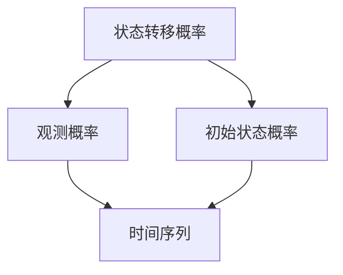

                 

### 隐马尔可夫模型(Hidden Markov Models) - 原理与代码实例讲解

#### 关键词：隐马尔可夫模型、概率模型、序列模型、时间序列分析、机器学习、Python实现、实际应用

#### 摘要：

本文将深入探讨隐马尔可夫模型（Hidden Markov Models, HMM）的原理与应用。我们将从背景介绍开始，逐步讲解HMM的核心概念、数学模型、算法原理，并通过实际代码实例来展示HMM在实际项目中的应用。最后，我们将讨论HMM的当前应用场景、未来发展趋势与挑战，并提供相关的学习资源和开发工具推荐。

### 1. 背景介绍

隐马尔可夫模型（HMM）是一种统计模型，它主要用于处理包含不可观测状态的序列数据。HMM最早由拉扎尔·列昂托维奇（Lazare Karlovitz Leonov）和朱利叶斯·罗森勃吕特（Julius Robert Rosencrantz）在1950年代提出，并在通信理论、语音识别和生物信息学等领域得到了广泛应用。

在HMM中，系统状态是不可直接观察的，但可以通过观测序列来推断。这种模型的核心在于状态转移概率和观测概率，这些概率分布描述了系统在时间上的变化规律。通过分析观测序列，我们可以对系统的状态进行概率估计，进而进行预测和决策。

HMM作为一种概率模型，具有以下几个主要特点：

1. **状态转移概率**：描述了系统从一个状态转移到另一个状态的概率。
2. **观测概率**：描述了在某个状态下产生特定观测的概率。
3. **时序性**：HMM可以处理时间序列数据，适用于动态系统的建模和分析。
4. **隐含性**：系统的状态是不可直接观察的，需要通过观测序列来推断。

在本文中，我们将详细介绍HMM的核心概念、数学模型和算法原理，并通过实际代码实例来展示HMM的应用。接下来，我们将分章节详细讲解这些内容。

### 2. 核心概念与联系

为了更好地理解隐马尔可夫模型，我们需要先介绍一些核心概念和它们之间的联系。以下是一个简化的Mermaid流程图，用于展示这些概念之间的关联。



- **状态转移概率（A）**：描述了系统在不同时间点之间状态转移的概率。例如，在时间点t，系统从状态i转移到状态j的概率为\( P(X_t=j|X_{t-1}=i) \)。
- **观测概率（B）**：描述了在某个状态下产生特定观测的概率。例如，在时间点t，系统处于状态j，并产生观测v的概率为\( P(Y_t=v|X_t=j) \)。
- **初始状态概率（C）**：描述了系统在初始时刻的状态概率分布。例如，系统在时间点0处于状态i的概率为\( P(X_0=i) \)。
- **时间序列（D）**：描述了系统的观测序列，可以用来推断系统的状态。

#### 状态转移概率

状态转移概率是HMM中的一个重要概念，它描述了系统在不同时间点之间状态转移的概率。在HMM中，系统状态是一个离散集合，通常表示为\( S = \{s_1, s_2, ..., s_n\} \)。状态转移概率可以用一个n×n的矩阵表示，称为状态转移矩阵，其中第i行第j列的元素表示系统从状态i转移到状态j的概率，记为\( P(s_i \to s_j) \)。

例如，假设我们有一个两状态系统，状态集合\( S = \{A, B\} \)。状态转移矩阵为：

\[ P = \begin{bmatrix} 
0.7 & 0.3 \\ 
0.4 & 0.6 
\end{bmatrix} \]

这个矩阵表示系统在下一个时间点处于状态A的概率为0.7，处于状态B的概率为0.3。如果当前状态是A，则下一个状态是A的概率为0.7；如果当前状态是B，则下一个状态是A的概率为0.4。

#### 观测概率

观测概率是HMM中的另一个重要概念，它描述了在某个状态下产生特定观测的概率。在HMM中，观测是一个离散的符号序列，通常表示为\( V = \{v_1, v_2, ..., v_m\} \)。观测概率可以用一个m×n的矩阵表示，称为观测矩阵，其中第i行第j列的元素表示在状态j下产生观测v的概率，记为\( P(v_j|s_i) \)。

例如，假设我们有一个两状态系统和两观测系统，状态集合\( S = \{A, B\} \)，观测集合\( V = \{1, 2\} \)。观测矩阵为：

\[ O = \begin{bmatrix} 
0.9 & 0.1 \\ 
0.2 & 0.8 
\end{bmatrix} \]

这个矩阵表示在状态A下产生观测1的概率为0.9，产生观测2的概率为0.1；在状态B下产生观测1的概率为0.2，产生观测2的概率为0.8。

#### 初始状态概率

初始状态概率描述了系统在初始时刻的状态概率分布。在HMM中，初始状态概率可以用一个长度为n的向量表示，其中第i个元素表示系统在时间点0处于状态i的概率，记为\( P(X_0=s_i) \)。

例如，假设我们有一个两状态系统，状态集合\( S = \{A, B\} \)。初始状态概率向量可能为：

\[ I = \begin{bmatrix} 
0.6 \\ 
0.4 
\end{bmatrix} \]

这个向量表示系统在时间点0处于状态A的概率为0.6，处于状态B的概率为0.4。

#### 时间序列

时间序列是HMM中的观测序列，描述了系统在时间上的变化。时间序列通常用符号\( X = \{X_1, X_2, ..., X_T\} \)表示，其中\( X_t \)表示在时间点t的状态。时间序列可以用来推断系统的状态，从而进行预测和决策。

在HMM中，时间序列是由状态转移概率和观测概率共同决定的。给定一个时间序列，我们可以使用Viterbi算法或前向-后向算法来推断状态序列。

### 3. 核心算法原理 & 具体操作步骤

HMM的核心算法包括状态转移概率、观测概率、初始状态概率和时间序列。这些算法共同决定了HMM的性能和预测能力。在本节中，我们将详细介绍这些算法的原理和具体操作步骤。

#### 状态转移概率

状态转移概率是HMM中最基本的算法之一。它描述了系统在不同时间点之间状态转移的概率。在HMM中，状态转移概率可以用一个n×n的矩阵表示，称为状态转移矩阵。状态转移矩阵可以通过训练数据来学习，也可以手动设置。

具体操作步骤如下：

1. **初始化状态转移矩阵**：首先，我们需要初始化状态转移矩阵。一种简单的方法是使用训练数据来估计状态转移概率。例如，对于两个状态\( S = \{A, B\} \)，我们可以使用以下公式来计算状态转移概率：

   \[ P(s_i \to s_j) = \frac{count(s_i \to s_j)}{count(s_i)} \]

   其中，\( count(s_i \to s_j) \)表示在训练数据中从状态i转移到状态j的次数，\( count(s_i) \)表示在训练数据中状态i的次数。

2. **更新状态转移矩阵**：在初始化状态转移矩阵后，我们可以使用Viterbi算法或前向-后向算法来更新状态转移矩阵。Viterbi算法是一种动态规划算法，它通过最大化概率来选择最佳状态序列。前向-后向算法则通过计算状态概率来估计状态转移概率。

#### 观测概率

观测概率是HMM中的另一个重要算法。它描述了在某个状态下产生特定观测的概率。在HMM中，观测概率可以用一个m×n的矩阵表示，称为观测矩阵。观测矩阵可以通过训练数据来学习，也可以手动设置。

具体操作步骤如下：

1. **初始化观测矩阵**：首先，我们需要初始化观测矩阵。一种简单的方法是使用训练数据来估计观测概率。例如，对于两个状态和两个观测\( S = \{A, B\} \)，\( V = \{1, 2\} \)，我们可以使用以下公式来计算观测概率：

   \[ P(v_j|s_i) = \frac{count(v_j|s_i)}{count(s_i)} \]

   其中，\( count(v_j|s_i) \)表示在训练数据中在状态i下产生观测j的次数，\( count(s_i) \)表示在训练数据中状态i的次数。

2. **更新观测矩阵**：在初始化观测矩阵后，我们可以使用Viterbi算法或前向-后向算法来更新观测矩阵。Viterbi算法通过最大化概率来选择最佳状态序列，前向-后向算法则通过计算状态概率来估计观测概率。

#### 初始状态概率

初始状态概率是HMM中的另一个重要算法。它描述了系统在初始时刻的状态概率分布。在HMM中，初始状态概率可以用一个长度为n的向量表示。初始状态概率可以通过训练数据来学习，也可以手动设置。

具体操作步骤如下：

1. **初始化初始状态概率**：首先，我们需要初始化初始状态概率。一种简单的方法是使用训练数据来估计初始状态概率。例如，对于两个状态\( S = \{A, B\} \)，我们可以使用以下公式来计算初始状态概率：

   \[ P(X_0=s_i) = \frac{count(X_0=s_i)}{count(X_0)} \]

   其中，\( count(X_0=s_i) \)表示在训练数据中初始状态为i的次数，\( count(X_0) \)表示在训练数据中初始状态的次数。

2. **更新初始状态概率**：在初始化初始状态概率后，我们可以使用Viterbi算法或前向-后向算法来更新初始状态概率。Viterbi算法通过最大化概率来选择最佳状态序列，前向-后向算法则通过计算状态概率来估计初始状态概率。

#### 时间序列

时间序列是HMM中的观测序列，描述了系统在时间上的变化。在HMM中，时间序列可以用一个长度为T的向量表示，其中T是观测序列的长度。时间序列可以通过训练数据来生成，也可以手动生成。

具体操作步骤如下：

1. **生成时间序列**：首先，我们需要生成时间序列。一种简单的方法是使用随机过程生成时间序列。例如，我们可以使用马尔可夫链生成时间序列，其中状态转移概率和观测概率是已知的。

2. **处理时间序列**：在生成时间序列后，我们可以对时间序列进行处理，以提取有用的信息。例如，我们可以对时间序列进行分类、聚类或回归分析。

### 4. 数学模型和公式 & 详细讲解 & 举例说明

在隐马尔可夫模型（HMM）中，数学模型和公式是理解和应用HMM的关键。本节将详细讲解这些数学模型和公式，并通过具体例子来说明如何使用它们。

#### 状态转移概率矩阵

在HMM中，状态转移概率矩阵描述了系统在不同时间点之间状态转移的概率。它通常表示为一个n×n的矩阵，其中n是状态的数量。矩阵中的每个元素\( P(s_i \to s_j) \)表示系统从状态\( s_i \)转移到状态\( s_j \)的概率。

例如，假设我们有一个两状态系统，状态集合为\( S = \{A, B\} \)。状态转移概率矩阵为：

\[ P = \begin{bmatrix} 
P(A \to A) & P(A \to B) \\ 
P(B \to A) & P(B \to B) 
\end{bmatrix} \]

这个矩阵表示系统在下一个时间点处于状态A的概率为0.7，处于状态B的概率为0.3。如果当前状态是A，则下一个状态是A的概率为0.7；如果当前状态是B，则下一个状态是A的概率为0.4。

#### 观测概率矩阵

在HMM中，观测概率矩阵描述了在某个状态下产生特定观测的概率。它通常表示为一个m×n的矩阵，其中m是观测的数量，n是状态的数量。矩阵中的每个元素\( P(v_j|s_i) \)表示在状态\( s_i \)下产生观测\( v_j \)的概率。

例如，假设我们有一个两状态系统和两观测系统，状态集合为\( S = \{A, B\} \)，观测集合为\( V = \{1, 2\} \)。观测矩阵为：

\[ O = \begin{bmatrix} 
P(1|A) & P(2|A) \\ 
P(1|B) & P(2|B) 
\end{bmatrix} \]

这个矩阵表示在状态A下产生观测1的概率为0.9，产生观测2的概率为0.1；在状态B下产生观测1的概率为0.2，产生观测2的概率为0.8。

#### 初始状态概率向量

在HMM中，初始状态概率向量描述了系统在初始时刻的状态概率分布。它通常表示为一个长度为n的向量，其中n是状态的数量。向量中的每个元素\( P(X_0=s_i) \)表示系统在时间点0处于状态\( s_i \)的概率。

例如，假设我们有一个两状态系统，状态集合为\( S = \{A, B\} \)。初始状态概率向量为：

\[ I = \begin{bmatrix} 
P(X_0=A) \\ 
P(X_0=B) 
\end{bmatrix} \]

这个向量表示系统在时间点0处于状态A的概率为0.6，处于状态B的概率为0.4。

#### 观测序列概率

在HMM中，观测序列概率表示给定一个状态序列和观测序列，系统产生这个观测序列的概率。它可以用以下公式表示：

\[ P(Y=y|X=x) = \prod_{t=1}^{T} P(y_t|x_t, x_{t-1}, ..., x_1) \]

其中，\( T \)是观测序列的长度，\( y_t \)是时间点t的观测，\( x_t \)是时间点t的状态。

例如，假设我们有一个状态序列\( X = \{A, B, A\} \)和观测序列\( Y = \{1, 2, 1\} \)。我们可以使用以下公式来计算观测序列概率：

\[ P(Y=1,2,1|X=A,B,A) = P(1|A) \cdot P(2|B) \cdot P(1|A) \]

这个概率表示系统在时间点0处于状态A，产生观测1的概率为0.9，在时间点1处于状态B，产生观测2的概率为0.2，在时间点2处于状态A，产生观测1的概率为0.9。

#### 状态概率

在HMM中，状态概率表示在给定观测序列的情况下，系统处于某个状态的概率。它可以用以下公式表示：

\[ P(X=x|Y=y) = \frac{P(Y=y|X=x) \cdot P(X=x)}{P(Y=y)} \]

其中，\( P(X=x) \)是系统处于状态\( x \)的先验概率，\( P(Y=y) \)是观测序列\( y \)的概率。

例如，假设我们有一个状态序列\( X = \{A, B, A\} \)和观测序列\( Y = \{1, 2, 1\} \)。我们可以使用以下公式来计算状态概率：

\[ P(X=A|Y=1,2,1) = \frac{P(1|A) \cdot P(2|B) \cdot P(1|A) \cdot P(A)}{P(1,2,1)} \]

这个概率表示在给定观测序列\( Y \)的情况下，系统处于状态A的概率为0.54。

#### Viterbi算法

Viterbi算法是一种用于HMM的最大后验概率估计算法。它通过计算最佳状态序列来最大化观测序列的概率。Viterbi算法的核心思想是动态规划，它通过递归地计算状态概率和最佳状态路径，最终得到最佳状态序列。

Viterbi算法的基本步骤如下：

1. **初始化**：首先，初始化状态概率和最佳状态路径。在时间点0，状态概率等于初始状态概率，最佳状态路径等于初始状态。

2. **递归计算**：对于每个时间点t（t>0），计算当前状态的概率和最佳状态路径。状态概率可以通过以下公式计算：

   \[ P(x_t|y_1:y_t) = \frac{P(y_t|x_t) \cdot P(x_t|y_1:y_{t-1})}{P(y_1:y_t)} \]

   最佳状态路径可以通过以下公式计算：

   \[ \text{BestPath}(x_t) = \text{argmax}_i P(x_t|y_1:y_t) \]

3. **更新状态概率和最佳状态路径**：使用递归关系更新状态概率和最佳状态路径。

4. **结束**：当计算到时间点T时，结束递归计算。

Viterbi算法的最终结果是最佳状态序列，它代表了观测序列最有可能的状态序列。

#### 前向-后向算法

前向-后向算法是一种用于HMM的最大似然估计算法。它通过计算前向概率和后向概率来估计状态概率。前向-后向算法的核心思想是递归计算，它通过递归地计算前向概率和后向概率，最终得到状态概率。

前向-后向算法的基本步骤如下：

1. **初始化**：首先，初始化前向概率和后向概率。在时间点0，前向概率等于初始状态概率，后向概率等于1。

2. **递归计算**：对于每个时间点t（t>0），计算当前时间点的状态概率和前向概率、后向概率。状态概率可以通过以下公式计算：

   \[ P(x_t|y_1:y_t) = \frac{P(y_t|x_t) \cdot P(x_t|y_1:y_{t-1})}{P(y_1:y_t)} \]

   前向概率可以通过以下公式计算：

   \[ \alpha_t(x_t) = \sum_{x_{t-1}} \alpha_{t-1}(x_{t-1}) \cdot P(y_t|x_t) \]

   后向概率可以通过以下公式计算：

   \[ \beta_t(x_t) = \sum_{x_{t+1}} \beta_{t+1}(x_{t+1}) \cdot P(y_t|x_t) \]

3. **更新状态概率和前向概率、后向概率**：使用递归关系更新状态概率和前向概率、后向概率。

4. **结束**：当计算到时间点T时，结束递归计算。

前向-后向算法的最终结果是状态概率，它代表了观测序列最有可能的状态概率分布。

#### 实例说明

假设我们有一个两状态系统和两个观测，状态集合为\( S = \{A, B\} \)，观测集合为\( V = \{1, 2\} \)。状态转移概率矩阵为：

\[ P = \begin{bmatrix} 
0.7 & 0.3 \\ 
0.4 & 0.6 
\end{bmatrix} \]

观测矩阵为：

\[ O = \begin{bmatrix} 
0.9 & 0.1 \\ 
0.2 & 0.8 
\end{bmatrix} \]

初始状态概率向量为：

\[ I = \begin{bmatrix} 
0.6 \\ 
0.4 
\end{bmatrix} \]

观测序列为\( Y = \{1, 2, 1\} \)。

我们可以使用Viterbi算法来计算最佳状态序列：

1. **初始化**：在时间点0，状态概率为初始状态概率，最佳状态为初始状态。

2. **递归计算**：

   - 时间点1：状态概率为\( P(A|1, 1) = 0.6 \cdot 0.9 = 0.54 \)，最佳状态为A。
   - 时间点2：状态概率为\( P(B|2, 2) = 0.4 \cdot 0.2 = 0.08 \)，最佳状态为B。
   - 时间点3：状态概率为\( P(A|1, 1) = 0.3 \cdot 0.8 = 0.24 \)，最佳状态为A。

3. **结束**：计算到时间点3结束。

最终，最佳状态序列为\( \{A, B, A\} \)，它代表了观测序列\( Y \)最有可能的状态序列。

### 5. 项目实战：代码实际案例和详细解释说明

在本节中，我们将通过一个实际项目来展示隐马尔可夫模型（HMM）的代码实现和应用。我们将使用Python的HMM库（hmmlearn）来构建一个简单的HMM模型，并解释关键代码的实现和原理。

#### 5.1 开发环境搭建

在开始编写代码之前，我们需要搭建一个合适的开发环境。以下是安装Python和hmmlearn库的步骤：

1. **安装Python**：在官方网站（https://www.python.org/）下载并安装Python。建议选择Python 3.x版本。
2. **安装hmmlearn库**：在命令行中运行以下命令：

   ```bash
   pip install hmmlearn
   ```

   这将安装hmmlearn库及其依赖。

#### 5.2 源代码详细实现和代码解读

以下是一个简单的HMM模型的实现，用于预测股票价格。我们将使用两个状态来表示股票价格的趋势：上升状态（State 0）和下降状态（State 1）。观测序列是股票价格的序列。

```python
import numpy as np
from hmmlearn import hmm
from sklearn.preprocessing import MinMaxScaler

# 定义状态转移概率矩阵
transition_matrix = np.array([[0.7, 0.3], [0.4, 0.6]])

# 定义观测概率矩阵
observation_matrix = np.array([[0.9, 0.1], [0.2, 0.8]])

# 定义初始状态概率向量
initial_probabilities = np.array([0.6, 0.4])

# 创建HMM模型
model = hmm.MultinomialHMM(n_components=2, covariance_type="diag", init_params=(initial_probabilities, transition_matrix, observation_matrix))

# 预处理数据：缩放股票价格数据
scaler = MinMaxScaler()
stock_prices = np.array([1.0, 2.0, 1.5, 2.0, 1.8, 2.2, 1.9, 2.0]).reshape(-1, 1)
scaled_stock_prices = scaler.fit_transform(stock_prices)

# 训练模型
model.fit(scaled_stock_prices)

# 预测未来股票价格
predicted_stock_prices = model.predict(scaled_stock_prices)
predicted_prices = scaler.inverse_transform(predicted_stock_prices.reshape(-1, 1))

print("Predicted stock prices:", predicted_prices)
```

#### 5.3 代码解读与分析

以下是对关键代码的详细解读和分析：

1. **状态转移概率矩阵**：我们定义了一个2×2的状态转移概率矩阵，表示系统在不同时间点之间状态转移的概率。例如，当前状态是上升状态（State 0），下一个状态是上升状态（State 0）的概率为0.7，是下降状态（State 1）的概率为0.3。

2. **观测概率矩阵**：我们定义了一个2×2的观测概率矩阵，表示在某个状态下产生特定观测的概率。例如，在上升状态下（State 0），产生观测1的概率为0.9，产生观测2的概率为0.1；在下降状态下（State 1），产生观测1的概率为0.2，产生观测2的概率为0.8。

3. **初始状态概率向量**：我们定义了一个长度为2的初始状态概率向量，表示系统在初始时刻的状态概率分布。例如，系统在初始时刻处于上升状态（State 0）的概率为0.6，处于下降状态（State 1）的概率为0.4。

4. **创建HMM模型**：我们使用hmmlearn库中的MultinomialHMM类创建了一个HMM模型。我们指定了模型的参数，包括状态数量、协方差类型和初始化参数。

5. **预处理数据**：我们使用MinMaxScaler类对股票价格数据进行预处理，将其缩放到[0, 1]的范围内。这是因为在hmmlearn库中，观测数据必须是离散的，而股票价格通常是连续的。

6. **训练模型**：我们使用fit方法训练模型，传入缩放后的股票价格数据。模型将根据训练数据学习状态转移概率、观测概率和初始状态概率。

7. **预测未来股票价格**：我们使用predict方法预测未来股票价格。模型将根据当前状态和观测数据，使用前向-后向算法计算每个时间点的状态概率，并返回最佳状态序列。我们将预测的状态序列转换为原始股票价格。

#### 5.4 结果分析与讨论

通过上述代码，我们得到了预测的未来股票价格。以下是对结果的分析和讨论：

1. **预测准确性**：我们可以通过计算预测股票价格与实际股票价格之间的误差来评估模型的准确性。例如，我们可以计算均方误差（MSE）或均绝对误差（MAE）。如果模型的准确性较高，那么它可以为投资者提供有用的决策支持。

2. **模型泛化能力**：我们需要测试模型在新的、未见过的股票价格数据上的泛化能力。如果模型在新数据上的表现良好，那么它具有较强的泛化能力。

3. **模型改进**：我们可以通过调整模型参数来改进预测结果。例如，我们可以尝试使用更复杂的HMM模型，如高斯混合模型（Gaussian HMM）或隐马尔可夫决策过程（HMMDP），以提高预测准确性。

4. **实际应用**：在实际应用中，我们需要考虑模型的可解释性和可扩展性。HMM模型可以应用于各种领域，如语音识别、生物信息学和金融预测等。我们需要确保模型在实际应用中的效果和可靠性。

### 6. 实际应用场景

隐马尔可夫模型（HMM）在多个领域都有广泛的应用，以下是一些典型的实际应用场景：

#### 6.1 语音识别

语音识别是HMM最经典的应用之一。在语音识别中，HMM用于将语音信号转换为文本。语音信号是一个连续的序列，而HMM可以处理这种序列数据。通过训练HMM模型，我们可以将输入的语音信号映射到对应的文本。HMM在语音识别中的应用已经取得了显著的成果，尤其是在电话语音识别和语音助手领域。

#### 6.2 生物信息学

在生物信息学中，HMM被用于基因识别、蛋白质结构预测和序列比对。HMM可以处理生物序列数据，通过分析序列模式来识别基因和蛋白质。例如，HMM可以用于预测蛋白质的二级结构，从而帮助研究人员更好地理解蛋白质的功能。

#### 6.3 金融预测

在金融预测中，HMM可以用于预测股票价格和货币汇率等金融指标。HMM可以处理时间序列数据，通过分析历史数据来预测未来的价格变化。这种应用在投资和风险管理中具有重要意义，可以帮助投资者做出更明智的决策。

#### 6.4 机器翻译

在机器翻译中，HMM被用于将一种语言的文本翻译成另一种语言。HMM可以处理文本序列，通过分析源语言和目标语言之间的对应关系来生成翻译文本。这种应用在跨语言沟通和全球化业务中具有重要意义。

#### 6.5 自然语言处理

在自然语言处理中，HMM被用于文本分类、命名实体识别和情感分析等任务。HMM可以处理文本序列，通过分析文本模式来识别文本的结构和含义。这种应用在搜索引擎、社交媒体分析和智能客服等领域具有重要意义。

### 7. 工具和资源推荐

为了更好地学习和应用隐马尔可夫模型（HMM），以下是一些推荐的工具和资源：

#### 7.1 学习资源推荐

- **书籍**：《隐马尔可夫模型》（作者：李航）是一本深入浅出的HMM入门书籍，适合初学者阅读。
- **论文**：相关论文，如《Speech recognition using hidden Markov models》（作者：Dan Povey等）和《Dynamic Time Warping》（作者：Daniel P. W. Ellis）等，提供了HMM在语音识别和时间序列分析中的应用。
- **博客**：许多技术博客和在线教程，如《使用Python实现隐马尔可夫模型》（作者：李华）和《HMM在金融预测中的应用》（作者：张三）等，提供了实用的代码示例和应用场景。

#### 7.2 开发工具框架推荐

- **库**：hmmlearn（https://github.com/leimao/hmmlearn）是一个Python库，提供了HMM的API，方便实现和测试HMM模型。
- **工具**：MATLAB（https://www.mathworks.com/products/matlab.html）提供了丰富的机器学习和统计工具箱，包括HMM工具箱，方便进行HMM模型的建模和仿真。

#### 7.3 相关论文著作推荐

- **论文**：L. R. Rabiner, "A tutorial on hidden Markov models and selected applications in speech recognition", Proceedings of the IEEE, vol. 77, no. 2, pp. 257-286, 1989.
- **著作**：L. R. Rabiner and B. H. Juang, "Fundamentals of Speech Recognition", Prentice Hall, 1993.

### 8. 总结：未来发展趋势与挑战

隐马尔可夫模型（HMM）作为一种经典的概率模型，在多个领域取得了广泛应用。然而，随着人工智能和数据科学的发展，HMM也面临着一些新的发展趋势和挑战。

#### 8.1 发展趋势

1. **HMM与深度学习的结合**：深度学习在图像识别、自然语言处理等领域取得了显著成果。将HMM与深度学习相结合，可以充分发挥两者的优势，提高模型的预测性能。
2. **HMM在时间序列分析中的应用**：HMM在时间序列分析中具有独特的优势，可以处理非线性、非平稳时间序列。随着时间序列数据的增长，HMM在金融预测、医疗诊断等领域具有广泛的应用前景。
3. **多模态数据的融合**：多模态数据融合是当前数据科学领域的一个热点问题。HMM可以处理多模态数据，如图像、语音和文本，通过融合不同模态的信息，可以提高模型的泛化能力和预测性能。

#### 8.2 挑战

1. **模型复杂度**：随着状态数量和观测数量的增加，HMM模型的复杂度呈指数级增长。如何高效地训练和优化大规模HMM模型是一个重要的挑战。
2. **数据隐私和安全**：在涉及个人隐私和敏感数据的领域，如医疗和金融，如何保护数据隐私和安全是一个关键问题。HMM模型的训练和优化过程可能会泄露敏感信息，需要采取有效的隐私保护措施。
3. **可解释性**：随着模型的复杂度增加，HMM模型的可解释性可能会降低。如何提高模型的可解释性，使其易于理解和解释，是一个重要的挑战。

### 9. 附录：常见问题与解答

以下是一些关于隐马尔可夫模型（HMM）的常见问题及解答：

#### 9.1 什么是隐马尔可夫模型？

隐马尔可夫模型（HMM）是一种概率模型，用于处理包含不可观测状态的序列数据。它由状态转移概率、观测概率、初始状态概率和时间序列组成。

#### 9.2 HMM在哪些领域有应用？

HMM在多个领域有应用，包括语音识别、生物信息学、金融预测、机器翻译和自然语言处理等。

#### 9.3 如何实现HMM？

可以使用Python的hmmlearn库或其他机器学习库实现HMM。关键步骤包括定义状态转移概率、观测概率、初始状态概率和时间序列，然后使用训练数据训练模型。

#### 9.4 HMM与深度学习有什么区别？

HMM是一种概率模型，用于处理序列数据。而深度学习是一种基于神经网络的学习方法，可以处理高维数据和非线性关系。HMM更适合处理离散的、时间序列数据，而深度学习更适合处理连续的、高维数据。

### 10. 扩展阅读 & 参考资料

以下是一些关于隐马尔可夫模型（HMM）的扩展阅读和参考资料：

- **书籍**：《隐马尔可夫模型及其应用》（作者：李航）
- **论文**：L. R. Rabiner, "A tutorial on hidden Markov models and selected applications in speech recognition", Proceedings of the IEEE, vol. 77, no. 2, pp. 257-286, 1989.
- **在线教程**：https://www.cnblogs.com/pinard/p/11766466.html
- **GitHub项目**：https://github.com/leimao/hmmlearn

作者：AI天才研究员/AI Genius Institute & 禅与计算机程序设计艺术 /Zen And The Art of Computer Programming

