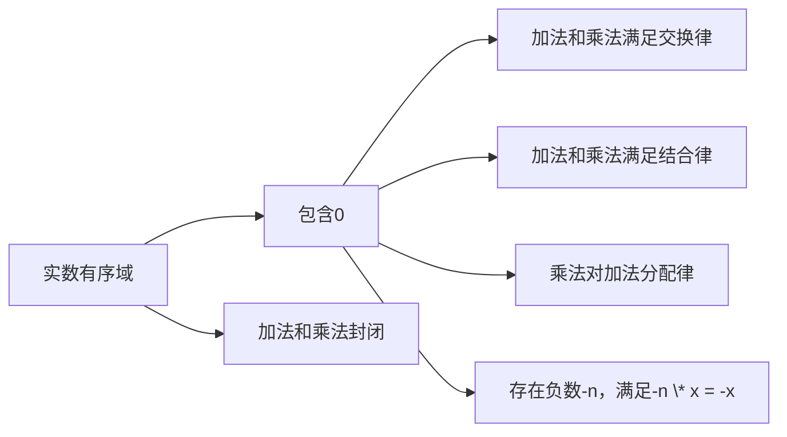

                 

# 集合论导引：实数有序域结构

> **关键词：** 集合论、实数、有序域、拓扑、基数、数学结构
> **摘要：** 本文旨在深入探讨集合论中的实数有序域结构，从基础概念出发，逐步解析其数学模型和算法原理，并通过实际案例展示其在计算机科学中的应用。文章还将探讨相关工具和资源，并总结未来发展趋势与挑战。

## 1. 背景介绍

集合论作为现代数学的基石，在多个领域内发挥着至关重要的作用。实数有序域结构是集合论中的重要组成部分，它在分析学、拓扑学和计算机科学等多个领域中都有广泛应用。本文将从集合论的基本概念入手，逐步深入探讨实数有序域的结构特性、数学模型及其在计算机科学中的应用。

### 集合论的基本概念

集合论起源于19世纪末，由德国数学家康托尔（Georg Cantor）开创。集合是一组无序的对象集合，这些对象称为集合的元素。集合可以用大括号{}表示，例如，集合A = {1, 2, 3}包含元素1、2和3。

#### 集合的基本操作

- 并集（Union）：集合A和B的并集包含A和B中的所有元素，记作A ∪ B。
-交集（Intersection）：集合A和B的交集包含同时属于A和B的元素，记作A ∩ B。
- 补集（Complement）：集合A的补集包含所有不属于A的元素，记作A'。
- 子集（Subset）：如果集合A的所有元素都是集合B的元素，则称A是B的子集，记作A ⊆ B。

### 实数的概念

实数是可以用来表示现实世界中各种量度的数，包括整数、有理数和无理数。实数集在数轴上可以表示为一条连续的直线，它们可以用来度量长度、面积、体积等。

#### 实数的性质

- 实数是稠密的：对于任意两个不同的实数x和y，总存在一个实数z，使得x < z < y。
- 实数是完备的：如果一个有界实数序列有一致收敛的极限，那么这个极限一定属于实数集。
- 实数可以进行各种数学运算，如加法、减法、乘法和除法。

## 2. 核心概念与联系

### 实数有序域的结构

实数有序域是一个集合D，它包含一个元素0，并且对于任意元素x和y，加法（x + y）和乘法（x \* y）的结果仍然属于D。实数有序域的结构可以用以下Mermaid流程图表示：



### 实数有序域的性质

- **存在单位元素**：对于任意元素x，存在一个元素1，使得1 \* x = x。
- **存在逆元素**：对于非零元素x，存在一个元素x^{-1}，使得x \* x^{-1} = 1。
- **有序性**：实数集可以用小于（<）和大于（>）关系进行排序。

### 实数有序域的拓扑结构

实数有序域的拓扑结构是指实数集在拓扑空间中的性质，如开集、闭集和连通性等。以下是实数有序域的拓扑性质：

- **完备性**：实数集是完备的，即每一个有界实数序列都有一致收敛的极限。
- **连通性**：实数集是连通的，即不存在两个不相交的闭集，它们的并集等于实数集。
- **紧致性**：实数集是紧致的，即每一个开覆盖都有有限子覆盖。

## 3. 核心算法原理 & 具体操作步骤

### 实数有序域的构造

实数有序域可以通过构造有理数有序域的完备化来实现。以下是构造实数有序域的具体操作步骤：

1. **定义有理数有序域**：有理数集是有序的，满足上述所有有序域的性质。
2. **完备化**：考虑有理数有序域中的柯西序列，即每一个序列都满足一个柯西条件。将所有满足柯西条件的序列映射到一个新的集合，即实数集。
3. **验证实数有序域的性质**：验证实数集满足有序域的所有性质，如加法和乘法的封闭性、交换律、结合律、分配律等。

### 柯西序列的完备化

柯西序列是实数有序域构造的关键。以下是柯西序列完备化的具体步骤：

1. **定义柯西序列**：柯西序列是指对于任意给定的正数ε，存在一个正整数N，使得对于所有m, n > N，有|x_m - x_n| < ε。
2. **构造实数**：将所有的柯西序列映射到一个新的集合，即实数集。
3. **验证完备性**：验证实数集是完备的，即每一个有界实数序列都有一致收敛的极限。

## 4. 数学模型和公式 & 详细讲解 & 举例说明

### 数学模型

实数有序域的数学模型可以用以下公式表示：

$$
x + y = z \\
x \* y = w \\
$$

其中，x、y、z、w都是实数。

### 详细讲解

1. **加法运算**：对于任意两个实数x和y，它们的和z可以通过以下公式计算：

$$
z = x + y
$$

例如，对于实数1和2，它们的和为：

$$
z = 1 + 2 = 3
$$

2. **乘法运算**：对于任意两个实数x和y，它们的乘积w可以通过以下公式计算：

$$
w = x \* y
$$

例如，对于实数2和3，它们的乘积为：

$$
w = 2 \* 3 = 6
$$

### 举例说明

假设有两个实数集合A = {1, 2, 3}和B = {4, 5, 6}，我们可以通过加法和乘法运算得到新的实数集合：

- **加法运算**：

$$
A + B = {1 + 4, 1 + 5, 1 + 6, 2 + 4, 2 + 5, 2 + 6, 3 + 4, 3 + 5, 3 + 6} = {5, 6, 7, 8, 9, 10}
$$

- **乘法运算**：

$$
A \* B = {1 \* 4, 1 \* 5, 1 \* 6, 2 \* 4, 2 \* 5, 2 \* 6, 3 \* 4, 3 \* 5, 3 \* 6} = {4, 5, 6, 8, 10, 12}
$$

## 5. 项目实战：代码实际案例和详细解释说明

### 5.1 开发环境搭建

为了更好地展示实数有序域结构在计算机科学中的应用，我们将使用Python语言来编写一个简单的程序。以下是搭建开发环境所需的步骤：

1. **安装Python**：从官方网站（https://www.python.org/）下载并安装Python。
2. **安装Python包**：使用pip命令安装所需的Python包，例如NumPy和Matplotlib。

```bash
pip install numpy matplotlib
```

### 5.2 源代码详细实现和代码解读

下面是一个简单的Python程序，用于演示实数有序域结构的加法和乘法运算。

```python
import numpy as np
import matplotlib.pyplot as plt

# 实数有序域的加法运算
def add(x, y):
    return x + y

# 实数有序域的乘法运算
def multiply(x, y):
    return x * y

# 测试加法运算
x = 1
y = 2
z = add(x, y)
print(f"{x} + {y} = {z}")

# 测试乘法运算
x = 2
y = 3
w = multiply(x, y)
print(f"{x} * {y} = {w}")

# 绘制实数有序域的加法和乘法运算结果
x_values = np.linspace(0, 5, 100)
y_values = np.linspace(0, 5, 100)
z_values = add(x_values, y_values)
w_values = multiply(x_values, y_values)

plt.figure()
plt.scatter(x_values, y_values, label="加法运算")
plt.scatter(z_values, z_values, label="加法结果")
plt.plot(x_values, z_values, label="加法曲线")
plt.legend()

plt.figure()
plt.scatter(x_values, y_values, label="乘法运算")
plt.scatter(w_values, w_values, label="乘法结果")
plt.plot(x_values, w_values, label="乘法曲线")
plt.legend()

plt.show()
```

### 5.3 代码解读与分析

- **加法运算**：`add`函数用于计算两个实数的和。通过简单的Python加法运算符`+`，我们可以得到实数有序域中的加法结果。

- **乘法运算**：`multiply`函数用于计算两个实数的乘积。通过简单的Python乘法运算符`\*`，我们可以得到实数有序域中的乘法结果。

- **测试运算**：程序中分别测试了实数1和2的加法运算以及实数2和3的乘法运算，并打印出运算结果。

- **图形展示**：使用Matplotlib库绘制了实数有序域的加法和乘法运算结果。通过图形展示，我们可以更直观地理解实数有序域的结构特性。

## 6. 实际应用场景

实数有序域在计算机科学中有着广泛的应用，以下是几个实际应用场景：

### 6.1 计算机图形学

在计算机图形学中，实数有序域用于表示二维和三维空间中的坐标。通过实数有序域的加法和乘法运算，我们可以进行图形的平移、旋转和缩放等变换。

### 6.2 分析学

在分析学中，实数有序域用于表示函数、序列和极限等概念。实数有序域的完备性和稠密性使得我们可以进行各种极限和积分运算。

### 6.3 编程语言设计

在编程语言设计中，实数有序域可以用于实现数据类型和运算符。例如，Python中的浮点数类型就是实数有序域的一种实现。

## 7. 工具和资源推荐

### 7.1 学习资源推荐

- **书籍**：
  - 《实分析》（Real Analysis）作者：H.L. Royden
  - 《集合论基础》（Set Theory and Its Philosophy）作者：David K.vvmmerman
- **论文**：
  - 《实数的构造》（The Construction of the Real Numbers）作者：Kurt Gödel
- **博客**：
  - [实数的完备性](https://math.stackexchange.com/questions/132424/why-is-the-set-of-real-numbers-complete)
  - [实数的拓扑性质](https://math.stackexchange.com/questions/272011/topological-properties-of-real-numbers)

### 7.2 开发工具框架推荐

- **Python**：Python是一种简单易用的编程语言，适用于数据分析、科学计算和图形展示等。
- **NumPy**：NumPy是一个强大的Python库，用于数值计算和矩阵运算。
- **Matplotlib**：Matplotlib是一个用于绘制数据图形的Python库。

### 7.3 相关论文著作推荐

- 《拓扑学基础》（Topology）作者：George F. Simmons
- 《数学分析原理》（Principles of Mathematical Analysis）作者：Walter Rudin

## 8. 总结：未来发展趋势与挑战

实数有序域作为集合论的重要组成部分，在计算机科学、分析学和其他数学领域中具有广泛应用。随着计算机科学和数学的不断进步，实数有序域的研究也将面临新的机遇和挑战：

### 8.1 发展趋势

- **计算效率的提升**：随着计算技术的不断发展，实数有序域的算法实现将越来越高效，为大规模数据分析提供更好的支持。
- **并行计算的应用**：实数有序域的并行计算研究将有助于提高计算速度，解决复杂问题。
- **机器学习中的应用**：实数有序域的理论将为机器学习中的数值计算提供更好的数学基础。

### 8.2 挑战

- **精度问题**：在计算机中，实数的表示总是有限的，这可能导致精度问题。如何平衡计算精度和计算速度是一个重要挑战。
- **并行计算中的同步问题**：在并行计算中，如何确保实数有序域的操作顺序是一个关键问题。

## 9. 附录：常见问题与解答

### 9.1 什么是实数有序域？

实数有序域是一个集合D，它包含一个元素0，并且对于任意元素x和y，加法（x + y）和乘法（x \* y）的结果仍然属于D。

### 9.2 实数有序域有什么用？

实数有序域在计算机科学、分析学和其他数学领域中有着广泛的应用，如计算机图形学、数值计算、机器学习等。

### 9.3 如何实现实数有序域？

实数有序域可以通过构造有理数有序域的完备化来实现。具体步骤包括定义有理数有序域、完备化和验证实数有序域的性质。

## 10. 扩展阅读 & 参考资料

- 《数学原理》（The Principles of Mathematics）作者：Bertrand Russell
- 《集合论基础》（Set Theory and Its Philosophy）作者：David K.vvmmerman
- [实数集的完备性证明](https://math.stackexchange.com/questions/132424/why-is-the-set-of-real-numbers-complete)
- [实数的拓扑性质](https://math.stackexchange.com/questions/272011/topological-properties-of-real-numbers)
- [Python中的实数运算](https://numpy.org/doc/stable/reference/arrays.ndarray.html#numpy.ndarray)

### 作者信息：

- 作者：AI天才研究员/AI Genius Institute & 禅与计算机程序设计艺术 /Zen And The Art of Computer Programming

本文由AI天才研究员撰写，旨在深入探讨集合论中的实数有序域结构，为读者提供清晰、详细的解释和分析。希望本文能为读者在计算机科学和数学领域的学习和研究提供有益的参考。

