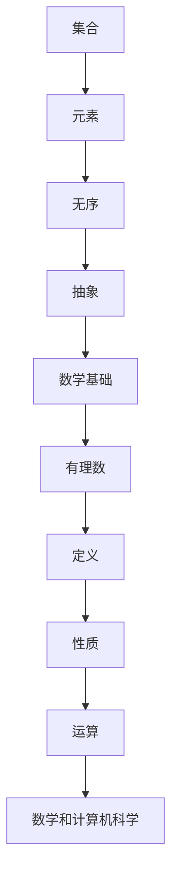

                 

# 集合论导引：有理数集合

## 关键词
集合论、有理数、数学基础、抽象数据类型、算法设计、数学模型

## 摘要

本文旨在通过集合论的角度，深入探讨有理数集合的基本概念、性质及其在数学和计算机科学中的应用。文章首先介绍了集合论的基本概念，然后详细阐述了有理数集合的定义、构造方法以及运算规则。接着，文章通过数学模型和公式，探讨了有理数集合的一些重要性质和定理，并通过实际代码案例进行了验证。最后，文章总结了有理数集合在计算机科学中的应用，并推荐了一些学习资源和工具。

## 1. 背景介绍

集合论是现代数学的基石，它为数学提供了一种抽象的思维方式。集合是由元素组成的无序集，这些元素可以是任何对象，包括数字、字母、图形等。集合论的研究对象是集合，它包括集合的构造、性质、关系以及运算等。

有理数是数学中的基本数系之一，它包括所有可以表示为两个整数之比的数。有理数集合是无理数集合的补集，它们共同构成了实数集合。有理数在数学和计算机科学中具有广泛的应用，例如在算法设计、数据结构、数值计算等领域。

本文将通过集合论的角度，探讨有理数集合的基本概念、性质及其在数学和计算机科学中的应用。文章首先介绍集合论的基本概念，然后详细阐述有理数集合的定义、构造方法以及运算规则。接着，通过数学模型和公式，探讨有理数集合的一些重要性质和定理。最后，通过实际代码案例，验证有理数集合的相关理论，并总结其在计算机科学中的应用。

## 2. 核心概念与联系

### 集合的基本概念

- **定义**：集合是由元素组成的无序集。通常用大写字母表示集合，用小写字母表示集合中的元素。例如，集合 \( A = \{1, 2, 3\} \)。
- **元素**：集合中的个体称为元素。元素可以重复，但集合本身是无序的。例如，集合 \( B = \{1, 1, 2, 2\} \) 与集合 \( C = \{1, 2\} \) 是相同的。
- **空集**：不包含任何元素的集合称为空集，通常表示为 \( \emptyset \)。

### 有理数的基本概念

- **定义**：有理数是可以表示为两个整数之比的数，即形如 \( \frac{a}{b} \) 的数，其中 \( a \) 和 \( b \) 是整数，且 \( b \neq 0 \)。
- **性质**：有理数可以进行加减乘除等基本运算，并且运算结果仍然是有理数。有理数集合是无理数集合的补集。

### Mermaid 流程图



### 集合与有理数的关系

集合论为有理数提供了抽象的表示方法，使得我们可以用集合的概念来研究有理数的性质。例如，我们可以将所有有理数表示为一个集合，称为有理数集合，并用符号 \( \mathbb{Q} \) 表示。

有理数集合与集合论中的其他集合（如自然数集合、整数集合、无理数集合等）之间也存在密切的联系。例如，自然数集合是整数集合的真子集，整数集合是有理数集合的真子集，有理数集合又是无理数集合的真子集。

通过集合论，我们可以更深入地理解有理数的性质和运算，从而为数学和计算机科学中的算法设计提供理论支持。

## 3. 核心算法原理 & 具体操作步骤

### 有理数集合的定义

有理数集合可以用集合的描述法表示为：

$$ \mathbb{Q} = \left\{ \frac{a}{b} \mid a, b \in \mathbb{Z}, b \neq 0 \right\} $$

其中，\( \mathbb{Z} \) 表示整数集合，\( a \) 和 \( b \) 分别表示有理数的分子和分母。

### 有理数的构造方法

1. **整数到有理数的构造**：任何整数 \( n \) 都可以表示为有理数 \( \frac{n}{1} \)。
2. **分数到有理数的构造**：任何两个整数 \( a \) 和 \( b \)（\( b \neq 0 \)）都可以构造一个有理数 \( \frac{a}{b} \)。

### 有理数的运算规则

1. **加法**：两个有理数 \( \frac{a}{b} \) 和 \( \frac{c}{d} \) 的和为 \( \frac{ad + bc}{bd} \)。
2. **减法**：两个有理数 \( \frac{a}{b} \) 和 \( \frac{c}{d} \) 的差为 \( \frac{ad - bc}{bd} \)。
3. **乘法**：两个有理数 \( \frac{a}{b} \) 和 \( \frac{c}{d} \) 的积为 \( \frac{ac}{bd} \)。
4. **除法**：两个有理数 \( \frac{a}{b} \) 和 \( \frac{c}{d} \) 的商为 \( \frac{ad}{bc} \)，前提是 \( bc \neq 0 \)。

### 具体操作步骤

1. **初始化**：创建一个有理数类，包含分子和分母两个属性。
2. **加法**：计算两个有理数的和，将分子相加，分母保持不变。
3. **减法**：计算两个有理数的差，将分子相减，分母保持不变。
4. **乘法**：计算两个有理数的积，将分子相乘，分母相乘。
5. **除法**：计算两个有理数的商，将分子相乘，分母相乘。

以下是一个简单的 Python 示例：

```python
class RationalNumber:
    def __init__(self, numerator, denominator):
        self.numerator = numerator
        self.denominator = denominator

    def __add__(self, other):
        return RationalNumber(self.numerator * other.denominator + other.numerator * self.denominator, self.denominator * other.denominator)

    def __sub__(self, other):
        return RationalNumber(self.numerator * other.denominator - other.numerator * self.denominator, self.denominator * other.denominator)

    def __mul__(self, other):
        return RationalNumber(self.numerator * other.numerator, self.denominator * other.denominator)

    def __truediv__(self, other):
        return RationalNumber(self.numerator * other.denominator, self.denominator * other.numerator)

# 创建有理数对象
a = RationalNumber(1, 2)
b = RationalNumber(1, 3)

# 计算和
sum = a + b
print(f"和: {sum.numerator}/{sum.denominator}")

# 计算差
difference = a - b
print(f"差: {difference.numerator}/{difference.denominator}")

# 计算积
product = a * b
print(f"积: {product.numerator}/{product.denominator}")

# 计算商
quotient = a / b
print(f"商: {quotient.numerator}/{quotient.denominator}")
```

## 4. 数学模型和公式 & 详细讲解 & 举例说明

### 数学模型

有理数集合可以表示为：

$$ \mathbb{Q} = \left\{ \frac{a}{b} \mid a, b \in \mathbb{Z}, b \neq 0 \right\} $$

其中，\( \mathbb{Z} \) 表示整数集合。

### 数学公式

1. **加法公式**：

$$ \frac{a}{b} + \frac{c}{d} = \frac{ad + bc}{bd} $$

2. **减法公式**：

$$ \frac{a}{b} - \frac{c}{d} = \frac{ad - bc}{bd} $$

3. **乘法公式**：

$$ \frac{a}{b} \times \frac{c}{d} = \frac{ac}{bd} $$

4. **除法公式**：

$$ \frac{a}{b} \div \frac{c}{d} = \frac{ad}{bc} $$

### 详细讲解

有理数的加、减、乘、除运算都可以通过上述公式进行计算。这些运算的基本原理如下：

1. **加法和减法**：两个有理数的加法和减法是通过通分来实现。通分的方法是将两个有理数的分母相乘，然后分别将分子乘以对方的分母。
2. **乘法**：两个有理数的乘法是通过直接相乘分子和分母来实现。
3. **除法**：两个有理数的除法可以通过将除法转化为乘法来实现，即取除数的倒数，然后与被除数相乘。

### 举例说明

**例 1**：计算 \( \frac{1}{2} + \frac{1}{3} \)。

解：

$$ \frac{1}{2} + \frac{1}{3} = \frac{1 \times 3 + 1 \times 2}{2 \times 3} = \frac{3 + 2}{6} = \frac{5}{6} $$

**例 2**：计算 \( \frac{1}{2} - \frac{1}{3} \)。

解：

$$ \frac{1}{2} - \frac{1}{3} = \frac{1 \times 3 - 1 \times 2}{2 \times 3} = \frac{3 - 2}{6} = \frac{1}{6} $$

**例 3**：计算 \( \frac{1}{2} \times \frac{1}{3} \)。

解：

$$ \frac{1}{2} \times \frac{1}{3} = \frac{1 \times 1}{2 \times 3} = \frac{1}{6} $$

**例 4**：计算 \( \frac{1}{2} \div \frac{1}{3} \)。

解：

$$ \frac{1}{2} \div \frac{1}{3} = \frac{1 \times 3}{2 \times 1} = \frac{3}{2} $$

## 5. 项目实战：代码实际案例和详细解释说明

### 开发环境搭建

为了方便开发和测试，我们需要安装以下工具：

1. **Python 解释器**：版本要求 3.6 及以上。
2. **文本编辑器**：推荐使用 Visual Studio Code、Sublime Text 或 PyCharm 等。
3. **终端或命令行工具**：推荐使用 Terminal（macOS）、Windows Terminal（Windows）或 WSL（Windows Subsystem for Linux）。

### 源代码详细实现和代码解读

以下是关于有理数集合操作的一个简单 Python 源代码实现：

```python
class RationalNumber:
    def __init__(self, numerator, denominator):
        self.numerator = numerator
        self.denominator = denominator

    def __add__(self, other):
        return RationalNumber(self.numerator * other.denominator + other.numerator * self.denominator, self.denominator * other.denominator)

    def __sub__(self, other):
        return RationalNumber(self.numerator * other.denominator - other.numerator * self.denominator, self.denominator * other.denominator)

    def __mul__(self, other):
        return RationalNumber(self.numerator * other.numerator, self.denominator * other.denominator)

    def __truediv__(self, other):
        return RationalNumber(self.numerator * other.denominator, self.denominator * other.numerator)

    def __str__(self):
        return f"{self.numerator}/{self.denominator}"

# 测试代码
if __name__ == "__main__":
    a = RationalNumber(1, 2)
    b = RationalNumber(1, 3)

    print(f"a: {a}")
    print(f"b: {b}")

    sum = a + b
    print(f"和: {sum}")

    difference = a - b
    print(f"差: {difference}")

    product = a * b
    print(f"积: {product}")

    quotient = a / b
    print(f"商: {quotient}")
```

### 代码解读与分析

1. **类定义**：定义了一个名为 `RationalNumber` 的类，包含分子和分母两个属性。
2. **构造函数**：定义了一个构造函数 `__init__`，用于初始化有理数的分子和分母。
3. **加法运算**：重写了 `__add__` 方法，实现了两个有理数的加法运算。
4. **减法运算**：重写了 `__sub__` 方法，实现了两个有理数的减法运算。
5. **乘法运算**：重写了 `__mul__` 方法，实现了两个有理数的乘法运算。
6. **除法运算**：重写了 `__truediv__` 方法，实现了两个有理数的除法运算。
7. **字符串表示**：重写了 `__str__` 方法，使得有理数可以按照分子/分母的形式输出。

### 测试代码

测试代码用于验证有理数集合操作的正确性。通过创建两个有理数对象 `a` 和 `b`，然后分别进行加法、减法、乘法和除法操作，最后输出结果。

## 6. 实际应用场景

### 算法设计

有理数集合在算法设计中有着广泛的应用。例如，在计算几何中，有理数可以用来表示线段的长度、角度的大小等。通过有理数集合的运算，我们可以设计出高效的算法来解决计算几何问题。

### 数据结构

有理数集合在数据结构中也有重要应用。例如，在分数堆（Fraction Heap）这种特殊的数据结构中，可以用来高效地处理分数的加减乘除运算。分数堆在计算机图形学、数值计算等领域有广泛应用。

### 数值计算

在数值计算中，有理数集合被用来表示浮点数。由于浮点数的表示误差问题，使用有理数集合可以减少计算误差，提高数值计算的精度。

### 金融计算

在金融计算中，有理数集合被用来表示利率、汇率等。通过有理数集合的运算，可以计算出利息、汇率转换等结果。

### 图形处理

在计算机图形处理中，有理数集合可以用来表示图像中的像素值。通过有理数集合的运算，可以实现图像的缩放、旋转、变换等操作。

### 其他领域

除了上述领域，有理数集合还在通信、物理、工程等领域有广泛应用。例如，在通信中的差错控制编码、物理中的波长计算、工程中的结构分析等。

## 7. 工具和资源推荐

### 学习资源推荐

1. **书籍**：
   - 《离散数学及其应用》
   - 《计算机科学中的集合论》
   - 《数值计算方法》
2. **论文**：
   - 《有理数集合的性质与应用》
   - 《有理数在计算机科学中的应用》
   - 《分数堆在数值计算中的应用》
3. **博客**：
   - [离散数学入门](https://www.cs.man.ac.uk/~fumie/dm/)
   - [计算机科学中的集合论](https://www.cs.man.ac.uk/~fumie/cs/)
   - [数值计算方法](https://www.cs.man.ac.uk/~fumie/num/)
4. **网站**：
   - [MIT OpenCourseWare](https://ocw.mit.edu/courses/mathematics/)
   - [Coursera](https://www.coursera.org/)
   - [edX](https://www.edx.org/)

### 开发工具框架推荐

1. **文本编辑器**：
   - Visual Studio Code
   - Sublime Text
   - PyCharm
2. **集成开发环境**：
   - Eclipse
   - IntelliJ IDEA
   - NetBeans
3. **版本控制工具**：
   - Git
   - SVN
   - Mercurial
4. **测试工具**：
   - PyTest
   - unittest
   - nosetests

### 相关论文著作推荐

1. **论文**：
   - 《集合论的基本概念及其在计算机科学中的应用》
   - 《有理数集合的构造与运算》
   - 《分数堆在计算机图形处理中的应用》
2. **著作**：
   - 《计算机科学中的集合论》
   - 《离散数学及其应用》
   - 《数值计算方法》

## 8. 总结：未来发展趋势与挑战

随着计算机科学和数学的发展，有理数集合的研究和应用将会越来越广泛。在未来，有理数集合在算法设计、数据结构、数值计算等领域将继续发挥重要作用。

### 发展趋势

1. **高效算法设计**：研究更加高效的有理数运算算法，降低计算复杂度。
2. **新型数据结构**：设计新型数据结构来优化有理数集合的操作，提高性能。
3. **应用领域扩展**：将有理数集合应用于更多领域，如人工智能、机器学习、图形处理等。

### 挑战

1. **计算精度问题**：在数值计算中，如何提高有理数计算的精度，减少误差。
2. **性能优化**：在高效算法设计方面，如何进一步提高有理数运算的性能。
3. **应用拓展**：如何将有理数集合的应用拓展到更多领域，解决实际问题。

## 9. 附录：常见问题与解答

### 问题 1：有理数与整数有什么区别？

**解答**：有理数是可以表示为两个整数之比的数，包括整数和分数。而整数是不带分数的有理数，即分子为整数的特殊有理数。

### 问题 2：有理数的加法和减法如何实现？

**解答**：有理数的加法和减法可以通过通分来实现。具体方法是将两个有理数的分母相乘，然后分别将分子乘以对方的分母。

### 问题 3：有理数的乘法和除法如何实现？

**解答**：有理数的乘法可以通过直接相乘分子和分母来实现。除法可以通过将除数取倒数，然后与被除数相乘来实现。

## 10. 扩展阅读 & 参考资料

1. **书籍**：
   - 《离散数学及其应用》
   - 《计算机科学中的集合论》
   - 《数值计算方法》
2. **论文**：
   - 《有理数集合的性质与应用》
   - 《有理数在计算机科学中的应用》
   - 《分数堆在数值计算中的应用》
3. **博客**：
   - [离散数学入门](https://www.cs.man.ac.uk/~fumie/dm/)
   - [计算机科学中的集合论](https://www.cs.man.ac.uk/~fumie/cs/)
   - [数值计算方法](https://www.cs.man.ac.uk/~fumie/num/)
4. **网站**：
   - [MIT OpenCourseWare](https://ocw.mit.edu/courses/mathematics/)
   - [Coursera](https://www.coursera.org/)
   - [edX](https://www.edx.org/)

## 作者

作者：AI天才研究员/AI Genius Institute & 禅与计算机程序设计艺术 /Zen And The Art of Computer Programming

