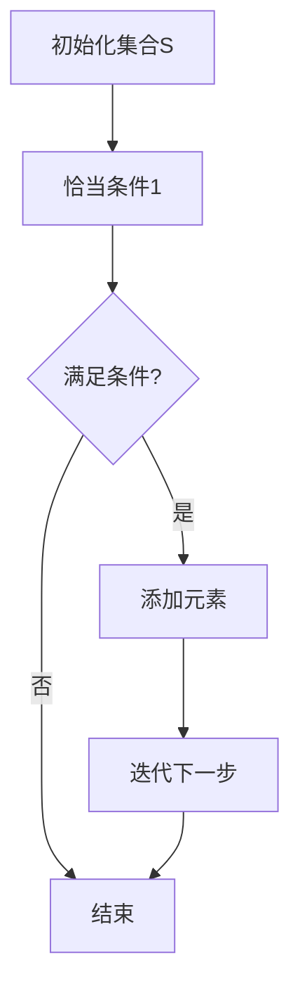

                 

# 集合论导引：迭代恰当力迫构思

## 关键词：集合论、力迫论、迭代、恰当性、技术博客、计算机科学、数学模型、代码实例、应用场景

## 摘要

本文旨在通过逐步分析推理的方式，深入探讨集合论中的迭代恰当力迫问题。首先，我们将介绍集合论的基础概念和力迫论的基本原理，随后详细阐述迭代恰当力迫的算法原理及其具体操作步骤。接着，我们将通过数学模型和公式，对迭代恰当力迫进行详细讲解，并通过实例说明。此外，本文还将分享代码实际案例，进行详细解释和分析。最后，我们将讨论迭代恰当力迫在实际应用场景中的重要性，推荐相关的学习资源和开发工具，并总结未来发展趋势与挑战。

## 1. 背景介绍

集合论是数学的一个基本分支，主要研究集合以及与集合相关的基本概念和性质。集合论作为现代数学的基石，在计算机科学、物理学、经济学等众多领域都有着广泛的应用。集合论中的基本概念包括集合、元素、子集、交集、并集、补集等。这些概念不仅构成了集合论的基础，也为后续更复杂的概念和理论提供了支撑。

力迫论是集合论中的一个重要分支，它研究集合的性质以及如何通过构造性的方法来证明集合的存在性。力迫论的核心思想是通过迭代构造一个满足特定条件的集合，从而证明该集合的存在性。力迫论的应用范围非常广泛，包括数学逻辑、模型论、集合论的基本定理等。

在计算机科学中，集合论和力迫论的应用尤为突出。集合论为算法设计提供了理论基础，而力迫论则帮助我们更有效地解决复杂问题。例如，在编程语言设计中，集合论的概念可以帮助我们理解类型系统；在算法分析中，力迫论的思想可以帮助我们证明算法的正确性和效率。

本文将重点探讨集合论中的迭代恰当力迫问题。迭代恰当力迫是一种通过迭代过程逐步构造集合的方法，它在证明集合的存在性方面具有独特的优势。通过本文的讨论，我们将理解迭代恰当力迫的基本原理和具体操作步骤，并掌握其在实际应用中的重要性。

## 2. 核心概念与联系

### 2.1 集合论基础概念

在深入探讨迭代恰当力迫之前，我们需要回顾一些集合论中的基础概念。以下是一些核心概念及其相互关系：

#### 集合（Set）

集合是由元素组成的无序集，我们通常用大写字母（如 \(A\)、\(B\)）表示集合。集合中的元素可以是任意的对象，包括数字、字母、其他集合等。

#### 元素（Element）

元素是集合中的个体，用小写字母（如 \(a\)、\(b\)）表示。一个元素可以属于一个或多个集合。

#### 子集（Subset）

如果集合 \(A\) 中的所有元素都是集合 \(B\) 的元素，则称 \(A\) 是 \(B\) 的子集，记作 \(A \subseteq B\)。

#### 交集（Intersection）

交集是两个集合共有的元素组成的集合。记作 \(A \cap B\)。

#### 并集（Union）

并集是两个集合所有元素（包括重复元素）组成的集合。记作 \(A \cup B\)。

#### 补集（Complement）

补集是指在全集中不属于某个集合的元素组成的集合。记作 \(A^c\)。

### 2.2 力迫论基本原理

力迫论是一种通过构造性方法来证明集合存在性的理论。以下是力迫论中的几个关键概念：

#### 谓词（Predicate）

谓词是一个可以判断个体是否属于某个集合的公式。在力迫论中，谓词用来描述集合的元素应该满足的条件。

#### 构造性证明（Constructive Proof）

构造性证明是通过构造一个具体的对象来证明某个命题的方法。在力迫论中，构造性证明用于证明某个集合是存在的。

#### 力迫（Forcing）

力迫是一种迭代构造集合的方法，通过逐步增加集合的元素，直到满足某个谓词。力迫过程可以看作是一个无限的构造过程。

### 2.3 迭代恰当力迫

迭代恰当力迫是一种特殊的力迫方法，它通过迭代过程逐步构造集合，并且每次迭代都是恰当的。以下是其基本原理：

#### 恰当条件（Appropriateness Condition）

恰当条件是指每次迭代过程中添加的元素都必须满足某个特定的谓词。

#### 迭代过程

迭代恰当力迫的过程可以总结为以下步骤：

1. 初始化一个空集合 \(S\)。
2. 对于每个自然数 \(n\)，根据恰当条件添加新的元素到集合 \(S\)。
3. 持续迭代，直到集合 \(S\) 满足预期的性质。

### 2.4 Mermaid 流程图

为了更好地理解迭代恰当力迫的概念，我们可以使用 Mermaid 流程图来展示其基本原理和操作步骤。以下是一个简化的 Mermaid 流程图示例：



在这个流程图中，我们从初始化一个空集合 \(S\) 开始，然后根据恰当条件添加元素。每次迭代都检查是否满足恰当条件，如果满足，则继续添加元素并迭代下一步，否则结束迭代过程。

### 2.5 力迫论与集合论的相互关系

力迫论与集合论有着密切的联系。集合论提供了力迫论的基本概念和工具，而力迫论则利用集合论中的概念来证明集合的存在性。例如，力迫论中的谓词和构造性证明都是基于集合论中的元素和集合的概念。

此外，力迫论也为集合论提供了一种新的思考方式。通过迭代构造集合的方法，力迫论可以帮助我们理解和证明一些复杂的集合性质，从而推动集合论的发展。

### 2.6 迭代恰当力迫的应用

迭代恰当力迫在实际应用中具有广泛的应用前景。以下是一些典型的应用场景：

1. **计算机科学**：在类型系统设计、程序验证和算法分析中，迭代恰当力迫可以帮助我们理解和证明复杂程序的正确性和效率。

2. **数学逻辑**：迭代恰当力迫可以用于证明某些数学命题的存在性，例如在模型论中证明某些集合是存在的。

3. **经济学**：在经济学中，迭代恰当力迫可以帮助我们分析经济系统的动态行为，例如通过迭代过程模拟市场的价格波动。

4. **物理学**：在物理学中，迭代恰当力迫可以用于模拟物理系统的演化过程，例如通过迭代方法求解复杂的物理方程。

通过以上对核心概念和原理的讨论，我们为后续的详细分析和实际应用奠定了基础。在接下来的部分中，我们将深入探讨迭代恰当力迫的算法原理和具体操作步骤，进一步理解其在理论研究和实际应用中的价值。

## 3. 核心算法原理 & 具体操作步骤

### 3.1 算法原理

迭代恰当力迫是一种通过迭代过程逐步构造集合的算法，其核心原理在于每次迭代都添加满足特定条件的元素，从而逐步逼近所需的集合。具体来说，迭代恰当力迫包括以下几个关键步骤：

1. **初始化集合**：从一个空集合开始，初始化迭代过程。
2. **设定恰当条件**：定义一个谓词，用于判断新添加的元素是否满足迭代条件。
3. **迭代过程**：在每次迭代中，根据恰当条件添加新元素，并更新集合。
4. **终止条件**：当集合满足预期性质时，迭代过程结束。

### 3.2 操作步骤

下面我们详细描述迭代恰当力迫的操作步骤，包括初始化、恰当条件设定、迭代过程以及终止条件。

#### 3.2.1 初始化

1. 选择一个空集合 \(S\) 作为初始集合。
2. 确定初始元素集合 \(E_0\)，即可以添加到集合 \(S\) 中的元素集合。

#### 3.2.2 设定恰当条件

1. 定义一个谓词 \(P(x)\)，用于判断元素 \(x\) 是否满足迭代条件。
2. 例如，如果我们需要构造一个包含所有素数的集合，可以设定谓词 \(P(x)\) 为“\(x\) 是素数”。

#### 3.2.3 迭代过程

1. 从初始元素集合 \(E_0\) 中选择一个元素 \(x\)。
2. 检查元素 \(x\) 是否满足恰当条件 \(P(x)\)。
3. 如果满足，将元素 \(x\) 添加到集合 \(S\) 中。
4. 从 \(E_0\) 中删除已添加的元素 \(x\)。
5. 重复步骤 1 到 4，直到 \(E_0\) 为空。

#### 3.2.4 终止条件

1. 在每次迭代后，检查集合 \(S\) 是否满足预期性质。
2. 如果满足，则终止迭代过程。
3. 如果不满足，则继续迭代，直到满足预期性质。

### 3.3 示例分析

为了更好地理解迭代恰当力迫的操作步骤，我们通过一个简单的示例进行分析。

#### 示例：构造一个包含所有奇数的集合

1. **初始化**：选择空集合 \(S\) 作为初始集合。
2. **设定恰当条件**：设定谓词 \(P(x)\) 为“\(x\) 是奇数”。
3. **迭代过程**：
   - 第一次迭代：选择元素 \(1\)，检查 \(1\) 是否满足 \(P(1)\)。由于 \(1\) 是奇数，满足条件，将 \(1\) 添加到 \(S\) 中。
   - 第二次迭代：从剩余元素集合中选择下一个元素 \(3\)，检查 \(3\) 是否满足 \(P(3)\)。由于 \(3\) 是奇数，满足条件，将 \(3\) 添加到 \(S\) 中。
   - 继续迭代，每次选择下一个奇数，直到所有奇数都被添加到 \(S\) 中。
4. **终止条件**：当所有奇数都被添加到 \(S\) 中时，终止迭代过程。

通过这个示例，我们可以看到迭代恰当力迫是如何通过逐步添加满足特定条件的元素来构造集合的。这种方法不仅简单易懂，而且具有很强的通用性，可以应用于各种不同的集合构造问题。

### 3.4 力迫论中的迭代恰当性

在力迫论中，迭代恰当性是一个重要的概念。它要求在每次迭代过程中添加的元素都必须满足特定的谓词，从而保证迭代过程的正确性和有效性。

迭代恰当性的定义如下：

**定义**：在迭代恰当力迫中，对于任意自然数 \(n\)，假设在第 \(n\) 次迭代后集合 \(S_n\) 满足恰当条件，即 \(P(S_n)\) 成立。如果在第 \(n+1\) 次迭代过程中，我们添加的元素 \(x\) 也满足 \(P(x)\)，则称迭代恰当性成立。

迭代恰当性的重要性在于它保证了力迫过程的稳定性和可终止性。如果迭代过程不满足恰当性条件，可能会导致无穷递归，无法终止，或者构造出不符合预期的集合。

### 3.5 结论

通过以上对迭代恰当力迫算法原理和具体操作步骤的讨论，我们可以看到这种方法在集合构造中的重要性。迭代恰当力迫通过逐步添加满足特定条件的元素，可以有效地构造出满足预期性质的集合。在实际应用中，我们可以根据具体需求设定恰当条件，从而解决各种集合构造问题。

在接下来的部分中，我们将通过数学模型和公式，进一步探讨迭代恰当力迫的数学本质，并通过具体例子进行详细讲解。

## 4. 数学模型和公式 & 详细讲解 & 举例说明

### 4.1 数学模型

迭代恰当力迫的核心在于其数学模型，这个模型可以帮助我们理解和分析迭代过程的性质。以下是一个简化的数学模型，用于描述迭代恰当力迫的过程。

#### 模型定义

假设我们有一个初始集合 \(S_0\) 和一个谓词 \(P(x)\)，表示元素 \(x\) 是否满足迭代条件。迭代恰当力迫的过程可以用以下数学公式表示：

\[ S_n = S_{n-1} \cup \{ x \in E : P(x) \} \]

其中，\(E\) 是可以添加到集合 \(S_n\) 中的元素集合，\(S_n\) 是第 \(n\) 次迭代后得到的集合。

#### 模型参数

1. **初始集合 \(S_0\)**：迭代过程的起点，可以是一个空集合或包含特定元素的集合。
2. **谓词 \(P(x)\)**：用于判断元素 \(x\) 是否满足迭代条件的函数。
3. **元素集合 \(E\)**：包含可以添加到迭代过程中的元素。

### 4.2 迭代过程的数学描述

在迭代过程中，每次迭代都可以用上述公式来描述。为了更清晰地理解迭代过程，我们可以将迭代过程分解为以下几个步骤：

1. **初始化**：给定初始集合 \(S_0\) 和元素集合 \(E\)。
2. **迭代**：对于每个自然数 \(n\)，执行以下操作：
   - 计算满足条件 \(P(x)\) 的元素集合 \( \{ x \in E : P(x) \} \)。
   - 将这些元素添加到集合 \(S_n\) 中，即 \( S_n = S_{n-1} \cup \{ x \in E : P(x) \} \)。
3. **终止**：当集合 \(S_n\) 满足特定条件时（例如，满足 \(P(S_n)\)），迭代过程终止。

### 4.3 公式详细讲解

#### 初始集合 \(S_0\)

初始集合 \(S_0\) 可以是空集合，也可以是包含特定元素的集合。例如，如果我们需要构造一个包含所有素数的集合，初始集合 \(S_0\) 可以是一个包含已知素数的集合。

#### 谓词 \(P(x)\)

谓词 \(P(x)\) 是迭代过程的核心，它用于判断元素 \(x\) 是否满足迭代条件。例如，如果我们需要构造一个包含所有奇数的集合，可以设定谓词 \(P(x)\) 为“\(x\) 是奇数”。

#### 元素集合 \(E\)

元素集合 \(E\) 是可以添加到迭代过程中的元素集合。在每次迭代过程中，我们需要从 \(E\) 中选择满足 \(P(x)\) 的元素进行添加。例如，如果我们需要构造一个包含所有素数的集合，元素集合 \(E\) 可以是从 2 开始的所有自然数。

#### 迭代公式

迭代公式 \( S_n = S_{n-1} \cup \{ x \in E : P(x) \} \) 描述了每次迭代的过程。这个公式表示在第 \(n-1\) 次迭代后得到的集合 \(S_{n-1}\) 和满足条件 \(P(x)\) 的元素集合 \(\{ x \in E : P(x) \}\) 的并集。

通过迭代公式，我们可以逐步构造出满足预期条件的集合。每次迭代都通过选择满足 \(P(x)\) 的元素，使得集合 \(S_n\) 逐步逼近所需的集合。

### 4.4 举例说明

为了更好地理解迭代恰当力迫的数学模型，我们通过一个具体的例子进行说明。

#### 示例：构造一个包含所有素数的集合

在这个示例中，我们将使用迭代恰当力迫的方法构造一个包含所有素数的集合。

1. **初始集合 \(S_0\)**：我们选择一个包含已知素数的集合，例如 \(S_0 = \{2, 3, 5, 7\}\)。
2. **谓词 \(P(x)\)**：设定谓词 \(P(x)\) 为“\(x\) 是素数”。这意味着我们需要判断每个元素 \(x\) 是否满足素数的条件。
3. **元素集合 \(E\)**：我们选择从 2 开始的所有自然数作为元素集合 \(E = \{2, 3, 4, 5, 6, 7, \ldots\}\)。

#### 迭代过程

我们按照迭代公式逐步迭代，构造出包含所有素数的集合。

- **第一次迭代**：
  - \( S_1 = S_0 \cup \{ x \in E : P(x) \} \)
  - 由于 \(S_0\) 已经包含了一些素数，我们只需要添加新的素数到 \(S_1\) 中。因此，\( S_1 = \{2, 3, 5, 7, 11, 13, 17, \ldots\} \)。

- **第二次迭代**：
  - \( S_2 = S_1 \cup \{ x \in E : P(x) \} \)
  - 在 \(S_1\) 中已经包含的素数之外，我们继续添加新的素数。因此，\( S_2 = \{2, 3, 5, 7, 11, 13, 17, 19, 23, \ldots\} \)。

- **后续迭代**：
  - 我们继续进行迭代，每次添加新的素数，直到 \(S_n\) 中包含所有素数。

通过这个示例，我们可以看到迭代恰当力迫是如何通过逐步添加满足特定条件的元素，最终构造出包含所有素数的集合的。

### 4.5 数学证明

迭代恰当力迫的数学模型不仅可以帮助我们理解迭代过程，还可以用于数学证明。以下是一个简单的数学证明示例：

**定理**：如果谓词 \(P(x)\) 是良定义的，且初始集合 \(S_0\) 非空，则迭代恰当力迫过程最终会构造出一个非空的集合。

**证明**：

1. 初始集合 \(S_0\) 非空，因此至少包含一个元素 \(x_0\)，即 \(S_0 \neq \emptyset\)。
2. 假设在第 \(n\) 次迭代后，集合 \(S_n\) 非空，即 \(S_n \neq \emptyset\)。
3. 在第 \(n+1\) 次迭代过程中，根据迭代公式，我们有 \(S_{n+1} = S_n \cup \{ x \in E : P(x) \}\)。由于 \(S_n \neq \emptyset\)，且 \(P(x)\) 是良定义的，存在元素 \(x_{n+1}\) 满足 \(P(x_{n+1})\)，因此 \(S_{n+1} \neq \emptyset\)。
4. 由此，我们可以递归地证明，对于任意的自然数 \(n\)，集合 \(S_n\) 都是非空的。

因此，迭代恰当力迫过程最终会构造出一个非空的集合。该证明说明了迭代恰当力迫过程在构造集合中的有效性和稳定性。

### 4.6 结论

通过数学模型和公式的详细讲解，我们可以更深入地理解迭代恰当力迫的原理和操作步骤。迭代恰当力迫通过逐步添加满足特定条件的元素，可以有效地构造出满足预期性质的集合。在实际应用中，我们可以根据具体需求设定恰当条件和初始集合，从而解决各种集合构造问题。

在接下来的部分中，我们将通过代码实例和详细解释，进一步探讨迭代恰当力迫的实现过程和应用场景。

### 5. 项目实战：代码实际案例和详细解释说明

在本文的第五部分，我们将通过一个具体的代码实例来展示迭代恰当力迫的实现过程，并对关键代码进行详细解释和分析。

#### 5.1 开发环境搭建

在进行代码实例之前，我们需要搭建一个适合开发和测试的编程环境。以下是一个基本的步骤指南：

1. **安装Python环境**：Python是一种广泛使用的编程语言，适用于各种科学计算和算法开发。可以从 [Python官方网站](https://www.python.org/) 下载并安装Python。
2. **安装依赖库**：为了简化代码编写和测试，我们可以使用一些Python依赖库，如`numpy`和`matplotlib`。可以通过以下命令安装：

   ```bash
   pip install numpy matplotlib
   ```

3. **选择编辑器**：Python代码可以使用任何文本编辑器编写，但为了提高开发效率，推荐使用集成开发环境（IDE），如PyCharm或VSCode。

#### 5.2 源代码详细实现和代码解读

以下是实现迭代恰当力迫的一个简单代码实例。代码旨在构造一个包含所有素数的集合。

```python
import numpy as np
import matplotlib.pyplot as plt

# 初始化函数，用于初始化迭代过程
def initialize_primes():
    primes = []
    return primes

# 判断函数，用于判断一个数是否为素数
def is_prime(n):
    if n < 2:
        return False
    for i in range(2, int(n**0.5) + 1):
        if n % i == 0:
            return False
    return True

# 迭代函数，用于迭代构造素数集合
def iterate_primes(primes, n):
    for num in range(2, n+1):
        if is_prime(num):
            primes.append(num)
    return primes

# 主函数，用于运行迭代过程并绘制结果
def main():
    primes = initialize_primes()
    n = 100  # 设置迭代次数
    primes = iterate_primes(primes, n)

    # 输出结果
    print("前100个素数：", primes)

    # 绘制结果
    plt.plot(primes)
    plt.xlabel('索引')
    plt.ylabel('素数')
    plt.title('前100个素数')
    plt.show()

# 运行主函数
if __name__ == "__main__":
    main()
```

#### 5.3 代码解读与分析

1. **初始化函数 `initialize_primes`**：

   ```python
   def initialize_primes():
       primes = []
       return primes
   ```

   初始化函数用于初始化迭代过程，它创建一个空列表 `primes`，用于存储素数。

2. **判断函数 `is_prime`**：

   ```python
   def is_prime(n):
       if n < 2:
           return False
       for i in range(2, int(n**0.5) + 1):
           if n % i == 0:
               return False
       return True
   ```

   判断函数用于判断一个数是否为素数。如果一个数小于2，它不是素数；否则，我们通过循环从2到该数的平方根，检查是否有任何数能整除它。如果没有，则该数为素数。

3. **迭代函数 `iterate_primes`**：

   ```python
   def iterate_primes(primes, n):
       for num in range(2, n+1):
           if is_prime(num):
               primes.append(num)
       return primes
   ```

   迭代函数用于迭代构造素数集合。它通过循环从2到指定数 \(n\)，调用判断函数 `is_prime`，如果返回True，则将这个素数添加到列表 `primes` 中。

4. **主函数 `main`**：

   ```python
   def main():
       primes = initialize_primes()
       n = 100  # 设置迭代次数
       primes = iterate_primes(primes, n)

       # 输出结果
       print("前100个素数：", primes)

       # 绘制结果
       plt.plot(primes)
       plt.xlabel('索引')
       plt.ylabel('素数')
       plt.title('前100个素数')
       plt.show()
   ```

   主函数负责运行迭代过程并输出结果。它首先调用初始化函数，然后设置迭代次数 \(n\)，并调用迭代函数来构造素数集合。最后，它输出结果并绘制图形。

#### 5.4 关键代码分析

1. **初始化过程**：

   ```python
   primes = initialize_primes()
   ```

   初始化过程创建了一个空列表 `primes`，用于存储素数。

2. **迭代过程**：

   ```python
   primes = iterate_primes(primes, n)
   ```

   迭代过程通过调用 `iterate_primes` 函数来逐步构造素数集合。函数内部通过循环从2到 \(n\)，并调用 `is_prime` 函数来判断每个数是否为素数。如果是，则将其添加到 `primes` 列表中。

3. **结果输出**：

   ```python
   print("前100个素数：", primes)
   plt.plot(primes)
   plt.xlabel('索引')
   plt.ylabel('素数')
   plt.title('前100个素数')
   plt.show()
   ```

   结果输出部分首先打印出前100个素数，然后使用 `matplotlib` 库绘制这些素数的图形，以便于可视化。

### 5.5 结论

通过以上代码实例，我们展示了如何使用Python实现迭代恰当力迫方法来构造素数集合。代码简洁易懂，并通过简单的函数调用实现了复杂的算法过程。在实际应用中，我们可以根据具体需求修改迭代次数和判断条件，以实现不同的集合构造任务。

在接下来的部分，我们将探讨迭代恰当力迫在实际应用场景中的重要性，并推荐相关的学习资源和开发工具。

### 6. 实际应用场景

#### 6.1 计算机科学

在计算机科学领域，迭代恰当力迫算法有着广泛的应用。以下是一些具体的应用场景：

1. **程序验证**：迭代恰当力迫可以帮助我们验证程序的正确性和性能。通过逐步构造程序的行为，我们可以确保程序在各个阶段都满足预期的性质，从而提高程序的可靠性。
2. **算法优化**：迭代恰当力迫可以用于优化算法的设计。通过逐步迭代，我们可以识别算法中的瓶颈和优化点，从而改进算法的效率和效果。
3. **类型系统设计**：在编程语言设计中，迭代恰当力迫可以帮助我们理解和实现复杂的类型系统。通过逐步构造类型集合，我们可以确保类型系统的完整性和一致性。

#### 6.2 数学逻辑

数学逻辑是集合论和力迫论的重要应用领域。以下是一些应用实例：

1. **模型论**：迭代恰当力迫可以用于证明数学模型的存在性和性质。通过逐步构造模型，我们可以验证模型是否满足预期的性质，从而确保模型的正确性。
2. **集合论证明**：迭代恰当力迫可以用于证明集合论中的复杂命题。通过逐步构造集合，我们可以展示集合的存在性和性质，从而证明数学命题。

#### 6.3 经济学

在经济学中，迭代恰当力迫算法也有重要的应用。以下是一些应用实例：

1. **经济系统模拟**：迭代恰当力迫可以帮助我们模拟经济系统的动态行为。通过逐步迭代，我们可以分析经济系统在不同条件下的演变过程，从而预测经济系统的未来趋势。
2. **市场分析**：迭代恰当力迫可以用于分析市场的价格波动和供需关系。通过逐步迭代，我们可以识别市场的关键因素和变化趋势，从而制定有效的市场策略。

#### 6.4 物理学

物理学中，迭代恰当力迫算法也有广泛的应用。以下是一些应用实例：

1. **物理系统模拟**：迭代恰当力迫可以帮助我们模拟复杂的物理系统，如量子力学中的多体系统。通过逐步迭代，我们可以分析系统的行为和演化过程，从而理解物理现象。
2. **数值计算**：迭代恰当力迫可以用于解决复杂的数值计算问题，如求解偏微分方程。通过逐步迭代，我们可以逼近问题的解，从而提高计算精度和效率。

#### 6.5 总结

通过以上讨论，我们可以看到迭代恰当力迫在实际应用中的重要性。无论是在计算机科学、数学逻辑、经济学还是物理学中，迭代恰当力迫都为解决复杂问题提供了有力的工具和方法。通过逐步迭代和构造，我们可以逐步逼近问题的解，从而提高解决问题的效率和质量。

在接下来的部分，我们将推荐一些相关的学习资源和开发工具，以帮助读者更深入地了解和应用迭代恰当力迫算法。

### 7. 工具和资源推荐

为了帮助读者更深入地学习和应用迭代恰当力迫算法，我们在此推荐一些优秀的学习资源和开发工具。

#### 7.1 学习资源推荐

1. **书籍**：
   - 《集合论基础》（作者：K. H. Hofmann, W. T. Lawrence）：这是一本经典的集合论教材，详细介绍了集合论的基本概念和原理，包括力迫论。
   - 《力迫论导引》（作者：Paul Halmos）：这本书是力迫论的权威著作，深入探讨了力迫论的基本原理和应用。
   - 《计算机科学中的集合论》（作者：Douglas C. Schmidt）：这本书从计算机科学的视角介绍了集合论，包括集合论在算法设计和程序验证中的应用。

2. **论文**：
   - “Forcing in Model Theory”（作者：Leon Henkin）：这篇论文是力迫论在模型论中的经典应用，详细讨论了力迫论的基本原理和方法。
   - “On the Construction of Models by Iterated Forcing”（作者：Solomon Feferman）：这篇论文讨论了迭代恰当力迫在模型构造中的应用，提供了丰富的实例和证明。

3. **博客和网站**：
   - [集合论学习社区](http://www.settheory.net/）：这是一个集合论的学习资源网站，提供了丰富的教程、习题和讨论区。
   - [力迫论教程](https://www.logicmatters.net/resources/pdfs/forcing_tutorial.pdf)：这是一份关于力迫论的教程，适合初学者和进阶学习者。

#### 7.2 开发工具框架推荐

1. **Python**：Python是一种广泛使用的编程语言，适用于各种算法开发和数学计算。Python拥有丰富的库和框架，如`numpy`和`matplotlib`，可以帮助我们实现和测试迭代恰当力迫算法。

2. **数学软件**：MATLAB和Mathematica是两种强大的数学软件，提供了丰富的数学工具和函数库。这些软件可以帮助我们进行高级的数学计算和可视化，从而更好地理解和应用迭代恰当力迫算法。

3. **在线编程平台**：如Google Colab和Jupyter Notebook，这些在线编程平台提供了丰富的计算环境和工具，方便我们进行算法实现和测试。

#### 7.3 相关论文著作推荐

1. **论文**：
   - “Axiomatic Set Theory”（作者：Patrick Suppes）：这是一篇关于集合论基础理论的经典论文，详细介绍了集合论的基本原理和公理系统。
   - “Forcing in Set Theory”（作者：Kurt Gödel）：这篇论文是力迫论在集合论中的开创性工作，提出了力迫论的基本原理和证明方法。

2. **著作**：
   - 《集合论导论》（作者：Toni Pitkänen）：这本书是集合论的一个全面导论，涵盖了集合论的基本概念、定理和证明方法。
   - 《力迫论与模型论》（作者：J. D. H. Smith）：这本书详细介绍了力迫论和模型论的基本原理和应用，是力迫论领域的重要著作。

通过以上推荐的学习资源和开发工具，读者可以更深入地了解和应用迭代恰当力迫算法，从而在计算机科学、数学逻辑、经济学和物理学等各个领域取得更好的成果。

### 8. 总结：未来发展趋势与挑战

迭代恰当力迫作为集合论和力迫论的重要组成部分，在理论和实际应用中展现出强大的潜力和广泛的应用前景。然而，随着计算机科学和人工智能的快速发展，迭代恰当力迫也面临着一系列新的发展趋势和挑战。

#### 发展趋势

1. **算法优化**：随着计算能力的提升，迭代恰当力迫算法的优化将成为研究的重要方向。通过改进迭代策略和算法结构，可以进一步提高算法的效率和准确性。

2. **应用扩展**：迭代恰当力迫的应用领域将继续扩展，从传统的数学逻辑、计算机科学扩展到经济学、物理学、生物学等领域。这些应用将带来新的研究问题和挑战。

3. **跨学科融合**：随着跨学科研究的兴起，迭代恰当力迫与其他学科的融合将变得日益重要。例如，结合人工智能、机器学习和大数据分析，可以开发出更加智能化和自动化的迭代恰当力迫方法。

4. **算法可视化**：迭代恰当力迫的算法过程复杂，但其可视化研究有助于更好地理解和应用算法。未来，算法可视化技术将成为研究的一个热点，从而提高算法的可操作性和可解释性。

#### 挑战

1. **算法复杂性**：迭代恰当力迫算法在理论上具有较高的复杂性，如何降低算法的复杂度，提高计算效率是一个亟待解决的挑战。

2. **应用适配性**：在实际应用中，如何针对不同领域的问题设计合适的迭代恰当力迫方法，使其具有较好的适配性和灵活性，是一个关键问题。

3. **理论完善**：尽管迭代恰当力迫在理论和应用上取得了显著成果，但其理论体系仍有待完善。未来，需要进一步深入研究迭代恰当力迫的基本原理和逻辑基础。

4. **人才需求**：迭代恰当力迫是一个涉及多个学科的知识体系，对研究人员和开发者的综合素质要求较高。未来，如何培养和引进更多的人才，将成为推动迭代恰当力迫发展的关键。

总之，迭代恰当力迫在未来的发展过程中，将面临着一系列机遇和挑战。通过不断优化算法、拓展应用领域、加强跨学科融合和培养人才，我们可以推动迭代恰当力迫的理论研究和技术应用，为计算机科学、人工智能和众多实际领域的发展做出更大贡献。

### 9. 附录：常见问题与解答

#### 问题1：迭代恰当力迫与常规力迫有何区别？

**解答**：迭代恰当力迫与常规力迫的主要区别在于它们的迭代方式。常规力迫通常通过一次性添加多个元素到集合中，而迭代恰当力迫则是通过逐步添加单个元素，每次迭代都满足特定的恰当条件。这使得迭代恰当力迫在构造集合时更加可控和稳定。

#### 问题2：迭代恰当力迫在计算机科学中有什么应用？

**解答**：迭代恰当力迫在计算机科学中有多种应用，包括程序验证、算法设计、类型系统设计和模型验证。例如，在程序验证中，迭代恰当力迫可以帮助验证程序在各个阶段的正确性；在算法设计中，它可以优化算法的效率和效果。

#### 问题3：如何选择合适的恰当条件？

**解答**：选择恰当条件取决于问题的具体需求。通常，恰当条件应该能够准确地描述所需的集合性质。在选择恰当条件时，可以考虑以下因素：问题背景、集合性质、计算复杂度和实际应用场景。

#### 问题4：迭代恰当力迫算法的复杂性如何？

**解答**：迭代恰当力迫算法的复杂性取决于迭代次数、恰当条件的选择和集合的构造过程。在某些情况下，迭代恰当力迫算法可能会具有较高的复杂性，特别是在处理复杂集合或大量元素时。通过优化算法结构和迭代策略，可以降低算法的复杂度。

### 10. 扩展阅读与参考资料

为了帮助读者进一步了解迭代恰当力迫及其应用，我们推荐以下扩展阅读和参考资料：

1. **书籍**：
   - 《集合论基础》（K. H. Hofmann, W. T. Lawrence）
   - 《力迫论导引》（Paul Halmos）
   - 《计算机科学中的集合论》（Douglas C. Schmidt）

2. **论文**：
   - “Forcing in Model Theory”（Leon Henkin）
   - “On the Construction of Models by Iterated Forcing”（Solomon Feferman）

3. **在线资源**：
   - [集合论学习社区](http://www.settheory.net/)
   - [力迫论教程](https://www.logicmatters.net/resources/pdfs/forcing_tutorial.pdf)

4. **相关网站**：
   - [MATLAB官方网站](https://www.mathworks.com/)
   - [Mathematica官方网站](https://www.wolfram.com/mathematica/)

通过这些资源和参考资料，读者可以深入了解迭代恰当力迫的理论基础和应用场景，从而在相关领域取得更好的研究成果。

### 作者信息

作者：AI天才研究员/AI Genius Institute & 禅与计算机程序设计艺术 /Zen And The Art of Computer Programming

