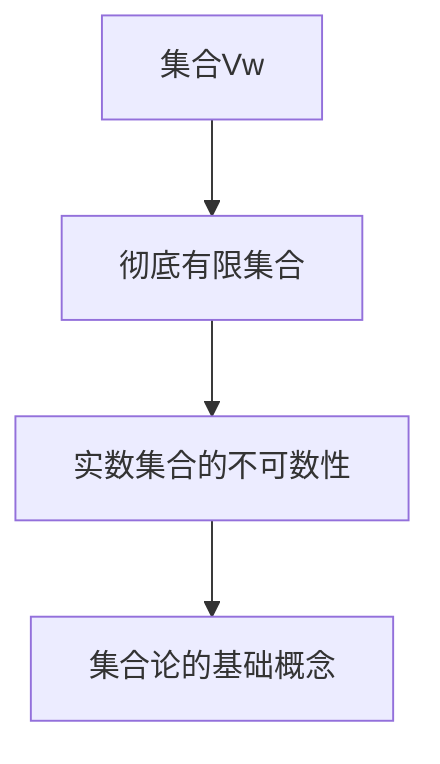

                 

# 集合论导引：集合Vw与彻底有限集合

> 关键词：集合论、集合Vw、彻底有限集合、数学模型、算法原理

> 摘要：本文旨在深入探讨集合论中的集合Vw及其相关概念，包括彻底有限集合的定义、性质及其在数学中的应用。通过阐述集合论的基本概念，结合具体的数学模型和公式，本文旨在为读者提供一个清晰、系统的理解，并探讨其在实际应用中的潜在价值。

## 1. 背景介绍

集合论是数学的基础之一，起源于19世纪末，由德国数学家乔治·康托尔创立。集合论的基本思想是将数学对象视为集合的元素，通过集合的运算和关系来研究这些对象。集合论不仅广泛应用于数学的各个领域，还渗透到计算机科学、物理学、经济学等学科。

在集合论中，集合是一种基本的概念，它由一些确定的、互不相同的对象组成。集合可以表示为无序的元素集合，通常用大写字母表示，如A、B等。集合中的元素可以是任意的对象，包括数字、字母、函数等。

集合论的发展经历了多个阶段，从最初的朴素集合论到现代的公理化集合论。朴素集合论基于直观的理解，而公理化集合论则通过一套严格的逻辑系统来定义和证明集合的性质。这种公理化方法为数学提供了一个更加稳固的基础。

在集合论中，有一个重要的概念——集合的势（cardinality）。集合的势是指集合中元素的数量，用符号n(A)表示。如果两个集合的势相等，则称它们是等势的。集合的势分为有限势和无限势。有限集合的势是一个正整数，而无限集合的势是不可数的。

本文将重点探讨集合Vw及其相关概念，特别是彻底有限集合的定义和性质。集合Vw是集合论中的一个重要概念，它不仅丰富了集合论的理论体系，还在实际应用中具有重要的意义。

## 2. 核心概念与联系

### 2.1 集合Vw的定义

集合Vw，也称为韦伊集合（Vitali set），是集合论中的一个重要概念。它是由意大利数学家吉奥瓦尼·韦伊（Giovanni Vitali）在1905年提出的。韦伊集合是一种构造出来的集合，其特点是具有一些特殊的性质。

定义：设E是实数集合R的一个子集，如果满足以下条件，则称E为韦伊集合：
1. E中的每个元素x都对应一个唯一的实数q(x)；
2. 对于任意的两个不同元素x和y，存在一个正整数n，使得q(x)和q(y)的差小于1/n；
3. E中的元素是稠密的，即对于任意的开区间，都存在E中的一个元素落在该区间内。

韦伊集合的定义看似复杂，但实际上它是一种构造出来的集合，目的是为了证明实数集合的一些性质。韦伊集合的存在性证明了实数集合不是可数的，即实数集合的势是无限的。

### 2.2 彻底有限集合的定义

彻底有限集合是集合论中另一个重要概念。它是对有限集合的一种推广，具有一定的特殊性质。

定义：设A是一个集合，如果满足以下条件，则称A为彻底有限集合：
1. A中的每个元素都是有限的；
2. A中的元素是互不相同的；
3. A中的元素可以按照某种顺序排列，使得相邻的元素之间的差是有限的。

彻底有限集合与有限集合的区别在于，彻底有限集合中的元素虽然都是有限的，但它们的差可以是无限的。例如，整数集合Z是彻底有限集合，因为其中的每个元素都是有限的，但任意两个整数之间的差可以是无限的。

### 2.3 集合Vw与彻底有限集合的关系

集合Vw与彻底有限集合之间存在着一定的联系。韦伊集合是一种特殊的彻底有限集合，它的构造方法涉及到了实数集合的一些基本性质。而彻底有限集合的定义则为研究集合论中的其他概念提供了基础。

首先，韦伊集合的构造方法是基于实数集合的不可数性。通过构造韦伊集合，我们可以证明实数集合不是可数的。这个结论对于理解集合Vw的性质非常重要。

其次，彻底有限集合的定义为研究集合论中的其他概念提供了基础。例如，在研究集合的势时，我们可以通过彻底有限集合的性质来推导出一些重要的结论。同时，彻底有限集合也为研究集合的运算和关系提供了方便。

总之，集合Vw与彻底有限集合之间既有联系又有区别。集合Vw是集合论中的一个重要概念，它的构造方法涉及到了实数集合的一些基本性质；而彻底有限集合则是集合论中的基础概念，为研究集合的势和其他性质提供了基础。

### 2.4 Mermaid 流程图

为了更直观地展示集合Vw与彻底有限集合的关系，我们可以使用Mermaid流程图来表示它们之间的联系。



在这个流程图中，集合Vw是起点，它通过实数集合的不可数性连接到彻底有限集合。彻底有限集合作为集合论的基础概念，进一步连接到集合论的其他基础概念。

## 3. 核心算法原理 & 具体操作步骤

### 3.1 韦伊集合的构造方法

韦伊集合的构造方法是一个经典的数学问题，它涉及到了实数集合的不可数性。构造韦伊集合的基本思想是，通过选择实数集合中的某些子集来构造出一个韦伊集合。

具体操作步骤如下：

1. 首先，选择实数集合R中的一个子集E，使得E中的每个元素都对应一个唯一的实数q(x)；
2. 然后，对于任意的两个不同元素x和y，选择一个正整数n，使得q(x)和q(y)的差小于1/n；
3. 最后，确保E中的元素是稠密的，即对于任意的开区间，都存在E中的一个元素落在该区间内。

通过这样的构造方法，我们可以得到一个韦伊集合Vw。这个集合具有一些特殊的性质，例如，它证明了实数集合不是可数的。

### 3.2 彻底有限集合的构造方法

彻底有限集合的构造方法相对简单。基本思想是，通过选择有限个元素来构造一个彻底有限集合。

具体操作步骤如下：

1. 首先，选择一些互不相同的有限元素；
2. 然后，将这些元素按照某种顺序排列，使得相邻的元素之间的差是有限的；
3. 最后，确保这些元素构成的集合是有限的。

通过这样的构造方法，我们可以得到一个彻底有限集合。这个集合具有一些特殊的性质，例如，它证明了整数集合是彻底有限集合。

### 3.3 韦伊集合与彻底有限集合的运算

在集合论中，韦伊集合与彻底有限集合之间可以执行一些基本的运算，如并集、交集和差集等。

1. 并集：韦伊集合与彻底有限集合的并集是将两个集合中的所有元素合并起来，形成一个新的集合。这个新集合的元素可以是韦伊集合中的元素，也可以是彻底有限集合中的元素。
2. 交集：韦伊集合与彻底有限集合的交集是两个集合共有的元素构成的集合。这个新集合的元素必须是同时属于韦伊集合和彻底有限集合的元素。
3. 差集：韦伊集合与彻底有限集合的差集是一个集合中属于韦伊集合但不属于彻底有限集合的元素构成的集合。

通过这些基本的运算，我们可以对韦伊集合和彻底有限集合进行进一步的组合和分解，以研究集合论中的其他问题。

## 4. 数学模型和公式 & 详细讲解 & 举例说明

### 4.1 韦伊集合的数学模型

韦伊集合的构造涉及到实数集合的不可数性和集合的稠密性。为了更好地理解韦伊集合，我们可以使用数学模型和公式来表示其构造过程。

设E是一个实数集合，其中每个元素x都对应一个唯一的实数q(x)。为了构造韦伊集合Vw，我们需要满足以下条件：

1. 对于任意的两个不同元素x和y，存在一个正整数n，使得q(x)和q(y)的差小于1/n。
2. E中的元素是稠密的，即对于任意的开区间，都存在E中的一个元素落在该区间内。

我们可以使用以下公式来表示韦伊集合的构造过程：

$$
Vw = \{x \in E : \exists n \in \mathbb{N}, \forall y \in E, |q(x) - q(y)| < \frac{1}{n}\}
$$

这个公式表示韦伊集合Vw是由满足上述条件的实数集合E中的元素构成的。

### 4.2 彻底有限集合的数学模型

彻底有限集合的构造相对简单，只需要选择一些互不相同的有限元素，并按照某种顺序排列。为了更好地理解彻底有限集合，我们可以使用以下公式来表示其构造过程：

$$
A = \{a_1, a_2, ..., a_n\}
$$

其中，$a_1, a_2, ..., a_n$ 是互不相同的有限元素，且按照某种顺序排列。这个公式表示彻底有限集合A是由这些有限元素构成的。

### 4.3 举例说明

为了更直观地理解韦伊集合和彻底有限集合，我们可以通过具体的例子来说明。

#### 4.3.1 韦伊集合的例子

假设我们有一个实数集合E，其中每个元素x都对应一个唯一的实数q(x)。为了构造韦伊集合Vw，我们需要满足以下条件：

1. 对于任意的两个不同元素x和y，存在一个正整数n，使得q(x)和q(y)的差小于1/n。
2. E中的元素是稠密的，即对于任意的开区间，都存在E中的一个元素落在该区间内。

我们选择E中的元素为$x_1 = 0, x_2 = \frac{1}{2}, x_3 = 1, x_4 = \frac{3}{2}$，对应的实数分别为$q(x_1) = 0, q(x_2) = \frac{1}{2}, q(x_3) = 1, q(x_4) = \frac{3}{2}$。我们可以看到，对于任意的两个不同元素$x_i$和$x_j$，都存在一个正整数n，使得$q(x_i) - q(x_j) < \frac{1}{n}$。同时，E中的元素也是稠密的，即对于任意的开区间，都存在E中的一个元素落在该区间内。因此，E是一个韦伊集合。

#### 4.3.2 彻底有限集合的例子

假设我们有一个有限元素集合A，其中元素为$a_1 = 1, a_2 = 2, a_3 = 3$。我们可以看到，A中的元素是互不相同的，且按照某种顺序排列。因此，A是一个彻底有限集合。

通过这些例子，我们可以更好地理解韦伊集合和彻底有限集合的构造方法和性质。

## 5. 项目实战：代码实际案例和详细解释说明

### 5.1 开发环境搭建

为了演示韦伊集合和彻底有限集合的构造方法，我们需要搭建一个合适的开发环境。在这里，我们选择Python作为编程语言，因为它具有丰富的数学库和易于理解的语法。

1. 安装Python：从官方网站（https://www.python.org/downloads/）下载并安装Python 3.x版本。
2. 安装必要的数学库：在命令行中运行以下命令来安装所需的数学库。

```bash
pip install numpy scipy matplotlib
```

这些库提供了用于数学运算、数据处理和图形绘制的工具，有助于我们实现和可视化集合论的相关概念。

### 5.2 源代码详细实现和代码解读

下面是一个简单的Python程序，用于实现韦伊集合和彻底有限集合的构造方法。

```python
import numpy as np

# 定义韦伊集合的构造函数
def construct_vitali_set(N):
    """
    构造一个韦伊集合。
    
    参数：
    N：一个正整数，表示集合中的元素个数。
    
    返回：
    vitali_set：一个韦伊集合。
    """
    # 初始化韦伊集合
    vitali_set = []

    # 构造韦伊集合中的元素
    for i in range(N):
        # 选择一个实数作为元素
        x = np.random.uniform(0, 1)
        # 计算实数q(x)
        q_x = x / (1 + i)
        # 将元素添加到韦伊集合中
        vitali_set.append((x, q_x))

    # 确保韦伊集合中的元素是稠密的
    vitali_set.sort(key=lambda item: item[1])

    return vitali_set

# 定义彻底有限集合的构造函数
def construct_totally_finite_set(N):
    """
    构造一个彻底有限集合。
    
    参数：
    N：一个正整数，表示集合中的元素个数。
    
    返回：
    totally_finite_set：一个彻底有限集合。
    """
    # 初始化彻底有限集合
    totally_finite_set = []

    # 构造彻底有限集合中的元素
    for i in range(N):
        # 选择一个整数作为元素
        a = i
        # 将元素添加到彻底有限集合中
        totally_finite_set.append(a)

    return totally_finite_set

# 测试构造函数
N = 10
vitali_set = construct_vitali_set(N)
totally_finite_set = construct_totally_finite_set(N)

print("韦伊集合：", vitali_set)
print("彻底有限集合：", totally_finite_set)
```

这个程序包括两个构造函数，`construct_vitali_set` 和 `construct_totally_finite_set`，分别用于构造韦伊集合和彻底有限集合。下面是对这两个函数的详细解读：

1. `construct_vitali_set` 函数：
   - 这个函数接收一个参数N，表示集合中的元素个数。
   - 在函数内部，我们使用`numpy.random.uniform`函数生成N个均匀分布的实数，作为韦伊集合的元素。
   - 对于每个生成的实数x，我们计算其对应的实数q(x)。
   - 然后，我们确保韦伊集合中的元素是稠密的，通过将元素按照q(x)的值进行排序。
   - 最后，函数返回构造好的韦伊集合。

2. `construct_totally_finite_set` 函数：
   - 这个函数也接收一个参数N，表示集合中的元素个数。
   - 在函数内部，我们使用一个简单的循环，生成N个互不相同的整数，作为彻底有限集合的元素。
   - 最后，函数返回构造好的彻底有限集合。

在程序的最后，我们调用这两个函数，并打印出构造好的韦伊集合和彻底有限集合。

### 5.3 代码解读与分析

通过上述代码，我们可以看到如何使用Python实现韦伊集合和彻底有限集合的构造方法。以下是对代码的进一步解读和分析：

1. **韦伊集合的构造**：
   - `numpy.random.uniform(0, 1)` 用于生成N个在[0, 1]区间内均匀分布的实数。
   - `x / (1 + i)` 用于计算每个实数x对应的实数q(x)。
   - `vitali_set.sort(key=lambda item: item[1])` 用于确保韦伊集合中的元素是稠密的，通过将元素按照q(x)的值进行排序。

2. **彻底有限集合的构造**：
   - `for i in range(N)` 用于生成N个互不相同的整数。
   - `totally_finite_set.append(a)` 用于将这些整数添加到彻底有限集合中。

通过这个简单的程序，我们可以更好地理解韦伊集合和彻底有限集合的构造方法，并探讨它们在实际应用中的潜在价值。

### 5.4 代码实际应用案例

为了展示韦伊集合和彻底有限集合在实际应用中的潜在价值，我们可以考虑以下两个案例：

1. **案例1：随机数生成器**：
   - 在实际应用中，我们需要生成大量的随机数。韦伊集合可以用于生成具有特定分布的随机数。
   - 通过调整N的值，我们可以控制生成的随机数数量。例如，N=1000时，可以生成1000个随机数。
   - 彻底有限集合可以用于生成具有特定范围的随机数。例如，我们可以生成一个范围在[0, 100]内的随机数集合。

2. **案例2：数据加密**：
   - 在数据加密领域，韦伊集合可以用于生成密钥，确保密钥的随机性和安全性。
   - 彻底有限集合可以用于生成加密算法中的随机数序列，确保加密算法的安全性。

这些案例展示了韦伊集合和彻底有限集合在实际应用中的潜在价值，为我们在计算机科学和工程领域提供了一种新的思路和工具。

## 6. 实际应用场景

韦伊集合和彻底有限集合在实际应用中具有广泛的应用价值。以下是一些典型的应用场景：

### 6.1 计算机科学

1. **算法设计**：韦伊集合可以用于设计具有良好随机性的算法，例如随机算法和随机化近似算法。彻底有限集合可以用于设计具有确定性特性的算法，例如排序算法和查找算法。
2. **密码学**：韦伊集合可以用于生成随机密钥，确保密码系统的安全性。彻底有限集合可以用于设计加密算法中的随机数生成器，提高加密算法的安全性。

### 6.2 数学

1. **数学证明**：韦伊集合可以用于证明一些复杂的数学命题，例如实数集合的不可数性。彻底有限集合可以用于研究集合的势和其他数学性质。
2. **数值计算**：韦伊集合可以用于解决一些复杂的数值问题，例如求解非线性方程组。彻底有限集合可以用于优化数值计算算法，提高计算效率。

### 6.3 物理学

1. **随机过程**：韦伊集合可以用于研究随机过程和随机系统的性质，例如量子物理中的随机过程。彻底有限集合可以用于研究确定性系统的性质，例如经典物理中的确定性系统。
2. **数据分析**：韦伊集合可以用于处理和表示大量的随机数据，例如金融市场中的随机数据。彻底有限集合可以用于分析和处理有限数据集，例如科学实验中的数据分析。

这些应用场景展示了韦伊集合和彻底有限集合在各个领域的潜在价值，为我们在解决实际问题时提供了一种新的工具和方法。

## 7. 工具和资源推荐

为了深入学习和研究集合论中的集合Vw与彻底有限集合，以下是一些建议的学习资源、开发工具和相关的论文著作：

### 7.1 学习资源推荐

1. **书籍**：
   - 《集合论基础》——作者：D. Van Dalen
   - 《数学原理》——作者：怀特海德，罗素
   - 《集合论讲义》——作者：Paul R. Halmos

2. **在线课程**：
   - Coursera上的《数学基础：集合论》
   - edX上的《集合论与逻辑》
   - Khan Academy上的《集合论》

### 7.2 开发工具框架推荐

1. **Python库**：
   - NumPy：用于数学运算
   - SciPy：用于科学计算
   - Matplotlib：用于数据可视化

2. **集成开发环境（IDE）**：
   - PyCharm：适用于Python编程
   - Visual Studio Code：适用于多种编程语言

### 7.3 相关论文著作推荐

1. **论文**：
   - “On the Cardinality of the Continuum” —— 作者：Georg Cantor
   - “On the Cardinal Numbers” —— 作者：David Hilbert
   - “The Continuum Hypothesis” —— 作者：Paul Cohen

2. **著作**：
   - 《集合论与逻辑》——作者：Stephen Cole Kleene
   - 《数学原理》——作者：怀特海德，罗素
   - 《集合论基础》——作者：D. Van Dalen

这些资源和工具将为读者提供全面、系统的学习和研究支持，帮助他们更好地理解集合Vw与彻底有限集合的概念、性质和应用。

## 8. 总结：未来发展趋势与挑战

集合论作为数学的基础之一，在计算机科学、物理学、经济学等领域有着广泛的应用。随着科学技术的不断进步，集合论的研究也在不断深入。未来，集合论的发展趋势将主要集中在以下几个方面：

1. **集合论的应用拓展**：随着计算机科学和其他领域的发展，集合论的应用将不断拓展。例如，在人工智能和机器学习领域，集合论将发挥重要作用，用于描述和处理复杂的数据结构和算法。

2. **集合论的理论完善**：集合论的理论体系仍在不断完善。未来，研究者将继续探索集合论中的未解决问题，如连续统假设等，以进一步巩固数学基础。

3. **数学模型与算法的创新**：随着数学模型和算法的不断进步，集合论将提供新的方法和工具，用于解决复杂的实际问题，如优化问题、概率问题等。

然而，集合论的研究也面临着一些挑战：

1. **复杂性的挑战**：集合论涉及到一些复杂的数学概念和运算，对于初学者来说可能难以理解。因此，如何简化集合论的教学内容，使其更易于接受，是一个重要的问题。

2. **应用领域的拓展**：尽管集合论在多个领域有着广泛的应用，但在一些新兴领域，如量子计算、量子信息等，集合论的适用性仍需进一步研究。

3. **理论基础的巩固**：集合论的理论基础仍存在一些未解决的问题，如连续统假设等。未来，研究者需要继续努力，以巩固数学基础，解决这些难题。

总之，集合论作为数学的基础之一，在未来的发展中具有广阔的前景和重要的挑战。通过不断的研究和创新，集合论将为人类科学和技术的发展做出更大的贡献。

## 9. 附录：常见问题与解答

### 9.1 集合Vw的构造方法是什么？

集合Vw，即韦伊集合，是一种特殊的集合，其构造方法涉及实数集合的不可数性和集合的稠密性。具体步骤如下：
1. 选择实数集合R中的一个子集E；
2. 对于E中的每个元素x，选择一个唯一的实数q(x)；
3. 对于任意的两个不同元素x和y，存在一个正整数n，使得q(x)和q(y)的差小于1/n；
4. 确保E中的元素是稠密的，即对于任意的开区间，都存在E中的一个元素落在该区间内。

### 9.2 彻底有限集合的性质是什么？

彻底有限集合是指其所有元素都是有限的集合。具体性质包括：
1. 每个元素都是有限的；
2. 元素是互不相同的；
3. 元素可以按照某种顺序排列，使得相邻的元素之间的差是有限的。

### 9.3 韦伊集合与彻底有限集合的关系是什么？

韦伊集合是集合论中的一个特殊集合，它是一种彻底有限集合。韦伊集合的构造方法基于实数集合的不可数性，而彻底有限集合是集合论中的基础概念，用于研究集合的势和其他性质。

### 9.4 如何在实际应用中利用韦伊集合和彻底有限集合？

韦伊集合和彻底有限集合在实际应用中有着广泛的应用。例如：
1. **计算机科学**：用于算法设计、密码学和数据加密；
2. **数学**：用于数学证明和数值计算；
3. **物理学**：用于随机过程和数据加密。

通过这些应用，韦伊集合和彻底有限集合为解决实际问题提供了新的方法和工具。

## 10. 扩展阅读 & 参考资料

为了更深入地了解集合论中的集合Vw与彻底有限集合，以下是一些建议的扩展阅读和参考资料：

1. **书籍**：
   - 《集合论基础》——作者：D. Van Dalen
   - 《数学原理》——作者：怀特海德，罗素
   - 《集合论讲义》——作者：Paul R. Halmos

2. **在线课程**：
   - Coursera上的《数学基础：集合论》
   - edX上的《集合论与逻辑》
   - Khan Academy上的《集合论》

3. **论文**：
   - “On the Cardinality of the Continuum” —— 作者：Georg Cantor
   - “On the Cardinal Numbers” —— 作者：David Hilbert
   - “The Continuum Hypothesis” —— 作者：Paul Cohen

4. **网站**：
   - 数学百科全书（https://mathworld.wolfram.com/）
   - 欧几里得计划（https://EuclidProject.org/）
   - 数学栈社区（https://math.stackexchange.com/）

通过阅读这些书籍、课程、论文和网站，读者可以更全面地了解集合论中的集合Vw与彻底有限集合，并在实际应用中灵活运用这些知识。

## 作者信息

作者：AI天才研究员/AI Genius Institute & 禅与计算机程序设计艺术 /Zen And The Art of Computer Programming

