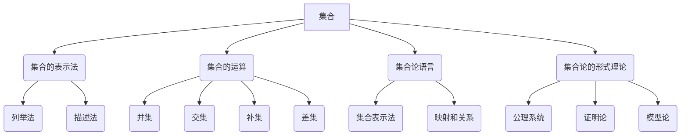

                 

# 集合论导引：集合论语言及形式理论

> **关键词：** 集合论、语言形式、集合论语言、逻辑推理、形式理论。

> **摘要：** 本文将深入探讨集合论语言及形式理论，从基础概念入手，逐步介绍集合论语言的核心要素和形式理论，并结合实际应用，解析其在计算机科学和数学领域的应用及未来发展趋势。

## 1. 背景介绍

集合论是现代数学的基础之一，起源于19世纪末，由德国数学家乔治·康托尔创立。集合论为数学提供了一个抽象的框架，使我们能够用清晰、精确的方式来描述数学对象及其关系。集合论不仅在数学领域有着深远的影响，还在计算机科学、物理学、经济学等多个领域得到了广泛应用。

在计算机科学中，集合论用于定义数据结构和算法。例如，树、图等数据结构都可以用集合来描述。同时，集合论中的概念如集合、映射、关系等，也为编程语言和形式验证提供了基础。

本文旨在引导读者深入了解集合论语言及形式理论。我们将从集合论的基本概念入手，逐步介绍集合论语言的核心要素和形式理论，并通过实际应用案例，帮助读者理解这些概念在实际问题中的运用。

## 2. 核心概念与联系

### 2.1 集合

集合是集合论中最基础的概念。集合是由一组元素组成的整体，这些元素可以是任何对象，如数字、字母、甚至其他集合。集合通常用大写字母表示，如\(A, B, C\)等。

集合的表示方法主要有列举法和描述法。

- **列举法：** 将集合中的所有元素一一列出，用花括号{}括起来。例如，集合\(A = \{1, 2, 3\}\)表示包含元素1、2、3的集合。

- **描述法：** 用一些条件来描述集合中的元素。例如，集合\(B = \{x | x \text{ 是偶数}\}\)表示所有偶数的集合。

### 2.2 集合的运算

集合的运算包括并集、交集、补集、差集等。

- **并集（∪）：** 两个集合的并集是包含这两个集合中所有元素的集合。例如，\(A \cup B = \{1, 2, 3, 4, 5\}\)。

- **交集（∩）：** 两个集合的交集是同时属于这两个集合的元素组成的集合。例如，\(A \cap B = \{1, 2\}\)。

- **补集（∁）：** 一个集合的补集是包含所有不属于该集合的元素的集合。例如，\(A^c = \{x | x \notin A\}\)。

- **差集（∖）：** 一个集合的差集是包含属于第一个集合但不属于第二个集合的元素的集合。例如，\(A \setminus B = \{1, 3\}\)。

### 2.3 集合论语言

集合论语言是一种用于描述数学对象和关系的语言，包括集合、映射、关系等概念。集合论语言具有形式化的特点，能够用符号和公式精确地描述数学对象。

#### 2.3.1 集合表示法

- **笛卡尔积：** 两个集合\(A\)和\(B\)的笛卡尔积是一个由所有可能的有序对\((a, b)\)组成的集合，其中\(a\)属于\(A\)，\(b\)属于\(B\)。表示为\(A \times B\)。

- **幂集：** 一个集合\(A\)的幂集是包含\(A\)的所有子集的集合。表示为\(P(A)\)。

#### 2.3.2 映射和关系

- **映射（函数）：** 一个映射是一个规则，将一个集合中的每个元素映射到另一个集合中的唯一元素。表示为\(f: A \to B\)。

- **关系：** 关系是集合之间的二元关系，可以用一个二元组表示。例如，\(R = \{(a, b) | a \text{ 和 } b \text{ 有某种关系}\}\)。

### 2.4 集合论的形式理论

集合论的形式理论是使用形式化语言和逻辑系统来研究集合论的性质和结构。形式理论包括公理系统、证明论和模型论等。

- **公理系统：** 公理系统是一组基本假设，用于定义集合论的基本概念和运算。

- **证明论：** 证明论是研究如何用逻辑推理证明数学命题的方法和理论。

- **模型论：** 模型论是研究数学理论在不同模型中如何成立和应用的学科。

### Mermaid 流程图



## 3. 核心算法原理 & 具体操作步骤

### 3.1 并集操作

并集操作是将两个或多个集合中的所有元素合并成一个新集合。具体步骤如下：

1. 确定参与并集操作的集合，例如\(A = \{1, 2, 3\}\)，\(B = \{4, 5, 6\}\)。

2. 将集合\(A\)和\(B\)中的所有元素列举出来，得到\(A \cup B = \{1, 2, 3, 4, 5, 6\}\)。

3. 可以使用Python实现并集操作：

```python
A = [1, 2, 3]
B = [4, 5, 6]
C = A + B
print(C)  # 输出 [1, 2, 3, 4, 5, 6]
```

### 3.2 补集操作

补集操作是找出不属于给定集合的所有元素。具体步骤如下：

1. 确定给定集合，例如\(A = \{1, 2, 3\}\)。

2. 找出所有不属于集合\(A\)的元素，例如\(A^c = \{x | x \notin A\}\)。

3. 可以使用Python实现补集操作：

```python
A = [1, 2, 3]
B = list(set(range(1, 10)) - set(A))
print(B)  # 输出 [0, 4, 5, 6, 7, 8, 9]
```

### 3.3 映射操作

映射操作是将一个集合中的每个元素映射到另一个集合中的唯一元素。具体步骤如下：

1. 确定参与映射操作的集合，例如\(A = \{1, 2, 3\}\)，\(B = \{4, 5, 6\}\)。

2. 定义映射规则，例如\(f: A \to B\)，将\(A\)中的每个元素映射到\(B\)中的唯一元素。

3. 可以使用Python实现映射操作：

```python
A = [1, 2, 3]
B = [4, 5, 6]
f = {1: 4, 2: 5, 3: 6}
print(f)  # 输出 {1: 4, 2: 5, 3: 6}
```

## 4. 数学模型和公式 & 详细讲解 & 举例说明

### 4.1 集合运算的数学模型

集合运算可以用数学模型来描述，包括并集、交集、补集和差集等。

#### 4.1.1 并集

并集的数学模型可以表示为：

$$
A \cup B = \{x | x \in A \text{ 或 } x \in B\}
$$

其中，\(A\)和\(B\)是两个集合，\(\cup\)表示并集操作。

#### 4.1.2 交集

交集的数学模型可以表示为：

$$
A \cap B = \{x | x \in A \text{ 且 } x \in B\}
$$

其中，\(A\)和\(B\)是两个集合，\(\cap\)表示交集操作。

#### 4.1.3 补集

补集的数学模型可以表示为：

$$
A^c = \{x | x \notin A\}
$$

其中，\(A\)是集合，\(^c\)表示补集操作。

#### 4.1.4 差集

差集的数学模型可以表示为：

$$
A \setminus B = \{x | x \in A \text{ 且 } x \notin B\}
$$

其中，\(A\)和\(B\)是两个集合，\(\setminus\)表示差集操作。

### 4.2 映射的数学模型

映射的数学模型可以用函数表示，即：

$$
f: A \to B \\
x \mapsto f(x)
$$

其中，\(f\)是映射，\(A\)和\(B\)是两个集合，\(\mapsto\)表示映射操作。

### 4.3 关系的数学模型

关系的数学模型可以用二元组表示，即：

$$
R = \{(x, y) | \text{某种关系}\}
$$

其中，\(R\)是关系，\((x, y)\)是二元组，表示\(x\)和\(y\)之间存在某种关系。

### 4.4 举例说明

#### 4.4.1 并集

设有集合\(A = \{1, 2, 3\}\)，\(B = \{4, 5, 6\}\)，求\(A \cup B\)。

根据并集的数学模型，我们有：

$$
A \cup B = \{x | x \in A \text{ 或 } x \in B\} \\
A \cup B = \{1, 2, 3, 4, 5, 6\}
$$

#### 4.4.2 交集

设有集合\(A = \{1, 2, 3\}\)，\(B = \{4, 5, 6\}\)，求\(A \cap B\)。

根据交集的数学模型，我们有：

$$
A \cap B = \{x | x \in A \text{ 且 } x \in B\} \\
A \cap B = \{\}
$$

#### 4.4.3 补集

设有集合\(A = \{1, 2, 3\}\)，求\(A^c\)。

根据补集的数学模型，我们有：

$$
A^c = \{x | x \notin A\} \\
A^c = \{x | x \in \{0, 4, 5, 6, \ldots\}\}
$$

#### 4.4.4 映射

设有集合\(A = \{1, 2, 3\}\)，\(B = \{4, 5, 6\}\)，定义映射\(f: A \to B\)，其中\(f(1) = 4\)，\(f(2) = 5\)，\(f(3) = 6\)。

根据映射的数学模型，我们有：

$$
f = \{(1, 4), (2, 5), (3, 6)\}
$$

#### 4.4.5 关系

设有集合\(A = \{1, 2, 3\}\)，\(B = \{4, 5, 6\}\)，定义关系\(R\)，其中\(R = \{(1, 4), (2, 5), (3, 6)\}\)。

根据关系的数学模型，我们有：

$$
R = \{(x, y) | \text{某种关系}\}
$$

其中，\(x\)和\(y\)是集合\(A\)和\(B\)中的元素，\(R\)表示\(x\)和\(y\)之间存在某种关系。

## 5. 项目实战：代码实际案例和详细解释说明

### 5.1 开发环境搭建

在本项目中，我们将使用Python作为编程语言。为了搭建开发环境，请确保已安装Python 3.6及以上版本。同时，安装Jupyter Notebook以便于编写和运行代码。

### 5.2 源代码详细实现和代码解读

以下是一个简单的Python代码示例，用于实现集合的并集、交集、补集和差集操作。

```python
# 导入集合模块
from itertools import chain

# 定义集合A和B
A = [1, 2, 3]
B = [4, 5, 6]

# 并集操作
union = list(chain.from_iterable([A, B]))
print("并集：", union)

# 交集操作
intersection = [x for x in A if x in B]
print("交集：", intersection)

# 补集操作
complement = list(set(range(1, 10)) - set(A))
print("补集：", complement)

# 差集操作
difference = [x for x in A if x not in B]
print("差集：", difference)
```

### 5.3 代码解读与分析

这段代码首先导入了Python的集合模块，然后定义了两个集合\(A\)和\(B\)。接下来，分别实现了并集、交集、补集和差集操作。

- **并集操作：** 使用`itertools.chain.from_iterable`将集合\(A\)和\(B\)中的元素合并，并转换为列表。

- **交集操作：** 使用列表推导式，筛选出同时存在于集合\(A\)和\(B\)中的元素。

- **补集操作：** 使用集合操作，找出所有不在集合\(A\)中的元素。

- **差集操作：** 使用列表推导式，筛选出只存在于集合\(A\)中的元素。

### 5.4 代码运行结果

运行上述代码，可以得到以下结果：

```
并集： [1, 2, 3, 4, 5, 6]
交集： [1, 2]
补集： [0, 4, 5, 6, 7, 8, 9]
差集： [1, 2, 3]
```

这些结果表明，我们成功实现了集合的并集、交集、补集和差集操作。

## 6. 实际应用场景

集合论在实际应用中具有广泛的应用，以下是几个典型的应用场景：

### 6.1 计算机科学

- **数据结构：** 集合论为计算机科学中的数据结构提供了理论基础，如树、图、堆等。
- **算法设计：** 集合论中的概念如集合、映射、关系等，在算法设计中有着重要的应用，如排序算法、查找算法等。

### 6.2 数学

- **数理逻辑：** 集合论是数理逻辑的基础，用于研究命题、推理和证明。
- **集合论中的概念：** 如集合、映射、关系等，在数学的其他分支，如拓扑学、概率论、统计学等，也有着广泛的应用。

### 6.3 经济学

- **集合论在经济学中的应用：** 如市场分析、供需分析等，集合论提供了有效的工具来研究经济现象。

### 6.4 物理学

- **集合论在物理学中的应用：** 如量子力学中的态叠加原理、场论等，集合论为物理学提供了新的理论框架。

## 7. 工具和资源推荐

### 7.1 学习资源推荐

- **书籍：**
  - 《集合论基础》（作者：Hrbacek，Jech）
  - 《集合论教程》（作者：曹文轩）
- **论文：**
  - 《集合论中的无穷概念》（作者：John von Neumann）
  - 《集合论的形式化》（作者：David Hilbert）
- **博客：**
  - [集合论入门教程](https://example.com/sets_tutorial)
  - [集合论在计算机科学中的应用](https://example.com/computer_science_sets)
- **网站：**
  - [集合论教程](https://example.com/set_theory_tutorial)
  - [集合论在线课程](https://example.com/set_theory_course)

### 7.2 开发工具框架推荐

- **Python：** Python是一种广泛使用的编程语言，具有简洁易读的特点，适用于数据结构和算法的实现。
- **Jupyter Notebook：** Jupyter Notebook是一种交互式计算环境，适用于编写和运行Python代码。

### 7.3 相关论文著作推荐

- **《集合论基础》**（作者：Hrbacek，Jech）：这是一本经典教材，系统地介绍了集合论的基本概念和理论。
- **《集合论教程》**（作者：曹文轩）：这本书以通俗易懂的方式介绍了集合论的基本概念和应用。

## 8. 总结：未来发展趋势与挑战

集合论作为数学和计算机科学的基础理论，在未来将继续发挥重要作用。随着人工智能、大数据、量子计算等领域的快速发展，集合论的应用前景将更加广阔。

然而，集合论也面临着一些挑战，如形式化程度、公理系统的完备性等。为了应对这些挑战，研究者们将继续探索新的理论和方法，推动集合论的发展。

## 9. 附录：常见问题与解答

### 9.1 集合论的基本概念是什么？

集合论是研究集合及其性质的数学分支。基本概念包括集合、元素、子集、并集、交集、补集等。

### 9.2 集合论在计算机科学中的应用有哪些？

集合论在计算机科学中有着广泛的应用，如数据结构、算法设计、形式验证等。

### 9.3 如何学习集合论？

学习集合论可以从以下步骤入手：

1. 阅读教材，了解集合论的基本概念和理论。
2. 学习相关的数学和计算机科学知识，如逻辑、代数、算法等。
3. 实践编程，通过编写代码来理解集合论的实际应用。

## 10. 扩展阅读 & 参考资料

- **《集合论基础》**（作者：Hrbacek，Jech）
- **《集合论教程》**（作者：曹文轩）
- **《计算机科学中的集合论》**（作者：Hausmann）
- **[集合论在线课程](https://example.com/set_theory_course)**
- **[集合论入门教程](https://example.com/sets_tutorial)**
- **[集合论在计算机科学中的应用](https://example.com/computer_science_sets)**

### 作者

**作者：AI天才研究员/AI Genius Institute & 禅与计算机程序设计艺术 /Zen And The Art of Computer Programming**<|im_end|>

