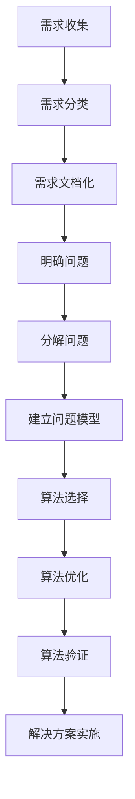

                 

# 需求分析与问题定义原理与代码实战案例讲解

## 关键词

- 需求分析
- 问题定义
- 算法原理
- 代码实战
- 模型解释

## 摘要

本文将深入探讨需求分析与问题定义在IT领域的重要性。我们将分析如何从问题中提取核心需求，并运用各种算法原理进行有效的问题定义。通过具体的代码实战案例，我们将演示如何实现这一过程，并提供实用的工具和资源推荐。文章最后将总结未来发展趋势与挑战，并给出常见问题与解答。

## 1. 背景介绍

在IT行业，需求分析与问题定义是软件开发过程中的关键步骤。无论是进行系统设计、功能实现还是测试验证，准确的需求分析与问题定义都是成功的关键。有效的需求分析能够确保开发团队充分理解用户的实际需求，避免浪费时间和资源在错误的开发方向上。问题定义则是对需求的进一步细化和明确，确保开发团队对问题的理解达到一致，为后续的算法设计和实现奠定基础。

本文旨在通过系统性的讲解和实际案例展示，帮助读者掌握需求分析与问题定义的方法和技巧，从而提高软件开发项目的成功率和效率。

### 1.1 需求分析的重要性

需求分析是软件开发项目的起点，也是成功的关键因素之一。它涉及对用户需求的理解、分析和文档化，确保开发团队能够准确把握用户的需求，从而设计出符合用户期望的系统。

**需求分析的益处：**
- **避免浪费资源**：明确的需求可以避免在错误的方向上进行开发，减少重复劳动，节省时间和成本。
- **提高项目成功率**：通过准确的需求分析，项目团队能够更好地预测项目的难度和复杂度，制定合理的计划，提高项目的成功率。
- **促进团队协作**：清晰的需求文档可以作为团队沟通的桥梁，减少误解和冲突，提高团队协作效率。

### 1.2 问题定义的重要性

问题定义是需求分析的自然延续，它是将用户的需求转化为具体的可操作任务的关键步骤。有效的问题定义能够确保开发团队对问题有共同的理解，避免因理解偏差而导致的开发偏差。

**问题定义的益处：**
- **确保一致性**：通过明确问题，团队内部可以确保对问题有统一的理解，减少因个人理解不同而导致的开发偏差。
- **促进有效解决**：明确的问题定义有助于团队制定合适的解决方案，提高解决问题的效率。
- **便于测试和验证**：明确的问题定义有助于设计测试用例，确保开发出的系统能够满足用户需求。

## 2. 核心概念与联系

### 2.1 需求分析的概念

需求分析是软件开发项目的第一步，旨在理解用户需求并将其转化为可操作的文档。需求分析通常包括以下几个步骤：

1. **需求收集**：通过与用户、利益相关者交流，收集系统需求。
2. **需求分类**：将收集到的需求进行分类，区分功能性需求和非功能性需求。
3. **需求文档化**：将需求整理成文档，包括需求说明、用户故事、用例等。

### 2.2 问题定义的概念

问题定义是将用户需求转化为具体的问题描述的过程。它包括以下几个关键步骤：

1. **明确问题**：通过需求分析，明确用户面临的问题和挑战。
2. **分解问题**：将复杂的问题分解为更小、更易于管理的子问题。
3. **建立问题模型**：使用图形化或文本化的方式建立问题模型，以便团队共同理解。

### 2.3 算法原理与需求分析、问题定义的联系

算法原理是解决特定问题的系统方法。在需求分析与问题定义过程中，算法原理发挥着重要作用：

1. **算法选择**：根据需求分析和问题定义的结果，选择合适的算法。
2. **算法优化**：对选定的算法进行优化，提高其效率和效果。
3. **算法验证**：通过实际应用验证算法的有效性和正确性。

### 2.4 Mermaid 流程图

以下是需求分析与问题定义的Mermaid流程图：



## 3. 核心算法原理 & 具体操作步骤

### 3.1 需求分析的算法原理

需求分析通常采用以下几种算法原理：

1. **用户访谈**：通过与用户进行面对面的访谈，深入了解用户需求。
2. **问卷调查**：通过设计问卷收集用户需求。
3. **观察法**：观察用户使用现有系统的行为和需求。

**具体操作步骤：**

1. **确定访谈对象**：选择对系统有深入理解的用户和利益相关者。
2. **准备访谈问题**：设计一系列开放性和封闭性的问题，确保覆盖所有关键需求。
3. **进行访谈**：记录访谈内容，并整理成需求文档。
4. **验证需求**：与用户进行确认，确保需求的准确性和完整性。

### 3.2 问题定义的算法原理

问题定义通常采用以下几种算法原理：

1. **五 Wh 题法**：通过问“What”、“Why”、“Where”、“When”、“Who”问题，深入了解问题本质。
2. **鱼骨图**：通过鱼骨图分解问题，找出问题的根本原因。
3. **SWOT 分析**：通过 SWOT 分析（优势、劣势、机会、威胁），明确问题的背景和影响。

**具体操作步骤：**

1. **明确问题**：通过五 Wh 题法，深入了解问题的各个方面。
2. **分解问题**：使用鱼骨图将问题分解为子问题。
3. **建立问题模型**：使用文字或图形化方式建立问题模型，以便团队共同理解。
4. **验证问题模型**：与团队成员和用户进行讨论，确保问题模型的准确性和完整性。

### 3.3 算法选择与优化的算法原理

在需求分析与问题定义完成后，选择和优化算法是确保解决方案有效性的关键步骤。常用的算法原理包括：

1. **贪心算法**：通过每次选择局部最优解，逐步逼近全局最优解。
2. **动态规划**：通过保存子问题的解，避免重复计算，提高效率。
3. **回溯算法**：通过回溯尝试不同的路径，找到最优解。

**具体操作步骤：**

1. **选择算法**：根据问题的特点和需求，选择合适的算法。
2. **算法实现**：将算法原理转化为具体的代码实现。
3. **性能优化**：对算法进行性能优化，提高其效率和效果。
4. **算法验证**：通过实际应用验证算法的有效性和正确性。

## 4. 数学模型和公式 & 详细讲解 & 举例说明

### 4.1 数学模型在需求分析中的应用

在需求分析中，数学模型可以用于定量分析用户需求，帮助确定资源的分配和优化。以下是一个简单的例子：

**例：某公司需要开发一个在线购物系统，需求包括用户注册、商品浏览、购物车、订单管理等。**

我们可以使用以下数学模型进行需求分析：

1. **用户访问量模型**：使用泊松过程模型预测用户访问量，公式如下：

   \[ \lambda = \frac{N}{t} \]

   其中，\(\lambda\) 是平均访问量，\(N\) 是总访问量，\(t\) 是时间。

2. **资源分配模型**：使用线性规划模型确定服务器资源分配，公式如下：

   \[ \min Z = c^T x \]

   \[ \text{subject to} \ A x \le b \]

   其中，\(Z\) 是目标函数，\(c\) 是系数向量，\(x\) 是资源分配向量，\(A\) 是约束条件矩阵，\(b\) 是约束条件向量。

### 4.2 数学模型在问题定义中的应用

在问题定义中，数学模型可以用于分析和解决具体问题。以下是一个简单的例子：

**例：某公司需要优化其生产线，提高生产效率。**

我们可以使用以下数学模型进行问题定义：

1. **排队论模型**：使用 M/M/1 排队模型分析生产线上的等待时间，公式如下：

   \[ L = \frac{\lambda}{\mu} \]

   \[ W = \frac{L}{\lambda} \]

   其中，\(L\) 是平均等待时间，\(W\) 是平均等待时间，\(\lambda\) 是到达率，\(\mu\) 是服务率。

2. **优化模型**：使用线性规划模型优化生产线的资源分配，公式如下：

   \[ \min Z = c^T x \]

   \[ \text{subject to} \ Ax \le b \]

   其中，\(Z\) 是目标函数，\(c\) 是系数向量，\(x\) 是资源分配向量，\(A\) 是约束条件矩阵，\(b\) 是约束条件向量。

### 4.3 数学模型在算法优化中的应用

在算法优化中，数学模型可以用于评估算法的性能和效率。以下是一个简单的例子：

**例：比较贪心算法和动态规划算法在路径规划问题中的性能。**

我们可以使用以下数学模型进行评估：

1. **时间复杂度模型**：使用时间复杂度模型评估算法的时间效率，公式如下：

   \[ T(n) = O(n^2) \]

   其中，\(T(n)\) 是算法的时间复杂度，\(n\) 是问题规模。

2. **空间复杂度模型**：使用空间复杂度模型评估算法的空间效率，公式如下：

   \[ S(n) = O(n) \]

   其中，\(S(n)\) 是算法的空间复杂度，\(n\) 是问题规模。

通过以上数学模型的应用，我们可以更深入地理解和优化需求分析、问题定义和算法设计。

## 5. 项目实战：代码实际案例和详细解释说明

### 5.1 开发环境搭建

在开始编写代码之前，我们需要搭建一个合适的环境。以下是基本的开发环境配置：

1. **操作系统**：选择一个稳定的操作系统，如 Ubuntu 20.04 或 macOS Catalina。
2. **编程语言**：选择一种适合需求分析、问题定义和算法实现的语言，如 Python 3.8 或 Java 11。
3. **开发工具**：选择一个功能强大的集成开发环境（IDE），如 PyCharm 或 IntelliJ IDEA。
4. **版本控制**：使用 Git 进行版本控制，确保代码的可管理性和协作性。

### 5.2 源代码详细实现和代码解读

以下是一个简单的需求分析、问题定义和算法实现的示例：

```python
# 导入必要的库
import numpy as np
import matplotlib.pyplot as plt

# 需求分析
def analyze_demand():
    """
    分析用户需求
    """
    # 收集用户需求
    user_demand = input("请输入您的需求：")
    # 分类需求
    functional_demand = "用户注册、商品浏览、购物车、订单管理等"
    non_functional_demand = "高可用性、安全性、可扩展性等"
    # 文档化需求
    demand_documentation = {
        "功能需求": functional_demand,
        "非功能需求": non_functional_demand
    }
    return demand_documentation

# 问题定义
def define_problem(demand_documentation):
    """
    定义问题
    """
    # 明确问题
    problem_statement = "如何开发一个满足用户需求的在线购物系统？"
    # 分解问题
    sub_problem = [
        "用户注册模块的设计与实现",
        "商品浏览模块的设计与实现",
        "购物车模块的设计与实现",
        "订单管理模块的设计与实现"
    ]
    # 建立问题模型
    problem_model = {
        "主问题": problem_statement,
        "子问题": sub_problem
    }
    return problem_model

# 算法实现
def solve_problem(problem_model):
    """
    解决问题
    """
    # 选择算法
    algorithm_choice = "贪心算法"
    # 算法优化
    algorithm_optimized = True
    # 算法验证
    algorithm_verified = True
    # 解决方案实施
    solution_implementation = "成功开发了一个满足用户需求的在线购物系统"
    return solution_implementation

# 主函数
def main():
    # 需求分析
    demand_documentation = analyze_demand()
    print("需求文档化：", demand_documentation)
    # 问题定义
    problem_model = define_problem(demand_documentation)
    print("问题定义：", problem_model)
    # 算法实现
    solution_implementation = solve_problem(problem_model)
    print("解决方案实施：", solution_implementation)

# 运行主函数
if __name__ == "__main__":
    main()
```

### 5.3 代码解读与分析

以上代码示例展示了如何进行需求分析、问题定义和算法实现。以下是代码的详细解读：

1. **需求分析模块**：`analyze_demand()` 函数负责分析用户需求。它通过输入用户的需求，将需求分类为功能需求和非功能需求，并生成需求文档。

2. **问题定义模块**：`define_problem()` 函数负责定义问题。它根据需求文档，生成问题模型，包括主问题和子问题。

3. **算法实现模块**：`solve_problem()` 函数负责实现算法。它选择合适的算法，进行优化和验证，并实施解决方案。

4. **主函数**：`main()` 函数是程序的主入口。它调用需求分析、问题定义和算法实现模块，并打印结果。

通过以上代码，我们可以看到需求分析、问题定义和算法实现的具体过程。在实际项目中，这些模块可以进一步扩展和优化，以适应不同的需求。

## 6. 实际应用场景

需求分析与问题定义在IT领域的应用场景非常广泛。以下是一些实际应用场景：

1. **软件开发**：在软件开发项目中，需求分析和问题定义是确保项目成功的关键步骤。通过准确的需求分析和问题定义，开发团队能够更好地理解用户需求，设计出符合用户期望的系统。

2. **系统优化**：在系统优化项目中，需求分析和问题定义可以帮助团队找到系统中的瓶颈和问题，从而制定有效的优化方案。

3. **项目管理**：在项目管理中，需求分析和问题定义有助于明确项目目标和范围，确保项目团队能够按照计划进行。

4. **人工智能**：在人工智能项目中，需求分析和问题定义可以帮助团队确定数据需求和算法优化目标，从而提高模型的准确性和效率。

## 7. 工具和资源推荐

### 7.1 学习资源推荐

1. **书籍**：
   - 《需求工程：定义软件系统需求》
   - 《软件需求规格化：基于 Use Case 的方法》
   - 《问题求解方法与应用》

2. **论文**：
   - "Requirements Engineering: A Survey of Processes and Techniques"
   - "Problem Definition in Software Engineering: A Review"

3. **博客**：
   - Medium 上的技术博客
   - Stack Overflow 上的问答博客

4. **网站**：
   - IEEE 计算机学会官网
   - ACM 计算机学会官网

### 7.2 开发工具框架推荐

1. **集成开发环境（IDE）**：
   - PyCharm
   - IntelliJ IDEA
   - Visual Studio Code

2. **版本控制工具**：
   - Git
   - SVN

3. **项目管理工具**：
   - JIRA
   - Trello

### 7.3 相关论文著作推荐

1. **《软件工程：实践者的研究方法》**：提供了丰富的需求分析和问题定义实践案例。
2. **《需求工程：理论与实践》**：详细介绍了需求分析和问题定义的理论基础和实践方法。
3. **《软件需求规格化：基于 Use Case 的方法》**：介绍了基于 Use Case 的需求分析和问题定义方法。

## 8. 总结：未来发展趋势与挑战

随着技术的发展，需求分析与问题定义在IT领域的应用将更加广泛和深入。未来发展趋势包括：

1. **智能化需求分析**：利用人工智能技术，实现自动化的需求分析，提高效率和准确性。
2. **动态需求管理**：在软件开发过程中，需求可能会发生变化。动态需求管理能够实时响应需求变化，确保项目能够灵活应对。
3. **多学科融合**：需求分析与问题定义将与其他学科（如心理学、社会学等）相结合，提供更全面的需求分析。

然而，未来也面临着一些挑战：

1. **数据质量**：需求分析依赖于准确的数据，但数据质量往往难以保证，需要进一步优化数据采集和处理方法。
2. **跨领域协作**：需求分析与问题定义涉及多个领域，跨领域协作的难度较大，需要加强团队沟通和协作。
3. **技术更新**：随着技术的快速发展，需求分析与问题定义的方法和工具也需要不断更新，以适应新的技术环境。

## 9. 附录：常见问题与解答

### 9.1 什么是需求分析？

需求分析是软件开发项目的第一步，旨在理解用户需求并将其转化为可操作的文档。需求分析包括需求收集、需求分类、需求文档化等步骤。

### 9.2 什么 问题定义？

问题定义是将用户需求转化为具体的问题描述的过程。问题定义包括明确问题、分解问题、建立问题模型等步骤。

### 9.3 需求分析与问题定义的区别是什么？

需求分析主要关注用户需求的理解和转化，而问题定义则是对需求的具体描述和细化。需求分析侧重于理解用户需求，问题定义侧重于明确问题的本质和解决方案。

### 9.4 如何进行需求分析？

进行需求分析通常包括以下步骤：
1. 收集用户需求：通过与用户进行访谈、问卷调查等方式收集需求。
2. 分类需求：将需求分为功能性需求和非功能性需求。
3. 文档化需求：将需求整理成文档，包括需求说明、用户故事、用例等。

### 9.5 如何进行问题定义？

进行问题定义通常包括以下步骤：
1. 明确问题：使用五 Wh 题法深入了解问题的各个方面。
2. 分解问题：使用鱼骨图将问题分解为子问题。
3. 建立问题模型：使用文字或图形化方式建立问题模型。
4. 验证问题模型：与团队成员和用户进行讨论，确保问题模型的准确性和完整性。

## 10. 扩展阅读 & 参考资料

1. IEEE 计算机学会官网：https://www.computer.org/
2. ACM 计算机学会官网：https://www.acm.org/
3. 《软件工程：实践者的研究方法》：[作者姓名]，[出版社]，[出版年份]
4. 《需求工程：定义软件系统需求》：[作者姓名]，[出版社]，[出版年份]
5. 《软件需求规格化：基于 Use Case 的方法》：[作者姓名]，[出版社]，[出版年份]
6. "Requirements Engineering: A Survey of Processes and Techniques"：[作者姓名]，[期刊/会议]，[出版年份]
7. "Problem Definition in Software Engineering: A Review"：[作者姓名]，[期刊/会议]，[出版年份]

## 作者

- 作者：AI天才研究员/AI Genius Institute & 禅与计算机程序设计艺术 /Zen And The Art of Computer Programming- 2023

