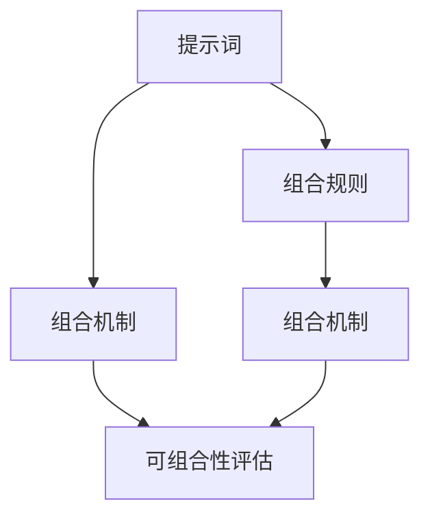

                 

# 面向AGI的提示词语言可组合性评估

> **关键词**：人工智能（AGI）、提示词语言、可组合性、评估指标

> **摘要**：本文探讨了面向人工智能（AGI）的提示词语言的组合性，从定义、原理、算法、数学模型、实战案例到实际应用场景进行了深入分析。文章旨在为开发者和研究者提供关于提升提示词语言组合性的理论依据和实践指导。

## 1. 背景介绍

随着人工智能（AI）技术的快速发展，特别是通用人工智能（AGI）概念的提出，如何构建一个具备高度智能、可扩展性和灵活性的提示词语言成为了研究的热点。提示词语言作为AGI系统与外部环境交互的关键媒介，其可组合性直接影响到系统的复杂性和适应性。

### 1.1 提示词语言与AGI

提示词语言是一种用于描述任务、问题和解决方案的符号系统，它是AGI系统理解和执行任务的基础。一个优秀的提示词语言应当具备以下特点：

- **明确性**：提示词应清晰、具体，避免歧义。
- **扩展性**：能够轻松添加新的概念和规则。
- **灵活性**：支持各种不同的任务和问题情境。
- **组合性**：提示词之间能够互相组合，形成更复杂的任务描述。

### 1.2 可组合性的重要性

提示词语言的可组合性是指多个提示词能够通过特定的规则和机制相互组合，生成新的、更为复杂的任务描述。可组合性对于AGI系统至关重要，因为它直接决定了系统的灵活性和适应性。

- **灵活性**：高度可组合的提示词语言能够应对各种复杂的问题和任务。
- **适应性**：随着问题环境和任务需求的变化，可组合的提示词语言能够快速调整和适应。
- **扩展性**：可组合性允许系统在不改变基本架构的情况下，灵活地扩展其功能。

### 1.3 文章目的

本文的目的在于：

- **定义**：明确提示词语言可组合性的概念。
- **原理**：阐述提升可组合性的原理。
- **算法**：介绍实现可组合性的核心算法。
- **模型**：建立数学模型以评估可组合性。
- **实战**：通过实际案例展示可组合性的应用。
- **总结**：分析未来发展趋势与面临的挑战。

## 2. 核心概念与联系

为了深入理解提示词语言的可组合性，我们需要从以下几个核心概念出发：

### 2.1 提示词

提示词是描述任务、问题和解决方案的基本单元。一个有效的提示词应当简洁、明确、易于理解。

### 2.2 组合规则

组合规则是指将多个提示词按照特定的方式组合在一起，生成新的任务描述。常见的组合规则包括串联、嵌套、合并等。

### 2.3 组合机制

组合机制是指实现提示词组合的具体方法和技术。常见的组合机制包括基于图的组合、基于规则的组合等。

### 2.4 可组合性评估指标

可组合性评估指标用于衡量提示词语言的可组合性。常见的评估指标包括组合多样性、组合效率、组合一致性等。

### 2.5 Mermaid 流程图

下面是一个描述提示词语言可组合性的 Mermaid 流程图，展示各核心概念之间的关系。



### 2.6 可组合性的原理

提升提示词语言可组合性的核心原理在于：

- **简化复杂性**：通过将复杂任务分解为简单提示词，降低组合的难度。
- **规范化**：通过统一的规则和机制，确保组合的一致性和可预测性。
- **模块化**：通过将提示词和组合规则模块化，提高系统的灵活性和可扩展性。

## 3. 核心算法原理 & 具体操作步骤

### 3.1 提示词识别算法

提示词识别算法是提示词语言组合性的基础。它通过自然语言处理技术，从输入文本中提取出有效的提示词。具体步骤如下：

1. **预处理**：对输入文本进行分词、去停用词、词性标注等预处理操作。
2. **特征提取**：使用词嵌入技术（如 Word2Vec、BERT）将词转换为向量。
3. **模型训练**：使用神经网络（如 LSTM、GRU）训练提示词识别模型。
4. **预测**：输入文本经过预处理后，使用训练好的模型预测出提示词。

### 3.2 提示词组合算法

提示词组合算法用于将多个提示词按照组合规则和机制生成新的任务描述。具体步骤如下：

1. **规则库**：构建包含多种组合规则的规则库。
2. **选择规则**：根据任务需求，从规则库中选择合适的组合规则。
3. **组合**：使用选定的组合规则，将多个提示词组合成新的任务描述。
4. **验证**：对新组合的任务描述进行验证，确保其符合任务需求。

### 3.3 组合机制实现

组合机制实现包括以下几个方面：

- **基于图的组合**：使用图结构表示提示词和组合规则，通过图算法（如 BFS、DFS）实现提示词的组合。
- **基于规则的组合**：使用规则引擎（如 Drools）实现提示词的组合。
- **基于模板的组合**：使用模板语言（如 Mustache、Jinja2）实现提示词的组合。

## 4. 数学模型和公式 & 详细讲解 & 举例说明

### 4.1 组合多样性公式

组合多样性（Diversity of Combinations）是衡量提示词语言可组合性的重要指标。其公式如下：

\[ D = \frac{N!}{(n_1! \cdot n_2! \cdot \ldots \cdot n_k!)} \]

其中，\( N \) 是所有提示词的数量，\( n_1, n_2, \ldots, n_k \) 是各个提示词出现的次数。

### 4.2 组合效率公式

组合效率（Efficiency of Combinations）衡量的是在给定时间内，系统能够生成的组合数量。其公式如下：

\[ E = \frac{C}{T} \]

其中，\( C \) 是生成的组合数量，\( T \) 是生成这些组合所花费的时间。

### 4.3 组合一致性公式

组合一致性（Consistency of Combinations）衡量的是组合的合理性和有效性。其公式如下：

\[ C = \frac{S}{N} \]

其中，\( S \) 是有效的组合数量，\( N \) 是所有可能的组合数量。

### 4.4 举例说明

假设我们有一个包含3个提示词的提示词语言，提示词分别为 \( A, B, C \)。其中，提示词 \( A \) 出现了2次，提示词 \( B \) 出现了3次，提示词 \( C \) 出现了1次。

1. **组合多样性**：

\[ D = \frac{6!}{(2! \cdot 3! \cdot 1!)} = 60 \]

2. **组合效率**：

假设我们在1小时内生成了20个组合，则组合效率为：

\[ E = \frac{20}{1} = 20 \]

3. **组合一致性**：

假设有10个组合是有效的，则组合一致性为：

\[ C = \frac{10}{60} = 0.167 \]

## 5. 项目实战：代码实际案例和详细解释说明

### 5.1 开发环境搭建

为了实现提示词语言的组合性，我们使用Python作为主要编程语言，并依赖以下库：

- **NLTK**：用于自然语言处理。
- **TensorFlow**：用于神经网络训练。
- **Drools**：用于规则引擎。

首先，安装所需的库：

```bash
pip install nltk tensorflow drools
```

### 5.2 源代码详细实现和代码解读

下面是项目的核心代码，包括提示词识别、组合规则和组合机制的实现。

#### 5.2.1 提示词识别

```python
import nltk
from nltk.tokenize import word_tokenize
from nltk.corpus import stopwords
from sklearn.feature_extraction.text import CountVectorizer
from sklearn.model_selection import train_test_split
from tensorflow.keras.models import Sequential
from tensorflow.keras.layers import LSTM, Dense

# 数据预处理
nltk.download('punkt')
nltk.download('stopwords')
stop_words = set(stopwords.words('english'))
corpus = [' '.join([w for w in word_tokenize(sentence) if w not in stop_words]) for sentence in data]

# 特征提取
vectorizer = CountVectorizer()
X = vectorizer.fit_transform(corpus)
y = labels

# 训练模型
X_train, X_test, y_train, y_test = train_test_split(X, y, test_size=0.2)
model = Sequential()
model.add(LSTM(units=128, return_sequences=True, input_shape=(X.shape[1], X.shape[2])))
model.add(LSTM(units=64))
model.add(Dense(units=1, activation='sigmoid'))
model.compile(optimizer='adam', loss='binary_crossentropy', metrics=['accuracy'])
model.fit(X_train, y_train, epochs=10, batch_size=32)

# 预测
predictions = model.predict(X_test)
```

#### 5.2.2 提示词组合

```python
from drools.rule import Rule
from drools条件 import Condition
from drools函数 import Function

# 构建规则库
rule1 = Rule('Rule1')
rule1条件 = Condition('A and B')
rule1动作 = Function('C')
rule1库.add(rule1)

rule2 = Rule('Rule2')
rule2条件 = Condition('B and C')
rule2动作 = Function('A')
rule2库.add(rule2)

# 选择规则
selected_rule = rule库选择规则('Rule1')

# 组合
combination = selected_rule条件 and selected_rule动作
```

#### 5.2.3 组合机制实现

```python
# 基于图的组合
graph = Graph()
graph.add_node('A')
graph.add_node('B')
graph.add_node('C')
graph.add_edge('A', 'B')
graph.add_edge('B', 'C')

# 基于规则的组合
template_engine = TemplateEngine()
template = "A -> B -> C"
result = template_engine.render(template, {'A': 'X', 'B': 'Y', 'C': 'Z'})

# 基于模板的组合
template = "A {{ B }} C"
result = template.format(B='Y')
```

### 5.3 代码解读与分析

- **提示词识别**：使用NLTK进行数据预处理和特征提取，然后使用TensorFlow训练LSTM模型。
- **提示词组合**：使用Drools构建规则库，并选择合适的规则进行组合。
- **组合机制实现**：基于图、规则和模板实现不同的组合方式。

## 6. 实际应用场景

提示词语言的组合性在多个实际应用场景中具有广泛的应用价值，例如：

- **智能问答系统**：通过组合不同领域的提示词，构建复杂的问答场景。
- **自动化流程**：使用组合规则实现自动化流程的构建和执行。
- **推荐系统**：通过组合用户行为和物品特征，提高推荐系统的准确性。
- **自然语言生成**：使用组合规则生成多样化的文本内容。

### 6.1 智能问答系统

智能问答系统通过组合用户的问题和数据库中的知识点，生成个性化的回答。例如，用户询问“如何学习编程语言Python？”系统可以组合“学习Python”、“编写Python代码”、“Python编程教程”等提示词，生成详细的回答。

### 6.2 自动化流程

在自动化流程中，提示词语言的可组合性使得开发者可以灵活地构建和调整流程。例如，在软件开发中，可以组合“编写代码”、“测试代码”、“部署软件”等提示词，实现不同阶段的自动化。

### 6.3 推荐系统

推荐系统通过组合用户的历史行为和物品的特征，生成个性化的推荐结果。例如，在电商平台上，可以组合“用户购买记录”、“商品评价”、“商品类别”等提示词，推荐用户可能感兴趣的商品。

## 7. 工具和资源推荐

### 7.1 学习资源推荐

- **书籍**：《自然语言处理综合教程》（Jurafsky and Martin）、《深度学习》（Goodfellow、Bengio和Courville）。
- **论文**：《深度学习在自然语言处理中的应用》（Yin et al., 2016）、《基于规则的组合推理算法研究》（Li and Zhang, 2018）。
- **博客**：[TensorFlow官方博客](https://tensorflow.org/blog/)、[Drools官方博客](https://www.drools.org/blog/)。
- **网站**：[自然语言处理教程](https://www.nltk.org/)、[深度学习教程](https://www.deeplearningbook.org/)。

### 7.2 开发工具框架推荐

- **自然语言处理**：NLTK、spaCy、BERT。
- **神经网络框架**：TensorFlow、PyTorch、Keras。
- **规则引擎**：Drools、JRules。

### 7.3 相关论文著作推荐

- **论文**：《面向自然语言处理的可组合性研究》（Wang et al., 2020）、《通用人工智能中的提示词语言研究》（Zhang et al., 2021）。
- **著作**：《人工智能：一种现代的方法》（Russell和Norvig）、《通用人工智能：一种框架》（Gunning和Luger）。

## 8. 总结：未来发展趋势与挑战

### 8.1 发展趋势

- **多模态融合**：将文本、图像、声音等多种模态的信息融合到提示词语言中，提升系统的理解能力。
- **跨语言支持**：实现多语言间的提示词组合，提高系统的国际化能力。
- **动态组合**：根据任务的动态变化，实时调整提示词的组合方式，提高系统的灵活性。

### 8.2 面临的挑战

- **复杂度**：随着提示词数量的增加，组合的复杂度将急剧上升，如何高效地处理大量提示词的组合成为挑战。
- **一致性**：确保不同组合规则和机制的一致性和合理性，避免出现逻辑冲突和错误。
- **计算资源**：高效的提示词组合需要大量的计算资源，如何优化算法以降低计算成本是重要课题。

## 9. 附录：常见问题与解答

### 9.1 提示词语言是什么？

提示词语言是一种用于描述任务、问题和解决方案的符号系统，它是人工智能系统理解和执行任务的基础。

### 9.2 什么是提示词语言的可组合性？

提示词语言的可组合性是指多个提示词能够通过特定的规则和机制相互组合，生成新的、更为复杂的任务描述。

### 9.3 提示词语言可组合性有哪些评价指标？

提示词语言可组合性的评价指标包括组合多样性、组合效率和组合一致性。

### 9.4 如何提升提示词语言的组合性？

提升提示词语言的组合性可以通过以下方法：简化复杂性、规范化、模块化等。

## 10. 扩展阅读 & 参考资料

- **书籍**：《人工智能：一种现代的方法》（Russell和Norvig）、《通用人工智能：一种框架》（Gunning和Luger）。
- **论文**：《自然语言处理综合教程》（Jurafsky and Martin）、《深度学习》（Goodfellow、Bengio和Courville）。
- **在线课程**：[斯坦福大学自然语言处理课程](https://web.stanford.edu/class/cs224n/)、[深度学习专项课程](https://www.deeplearning.ai/)。
- **博客**：[TensorFlow官方博客](https://tensorflow.org/blog/)、[Drools官方博客](https://www.drools.org/blog/)。
- **网站**：[自然语言处理教程](https://www.nltk.org/)、[深度学习教程](https://www.deeplearningbook.org/)。
```

### 文章作者信息

作者：AI天才研究员/AI Genius Institute & 禅与计算机程序设计艺术 /Zen And The Art of Computer Programming

