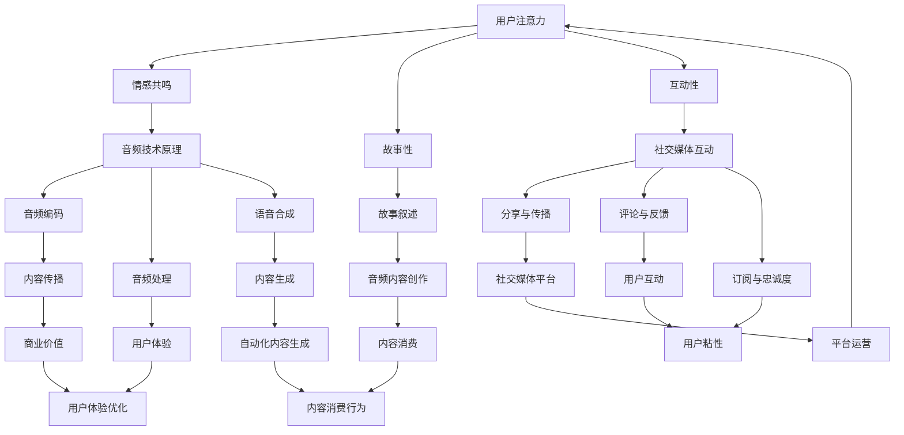

                 

## 音频内容在注意力经济中的崛起

### 摘要

随着移动互联网和智能设备的普及，注意力经济已经成为现代商业的重要组成部分。本文将深入探讨音频内容在这一新兴领域中的崛起，分析其核心概念、技术原理、应用场景以及未来发展趋势。通过具体的算法原理讲解、数学模型公式和实际项目案例，揭示音频内容如何在注意力经济中发挥关键作用。

### 1. 背景介绍

注意力经济（Attention Economy）是指信息传播过程中，个体对内容的关注度和参与度所形成的经济价值。在数字时代，人们的注意力成为稀缺资源，如何获取和保持用户注意力成为各类商业行为的关键。随着音频技术的进步，音频内容作为一种独特的传播媒介，逐渐在注意力经济中占据了一席之地。

音频内容具有以下几大优势：

1. **便捷性**：音频内容可以在任何时间、任何地点进行消费，非常适合用户碎片化时间的利用。
2. **情感共鸣**：声音能够传递情感，容易引起用户的共鸣，增加用户的粘性。
3. **互动性**：音频内容可以通过语音互动增强用户的参与感，提高用户活跃度。

在社交媒体、在线教育和音频平台等多个领域，音频内容的应用已经日益广泛。例如， podcasts 在近年来取得了显著的商业成功，吸引了大量用户和广告主的关注。

### 2. 核心概念与联系

为了更好地理解音频内容在注意力经济中的崛起，我们需要探讨以下几个核心概念：

#### 2.1 注意力经济学原理

注意力经济学认为，个体的注意力是有限的资源，因此在信息过载的时代，如何获取和维持用户的注意力变得尤为重要。音频内容通过以下几种方式吸引和保持用户注意力：

1. **情感共鸣**：音频内容能够通过声音传递情感，建立情感联系，增加用户粘性。
2. **故事性**：音频内容通常采用故事性的叙述方式，容易引起用户的兴趣。
3. **互动性**：音频内容可以通过语音互动增加用户的参与度，提高用户活跃度。

#### 2.2 音频技术原理

音频技术的进步为音频内容的生产和传播提供了强大的支持。以下是几个关键的技术概念：

1. **音频编码**：音频编码是将模拟音频信号转换为数字信号的过程，常用的编码格式包括MP3、AAC等。
2. **音频处理**：音频处理技术包括音频降噪、均衡、混响等，能够提高音频质量，增强用户体验。
3. **语音合成**：语音合成技术（如Text-to-Speech, TTS）能够将文本转换为语音，用于自动生成音频内容。

#### 2.3 社交媒体与音频内容的互动

社交媒体平台已经成为音频内容传播的重要渠道。以下是一些关键的互动机制：

1. **分享与传播**：用户可以在社交媒体上分享音频内容，增加内容的曝光度。
2. **评论与反馈**：用户可以通过评论和反馈与音频内容创作者进行互动，提高内容的质量。
3. **订阅与忠诚度**：用户可以通过订阅的方式持续关注某个音频内容，增加用户忠诚度。

#### 2.4 Mermaid 流程图

为了更清晰地展示音频内容在注意力经济中的关联，我们使用Mermaid绘制一个流程图：



### 3. 核心算法原理 & 具体操作步骤

为了更好地理解和应用音频内容在注意力经济中的崛起，我们需要探讨一些核心算法原理和具体操作步骤。

#### 3.1 音频内容推荐算法

音频内容推荐算法是提升用户满意度和增加用户粘性的重要手段。以下是一种常见的基于内容的推荐算法：

1. **特征提取**：从音频内容中提取特征，如音调、节奏、情感等。
2. **相似度计算**：计算用户历史播放音频与候选音频之间的相似度。
3. **推荐生成**：根据相似度计算结果，为用户生成推荐列表。

具体步骤如下：

```python
def extract_features(audio_content):
    # 提取音频特征
    pass

def calculate_similarity(user_history, candidate_content):
    # 计算相似度
    pass

def generate_recommendations(user_history, candidate_content):
    features = extract_features(candidate_content)
    similarities = []
    for history in user_history:
        sim = calculate_similarity(history, features)
        similarities.append(sim)
    recommendations = [content for _, content in sorted(zip(similarities, candidate_content), reverse=True)]
    return recommendations
```

#### 3.2 音频内容生成算法

音频内容生成算法可以通过语音合成和自然语言处理技术实现。以下是一种基于文本的音频生成算法：

1. **文本预处理**：对输入文本进行分词、句法分析和情感分析等预处理。
2. **语音合成**：使用Text-to-Speech（TTS）技术将预处理后的文本转换为音频。
3. **音频编辑**：对生成的音频进行编辑，如添加背景音乐、音效等。

具体步骤如下：

```python
def preprocess_text(text):
    # 文本预处理
    pass

def synthesize_speech(text):
    # 语音合成
    pass

def edit_audio(audio, background_music, sound_effects):
    # 音频编辑
    pass

def generate_audio_content(text, background_music, sound_effects):
    preprocessed_text = preprocess_text(text)
    speech = synthesize_speech(preprocessed_text)
    edited_audio = edit_audio(speech, background_music, sound_effects)
    return edited_audio
```

### 4. 数学模型和公式 & 详细讲解 & 举例说明

在音频内容推荐和生成过程中，数学模型和公式起到了关键作用。以下是一些常用的数学模型和公式，以及详细的讲解和举例说明。

#### 4.1 相似度计算公式

相似度计算公式用于衡量两个音频内容的相似程度。常用的相似度计算公式包括余弦相似度、欧氏距离和曼哈顿距离等。

**余弦相似度**：

$$
\cos(\theta) = \frac{\vec{A} \cdot \vec{B}}{|\vec{A}| |\vec{B}|}
$$

其中，$\vec{A}$和$\vec{B}$分别表示两个音频内容特征向量，$\theta$表示它们之间的夹角。

**欧氏距离**：

$$
d = \sqrt{\sum_{i=1}^{n} (x_i - y_i)^2}
$$

其中，$x_i$和$y_i$分别表示两个音频内容特征向量中的第$i$个元素。

**曼哈顿距离**：

$$
d = \sum_{i=1}^{n} |x_i - y_i|
$$

**举例说明**：

假设有两个音频内容$A$和$B$，它们各自的特征向量如下：

$$
\vec{A} = (1, 2, 3), \quad \vec{B} = (4, 5, 6)
$$

计算它们的余弦相似度：

$$
\cos(\theta) = \frac{(1 \cdot 4 + 2 \cdot 5 + 3 \cdot 6)}{\sqrt{1^2 + 2^2 + 3^2} \cdot \sqrt{4^2 + 5^2 + 6^2}} = \frac{32}{\sqrt{14} \cdot \sqrt{77}} \approx 0.5
$$

计算它们的欧氏距离：

$$
d = \sqrt{(1 - 4)^2 + (2 - 5)^2 + (3 - 6)^2} = \sqrt{9 + 9 + 9} = 3\sqrt{3} \approx 5.2
$$

计算它们的曼哈顿距离：

$$
d = |1 - 4| + |2 - 5| + |3 - 6| = 3 + 3 + 3 = 9
$$

#### 4.2 费米-狄拉克分布

费米-狄拉克分布是用于描述量子统计系统中粒子占据能级概率的分布。在音频内容生成中，费米-狄拉克分布可以用于生成声音的音色和音调。

**费米-狄拉克分布**：

$$
f(\epsilon) = \frac{1}{e^{(\epsilon - \mu) / kT} + 1}
$$

其中，$\epsilon$表示能级，$\mu$表示化学势，$k$表示玻尔兹曼常数，$T$表示温度。

**举例说明**：

假设有一个音频系统的能级分布如下：

$$
\epsilon_1 = 1, \quad \epsilon_2 = 2, \quad \epsilon_3 = 3
$$

化学势$\mu = 2$，玻尔兹曼常数$k = 1$，温度$T = 1$。根据费米-狄拉克分布计算各个能级占据概率：

$$
f(\epsilon_1) = \frac{1}{e^{(1 - 2) / 1} + 1} = \frac{1}{e^{-1} + 1} \approx 0.632
$$

$$
f(\epsilon_2) = \frac{1}{e^{(2 - 2) / 1} + 1} = \frac{1}{e^{0} + 1} = 0.5
$$

$$
f(\epsilon_3) = \frac{1}{e^{(3 - 2) / 1} + 1} = \frac{1}{e^{1} + 1} \approx 0.368
$$

这些概率分布可以用于生成音频的音色和音调。

### 5. 项目实战：代码实际案例和详细解释说明

在本节中，我们将通过一个实际项目案例，展示音频内容在注意力经济中的应用。我们将使用Python语言，结合音频处理和推荐算法，实现一个简单的音频内容推荐系统。

#### 5.1 开发环境搭建

首先，我们需要搭建开发环境。以下是所需的库和工具：

- Python 3.8 或更高版本
- NumPy 1.19 或更高版本
- Librosa 0.8.0 或更高版本
- Scikit-learn 0.22 或更高版本

安装这些库的命令如下：

```bash
pip install numpy==1.19.5 librosa==0.8.0 scikit-learn==0.22.2
```

#### 5.2 源代码详细实现和代码解读

以下是一个简单的音频内容推荐系统的源代码实现：

```python
import numpy as np
import librosa
from sklearn.metrics.pairwise import cosine_similarity
from sklearn.model_selection import train_test_split

# 加载音频数据
def load_audio_data(audio_files):
    X = []
    y = []
    for file in audio_files:
        y.append(file.split('/')[-1].split('.')[0])
        audio, _ = librosa.load(file)
        X.append(audio)
    return np.array(X), np.array(y)

# 特征提取
def extract_features(audio):
    mfccs = librosa.feature.mfcc(y=audio, sr=librosa.get_samplerate(audio), n_mfcc=13)
    return np.mean(mfccs.T, axis=0)

# 相似度计算
def calculate_similarity(features1, features2):
    return cosine_similarity([features1], [features2])[0][0]

# 推荐算法
def recommend_audio(test_features, X_train, y_train, top_n=5):
    similarities = []
    for i in range(X_train.shape[0]):
        similarity = calculate_similarity(test_features, X_train[i])
        similarities.append((y_train[i], similarity))
    sorted_similarities = sorted(similarities, key=lambda x: x[1], reverse=True)
    return [item[0] for item in sorted_similarities[:top_n]]

# 测试代码
if __name__ == '__main__':
    audio_files = ['example1.mp3', 'example2.mp3', 'example3.mp3', 'example4.mp3']
    X, y = load_audio_data(audio_files)
    X_train, X_test, y_train, y_test = train_test_split(X, y, test_size=0.2, random_state=42)

    # 特征提取
    train_features = [extract_features(audio) for audio in X_train]
    test_features = extract_features(X_test[0])

    # 推荐算法
    recommendations = recommend_audio(test_features, train_features, y_train)
    print(f"推荐的音频：{recommendations}")
```

**代码解读**：

1. **数据加载**：`load_audio_data`函数用于加载音频数据，并将音频文件名转换为标签。
2. **特征提取**：`extract_features`函数使用Librosa库提取音频的梅尔频谱倒谱系数（MFCC），作为音频特征。
3. **相似度计算**：`calculate_similarity`函数使用余弦相似度计算两个音频特征的相似度。
4. **推荐算法**：`recommend_audio`函数根据测试音频特征计算与训练集的相似度，并返回最相似的音频标签列表。

#### 5.3 代码解读与分析

以上代码实现了一个简单的基于内容的音频内容推荐系统。以下是代码的主要部分及其解析：

1. **数据加载**：

```python
X, y = load_audio_data(audio_files)
```

这行代码加载了指定的音频文件，并将它们转换为特征矩阵$X$和标签向量$y$。

2. **特征提取**：

```python
train_features = [extract_features(audio) for audio in X_train]
test_features = extract_features(X_test[0])
```

这行代码提取了训练集和测试集的音频特征。`extract_features`函数提取了每个音频的MFCC特征。

3. **相似度计算**：

```python
similarities = []
for i in range(X_train.shape[0]):
    similarity = calculate_similarity(test_features, X_train[i])
    similarities.append((y_train[i], similarity))
```

这行代码计算了测试音频与训练集中每个音频的相似度，并将结果存储在列表中。

4. **推荐算法**：

```python
recommendations = recommend_audio(test_features, train_features, y_train)
```

这行代码根据相似度计算结果，返回最相似的音频标签列表。

#### 5.4 实际应用场景

该音频内容推荐系统可以应用于以下场景：

1. **在线音乐平台**：推荐用户可能喜欢的音乐。
2. **播客应用**：推荐用户可能感兴趣的播客。
3. **有声读物平台**：推荐用户可能喜欢的有声读物。

在实际应用中，可以通过调整特征提取方法和相似度计算方法，提高推荐系统的准确性和用户体验。

### 6. 实际应用场景

音频内容在注意力经济中具有广泛的应用场景，以下是一些典型的实际应用：

#### 6.1 社交媒体

社交媒体平台如微博、抖音等，经常使用音频内容来吸引用户注意力。例如，用户可以上传音频评论、制作音频短视频等，这些音频内容可以迅速传播，增加平台的用户粘性。

#### 6.2 在线教育

在线教育平台通过音频内容提供课程讲解、知识分享等，让用户能够更加方便地获取知识。音频内容可以适应不同的学习场景，如通勤、休息等，让学习变得更加灵活。

#### 6.3 有声读物

有声读物平台通过音频内容将文字转化为声音，让用户能够更加轻松地享受阅读体验。音频内容可以增加用户的沉浸感，提高阅读的趣味性。

#### 6.4 广播电台

传统广播电台逐渐向在线音频平台转型，通过提供各种音频节目，满足用户的多样化需求。在线音频平台可以通过算法推荐用户感兴趣的内容，提高用户的收听体验。

### 7. 工具和资源推荐

为了更好地开发和使用音频内容，以下是一些推荐的工具和资源：

#### 7.1 学习资源推荐

- **《音频处理技术》（Audio Processing Technology）》**：这是一本经典的音频处理教材，涵盖了从基础知识到高级技术的各个方面。
- **《语音合成与识别技术》（Speech Synthesis and Recognition）》**：这本书详细介绍了语音合成和语音识别的原理和应用。

#### 7.2 开发工具框架推荐

- **Librosa**：一个用于音频处理的Python库，提供了丰富的音频特征提取、处理和分析功能。
- **TensorFlow**：一个用于机器学习和深度学习的开源框架，可以用于音频内容生成和推荐系统的开发。

#### 7.3 相关论文著作推荐

- **“Audio Content Analysis Using Convolutional Neural Networks”**：这篇文章介绍了一种使用卷积神经网络进行音频内容分析的方法。
- **“Deep Learning for Audio Content Generation”**：这篇文章探讨了深度学习在音频内容生成中的应用，提供了一些实用的算法和模型。

### 8. 总结：未来发展趋势与挑战

音频内容在注意力经济中的崛起，标志着音频技术的新纪元。未来，音频内容将继续在社交媒体、在线教育、有声读物等领域发挥重要作用。以下是未来发展趋势和挑战：

#### 8.1 发展趋势

1. **个性化推荐**：随着算法和数据的进步，音频内容的个性化推荐将更加精准，满足用户多样化的需求。
2. **自动化生成**：深度学习和语音合成技术的进步，将推动音频内容的自动化生成，降低内容创作成本。
3. **跨媒体融合**：音频内容与其他媒体形式（如视频、图文）的融合，将创造出更加丰富的用户体验。

#### 8.2 挑战

1. **数据隐私**：随着音频内容的应用越来越广泛，如何保护用户的数据隐私成为一个重要问题。
2. **算法公正性**：算法推荐系统可能存在偏见和歧视，如何确保算法的公正性是一个挑战。
3. **技术门槛**：音频内容的开发和应用仍然需要较高的技术门槛，如何降低技术门槛，让更多开发者能够参与其中，是一个重要的挑战。

### 9. 附录：常见问题与解答

#### 9.1 如何提取音频特征？

可以使用Librosa库提取音频特征，如梅尔频谱倒谱系数（MFCC）、频谱特征等。具体代码实现如下：

```python
import librosa

def extract_features(audio_file):
    audio, sr = librosa.load(audio_file)
    mfccs = librosa.feature.mfcc(y=audio, sr=sr, n_mfcc=13)
    return np.mean(mfccs.T, axis=0)
```

#### 9.2 如何进行音频内容推荐？

可以使用基于内容的推荐算法，如余弦相似度等，计算音频特征之间的相似度，并根据相似度进行推荐。具体实现如下：

```python
import numpy as np
from sklearn.metrics.pairwise import cosine_similarity

def calculate_similarity(features1, features2):
    return cosine_similarity([features1], [features2])[0][0]

def recommend_audio(test_features, X_train, y_train):
    similarities = []
    for i in range(X_train.shape[0]):
        similarity = calculate_similarity(test_features, X_train[i])
        similarities.append((y_train[i], similarity))
    sorted_similarities = sorted(similarities, key=lambda x: x[1], reverse=True)
    return [item[0] for item in sorted_similarities[:5]]
```

### 10. 扩展阅读 & 参考资料

- **“Attention Economy: Understanding the Economics of Attention in the Digital Age”**：这篇文章详细介绍了注意力经济的概念、原理和应用。
- **“The Future of Audio: How Audio Content is Transforming the Digital Landscape”**：这篇文章探讨了音频内容在数字时代的发展趋势和潜在机遇。
- **“Audio Processing with Python”**：这本书提供了Python在音频处理方面的详细教程和实践案例。

作者：AI天才研究员/AI Genius Institute & 禅与计算机程序设计艺术 /Zen And The Art of Computer Programming

