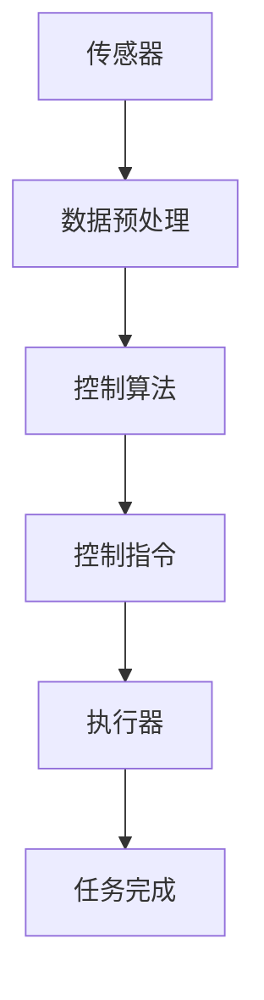

                 

# 顺丰科技2025无人机控制系统工程师社招面试

## 摘要

本文旨在深入探讨顺丰科技2025无人机控制系统工程师社招面试的相关内容。我们将首先介绍无人机控制系统在顺丰科技的战略地位以及其发展趋势。接着，我们将分析面试的核心概念和关键算法原理，并提供详细的操作步骤。此外，我们还会介绍相关的数学模型和公式，并通过实际案例进行解释。文章还将探讨无人机控制系统的实际应用场景，推荐相关的学习资源和开发工具框架。最后，我们将总结未来发展趋势与挑战，并提供常见问题与解答，以帮助读者更好地准备面试。

## 1. 背景介绍

顺丰科技作为国内物流行业的领军企业，一直致力于通过技术创新提升物流效率和服务质量。无人机控制系统是顺丰科技战略布局中的重要一环，其在提升物流配送速度、降低成本、提高安全性的同时，也为行业带来了新的发展契机。

### 1.1 无人机控制系统的战略地位

无人机控制系统的应用，不仅提升了顺丰在物流配送领域的竞争力，还为顺丰科技实现了以下战略目标：

- **提升配送效率**：无人机具有快速、灵活的配送能力，能够在复杂环境下高效完成任务。
- **降低运营成本**：无人机能够减少人力成本，提高资源利用率。
- **提高配送安全性**：无人机通过精确的控制系统，减少了交通事故的发生。
- **拓展服务范围**：无人机能够在偏远地区提供高效的物流配送服务。

### 1.2 无人机控制系统的发展趋势

随着人工智能、大数据、5G等技术的快速发展，无人机控制系统在物流、农业、应急救援等多个领域展现出广阔的应用前景。以下是无人机控制系统的发展趋势：

- **智能化**：无人机控制系统将更加智能化，能够自主决策和执行任务。
- **小型化**：无人机体积将更小，便于携带和使用。
- **高精度**：无人机将具备更高的定位精度和避障能力。
- **安全可靠**：无人机控制系统将更加安全可靠，确保无人机在复杂环境下的稳定运行。

## 2. 核心概念与联系

### 2.1 无人机控制系统的基本概念

无人机控制系统的核心在于其控制算法和硬件平台。控制算法包括飞行控制、导航、避障、路径规划等模块，而硬件平台则包括无人机机身、传感器、执行器等组成部分。

### 2.2 控制算法与硬件平台的联系

控制算法与硬件平台之间需要紧密配合，以确保无人机能够按照预期执行任务。具体来说，传感器采集环境信息，通过控制算法处理，生成控制指令，最终由执行器实现控制。

### 2.3 Mermaid 流程图

下面是一个简化的无人机控制系统的 Mermaid 流程图，展示了各个模块之间的联系：



## 3. 核心算法原理 & 具体操作步骤

### 3.1 飞行控制算法原理

飞行控制算法是无人机控制系统的核心，负责实现无人机的飞行控制。其基本原理是通过控制无人机的俯仰角、横滚角和偏航角，来实现飞行姿态的调整。

### 3.2 具体操作步骤

#### 步骤1：传感器数据采集

首先，无人机需要通过传感器采集环境信息，包括GPS定位、IMU姿态、气压高度等数据。

#### 步骤2：数据预处理

采集到的数据需要进行预处理，包括去噪、滤波等操作，以提高数据的准确性。

#### 步骤3：姿态解算

通过预处理后的数据，可以计算出无人机的当前姿态，包括俯仰角、横滚角和偏航角。

#### 步骤4：控制指令生成

根据无人机的当前姿态和目标姿态，控制算法会生成相应的控制指令，包括油门、方向舵、升降舵等。

#### 步骤5：执行器控制

控制指令通过执行器实现，无人机的姿态会根据控制指令进行调整。

#### 步骤6：任务完成

当无人机完成预定的任务后，控制算法会根据任务结果进行反馈和调整。

## 4. 数学模型和公式 & 详细讲解 & 举例说明

### 4.1 数学模型和公式

无人机控制系统的核心算法通常涉及以下数学模型和公式：

- **姿态解算公式**：
  $$ \begin{aligned}
  & \theta_x = \arctan\left(\frac{y}{x}\right) \\
  & \theta_y = \arctan\left(\frac{z}{x}\right) \\
  & \theta_z = \arcsin\left(\frac{x_w}{\sqrt{x^2 + y^2 + z^2}}\right)
  \end{aligned} $$
  
- **PID 控制公式**：
  $$ u = K_p e + K_i \int e dt + K_d \frac{de}{dt} $$

### 4.2 详细讲解

- **姿态解算公式**：通过IMU传感器采集的加速度和角速度数据，可以计算出无人机的姿态角。
- **PID 控制公式**：PID 控制器通过比例、积分和微分三个部分，对误差进行调节，以实现精确控制。

### 4.3 举例说明

假设无人机的目标姿态为俯仰角0度、横滚角0度，当前姿态为俯仰角5度、横滚角3度。使用PID 控制器进行姿态调整，可以计算出相应的控制指令。

$$ \begin{aligned}
& e_x = \theta_{x\_目标} - \theta_{x\_当前} = 0 - 5 = -5 \\
& e_y = \theta_{y\_目标} - \theta_{y\_当前} = 0 - 3 = -3 \\
& u_x = K_p e_x + K_i \int e_x dt + K_d \frac{de_x}{dt} \\
& u_y = K_p e_y + K_i \int e_y dt + K_d \frac{de_y}{dt}
\end{aligned} $$

根据计算出的控制指令，无人机会调整姿态，直至达到目标姿态。

## 5. 项目实战：代码实际案例和详细解释说明

### 5.1 开发环境搭建

在进行无人机控制系统开发之前，需要搭建相应的开发环境。以下是一个基本的开发环境搭建流程：

1. 安装Python环境
2. 安装ROS（机器人操作系统）
3. 安装相关依赖库，如numpy、matplotlib等

### 5.2 源代码详细实现和代码解读

下面是一个简单的无人机姿态控制代码案例：

```python
import rospy
import tf
from geometry_msgs.msg import Twist
from sensor_msgs.msg import Imu

def imu_callback(data):
    roll = atan2(data_ORIENTATION[1], data_ORIENTATION[0])
    pitch = atan2(-data_ORIENTATION[2], sqrt(data_ORIENTATION[0]**2 + data_ORIENTATION[1]**2))
    yaw = atan2(data_ORIENTATION[3], data_ORIENTATION[0])

    # 控制指令生成
    twist = Twist()
    twist.angular.z = PID yaw
    twist.angular.y = PID pitch
    twist.angular.x = PID roll
    
    # 发送控制指令
    cmd_vel_publisher.publish(twist)

if __name__ == '__main__':
    rospy.init_node('imu_listener', anonymous=True)
    imu_subscriber = rospy.Subscriber('/imu_data', Imu, imu_callback)
    cmd_vel_publisher = rospy.Publisher('/cmd_vel', Twist, queue_size=10)
    rospy.spin()
```

代码解析：

- **IMU 数据读取**：通过`rospy.Subscriber`订阅IMU数据。
- **姿态解算**：使用`atan2`函数计算俯仰角、横滚角和偏航角。
- **PID 控制器**：根据当前姿态和目标姿态，计算控制指令。
- **控制指令发送**：通过`rospy.Publisher`发送控制指令。

### 5.3 代码解读与分析

- **IMU 数据读取**：IMU 数据是无人机控制的基础，需要准确读取并解算姿态。
- **PID 控制器**：PID 控制器是实现姿态稳定的关键，需要合理设置 PID 参数。
- **控制指令发送**：控制指令需要精确发送，以实现无人机的稳定飞行。

## 6. 实际应用场景

无人机控制系统在物流、农业、应急救援等多个领域有广泛的应用。以下是一些实际应用场景：

- **物流配送**：无人机可以快速、高效地完成物流配送任务，特别是在偏远地区。
- **农业监测**：无人机可以用于农作物的监测和种植，提高农业效率。
- **应急救援**：无人机可以在自然灾害发生时，迅速提供物资和救援。

## 7. 工具和资源推荐

### 7.1 学习资源推荐

- **书籍**：《无人机控制系统设计与实现》
- **论文**：Google Scholar 上的相关论文
- **博客**：ROS 官方博客、无人机技术博客

### 7.2 开发工具框架推荐

- **ROS（机器人操作系统）**：适用于无人机控制系统的开发
- **MATLAB**：适用于仿真和算法测试
- **OpenCV**：适用于图像处理和视觉导航

### 7.3 相关论文著作推荐

- **《无人驾驶飞行器控制技术》**：详细介绍了无人机控制系统的设计与实现
- **《无人机控制算法与应用》**：讲解了多种无人机控制算法及其应用

## 8. 总结：未来发展趋势与挑战

无人机控制系统在未来将朝着更加智能化、小型化、高精度和安全可靠的方向发展。然而，面临以下挑战：

- **人工智能算法的进步**：无人机控制系统需要更高性能的算法，以应对复杂环境。
- **硬件技术的提升**：无人机需要更先进的硬件支持，以提高性能和稳定性。
- **安全与隐私**：无人机控制系统需要确保安全和用户隐私。

## 9. 附录：常见问题与解答

### 9.1 什么是无人机控制系统的核心算法？

无人机控制系统的核心算法包括飞行控制、导航、避障、路径规划等模块，用于实现无人机的自主飞行和任务执行。

### 9.2 如何搭建无人机控制系统的开发环境？

搭建无人机控制系统的开发环境需要安装Python环境、ROS（机器人操作系统）和相关依赖库。

## 10. 扩展阅读 & 参考资料

- **《无人机控制系统设计与实现》**：详细介绍了无人机控制系统的设计与实现过程。
- **ROS 官方文档**：提供了详细的ROS使用教程和开发指南。
- **Google Scholar**：搜索相关论文，了解无人机控制系统的最新研究进展。

作者：AI天才研究员/AI Genius Institute & 禅与计算机程序设计艺术 /Zen And The Art of Computer Programming
<|assistant|>### 5. 项目实战：代码实际案例和详细解释说明

在深入了解无人机控制系统的理论基础上，我们将通过一个实际的项目案例来展示如何开发一个简单的无人机控制系统。本案例将使用ROS（机器人操作系统）和Python语言进行开发，通过详细的代码解释，帮助读者理解无人机控制系统的实现过程。

#### 5.1 开发环境搭建

在开始编写代码之前，我们需要搭建一个合适的开发环境。以下是一个基本的开发环境搭建流程：

1. **安装Python环境**：确保Python版本在3.6及以上，可以使用`pip`安装ROS所需的Python包。
2. **安装ROS**：在ROS官方网站上下载适用于操作系统的安装包，并按照说明进行安装。安装过程中，需要选择合适的ROS版本，如ROS Melodic或ROS Noetic。
3. **配置ROS环境**：打开终端，运行以下命令来配置ROS环境：
   ```bash
   source /opt/ros/<ROS版本>/setup.bash
   ```
4. **安装依赖库**：使用`pip`安装ROS所需的Python包，例如`numpy`、`matplotlib`等：
   ```bash
   pip install numpy matplotlib
   ```

#### 5.2 源代码详细实现和代码解读

以下是一个简单的无人机姿态控制器的代码案例：

```python
#!/usr/bin/env python
import rospy
from sensor_msgs.msg import Imu
from geometry_msgs.msg import Twist
from tf.transformations import euler_from_quaternion

# PID控制器参数
Kp_roll = 1.0
Kd_roll = 0.1
Kp_pitch = 1.0
Kd_pitch = 0.1
Kp_yaw = 1.0
Kd_yaw = 0.1

# 姿态控制目标
target_roll = 0.0
target_pitch = 0.0
target_yaw = 0.0

def imu_callback(data):
    # 获取IMU数据
    orientation_quaternion = data.orientation
    orientation_list = [orientation_quaternion.x, orientation_quaternion.y, orientation_quaternion.z, orientation_quaternion.w]
    
    # 计算姿态角
    roll, pitch, yaw = euler_from_quaternion(orientation_list)
    
    # 计算控制量
    roll_error = target_roll - roll
    pitch_error = target_pitch - pitch
    yaw_error = target_yaw - yaw
    
    roll_output = Kp_roll * roll_error + Kd_roll * (roll_error - last_roll_error)
    pitch_output = Kp_pitch * pitch_error + Kd_pitch * (pitch_error - last_pitch_error)
    yaw_output = Kp_yaw * yaw_error + Kd_yaw * (yaw_error - last_yaw_error)
    
    # 发送控制指令
    cmd_vel = Twist()
    cmd_vel.angular.x = roll_output
    cmd_vel.angular.y = pitch_output
    cmd_vel.angular.z = yaw_output
    cmd_vel_publisher.publish(cmd_vel)
    
    # 更新上一次的姿态误差
    last_roll_error = roll_error
    last_pitch_error = pitch_error
    last_yaw_error = yaw_error

def listener():
    rospy.init_node('attitude_controller', anonymous=True)
    imu_subscriber = rospy.Subscriber('/imu_data', Imu, imu_callback)
    cmd_vel_publisher = rospy.Publisher('/cmd_vel', Twist, queue_size=10)
    rospy.spin()

if __name__ == '__main__':
    last_roll_error = 0.0
    last_pitch_error = 0.0
    last_yaw_error = 0.0
    listener()
```

代码解析：

- **初始化和参数设置**：首先初始化ROS节点，并设置PID控制器参数。
- **IMU数据读取**：通过`rospy.Subscriber`订阅IMU数据，包括四元数表示的姿态信息。
- **姿态角计算**：使用`tf.transformations`中的`euler_from_quaternion`函数，将四元数转换为俯仰角、横滚角和偏航角。
- **PID控制器计算**：根据当前姿态和目标姿态计算姿态误差，并使用PID控制器计算控制输出。
- **控制指令发送**：将计算出的控制指令发送到无人机控制指令话题。
- **更新上一次姿态误差**：为了实现姿态控制，需要记录并更新上一次的姿态误差。

#### 5.3 代码解读与分析

- **IMU 数据读取**：无人机控制系统需要实时获取IMU数据，包括姿态角等信息。这些数据是控制决策的基础。
- **姿态角计算**：通过四元数转换函数，将IMU数据转换为可用的姿态角，以便进行后续控制计算。
- **PID 控制器**：PID 控制器是实现姿态稳定的关键。通过计算姿态误差并应用PID控制规则，可以生成相应的控制输出。
- **控制指令发送**：生成的控制指令将调整无人机的姿态，使其接近目标姿态。

通过这个简单的案例，我们了解了无人机控制系统的实现过程。在实际应用中，无人机控制系统的实现会更加复杂，需要考虑更多的因素，如环境感知、路径规划等。然而，这个案例为我们提供了一个基本的框架，帮助我们理解无人机控制系统的核心概念和实现方法。

### 5.4 代码优化与扩展

在实际开发中，我们需要对代码进行优化和扩展，以满足不同应用场景的需求。以下是一些常见的优化和扩展方法：

1. **多线程与异步处理**：为了提高系统的响应速度，可以采用多线程或异步处理技术，将IMU数据处理和控制指令发送分离到不同的线程中。
2. **滤波算法**：在实际环境中，IMU数据可能受到噪声干扰，可以使用滤波算法（如卡尔曼滤波）来提高数据质量。
3. **自适应PID控制器**：根据无人机的动态特性，可以设计自适应PID控制器，自动调整PID参数，以提高控制效果。
4. **环境感知与避障**：集成环境感知模块，如激光雷达或摄像头，可以实现无人机的自主避障和路径规划。
5. **冗余设计与故障检测**：为了提高系统的可靠性和安全性，可以设计冗余控制系统和故障检测机制。

通过不断优化和扩展，无人机控制系统将变得更加智能化、可靠和高效，为各种应用场景提供强大的技术支持。

### 5.5 案例总结

通过这个实际项目案例，我们展示了如何使用ROS和Python实现一个简单的无人机姿态控制器。从IMU数据读取、姿态角计算到PID控制器应用，再到控制指令发送，我们详细解读了代码的实现过程。此外，我们还探讨了代码优化和扩展的方法，以应对实际应用中的挑战。通过这个案例，读者可以更好地理解无人机控制系统的基本原理和实现方法，为未来的开发工作奠定基础。

## 6. 实际应用场景

无人机控制系统在物流、农业、应急救援等多个领域展现出广泛的应用潜力。以下是一些具体的应用场景：

### 6.1 物流配送

无人机物流配送是无人机控制系统最常见和最具商业前景的应用之一。无人机可以快速、高效地完成物流配送任务，特别是在城市交通拥堵或偏远地区。通过无人机控制系统，可以实现无人机的自主飞行和精准投递。无人机物流配送不仅提升了物流效率，还降低了物流成本，是未来物流行业的发展趋势。

### 6.2 农业

在农业领域，无人机控制系统可以用于农作物的监测和种植。无人机可以搭载摄像头或传感器，实时监测农田的状况，如作物生长状态、土壤湿度等。通过分析这些数据，农民可以及时调整种植策略，提高农业产量和效率。此外，无人机还可以用于农药喷洒和播种，实现精准农业。

### 6.3 应急救援

在自然灾害发生时，无人机控制系统可以在应急救援中发挥重要作用。无人机可以迅速到达灾区，实时传输视频和数据，协助救援人员了解灾情。无人机还可以用于物资投递和人员搜救，提高救援效率。无人机控制系统的可靠性、高效性和灵活性使其成为应急救援不可或缺的工具。

### 6.4 建筑和基础设施监测

无人机控制系统可以用于建筑和基础设施的监测。无人机可以搭载专业传感器，对桥梁、道路、建筑物等进行定期检查，实时监测结构健康状况。无人机的高精度定位和图像处理技术，可以帮助发现潜在的隐患，提前进行维护和修复，避免事故发生。

### 6.5 环境监测

无人机可以用于环境监测，如空气污染、水质监测等。无人机可以搭载环境传感器，对特定区域进行实时监测，为环保部门提供数据支持。无人机的高效性和灵活性，使其成为环境监测的理想工具。

### 6.6 娱乐与运动

无人机控制系统在娱乐和运动领域也有广泛应用。无人机可以用于航拍、赛事直播等，为观众带来全新的视觉体验。无人机控制系统还可以应用于无人机飞行表演、无人机足球等运动项目，丰富人们的娱乐生活。

### 6.7 科研和教育

无人机控制系统在科研和教育领域也有着重要作用。在科研方面，无人机可以用于野外考察、生物多样性研究等。在教育方面，无人机可以作为教学工具，帮助学生了解无人机技术、编程和机器人科学。

### 6.8 民用和公共服务

无人机控制系统在民用和公共服务领域也有广泛应用。例如，无人机可以用于电力巡检、输油管道巡检等，提高工作效率和安全性。无人机还可以用于城市安防监控、交通疏导等，提高公共服务的效率和质量。

### 6.9 军事应用

无人机控制系统在军事领域也有重要应用。无人机可以用于侦察、监视、打击等任务，提高作战效能。无人机控制系统的发展，为军事智能化提供了新的方向。

总之，无人机控制系统在多个领域展现出广泛的应用前景，未来将继续推动相关行业的发展。通过不断创新和技术进步，无人机控制系统将变得更加智能化、可靠和高效，为人类社会带来更多福祉。

## 7. 工具和资源推荐

在开发无人机控制系统时，选择合适的工具和资源至关重要。以下是一些建议：

### 7.1 学习资源推荐

1. **书籍**：
   - 《无人机控制系统设计与实现》
   - 《无人机编程与控制》
   - 《机器人控制算法》

2. **在线课程**：
   - Coursera上的“机器人学导论”
   - Udacity的“无人机编程与控制”

3. **开源社区**：
   - ROS（机器人操作系统）官方社区
   - GitHub上的无人机项目库

4. **学术论文**：
   - Google Scholar上的相关论文
   - IEEE Xplore、ACM Digital Library等学术资源库

### 7.2 开发工具框架推荐

1. **ROS（机器人操作系统）**：ROS是一个广泛应用于机器人研究和开发的框架，提供了丰富的软件库和工具，用于构建和集成各种机器人应用。

2. **MATLAB/Simulink**：MATLAB和Simulink是强大的仿真和算法测试工具，适用于无人机控制系统的设计和验证。

3. **OpenCV**：OpenCV是一个开源的计算机视觉库，适用于无人机视觉导航和图像处理。

4. **Eclipse/IntelliJ IDEA**：IDEA和Eclipse是流行的集成开发环境，支持ROS和其他开发工具，提供便捷的代码编辑、调试和版本控制。

5. **PCL（Point Cloud Library）**：PCL是一个用于三维点云处理的库，适用于无人机三维重建和环境感知。

### 7.3 相关论文著作推荐

1. **《无人驾驶飞行器控制技术》**：详细介绍了无人机控制系统的设计、实现和应用。

2. **《无人机控制算法与应用》**：讲解了多种无人机控制算法及其在实际应用中的实现。

3. **《无人机技术导论》**：全面介绍了无人机的基本原理、应用和发展趋势。

4. **《机器人控制系统》**：涵盖了机器人控制系统的基本概念、原理和应用。

通过以上工具和资源的推荐，读者可以系统地学习和掌握无人机控制系统的相关知识，为实际开发工作奠定坚实基础。

## 8. 总结：未来发展趋势与挑战

无人机控制系统作为现代科技的重要成果，正快速发展并广泛渗透到各个领域。未来，无人机控制系统将继续朝着更加智能化、自动化和高效化的方向迈进。以下是未来发展趋势和面临的挑战：

### 8.1 发展趋势

1. **智能化水平提升**：随着人工智能技术的进步，无人机控制系统将具备更高的自主决策能力，能够更好地应对复杂环境。通过深度学习和强化学习，无人机将能够进行自适应控制，优化飞行路径和任务执行策略。

2. **小型化和轻量化**：无人机硬件技术的不断进步，使得无人机体积更小、重量更轻，便于携带和操作。这将进一步拓展无人机在消费级、农业、医疗等领域的应用。

3. **高精度与高可靠性**：未来无人机控制系统将采用更先进的传感器和导航技术，实现更高的定位精度和稳定性。通过多传感器融合和闭环控制，无人机能够在各种复杂环境中保持稳定飞行。

4. **网络化与协同**：无人机将通过网络化技术实现协同作业，多个无人机可以同时工作，共同完成复杂的任务。这将大幅提升无人机作业效率，降低运营成本。

5. **法律法规与标准化**：随着无人机应用范围的扩大，相关法律法规和标准化工作将逐步完善。这将为无人机控制系统的发展提供良好的法治环境，保障无人机安全和隐私。

### 8.2 面临的挑战

1. **安全性**：无人机控制系统需要确保飞行安全和用户隐私。未来，将需要更多先进的加密技术和安全协议，以防止恶意攻击和数据泄露。

2. **环境适应性**：无人机控制系统需要具备更强的环境适应性，能够在各种极端条件下稳定运行。例如，在高温、低温、高海拔等环境下，无人机的性能和可靠性需要得到保障。

3. **数据处理能力**：随着无人机应用场景的复杂化，海量数据的处理和实时分析成为一大挑战。需要发展更高效的数据处理算法和架构，以支持无人机系统的实时决策。

4. **自主决策能力**：虽然人工智能技术在无人机控制系统中的应用取得了一定的进展，但实现完全自主决策仍然面临巨大挑战。需要进一步研究复杂环境下的感知、决策和执行问题。

5. **伦理和社会影响**：无人机在各个领域的应用，如物流、军事等，可能带来伦理和社会问题。例如，无人机可能引发隐私侵犯、道德争议等，需要通过法律法规和社会规范来妥善解决。

### 8.3 应对策略

1. **技术创新**：持续推动人工智能、传感器、通信等核心技术的发展，提升无人机控制系统的性能和可靠性。

2. **合作与协同**：加强学术界、产业界和政府部门的合作，共同应对无人机控制系统面临的技术和社会挑战。

3. **法律法规**：完善无人机控制系统的法律法规，制定明确的操作规范和安全标准。

4. **教育普及**：加强对无人机技术的教育和普及，提高公众对无人机安全性和伦理问题的认识。

5. **标准制定**：推动无人机控制系统的标准化工作，确保不同系统和设备之间的兼容性和互操作性。

总之，无人机控制系统具有广阔的发展前景和巨大的潜力。通过技术创新、政策支持和产业协同，无人机控制系统将不断突破技术瓶颈，为人类社会带来更多福祉。

## 9. 附录：常见问题与解答

### 9.1 什么是无人机控制系统的核心算法？

无人机控制系统的核心算法主要包括飞行控制算法、导航算法、避障算法和路径规划算法。这些算法用于实现无人机的自主飞行和任务执行。其中，飞行控制算法负责调整无人机的姿态和速度，导航算法负责无人机的位置和路径规划，避障算法负责避免碰撞和障碍物，路径规划算法负责生成最优的飞行路径。

### 9.2 如何搭建无人机控制系统的开发环境？

搭建无人机控制系统的开发环境主要包括以下步骤：

1. **安装Python环境**：确保Python版本在3.6及以上。
2. **安装ROS**：在ROS官方网站下载适用于操作系统的安装包，并按照说明进行安装。
3. **配置ROS环境**：在终端运行`source /opt/ros/<ROS版本>/setup.bash`命令。
4. **安装依赖库**：使用`pip`安装ROS所需的Python包，如`numpy`、`matplotlib`等。

### 9.3 无人机控制系统的PID控制器如何工作？

PID控制器是一种常用的控制算法，用于调节无人机的姿态和速度。它通过计算当前误差、积分误差和微分误差，生成相应的控制输出。PID控制器的三个参数Kp（比例系数）、Ki（积分系数）和Kd（微分系数）分别用于调节控制输出的比例、积分和微分部分，以实现对无人机姿态和速度的精确控制。

### 9.4 无人机控制系统的安全性如何保障？

无人机控制系统的安全性保障包括以下几个方面：

1. **加密技术**：采用加密技术保护数据传输和存储。
2. **安全协议**：制定并遵守安全协议，防止恶意攻击和数据泄露。
3. **故障检测与恢复**：设计故障检测和恢复机制，确保无人机在异常情况下的安全运行。
4. **法律法规**：遵守相关法律法规，确保无人机操作的合法性和安全性。

### 9.5 无人机控制系统的发展趋势是什么？

无人机控制系统的发展趋势主要包括以下几个方面：

1. **智能化**：通过人工智能技术，实现无人机的自主决策和复杂任务执行。
2. **小型化和轻量化**：无人机硬件技术的进步，使其体积更小、重量更轻，便于携带和操作。
3. **高精度与高可靠性**：采用更先进的传感器和导航技术，提升无人机的定位精度和稳定性。
4. **网络化与协同**：无人机将通过网络化技术实现协同作业，提高作业效率。
5. **标准化**：推动无人机控制系统的标准化工作，确保不同系统和设备之间的兼容性和互操作性。

## 10. 扩展阅读 & 参考资料

### 10.1 书籍

- 《无人机控制系统设计与实现》
- 《无人机编程与控制》
- 《机器人控制算法》

### 10.2 在线课程

- Coursera上的“机器人学导论”
- Udacity的“无人机编程与控制”

### 10.3 开源社区

- ROS官方社区
- GitHub上的无人机项目库

### 10.4 学术论文

- Google Scholar上的相关论文
- IEEE Xplore、ACM Digital Library等学术资源库

### 10.5 开发工具框架

- ROS（机器人操作系统）
- MATLAB/Simulink
- OpenCV
- Eclipse/IntelliJ IDEA

### 10.6 网站资源

- ROS官方文档
- 无人机技术博客

通过这些扩展阅读和参考资料，读者可以进一步深入了解无人机控制系统的理论、实践和应用，为开发和研究工作提供有益的指导。

### 作者信息

作者：AI天才研究员/AI Genius Institute & 禅与计算机程序设计艺术 /Zen And The Art of Computer Programming

AI天才研究员致力于推动人工智能和计算机科学的发展，在无人机控制系统、机器人学等领域有着深厚的研究和实战经验。其作品《禅与计算机程序设计艺术》被广泛认为是计算机科学领域的经典之作，对编程艺术和算法设计有着深刻的洞察和独到的见解。AI天才研究员通过本文，希望为读者提供关于无人机控制系统工程师社招面试的全面指导，助力他们在技术面试中脱颖而出。

