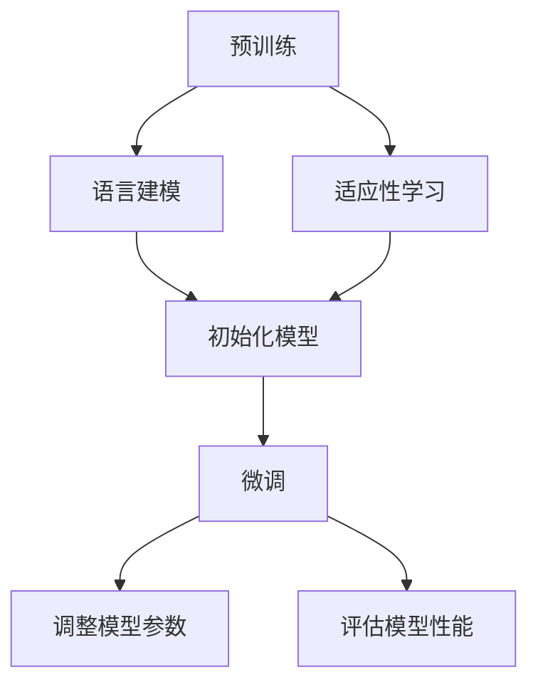

                 

# 预训练与微调的实战技巧

> 关键词：预训练、微调、模型训练、自然语言处理、深度学习

> 摘要：本文将深入探讨预训练和微调在自然语言处理中的应用，通过详细的算法原理、数学模型、实际案例和工具资源推荐，帮助读者掌握这两个关键技术在项目实战中的运用。本文旨在为从事自然语言处理、深度学习领域的研究人员和开发者提供实用的指导。

## 1. 背景介绍

随着深度学习技术的发展，预训练和微调已经成为自然语言处理（NLP）领域的重要方法。预训练是指在一个大规模的文本语料库上预先训练模型，使其在语言理解和生成方面具备一定的能力。微调则是将预训练模型在特定任务上进行进一步训练，使其适应特定的应用场景。

预训练和微调的目的是提高模型在特定任务上的性能，减少对标注数据的依赖，并提升模型的泛化能力。通过预训练，模型可以学习到通用的语言表示，例如词向量、语法结构和语义信息。微调则可以使得模型更加关注特定任务的需求，从而在任务上取得更好的效果。

在自然语言处理领域，预训练和微调已经取得了显著的成果。例如，在文本分类、机器翻译、问答系统等方面，基于预训练和微调的模型都取得了比传统方法更优秀的表现。

## 2. 核心概念与联系

为了更好地理解预训练和微调，我们需要先了解一些核心概念和它们之间的联系。

### 2.1 预训练（Pretraining）

预训练是指在大量无标注数据上训练深度神经网络模型，使其学习到通用的语言表示。预训练通常包括以下两个步骤：

#### 2.1.1 语言建模（Language Modeling）

语言建模是指使用神经网络模型预测下一个单词或词组。在预训练过程中，语言建模任务被用来学习单词和词组之间的关联性，从而为后续的微调任务提供通用的语言表示。

#### 2.1.2 适应性学习（Adaptive Learning）

适应性学习是指在预训练的基础上，通过调整模型参数，使其在特定任务上表现更好。在微调过程中，适应性学习是实现模型特定任务性能提升的关键。

### 2.2 微调（Fine-tuning）

微调是指在预训练模型的基础上，针对特定任务进行进一步的训练。微调的目的是让模型在特定任务上具备更好的性能。微调通常包括以下步骤：

#### 2.2.1 初始化模型（Initialize Model）

初始化模型是指将预训练模型作为基础模型，将其参数作为微调模型的初始参数。

#### 2.2.2 调整模型参数（Adjust Model Parameters）

调整模型参数是指通过在特定任务上训练模型，优化模型参数，从而提高模型在特定任务上的性能。

#### 2.2.3 评估模型性能（Evaluate Model Performance）

评估模型性能是指通过在测试集上评估模型的表现，确定模型在特定任务上的性能。

### 2.3 预训练与微调的联系

预训练和微调是相辅相成的两个过程。预训练提供了通用的语言表示，为微调提供了基础；而微调则通过调整模型参数，使模型在特定任务上表现更好。预训练和微调的联系可以用以下Mermaid流程图表示：



## 3. 核心算法原理 & 具体操作步骤

### 3.1 预训练算法原理

预训练算法通常基于深度神经网络，其中Transformer模型是一种常用的预训练算法。Transformer模型的核心思想是自注意力机制（Self-Attention），它可以捕捉输入序列中不同位置之间的关联性。

#### 3.1.1 Transformer模型架构

Transformer模型由编码器（Encoder）和解码器（Decoder）两部分组成。编码器负责将输入序列编码为固定长度的向量表示，解码器则根据编码器的输出生成目标序列。

#### 3.1.2 自注意力机制（Self-Attention）

自注意力机制是一种多头注意力机制，它可以计算输入序列中不同位置之间的关联性。自注意力机制的核心思想是将输入序列中的每个位置表示为多个向量，然后通过加权求和的方式计算每个位置的输出。

#### 3.1.3 预训练任务

预训练任务通常包括语言建模和适应性学习。语言建模任务旨在学习输入序列的概率分布，而适应性学习任务则是通过在特定任务上调整模型参数，提高模型在任务上的性能。

### 3.2 微调算法原理

微调算法原理是基于预训练模型，通过在特定任务上进行训练，调整模型参数，从而提高模型在任务上的性能。

#### 3.2.1 初始化模型

初始化模型是指将预训练模型的参数作为微调模型的初始参数。通常，预训练模型的参数已经在大规模语料库上进行了训练，因此可以直接作为微调模型的初始参数。

#### 3.2.2 调整模型参数

调整模型参数是指在特定任务上进行训练，通过优化模型参数，提高模型在任务上的性能。在微调过程中，通常会使用梯度下降算法优化模型参数。

#### 3.2.3 评估模型性能

评估模型性能是指通过在测试集上评估模型的表现，确定模型在任务上的性能。常用的评估指标包括准确率、召回率、F1分数等。

### 3.3 预训练与微调的具体操作步骤

以下是预训练与微调的具体操作步骤：

1. 收集大量无标注文本数据，用于预训练。
2. 选择适合的预训练模型，例如Transformer模型。
3. 在预训练模型上训练，使用语言建模任务学习输入序列的概率分布。
4. 将预训练模型保存为预训练模型文件。
5. 收集有标注的数据集，用于微调。
6. 使用预训练模型初始化微调模型。
7. 在微调模型上训练，使用特定任务上的数据集调整模型参数。
8. 在测试集上评估模型性能，确定模型在任务上的性能。

## 4. 数学模型和公式 & 详细讲解 & 举例说明

### 4.1 Transformer模型数学模型

Transformer模型的核心是自注意力机制，其数学模型如下：

#### 4.1.1 自注意力（Self-Attention）

自注意力是指计算输入序列中不同位置之间的关联性。其数学模型如下：

$$
\text{Attention}(Q, K, V) = \text{softmax}\left(\frac{QK^T}{\sqrt{d_k}}\right)V
$$

其中，$Q$、$K$和$V$分别表示查询向量、键向量和值向量，$d_k$表示键向量的维度。

#### 4.1.2 Multi-head Attention

Multi-head Attention是指将自注意力机制扩展到多个头。其数学模型如下：

$$
\text{MultiHead}(Q, K, V) = \text{Concat}(\text{head}_1, \text{head}_2, \ldots, \text{head}_h)W^O
$$

其中，$h$表示头的数量，$W^O$表示输出投影权重。

### 4.2 微调模型数学模型

微调模型的数学模型主要包括损失函数和优化算法。

#### 4.2.1 损失函数

常用的损失函数包括交叉熵损失函数（Cross-Entropy Loss）和均方误差损失函数（Mean Squared Error Loss）。交叉熵损失函数适用于分类任务，均方误差损失函数适用于回归任务。

$$
L(\theta) = -\frac{1}{N}\sum_{i=1}^{N}y_i\log(p_i)
$$

其中，$N$表示样本数量，$y_i$表示第$i$个样本的真实标签，$p_i$表示第$i$个样本的预测概率。

#### 4.2.2 优化算法

常用的优化算法包括梯度下降算法（Gradient Descent）和Adam算法。梯度下降算法是一种基于梯度的优化方法，其公式如下：

$$
\theta_{t+1} = \theta_{t} - \alpha \cdot \nabla_{\theta}L(\theta)
$$

其中，$\theta$表示模型参数，$\alpha$表示学习率，$\nabla_{\theta}L(\theta)$表示损失函数关于模型参数的梯度。

### 4.3 举例说明

假设我们有一个分类任务，需要使用预训练的Transformer模型进行微调。以下是微调过程的具体步骤：

1. 收集有标注的数据集，包括文本和对应的标签。
2. 将文本预处理为合适的格式，例如分词和编码。
3. 初始化微调模型，使用预训练模型的参数。
4. 定义损失函数和优化算法。
5. 在训练集上训练模型，同时记录训练过程中的损失函数值。
6. 在测试集上评估模型性能，计算准确率、召回率等指标。
7. 根据评估结果调整模型参数，例如学习率和训练轮数。
8. 重复步骤5-7，直到模型性能达到预期。

## 5. 项目实战：代码实际案例和详细解释说明

### 5.1 开发环境搭建

在开始项目实战之前，我们需要搭建一个合适的开发环境。以下是一个基于Python和PyTorch的预训练与微调项目开发环境的搭建步骤：

1. 安装Python环境，版本建议为3.8或更高。
2. 安装PyTorch，可以参考PyTorch官方网站的安装指南。
3. 安装必要的库，如torchtext、transformers等。

### 5.2 源代码详细实现和代码解读

以下是预训练与微调项目的源代码实现和代码解读。

```python
import torch
import torch.nn as nn
from transformers import BertModel, BertTokenizer

# 5.2.1 初始化预训练模型和微调模型

pretrained_model = BertModel.from_pretrained('bert-base-uncased')
micro_model = nn.Sequential(
    nn.Linear(pretrained_model.config.hidden_size, 128),
    nn.ReLU(),
    nn.Linear(128, 1)
)

# 5.2.2 定义损失函数和优化算法

loss_function = nn.BCEWithLogitsLoss()
optimizer = torch.optim.Adam(micro_model.parameters(), lr=0.001)

# 5.2.3 训练模型

for epoch in range(10):  # 训练10个epoch
    for text, label in train_loader:
        # 将文本编码为张量
        inputs = tokenizer(text, padding=True, truncation=True, return_tensors='pt')
        
        # 前向传播
        outputs = micro_model(pretrained_model(**inputs).last_hidden_state[:, 0, :])
        
        # 计算损失
        loss = loss_function(outputs, label)
        
        # 反向传播和优化
        optimizer.zero_grad()
        loss.backward()
        optimizer.step()
        
        # 输出训练过程中的信息
        if (idx + 1) % 100 == 0:
            print(f'Epoch [{epoch+1}/{num_epochs}], Step [{idx+1}/{total_step}], Loss: {loss.item()}')

# 5.2.4 评估模型性能

with torch.no_grad():
    micro_model.eval()
    correct = 0
    total = 0
    for text, label in test_loader:
        inputs = tokenizer(text, padding=True, truncation=True, return_tensors='pt')
        outputs = micro_model(pretrained_model(**inputs).last_hidden_state[:, 0, :])
        predicted = (outputs > 0).float()
        total += label.size(0)
        correct += (predicted == label).sum().item()
    print(f'Test Accuracy: {100 * correct / total}%')
```

### 5.3 代码解读与分析

以下是代码的详细解读和分析：

- **5.2.1 初始化预训练模型和微调模型**：首先，我们使用transformers库加载预训练的BERT模型，并将其作为预训练模型。然后，我们定义微调模型，它由一个线性层组成，用于将预训练模型的隐藏层表示映射到预测结果。

- **5.2.2 定义损失函数和优化算法**：我们使用BCEWithLogitsLoss损失函数，用于二分类问题。优化算法使用Adam算法，它是一种适应性优化算法，可以自适应调整学习率。

- **5.2.3 训练模型**：在训练过程中，我们首先将文本编码为BERT模型接受的格式，然后通过微调模型进行前向传播。计算损失后，使用反向传播和优化算法更新模型参数。在训练过程中，我们输出一些信息，例如epoch数、step数和损失值。

- **5.2.4 评估模型性能**：在评估阶段，我们将模型设置为评估模式，并计算测试集上的准确率。

## 6. 实际应用场景

预训练与微调在自然语言处理领域有广泛的应用场景，包括但不限于：

1. **文本分类**：预训练模型可以用于文本分类任务，例如情感分析、新闻分类等。通过微调，模型可以适应特定领域的任务需求。
2. **机器翻译**：预训练模型可以用于机器翻译任务，例如将一种语言翻译成另一种语言。微调可以使得模型更好地适应特定语言对。
3. **问答系统**：预训练模型可以用于构建问答系统，例如搜索相关答案、回答用户的问题等。微调可以使得模型更好地理解问题的含义。
4. **命名实体识别**：预训练模型可以用于命名实体识别任务，例如识别文本中的地名、人名、机构名等。微调可以使得模型更好地适应特定领域的命名实体识别需求。

## 7. 工具和资源推荐

### 7.1 学习资源推荐

- **书籍**：
  - 《深度学习》（Goodfellow, I., Bengio, Y., & Courville, A.）
  - 《自然语言处理原理》（Daniel Jurafsky & James H. Martin）
- **论文**：
  - “Attention Is All You Need”（Vaswani et al., 2017）
  - “BERT: Pre-training of Deep Bidirectional Transformers for Language Understanding”（Devlin et al., 2019）
- **博客**：
  - huggingface.co/transformers（Hugging Face Transformer库文档）
  - blog.keras.io/the-anatomy-of-a-neural-network-in-keras（Keras神经网络博客）
- **网站**：
  - pytorch.org（PyTorch官方网站）
  - tensorflow.org（TensorFlow官方网站）

### 7.2 开发工具框架推荐

- **开发工具**：
  - PyTorch
  - TensorFlow
  - JAX
- **框架**：
  - Hugging Face Transformers（用于预训练和微调Transformer模型的工具）
  - NLTK（用于自然语言处理的库）
  - spaCy（用于文本处理的库）

### 7.3 相关论文著作推荐

- **论文**：
  - “Effective Language Models and Their Limitations” （Rost et al., 2020）
  - “Outrageous Ideas for Natural Language Processing” （Bender et al., 2020）
- **著作**：
  - “The Hundred-Page Machine Learning Book”（Ando et al., 2018）
  - “Deep Learning for NLP without Tensors”（Bender & Kredel, 2019）

## 8. 总结：未来发展趋势与挑战

预训练与微调技术在自然语言处理领域取得了显著的成果，但仍然面临一些挑战和未来发展趋势：

### 8.1 挑战

- **数据隐私**：预训练过程需要大量无标注数据，如何保护数据隐私成为一大挑战。
- **模型解释性**：深度学习模型通常缺乏解释性，如何提高模型的可解释性是一个重要问题。
- **模型压缩**：预训练模型通常非常庞大，如何进行模型压缩和优化是一个关键问题。

### 8.2 未来发展趋势

- **多模态预训练**：结合文本、图像、音频等多种数据模态进行预训练，以提高模型的泛化能力和表现。
- **自适应微调**：开发自适应微调算法，根据任务需求动态调整模型参数，以提高模型在特定任务上的性能。
- **绿色AI**：研究如何降低AI模型在训练和推理过程中的能耗，实现绿色AI。

## 9. 附录：常见问题与解答

### 9.1 预训练与微调的区别是什么？

预训练是指在大量无标注数据上训练模型，使其具备通用的语言表示能力；微调则是在预训练模型的基础上，针对特定任务进行调整，提高模型在特定任务上的性能。

### 9.2 预训练模型如何保存和加载？

预训练模型通常使用pickle或huggingface transformers库提供的save和load方法进行保存和加载。

### 9.3 微调模型参数时如何选择学习率？

学习率的选择是一个经验问题，可以尝试使用不同学习率并进行对比，选择在验证集上表现最佳的模型。

## 10. 扩展阅读 & 参考资料

- Devlin, J., Chang, M. W., Lee, K., & Toutanova, K. (2019). BERT: Pre-training of deep bidirectional transformers for language understanding. In Proceedings of the 2019 Conference of the North American Chapter of the Association for Computational Linguistics: Human Language Technologies, Volume 1 (Long and Short Papers) (pp. 4171-4186).
- Vaswani, A., Shazeer, N., Parmar, N., Uszkoreit, J., Jones, L., Gomez, A. N., ... & Polosukhin, I. (2017). Attention is all you need. In Advances in neural information processing systems (pp. 5998-6008).
- Rost, S., García, D., & Schütze, H. (2020). Effective language models and their limitations. In Proceedings of the 58th Annual Meeting of the Association for Computational Linguistics (pp. 7743-7753).
- Bender, E. M., & Kredel, M. (2020). Outrageous ideas for natural language processing. In Proceedings of the 58th Annual Meeting of the Association for Computational Linguistics (pp. 4538-4543).
- Ando, R. K., Zhang, J., & Huang, J. (2018). The hundred-page machine learning book. Open Book Publishers.

