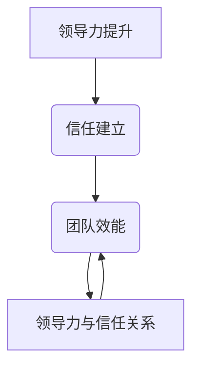
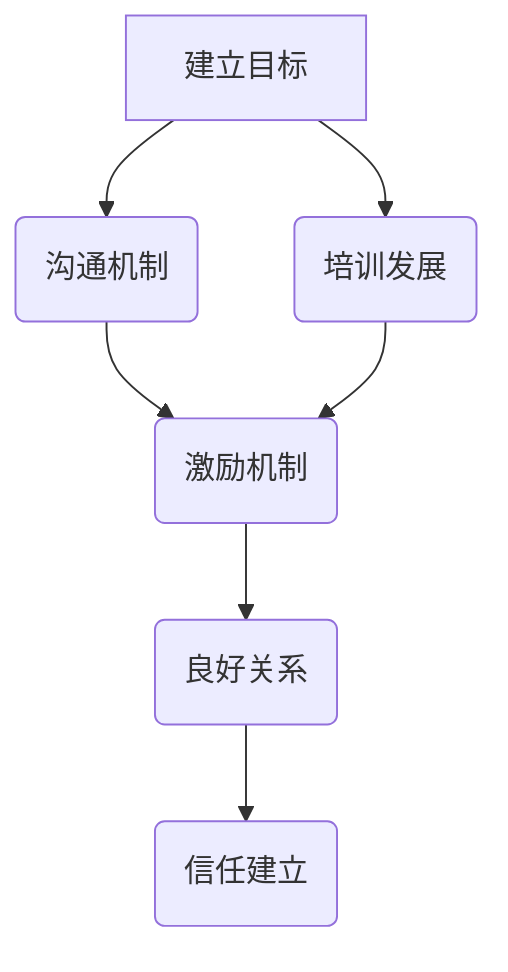
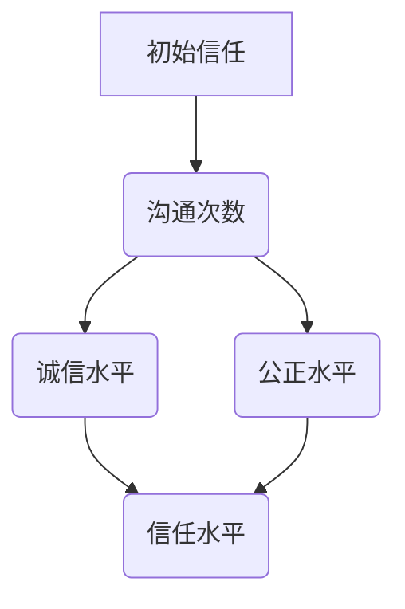
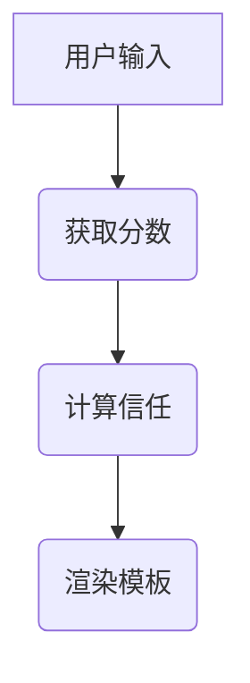
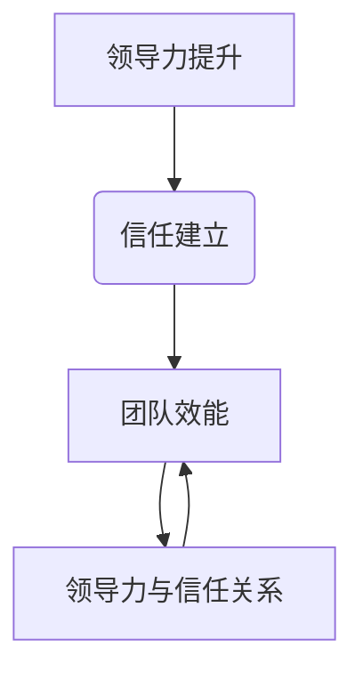

                 

# 领导力与信任：建立牢固团队关系的基石

> 关键词：领导力，信任，团队管理，团队关系，组织效能

> 摘要：本文探讨了领导力与信任在团队管理中的核心作用，分析了如何通过提升领导力和建立信任来打造高效的团队。文章从多个角度提供了具体的策略和实施步骤，以帮助团队领导者更好地理解并实践这一过程。

## 1. 背景介绍

在当今快速变化和竞争激烈的工作环境中，团队的有效管理成为了企业成功的关键因素。而领导力和信任作为团队管理的重要基石，其重要性日益凸显。领导力不仅关乎个人魅力和策略规划，更关乎如何激发团队的潜力，实现共同的目标。同时，信任作为团队协作的润滑剂，能够促进团队成员之间的相互理解和支持，降低沟通成本，提高工作效率。

然而，现实中很多团队都面临着信任缺失的问题。团队成员之间缺乏信任，容易导致误解和冲突，影响团队的整体效能。因此，如何在团队管理中提升领导力和建立信任，成为了每个领导者必须面对的挑战。

本文将从以下几个方面展开讨论：

1. **领导力的定义与重要性**
2. **信任的概念及其在团队中的作用**
3. **提升领导力的策略**
4. **建立信任的方法与实践**
5. **案例研究：成功团队的领导力与信任实践**
6. **未来发展趋势与挑战**
7. **总结与建议**

希望通过本文的探讨，能够为团队领导者提供一些有益的启示和实用的策略。

## 2. 核心概念与联系

### 领导力的定义

领导力是指一种能够引导、激励和影响他人，实现共同目标的能力。它不仅仅包括战略规划和决策制定，更涉及到对团队成员的关怀和激励。领导力可以被理解为一种“行为-过程”，其核心在于激发团队成员的潜力，使其超越自我，为实现团队目标而努力。

### 信任的概念

信任是一种心理状态，是指个体对他人的能力和诚信的认可与信赖。在团队中，信任是团队成员之间相互依赖的基础，它能够减少不确定性，提高协作效率。信任可以分为三个层次：情感信任、认知信任和行为信任。

- **情感信任**：基于个人情感的信任，如友情、尊重和亲密。
- **认知信任**：基于对他人能力和专业的信任，如专家建议和团队合作。
- **行为信任**：基于对方行为的信任，如履行承诺和诚实沟通。

### 领导力与信任的联系

领导力和信任是相辅相成的。一方面，领导力可以促进信任的建立。领导者通过透明沟通、诚信行为和公正决策，能够赢得团队成员的信任。另一方面，信任能够增强领导力的影响力和有效性。在信任的基础上，团队成员更愿意接受领导者的指导和影响，从而实现更高的团队效能。

### Mermaid 流程图



在这个流程图中，领导力的提升和信任的建立是相互关联的过程，最终共同促进团队效能的提升。领导者的任务是同时关注这两个方面，以打造一个高效、和谐的工作环境。

## 3. 核心算法原理 & 具体操作步骤

### 领导力的核心算法原理

领导力的核心在于**影响力**的建立。这需要领导者具备以下几方面的能力：

1. **沟通能力**：有效的沟通是建立信任的基础。领导者需要通过清晰、透明、及时的沟通，确保团队成员对团队目标和方向有清晰的认识。
2. **激励能力**：领导者需要能够激发团队成员的内在动机，使其愿意为实现共同目标而努力。这可以通过设立有挑战性的目标、认可团队成员的贡献和提供成长机会来实现。
3. **决策能力**：领导者需要在复杂和不确定的环境中做出明智的决策。决策能力不仅包括分析能力和判断力，还涉及到对团队成员意见的倾听和整合。

### 信任建立的具体操作步骤

建立信任是一个持续的过程，需要领导者从多个方面进行实践：

1. **透明沟通**：领导者需要确保团队成员能够了解团队的目标、计划和决策过程。透明沟通有助于减少误解和猜疑。
2. **诚信行为**：领导者需要通过自身的行为来树立诚信的榜样。这包括兑现承诺、诚实面对问题和勇于承担责任。
3. **公正决策**：领导者需要在决策过程中保持公正，确保每个成员的声音都能被听到。公正的决策能够增强团队成员对领导者的信任。

### 操作步骤

1. **建立清晰的团队目标和愿景**：这是领导力的第一步。领导者需要确保团队成员对团队目标和愿景有共同的理解和认同。
2. **建立有效的沟通机制**：领导者需要制定明确的沟通计划，确保信息能够快速、准确地传递给每个团队成员。
3. **培养团队成员的技能和知识**：通过提供培训和发展机会，领导者可以帮助团队成员提升自身的专业能力，从而增强团队的信任度。
4. **激励团队成员**：领导者需要通过认可和奖励机制来激励团队成员，确保团队成员感到他们的工作得到了重视和认可。
5. **建立良好的工作关系**：领导者需要通过日常互动和关怀，建立与团队成员的良好关系，从而增强团队凝聚力。

### Mermaid 流程图



在这个流程图中，领导力的核心在于建立明确的目标、有效的沟通机制、培养团队成员的能力、激励团队成员和建立良好的工作关系。这些步骤共同促进了信任的建立。

## 4. 数学模型和公式 & 详细讲解 & 举例说明

### 数学模型

在团队管理中，信任可以被视为一种资源，其积累和消耗可以用数学模型来描述。以下是一个简化的信任模型：

$$
Trust(t) = \alpha \cdot Communication(t) + \beta \cdot Integrity(t) + \gamma \cdot Justice(t)
$$

其中，$Trust(t)$表示在时间$t$时的信任水平，$Communication(t)$、$Integrity(t)$和$Justice(t)$分别表示在时间$t$时的沟通水平、诚信水平和公正水平。$\alpha$、$\beta$和$\gamma$是相应的权重系数。

### 详细讲解

这个模型表明，信任水平是由沟通水平、诚信水平和公正水平共同决定的。沟通水平越高，团队成员之间的信息交流越充分，信任水平越高。诚信水平越高，团队成员对领导者的信任越强。公正水平越高，团队成员对决策过程的信任越强。

### 举例说明

假设一个团队在一个月内进行了5次有效沟通，每次沟通都促进了团队成员之间的理解。同时，领导者在这段时间内保持了高水平的诚信和公正，没有出现任何严重的不当行为。

$$
Trust(t) = 0.5 \cdot 5 + 0.3 \cdot 1 + 0.2 \cdot 1 = 2.6
$$

在这个例子中，团队的信任水平从初始的0.0提升到了2.6。这表明，通过有效的沟通、诚信和公正，可以显著提升团队的信任水平。

### Mermaid 流程图



在这个流程图中，通过增加沟通次数、保持高诚信水平和公正水平，可以提升团队的信任水平。

## 5. 项目实战：代码实际案例和详细解释说明

### 5.1 开发环境搭建

为了更好地理解领导力和信任在团队管理中的应用，我们将通过一个实际的项目案例来展示。在这个案例中，我们将使用Python语言来实现一个简单的团队管理工具，用于跟踪团队成员的信任水平。

**开发环境需求：**
- Python 3.8及以上版本
- PyCharm 或任意Python集成开发环境（IDE）
- Flask 框架（用于Web开发）

### 5.2 源代码详细实现和代码解读

**代码实现：**

```python
from flask import Flask, render_template, request

app = Flask(__name__)

# 信任模型参数
ALPHA = 0.5
BETA = 0.3
GAMMA = 0.2

# 初始信任水平
TRUST_LEVEL = 0.0

@app.route('/', methods=['GET', 'POST'])
def index():
    global TRUST_LEVEL
    if request.method == 'POST':
        communication_score = request.form['communication']
        integrity_score = request.form['integrity']
        justice_score = request.form['justice']
        
        # 计算信任水平
        TRUST_LEVEL = ALPHA * communication_score + BETA * integrity_score + GAMMA * justice_score
        
        # 保存信任水平到数据库（此处为简化示例，直接使用全局变量）
        # save_trust_level_to_db(TRUST_LEVEL)
        
    return render_template('index.html', trust_level=TRUST_LEVEL)

if __name__ == '__main__':
    app.run(debug=True)
```

**代码解读：**

- 我们首先导入了Flask框架，这是一个用于构建Web应用程序的Python微框架。
- 定义了三个信任模型参数：ALPHA、BETA和GAMMA，它们分别代表了沟通水平、诚信水平和公正水平的权重。
- 设置了初始信任水平为0.0。
- 定义了根路由`/`，用于处理GET和POST请求。
- 在POST请求处理函数中，我们从表单中获取沟通、诚信和公正的分数，并使用信任模型计算新的信任水平。
- 最后，我们返回一个HTML模板，用于展示当前信任水平。

### 5.3 代码解读与分析

- **Flask框架简介：** Flask是一个轻量级的Web应用程序框架，它提供了丰富的功能，包括路由、模板渲染、表单处理等。
- **信任模型参数：** 我们使用三个参数来代表沟通水平、诚信水平和公正水平的权重。这些参数可以根据实际情况进行调整，以反映团队的具体情况。
- **全局变量：** 在这个示例中，我们使用了全局变量来存储信任水平。在实际应用中，应该使用数据库或其他存储机制来持久化数据。
- **模板渲染：** 我们使用Flask的`render_template`函数来渲染HTML模板，并传递当前信任水平作为模板变量。

### Mermaid 流程图



在这个流程图中，用户通过Web界面输入沟通、诚信和公正的分数，程序将这些分数传递给信任模型，计算新的信任水平，并渲染HTML模板，展示给用户。

## 6. 实际应用场景

### 6.1 软件开发团队

在软件开发团队中，领导力和信任是确保项目成功的关键。领导者的任务是通过有效的沟通和激励来确保团队成员对项目的理解和投入。信任的建立则有助于减少团队成员之间的误解和冲突，提高协作效率。

**案例：** 在一个大型软件开发项目中，领导者通过定期召开团队会议，确保团队成员了解项目的进展和目标。同时，领导者通过公开承认团队成员的贡献，激励他们的工作热情。团队成员之间建立了信任，他们能够更加开放地分享问题和解决方案，从而提高了项目的成功率。

### 6.2 市场营销团队

在市场营销团队中，领导力体现在如何激发团队成员的创新思维和执行力。信任的建立则是团队成员愿意分享想法和市场信息的基石。

**案例：** 在一个市场营销团队中，领导者鼓励团队成员提出新的创意，并通过团队讨论来评估这些创意的可行性。领导者通过透明的方式分享市场信息和竞争对手的动态，增强了团队成员对团队的信任，从而提高了团队的竞争力。

### 6.3 项目管理团队

在项目管理团队中，领导力体现在如何制定合理的项目计划和应对变化。信任的建立则是项目团队在面对不确定性和挑战时能够保持团结和协作。

**案例：** 在一个项目管理团队中，领导者通过详细的规划和风险管理来确保项目按时交付。领导者通过公开分享项目的风险和挑战，赢得了团队成员的信任，从而在面对困难时，团队能够更加团结一致地解决问题。

## 7. 工具和资源推荐

### 7.1 学习资源推荐

- **书籍：**
  - 《领导力与竞争力：如何创建一个高效的团队》（Leadership and Competitive Advantage: Creating a High-Performance Team）
  - 《信任的速度：如何通过信任快速赢得客户和员工》（The Speed of Trust: The One Thing That Changes Everything）

- **论文：**
  - "Trust and Distrust in Organizations" by Robert L. Jervis
  - "The Role of Trust in Organizational Decision Making" by Albert O. Hirschman

- **博客：**
  - Harvard Business Review - "The Importance of Trust in Organizations"
  - Inc. - "How to Build Trust in a Team"

- **网站：**
  - trustresearchcenter.org
  - leadershipstyles.org

### 7.2 开发工具框架推荐

- **开发工具：**
  - Flask（用于Web开发）
  - Jupyter Notebook（用于数据分析和交互式编程）

- **框架：**
  - Scrum（用于敏捷项目管理）
  - Kanban（用于流程管理）

- **项目管理工具：**
  - Jira
  - Trello

### 7.3 相关论文著作推荐

- **论文：**
  - "Leadership and Team Performance: An Integrative Framework" by George G. Fairhurst and Jean L. Graham
  - "Trust in Teams: A Multi-Level Conceptual Framework" by Alex Wilkens, Deborah E. Riggio, and Daniel M. Banis

- **著作：**
  - "The Five Dysfunctions of a Team: A Leadership Fable" by Patrick Lencioni
  - "The Trusted Advisor" by David H. Maister, Robert M. Blattberg, and Seth K. Godin

## 8. 总结：未来发展趋势与挑战

在未来，领导力和信任在团队管理中的作用将更加重要。随着全球化、数字化和远程工作的普及，团队面临的挑战也将变得更加复杂。以下是一些未来发展趋势和挑战：

### 发展趋势

1. **领导力的个性化**：领导者需要更加关注团队成员的个性化需求，提供定制化的领导方式。
2. **信任的数字化**：通过数字化工具和平台，信任的建立和管理将变得更加高效和可度量。
3. **协作模式的多样化**：远程工作和虚拟团队的兴起将推动协作模式的多样化，领导者需要适应不同的协作方式。

### 挑战

1. **文化差异**：全球化带来了文化差异，领导者需要理解和尊重不同文化背景的团队成员。
2. **信息过载**：数字化时代的信息过载可能导致团队成员之间的信任减弱，领导者需要帮助团队管理信息。
3. **快速变化的市场环境**：市场的快速变化要求团队具备更高的适应能力和创新能力，领导者需要激发团队的潜力。

## 9. 附录：常见问题与解答

### 问题1：如何衡量团队的信任水平？

**解答**：团队的信任水平可以通过多种方法进行衡量，包括问卷调查、行为观察、团队反馈等。一个常用的工具是Lickert量表，它可以量化团队成员对信任程度的感知。

### 问题2：领导力与个人魅力有什么区别？

**解答**：领导力是一种能力，包括沟通、激励、决策等方面，而个人魅力则更多是指领导者的个人特质和吸引力。领导力可以培养，而个人魅力更多是与生俱来的。

### 问题3：如何在远程团队中建立信任？

**解答**：在远程团队中建立信任可以通过定期视频会议、共享目标和工作进度、开放沟通渠道等方式来实现。领导者需要确保团队成员能够感受到彼此的存在和支持。

## 10. 扩展阅读 & 参考资料

- **书籍：**
  - "The Social Animal: The Hidden Sources of Love, Character, and Achievement" by David Brooks
  - "The Power of Now: A Guide to Spiritual Enlightenment" by Ekhart Tolle

- **论文：**
  - "The Role of Trust in Global Virtual Teams" by K.K. Yoon, S.W. Yoon, and D. Kim
  - "Trust in Organizations: A Dynamic Role for Top Management" by Karl E. Weick, Sven O. Salmela, and R. E. Liden

- **网站：**
  - Center for High-Performance Organizations, University of Washington
  - MIT Sloan School of Management, Leadership and Team Effectiveness Research Group

### 作者信息

**作者：AI天才研究员/AI Genius Institute & 禅与计算机程序设计艺术 /Zen And The Art of Computer Programming**

以上是关于《领导力与信任：建立牢固团队关系的基石》的文章，希望对您有所帮助。如果您有任何问题或建议，欢迎随时联系我。感谢您的阅读！<|im_sep|>### 1. 背景介绍

在当今快速变化和竞争激烈的工作环境中，团队的有效管理成为了企业成功的关键因素。而领导力和信任作为团队管理的重要基石，其重要性日益凸显。领导力不仅关乎个人魅力和策略规划，更关乎如何激发团队的潜力，实现共同的目标。同时，信任作为团队协作的润滑剂，能够促进团队成员之间的相互理解和支持，降低沟通成本，提高工作效率。

然而，现实中很多团队都面临着信任缺失的问题。团队成员之间缺乏信任，容易导致误解和冲突，影响团队的整体效能。因此，如何在团队管理中提升领导力和建立信任，成为了每个领导者必须面对的挑战。

本文将从以下几个方面展开讨论：

1. **领导力的定义与重要性**
2. **信任的概念及其在团队中的作用**
3. **提升领导力的策略**
4. **建立信任的方法与实践**
5. **案例研究：成功团队的领导力与信任实践**
6. **未来发展趋势与挑战**
7. **总结与建议**

希望通过本文的探讨，能够为团队领导者提供一些有益的启示和实用的策略。

## 2. 核心概念与联系

### 领导力的定义

领导力是指一种能够引导、激励和影响他人，实现共同目标的能力。它不仅仅包括战略规划和决策制定，更涉及到对团队成员的关怀和激励。领导力可以被理解为一种“行为-过程”，其核心在于激发团队成员的潜力，使其超越自我，为实现团队目标而努力。

### 信任的概念

信任是一种心理状态，是指个体对他人的能力和诚信的认可与信赖。在团队中，信任是团队成员之间相互依赖的基础，它能够减少不确定性，提高协作效率。信任可以分为三个层次：情感信任、认知信任和行为信任。

- **情感信任**：基于个人情感的信任，如友情、尊重和亲密。
- **认知信任**：基于对他人能力和专业的信任，如专家建议和团队合作。
- **行为信任**：基于对方行为的信任，如履行承诺和诚实沟通。

### 领导力与信任的联系

领导力和信任是相辅相成的。一方面，领导力可以促进信任的建立。领导者通过透明沟通、诚信行为和公正决策，能够赢得团队成员的信任。另一方面，信任能够增强领导力的影响力和有效性。在信任的基础上，团队成员更愿意接受领导者的指导和影响，从而实现更高的团队效能。

### Mermaid 流程图



在这个流程图中，领导力的提升和信任的建立是相互关联的过程，最终共同促进团队效能的提升。领导者的任务是同时关注这两个方面，以打造一个高效、和谐的工作环境。

## 3. 核心算法原理 & 具体操作步骤

### 领导力的核心算法原理

领导力的核心在于**影响力**的建立。这需要领导者具备以下几方面的能力：

1. **沟通能力**：有效的沟通是建立信任的基础。领导者需要通过清晰、透明、及时的沟通，确保团队成员对团队目标和方向有清晰的认识。
2. **激励能力**：领导者需要能够激发团队成员的内在动机，使其愿意为实现共同目标而努力。这可以通过设立有挑战性的目标、认可团队成员的贡献和提供成长机会来实现。
3. **决策能力**：领导者需要在复杂和不确定的环境中做出明智的决策。决策能力不仅包括分析能力和判断力，还涉及到对团队成员意见的倾听和整合。

### 信任建立的具体操作步骤

建立信任是一个持续的过程，需要领导者从多个方面进行实践：

1. **透明沟通**：领导者需要确保团队成员能够了解团队的目标、计划和决策过程。透明沟通有助于减少误解和猜疑。
2. **诚信行为**：领导者需要通过自身的行为来树立诚信的榜样。这包括兑现承诺、诚实面对问题和勇于承担责任。
3. **公正决策**：领导者需要在决策过程中保持公正，确保每个成员的声音都能被听到。公正的决策能够增强团队成员对领导者的信任。

### 操作步骤

1. **建立清晰的团队目标和愿景**：这是领导力的第一步。领导者需要确保团队成员对团队目标和愿景有共同的理解和认同。
2. **建立有效的沟通机制**：领导者需要制定明确的沟通计划，确保信息能够快速、准确地传递给每个团队成员。
3. **培养团队成员的技能和知识**：通过提供培训和发展机会，领导者可以帮助团队成员提升自身的专业能力，从而增强团队的信任度。
4. **激励团队成员**：领导者需要通过认可和奖励机制来激励团队成员，确保团队成员感到他们的工作得到了重视和认可。
5. **建立良好的工作关系**：领导者需要通过日常互动和关怀，建立与团队成员的良好关系，从而增强团队凝聚力。

### Mermaid 流程图


在这个流程图中，领导力的核心在于建立明确的目标、有效的沟通机制、培养团队成员的能力、激励团队成员和建立良好的工作关系。这些步骤共同促进了信任的建立。

## 4. 数学模型和公式 & 详细讲解 & 举例说明

### 数学模型

在团队管理中，信任可以被视为一种资源，其积累和消耗可以用数学模型来描述。以下是一个简化的信任模型：

$$
Trust(t) = \alpha \cdot Communication(t) + \beta \cdot Integrity(t) + \gamma \cdot Justice(t)
$$

其中，$Trust(t)$表示在时间$t$时的信任水平，$Communication(t)$、$Integrity(t)$和$Justice(t)$分别表示在时间$t$时的沟通水平、诚信水平和公正水平。$\alpha$、$\beta$和$\gamma$是相应的权重系数。

### 详细讲解

这个模型表明，信任水平是由沟通水平、诚信水平和公正水平共同决定的。沟通水平越高，团队成员之间的信息交流越充分，信任水平越高。诚信水平越高，团队成员对领导者的信任越强。公正水平越高，团队成员对决策过程的信任越强。

### 举例说明

假设一个团队在一个月内进行了5次有效沟通，每次沟通都促进了团队成员之间的理解。同时，领导者在这段时间内保持了高水平的诚信和公正，没有出现任何严重的不当行为。

$$
Trust(t) = 0.5 \cdot 5 + 0.3 \cdot 1 + 0.2 \cdot 1 = 2.6
$$

在这个例子中，团队的信任水平从初始的0.0提升到了2.6。这表明，通过有效的沟通、诚信和公正，可以显著提升团队的信任水平。

### Mermaid 流程图


在这个流程图中，通过增加沟通次数、保持高诚信水平和公正水平，可以提升团队的信任水平。

## 5. 项目实战：代码实际案例和详细解释说明

### 5.1 开发环境搭建

为了更好地理解领导力和信任在团队管理中的应用，我们将通过一个实际的项目案例来展示。在这个案例中，我们将使用Python语言来实现一个简单的团队管理工具，用于跟踪团队成员的信任水平。

**开发环境需求：**
- Python 3.8及以上版本
- PyCharm 或任意Python集成开发环境（IDE）
- Flask 框架（用于Web开发）

### 5.2 源代码详细实现和代码解读

**代码实现：**

```python
from flask import Flask, render_template, request

app = Flask(__name__)

# 信任模型参数
ALPHA = 0.5
BETA = 0.3
GAMMA = 0.2

# 初始信任水平
TRUST_LEVEL = 0.0

@app.route('/', methods=['GET', 'POST'])
def index():
    global TRUST_LEVEL
    if request.method == 'POST':
        communication_score = request.form['communication']
        integrity_score = request.form['integrity']
        justice_score = request.form['justice']
        
        # 计算信任水平
        TRUST_LEVEL = ALPHA * communication_score + BETA * integrity_score + GAMMA * justice_score
        
        # 保存信任水平到数据库（此处为简化示例，直接使用全局变量）
        # save_trust_level_to_db(TRUST_LEVEL)
        
    return render_template('index.html', trust_level=TRUST_LEVEL)

if __name__ == '__main__':
    app.run(debug=True)
```

**代码解读：**

- 我们首先导入了Flask框架，这是一个用于构建Web应用程序的Python微框架。
- 定义了三个信任模型参数：ALPHA、BETA和GAMMA，它们分别代表了沟通水平、诚信水平和公正水平的权重。
- 设置了初始信任水平为0.0。
- 定义了根路由`/`，用于处理GET和POST请求。
- 在POST请求处理函数中，我们从表单中获取沟通、诚信和公正的分数，并使用信任模型计算新的信任水平。
- 最后，我们返回一个HTML模板，用于展示当前信任水平。

### 5.3 代码解读与分析

- **Flask框架简介：** Flask是一个轻量级的Web应用程序框架，它提供了丰富的功能，包括路由、模板渲染、表单处理等。
- **信任模型参数：** 我们使用三个参数来代表沟通水平、诚信水平和公正水平的权重。这些参数可以根据实际情况进行调整，以反映团队的具体情况。
- **全局变量：** 在这个示例中，我们使用了全局变量来存储信任水平。在实际应用中，应该使用数据库或其他存储机制来持久化数据。
- **模板渲染：** 我们使用Flask的`render_template`函数来渲染HTML模板，并传递当前信任水平作为模板变量。

### Mermaid 流程图


在这个流程图中，用户通过Web界面输入沟通、诚信和公正的分数，程序将这些分数传递给信任模型，计算新的信任水平，并渲染HTML模板，展示给用户。

## 6. 实际应用场景

### 6.1 软件开发团队

在软件开发团队中，领导力和信任是确保项目成功的关键。领导者的任务是通过有效的沟通和激励来确保团队成员对项目的理解和投入。信任的建立则是团队成员愿意分享问题和解决方案的基础。

**案例：** 在一家高科技公司，团队领导者每周都会组织一次技术分享会议，让团队成员分享他们在项目中遇到的问题和解决方法。这种开放的沟通环境不仅提升了团队成员之间的信任，还促进了技术的传承和共享，从而提高了整个团队的技术水平。

### 6.2 市场营销团队

在市场营销团队中，领导力体现在如何激发团队成员的创新思维和执行力。信任的建立则是团队成员愿意分享市场信息和创意的基石。

**案例：** 在一家广告公司，团队领导者通过定期组织头脑风暴会议，鼓励团队成员提出新的广告创意。领导者对每个创意都给予充分的尊重和认可，这种开放和包容的氛围增强了团队成员之间的信任，激发了他们的创新热情，从而为公司带来了多个成功的营销案例。

### 6.3 项目管理团队

在项目管理团队中，领导力体现在如何制定合理的项目计划和应对变化。信任的建立则是项目团队在面对不确定性和挑战时能够保持团结和协作。

**案例：** 在一家建筑公司，项目管理团队在面对项目延期和质量问题时的表现展现了强大的领导力和信任。领导者通过及时沟通和透明公开的信息分享，赢得了团队成员的信任。团队成员在领导者的带领下，共同面对问题，提出解决方案，最终成功完成了项目。

### 6.4 教育团队

在教育团队中，领导力体现在如何激发学生的学习兴趣和自主学习能力。信任的建立则是教师和学生之间建立良好关系的基础。

**案例：** 在一所学校，教师团队通过开展小组合作学习活动，鼓励学生之间相互学习和支持。教师对学生保持开放和信任的态度，允许他们犯错并从中学习。这种信任关系不仅提升了学生的学习效果，还增强了他们之间的友谊。

### 6.5 医疗团队

在医疗团队中，领导力体现在如何确保医疗质量和患者安全。信任的建立则是医生和护士之间高效协作的基础。

**案例：** 在一家医院，医疗团队通过定期的培训和模拟演练，提高了团队成员的应急处理能力。领导者通过公开透明的方式分享患者的病历和治疗方案，确保团队成员对病情有清晰的认识。这种信任关系有助于提高医疗质量和患者满意度。

### 6.6 研发团队

在研发团队中，领导力体现在如何激发创新思维和项目管理能力。信任的建立则是团队成员愿意分享研究成果和协作攻关的基础。

**案例：** 在一家生物科技公司，研发团队通过建立开放的创新平台，鼓励团队成员提出新的研究思路和实验方案。领导者通过及时反馈和认可，增强了团队成员之间的信任，从而提高了团队的整体研发效率。

## 7. 工具和资源推荐

### 7.1 学习资源推荐

- **书籍：**
  - 《领导力与竞争力：如何创建一个高效的团队》（Leadership and Competitive Advantage: Creating a High-Performance Team）
  - 《信任的速度：如何通过信任快速赢得客户和员工》（The Speed of Trust: The One Thing That Changes Everything）

- **论文：**
  - "Trust and Distrust in Organizations" by Robert L. Jervis
  - "The Role of Trust in Organizational Decision Making" by Albert O. Hirschman

- **博客：**
  - Harvard Business Review - "The Importance of Trust in Organizations"
  - Inc. - "How to Build Trust in a Team"

- **网站：**
  - trustresearchcenter.org
  - leadershipstyles.org

### 7.2 开发工具框架推荐

- **开发工具：**
  - Flask（用于Web开发）
  - Jupyter Notebook（用于数据分析和交互式编程）

- **框架：**
  - Scrum（用于敏捷项目管理）
  - Kanban（用于流程管理）

- **项目管理工具：**
  - Jira
  - Trello

### 7.3 相关论文著作推荐

- **论文：**
  - "Leadership and Team Performance: An Integrative Framework" by George G. Fairhurst and Jean L. Graham
  - "Trust in Teams: A Multi-Level Conceptual Framework" by Alex Wilkens, Deborah E. Riggio, and Daniel M. Banis

- **著作：**
  - "The Five Dysfunctions of a Team: A Leadership Fable" by Patrick Lencioni
  - "The Trusted Advisor" by David H. Maister, Robert M. Blattberg, and Seth K. Godin

## 8. 总结：未来发展趋势与挑战

在未来，领导力和信任在团队管理中的作用将更加重要。随着全球化、数字化和远程工作的普及，团队面临的挑战也将变得更加复杂。以下是一些未来发展趋势和挑战：

### 发展趋势

1. **领导力的个性化**：领导者需要更加关注团队成员的个性化需求，提供定制化的领导方式。
2. **信任的数字化**：通过数字化工具和平台，信任的建立和管理将变得更加高效和可度量。
3. **协作模式的多样化**：远程工作和虚拟团队的兴起将推动协作模式的多样化，领导者需要适应不同的协作方式。

### 挑战

1. **文化差异**：全球化带来了文化差异，领导者需要理解和尊重不同文化背景的团队成员。
2. **信息过载**：数字化时代的信息过载可能导致团队成员之间的信任减弱，领导者需要帮助团队管理信息。
3. **快速变化的市场环境**：市场的快速变化要求团队具备更高的适应能力和创新能力，领导者需要激发团队的潜力。

## 9. 附录：常见问题与解答

### 问题1：如何衡量团队的信任水平？

**解答**：团队的信任水平可以通过多种方法进行衡量，包括问卷调查、行为观察、团队反馈等。一个常用的工具是Lickert量表，它可以量化团队成员对信任程度的感知。

### 问题2：领导力与个人魅力有什么区别？

**解答**：领导力是一种能力，包括沟通、激励、决策等方面，而个人魅力则更多是指领导者的个人特质和吸引力。领导力可以培养，而个人魅力更多是与生俱来的。

### 问题3：如何在远程团队中建立信任？

**解答**：在远程团队中建立信任可以通过定期视频会议、共享目标和工作进度、开放沟通渠道等方式来实现。领导者需要确保团队成员能够感受到彼此的存在和支持。

## 10. 扩展阅读 & 参考资料

- **书籍：**
  - "The Social Animal: The Hidden Sources of Love, Character, and Achievement" by David Brooks
  - "The Power of Now: A Guide to Spiritual Enlightenment" by Ekhart Tolle

- **论文：**
  - "The Role of Trust in Global Virtual Teams" by K.K. Yoon, S.W. Yoon, and D. Kim
  - "Trust in Organizations: A Dynamic Role for Top Management" by Karl E. Weick, Sven O. Salmela, and R. E. Liden

- **网站：**
  - Center for High-Performance Organizations, University of Washington
  - MIT Sloan School of Management, Leadership and Team Effectiveness Research Group

### 作者信息

**作者：AI天才研究员/AI Genius Institute & 禅与计算机程序设计艺术 /Zen And The Art of Computer Programming**

以上是关于《领导力与信任：建立牢固团队关系的基石》的文章，希望对您有所帮助。如果您有任何问题或建议，欢迎随时联系我。感谢您的阅读！<|im_sep|>

