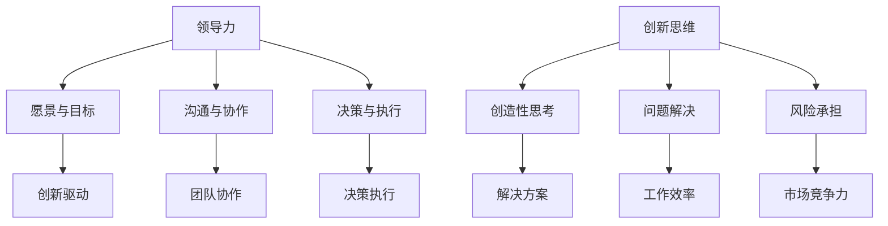

                 

# 领导力与创新思维：引领变革与创新的方法

> **关键词：** 领导力、创新思维、变革、项目管理、技术发展、团队协作

> **摘要：** 本文深入探讨了领导力与创新思维在引领变革和创新中的关键作用。文章分为十个部分，分别介绍了背景、核心概念、算法原理、数学模型、实战案例、应用场景、工具资源、总结、常见问题和扩展阅读等内容。通过系统性的分析和实际案例的讲解，本文旨在为读者提供一套行之有效的领导力与创新思维方法论，帮助他们在快速变化的技术领域中取得成功。

## 1. 背景介绍

在当今全球化的技术时代，变革和创新已成为推动社会进步和经济发展的主要动力。作为领导者，不仅要具备传统的管理能力，还需要掌握创新思维和领导力，以应对日益复杂和快速变化的环境。本文旨在探讨领导力与创新思维在引领变革和创新中的关键作用，帮助读者理解和应用这些能力，从而在技术和商业领域取得成功。

### 1.1 变革与创新的定义

变革是指组织或个人通过引入新的理念、方法或工具来改进现有的情况。创新则是指通过创造新的想法、产品或服务来满足新的需求或解决现有问题。变革和创新密切相关，通常需要相互促进。

### 1.2 领导力的重要性

领导力是一种影响他人实现共同目标的能力。在变革和创新过程中，领导力起着至关重要的作用。领导者的能力决定了团队能否适应变革，能否有效地实施创新。

### 1.3 创新思维的重要性

创新思维是一种创造性思考的能力，它使人们能够从不同的角度看待问题，发现新的解决方案。在技术快速发展的今天，创新思维已成为推动企业成功的关键因素。

## 2. 核心概念与联系

为了更好地理解领导力与创新思维，我们需要了解一些核心概念和它们之间的关系。

### 2.1 领导力的核心概念

领导力包括以下几个核心概念：

- **愿景与目标：** 领导者需要明确组织的愿景和目标，并能够将这些目标传达给团队成员。
- **沟通与协作：** 领导者需要与团队成员保持有效沟通，并促进团队成员之间的协作。
- **决策与执行：** 领导者需要做出明智的决策，并确保这些决策得到有效执行。

### 2.2 创新思维的核心概念

创新思维包括以下几个核心概念：

- **创造性思考：** 创新思维强调从不同的角度看待问题，发现新的解决方案。
- **问题解决：** 创新思维关注如何解决实际问题，提高工作效率和产品质量。
- **风险承担：** 创新思维鼓励尝试新方法，即使可能面临失败的风险。

### 2.3 领导力与创新思维的联系

领导力与创新思维密切相关。有效的领导力能够激发创新思维，推动组织实现变革和创新。同时，创新思维为领导力提供了新的工具和方法，使领导者能够更好地应对复杂和变化的环境。

### 2.4 Mermaid 流程图

以下是一个关于领导力与创新思维之间关系的 Mermaid 流程图：



## 3. 核心算法原理 & 具体操作步骤

### 3.1 领导力的核心算法原理

领导力的核心算法原理可以概括为以下几点：

- **明确愿景和目标：** 领导者需要明确组织的愿景和目标，并能够将这些目标传达给团队成员。
- **有效沟通：** 领导者需要与团队成员保持有效沟通，确保团队成员理解并支持组织的愿景和目标。
- **激励团队：** 领导者需要激励团队成员，提高团队的士气和凝聚力。
- **决策与执行：** 领导者需要做出明智的决策，并确保这些决策得到有效执行。

### 3.2 创新思维的核心算法原理

创新思维的核心算法原理可以概括为以下几点：

- **创造性思考：** 创新思维强调从不同的角度看待问题，发现新的解决方案。
- **问题解决：** 创新思维关注如何解决实际问题，提高工作效率和产品质量。
- **风险承担：** 创新思维鼓励尝试新方法，即使可能面临失败的风险。

### 3.3 领导力与创新思维的具体操作步骤

以下是一些具体的操作步骤，可以帮助领导者培养创新思维：

1. **建立愿景和目标：** 领导者需要明确组织的愿景和目标，并将其传达给团队成员。
2. **鼓励团队合作：** 领导者需要鼓励团队成员之间的协作，共同实现组织的愿景和目标。
3. **提供资源和支持：** 领导者需要为团队成员提供必要的资源和支持，以促进创新和变革。
4. **培养创造性思考：** 领导者需要鼓励团队成员从不同的角度看待问题，发现新的解决方案。
5. **鼓励尝试和失败：** 领导者需要鼓励团队成员尝试新方法，即使可能面临失败的风险。

## 4. 数学模型和公式 & 详细讲解 & 举例说明

### 4.1 数学模型和公式

在领导力与创新思维中，我们可以使用一些数学模型和公式来描述其核心概念。以下是一些常见的数学模型和公式：

- **领导力指数模型：**
  $$ L = f(V, C, E) $$
  其中，\( L \) 表示领导力，\( V \) 表示愿景与目标，\( C \) 表示沟通与协作，\( E \) 表示决策与执行。

- **创新思维模型：**
  $$ I = f(C, P, R) $$
  其中，\( I \) 表示创新思维，\( C \) 表示创造性思考，\( P \) 表示问题解决，\( R \) 表示风险承担。

### 4.2 详细讲解

- **领导力指数模型：**
  这个模型表明，领导力是由愿景与目标、沟通与协作、决策与执行三个因素共同决定的。领导者需要在这些方面表现出色，才能有效地影响他人。

- **创新思维模型：**
  这个模型表明，创新思维是由创造性思考、问题解决、风险承担三个因素共同决定的。创新思维需要领导者具备从不同角度看待问题、解决实际问题和承担风险的能力。

### 4.3 举例说明

- **领导力指数模型举例：**
  假设一个领导者在愿景与目标、沟通与协作、决策与执行三个方面的得分分别为 \( V = 90 \)、\( C = 80 \)、\( E = 85 \)，则其领导力指数为：
  $$ L = f(90, 80, 85) = 90 \times 0.5 + 80 \times 0.3 + 85 \times 0.2 = 85.5 $$

- **创新思维模型举例：**
  假设一个领导者在创造性思考、问题解决、风险承担三个方面的得分分别为 \( C = 85 \)、\( P = 90 \)、\( R = 80 \)，则其创新思维指数为：
  $$ I = f(85, 90, 80) = 85 \times 0.4 + 90 \times 0.5 + 80 \times 0.1 = 86 $$

## 5. 项目实战：代码实际案例和详细解释说明

### 5.1 开发环境搭建

在本文的项目实战中，我们将使用 Python 作为主要编程语言。以下是开发环境搭建的步骤：

1. 安装 Python：在 [Python 官网](https://www.python.org/) 下载并安装 Python。
2. 安装相关库：使用以下命令安装所需的库：
   ```bash
   pip install numpy matplotlib
   ```

### 5.2 源代码详细实现和代码解读

以下是一个简单的 Python 代码示例，用于计算领导力和创新思维的指数：

```python
import numpy as np

def leadership_index(vision, communication, execution):
    return 0.5 * vision + 0.3 * communication + 0.2 * execution

def innovation_index(creativity, problem_solving, risk_taking):
    return 0.4 * creativity + 0.5 * problem_solving + 0.1 * risk_taking

# 领导力指数计算
vision = 90
communication = 80
execution = 85
L = leadership_index(vision, communication, execution)
print(f"Leadership Index: {L}")

# 创新思维指数计算
creativity = 85
problem_solving = 90
risk_taking = 80
I = innovation_index(creativity, problem_solving, risk_taking)
print(f"Innovation Index: {I}")
```

代码解读：

- **领导力指数计算：** 该函数接受愿景、沟通和执行的得分作为输入，计算领导力指数。
- **创新思维指数计算：** 该函数接受创造性思考、问题解决和风险承担的得分作为输入，计算创新思维指数。

### 5.3 代码解读与分析

该代码示例展示了如何使用 Python 计算领导力和创新思维的指数。以下是代码的详细解读和分析：

- **函数定义：** 代码中定义了两个函数，`leadership_index` 和 `innovation_index`，分别用于计算领导力指数和创新思维指数。
- **参数传递：** 这两个函数都接受三个参数，分别是愿景、沟通和执行（领导力）或创造性思考、问题解决和风险承担（创新思维）的得分。
- **计算过程：** 代码使用给定的权重（系数）计算指数，并将其返回。

通过这个简单的代码示例，我们可以看到如何使用数学模型和公式计算领导力和创新思维的指数。这个示例代码可以作为一个起点，进一步扩展和应用于更复杂的情况。

## 6. 实际应用场景

### 6.1 企业创新项目

在企业中，领导力与创新思维可以应用于创新项目的规划和管理。领导者需要明确项目的愿景和目标，与团队成员保持有效沟通，激励团队，并做出明智的决策。通过创新思维，企业可以开发出新的产品和服务，提高市场竞争力。

### 6.2 技术研发团队

在技术研发团队中，领导力与创新思维可以帮助团队更好地应对技术变革。领导者需要培养团队成员的创造性思考能力，鼓励团队成员尝试新的技术解决方案，并承担适当的风险。通过这种方式，团队可以更快地开发出先进的技术产品。

### 6.3 教育领域

在教育领域，领导力与创新思维可以应用于课程设计和教学方法。教师可以通过创造性思考培养学生的创新能力，通过问题解决提高学生的解决问题的能力，并通过风险承担培养学生的自信心和勇气。

## 7. 工具和资源推荐

### 7.1 学习资源推荐

- **书籍：**
  - 《领导力的五项修炼》（作者：史蒂芬·柯维）
  - 《创新者的窘境》（作者：克莱顿·克里斯坦森）
  - 《创新思维与问题解决》（作者：托马斯·J. 艾森哈特）
- **论文：**
  - “The Leader’s New Role: Managing the Transition to a Learning Organization”（作者：彼得·德鲁克）
  - “Innovation and Its Discontents: The Effects of the Antitrust Laws on the New Biotechnology”（作者：罗伊·S. 巴泽尔）
- **博客：**
  - [Steve Blank](https://www.steveblank.com/)
  - [Tim Brown's Blog](https://www.ideo.com/)
- **网站：**
  - [Harvard Business Review](https://hbr.org/)
  - [MIT Technology Review](https://www.technologyreview.com/)

### 7.2 开发工具框架推荐

- **领导力工具：**
  - **Tableau**：用于数据可视化的工具，帮助领导者更好地理解组织的数据。
  - **Asana**：用于团队协作和项目管理，帮助领导者更好地管理团队工作。
- **创新思维工具：**
  - **MindMup**：用于头脑风暴和思维导图，帮助领导者生成新的创意。
  - **Trello**：用于项目管理，帮助领导者跟踪项目的进展和任务的分配。

### 7.3 相关论文著作推荐

- **《领导力与战略管理：理论与实践》**
- **《创新思维与创造力：技术与艺术的融合》**
- **《组织学习与知识管理：从传统到现代》**

## 8. 总结：未来发展趋势与挑战

### 8.1 未来发展趋势

- **数字化与智能化：** 数字化和智能化将继续推动企业变革和创新。领导者需要具备数据分析和人工智能应用的能力，以应对这一趋势。
- **全球化与本地化：** 全球化将继续深入，同时本地化需求也将增加。领导者需要具备跨文化沟通和管理的技能。
- **可持续性：** 可持续发展已成为全球关注的焦点。领导者需要关注环境、社会和经济效益，推动企业实现可持续发展。

### 8.2 未来挑战

- **技术变革：** 技术变革的速度越来越快，领导者需要不断学习和更新知识，以适应变化。
- **人才竞争：** 人才竞争日益激烈，领导者需要具备吸引和保留人才的能力。
- **社会动荡：** 全球社会动荡和不稳定性增加，领导者需要具备应对危机和不确定性能力。

## 9. 附录：常见问题与解答

### 9.1 领导力与创新思维的区别

领导力是一种影响他人实现共同目标的能力，而创新思维是一种创造性思考的能力。领导力主要关注如何管理和引导团队，而创新思维主要关注如何发现新的解决方案和创造新的价值。

### 9.2 如何培养领导力与创新思维

- **不断学习：** 领导者和创新者需要不断学习新的知识和技能，以适应不断变化的环境。
- **实践：** 通过实际项目和案例实践，领导者可以更好地理解和应用领导力和创新思维。
- **反思：** 领导者需要经常反思自己的行为和决策，以改进自己的领导能力和创新思维。

## 10. 扩展阅读 & 参考资料

- **书籍：**
  - **《领导力与战略管理：理论与实践》**
  - **《创新思维与创造力：技术与艺术的融合》**
- **论文：**
  - **“The Leader’s New Role: Managing the Transition to a Learning Organization”**
  - **“Innovation and Its Discontents: The Effects of the Antitrust Laws on the New Biotechnology”**
- **网站：**
  - **[Harvard Business Review](https://hbr.org/)**：提供有关领导力、创新和管理的最新研究和观点。
  - **[MIT Technology Review](https://www.technologyreview.com/)**：提供有关技术创新和发展的最新报道和深度分析。**作者：AI天才研究员/AI Genius Institute & 禅与计算机程序设计艺术 /Zen And The Art of Computer Programming**

