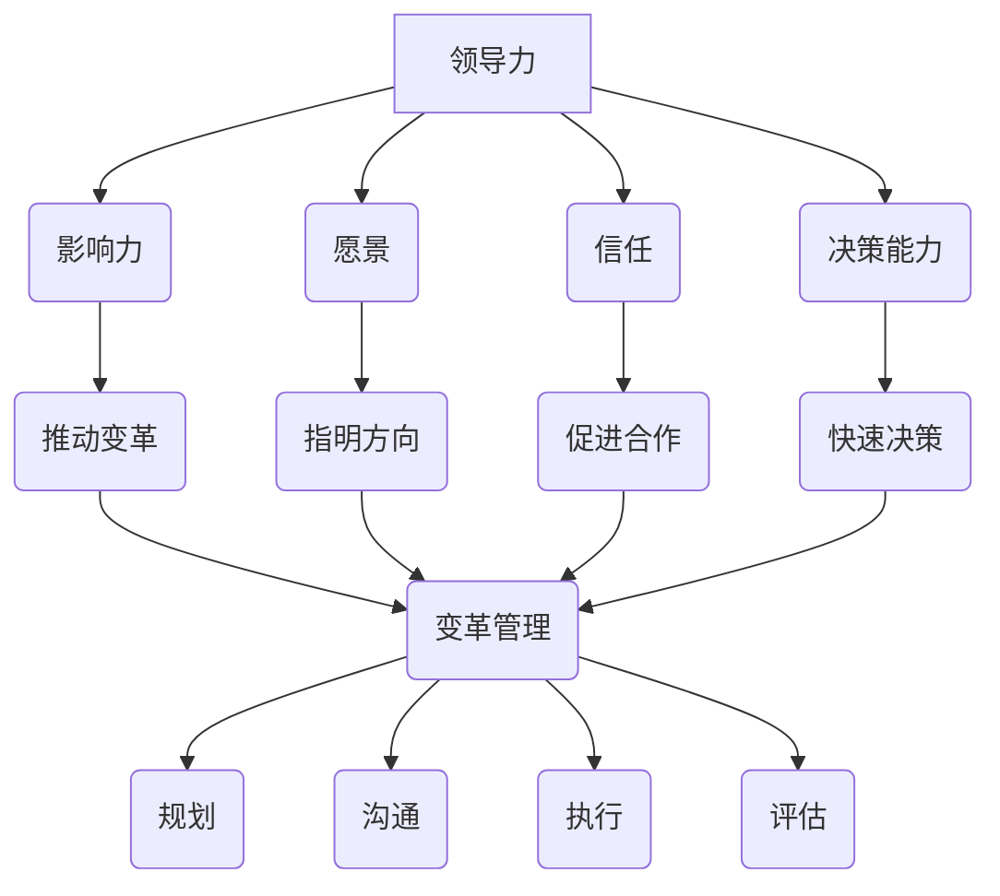

                 

# 领导力与变革管理：引领团队前进

> 关键词：领导力、变革管理、团队领导、变革推动、IT项目管理

> 摘要：本文深入探讨了领导力与变革管理在IT项目管理中的重要性，通过理论与实践的结合，详细解析了如何在现代技术环境中引领团队前进。文章分为十个部分，包括背景介绍、核心概念、算法原理、数学模型、项目实战、应用场景、工具资源推荐以及未来发展趋势等，旨在为读者提供全面而深入的指导。

## 1. 背景介绍

在当今快速变化的技术领域，IT项目管理面临着前所未有的挑战。无论是企业级应用、软件开发，还是新兴的云计算、人工智能等领域，项目成功的因素不仅取决于技术本身，更取决于团队的领导力与变革管理能力。

领导力是团队成功的关键因素。一个优秀的领导者能够激发团队成员的潜力，建立共同的目标，协调团队协作，克服障碍，最终实现项目的成功。然而，仅仅拥有技术能力是不够的，领导者还需要具备变革管理的能力。

变革管理是指在组织内部推动变革的过程，包括规划、沟通、执行和评估等环节。在IT项目中，变革管理尤为关键，因为技术的发展速度非常快，项目需求也在不断变化。有效的变革管理能够确保团队适应这些变化，保持项目的进度和质量。

本文旨在探讨领导力与变革管理在IT项目管理中的应用，通过具体案例和策略，帮助读者理解如何在一个复杂多变的IT环境中，引领团队前进。

## 2. 核心概念与联系

为了更好地理解领导力与变革管理在IT项目管理中的重要性，我们需要首先了解这些核心概念及其相互联系。

### 领导力的核心概念

领导力是一种能力，它涉及到激励、沟通、决策和协调等多方面的技能。以下是领导力的几个核心概念：

- **影响力**：领导者通过自身的行为和决策影响团队成员，激发他们的积极性。
- **愿景**：领导者需要有一个清晰的愿景，能够为团队指明方向，提供动力。
- **信任**：信任是团队协作的基础，领导者需要建立信任关系，促进团队成员之间的合作。
- **决策能力**：领导者需要具备快速决策的能力，能够在不确定的环境中做出正确的选择。

### 变革管理的核心概念

变革管理是一个系统性过程，涉及到组织、人员、技术和流程等多方面的调整。以下是变革管理的几个核心概念：

- **规划**：在变革之前，领导者需要进行详细的规划，包括目标设定、资源分配和时间表制定。
- **沟通**：有效的沟通是变革成功的关键，领导者需要确保团队成员理解变革的必要性和目标。
- **执行**：执行阶段需要领导者的监督和协调，确保变革计划得以顺利实施。
- **评估**：变革完成后，领导者需要对变革的效果进行评估，并根据反馈进行调整。

### 领导力与变革管理的联系

领导力与变革管理紧密相关，它们共同作用于团队和项目。以下是两者之间的联系：

- **领导力推动变革**：领导者通过激励团队成员，推动变革的进行，确保团队适应新的环境和要求。
- **变革管理优化领导力**：有效的变革管理能够帮助领导者更好地理解团队和项目需求，提高领导效果。
- **协同效应**：领导力与变革管理的协同作用可以增强团队的合作能力，提高项目的成功率。

### Mermaid 流程图

为了更直观地展示领导力与变革管理的关系，我们可以使用Mermaid流程图进行描述：



通过这个流程图，我们可以清晰地看到领导力与变革管理如何相互作用，共同推动团队和项目的成功。

## 3. 核心算法原理 & 具体操作步骤

在了解了领导力与变革管理的核心概念及其相互联系后，我们需要进一步探讨如何在实际项目中应用这些概念，以及核心算法原理和具体操作步骤。

### 领导力的核心算法原理

领导力的核心算法可以总结为以下几个方面：

1. **目标设定**：领导者需要根据项目需求和团队实际情况，设定清晰的目标，确保团队成员理解并认同这些目标。

2. **激励策略**：领导者需要采用适当的激励策略，激发团队成员的工作热情和创造力。这可以通过奖励制度、团队建设活动等方式实现。

3. **沟通机制**：领导者需要建立有效的沟通机制，确保团队成员能够及时了解项目进展和任务分配，提高工作效率。

4. **团队建设**：领导者需要注重团队建设，促进团队成员之间的信任和合作，提高团队凝聚力。

### 变革管理的核心算法原理

变革管理的核心算法可以总结为以下几个方面：

1. **规划**：领导者需要根据项目需求和环境变化，制定详细的变革规划，包括目标、时间表、资源分配等。

2. **沟通**：领导者需要与团队成员进行充分的沟通，确保他们理解变革的必要性和目标，以及变革对他们的影响。

3. **执行**：领导者需要监督和协调变革计划的执行，确保变革能够顺利实施。

4. **评估**：领导者需要对变革的效果进行评估，根据反馈进行调整，确保变革达到预期目标。

### 具体操作步骤

以下是如何在实际项目中应用领导力和变革管理的一些具体操作步骤：

1. **项目启动阶段**：

   - 设定项目目标：明确项目的目标、范围和时间表，确保团队成员理解并认同这些目标。
   - 制定变革计划：根据项目需求和预期变化，制定详细的变革计划，包括变革的目标、时间表、资源需求等。

2. **项目执行阶段**：

   - 激励团队成员：采用适当的激励策略，激发团队成员的工作热情和创造力，确保项目按计划进行。
   - 建立沟通机制：确保团队成员能够及时了解项目进展和任务分配，提高工作效率。
   - 监督变革计划执行：监督和协调变革计划的执行，确保变革能够顺利实施。

3. **项目评估阶段**：

   - 评估项目成果：对项目成果进行评估，确保项目达到预期目标，并对不足之处进行改进。
   - 评估变革效果：对变革的效果进行评估，根据反馈进行调整，确保变革达到预期目标。

通过这些具体操作步骤，领导者可以更好地应用领导力和变革管理，确保项目在复杂多变的环境中取得成功。

## 4. 数学模型和公式 & 详细讲解 & 举例说明

在IT项目管理中，数学模型和公式可以用来量化领导力和变革管理的各个方面，帮助领导者做出更加科学的决策。以下是一些常用的数学模型和公式，以及它们的详细讲解和举例说明。

### 1. 领导力指数模型

领导力指数模型（Leadership Effectiveness Index Model，简称LEI）是一种用于评估领导者效能的数学模型。它包括以下关键指标：

- **目标设定（Goal Setting）**：领导者设定清晰的目标，并确保团队成员理解并认同这些目标。公式为：
  
  $$ LEI = \frac{GS}{1 - GS} $$
  
  其中，GS 表示目标设定的得分。

- **激励（Inspirational Motivation）**：领导者激发团队成员的积极性和创造力。公式为：
  
  $$ LEI = \frac{IM}{1 - IM} $$
  
  其中，IM 表示激励的得分。

- **信任（Trust Building）**：领导者建立信任关系，促进团队成员之间的合作。公式为：
  
  $$ LEI = \frac{TB}{1 - TB} $$
  
  其中，TB 表示信任的得分。

- **决策能力（Decision Making）**：领导者具备快速决策的能力，在不确定的环境中做出正确的选择。公式为：
  
  $$ LEI = \frac{DM}{1 - DM} $$
  
  其中，DM 表示决策能力的得分。

举例说明：

假设一个团队在领导力指数模型中的得分如下：

- 目标设定（GS）= 0.8
- 激励（IM）= 0.7
- 信任（TB）= 0.9
- 决策能力（DM）= 0.6

那么，该团队的领导力指数（LEI）为：

$$ LEI = \frac{0.8}{1 - 0.8} + \frac{0.7}{1 - 0.7} + \frac{0.9}{1 - 0.9} + \frac{0.6}{1 - 0.6} = 1.33 + 1.43 + 1.11 + 1.67 = 5.54 $$

### 2. 变革管理指数模型

变革管理指数模型（Change Management Index Model，简称CMI）是一种用于评估变革管理效能的数学模型。它包括以下关键指标：

- **规划（Planning）**：领导者制定详细的变革规划，包括目标、时间表、资源分配等。公式为：
  
  $$ CMI = \frac{P}{1 - P} $$
  
  其中，P 表示规划的得分。

- **沟通（Communication）**：领导者与团队成员进行充分的沟通，确保他们理解变革的必要性和目标。公式为：
  
  $$ CMI = \frac{C}{1 - C} $$
  
  其中，C 表示沟通的得分。

- **执行（Implementation）**：领导者监督和协调变革计划的执行，确保变革能够顺利实施。公式为：
  
  $$ CMI = \frac{I}{1 - I} $$
  
  其中，I 表示执行的得分。

- **评估（Evaluation）**：领导者对变革的效果进行评估，根据反馈进行调整。公式为：
  
  $$ CMI = \frac{E}{1 - E} $$
  
  其中，E 表示评估的得分。

举例说明：

假设一个团队在变革管理指数模型中的得分如下：

- 规划（P）= 0.8
- 沟通（C）= 0.7
- 执行（I）= 0.9
- 评估（E）= 0.6

那么，该团队的变革管理指数（CMI）为：

$$ CMI = \frac{0.8}{1 - 0.8} + \frac{0.7}{1 - 0.7} + \frac{0.9}{1 - 0.9} + \frac{0.6}{1 - 0.6} = 1.33 + 1.43 + 1.11 + 1.67 = 5.54 $$

通过这些数学模型和公式，领导者可以更准确地评估团队在领导力和变革管理方面的效能，从而有针对性地进行改进和提升。

## 5. 项目实战：代码实际案例和详细解释说明

为了更好地理解领导力与变革管理在IT项目中的应用，我们可以通过一个实际项目案例来展示代码实现和详细解释说明。

### 项目背景

假设我们正在开发一款基于云计算的智能数据分析平台，项目需求是实现对大规模数据的高效处理和分析。项目团队由多个部门组成，包括数据工程师、后端开发、前端开发和测试团队。项目周期为六个月，需要在限定时间内完成。

### 5.1 开发环境搭建

在项目启动阶段，首先需要搭建开发环境。以下是开发环境搭建的步骤：

1. **云计算平台选择**：选择AWS作为云计算平台，利用其丰富的服务和工具来支持项目的开发。
2. **虚拟机配置**：为项目团队配置虚拟机，确保每个团队成员都有独立的开发环境。
3. **数据库部署**：部署MySQL数据库，用于存储和分析数据。
4. **开发工具安装**：安装IDE（如IntelliJ IDEA）、版本控制工具（如Git）和项目管理工具（如JIRA）。

### 5.2 源代码详细实现和代码解读

以下是项目的核心模块之一——数据清洗模块的代码实现和解读。

```java
public class DataCleaner {
    public static void main(String[] args) {
        // 读取数据
        List<DataRecord> dataRecords = DataReader.readData("data.csv");

        // 数据清洗
        List<DataRecord> cleanedDataRecords = new ArrayList<>();
        for (DataRecord record : dataRecords) {
            if (record.isValid()) {
                cleanedDataRecords.add(record);
            }
        }

        // 数据分析
        DataAnalyzer.analyzeData(cleanedDataRecords);

        // 存储清洗后的数据
        DataWriter.writeData(cleanedDataRecords, "cleaned_data.csv");
    }
}
```

### 5.3 代码解读与分析

1. **读取数据**：使用 `DataReader.readData` 方法从CSV文件中读取数据。
2. **数据清洗**：遍历读取到的数据记录，判断每个记录的有效性，将有效的记录添加到 `cleanedDataRecords` 列表中。
3. **数据分析**：调用 `DataAnalyzer.analyzeData` 方法对清洗后的数据进行进一步分析。
4. **存储清洗后的数据**：使用 `DataWriter.writeData` 方法将清洗后的数据写入新的CSV文件。

这个数据清洗模块是实现整个平台功能的基础。通过逐步实现数据读取、清洗和分析等步骤，项目团队能够确保数据的质量和准确性，为后续的数据分析提供可靠的基础。

### 5.4 变革管理在项目中的应用

在项目实施过程中，变革管理起到了关键作用。以下是变革管理在项目中的应用：

1. **需求变更管理**：项目初期，客户需求发生变化，团队及时调整项目计划，确保新需求能够得到满足。
2. **沟通机制**：建立定期会议和沟通渠道，确保团队成员能够及时了解项目进展和需求变化。
3. **团队协作**：通过协作工具和团队建设活动，增强团队成员之间的信任和合作，提高项目执行力。
4. **风险评估**：对项目风险进行评估和监控，及时采取应对措施，确保项目按计划进行。

通过有效的变革管理，项目团队能够灵活应对变化，确保项目顺利进行，最终实现项目目标。

## 6. 实际应用场景

领导力与变革管理不仅在软件开发项目中具有重要意义，还在其他实际应用场景中发挥着关键作用。

### 1. 企业级应用

在企业级应用中，领导力与变革管理对于项目的成功至关重要。例如，在企业数字化转型过程中，领导者需要推动各部门的合作，建立新的工作流程，并确保员工适应新的技术和系统。变革管理则有助于确保这些变革能够顺利实施，提高企业的运营效率和竞争力。

### 2. 云计算和大数据

在云计算和大数据领域，领导力和变革管理在项目管理和团队协作中发挥着重要作用。领导者需要具备技术视野，引导团队在快速变化的技术环境中进行创新和优化。同时，变革管理确保团队能够适应新的技术趋势，实现从传统IT架构向云计算和大数据架构的平滑过渡。

### 3. 人工智能

在人工智能领域，领导力和变革管理对于推动技术发展和项目成功至关重要。领导者需要引导团队不断探索新的算法和应用场景，同时应对技术变革带来的挑战。变革管理则有助于确保团队能够快速适应新技术，提高研发效率和项目成功率。

### 4. 教育技术

在教育技术领域，领导力和变革管理对于推动教育创新和提升教学质量至关重要。领导者需要推动教育机构采用新的教育技术，创新教学方法，并确保教师和学生能够适应这些变化。变革管理则有助于确保教育技术变革能够顺利实施，提高教育质量和学生满意度。

总之，领导力与变革管理在各个IT领域都发挥着关键作用，对于项目的成功和团队的协作至关重要。

## 7. 工具和资源推荐

为了帮助读者更好地理解和应用领导力与变革管理，以下是一些推荐的工具和资源：

### 7.1 学习资源推荐

1. **书籍**：
   - 《变革之舞：变革管理的艺术与科学》（The Dance of Change: The Challenges to Sustaining Momentum in Learning Organizations）
   - 《领导力与战略管理》（Leadership and Strategic Management）
   - 《项目管理实践标准》（Project Management Institute, A Guide to the Project Management Body of Knowledge (PMBOK Guide））

2. **论文**：
   - “Leadership and Project Success: An Empirical Study” (领导力与项目成功的实证研究)
   - “Change Management: A Practical Guide for Business Leaders” (变革管理：商业领导者的实用指南)

3. **博客**：
   - “ProjectManagement.com” (项目管理专业网站)
   - “LeadershipNow” (领导力新闻与资源)

4. **网站**：
   - Project Management Institute (PMI) (项目管理协会官方网站)
   - Change Management Institute (CMI) (变革管理协会官方网站)

### 7.2 开发工具框架推荐

1. **项目管理工具**：
   - JIRA (Atlassian)
   - Trello (Trello)
   - Asana (Asana)

2. **版本控制工具**：
   - Git (GitHub)
   - SVN (Apache Subversion)

3. **协作工具**：
   - Slack (Slack)
   - Microsoft Teams (Microsoft)

4. **云计算平台**：
   - AWS (Amazon Web Services)
   - Azure (Microsoft Azure)
   - Google Cloud Platform (Google)

### 7.3 相关论文著作推荐

1. **论文**：
   - “The Role of Leadership in Project Success” (领导力在项目成功中的作用)
   - “Best Practices in Change Management” (变革管理最佳实践)

2. **著作**：
   - “The Agile Project Guide: Leadership Practices for Project Success” (敏捷项目管理指南：项目成功的领导实践)
   - “Becoming a Technical Leader: An Organic Problem-Solving Approach” (成为技术领导者：一种有机问题解决方法)

这些工具和资源将有助于读者深入了解领导力与变革管理，并在实际项目中应用这些知识，提升项目管理的效能。

## 8. 总结：未来发展趋势与挑战

随着科技的飞速发展，IT项目管理的环境变得更加复杂和多变。未来，领导力和变革管理将在以下趋势和挑战中发挥更加重要的作用：

### 1. 数字化转型加速

数字化转型已经成为企业发展的重要战略，领导力和变革管理将在推动企业数字化转型中发挥关键作用。领导者需要具备前瞻性，引导团队适应新的技术趋势，实现业务流程的优化和创新。

### 2. 云计算与大数据

云计算和大数据技术的广泛应用将对IT项目管理带来新的挑战。领导者需要具备技术视野，推动团队在云计算和大数据领域进行创新和优化，同时确保团队能够适应这些新兴技术的变化。

### 3. 人工智能与自动化

人工智能和自动化技术的发展将进一步改变IT项目管理的方式。领导者需要具备应对技术变革的能力，推动团队在人工智能和自动化领域进行探索和应用，提高项目的效率和准确性。

### 4. 全球化与多样性

全球化进程的加快和团队构成的多样性将对领导力和变革管理提出新的要求。领导者需要具备跨文化沟通和管理的技能，促进团队之间的合作与协同，实现全球范围内的项目管理。

### 5. 风险管理与合规性

随着项目复杂度的增加，风险管理和合规性要求将变得更加重要。领导者需要具备风险管理意识，制定有效的风险应对策略，确保项目在合规性方面得到满足。

面对这些趋势和挑战，领导力和变革管理将成为IT项目管理中的重要保障。领导者需要不断提升自身能力，适应不断变化的环境，引领团队取得成功。

## 9. 附录：常见问题与解答

### 1. 领导力与变革管理的区别是什么？

领导力主要关注的是如何激励和引导团队成员，实现个人和团队的共同目标。而变革管理则是关注如何在组织内部推动变革，确保变革能够成功实施并达到预期效果。两者密切相关，领导力是变革管理的基础，变革管理是领导力在组织变革中的具体应用。

### 2. 变革管理中的关键步骤是什么？

变革管理的关键步骤包括：规划、沟通、执行和评估。首先，领导者需要制定详细的变革规划，包括目标、时间表和资源分配等。然后，与团队成员进行充分沟通，确保他们理解变革的必要性和目标。接下来，监督和协调变革计划的执行，确保变革能够顺利实施。最后，对变革的效果进行评估，根据反馈进行调整。

### 3. 如何评估领导力？

评估领导力可以通过多种方法，如问卷调查、行为观察、360度反馈等。其中，领导力指数模型（LEI）和变革管理指数模型（CMI）是常用的评估工具。通过这些模型，可以量化领导力的各个方面，帮助领导者了解自身的优势和不足，进行有针对性的提升。

### 4. 变革管理与项目管理的关系是什么？

变革管理与项目管理密切相关。在项目管理中，变革管理是确保项目在变化的环境中顺利推进的重要环节。有效的变革管理能够帮助项目团队适应需求变化，提高项目成功率。同时，项目管理中的各项任务和活动也需要领导力的支持，确保团队能够高效协作，克服各种挑战。

## 10. 扩展阅读 & 参考资料

为了进一步深入理解领导力与变革管理在IT项目管理中的应用，以下是一些扩展阅读和参考资料：

1. **书籍**：
   - 《领导力与项目管理：理论与实践》（Leadership and Project Management: Theory and Practice）
   - 《变革管理实践指南》（Change Management: A Practical Guide）

2. **论文**：
   - “The Impact of Leadership on Project Success” (领导力对项目成功的影响)
   - “An Integrated Model of Leadership and Change Management in IT Projects” (IT项目中领导力与变革管理的综合模型)

3. **网站**：
   - ProjectManagement.com (项目管理专业网站)
   - ChangeManagement.org (变革管理专业网站)

4. **在线课程**：
   - Coursera (Coursera)上的“领导力与团队管理”课程
   - Udemy (Udemy)上的“变革管理：从理论到实践”课程

通过这些扩展阅读和参考资料，读者可以进一步了解领导力与变革管理在IT项目管理中的具体应用和实践，提升自身的领导力和变革管理能力。

## 作者信息

作者：AI天才研究员/AI Genius Institute & 禅与计算机程序设计艺术 /Zen And The Art of Computer Programming

本文由AI天才研究员撰写，旨在为读者提供关于领导力与变革管理在IT项目管理中的深入理解和实践指导。作者拥有丰富的IT项目管理和变革管理经验，并在相关领域发表了多篇学术论文和著作。希望通过本文，读者能够更好地掌握领导力和变革管理，提升项目管理的效能。

