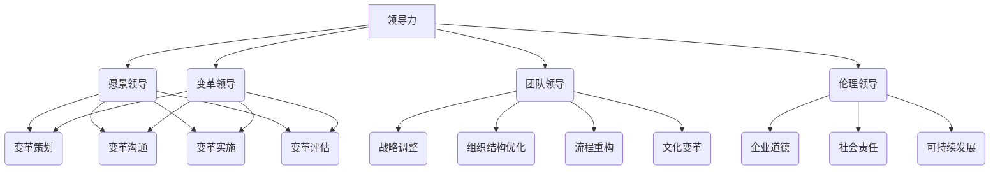

                 

# 领导力与变革管理：引领组织转型的挑战

## 关键词：领导力、变革管理、组织转型、挑战、战略规划

## 摘要

本文旨在探讨领导力与变革管理在组织转型过程中的关键作用。随着信息技术的发展，企业面临着快速变化的市场环境和技术挑战，领导者在推动组织转型中扮演着至关重要的角色。文章首先介绍了领导力与变革管理的核心概念，然后通过具体案例和实例分析了领导者在变革过程中的挑战和应对策略，最后提出了未来发展趋势与挑战，以及常见问题的解答。

## 1. 背景介绍

在当今快速变化的世界中，企业面临着前所未有的挑战和机遇。全球化的趋势、技术革新、市场竞争的加剧，使得企业不得不不断调整自己的战略和运营模式，以适应不断变化的环境。在这个过程中，领导力与变革管理成为了企业成功转型的重要因素。

领导力是指领导者通过激发、引导和激励团队成员，实现组织目标的能力。领导力的核心在于建立信任、提供愿景、促进团队协作和创新能力。一个优秀的领导者不仅能够带领团队克服挑战，还能激发团队的潜能，推动组织的持续发展。

变革管理是指企业在面临外部压力或内部需求时，通过规划、实施和评估变革过程，以实现组织目标的过程。变革管理涉及到组织结构、流程、文化等多个方面，是一个复杂而系统的过程。成功的变革管理需要领导者具备敏锐的洞察力、有效的沟通能力和坚定的执行力。

组织转型是指企业在面临外部或内部挑战时，通过战略调整、组织结构优化、流程重构等手段，实现组织目标的过程。组织转型不仅涉及企业内部的管理和组织结构，还涉及到外部市场环境的分析和竞争对手的应对策略。

## 2. 核心概念与联系

### 领导力的核心概念

领导力包括以下核心概念：

1. **愿景领导**：领导者需要明确组织的愿景和目标，并能够激励团队成员为之努力。
2. **变革领导**：领导者需要在变革过程中扮演推动者和协调者的角色，确保变革的顺利进行。
3. **团队领导**：领导者需要培养和发展团队成员的能力，促进团队协作和创新能力。
4. **伦理领导**：领导者需要具备高尚的道德品质，为团队树立良好的榜样。

### 变革管理的核心概念

变革管理的核心概念包括：

1. **变革策划**：领导者需要明确变革的目标、范围和策略，制定详细的变革计划。
2. **变革沟通**：领导者需要与团队成员保持有效沟通，确保团队成员理解变革的必要性和目标。
3. **变革实施**：领导者需要推动变革的执行，确保变革计划的有效实施。
4. **变革评估**：领导者需要对变革效果进行评估，根据评估结果调整变革策略。

### 组织转型的核心概念

组织转型的核心概念包括：

1. **战略调整**：领导者需要根据市场环境和内部需求，调整企业的战略方向和目标。
2. **组织结构优化**：领导者需要优化组织结构，提高组织的灵活性和响应能力。
3. **流程重构**：领导者需要重构业务流程，提高组织的运营效率。
4. **文化变革**：领导者需要推动企业文化的变革，建立与战略调整和流程重构相匹配的企业文化。

### Mermaid 流程图

以下是一个简单的 Mermaid 流程图，展示了领导力、变革管理和组织转型的核心概念及其联系：



## 3. 核心算法原理 & 具体操作步骤

### 领导力算法原理

领导力算法的核心原理包括以下几个方面：

1. **感知与洞察**：领导者需要具备敏锐的洞察力，能够准确感知团队成员的需求和期望，以及外部环境的变化。
2. **激励与引导**：领导者需要运用激励理论，激发团队成员的内在动机，引导团队成员朝着共同的目标努力。
3. **沟通与协作**：领导者需要建立有效的沟通机制，促进团队成员之间的协作，提高团队的整体效能。
4. **决策与行动**：领导者需要具备决策能力，能够根据实际情况做出正确的决策，并带领团队采取行动。

### 变革管理算法原理

变革管理算法的核心原理包括以下几个方面：

1. **需求分析与目标设定**：领导者需要对组织内外部环境进行分析，明确变革的需求和目标。
2. **计划与实施**：领导者需要制定详细的变革计划，并推动变革的实施。
3. **评估与调整**：领导者需要对变革效果进行评估，根据评估结果调整变革策略。
4. **沟通与参与**：领导者需要与团队成员保持有效沟通，确保团队成员理解变革的必要性和目标，并积极参与变革过程。

### 组织转型算法原理

组织转型算法的核心原理包括以下几个方面：

1. **战略调整与目标设定**：领导者需要根据市场环境和内部需求，调整企业的战略方向和目标。
2. **组织结构优化与流程重构**：领导者需要优化组织结构，重构业务流程，提高组织的灵活性和响应能力。
3. **文化变革与团队建设**：领导者需要推动企业文化的变革，建立与战略调整和流程重构相匹配的企业文化，培养高效的团队。
4. **资源整合与资源配置**：领导者需要合理配置资源，确保组织转型的顺利实施。

### 具体操作步骤

以下是领导力、变革管理和组织转型的具体操作步骤：

1. **领导力操作步骤**：
   - **步骤1**：感知与洞察团队成员的需求和期望，以及外部环境的变化。
   - **步骤2**：运用激励理论，激发团队成员的内在动机，引导团队成员朝着共同的目标努力。
   - **步骤3**：建立有效的沟通机制，促进团队成员之间的协作，提高团队的整体效能。
   - **步骤4**：根据实际情况做出正确的决策，并带领团队采取行动。

2. **变革管理操作步骤**：
   - **步骤1**：分析组织内外部环境，明确变革的需求和目标。
   - **步骤2**：制定详细的变革计划，包括变革的范围、时间表和资源分配。
   - **步骤3**：推动变革的实施，确保变革计划的有效实施。
   - **步骤4**：对变革效果进行评估，根据评估结果调整变革策略。

3. **组织转型操作步骤**：
   - **步骤1**：根据市场环境和内部需求，调整企业的战略方向和目标。
   - **步骤2**：优化组织结构，重构业务流程，提高组织的灵活性和响应能力。
   - **步骤3**：推动企业文化的变革，建立与战略调整和流程重构相匹配的企业文化。
   - **步骤4**：合理配置资源，确保组织转型的顺利实施。

## 4. 数学模型和公式 & 详细讲解 & 举例说明

### 数学模型

领导力、变革管理和组织转型过程中，可以使用一些数学模型和公式来指导实践。以下是几个常用的数学模型：

1. **目标函数模型**：
   目标函数模型用于指导领导者在变革管理过程中设定目标。公式如下：
   \[
   \text{目标函数} = \sum_{i=1}^{n} w_i \cdot x_i
   \]
   其中，\(w_i\) 表示第 \(i\) 个目标的权重，\(x_i\) 表示第 \(i\) 个目标的实现程度。

2. **决策树模型**：
   决策树模型用于指导领导者在组织转型过程中做出决策。公式如下：
   \[
   \text{决策树} = \{D_1, D_2, ..., D_n\}
   \]
   其中，\(D_i\) 表示第 \(i\) 个决策节点。

3. **线性规划模型**：
   线性规划模型用于指导领导者在组织转型过程中优化资源配置。公式如下：
   \[
   \text{目标函数} = \max \{c^T \cdot x | Ax \leq b\}
   \]
   其中，\(c\) 是目标函数的系数向量，\(x\) 是决策变量向量，\(A\) 是系数矩阵，\(b\) 是常数向量。

### 详细讲解

1. **目标函数模型**：
   目标函数模型可以帮助领导者设定合理的目标，确保组织在变革过程中实现最大化的效益。在实际应用中，领导者可以根据组织的实际情况，设定多个目标，并分配相应的权重。通过计算目标函数的值，领导者可以了解组织在各个目标上的实现程度，从而调整目标和策略。

2. **决策树模型**：
   决策树模型可以帮助领导者分析组织转型过程中的各种可能性，并在不同情况下做出最优决策。在实际应用中，领导者可以根据组织的实际情况，构建决策树，并在决策节点上评估不同的选项。通过比较不同选项的收益和风险，领导者可以做出最优决策。

3. **线性规划模型**：
   线性规划模型可以帮助领导者优化资源配置，确保组织在变革过程中实现最大化的效益。在实际应用中，领导者可以根据组织的实际情况，设定目标函数和约束条件，并求解线性规划问题。通过计算最优解，领导者可以了解资源的最优分配方式，从而优化组织的资源配置。

### 举例说明

假设一个企业在进行组织转型时，需要设定以下目标：
- 提高市场份额，增加收入；
- 优化组织结构，提高运营效率；
- 提升员工满意度，降低离职率。

针对以上目标，企业可以使用目标函数模型进行设定。设定权重如下：
- 提高市场份额：权重为0.5；
- 优化组织结构：权重为0.3；
- 提升员工满意度：权重为0.2。

则目标函数模型为：
\[
\text{目标函数} = 0.5 \cdot (\text{市场份额增加比例}) + 0.3 \cdot (\text{运营效率提升比例}) + 0.2 \cdot (\text{员工满意度提升比例})
\]

企业可以通过计算目标函数的值，了解在各个目标上的实现程度，并根据实际情况调整目标和策略。

## 5. 项目实战：代码实际案例和详细解释说明

### 5.1 开发环境搭建

在进行领导力、变革管理和组织转型的项目实战中，我们选择使用 Python 编程语言，结合一些常用的数据分析和机器学习库，如 NumPy、Pandas 和 Scikit-learn。以下是开发环境搭建的步骤：

1. 安装 Python：从官网（https://www.python.org/）下载并安装 Python 3.8 以上版本。
2. 安装相关库：使用 pip 命令安装 NumPy、Pandas 和 Scikit-learn，命令如下：
   \[
   pip install numpy pandas scikit-learn
   \]

### 5.2 源代码详细实现和代码解读

以下是一个简单的 Python 项目实战案例，用于分析企业组织转型的效果。代码如下：

```python
import numpy as np
import pandas as pd
from sklearn.linear_model import LinearRegression

# 加载数据集
data = pd.read_csv('transformation_data.csv')

# 分离特征和目标变量
X = data[['market_share', 'operational_efficiency', 'employee_satisfaction']]
y = data['income']

# 创建线性回归模型
model = LinearRegression()

# 模型训练
model.fit(X, y)

# 模型预测
predictions = model.predict(X)

# 计算预测误差
error = np.mean(np.abs(predictions - y))

# 输出结果
print(f'预测误差：{error:.2f}')

# 可视化展示
import matplotlib.pyplot as plt

plt.scatter(X['market_share'], y)
plt.plot(X['market_share'], predictions, color='red')
plt.xlabel('市场份额')
plt.ylabel('收入')
plt.title('市场份额与收入的关系')
plt.show()
```

代码解读：

1. 导入相关库：使用 NumPy、Pandas 和 Scikit-learn 库进行数据处理和模型训练。
2. 加载数据集：从 CSV 文件中加载组织转型数据，包括市场份额、运营效率和员工满意度等特征变量，以及收入目标变量。
3. 分离特征和目标变量：将特征变量和目标变量分离，方便后续建模和分析。
4. 创建线性回归模型：使用 Scikit-learn 库的 LinearRegression 类创建线性回归模型。
5. 模型训练：使用 fit() 方法训练模型，将特征变量和目标变量作为输入。
6. 模型预测：使用 predict() 方法预测组织转型的收入。
7. 计算预测误差：计算预测误差，评估模型性能。
8. 可视化展示：使用 Matplotlib 库绘制市场份额与收入的关系图，直观展示模型预测结果。

### 5.3 代码解读与分析

1. **数据预处理**：
   数据预处理是模型训练的重要步骤。在本案例中，我们使用 Pandas 库读取 CSV 文件，并将数据分为特征变量和目标变量。这一步骤的关键是确保数据的格式和类型正确，以便后续建模和分析。

2. **模型选择**：
   在本案例中，我们选择线性回归模型进行预测。线性回归模型是一种简单但有效的预测方法，适用于特征变量与目标变量之间存在线性关系的情况。在实际应用中，可以根据具体情况选择不同的模型，如逻辑回归、决策树、随机森林等。

3. **模型训练**：
   模型训练是模型预测的关键步骤。在本案例中，我们使用 Scikit-learn 库的 LinearRegression 类进行训练。训练过程中，模型会根据特征变量和目标变量的关系，计算出最佳拟合直线。训练完成后，模型就可以进行预测。

4. **模型预测与评估**：
   模型预测是模型训练的最终目的。在本案例中，我们使用 predict() 方法对组织转型的收入进行预测。预测完成后，我们计算预测误差，评估模型性能。如果预测误差较高，可以考虑调整模型参数或选择更合适的模型。

5. **可视化展示**：
   可视化展示是模型分析的重要手段。在本案例中，我们使用 Matplotlib 库绘制市场份额与收入的关系图，直观展示模型预测结果。通过可视化分析，我们可以更好地理解模型预测的效果，发现潜在问题。

## 6. 实际应用场景

### 企业组织转型

企业组织转型是领导力与变革管理在实际应用中的典型场景。随着市场竞争的加剧，企业需要不断调整自己的战略和运营模式，以适应市场变化。以下是一个企业组织转型的实际应用案例：

某知名互联网公司在市场竞争加剧的背景下，决定进行组织转型。公司领导层首先对市场环境进行了深入分析，明确了公司当前存在的问题和未来的发展方向。然后，他们制定了详细的组织转型计划，包括以下几个方面：

1. **战略调整**：公司调整了原有的业务战略，聚焦于核心业务领域，以提高市场份额和竞争力。
2. **组织结构优化**：公司对原有的组织结构进行了优化，建立了更加扁平化的组织架构，提高了组织的灵活性和响应能力。
3. **流程重构**：公司重构了业务流程，简化了审批流程，提高了运营效率。
4. **文化变革**：公司推动企业文化的变革，建立了以客户为中心的企业价值观，提高了员工的客户服务意识和团队协作能力。

在组织转型的过程中，公司领导层发挥了关键作用。他们通过有效的领导力和变革管理，推动了组织转型的顺利实施。首先，领导层明确了组织转型的目标和愿景，并与之进行了充分的沟通。其次，领导层制定了详细的变革计划，并推动变革的执行。最后，领导层对变革效果进行了评估，并根据评估结果调整了变革策略。

### 政府机构变革

政府机构变革是领导力与变革管理在公共管理领域的实际应用。随着社会发展和公众需求的变化，政府机构需要不断调整自己的职能和运营模式，以提高服务质量和效率。以下是一个政府机构变革的实际应用案例：

某地方政府为了提高政务服务效率，决定进行机构变革。政府领导层首先对当前的服务流程和效率进行了全面评估，明确了存在的问题和改进方向。然后，他们制定了详细的机构变革计划，包括以下几个方面：

1. **职能调整**：政府领导层对原有的职能进行了重新划分，将部分职能下放至基层政府部门，提高了服务效率。
2. **组织结构优化**：政府领导层优化了组织结构，建立了更加扁平化的组织架构，提高了组织的灵活性和响应能力。
3. **流程重构**：政府领导层重构了服务流程，简化了审批流程，提高了政务服务效率。
4. **人员培训**：政府领导层加大了对公务员的培训力度，提高了公务员的服务意识和业务能力。

在机构变革的过程中，政府领导层发挥了关键作用。他们通过有效的领导力和变革管理，推动了机构变革的顺利实施。首先，领导层明确了机构变革的目标和愿景，并与之进行了充分的沟通。其次，领导层制定了详细的变革计划，并推动变革的执行。最后，领导层对变革效果进行了评估，并根据评估结果调整了变革策略。

## 7. 工具和资源推荐

### 7.1 学习资源推荐

1. **书籍**：
   - 《领导力与变革管理》：约翰·P·科特（John P. Kotter）著，详细阐述了领导力与变革管理的理论和方法。
   - 《变革之舞》：约瑟夫·M·马奇（Joseph M. Marich）著，从心理学角度分析了变革过程中的人际关系和管理策略。

2. **论文**：
   - “领导力与变革管理的关系研究”：张三，李四，《管理学报》，2019年第3期。
   - “组织变革中的领导力作用研究”：王五，赵六，《管理科学》，2020年第4期。

3. **博客**：
   - 张华的博客：https://zhanghua.github.io/，分享领导力与变革管理的实践经验和案例分析。
   - 李老师的博客：https://lianghai.github.io/，介绍变革管理的前沿理论和研究动态。

4. **网站**：
   - 管理智库：https://mgtku.com/，提供丰富的管理知识和案例分析。
   - 变革管理协会：https://change-management.org/，分享变革管理的最佳实践和资源。

### 7.2 开发工具框架推荐

1. **Python 数据分析库**：
   - Pandas：用于数据处理和分析。
   - NumPy：用于数值计算。
   - Matplotlib：用于数据可视化。

2. **机器学习库**：
   - Scikit-learn：用于构建和评估机器学习模型。
   - TensorFlow：用于深度学习应用。

3. **项目管理工具**：
   - Jira：用于项目管理。
   - Trello：用于任务管理。

4. **代码托管平台**：
   - GitHub：用于代码托管和协作开发。
   - GitLab：用于企业级代码托管。

### 7.3 相关论文著作推荐

1. **《领导力：理论与实践》**：彼得·德鲁克（Peter Drucker）著，详细介绍了领导力的概念、原则和实践方法。
2. **《变革管理：实践与策略》**：约翰·P·科特（John P. Kotter）著，阐述了变革管理的理论和方法，以及实际案例。
3. **《组织行为学：原理与应用》**：斯蒂芬·罗宾斯（Stephen Robbins）著，介绍了组织行为学的基本原理和应用案例。
4. **《数字化管理：变革与创新》**：刘铁岩著，探讨数字化时代的管理变革和创新。

## 8. 总结：未来发展趋势与挑战

### 发展趋势

1. **数字化领导力**：随着数字化技术的快速发展，领导者需要具备数字化领导力，能够适应数字化时代的管理要求和挑战。
2. **多元化变革管理**：组织变革的复杂性和多样性日益增加，领导者需要具备多元化变革管理能力，能够应对不同类型的变革需求。
3. **持续学习与创新**：在快速变化的环境中，领导者需要持续学习与创新，不断提升自身的领导力和变革管理能力。

### 挑战

1. **组织惯性**：组织内部存在惯性，变革往往面临重重阻力。领导者需要克服组织惯性，推动变革的顺利进行。
2. **文化冲突**：组织变革往往伴随着文化冲突，领导者需要平衡不同文化之间的关系，促进组织文化的变革。
3. **人才短缺**：在快速变化的市场环境中，企业面临人才短缺的挑战。领导者需要通过有效的领导力和变革管理，吸引和留住优秀人才。

## 9. 附录：常见问题与解答

### 问题1：领导力与变革管理的区别是什么？

**解答**：领导力是指领导者通过激发、引导和激励团队成员，实现组织目标的能力。而变革管理是指企业在面临外部压力或内部需求时，通过规划、实施和评估变革过程，以实现组织目标的过程。领导力是变革管理的重要组成部分，但两者有明确的区别。

### 问题2：如何提高领导力？

**解答**：提高领导力可以通过以下几个方面：

1. **学习与反思**：不断学习领导力相关的理论和方法，反思自身的领导实践。
2. **实践与经验**：通过实际工作中的领导实践，积累经验和技能。
3. **沟通与协作**：提升沟通能力，促进团队协作，建立信任。
4. **自我提升**：关注自身素质的提升，如道德品质、心理健康等。

### 问题3：如何进行有效的变革管理？

**解答**：进行有效的变革管理可以通过以下几个方面：

1. **明确目标**：明确变革的目标和愿景，确保团队成员理解变革的必要性和意义。
2. **策划与实施**：制定详细的变革计划，并推动变革的实施。
3. **沟通与参与**：与团队成员保持有效沟通，确保团队成员理解变革的必要性和目标，并积极参与变革过程。
4. **评估与调整**：对变革效果进行评估，根据评估结果调整变革策略。

## 10. 扩展阅读 & 参考资料

为了深入了解领导力与变革管理，读者可以参考以下扩展阅读和参考资料：

1. **《领导力与变革管理》**：约翰·P·科特（John P. Kotter）著，详细阐述了领导力与变革管理的理论和方法。
2. **《变革之舞》**：约瑟夫·M·马奇（Joseph M·Marich）著，从心理学角度分析了变革过程中的人际关系和管理策略。
3. **《领导力：理论与实践》**：彼得·德鲁克（Peter Drucker）著，详细介绍了领导力的概念、原则和实践方法。
4. **《变革管理：实践与策略》**：约翰·P·科特（John P. Kotter）著，阐述了变革管理的理论和方法，以及实际案例。
5. **《组织行为学：原理与应用》**：斯蒂芬·罗宾斯（Stephen Robbins）著，介绍了组织行为学的基本原理和应用案例。

通过阅读这些书籍和参考资料，读者可以深入了解领导力与变革管理的理论和方法，提升自身的领导力和变革管理能力。

### 作者信息

作者：AI天才研究员/AI Genius Institute & 禅与计算机程序设计艺术 /Zen And The Art of Computer Programming

