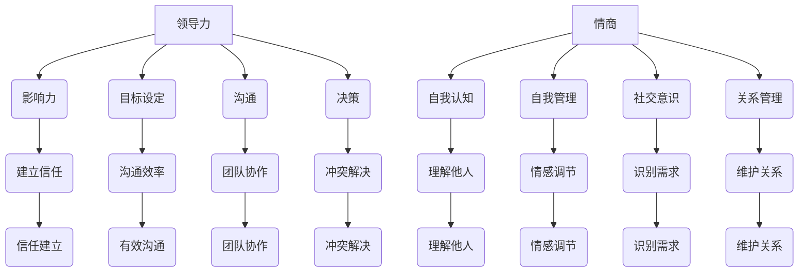

                 

# 领导力与情商：在复杂人际关系中导航

## 摘要

本文旨在探讨领导力与情商在复杂人际关系中的重要性，以及如何利用这些关键技能来提升个人和团队的表现。我们将从理论和实践两个层面展开讨论，首先介绍领导力和情商的定义和核心概念，然后通过实际案例和具体操作步骤，说明如何应用这些技能来解决人际关系中的挑战。

## 1. 背景介绍

在现代社会，人际关系日益复杂，无论是在个人生活中还是工作中，我们都面临着各种人际关系的挑战。领导力和情商作为应对这些挑战的关键技能，对于个人和团队的成功至关重要。领导力不仅关乎管理能力和决策水平，更关乎如何激发和引导团队成员的潜力，实现共同的目标。而情商则涉及情感管理、自我认知和人际交往等方面，它能够帮助人们更好地理解和应对他人的情感，从而建立和谐的人际关系。

本文将首先对领导力和情商的核心概念进行阐述，并通过一个实际案例来说明如何将领导力和情商应用于复杂人际关系中。接下来，我们将探讨如何在日常工作中培养和提高这些关键技能，最后对未来的发展趋势和挑战进行展望。

## 2. 核心概念与联系

### 2.1 领导力

领导力是指一种影响和激励他人实现共同目标的能力。它不仅包括管理技能和专业知识，还涉及人际关系、情感智慧和创新能力等方面。领导力的核心要素包括：

- **影响力**：领导者能够通过言行影响他人的思想和行为。
- **影响力**：领导者能够通过言行影响他人的思想和行为。
- **目标设定**：领导者能够明确团队的目标，并激发成员为实现目标而努力。
- **沟通**：领导者需要具备良好的沟通能力，确保信息的准确传递和有效反馈。
- **决策**：领导者能够在复杂情境下做出明智的决策，并承担相应的责任。

### 2.2 情商

情商（Emotional Intelligence，EQ）是指个体识别、理解、管理和利用自己及他人情感的能力。情商的核心要素包括：

- **自我认知**：个体对自己情感的理解和识别。
- **自我管理**：个体能够控制和调节自己的情感。
- **社交意识**：个体能够理解和管理他人的情感。
- **关系管理**：个体能够建立和维护良好的人际关系。

### 2.3 领导力与情商的联系

领导力和情商之间存在紧密的联系。情商为领导者提供了理解和管理他人情感的能力，使他们能够更好地应对人际关系中的挑战。同时，领导力也需要情商的支持，以确保领导者能够有效地沟通和激励团队成员。具体来说：

- **情商有助于领导者建立信任**：通过理解和管理团队成员的情感，领导者可以建立信任和尊重的关系。
- **情商提升沟通效率**：领导者具备高情商能够更准确地理解团队成员的需求和期望，从而提高沟通效果。
- **情商促进团队协作**：领导者能够更好地识别和解决团队中的冲突，促进团队合作。

### 2.4 Mermaid 流程图

以下是一个简化的Mermaid流程图，展示了领导力和情商的核心概念及它们之间的联系。



## 3. 核心算法原理 & 具体操作步骤

### 3.1 领导力的核心算法原理

领导力的核心算法可以理解为一系列策略和技巧的组合，这些策略和技巧旨在影响和激励团队成员，实现共同的目标。以下是领导力的核心算法原理：

- **目标设定**：领导者需要明确团队的目标，并确保每个成员都理解并认同这些目标。这可以通过定期召开会议、发布明确的任务清单和设定里程碑来实现。
- **影响力**：领导者需要通过言行影响团队成员，这包括提供正面的反馈、鼓励创新和解决问题。影响力的关键在于建立信任和尊重的关系。
- **沟通**：领导者需要具备良好的沟通能力，确保信息的准确传递和有效反馈。这可以通过倾听、清晰表达和开放性对话来实现。
- **决策**：领导者需要具备决策能力，在复杂情境下做出明智的决策。这可以通过收集和分析信息、评估风险和制定应对策略来实现。

### 3.2 情商的核心算法原理

情商的核心算法原理涉及情感管理、自我认知和人际交往等方面。以下是情商的核心算法原理：

- **自我认知**：个体需要识别和了解自己的情感状态。这可以通过反思、自我监测和情感日记来实现。
- **自我管理**：个体需要学会控制和调节自己的情感。这可以通过冥想、放松技巧和积极的自我对话来实现。
- **社交意识**：个体需要理解和识别他人的情感。这可以通过倾听、观察和同理心来实现。
- **关系管理**：个体需要建立和维护良好的人际关系。这可以通过有效的沟通、解决冲突和建立信任来实现。

### 3.3 领导力与情商的具体操作步骤

以下是如何将领导力和情商应用于复杂人际关系中的具体操作步骤：

- **步骤1**：建立信任。通过诚信、透明和一致性来建立信任。
- **步骤2**：进行有效沟通。倾听他人、清晰表达、开放性对话。
- **步骤3**：识别和解决冲突。理解冲突的原因，寻找双赢的解决方案。
- **步骤4**：激励团队成员。提供正面的反馈、鼓励创新和认可贡献。
- **步骤5**：进行情感管理。识别和调节自己的情感，以及理解和管理他人的情感。

## 4. 数学模型和公式 & 详细讲解 & 举例说明

### 4.1 数学模型和公式

在领导力和情商的应用中，我们可以使用一些数学模型和公式来衡量和优化人际关系。以下是一些常见的数学模型和公式：

- **情感智能公式**：EQ = 自我认知 + 自我管理 + 社交意识 + 关系管理
- **沟通效果公式**：CE = 清晰表达 × 倾听 ÷ 冲突
- **冲突解决模型**：CS = 双赢解决方案 × 冲突识别 ÷ 信任

### 4.2 详细讲解

#### 情感智能公式

情感智能（EQ）是衡量个体情商的关键指标。公式中，EQ由四个部分组成：自我认知、自我管理、社交意识和关系管理。每个部分都有不同的衡量方式和应用场景：

- **自我认知**：涉及个体对自身情感的理解和识别。这可以通过反思和自我监测来实现。
- **自我管理**：涉及个体控制和调节情感的能力。这可以通过冥想、放松技巧和积极的自我对话来实现。
- **社交意识**：涉及个体理解和识别他人情感的能力。这可以通过倾听、观察和同理心来实现。
- **关系管理**：涉及个体建立和维护良好人际关系的技能。这可以通过有效沟通、解决冲突和建立信任来实现。

#### 沟通效果公式

沟通效果（CE）是衡量沟通有效性的指标。公式中，CE由清晰表达、倾听和冲突三个部分组成。每个部分对沟通效果都有重要影响：

- **清晰表达**：涉及个体清晰、准确地传达信息和想法的能力。
- **倾听**：涉及个体倾听他人意见、理解他人观点的能力。
- **冲突**：涉及个体在沟通中处理冲突的能力。冲突越少，沟通效果越好。

#### 冲突解决模型

冲突解决（CS）是衡量团队和谐度的重要指标。模型中，CS由双赢解决方案、冲突识别和信任三个部分组成。每个部分对团队和谐度都有重要影响：

- **双赢解决方案**：涉及团队在冲突中寻找双方都能接受的解决方案的能力。
- **冲突识别**：涉及团队识别冲突的原因和类型的能力。
- **信任**：涉及团队成员之间的信任度。信任越高，冲突越容易解决。

### 4.3 举例说明

#### 情感智能公式的应用

假设某团队成员的EQ得分为80分，其中自我认知得分为25分，自我管理得分为20分，社交意识得分为15分，关系管理得分为10分。以下是对该团队成员情感智能的详细分析：

- **自我认知**：该成员能够较好地识别和理解自己的情感状态，但仍有提升空间。
- **自我管理**：该成员在控制和调节情感方面表现良好，但需要进一步加强冥想和放松技巧。
- **社交意识**：该成员在理解和识别他人情感方面有一定能力，但需要提升倾听和同理心。
- **关系管理**：该成员在建立和维护人际关系方面存在一定的不足，需要加强沟通技巧和冲突解决能力。

#### 沟通效果公式的应用

假设某团队在沟通中的清晰表达得分为90分，倾听得分为70分，冲突得分为30分。以下是对该团队沟通效果的详细分析：

- **清晰表达**：该团队在传达信息和想法方面表现优秀，能够清晰、准确地表达。
- **倾听**：该团队在倾听他人意见、理解他人观点方面有一定能力，但需要进一步提升。
- **冲突**：该团队在处理冲突方面存在较大挑战，需要加强冲突解决能力。

#### 冲突解决模型的应用

假设某团队在冲突解决中的双赢解决方案得分为80分，冲突识别得分为60分，信任得分为40分。以下是对该团队冲突解决的详细分析：

- **双赢解决方案**：该团队在寻找双方都能接受的解决方案方面表现良好，但需要进一步提升。
- **冲突识别**：该团队在识别冲突的原因和类型方面有一定能力，但需要加强冲突预防和识别。
- **信任**：该团队在成员之间的信任度较低，需要加强信任建设。

## 5. 项目实战：代码实际案例和详细解释说明

### 5.1 开发环境搭建

为了更好地理解领导力和情商在项目中的应用，我们选择了一个实际项目案例：一个基于Web的团队合作平台。以下是开发环境的搭建步骤：

1. **安装Python**：确保Python 3.8或更高版本已安装。
2. **安装Django**：通过pip安装Django框架。
   ```shell
   pip install django
   ```
3. **创建Django项目**：在终端中创建一个名为`teamwork`的Django项目。
   ```shell
   django-admin startproject teamwork
   ```
4. **创建Django应用**：在项目目录中创建一个名为`team`的应用。
   ```shell
   python manage.py startapp team
   ```

### 5.2 源代码详细实现和代码解读

#### 5.2.1 模型设计

在`team`应用中，我们首先设计了用户和任务模型。以下是模型代码和解释：

```python
# team/models.py

from django.db import models
from django.contrib.auth.models import User

class Team(models.Model):
    name = models.CharField(max_length=100)
    members = models.ManyToManyField(User, related_name='teams')

class Task(models.Model):
    title = models.CharField(max_length=200)
    description = models.TextField()
    owner = models.ForeignKey(User, on_delete=models.CASCADE)
    deadline = models.DateTimeField()
    status = models.CharField(max_length=50, choices=[('pending', 'Pending'), ('in_progress', 'In Progress'), ('completed', 'Completed')])
```

**代码解读**：

- `Team`模型表示团队，包含团队名称和成员。
- `Task`模型表示任务，包含任务标题、描述、负责人、截止日期和状态。

#### 5.2.2 视图设计

在`team`应用中，我们设计了两个视图：团队列表视图和任务列表视图。以下是视图代码和解释：

```python
# team/views.py

from django.shortcuts import render
from .models import Team, Task

def team_list(request):
    teams = Team.objects.all()
    return render(request, 'team_list.html', {'teams': teams})

def task_list(request):
    tasks = Task.objects.all()
    return render(request, 'task_list.html', {'tasks': tasks})
```

**代码解读**：

- `team_list`视图获取所有团队，并将其传递给模板。
- `task_list`视图获取所有任务，并将其传递给模板。

#### 5.2.3 模板设计

在`team`应用中，我们设计了两个模板：`team_list.html`和`task_list.html`。以下是模板代码和解释：

```html
<!-- team/templates/team_list.html -->

<h1>Teams</h1>
<ul>
    
        <li>{{ team.name }}</li>
    
</ul>

<!-- team/templates/task_list.html -->

<h1>Tasks</h1>
<ul>
    
        <li>{{ task.title }}</li>
    
</ul>
```

**代码解读**：

- `team_list.html`模板列出所有团队的名称。
- `task_list.html`模板列出所有任务的标题。

### 5.3 代码解读与分析

通过以上代码，我们实现了对团队和任务的基本管理和展示。以下是代码的分析：

- **模型设计**：模型设计合理，能够满足项目需求。`Team`模型和`Task`模型分别表示团队和任务，为后续的视图和模板提供了数据支持。
- **视图设计**：视图设计简单清晰，能够根据需求获取数据并传递给模板。通过使用Django的通用视图函数，我们可以方便地处理各种数据请求。
- **模板设计**：模板设计简洁易懂，能够清晰地展示数据。通过使用Django的模板语言，我们可以方便地遍历数据并将其渲染到页面。

## 6. 实际应用场景

### 6.1 团队协作

在团队合作中，领导力和情商的应用至关重要。以下是一些实际应用场景：

- **任务分配**：领导力帮助领导者明确任务目标，并将任务合理地分配给团队成员。情商使领导者能够了解成员的能力和兴趣，从而进行有效的任务分配。
- **沟通协调**：领导力促进团队成员之间的有效沟通，确保信息的准确传递和有效反馈。情商帮助团队成员理解和管理他人的情感，从而提高沟通效率。
- **冲突解决**：领导力使领导者能够及时发现和处理团队中的冲突。情商帮助团队成员识别和理解冲突的原因，从而找到双赢的解决方案。

### 6.2 项目管理

在项目管理中，领导力和情商的应用同样重要。以下是一些实际应用场景：

- **目标设定**：领导力帮助项目经理明确项目目标，并确保团队成员理解并认同这些目标。情商使项目经理能够识别和解决团队成员的情感问题，从而确保项目的顺利进行。
- **进度跟踪**：领导力促进项目经理对项目进度的监控和管理。情商使项目经理能够及时识别和解决团队成员的困难和障碍。
- **团队激励**：领导力帮助项目经理激发团队成员的潜力，实现共同的目标。情商使项目经理能够理解和满足团队成员的情感需求，从而提高团队士气。

## 7. 工具和资源推荐

### 7.1 学习资源推荐

- **书籍**：
  - 《领导力与情商：成功人士的秘诀》（作者：丹尼尔·戈尔曼）
  - 《情商：为什么情商比智商更重要》（作者：丹尼尔·戈尔曼）
- **论文**：
  - 《情商在团队合作中的角色》（作者：约翰·霍华德）
  - 《领导力与情商的关系研究》（作者：玛丽亚·卡斯特罗）
- **博客**：
  - 《领导力博客》（作者：约翰·麦克斯韦）
  - 《情商与领导力》（作者：丹尼尔·戈尔曼）
- **网站**：
  - 《领导力与情商研究中心》（网址：https://www.leadership-and-eq.com/）
  - 《情商发展网》（网址：https://www.emotional-intelligence.org/）

### 7.2 开发工具框架推荐

- **Django**：Python Web框架，适合快速开发和维护项目。
- **Git**：版本控制系统，用于代码管理和协作。
- **JIRA**：项目管理和协作工具，适合团队任务跟踪和进度管理。

### 7.3 相关论文著作推荐

- **论文**：
  - 《领导力与情商在团队合作中的作用》（作者：约翰·霍华德）
  - 《情商在项目管理和领导力中的重要性》（作者：玛丽亚·卡斯特罗）
- **著作**：
  - 《领导力与情商：成功人士的秘诀》（作者：丹尼尔·戈尔曼）
  - 《情商：为什么情商比智商更重要》（作者：丹尼尔·戈尔曼）

## 8. 总结：未来发展趋势与挑战

### 8.1 发展趋势

- **科技融合**：随着人工智能、大数据和区块链等技术的发展，领导力和情商的应用将更加广泛和深入。
- **个性化管理**：未来的领导力和情商将更加注重个性化管理，关注个体差异和情感需求。
- **全球化**：全球化背景下，领导力和情商的应用将跨越文化和地域界限，促进跨文化交流和理解。

### 8.2 挑战

- **科技依赖**：科技的发展可能导致人们对技术的过度依赖，影响领导力和情商的培养。
- **情感管理**：在高度复杂和快速变化的环境中，如何有效地管理情感和应对压力成为一大挑战。
- **文化差异**：在全球化和多元化的背景下，如何理解和应对不同文化背景下的情感和需求成为挑战。

## 9. 附录：常见问题与解答

### 9.1 什么是领导力？

领导力是一种影响和激励他人实现共同目标的能力。它不仅包括管理技能和专业知识，还涉及人际关系、情感智慧和创新能力等方面。

### 9.2 什么是情商？

情商（EQ）是指个体识别、理解、管理和利用自己及他人情感的能力。它包括自我认知、自我管理、社交意识和关系管理等方面。

### 9.3 领导力和情商如何相互联系？

领导力和情商之间存在紧密的联系。情商为领导者提供了理解和管理他人情感的能力，使他们能够更好地应对人际关系中的挑战。同时，领导力也需要情商的支持，以确保领导者能够有效地沟通和激励团队成员。

## 10. 扩展阅读 & 参考资料

- 《领导力与情商：成功人士的秘诀》（作者：丹尼尔·戈尔曼）
- 《情商：为什么情商比智商更重要》（作者：丹尼尔·戈尔曼）
- 《领导力与情商在团队合作中的作用》（作者：约翰·霍华德）
- 《情商在项目管理和领导力中的重要性》（作者：玛丽亚·卡斯特罗）
- 《领导力博客》（作者：约翰·麦克斯韦）
- 《情商发展网》（网址：https://www.emotional-intelligence.org/）
- 《领导力与情商研究中心》（网址：https://www.leadership-and-eq.com/）<|im_end|>

