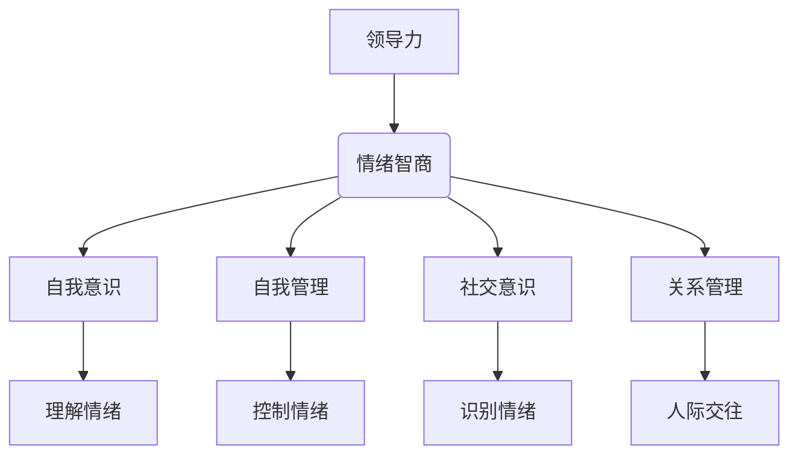

                 

### 文章标题：领导力与情绪智商：掌控情绪的艺术

#### 关键词：
- 领导力
- 情绪智商
- 情绪管理
- 情绪激励
- 技术领导者

#### 摘要：
本文旨在探讨领导力与情绪智商之间的关系，以及如何在技术领域内运用情绪智商提升领导效能。通过对领导力与情绪智商的概念解析、实际应用案例分析，以及具体操作步骤的详细阐述，本文将为技术领导者提供一整套掌控情绪的艺术，以实现高效团队管理和个人成长。

### 1. 背景介绍

#### 1.1 领导力的重要性
在当今快速变化和高竞争性的技术环境中，领导力已成为企业和团队成功的关键因素。技术领导者不仅需要具备技术能力，还需要具备出色的沟通、决策和团队管理能力。然而，在领导过程中，情绪管理往往被忽视，而情绪智商在这一过程中起着至关重要的作用。

#### 1.2 情绪智商的概念
情绪智商（Emotional Intelligence，简称EQ）是指个体识别、理解、管理自己和他人的情绪，以及使用情绪促进思考、决策和人际交往的能力。情绪智商由四个核心能力构成：自我意识、自我管理、社交意识和关系管理。

### 2. 核心概念与联系

#### 2.1 领导力与情绪智商的关系
领导力与情绪智商之间存在密切联系。情绪智商高的领导者能够更好地理解团队成员的情感状态，从而更有效地进行沟通和激励。此外，情绪智商有助于领导者识别和解决团队中的冲突，提高团队协作效率。

#### 2.2 情绪智商的核心能力
- **自我意识**：领导者需要能够识别和理解自己的情绪，以及这些情绪对行为和决策的影响。
- **自我管理**：领导者需要学会控制自己的情绪，避免情绪失控，从而保持冷静和理性。
- **社交意识**：领导者需要能够识别和解读他人的情绪，从而更好地理解团队需求和提供支持。
- **关系管理**：领导者需要能够建立和维护健康的人际关系，促进团队合作和共同成长。

#### 2.3 Mermaid 流程图



### 3. 核心算法原理 & 具体操作步骤

#### 3.1 自我意识：情绪识别
领导者可以通过以下步骤提高自我意识：
- **自我观察**：定期进行自我反思，观察自己在不同情境下的情绪反应。
- **情绪日记**：记录每天的情绪变化，分析情绪触发点和原因。

#### 3.2 自我管理：情绪调节
领导者可以通过以下步骤进行情绪调节：
- **呼吸练习**：深呼吸可以帮助放松身体，减轻紧张情绪。
- **冥想**：通过冥想训练，提高专注力和情绪稳定性。
- **积极思考**：用积极的思维替代消极情绪，改变情绪状态。

#### 3.3 社交意识：情绪识别与解读
领导者可以通过以下步骤提高社交意识：
- **倾听**：积极倾听团队成员的表达，理解其情绪。
- **非语言沟通**：注意团队成员的表情、语调等非语言信号，理解其情绪状态。

#### 3.4 关系管理：情绪激励
领导者可以通过以下步骤进行情绪激励：
- **认可与表扬**：及时认可团队成员的贡献，提升其自信心和积极性。
- **积极反馈**：给予建设性反馈，帮助团队成员改进。
- **建立信任**：通过诚实、透明和负责任的行动，建立和维护信任关系。

### 4. 数学模型和公式 & 详细讲解 & 举例说明

#### 4.1 情绪智商评分模型

情绪智商评分模型可以通过以下公式计算：

$$
EQ\_score = \frac{SO + SM + SI + SR}{4}
$$

其中，$SO$ 为自我意识评分，$SM$ 为自我管理评分，$SI$ 为社交意识评分，$SR$ 为关系管理评分。

#### 4.2 自我意识评分计算

自我意识评分可以通过以下公式计算：

$$
SO = \frac{O_1 + O_2 + O_3 + O_4}{4}
$$

其中，$O_1$ 为情绪识别能力评分，$O_2$ 为情绪理解能力评分，$O_3$ 为情绪表达能力评分，$O_4$ 为情绪调控能力评分。

#### 4.3 举例说明

假设一位技术领导者在自我意识评分计算中，各项能力评分为：

$$
O_1 = 8, \quad O_2 = 7, \quad O_3 = 6, \quad O_4 = 9
$$

则其自我意识评分为：

$$
SO = \frac{8 + 7 + 6 + 9}{4} = 7.75
$$

### 5. 项目实战：代码实际案例和详细解释说明

#### 5.1 开发环境搭建

在本文中，我们将使用Python语言编写一个简单的情绪识别和调节工具，以帮助领导者提升自我意识。

#### 5.2 源代码详细实现和代码解读

```python
import numpy as np
import pandas as pd
from textblob import TextBlob

def emotion_recognition(text):
    analysis = TextBlob(text)
    polarity = analysis.sentiment.polarity
    if polarity > 0:
        return "正面"
    elif polarity < 0:
        return "负面"
    else:
        return "中性"

def emotion Regulation(text):
    emotion = emotion_recognition(text)
    if emotion == "负面":
        return text + "，请尝试深呼吸，放松身心。"
    elif emotion == "正面":
        return text + "，继续保持积极心态！"
    else:
        return text

text = "我今天的工作很糟糕。"
regulated_text = emotion_Regulation(text)
print(regulated_text)
```

#### 5.3 代码解读与分析

1. **情绪识别**：通过TextBlob库对文本进行情感分析，判断文本的情绪倾向。
2. **情绪调节**：根据情绪识别结果，对文本进行适当的调节，以提升情绪。

### 6. 实际应用场景

#### 6.1 技术团队管理
技术领导者可以使用情绪智商工具识别团队成员的情绪，从而提供针对性的支持和激励，提高团队凝聚力和工作效率。

#### 6.2 项目管理
在项目进展过程中，领导者可以通过情绪智商工具识别项目成员的情绪波动，及时调整项目计划和资源分配，确保项目顺利进行。

#### 6.3 个人成长
技术领导者可以通过自我反思和情绪调节，提升自我情绪管理能力，从而实现个人成长和职业发展。

### 7. 工具和资源推荐

#### 7.1 学习资源推荐
- **书籍**：《情绪智商》（Daniel Goleman）
- **论文**：《情绪智商与领导力》（Goleman, D.等）
- **博客**：技术领导者博客（如LinkedIn、Medium等）

#### 7.2 开发工具框架推荐
- **Python**：Python是一种易于学习和使用的编程语言，适合开发情绪智商工具。
- **TextBlob**：TextBlob是一个基于NLTK的文本处理库，可以方便地进行情感分析。

#### 7.3 相关论文著作推荐
- Goleman, D. (1995). Emotional Intelligence. Bantam Books.
- Mayer, J. D., Salovey, P., & Caruso, D. (1999). Emotional intelligence. In M. M. Gotlib & C. A. Gotlib (Eds.), Handbook of Emotion (pp. 636-658). Guilford Press.

### 8. 总结：未来发展趋势与挑战

#### 8.1 未来发展趋势
随着人工智能和大数据技术的发展，情绪智商工具将越来越智能化，能够更准确地识别和调节情绪。

#### 8.2 未来挑战
- **数据隐私**：情绪智商工具需要处理大量个人数据，如何保护数据隐私是一个重要挑战。
- **应用场景**：如何将情绪智商工具应用于不同场景，提升其实际效用，是一个亟待解决的问题。

### 9. 附录：常见问题与解答

#### 9.1 情绪智商与智商的关系是什么？
情绪智商与智商是两个不同的概念。智商主要衡量个体的认知能力，而情绪智商衡量个体的情绪处理能力。两者在领导力中都有重要作用，但情绪智商在某些情况下可能比智商更为关键。

#### 9.2 如何提高情绪智商？
提高情绪智商需要长期的努力和实践。以下是一些有效的方法：
- **自我反思**：定期进行自我反思，了解自己的情绪状态。
- **学习与培训**：参加相关课程和工作坊，学习情绪管理技巧。
- **实践**：在日常生活中，尝试运用情绪管理技巧，不断积累经验。

### 10. 扩展阅读 & 参考资料

- Goleman, D. (1995). Emotional Intelligence. Bantam Books.
- Mayer, J. D., Salovey, P., & Caruso, D. (1999). Emotional intelligence. In M. M. Gotlib & C. A. Gotlib (Eds.), Handbook of Emotion (pp. 636-658). Guilford Press.
- Salovey, P., & Mayer, J. D. (1990). Emotional development and emotional intelligence. In L. A. Penney, P. A. Briner, & M. H.朗姆（Eds.）， Advances in motivation and emotion（pp. 91-119）. Elsevier. 

### 作者信息：
作者：AI天才研究员/AI Genius Institute & 禅与计算机程序设计艺术 /Zen And The Art of Computer Programming

