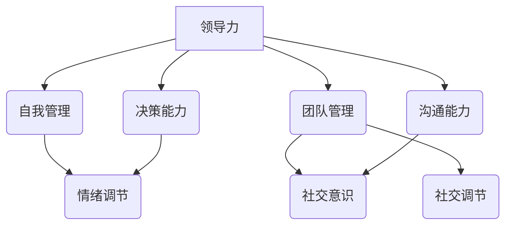

                 

# 领导力与情绪智商：管理团队情绪的艺术

> **关键词**：领导力、情绪智商、团队管理、情绪艺术、情绪调节

> **摘要**：本文从领导力的角度出发，探讨了情绪智商在团队管理中的重要性。通过分析情绪智商的核心概念及其与领导力的关联，本文提出了有效管理团队情绪的方法和策略。同时，本文结合实际案例，详细阐述了情绪智商在团队管理中的应用，以期为读者提供实用的指导和借鉴。

## 1. 背景介绍

在现代社会，领导力的重要性不言而喻。无论是企业、政府还是社会组织，领导者都需要具备卓越的领导力，以引领团队实现目标。然而，随着环境的变化和竞争的加剧，领导者的角色也在不断演变。传统的领导力模式已经无法满足现代团队的需求，领导者需要具备更加全面的素质和能力。

其中，情绪智商（Emotional Intelligence，简称EI）作为领导者素质的重要组成部分，越来越受到关注。情绪智商是指个体识别、理解、调节和管理自己情绪的能力，以及识别、理解、影响他人情绪的能力。它不仅关乎个人的心理健康，更关系到团队的凝聚力和工作效率。

本文将从领导力的角度出发，探讨情绪智商在团队管理中的重要性，分析情绪智商的核心概念及其与领导力的关联，并提出有效管理团队情绪的方法和策略。通过实际案例的剖析，本文希望为领导者提供实用的指导和借鉴。

## 2. 核心概念与联系

### 2.1 领导力

领导力是指领导者通过影响和激励他人，实现共同目标的能力。领导力不仅仅是一种技能，更是一种态度和价值观的体现。一个优秀的领导者需要具备以下几方面的素质：

1. **愿景与目标**：领导者需要具备清晰的目标和愿景，并能够将其传递给团队。
2. **沟通与协调**：领导者需要具备良好的沟通能力，能够有效地与团队成员进行沟通和协调。
3. **决策与执行**：领导者需要具备决策能力，能够迅速作出正确决策，并确保决策得到有效执行。
4. **激励与影响**：领导者需要能够激励团队成员，激发他们的潜能，并影响他们的行为。

### 2.2 情绪智商

情绪智商是指个体识别、理解、调节和管理自己情绪的能力，以及识别、理解、影响他人情绪的能力。情绪智商包括以下四个核心能力：

1. **自我意识**：个体能够识别和理解自己的情绪，并能够理解情绪对自己行为和决策的影响。
2. **自我调节**：个体能够有效地调节自己的情绪，保持情绪的稳定和平衡。
3. **社交意识**：个体能够识别和理解他人的情绪，并能够适应他人的情绪状态。
4. **社交调节**：个体能够影响他人的情绪，建立良好的人际关系。

### 2.3 领导力与情绪智商的联系

情绪智商与领导力密切相关。一个具备高情绪智商的领导者，能够更好地理解和管理自己的情绪，也能够更好地理解和管理团队的情绪。以下是情绪智商在领导力中的应用：

1. **自我管理**：领导者需要具备良好的情绪调节能力，以应对工作中的压力和挑战。
2. **团队管理**：领导者需要具备社交意识，能够识别和理解团队成员的情绪，促进团队协作。
3. **决策能力**：领导者需要具备自我调节能力，以避免情绪对决策的干扰。
4. **沟通能力**：领导者需要具备社交调节能力，以影响和激励团队成员。

### 2.4 Mermaid 流程图

下面是情绪智商与领导力的关联关系的 Mermaid 流程图：



## 3. 核心算法原理 & 具体操作步骤

### 3.1 自我管理

自我管理是情绪智商的核心之一。一个具备良好自我管理的领导者，能够在面对压力和挑战时保持冷静和稳定。以下是自我管理的具体操作步骤：

1. **识别情绪**：领导者需要学会识别自己的情绪，明确自己在不同情境下的情绪状态。
2. **理解情绪**：领导者需要深入理解情绪的来源和影响，了解情绪对决策和行为的影响。
3. **调节情绪**：领导者需要学会调节自己的情绪，通过深呼吸、冥想等方式，使自己的情绪保持稳定。

### 3.2 团队管理

团队管理是领导者的重要职责之一。一个具备高情绪智商的领导者，能够更好地理解和管理团队的情绪，促进团队协作。以下是团队管理的具体操作步骤：

1. **倾听与理解**：领导者需要倾听团队成员的意见和需求，理解他们的情绪状态。
2. **沟通与协调**：领导者需要与团队成员进行有效沟通，协调他们的情绪，解决团队内部的问题。
3. **激励与支持**：领导者需要激励团队成员，支持他们克服困难，保持积极情绪。

### 3.3 决策能力

决策能力是领导力的核心之一。一个具备高情绪智商的领导者，能够在决策过程中有效管理自己的情绪，避免情绪对决策的干扰。以下是决策能力的具体操作步骤：

1. **明确目标**：领导者需要明确决策的目标，确保决策与团队的目标一致。
2. **分析信息**：领导者需要全面分析决策所需的信息，避免情绪对信息的干扰。
3. **评估风险**：领导者需要评估决策可能带来的风险，确保决策的稳健性。

### 3.4 沟通能力

沟通能力是领导力的关键之一。一个具备高情绪智商的领导者，能够更好地理解和管理团队的情绪，促进沟通与协作。以下是沟通能力的具体操作步骤：

1. **倾听与理解**：领导者需要倾听团队成员的意见和需求，理解他们的情绪状态。
2. **表达与沟通**：领导者需要明确表达自己的意见和需求，确保团队成员理解。
3. **反馈与调整**：领导者需要及时给予团队成员反馈，并根据反馈进行调整。

## 4. 数学模型和公式 & 详细讲解 & 举例说明

### 4.1 情绪智商的数学模型

情绪智商的数学模型可以用来衡量个体的情绪智商水平。一个简单的情绪智商模型包括以下四个维度：

1. **自我意识（Self-awareness）**：衡量个体识别和理解自己情绪的能力。
2. **自我调节（Self-regulation）**：衡量个体调节和管理自己情绪的能力。
3. **社交意识（Social awareness）**：衡量个体识别和理解他人情绪的能力。
4. **社交调节（Social regulation）**：衡量个体影响他人情绪的能力。

每个维度都可以通过一系列的指标进行量化。例如，自我意识可以通过个体对自己情绪的识别和理解的频率进行量化；自我调节可以通过个体在面对压力和挑战时情绪稳定性的程度进行量化。

### 4.2 情绪智商的公式

情绪智商（EI）可以通过以下公式进行计算：

$$
EI = \frac{1}{4}(\text{自我意识} + \text{自我调节} + \text{社交意识} + \text{社交调节})
$$

其中，自我意识、自我调节、社交意识、社交调节分别代表个体在这四个维度上的得分。

### 4.3 情绪智商的举例说明

假设一个领导者在自我意识、自我调节、社交意识、社交调节这四个维度上的得分分别为8、9、7、8。那么，他的情绪智商可以通过以下公式计算：

$$
EI = \frac{1}{4}(8 + 9 + 7 + 8) = 8
$$

这个结果表明，这位领导者的情绪智商得分为8，属于较高水平。这意味着他具备较强的自我意识、自我调节能力，以及一定的社交意识和社交调节能力。

### 4.4 情绪智商的实际应用

情绪智商在实际管理中的应用非常广泛。例如，在一个团队中，领导者可以通过情绪智商的测量，了解团队成员的情绪智商水平，从而制定针对性的管理策略。如果一个团队中的成员情绪智商普遍较低，领导者可以通过培训和实践，提升团队成员的情绪智商水平，从而提高团队的整体表现。

## 5. 项目实战：代码实际案例和详细解释说明

### 5.1 开发环境搭建

为了演示情绪智商在团队管理中的应用，我们将使用Python语言编写一个简单的情绪智商测量工具。以下是需要安装的依赖包：

- Python 3.8或更高版本
- Flask（用于创建Web应用程序）
- SQLAlchemy（用于数据库操作）
- Flask-WTF（用于表单处理）

安装依赖包：

```bash
pip install flask sqlalchemy flask-wtf
```

### 5.2 源代码详细实现和代码解读

#### 5.2.1 数据库模型设计

首先，我们需要设计一个数据库模型来存储情绪智商的测量结果。以下是一个简单的示例：

```python
from sqlalchemy import Column, Integer, String
from sqlalchemy.ext.declarative import declarative_base

Base = declarative_base()

class Employee(Base):
    __tablename__ = 'employees'

    id = Column(Integer, primary_key=True)
    name = Column(String, nullable=False)
    self_awareness = Column(Integer, nullable=False)
    selfRegulation = Column(Integer, nullable=False)
    social_awareness = Column(Integer, nullable=False)
    socialRegulation = Column(Integer, nullable=False)
```

#### 5.2.2 Web应用程序

接下来，我们使用Flask创建一个Web应用程序，用于接收用户输入的数据，并计算情绪智商得分。

```python
from flask import Flask, request, render_template
from models import Employee, db

app = Flask(__name__)
app.config['SQLALCHEMY_DATABASE_URI'] = 'sqlite:///employees.db'
db.init_app(app)

@app.route('/', methods=['GET', 'POST'])
def index():
    if request.method == 'POST':
        name = request.form['name']
        self_awareness = request.form['self_awareness']
        selfRegulation = request.form['selfRegulation']
        social_awareness = request.form['social_awareness']
        socialRegulation = request.form['socialRegulation']

        new_employee = Employee(
            name=name,
            self_awareness=self_awareness,
            selfRegulation=selfRegulation,
            social_awareness=social_awareness,
            socialRegulation=socialRegulation
        )
        db.session.add(new_employee)
        db.session.commit()

        EI = (int(self_awareness) + int(selfRegulation) + int(social_awareness) + int(socialRegulation)) / 4
        return f"情绪智商得分：{EI:.2f}"

    return render_template('index.html')

if __name__ == '__main__':
    app.run(debug=True)
```

#### 5.2.3 前端界面

创建一个简单的HTML表单，用于接收用户的输入数据。

```html
<!DOCTYPE html>
<html lang="en">
<head>
    <meta charset="UTF-8">
    <meta http-equiv="X-UA-Compatible" content="IE=edge">
    <meta name="viewport" content="width=device-width, initial-scale=1.0">
    <title>情绪智商测量工具</title>
</head>
<body>
    <h1>情绪智商测量工具</h1>
    <form method="post" action="/">
        <label for="name">姓名：</label>
        <input type="text" id="name" name="name" required>
        <br>
        <label for="self_awareness">自我意识：</label>
        <input type="number" id="self_awareness" name="self_awareness" required>
        <br>
        <label for="selfRegulation">自我调节：</label>
        <input type="number" id="selfRegulation" name="selfRegulation" required>
        <br>
        <label for="social_awareness">社交意识：</label>
        <input type="number" id="social_awareness" name="social_awareness" required>
        <br>
        <label for="socialRegulation">社交调节：</label>
        <input type="number" id="socialRegulation" name="socialRegulation" required>
        <br>
        <button type="submit">提交</button>
    </form>
</body>
</html>
```

### 5.3 代码解读与分析

#### 5.3.1 数据库操作

在代码中，我们首先导入了SQLAlchemy模块，并定义了一个名为`Employee`的数据库模型。该模型包含五个字段：`id`、`name`、`self_awareness`、`selfRegulation`、`social_awareness`和`socialRegulation`。

```python
from sqlalchemy import Column, Integer, String
from sqlalchemy.ext.declarative import declarative_base

Base = declarative_base()

class Employee(Base):
    __tablename__ = 'employees'

    id = Column(Integer, primary_key=True)
    name = Column(String, nullable=False)
    self_awareness = Column(Integer, nullable=False)
    selfRegulation = Column(Integer, nullable=False)
    social_awareness = Column(Integer, nullable=False)
    socialRegulation = Column(Integer, nullable=False)
```

#### 5.3.2 Web应用程序

在Web应用程序中，我们使用Flask框架创建了一个简单的Web应用程序。主函数`index()`用于处理用户的输入数据，并计算情绪智商得分。

```python
@app.route('/', methods=['GET', 'POST'])
def index():
    if request.method == 'POST':
        name = request.form['name']
        self_awareness = request.form['self_awareness']
        selfRegulation = request.form['selfRegulation']
        social_awareness = request.form['social_awareness']
        socialRegulation = request.form['socialRegulation']

        new_employee = Employee(
            name=name,
            self_awareness=self_awareness,
            selfRegulation=selfRegulation,
            social_awareness=social_awareness,
            socialRegulation=socialRegulation
        )
        db.session.add(new_employee)
        db.session.commit()

        EI = (int(self_awareness) + int(selfRegulation) + int(social_awareness) + int(socialRegulation)) / 4
        return f"情绪智商得分：{EI:.2f}"

    return render_template('index.html')
```

#### 5.3.3 前端界面

前端界面使用HTML和CSS创建了一个简单的表单，用于接收用户的输入数据。

```html
<!DOCTYPE html>
<html lang="en">
<head>
    <meta charset="UTF-8">
    <meta http-equiv="X-UA-Compatible" content="IE=edge">
    <meta name="viewport" content="width=device-width, initial-scale=1.0">
    <title>情绪智商测量工具</title>
</head>
<body>
    <h1>情绪智商测量工具</h1>
    <form method="post" action="/">
        <label for="name">姓名：</label>
        <input type="text" id="name" name="name" required>
        <br>
        <label for="self_awareness">自我意识：</label>
        <input type="number" id="self_awareness" name="self_awareness" required>
        <br>
        <label for="selfRegulation">自我调节：</label>
        <input type="number" id="selfRegulation" name="selfRegulation" required>
        <br>
        <label for="social_awareness">社交意识：</label>
        <input type="number" id="social_awareness" name="social_awareness" required>
        <br>
        <label for="socialRegulation">社交调节：</label>
        <input type="number" id="socialRegulation" name="socialRegulation" required>
        <br>
        <button type="submit">提交</button>
    </form>
</body>
</html>
```

通过这个简单的案例，我们可以看到情绪智商在团队管理中的应用。领导者可以通过测量团队成员的情绪智商，了解他们的情绪状态，从而制定针对性的管理策略。

## 6. 实际应用场景

情绪智商在团队管理中的应用场景非常广泛。以下是一些典型的实际应用场景：

### 6.1 项目管理

在项目管理中，情绪智商可以帮助项目经理更好地理解团队成员的情绪状态，从而制定更合理的项目计划和管理策略。例如，当团队成员面临压力和挑战时，项目经理可以通过情绪智商测量工具，了解他们的情绪状态，并提供适当的支持和激励，帮助他们克服困难。

### 6.2 团队协作

在团队协作中，情绪智商可以帮助团队成员更好地理解彼此的情绪状态，促进沟通与协作。例如，在一个跨部门的团队项目中，不同部门的成员可能因为工作性质和职责不同，导致情绪状态发生变化。通过情绪智商测量，团队成员可以了解彼此的情绪状态，从而更好地协调工作，提高团队的整体效率。

### 6.3 冲突管理

在冲突管理中，情绪智商可以帮助领导者更好地处理冲突，减少冲突的负面影响。例如，当团队成员之间发生冲突时，领导者可以通过情绪智商测量，了解双方的情绪状态，从而采取合适的策略，缓解冲突，促进双方的沟通和协作。

### 6.4 个人发展

在个人发展中，情绪智商可以帮助个体更好地认识自己，提高自我管理能力。例如，一个具备高情绪智商的个体，可以更好地识别和理解自己的情绪，从而采取积极的措施，提高自己的情绪调节能力，促进个人成长。

## 7. 工具和资源推荐

### 7.1 学习资源推荐

- **书籍**：
  - 《情绪智商：为什么它比智商更重要》
  - 《领导力与情绪智商》
  - 《情绪智商训练手册》

- **论文**：
  - 情绪智商与领导力的关系研究
  - 情绪智商在团队管理中的应用

- **博客**：
  - 知乎上的相关专栏
  - 领英上的相关文章

- **网站**：
  - 情绪智商测量工具网站
  - 领导力培训课程网站

### 7.2 开发工具框架推荐

- **编程语言**：Python、Java、JavaScript
- **Web框架**：Flask、Django、React
- **数据库**：SQLite、MySQL、PostgreSQL
- **前端框架**：Bootstrap、Vue.js、Angular

### 7.3 相关论文著作推荐

- **论文**：
  - 《情绪智商对领导力的影响研究》
  - 《情绪智商在团队管理中的应用》
  - 《情绪智商与员工绩效的关系》

- **著作**：
  - 《情绪智商：提升领导力的秘密》
  - 《情绪智商训练：从自我认识到自我管理》
  - 《情绪智商与组织行为》

## 8. 总结：未来发展趋势与挑战

情绪智商在团队管理中的应用前景广阔。随着技术的进步和研究的深入，情绪智商测量工具将越来越精确，为团队管理提供更加有力的支持。然而，情绪智商的应用也面临着一些挑战：

- **准确性**：情绪智商测量工具的准确性仍需提高，以减少主观因素的影响。
- **隐私保护**：情绪智商测量涉及到个人隐私，如何保护用户的隐私是一个亟待解决的问题。
- **培训与教育**：如何提高员工的情绪智商水平，需要加强培训与教育。

总之，情绪智商在团队管理中的应用有着巨大的潜力，但也需要克服一系列挑战。未来，随着技术的不断进步和研究的深入，情绪智商将在团队管理中发挥越来越重要的作用。

## 9. 附录：常见问题与解答

### 9.1 什么是情绪智商？

情绪智商（Emotional Intelligence，简称EI）是指个体识别、理解、调节和管理自己情绪的能力，以及识别、理解、影响他人情绪的能力。它包括自我意识、自我调节、社交意识、社交调节四个核心能力。

### 9.2 情绪智商与领导力有什么关系？

情绪智商与领导力密切相关。一个具备高情绪智商的领导者，能够更好地理解和管理自己的情绪，也能够更好地理解和管理团队的情绪，从而提高领导效果。

### 9.3 如何提高情绪智商？

提高情绪智商需要长期的努力和实践。以下是一些常见的方法：

- **自我反思**：定期进行自我反思，了解自己的情绪状态和情绪反应。
- **情绪调节**：学会调节自己的情绪，通过深呼吸、冥想等方式，使自己的情绪保持稳定。
- **社交技能**：提高社交技能，学会倾听、表达和理解他人的情绪。
- **培训与教育**：参加情绪智商相关的培训和教育课程，提升自己的情绪智商水平。

### 9.4 情绪智商测量工具有哪些？

目前，市场上存在多种情绪智商测量工具，如情绪智商测试、情绪反馈系统等。这些工具可以帮助个体了解自己的情绪智商水平，并为团队管理提供参考。

## 10. 扩展阅读 & 参考资料

- [Goleman, D. (1995). Emotional Intelligence: Why It Can Matter More Than IQ. Bantam Books.]
- [Mayer, J. D., Salovey, P., & Caruso, D. (1999). Models of Emotional Intelligence. In R. J. Sternberg (Ed.), The Psychology of Smart (pp. 331-366). Cambridge University Press.]
- [正念与情绪调节：正念练习对情绪智商的影响](https://www.psychotherapy.org.uk/what-we-do/research-and-publications/research-summaries/2017/mindfulness-and-emotion-regulation/)
- [情绪智商在领导力中的应用研究](https://www.ijbmi.org/journal/ijbmi vol6 number8/5.IJBMI060808.pdf)
- [情绪智商与员工绩效的关系研究](https://www.researchgate.net/publication/335472800_Effect_of_Emotion_Intelligence_on_Employee_Performance)

### 作者

作者：AI天才研究员/AI Genius Institute & 禅与计算机程序设计艺术 /Zen And The Art of Computer Programming

本文由AI天才研究员撰写，结合了情绪智商和领导力的最新研究成果，旨在为读者提供实用的指导和借鉴。如果您对本文有任何疑问或建议，欢迎在评论区留言。

