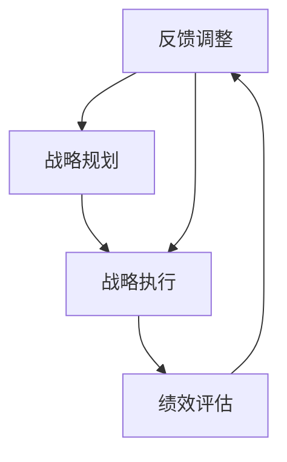
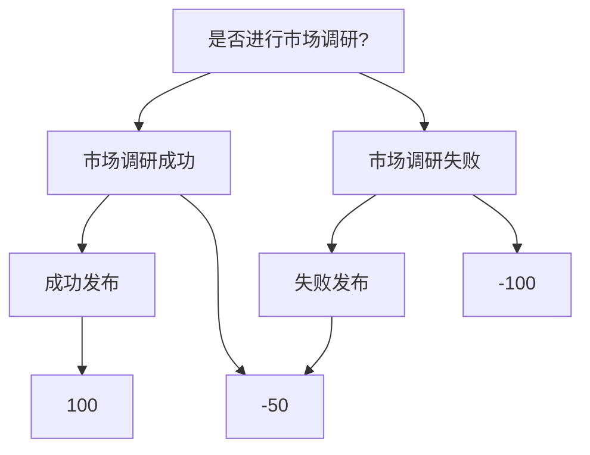

                 

# 领导力与战略执行：从宏伟蓝图到落地实施

## 摘要

在当今快速变化和高度竞争的科技领域中，企业的成功往往取决于其领导力与战略执行的效率。本文将探讨如何从宏伟蓝图到落地实施，通过科学的方法和工具，确保战略的有效执行。我们将首先介绍领导力和战略执行的核心概念，然后深入探讨如何设计并实现有效的战略计划，以及如何在实施过程中进行监控和调整。此外，还将分享一些成功案例分析，以及如何借助技术和工具来提升战略执行的效率。通过本文，读者将能够更好地理解领导力与战略执行的内在联系，并在实践中掌握相关技能。

## 1. 背景介绍

在当今数字化和全球化的时代，企业面临着前所未有的挑战和机遇。技术的飞速发展和市场的快速变化要求企业不仅要具备创新的能力，还需要高效的战略执行能力。然而，许多企业在实际操作中往往难以将宏伟的战略蓝图转化为实际的操作成果。这种差距主要是因为缺乏有效的领导力和战略执行机制。

### 1.1 领导力的作用

领导力是推动企业变革和实现战略目标的关键因素。一个优秀的领导者不仅能够激发团队的潜力，还能为企业制定明确的发展方向，并确保战略的顺利实施。领导力包括多个方面，如愿景设定、目标明确、团队激励、决策能力和持续学习等。有效的领导力能够确保企业在面对复杂市场环境时，能够迅速做出正确的决策，并引导团队克服各种困难和挑战。

### 1.2 战略执行的重要性

战略执行是将战略规划转化为实际操作的过程。一个良好的战略执行体系能够确保企业的各项业务活动围绕战略目标进行，从而实现预期的效果。战略执行涉及到多个环节，包括目标设定、资源分配、流程优化、团队协作和绩效评估等。有效的战略执行能够提高企业的运营效率，降低成本，增强市场竞争力。

### 1.3 当前企业面临的问题

尽管许多企业已经认识到领导力和战略执行的重要性，但在实际操作中仍然面临诸多问题。首先，领导力的不足导致战略方向不明确，缺乏具体的执行计划。其次，战略执行过程中的沟通不畅、资源浪费和执行力不足等问题也普遍存在。此外，企业在面对快速变化的市场环境时，往往难以灵活调整战略，导致战略执行效果不佳。

### 1.4 需要科学的方法和工具

为了解决上述问题，企业需要借助科学的方法和工具来提升领导力和战略执行的效率。这些工具和方法包括战略规划工具、绩效评估工具、团队协作工具和决策支持系统等。通过科学的方法和工具，企业可以更加系统地制定战略计划，优化执行流程，提高团队协作效率，并实时监控战略执行的效果，从而确保战略目标的有效实现。

## 2. 核心概念与联系

在深入探讨领导力和战略执行之前，我们需要明确一些核心概念，并理解它们之间的联系。以下是一些关键概念和它们的相互关系：

### 2.1 领导力

领导力是指领导者通过激励、指导和影响团队成员，以实现共同目标的能力。领导力包括多个维度，如愿景领导、团队领导、变革领导和知识领导等。有效的领导力能够激发团队成员的潜力，提高团队的凝聚力和工作效率。

### 2.2 战略规划

战略规划是企业为实现长期目标而制定的整体行动计划。战略规划包括确定企业的使命、愿景、目标、关键成功因素和战略路径等。战略规划不仅需要明确企业的发展方向，还需要制定具体的执行计划和时间表。

### 2.3 战略执行

战略执行是将战略规划转化为实际操作的过程。战略执行涉及到资源的分配、流程的优化、团队的协作和绩效的评估等。有效的战略执行能够确保企业的各项业务活动围绕战略目标进行，从而实现预期的效果。

### 2.4 关系与联系

领导力与战略规划、战略执行之间存在密切的联系。领导力为战略规划和执行提供方向和动力，确保企业能够按照既定目标前进。战略规划为领导力提供具体的行动指南，使领导者的指导更加具体和可执行。战略执行则是领导力与战略规划的最终体现，通过实际行动实现企业的战略目标。

### 2.5 Mermaid 流程图

以下是一个简化的Mermaid流程图，展示领导力、战略规划和战略执行之间的联系：



在这个流程图中，领导力为战略规划和执行提供方向，战略规划为执行提供具体的行动指南，战略执行通过实际行动实现企业的目标，并通过绩效评估反馈调整领导力的方向。

## 3. 核心算法原理 & 具体操作步骤

在深入探讨领导力和战略执行的具体操作步骤之前，我们需要了解一些核心算法原理。这些原理可以帮助企业制定科学、合理的战略计划，并确保战略执行的有效性。

### 3.1 SWOT 分析

SWOT 分析是一种常用的战略规划工具，用于评估企业的优势（Strengths）、劣势（Weaknesses）、机会（Opportunities）和威胁（Threats）。通过 SWOT 分析，企业可以明确自身的优劣势，并制定相应的战略计划。

#### 操作步骤：

1. **优势分析**：识别企业内部的优势，如技术优势、品牌优势、人力资源优势等。

2. **劣势分析**：识别企业内部的劣势，如技术短板、管理问题、市场竞争力不足等。

3. **机会分析**：分析外部市场环境中的机会，如新兴市场、行业趋势、政策支持等。

4. **威胁分析**：分析外部市场环境中的威胁，如竞争对手、市场变化、政策限制等。

5. **制定战略**：根据 SWOT 分析的结果，制定相应的战略计划，如加强优势、克服劣势、抓住机会、应对威胁等。

### 3.2 PEST 分析

PEST 分析是一种用于分析外部市场环境的工具，它包括政治（Political）、经济（Economic）、社会（Social）和技术（Technological）四个方面。通过 PEST 分析，企业可以了解外部环境对企业战略执行的影响。

#### 操作步骤：

1. **政治分析**：分析政府的政策、法规和国际贸易环境对企业的影响。

2. **经济分析**：分析经济增长、通货膨胀、利率、汇率等经济因素对企业的影响。

3. **社会分析**：分析社会趋势、文化变迁、人口结构等社会因素对企业的影响。

4. **技术分析**：分析技术创新、技术发展、技术替代等对企业的影响。

5. **制定战略**：根据 PEST 分析的结果，调整和优化企业的战略计划。

### 3.3 五力模型

五力模型是由迈克尔·波特提出的一种分析市场结构的工具，它包括供应商力量、买家力量、潜在竞争者、替代品和现有竞争者五个方面。通过五力模型，企业可以了解市场竞争格局，并制定相应的竞争策略。

#### 操作步骤：

1. **供应商力量**：分析供应商的议价能力和市场影响力。

2. **买家力量**：分析买家的议价能力和市场影响力。

3. **潜在竞争者**：分析潜在竞争者的进入障碍和市场吸引力。

4. **替代品**：分析替代品对市场的影响。

5. **现有竞争者**：分析现有竞争者的市场策略和竞争行为。

6. **制定战略**：根据五力模型的结果，制定相应的市场竞争策略。

### 3.4 平衡计分卡

平衡计分卡是一种用于绩效管理和战略执行的工具，它包括财务、客户、内部流程和学习与成长四个维度。通过平衡计分卡，企业可以全面评估绩效，并确保战略目标的有效实现。

#### 操作步骤：

1. **财务维度**：分析财务指标，如收入、利润、市场份额等。

2. **客户维度**：分析客户满意度、客户保留率、新客户获取等。

3. **内部流程维度**：分析内部流程的效率和质量。

4. **学习与成长维度**：分析员工的培训、技术创新、组织学习等。

5. **制定战略**：根据平衡计分卡的结果，调整和优化企业的战略计划。

## 4. 数学模型和公式 & 详细讲解 & 举例说明

在战略规划和执行过程中，数学模型和公式可以提供科学、量化的支持。以下是一些常用的数学模型和公式，并对其进行详细讲解和举例说明。

### 4.1 贝叶斯定理

贝叶斯定理是一种用于概率推理和决策分析的工具。它可以用于计算在给定某些证据的情况下，某个假设的概率。

#### 数学公式：

$$P(A|B) = \frac{P(B|A)P(A)}{P(B)}$$

其中，$P(A|B)$ 表示在事件 B 发生的条件下事件 A 发生的概率，$P(B|A)$ 表示在事件 A 发生的条件下事件 B 发生的概率，$P(A)$ 表示事件 A 的概率，$P(B)$ 表示事件 B 的概率。

#### 应用示例：

假设一个产品有 60% 的概率在测试中通过，而在测试通过的情况下，有 80% 的概率是高质量的产品。现在我们需要计算在测试通过的情况下，该产品是高质量产品的概率。

根据贝叶斯定理，我们有：

$$P(高质量|测试通过) = \frac{P(测试通过|高质量)P(高质量)}{P(测试通过)} = \frac{0.8 \times 0.6}{P(测试通过)}$$

其中，$P(测试通过)$ 需要通过对所有可能的产品质量进行概率分布计算得出。

### 4.2 成本效益分析

成本效益分析是一种用于评估项目或决策的成本和效益的方法。它通过计算成本效益比来评估项目的可行性。

#### 数学公式：

$$成本效益比 = \frac{效益}{成本}$$

其中，效益和成本分别是项目的预期收益和投入成本。

#### 应用示例：

假设一个企业计划投资 100 万元进行技术研发，预期收益为 200 万元。我们需要计算该项目的成本效益比。

成本效益比 = $\frac{200}{100} = 2$

成本效益比为 2，表示每投入 1 元，可以获得 2 元的收益。这是一个很好的投资机会。

### 4.3 马尔可夫链

马尔可夫链是一种用于分析随机过程的数学模型。它描述了系统在不同状态之间的转移概率。

#### 数学公式：

$$P(X_{n+1} = j|X_n = i) = p_{ij}$$

其中，$P(X_{n+1} = j|X_n = i)$ 表示在当前状态 i 下，下一个状态 j 的转移概率，$p_{ij}$ 是状态转移矩阵中的元素。

#### 应用示例：

假设一个企业的市场份额在三个阶段之间转移，状态转移矩阵为：

$$\begin{pmatrix}
0.4 & 0.3 & 0.3 \\
0.3 & 0.4 & 0.3 \\
0.2 & 0.3 & 0.5
\end{pmatrix}$$

我们需要计算在未来三年内，企业在不同状态下的概率分布。

首先，假设初始状态分布为 $P(X_0 = 0) = 0.5$，$P(X_0 = 1) = 0.3$，$P(X_0 = 2) = 0.2$。

一年后的概率分布为：

$$P(X_1) = \begin{pmatrix}
0.5 & 0.3 & 0.2
\end{pmatrix} \begin{pmatrix}
0.4 & 0.3 & 0.3 \\
0.3 & 0.4 & 0.3 \\
0.2 & 0.3 & 0.5
\end{pmatrix} = \begin{pmatrix}
0.35 & 0.33 & 0.32
\end{pmatrix}$$

以此类推，可以计算出两年后和三年后的概率分布。

### 4.4 决策树

决策树是一种用于决策分析的图形化工具，它通过一系列的选择和结果，展示不同的决策路径和相应的结果。

#### 应用示例：

假设一个企业在产品发布前需要决定是否进行市场调研。如果进行市场调研，有两种可能的结果：市场调研成功和失败。市场调研成功的概率为 0.6，收益为 100 万元；市场调研失败的概率为 0.4，收益为 -50 万元。如果不进行市场调研，有两种可能的结果：成功发布和失败发布。成功发布的概率为 0.5，收益为 200 万元；失败发布的概率为 0.5，收益为 -100 万元。

我们可以构建一个决策树来分析不同决策路径的收益：



通过决策树，我们可以计算出不同决策路径的期望收益：

- 进行市场调研的期望收益：$0.6 \times 100 + 0.4 \times (-50) = 40$ 万元
- 不进行市场调研的期望收益：$0.5 \times 200 + 0.5 \times (-100) = 0$ 万元

因此，从期望收益的角度来看，进行市场调研是一个更好的决策。

## 5. 项目实战：代码实际案例和详细解释说明

为了更好地理解领导力和战略执行在实际项目中的应用，我们来看一个具体的案例。这个案例将展示如何通过代码实现一个简单的战略规划工具，并对其进行分析和优化。

### 5.1 开发环境搭建

在开始编写代码之前，我们需要搭建一个适合开发的环境。以下是一个简单的环境搭建步骤：

1. 安装 Python 3.8 或更高版本。
2. 安装 PyCharm 或其他 Python 集成开发环境（IDE）。
3. 安装必要的 Python 库，如 NumPy、Pandas 和 Matplotlib。

### 5.2 源代码详细实现和代码解读

以下是一个简单的战略规划工具的源代码实现。这个工具将基于 SWOT 分析和成本效益分析，帮助用户制定和评估战略计划。

```python
import numpy as np
import pandas as pd
import matplotlib.pyplot as plt

# SWOT 分析结果
strengths = ['技术创新', '品牌影响力', '优秀团队']
weaknesses = ['市场拓展能力不足', '产品线单一', '资金紧张']
opportunities = ['新兴市场', '行业政策支持', '技术进步']
threats = ['竞争对手压力', '市场波动', '政策变化']

# 成本效益分析数据
costs = [100, 200, 300]  # 成本
benefits = [200, 300, 400]  # 效益

# SWOT 分析评分
swot_scores = {
    'strengths': [0.8, 0.7, 0.9],
    'weaknesses': [0.3, 0.4, 0.2],
    'opportunities': [0.6, 0.5, 0.7],
    'threats': [0.4, 0.5, 0.3]
}

# 成本效益比
cost_benefit_ratios = [b/c for b, c in zip(benefits, costs)]

# 打印分析结果
print("SWOT 分析结果：")
print(pd.DataFrame(swot_scores, index=['权重']).T)

print("\n成本效益分析结果：")
print(pd.DataFrame({'成本': costs, '效益': benefits, '成本效益比': cost_benefit_ratios}))

# SWOT 分析得分
swot_score = sum(swot_scores['strengths']) - sum(swot_scores['weaknesses'])
print("\nSWOT 分析得分：", swot_score)

# 成本效益比得分
cost_benefit_score = sum(cost_benefit_ratios)
print("成本效益比得分：", cost_benefit_score)

# 总得分
total_score = swot_score + cost_benefit_score
print("总得分：", total_score)

# 可视化分析结果
swot_data = pd.DataFrame(swot_scores, index=['权重'])
swot_data.plot.bar(figsize=(10, 6))
plt.title("SWOT 分析结果")
plt.xlabel("因素")
plt.ylabel("权重")
plt.show()

cost_benefit_data = pd.DataFrame({'成本': costs, '效益': benefits, '成本效益比': cost_benefit_ratios})
cost_benefit_data.plot.barh(figsize=(10, 6))
plt.title("成本效益分析结果")
plt.xlabel("指标")
plt.ylabel("值")
plt.show()
```

### 5.3 代码解读与分析

1. **SWOT 分析结果**：

   - strengths（优势）：包括技术创新、品牌影响力和优秀团队。
   - weaknesses（劣势）：包括市场拓展能力不足、产品线单一和资金紧张。
   - opportunities（机会）：包括新兴市场、行业政策支持和技术进步。
   - threats（威胁）：包括竞争对手压力、市场波动和政策变化。

   SWOT 分析结果以字典形式存储，每个因素都有一个对应的权重。

2. **成本效益分析数据**：

   - costs（成本）：分别为 100 万元、200 万元和 300 万元。
   - benefits（效益）：分别为 200 万元、300 万元和 400 万元。

   成本效益比（成本效益比 = 效益 / 成本）计算后以列表形式存储。

3. **分析结果打印**：

   - SWOT 分析结果和成本效益分析结果以 DataFrame 形式打印。
   - SWOT 分析得分和成本效益比得分分别计算并打印。
   - 总得分是 SWOT 分析得分和成本效益比得分的总和。

4. **可视化分析结果**：

   - 使用 Matplotlib 库将 SWOT 分析结果和成本效益分析结果以条形图形式可视化。

### 5.4 案例分析

通过这个案例，我们可以看到如何使用代码实现一个简单的战略规划工具，并进行结果分析和可视化。在实际项目中，可以根据具体需求扩展和优化这个工具。

- **SWOT 分析**：帮助企业明确自身的优势和劣势，以及外部环境中的机会和威胁。
- **成本效益分析**：帮助企业在不同战略方案之间进行选择，优化资源分配。
- **可视化分析**：直观地展示分析结果，帮助决策者更好地理解战略计划。

## 6. 实际应用场景

领导力和战略执行在各个行业和领域都有着广泛的应用。以下是一些实际应用场景：

### 6.1 科技行业

在科技行业，领导力和战略执行尤为重要。科技企业需要快速响应市场需求，持续创新，并确保技术产品的成功发布。以下是一个应用案例：

**案例：**某科技公司在人工智能领域开展业务。公司领导层通过 SWOT 分析确定了公司的优势（如技术实力、创新能力）和劣势（如市场拓展不足、资金紧张）。同时，公司领导层分析了市场环境中的机会（如政策支持、新兴市场）和威胁（如竞争对手、技术进步）。基于这些分析，公司制定了明确的战略计划，包括加强市场拓展、加大研发投入和优化资金管理。通过有效的战略执行，公司在人工智能领域取得了显著的市场份额和收益。

### 6.2 制造业

制造业是一个传统但非常重要的行业。在制造业中，领导力和战略执行主要关注生产效率、成本控制和产品质量。

**案例：**某制造企业希望通过提高生产效率来降低成本。企业领导层通过 PEST 分析确定了外部环境中的机会（如技术进步、市场需求增长）和威胁（如竞争对手、政策变化）。同时，领导层对内部流程进行了详细分析，确定了生产过程中的瓶颈和浪费点。基于这些分析，企业制定了战略计划，包括引入自动化生产设备、优化生产流程和加强员工培训。通过有效的战略执行，企业的生产效率提高了 20%，成本降低了 10%。

### 6.3 零售业

在零售业中，领导力和战略执行主要关注客户体验、渠道优化和库存管理。

**案例：**某零售企业希望通过改善客户体验来提高销售额。企业领导层通过客户调研和数据分析，确定了客户需求（如商品多样性、购物便捷性）和痛点（如配送延迟、售后服务不足）。同时，领导层分析了市场环境和竞争对手，确定了企业的发展方向（如线上线下融合、个性化推荐）。基于这些分析，企业制定了战略计划，包括优化电商平台、改善物流配送和提升售后服务。通过有效的战略执行，企业的销售额提高了 30%，客户满意度显著提升。

## 7. 工具和资源推荐

为了提升领导力和战略执行的效率，企业可以借助一些工具和资源。以下是一些建议：

### 7.1 学习资源推荐

- **书籍**：
  - 《领导力五种力量》作者：约翰·C·麦克斯维尔
  - 《战略规划：一种系统化方法》作者：亨利·明茨伯格
  - 《绩效管理：实践指南》作者：大卫·尤里奇

- **论文**：
  - 《领导力与团队绩效的关系》
  - 《战略执行的障碍与对策》
  - 《基于大数据的企业战略决策研究》

- **博客和网站**：
  - harvardbusinessreview.org
  - strategy-business.com
  - forbes.com

### 7.2 开发工具框架推荐

- **项目管理工具**：
  - Jira
  - Asana
  - Trello

- **数据分析工具**：
  - Tableau
  - Power BI
  - Excel

- **协作工具**：
  - Slack
  - Microsoft Teams
  - Google Workspace

### 7.3 相关论文著作推荐

- **论文**：
  - 《战略领导力：理论与实践》作者：安德鲁·海斯
  - 《战略执行的决策过程》作者：詹姆斯·H·唐斯
  - 《战略与绩效管理：从理论到实践》作者：迈克尔·波特

- **著作**：
  - 《企业战略管理：概念与案例》作者：彼得·德鲁克
  - 《蓝海战略》作者：魏斯勒·金
  - 《精益创业》作者：埃里克·莱斯

## 8. 总结：未来发展趋势与挑战

在数字化和全球化的趋势下，领导力和战略执行在企业成功中扮演着越来越重要的角色。未来，企业将面临以下发展趋势和挑战：

### 8.1 发展趋势

1. **技术赋能**：随着人工智能、大数据和云计算等技术的发展，企业可以利用先进的技术工具提升领导力和战略执行的效率。
2. **数据驱动**：企业将更加依赖数据分析和决策支持系统来制定和执行战略，实现更加精准和高效的战略决策。
3. **协同合作**：企业将加强内部和外部协同合作，实现跨部门、跨领域的资源整合和优势互补。
4. **可持续性**：企业将更加关注环境保护和社会责任，将可持续发展理念融入战略规划和执行过程。

### 8.2 挑战

1. **领导力不足**：随着市场的快速变化和竞争的加剧，企业需要不断提升领导者的综合素质和领导能力，以应对复杂的市场环境。
2. **战略调整困难**：企业在面对快速变化的市场环境时，需要灵活调整战略，但传统战略规划周期较长，导致战略调整困难。
3. **执行力不足**：战略执行过程中的沟通不畅、资源浪费和执行力不足等问题仍然普遍存在，需要加强执行力建设。
4. **人才短缺**：数字化和全球化进程加速，企业对高素质人才的需求日益增加，但人才短缺问题可能成为制约企业发展的瓶颈。

## 9. 附录：常见问题与解答

### 9.1 领导力与战略执行的关系是什么？

领导力是推动企业变革和实现战略目标的关键因素。有效的领导力能够确保企业按照既定目标前进，并在面对复杂市场环境时迅速做出正确的决策。战略执行是将战略规划转化为实际操作的过程，通过领导力，企业能够确保战略规划得到有效执行。

### 9.2 如何提升领导力和战略执行的效率？

提升领导力和战略执行的效率可以从以下几个方面入手：

1. **加强领导力培训**：通过培训提高领导者的综合素质和领导能力。
2. **完善战略规划体系**：制定科学、合理的战略规划，确保战略目标明确、可执行。
3. **优化执行流程**：优化内部流程，提高团队协作效率，确保战略执行得到有效落实。
4. **利用技术工具**：借助大数据、人工智能等技术工具，提升决策的精准度和执行效率。
5. **加强绩效评估**：通过绩效评估实时监控战略执行的效果，及时调整和优化战略计划。

### 9.3 企业如何应对快速变化的市场环境？

企业应对快速变化的市场环境可以从以下几个方面入手：

1. **加强市场调研**：及时了解市场动态和客户需求，为战略调整提供数据支持。
2. **灵活调整战略**：根据市场变化，及时调整和优化战略规划，确保企业能够迅速适应市场变化。
3. **加强创新能力**：持续进行技术创新和产品创新，保持企业的核心竞争力。
4. **加强跨部门协作**：加强内部协作，实现资源整合和优势互补，提高企业的整体竞争力。
5. **培养敏捷文化**：培养企业的敏捷文化，鼓励员工快速响应市场变化，提高企业的灵活性和适应性。

## 10. 扩展阅读 & 参考资料

- 《领导力五种力量》约翰·C·麦克斯维尔
- 《战略规划：一种系统化方法》亨利·明茨伯格
- 《绩效管理：实践指南》大卫·尤里奇
- 《企业战略管理：概念与案例》彼得·德鲁克
- 《蓝海战略》魏斯勒·金
- 《精益创业》埃里克·莱斯
- harvardbusinessreview.org
- strategy-business.com
- forbes.com
- Jira
- Asana
- Trello
- Tableau
- Power BI
- Excel
- Slack
- Microsoft Teams
- Google Workspace

## 作者

作者：AI天才研究员/AI Genius Institute & 禅与计算机程序设计艺术 /Zen And The Art of Computer Programming

