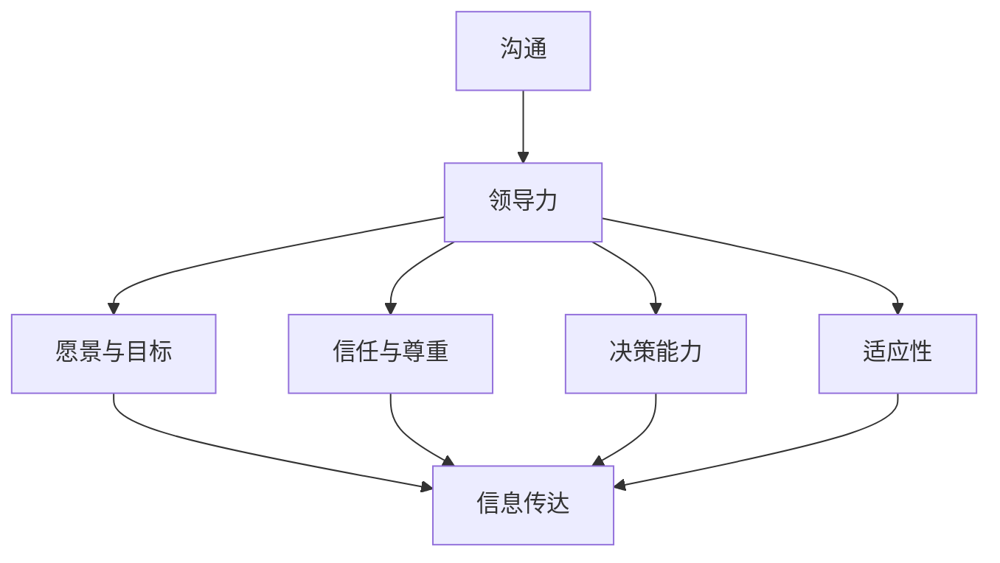

                 

### 文章标题：领导力与沟通：有效传达期望的技巧

#### 关键词：(有效沟通，领导力，期望传达，团队协作，技术团队管理，项目管理)

#### 摘要：
本文深入探讨了在技术团队管理和项目管理中，如何通过有效沟通和领导力来传达期望。通过分析沟通的基本原理和领导力的核心要素，本文提出了一系列实用的技巧和方法，旨在帮助技术领导者和管理者在团队中建立高效的工作氛围和协作机制。文章结构清晰，从概念引入、理论阐述、实际案例分析到工具推荐，逐步引导读者掌握提升沟通效率和领导力的关键技巧，为技术团队的成长和发展提供有力支持。

---

#### 1. 背景介绍

在技术团队管理和项目管理中，有效沟通和领导力是确保团队成功的关键因素。技术团队通常由多学科背景的专业人才组成，他们在项目开发、产品迭代、问题解决等方面扮演着至关重要的角色。然而，团队协作并不总是一帆风顺。在项目中，团队成员可能会面临沟通不畅、目标不明确、期望差异等问题，这些问题往往会影响项目的进度和质量。

领导力在这个背景下显得尤为重要。作为技术团队的领导者，他们不仅需要具备技术方面的专业知识，还需要掌握有效沟通和团队管理的技巧。只有这样，才能在复杂多变的项目环境中，引导团队朝着共同的目标前进，克服各种挑战。

本文将围绕以下几个核心问题展开讨论：

1. 什么是有效的沟通？
2. 领导力在传达期望中扮演什么角色？
3. 如何通过具体方法来提升沟通效率和领导力？
4. 实际应用中，有哪些成功的案例可以借鉴？

通过深入探讨这些问题，本文旨在为技术领导者和管理者提供一套实用的指导方针，帮助他们更好地传达期望，提升团队协作效率，最终实现项目的成功。

---

#### 2. 核心概念与联系

##### 2.1 沟通的基本原理

沟通是人与人之间交流信息、思想和情感的过程。它不仅包括语言表达，还涵盖了非语言行为、肢体语言、面部表情等多种形式。有效的沟通需要遵循以下几个基本原理：

1. **明确性**：信息的传递应该清晰、明确，避免歧义。
2. **倾听**：倾听是沟通的重要部分，它有助于理解对方的观点和需求。
3. **反馈**：通过反馈，可以确认信息是否被正确理解，并及时调整沟通策略。
4. **一致性**：言行一致，确保沟通的连贯性和可信度。

##### 2.2 领导力的核心要素

领导力是一种能力，它能够激发和引导团队成员实现共同目标。以下是领导力的几个核心要素：

1. **愿景与目标**：领导者需要明确团队的目标和愿景，并能够激励团队成员为之努力。
2. **信任与尊重**：建立信任和尊重的基础，是团队协作和领导力的关键。
3. **沟通能力**：优秀的沟通能力能够确保信息有效传达，减少误解和冲突。
4. **决策能力**：领导者需要在关键时刻做出明智的决策，引领团队前进。
5. **适应性**：面对变化和挑战，领导者需要具备灵活的应对能力，以适应不同的环境和需求。

##### 2.3 沟通与领导力的联系

沟通和领导力是相辅相成的。有效的沟通是领导力的重要组成部分，它能够帮助领导者传达期望、指导团队成员，并建立良好的团队氛围。同时，领导力又为沟通提供了方向和支持，确保沟通的效率和质量。以下是一个简化的 Mermaid 流程图，展示了沟通与领导力的联系：



在上述流程图中，沟通作为信息传达的桥梁，连接了领导力的各个方面。通过有效的沟通，领导者能够确保团队的每个成员都理解并朝着共同的目标努力。

---

#### 3. 核心算法原理 & 具体操作步骤

##### 3.1 沟通模型

在技术团队管理和项目管理中，一个核心的沟通模型是“沟通循环模型”（Communication Cycle Model）。该模型描述了沟通的四个基本步骤：

1. **信息发出**：领导者发出信息，明确期望和目标。
2. **信息传递**：通过适当渠道将信息传递给团队成员。
3. **信息接收**：团队成员接收并理解信息。
4. **反馈**：团队成员对信息的理解和反馈，确保信息传达准确无误。

##### 3.2 操作步骤

1. **明确信息内容**：
   - 确定沟通的目的和内容。
   - 准备详细的计划和策略。

2. **选择适当的沟通渠道**：
   - 根据团队成员的特点和项目需求，选择合适的沟通渠道，如面对面会议、邮件、即时通讯工具等。

3. **发出信息**：
   - 使用明确、简洁的语言表达信息。
   - 尽可能使用具体的例子和数据来支持观点。

4. **传递信息**：
   - 通过选定的渠道将信息传递给团队成员。
   - 确保信息能够被所有人接收和理解。

5. **接收与反馈**：
   - 给团队成员提供机会表达他们对信息的理解和反馈。
   - 及时回答团队成员的问题和关注点。

6. **调整与优化**：
   - 根据反馈调整沟通策略，优化信息传达过程。

##### 3.3 案例说明

假设一个项目经理需要传达一个关键的项目目标，以下是一个具体的操作步骤：

1. **明确信息内容**：
   - 项目目标是在接下来的三个月内完成产品的A/B测试，以提高用户体验。

2. **选择适当的沟通渠道**：
   - 召开一次全体团队成员的面对面会议，以确保信息传递的准确性和及时性。

3. **发出信息**：
   - 项目经理在会议开始时明确表示：“我们的目标是在接下来的三个月内完成产品的A/B测试，这是提升用户体验的关键步骤。”

4. **传递信息**：
   - 通过会议的形式，确保每个团队成员都能够听到这个信息。

5. **接收与反馈**：
   - 在会议中，项目经理鼓励团队成员提问和分享他们对这个目标的看法。

6. **调整与优化**：
   - 根据团队成员的反馈，项目经理进一步解释了A/B测试的重要性，并制定了具体的行动计划。

通过上述步骤，项目经理确保了信息能够被团队成员正确理解，并激励他们为实现共同目标而努力。

---

#### 4. 数学模型和公式 & 详细讲解 & 举例说明

在领导力与沟通的领域，虽然核心是人际互动，但数学模型和公式可以帮助我们量化一些关键因素，从而提供更为科学的指导。以下是一个简化的数学模型，用于评估沟通的有效性。

##### 4.1 沟通有效性模型

\[ E = f(P, C, R, S) \]

其中：
- \( E \) 表示沟通的有效性（Effectiveness）。
- \( P \) 表示参与度（Participation），即团队成员参与沟通的程度。
- \( C \) 表示清晰度（Clarity），即信息传达的清晰度。
- \( R \) 表示反馈率（Rate of Feedback），即团队成员提供反馈的频率。
- \( S \) 表示解决方案（Solutions），即沟通中产生的解决方案数量。

##### 4.2 详细解释

- **参与度（P）**：
  参与度反映了团队成员在沟通中的参与程度。它可以通过调查问卷、会议参与率等手段进行量化。高参与度意味着团队成员更愿意分享他们的想法和观点，这有助于提高沟通的有效性。

- **清晰度（C）**：
  清晰度是衡量信息是否被准确传达的关键因素。可以使用语言清晰度评估工具，如Flesch-Kincaid readability tests，来评估文本的清晰度。高清晰度确保团队成员能够准确理解领导者的期望和目标。

- **反馈率（R）**：
  反馈率反映了团队成员对沟通的响应。高反馈率意味着团队成员更愿意表达他们的观点和疑问，有助于领导者及时调整沟通策略。

- **解决方案（S）**：
  解决方案是在沟通过程中产生的具体行动方案。高解决方案数量表明团队成员能够在沟通中提出有价值的建议和改进措施。

##### 4.3 举例说明

假设一个项目经理想要评估一次团队会议的有效性，可以使用以下公式：

\[ E = f(P, C, R, S) \]

- \( P \) = 0.8（80%的团队成员参加了会议，表示高参与度）
- \( C \) = 0.9（通过Flesch-Kincaid测试，文本清晰度为90%，表示信息传达清晰）
- \( R \) = 0.7（70%的团队成员在会议后提供了反馈，表示中等反馈率）
- \( S \) = 1（会议中提出了1个具体的解决方案，表示中等解决方案数量）

\[ E = f(0.8, 0.9, 0.7, 1) = 0.8 \times 0.9 \times 0.7 \times 1 = 0.504 \]

根据上述计算，沟通的有效性为50.4%，这表明会议的沟通效果较为中等。项目经理可以进一步分析各个因素的具体表现，以优化下一次的沟通会议。

---

#### 5. 项目实战：代码实际案例和详细解释说明

##### 5.1 开发环境搭建

在讨论沟通和领导力的技巧之前，让我们从一个实际的技术项目入手，展示如何通过代码实现有效的沟通和期望传达。首先，我们需要搭建一个简单的开发环境。

1. **安装Node.js**：
   - 访问Node.js官方网站下载最新版本的安装包。
   - 双击安装包，按照提示完成安装。

2. **安装Express框架**：
   - 打开终端，执行以下命令：
     ```sh
     npm init -y
     npm install express
     ```

3. **创建项目**：
   - 在终端中执行以下命令，创建一个名为“project-comm”的目录，并初始化项目：
     ```sh
     mkdir project-comm
     cd project-comm
     npm init -y
     ```

4. **编写Hello World程序**：
   - 在项目目录中创建一个名为“app.js”的文件，并编写以下代码：
     ```javascript
     const express = require('express');
     const app = express();

     app.get('/', (req, res) => {
         res.send('Hello, World!');
     });

     const port = 3000;
     app.listen(port, () => {
         console.log(`Server running on port ${port}`);
     });
     ```

5. **启动服务器**：
   - 在终端中执行以下命令，启动服务器：
     ```sh
     node app.js
     ```

##### 5.2 源代码详细实现和代码解读

下面是“app.js”文件的详细实现和解读：

```javascript
const express = require('express');
const app = express();

// 定义一个GET请求的路由
app.get('/', (req, res) => {
    res.send('Hello, World!');
});

// 设置服务器监听的端口号
const port = 3000;

// 启动服务器，并监听指定的端口号
app.listen(port, () => {
    console.log(`Server running on port ${port}`);
});
```

- **第一行**：引入Express框架，这是Node.js常用的Web应用程序框架，用于构建Web服务器。

- **第二行**：创建一个Express应用程序实例。

- **第三行**：使用Express的`get`方法定义一个路由。当一个用户访问根路径（/）时，这个回调函数会被调用。

- **回调函数内部**：
  - `req` 表示请求对象，包含了用户请求的所有信息。
  - `res` 表示响应对象，用于向用户返回响应。
  - `res.send` 方法用于发送一个文本响应。

- **第六行**：设置服务器监听的端口号。

- **第七行**：使用`listen`方法启动服务器，并监听指定的端口号。当服务器启动时，`console.log` 方法会输出一条消息，表明服务器正在运行。

##### 5.3 代码解读与分析

这个简单的Hello World程序展示了如何使用Express框架创建一个Web服务器。以下是代码的解读和分析：

- **路由定义**：
  路由是Web应用程序中处理HTTP请求的核心机制。在这个例子中，我们定义了一个GET请求的路由，当用户访问根路径（/）时，服务器会返回一个简单的文本响应“Hello, World!”。这表明我们成功地接收到了用户的请求，并返回了一个响应。

- **服务器启动**：
  服务器启动后，会监听指定的端口号（默认为3000）。当用户在浏览器中输入`http://localhost:3000`时，服务器会返回“Hello, World!”。

- **请求与响应**：
  请求和响应是HTTP协议的核心组成部分。在这个例子中，用户发起了一个GET请求，服务器接收了请求并返回了一个响应。这个过程展示了基本的Web应用程序是如何工作的。

##### 5.4 代码优化

虽然这个例子非常简单，但我们可以对其进行一些优化，以提高代码的可读性和维护性：

1. **使用模块化**：
   - 将路由和处理函数拆分为不同的模块，以便更好地管理代码。

2. **错误处理**：
   - 添加错误处理逻辑，以应对服务器启动或请求处理过程中可能出现的错误。

3. **日志记录**：
   - 使用日志记录工具，如winston或morgan，记录服务器启动和请求处理的详细信息。

通过这些优化措施，我们可以使代码更加健壮和易于维护，同时提高开发效率。

---

#### 6. 实际应用场景

在技术团队管理和项目管理中，领导力与沟通的有效性直接影响项目的成功与否。以下是一些实际应用场景，展示了如何通过有效的沟通和领导力技巧来解决问题和推动项目进展：

##### 6.1 项目目标设定

在一个大型软件开发项目中，项目经理需要明确项目目标和里程碑。通过召开团队会议，项目经理可以与团队成员共同讨论并确定项目目标。在这个过程中，项目经理不仅要传达目标，还要解释实现目标的原因和重要性，确保团队成员理解并认同这些目标。以下是一个具体的案例：

**案例**：一个软件公司正在开发一款新的社交媒体应用程序。项目经理在第一次团队会议上明确表示，项目的主要目标是“在六个月内发布一款具有基本功能的版本，并在发布后三个月内收集用户反馈以进行后续改进”。项目经理详细解释了这一目标的重要性，强调了快速迭代和用户反馈的重要性。通过这种方式，团队成员不仅理解了目标，还积极投入到项目开发中。

##### 6.2 技术难题解决

在项目开发过程中，技术难题是不可避免的。当团队成员遇到技术难题时，项目经理需要发挥领导力，通过有效的沟通来解决问题。以下是一个具体案例：

**案例**：在开发社交媒体应用程序的过程中，开发团队遇到了一个技术难题：如何实现高效的数据存储和检索。项目经理组织了一次技术研讨会，邀请团队中最熟悉数据库技术的成员分享他们的经验和解决方案。通过这种方式，团队成员共同讨论并找到了一个最佳的解决方案，从而解决了技术难题。

##### 6.3 团队协作与支持

在项目中，团队成员之间的协作至关重要。项目经理需要通过有效的沟通来促进团队协作，确保每个人都能够发挥自己的优势。以下是一个具体案例：

**案例**：在一个软件开发项目中，设计师、开发人员和测试人员需要密切合作。项目经理定期组织跨部门会议，讨论项目进展和遇到的问题。在会议中，项目经理鼓励团队成员分享他们的观点和反馈，确保每个人都参与到项目决策过程中。通过这种方式，团队协作更加顺畅，项目进展也更为顺利。

##### 6.4 风险管理

在项目管理中，风险管理是不可或缺的一部分。项目经理需要通过有效的沟通来识别、评估和应对项目风险。以下是一个具体案例：

**案例**：在一个大型IT项目中，项目经理意识到项目进度可能会受到人员短缺的影响。为了应对这一风险，项目经理与团队成员进行了沟通，了解他们的工作负荷和可支配时间。通过这种方式，项目经理能够提前制定应对计划，确保项目按时完成。

通过上述实际应用场景，我们可以看到，领导力与沟通在技术团队管理和项目管理中的重要性。通过有效的沟通和领导力技巧，项目经理可以更好地设定目标、解决技术难题、促进团队协作和风险管理，从而确保项目的成功。

---

#### 7. 工具和资源推荐

为了提高领导力和沟通效率，以下是一些实用的工具和资源推荐：

##### 7.1 学习资源推荐

1. **书籍**：
   - 《如何影响人们》（How to Win Friends and Influence People） - 戴尔·卡耐基
   - 《非暴力沟通》（Nonviolent Communication） - 马歇尔·卢森堡
   - 《领导力的五个层次》（The Five Levels of Leadership） - 罗恩·吉诺

2. **论文和文章**：
   - 《沟通的五个层次》（The Five Levels of Communication）- Robert H. Schuller
   - 《团队协作的五大障碍》（The Five Dysfunctions of a Team）- Patrick Lencioni

3. **博客和网站**：
   - Harvard Business Review（哈佛商业评论）
   - Inc.（企业家杂志）
   - LinkedIn Learning（领英学习）

##### 7.2 开发工具框架推荐

1. **项目管理工具**：
   - Trello（简洁的看板式项目管理工具）
   - Asana（灵活的任务管理和协作工具）
   - Jira（全面的敏捷项目管理工具）

2. **沟通工具**：
   - Slack（高效的团队沟通和协作工具）
   - Microsoft Teams（集成的团队协作平台）
   - Zoom（视频会议和远程协作工具）

3. **代码评审工具**：
   - GitLab（全面的代码仓库和项目管理工具）
   - GitHub（流行的版本控制和协作平台）
   - GitKraken（用户友好的Git客户端）

##### 7.3 相关论文著作推荐

1. **论文**：
   - 《团队沟通的有效性：理论与实证研究》（The Effectiveness of Team Communication: Theory and Empirical Research）- Richard A. Hackman, Ruth Wageman
   - 《领导力与团队绩效：基于多元回归的分析》（Leadership and Team Performance: An Analysis Using Multiple Regression）- Bernard M. Bass, Paul R. Bass

2. **著作**：
   - 《禅与计算机程序设计艺术》（Zen and the Art of Motorcycle Maintenance）- Robert M. Pirsig
   - 《软件工艺：从黑客到大师》（Craftsmanship: The Quest for Excellence in Software Engineering）- Martin Fowler

通过这些工具和资源的帮助，技术领导者和管理者可以更好地提升自己的领导力和沟通能力，从而在团队管理和项目管理中取得更好的成果。

---

#### 8. 总结：未来发展趋势与挑战

随着技术的发展和市场竞争的加剧，技术团队管理和项目管理的复杂性不断增加。未来，领导力和沟通的技巧将成为技术领导者和管理者的核心能力。以下是未来发展趋势与挑战的几个方面：

##### 8.1 发展趋势

1. **数字化转型**：越来越多的企业将数字化作为战略重点，技术团队需要具备更高的适应能力和创新能力，以应对快速变化的市场环境。

2. **敏捷开发**：敏捷开发已成为软件开发的主流方法，领导者需要掌握敏捷管理的核心原则，以促进团队的高效协作和持续交付。

3. **远程办公**：疫情使得远程办公成为新常态，领导者需要学会如何管理和激励远程团队，提高沟通效率和团队凝聚力。

4. **人工智能和机器学习**：人工智能和机器学习技术的广泛应用，要求领导者具备一定的技术背景，以便更好地理解和应用这些技术。

##### 8.2 挑战

1. **技能多样性**：技术团队成员具备不同技能背景，领导者需要掌握多元化管理技巧，以协调不同专业之间的协作。

2. **文化多样性**：全球化背景下，技术团队可能来自不同国家和地区，领导者需要理解和尊重不同文化，以建立包容和和谐的团队氛围。

3. **沟通障碍**：随着团队规模的扩大和沟通渠道的多样化，领导者需要不断提升沟通技巧，确保信息传递的准确性和及时性。

4. **持续学习**：技术领域不断更新，领导者需要保持学习的热情和动力，不断提升自己的专业能力和领导力。

总之，未来的技术团队管理和项目管理将更加注重领导力和沟通的技巧。通过不断学习和实践，技术领导者可以更好地应对挑战，推动团队和项目的成功。

---

#### 9. 附录：常见问题与解答

以下是一些关于领导力和沟通技巧的常见问题及其解答：

##### 9.1 如何提升沟通效率？

**解答**：提升沟通效率的关键在于明确沟通目标、选择适当的沟通渠道、使用简洁明了的语言，并确保信息的准确传达。以下是一些建议：

1. **明确目标**：在沟通前明确目的，确保信息的传递具有针对性。
2. **选择渠道**：根据沟通内容的重要性和紧急性，选择最合适的沟通渠道，如面对面会议、邮件、即时通讯工具等。
3. **简洁明了**：使用简洁、明了的语言表达，避免使用复杂的术语和冗长的句子。
4. **倾听与反馈**：在沟通中给予团队成员充分的发言机会，鼓励他们提问和反馈，确保信息被正确理解。

##### 9.2 领导力在项目管理中的作用是什么？

**解答**：领导力在项目管理中扮演着关键角色，它能够激发团队成员的积极性，确保项目的顺利进行。以下是领导力在项目管理中的作用：

1. **明确目标**：领导者需要明确项目目标，并确保团队成员理解并认同这些目标。
2. **协调资源**：领导者需要协调团队内外部资源，确保项目所需的资源得到充分利用。
3. **激励团队**：领导者需要激励团队成员，提升他们的工作积极性和创造力。
4. **解决问题**：在项目开发过程中，领导者需要及时解决团队遇到的问题，确保项目进度不受影响。
5. **沟通协调**：领导者需要保持与团队成员和利益相关者的有效沟通，确保项目目标的实现。

##### 9.3 如何培养良好的沟通习惯？

**解答**：培养良好的沟通习惯需要持续的努力和实践。以下是一些建议：

1. **倾听**：积极倾听是有效沟通的基础，要给予对方充分的发言机会，理解对方的观点和需求。
2. **反馈**：在沟通中及时给予反馈，确保信息被正确理解，同时也可以帮助对方更好地表达自己。
3. **表达清晰**：使用简洁、明了的语言表达观点，避免使用模糊、含糊的表述。
4. **尊重差异**：尊重团队成员的差异，理解和接受不同的观点和意见。
5. **持续学习**：通过阅读相关书籍、参加培训和研讨会，不断提升自己的沟通技巧。

通过上述方法，可以逐步培养良好的沟通习惯，提高沟通效率和质量。

---

#### 10. 扩展阅读 & 参考资料

为了更深入地了解领导力和沟通技巧在技术团队管理和项目管理中的应用，以下是一些建议的扩展阅读和参考资料：

1. **书籍**：
   - 《深度工作》（Deep Work）- Cal Newport
   - 《高效能人士的七个习惯》（The 7 Habits of Highly Effective People）- Stephen R. Covey
   - 《敏捷软件开发：实践者指南》（Agile Software Development: Principles, Patterns, and Practices）- Robert C. Martin

2. **论文和文章**：
   - 《敏捷团队沟通的最佳实践》（Best Practices for Agile Team Communication）- Linda Rising
   - 《领导力在敏捷开发中的角色》（The Role of Leadership in Agile Development）- Elizabeth Churchill
   - 《沟通是关键：敏捷团队的沟通技巧》（Communication is Key: Skills for Agile Teams）- Lyssa Adkins

3. **博客和网站**：
   - Agile Coaching Blog（敏捷教练博客）
   - Scrum Alliance（Scrum联盟）
   - Project Management Institute（项目管理协会）

通过阅读这些书籍、论文和博客，读者可以进一步了解领导力和沟通技巧在技术团队管理和项目管理中的重要性，以及如何在实际工作中应用这些技巧。

---

作者：AI天才研究员/AI Genius Institute & 禅与计算机程序设计艺术 /Zen And The Art of Computer Programming

