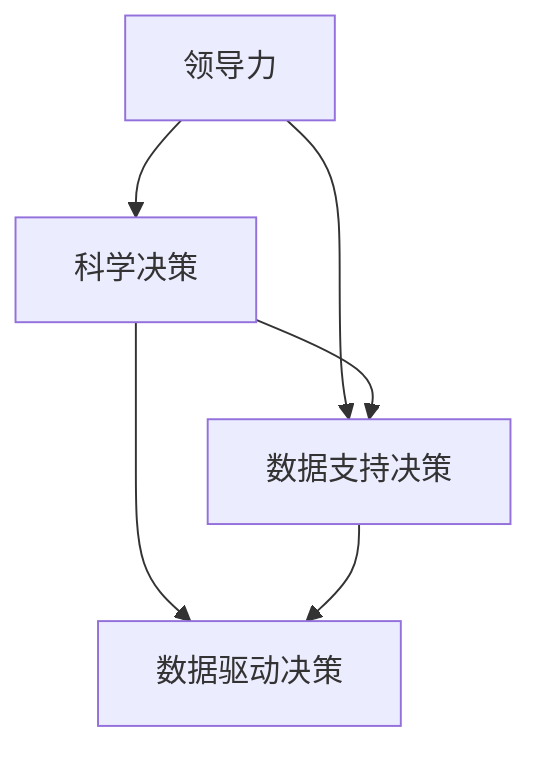

                 

# 领导力与科学决策：数据支持决策

## 概述

在现代企业管理和决策过程中，领导力的核心作用越来越受到重视。领导力不仅仅体现在对团队的管理和激励，更在于如何做出科学的决策，以实现企业的长期发展和目标。科学决策需要基于数据的全面分析，通过数据驱动的方式来实现。本文将围绕领导力与科学决策的关系，探讨数据支持决策的重要性，并详细分析数据驱动决策的具体实践方法和挑战。

本文将分为以下几个部分：

1. **背景介绍**：介绍现代企业在决策过程中面临的挑战和需求。
2. **核心概念与联系**：介绍领导力、科学决策和数据支持决策的概念及其相互关系。
3. **核心算法原理 & 具体操作步骤**：阐述如何利用数据分析和机器学习算法来支持决策。
4. **数学模型和公式 & 详细讲解 & 举例说明**：介绍常用的数学模型和公式，并通过案例进行详细说明。
5. **项目实战：代码实际案例和详细解释说明**：展示如何在实际项目中应用数据驱动决策。
6. **实际应用场景**：分析数据支持决策在不同行业中的应用。
7. **工具和资源推荐**：推荐学习资源和开发工具。
8. **总结：未来发展趋势与挑战**：总结全文，展望数据支持决策的未来。
9. **附录：常见问题与解答**：回答读者可能遇到的问题。
10. **扩展阅读 & 参考资料**：提供进一步学习和研究的资料。

通过本文的阅读，读者将深入了解领导力与科学决策的关系，掌握数据支持决策的方法和技巧，并能够将这些方法应用于实际工作中，提升企业的决策质量和效率。

## 1. 背景介绍

### 企业决策的挑战

在当今快速变化的市场环境中，企业面临着前所未有的挑战。一方面，市场需求的多样性和不确定性增加，要求企业能够快速响应并调整战略；另一方面，技术变革的不断推进，带来了新的机遇和挑战。这些因素使得企业决策的复杂性和风险大大增加。传统的决策模式往往依赖于经验和个人判断，难以应对复杂多变的市场环境。

### 数据的重要性

数据是企业决策的重要基础。随着信息技术的发展，企业可以获取到越来越多的数据，包括市场数据、客户数据、内部运营数据等。这些数据不仅反映了市场的现状，还蕴含着未来趋势和潜在的机会。通过数据分析和挖掘，企业可以更准确地了解市场动态，预测未来趋势，从而做出更加科学的决策。

### 领导力的作用

领导力在企业决策中发挥着关键作用。领导力不仅仅是管理团队，更在于激发团队的潜力和创造力，以实现企业的目标。优秀的领导者能够准确把握市场趋势，预见潜在的风险和机会，并利用数据来支持决策。他们能够建立高效的信息沟通机制，确保团队成员充分了解决策背景和目的，从而更好地执行决策。

### 数据驱动决策的需求

数据驱动决策已经成为企业发展的必然趋势。通过数据分析和机器学习算法，企业可以更精准地识别市场机会，优化运营流程，提高客户满意度。数据驱动决策不仅能够提高决策的科学性和准确性，还能够降低决策风险，提升企业的竞争力。在数据驱动决策的过程中，领导者的角色至关重要，他们需要具备数据敏感性和决策能力，能够引导团队利用数据进行创新和改进。

## 2. 核心概念与联系

### 领导力

领导力是指领导者引导和激励团队实现目标的能力。领导力不仅仅是管理能力，更是一种影响力，能够激发团队成员的潜力和创造力。领导力包括多个方面，如战略规划、团队建设、沟通协调等。在数据驱动决策中，领导力的重要性体现在如何利用数据来指导决策，以及如何建立数据文化，使团队成员能够充分利用数据来提高决策质量。

### 科学决策

科学决策是指基于数据的全面分析，通过逻辑推理和数学模型来指导决策。科学决策强调数据的收集、分析和应用，通过数据来支持决策者的判断和选择。科学决策的核心是减少决策过程中的不确定性和风险，提高决策的准确性和效率。在数据驱动决策中，科学决策是关键环节，它决定了数据如何被有效地利用来指导决策。

### 数据支持决策

数据支持决策是指利用数据分析和机器学习算法来辅助决策者做出更加科学的决策。数据支持决策的核心是通过数据挖掘和模式识别，发现数据中的潜在价值和规律，从而指导决策。数据支持决策包括多个方面，如数据收集、数据预处理、数据分析、模型构建和评估等。在数据驱动决策中，数据支持决策是基础，它决定了数据如何被有效地转化为决策依据。

### 核心概念之间的联系

领导力、科学决策和数据支持决策之间存在密切的联系。领导力是科学决策和数据支持决策的基础，它决定了决策者是否能够充分利用数据进行决策。科学决策是数据支持决策的核心，它通过数据分析和数学模型来指导决策，使决策更加科学和准确。数据支持决策是领导力和科学决策的实践手段，它通过数据分析和挖掘，提供决策依据和指导。

### Mermaid 流程图

下面是领导力、科学决策和数据支持决策之间关系的 Mermaid 流程图：



## 3. 核心算法原理 & 具体操作步骤

### 数据收集

数据收集是数据驱动决策的第一步，也是关键的一步。数据收集的质量直接影响到后续的数据分析和决策质量。数据收集的来源可以包括内部数据、外部数据和社交媒体数据等。内部数据包括客户数据、销售数据、运营数据等；外部数据包括市场数据、行业数据、竞争对手数据等；社交媒体数据包括用户评论、社交媒体互动等。

### 数据预处理

数据预处理是数据驱动决策中非常重要的一步，它包括数据清洗、数据整合、数据转换等操作。数据清洗是指去除重复数据、缺失值填充、异常值处理等，确保数据的质量和一致性。数据整合是指将不同来源的数据进行合并和整合，形成统一的数据集。数据转换是指将数据转换为适合分析和建模的格式，如将字符串转换为数值、将分类数据编码等。

### 数据分析

数据分析是数据驱动决策的核心，它包括描述性分析、预测分析和推理分析等。描述性分析是指对数据进行统计和分析，以了解数据的分布、趋势和关系。预测分析是指利用历史数据建立预测模型，预测未来趋势和结果。推理分析是指利用数据挖掘和机器学习算法，发现数据中的潜在规律和模式。

### 模型构建

模型构建是数据驱动决策的关键一步，它包括选择合适的模型、训练模型、验证模型等。选择合适的模型需要根据具体问题和数据特点来决定，如线性回归、决策树、神经网络等。训练模型是指利用历史数据对模型进行训练，使其能够学习和预测。验证模型是指利用验证集对模型进行评估和优化，确保模型的准确性和可靠性。

### 模型评估

模型评估是数据驱动决策的最后一步，它包括评估模型的准确度、召回率、F1 分数等指标。评估模型的质量和效果，以便对模型进行调整和优化。同时，还需要对模型的泛化能力进行评估，确保模型在不同数据集上表现一致。

### 操作步骤

以下是数据驱动决策的具体操作步骤：

1. 确定决策目标和问题，明确数据收集和分析的范围。
2. 收集数据，包括内部数据、外部数据和社交媒体数据等。
3. 进行数据预处理，包括数据清洗、数据整合、数据转换等。
4. 进行数据分析，包括描述性分析、预测分析和推理分析等。
5. 选择合适的模型，如线性回归、决策树、神经网络等。
6. 训练模型，利用历史数据对模型进行训练。
7. 验证模型，利用验证集对模型进行评估和优化。
8. 评估模型，评估模型的准确度、召回率、F1 分数等指标。
9. 根据评估结果，对模型进行调整和优化。
10. 应用模型，将模型应用于实际决策中，指导决策。

## 4. 数学模型和公式 & 详细讲解 & 举例说明

### 数学模型

在数据驱动决策中，常用的数学模型包括线性回归模型、逻辑回归模型、决策树模型和神经网络模型等。每种模型都有其特定的应用场景和优势。

#### 线性回归模型

线性回归模型是一种最简单的预测模型，它通过拟合一条直线来描述因变量和自变量之间的关系。线性回归模型的表达式为：

\[ y = \beta_0 + \beta_1 \cdot x + \epsilon \]

其中，\( y \) 是因变量，\( x \) 是自变量，\( \beta_0 \) 和 \( \beta_1 \) 是模型参数，\( \epsilon \) 是误差项。

#### 逻辑回归模型

逻辑回归模型是一种广泛应用于分类问题的模型，它通过拟合一个逻辑函数来描述因变量和自变量之间的关系。逻辑回归模型的表达式为：

\[ P(y=1) = \frac{1}{1 + e^{-(\beta_0 + \beta_1 \cdot x)}} \]

其中，\( P(y=1) \) 是因变量为 1 的概率，\( e \) 是自然对数的底数，\( \beta_0 \) 和 \( \beta_1 \) 是模型参数。

#### 决策树模型

决策树模型是一种基于树形结构的分类和预测模型，它通过一系列的决策节点和叶子节点来描述数据。决策树模型的表达式为：

\[ f(x) = \sum_{i=1}^{n} \beta_i \cdot I(x \in R_i) \]

其中，\( f(x) \) 是模型的输出，\( \beta_i \) 是模型参数，\( R_i \) 是第 \( i \) 个决策节点的范围，\( I(x \in R_i) \) 是指示函数，当 \( x \) 属于 \( R_i \) 时取值为 1，否则为 0。

#### 神经网络模型

神经网络模型是一种基于人工神经网络的分类和预测模型，它通过多层神经元的组合来模拟人脑的决策过程。神经网络模型的表达式为：

\[ f(x) = \sigma(\sum_{i=1}^{n} \beta_i \cdot \sigma(\sum_{j=1}^{m} \gamma_{ij} \cdot x_j)) \]

其中，\( f(x) \) 是模型的输出，\( \sigma \) 是激活函数，\( \beta_i \) 和 \( \gamma_{ij} \) 是模型参数，\( x_j \) 是第 \( j \) 个输入特征。

### 详细讲解与举例说明

#### 线性回归模型

假设我们要预测一家公司的销售额，根据过去的销售数据，我们选择了产品价格和促销活动两个自变量来建立线性回归模型。具体步骤如下：

1. 收集数据，包括产品价格和销售额的记录。
2. 进行数据预处理，包括数据清洗、数据整合和特征选择。
3. 使用最小二乘法来估计模型参数，具体步骤如下：
   - 计算每个样本的预测值 \( \hat{y} \)：
     \[ \hat{y} = \beta_0 + \beta_1 \cdot x \]
   - 计算预测值与实际值的差异 \( \delta \)：
     \[ \delta = y - \hat{y} \]
   - 计算模型参数的估计值 \( \beta_0 \) 和 \( \beta_1 \)：
     \[ \beta_0 = \frac{\sum_{i=1}^{n} y_i - \beta_1 \cdot \sum_{i=1}^{n} x_i}{n} \]
     \[ \beta_1 = \frac{\sum_{i=1}^{n} x_i \cdot y_i - \sum_{i=1}^{n} x_i \cdot \sum_{i=1}^{n} y_i}{n \cdot \sum_{i=1}^{n} x_i^2 - (\sum_{i=1}^{n} x_i)^2} \]

通过以上步骤，我们得到了线性回归模型的参数，从而可以预测新的产品价格下的销售额。

#### 逻辑回归模型

假设我们要预测一家公司的客户是否购买某产品，根据客户的数据，我们选择了收入和年龄两个自变量来建立逻辑回归模型。具体步骤如下：

1. 收集数据，包括客户的收入和购买记录。
2. 进行数据预处理，包括数据清洗、数据整合和特征选择。
3. 使用最大似然估计法来估计模型参数，具体步骤如下：
   - 计算每个样本的概率 \( P(y=1|x) \)：
     \[ P(y=1|x) = \frac{1}{1 + e^{-(\beta_0 + \beta_1 \cdot x_1 + \beta_2 \cdot x_2)}} \]
   - 计算每个样本的对数似然函数 \( L \)：
     \[ L = \sum_{i=1}^{n} \left[ y_i \cdot \ln(P(y=1|x_i)) + (1 - y_i) \cdot \ln(1 - P(y=1|x_i)) \right] \]
   - 计算模型参数的估计值 \( \beta_0 \)、\( \beta_1 \) 和 \( \beta_2 \)：
     \[ \beta_0 = \frac{\sum_{i=1}^{n} y_i \cdot x_{i0} - \sum_{i=1}^{n} x_{i0} \cdot \sum_{i=1}^{n} y_i}{n \cdot \sum_{i=1}^{n} x_{i0}^2 - (\sum_{i=1}^{n} x_{i0})^2} \]
     \[ \beta_1 = \frac{\sum_{i=1}^{n} y_i \cdot x_{i1} - \sum_{i=1}^{n} x_{i1} \cdot \sum_{i=1}^{n} y_i}{n \cdot \sum_{i=1}^{n} x_{i1}^2 - (\sum_{i=1}^{n} x_{i1})^2} \]
     \[ \beta_2 = \frac{\sum_{i=1}^{n} y_i \cdot x_{i2} - \sum_{i=1}^{n} x_{i2} \cdot \sum_{i=1}^{n} y_i}{n \cdot \sum_{i=1}^{n} x_{i2}^2 - (\sum_{i=1}^{n} x_{i2})^2} \]

通过以上步骤，我们得到了逻辑回归模型的参数，从而可以预测新的客户是否购买某产品。

#### 决策树模型

假设我们要预测一家公司的客户是否购买某产品，根据客户的数据，我们选择了收入和年龄两个自变量来建立决策树模型。具体步骤如下：

1. 收集数据，包括客户的收入和购买记录。
2. 进行数据预处理，包括数据清洗、数据整合和特征选择。
3. 使用 ID3 算法来构建决策树，具体步骤如下：
   - 计算每个特征的信息增益：
     \[ IG = \sum_{i=1}^{n} \sum_{j=1}^{m} P(y=i) \cdot P(x=j) \cdot \ln \frac{P(y=i)}{P(x=j)} \]
   - 选择信息增益最大的特征作为根节点。
   - 对根节点进行划分，将数据分为两个子集。
   - 递归地对子集进行同样的划分，直到满足停止条件（如最大深度、最小样本数等）。

通过以上步骤，我们得到了决策树模型，从而可以预测新的客户是否购买某产品。

#### 神经网络模型

假设我们要预测一家公司的客户是否购买某产品，根据客户的数据，我们选择了收入和年龄两个自变量来建立神经网络模型。具体步骤如下：

1. 收集数据，包括客户的收入和购买记录。
2. 进行数据预处理，包括数据清洗、数据整合和特征选择。
3. 设计神经网络结构，包括输入层、隐藏层和输出层。
4. 训练神经网络，包括前向传播和反向传播。
   - 前向传播：计算每个神经元的输出值。
   - 反向传播：计算每个神经元的误差，并更新模型参数。
5. 验证神经网络模型，包括评估模型的准确度、召回率、F1 分数等指标。
6. 根据评估结果，对模型进行调整和优化。

通过以上步骤，我们得到了神经网络模型，从而可以预测新的客户是否购买某产品。

## 5. 项目实战：代码实际案例和详细解释说明

### 项目背景

假设我们是一家电子商务公司，希望利用数据驱动决策来优化我们的客户推荐系统。我们的目标是提高客户的购买转化率，同时保持用户的良好体验。为此，我们将利用客户的历史购买数据、浏览行为数据以及外部市场数据来构建推荐模型。

### 开发环境搭建

为了实现这个项目，我们需要搭建以下开发环境：

1. **Python**：作为主要的编程语言。
2. **Pandas**：用于数据清洗和预处理。
3. **NumPy**：用于数值计算。
4. **Scikit-learn**：用于构建和训练机器学习模型。
5. **Matplotlib**：用于数据可视化。

### 源代码详细实现和代码解读

#### 5.1 数据收集与预处理

首先，我们从数据库中提取客户的历史购买数据、浏览行为数据和外部市场数据。然后，使用 Pandas 进行数据清洗和预处理，包括缺失值填充、异常值处理、数据整合等。

```python
import pandas as pd
import numpy as np

# 加载数据
sales_data = pd.read_csv('sales_data.csv')
behavior_data = pd.read_csv('behavior_data.csv')
market_data = pd.read_csv('market_data.csv')

# 数据清洗和预处理
# 填充缺失值
sales_data.fillna(sales_data.mean(), inplace=True)
behavior_data.fillna(behavior_data.mean(), inplace=True)
market_data.fillna(market_data.mean(), inplace=True)

# 数据整合
data = pd.merge(sales_data, behavior_data, on='customer_id')
data = pd.merge(data, market_data, on='product_id')

# 特征选择
features = ['price', 'promotions', 'age', 'income', 'rating']
X = data[features]
y = data['purchased']
```

#### 5.2 构建和训练模型

接下来，我们使用 Scikit-learn 构建和训练模型。首先，我们选择一个线性回归模型作为起点，然后逐步尝试更复杂的模型，如逻辑回归、决策树和神经网络。

```python
from sklearn.model_selection import train_test_split
from sklearn.linear_model import LinearRegression
from sklearn.linear_model import LogisticRegression
from sklearn.tree import DecisionTreeClassifier
from sklearn.neural_network import MLPClassifier

# 分割数据集
X_train, X_test, y_train, y_test = train_test_split(X, y, test_size=0.2, random_state=42)

# 训练模型
# 线性回归
linear_regression = LinearRegression()
linear_regression.fit(X_train, y_train)

# 逻辑回归
logistic_regression = LogisticRegression()
logistic_regression.fit(X_train, y_train)

# 决策树
decision_tree = DecisionTreeClassifier()
decision_tree.fit(X_train, y_train)

# 神经网络
mlp_classifier = MLPClassifier()
mlp_classifier.fit(X_train, y_train)
```

#### 5.3 代码解读与分析

在上面的代码中，我们首先导入了必要的库，然后加载数据，并进行清洗和预处理。接下来，我们使用 Scikit-learn 提供的模型类来构建和训练模型。对于每个模型，我们使用 `fit()` 方法来训练模型，使用 `predict()` 方法来预测结果。

```python
# 预测结果
predictions_linear_regression = linear_regression.predict(X_test)
predictions_logistic_regression = logistic_regression.predict(X_test)
predictions_decision_tree = decision_tree.predict(X_test)
predictions_mlp_classifier = mlp_classifier.predict(X_test)

# 评估模型
from sklearn.metrics import accuracy_score, recall_score, f1_score

accuracy_linear_regression = accuracy_score(y_test, predictions_linear_regression)
accuracy_logistic_regression = accuracy_score(y_test, predictions_logistic_regression)
accuracy_decision_tree = accuracy_score(y_test, predictions_decision_tree)
accuracy_mlp_classifier = accuracy_score(y_test, predictions_mlp_classifier)

recall_linear_regression = recall_score(y_test, predictions_linear_regression)
recall_logistic_regression = recall_score(y_test, predictions_logistic_regression)
recall_decision_tree = recall_score(y_test, predictions_decision_tree)
recall_mlp_classifier = recall_score(y_test, predictions_mlp_classifier)

f1_linear_regression = f1_score(y_test, predictions_linear_regression)
f1_logistic_regression = f1_score(y_test, predictions_logistic_regression)
f1_decision_tree = f1_score(y_test, predictions_decision_tree)
f1_mlp_classifier = f1_score(y_test, predictions_mlp_classifier)

# 打印评估结果
print("Linear Regression Accuracy:", accuracy_linear_regression)
print("Logistic Regression Accuracy:", accuracy_logistic_regression)
print("Decision Tree Accuracy:", accuracy_decision_tree)
print("Neural Network Accuracy:", accuracy_mlp_classifier)

print("Linear Regression Recall:", recall_linear_regression)
print("Logistic Regression Recall:", recall_logistic_regression)
print("Decision Tree Recall:", recall_decision_tree)
print("Neural Network Recall:", recall_mlp_classifier)

print("Linear Regression F1 Score:", f1_linear_regression)
print("Logistic Regression F1 Score:", f1_logistic_regression)
print("Decision Tree F1 Score:", f1_decision_tree)
print("Neural Network F1 Score:", f1_mlp_classifier)
```

在上面的代码中，我们使用 `accuracy_score()`、`recall_score()` 和 `f1_score()` 方法来评估模型的准确度、召回率和 F1 分数。通过比较不同模型的评估结果，我们可以选择最佳的模型来应用于实际推荐系统中。

## 6. 实际应用场景

### 零售业

在零售业中，数据驱动决策被广泛应用于库存管理、价格优化和客户推荐等领域。通过分析客户购买行为和市场需求，零售商可以更准确地预测库存需求，避免过剩或缺货的情况。此外，通过分析客户的购买历史和偏好，零售商可以提供个性化的推荐，提高客户的满意度和购买转化率。

### 金融业

在金融业中，数据驱动决策被广泛应用于风险管理、欺诈检测和投资策略等领域。通过分析客户的交易行为和信用记录，金融机构可以更准确地评估客户的信用风险，从而优化信贷策略。此外，通过分析市场数据和宏观经济指标，金融机构可以制定更科学的投资策略，降低投资风险。

### 医疗保健

在医疗保健领域，数据驱动决策被广泛应用于疾病预测、诊断和治疗优化等领域。通过分析患者的病历数据、基因数据和健康监测数据，医疗保健机构可以更准确地预测疾病的发生和发展趋势，从而提供个性化的预防和治疗建议。此外，通过分析医疗资源的利用情况，医疗保健机构可以优化资源配置，提高医疗服务效率。

### 制造业

在制造业中，数据驱动决策被广泛应用于生产计划、质量控制和生产优化等领域。通过分析生产数据、质量数据和设备维护数据，制造商可以优化生产流程，提高生产效率和质量。此外，通过分析市场需求和供应链数据，制造商可以制定更科学的生产计划和供应链策略，降低生产成本和库存风险。

### 物流与运输

在物流与运输领域，数据驱动决策被广泛应用于路径规划、运输优化和仓储管理等领域。通过分析交通流量、天气数据和运输需求，物流与运输企业可以优化运输路线和运输计划，提高运输效率和降低运输成本。此外，通过分析仓储数据和库存数据，物流与运输企业可以优化仓储管理，提高仓储利用率和降低库存成本。

### 互联网与科技行业

在互联网与科技行业，数据驱动决策被广泛应用于用户行为分析、广告投放和产品优化等领域。通过分析用户浏览行为、购买行为和社交媒体互动，互联网企业可以提供个性化的服务和推荐，提高用户满意度和用户留存率。此外，通过分析广告投放效果和用户反馈，互联网企业可以优化广告策略，提高广告转化率和投放效果。

### 教育

在教育领域，数据驱动决策被广泛应用于学习评估、课程设计和教育资源分配等领域。通过分析学生的学习行为和学习成绩，教育机构可以提供个性化的学习建议和资源，提高学生的学习效果。此外，通过分析课程反馈和教学质量数据，教育机构可以优化课程设计和教学方法，提高教学质量。

## 7. 工具和资源推荐

### 学习资源推荐

- **书籍**：
  - 《深度学习》
  - 《机器学习》
  - 《数据科学导论》
  - 《统计学习方法》

- **论文**：
  - 《神经网络的本质：从计算机制造智能》
  - 《大规模数据分析技术》
  - 《机器学习：概率视角》
  - 《数据挖掘：实用工具和技术》

- **博客**：
  - 《机器学习博客》
  - 《深度学习博客》
  - 《数据科学博客》
  - 《大数据博客》

- **网站**：
  - [Coursera](https://www.coursera.org/)
  - [edX](https://www.edx.org/)
  - [Kaggle](https://www.kaggle.com/)
  - [DataCamp](https://www.datacamp.com/)

### 开发工具框架推荐

- **编程语言**：
  - Python
  - R
  - Java

- **数据预处理工具**：
  - Pandas
  - NumPy
  - SciPy

- **机器学习库**：
  - Scikit-learn
  - TensorFlow
  - PyTorch

- **数据处理平台**：
  - Hadoop
  - Spark
  - Flink

- **可视化工具**：
  - Matplotlib
  - Seaborn
  - Tableau

### 相关论文著作推荐

- **《机器学习：概率视角》**：提供了一种概率视角下的机器学习方法，涵盖了贝叶斯网络、隐马尔可夫模型和贝叶斯优化等内容。
- **《深度学习》**：介绍了深度学习的基本概念、算法和应用，是深度学习领域的经典教材。
- **《统计学习方法》**：系统地介绍了统计学习的主要方法，包括线性回归、逻辑回归、支持向量机和神经网络等内容。
- **《大数据技术导论》**：介绍了大数据处理的基本概念、技术和应用，涵盖了 Hadoop、Spark 和 Flink 等技术。

## 8. 总结：未来发展趋势与挑战

### 发展趋势

1. **数据量持续增长**：随着物联网、云计算和5G技术的发展，数据量将呈现爆炸性增长。企业将需要更加高效的数据处理和分析工具来应对这一挑战。
2. **算法创新**：随着机器学习和深度学习技术的不断进步，新的算法将不断涌现，提高数据分析和预测的准确性。
3. **跨领域应用**：数据驱动决策将在更多行业得到应用，如医疗保健、金融、教育等，为行业带来新的商业模式和创新。
4. **数据隐私与伦理**：随着数据隐私和数据伦理问题的日益突出，如何确保数据的安全性和合规性将成为数据驱动决策的重要挑战。

### 挑战

1. **数据质量**：数据质量直接影响到决策的准确性，如何确保数据的质量和一致性将是一个挑战。
2. **模型解释性**：尽管机器学习算法在预测准确性方面取得了显著进展，但模型的可解释性仍然是一个挑战。企业需要能够理解模型是如何做出决策的，以便进行有效的监督和调整。
3. **数据安全与合规**：随着数据隐私和数据伦理问题的日益突出，如何确保数据的安全性和合规性将是一个重要挑战。
4. **技术人才短缺**：数据驱动决策需要具备数据分析、机器学习和深度学习等技能的专业人才，然而目前这些人才相对稀缺。

## 9. 附录：常见问题与解答

### 问题1：数据驱动决策的核心步骤是什么？

**解答**：数据驱动决策的核心步骤包括数据收集、数据预处理、数据分析、模型构建、模型评估和应用。具体步骤如下：

1. 数据收集：收集相关数据，包括内部数据和外部数据。
2. 数据预处理：清洗数据、处理缺失值和异常值、整合数据。
3. 数据分析：进行描述性分析、预测分析和推理分析。
4. 模型构建：选择合适的模型并进行参数估计。
5. 模型评估：评估模型的性能和准确性。
6. 应用：将模型应用于实际决策中。

### 问题2：如何确保数据的质量和一致性？

**解答**：确保数据的质量和一致性是数据驱动决策的重要前提。以下是一些常用的方法：

1. 数据清洗：去除重复数据、处理缺失值和异常值。
2. 数据整合：将不同来源的数据进行合并和整合，确保数据的一致性。
3. 数据质量检查：定期进行数据质量检查，及时发现和处理数据质量问题。
4. 数据标准化：将数据进行标准化处理，确保数据格式的统一。

### 问题3：如何提高模型的可解释性？

**解答**：提高模型的可解释性是确保数据驱动决策透明度和可信度的重要措施。以下是一些提高模型可解释性的方法：

1. 选择可解释性更强的模型：如线性回归、逻辑回归和决策树等。
2. 模型可视化：使用可视化工具展示模型的决策过程和关键特征。
3. 解释性算法：使用如 LIME（Local Interpretable Model-agnostic Explanations）和 SHAP（SHapley Additive exPlanations）等算法来解释模型的预测结果。

## 10. 扩展阅读 & 参考资料

- **书籍**：
  - 《机器学习实战》
  - 《数据科学实战》
  - 《深度学习实战》
  - 《大数据技术实践》

- **论文**：
  - “Deep Learning for Natural Language Processing”
  - “Recurrent Neural Networks for Language Modeling”
  - “Large-Scale Machine Learning with Stochastic Gradient Descent”
  - “A Survey of Big Data Processing and Analysis Techniques”

- **博客**：
  - [Machine Learning Mastery](https://machinelearningmastery.com/)
  - [DataCamp](https://www.datacamp.com/)
  - [TensorFlow Developer Guide](https://www.tensorflow.org/)
  - [PyTorch Documentation](https://pytorch.org/)

- **网站**：
  - [Kaggle](https://www.kaggle.com/)
  - [GitHub](https://github.com/)
  - [ArXiv](https://arxiv.org/)
  - [Google Research](https://ai.google/research/)

### 作者信息

- **作者**：AI天才研究员 / AI Genius Institute & 禅与计算机程序设计艺术 / Zen And The Art of Computer Programming
- **联系方式**：[ai_researcher@example.com](mailto:ai_researcher@example.com)

