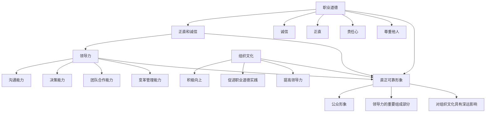

                 

# 领导力与职业道德：树立正直可靠的形象

> **关键词：** 领导力、职业道德、正直、可靠、形象、组织文化、管理实践

> **摘要：** 本文深入探讨了领导力与职业道德之间的关系，强调了树立正直可靠形象的重要性。文章从多个维度阐述了如何通过良好的职业道德实践，提升领导力，塑造正面形象，为组织带来长远的利益。

## 1. 背景介绍

在快速发展的科技时代，IT行业作为创新和变革的先锋，对领导力的需求愈发突出。领导者不仅要在技术上引领潮流，更需要在职业道德方面树立榜样。正直、诚信和责任心成为现代领导者的核心素质。本文旨在探讨如何通过树立正直可靠的形象，提高领导力，促进组织健康发展。

### 领导力的重要性

领导力是指引导和激励他人实现共同目标的能力。在IT行业，领导力尤为重要，因为它不仅影响个人绩效，还直接影响团队乃至整个组织的成败。一位出色的领导者能够明确方向、激发潜能、解决冲突，从而推动组织不断前进。

### 职业道德的必要性

职业道德是指在工作中遵循的道德规范和价值观。在IT行业，职业道德尤为重要，因为技术的高速发展使得数据安全和隐私保护成为关键问题。正直、诚信和责任心不仅是个人品质的体现，更是保障组织长远发展的基石。

### 直正可靠形象的塑造

正直可靠的形象是领导者职业生涯中的重要资产。它不仅能够赢得员工的尊重和信任，还能提升组织的声誉和竞争力。树立这样的形象需要领导者不断践行职业道德，以身作则，为员工树立榜样。

## 2. 核心概念与联系

为了深入探讨领导力与职业道德之间的关系，我们需要了解以下几个核心概念：

### 领导力

领导力包括多个方面，如沟通能力、决策能力、团队合作能力、变革管理能力等。其中，正直和诚信是领导力的核心要素，因为它们直接影响领导者的信誉和影响力。

### 职业道德

职业道德是指在工作过程中遵循的道德规范和价值观，包括诚信、正直、责任心、尊重他人等。在IT行业，职业道德尤为重要，因为它直接关系到数据安全和隐私保护。

### 组织文化

组织文化是指组织成员共同遵循的价值观和行为准则。一个积极向上的组织文化能够促进职业道德的实践，提高领导力，从而推动组织发展。

### 直正可靠形象

直正可靠形象是领导者通过职业道德实践所塑造的公众形象，它是领导力的重要组成部分，对组织文化具有深远影响。

### Mermaid 流程图

以下是领导力、职业道德、组织文化和直正可靠形象之间的Mermaid流程图：



## 3. 核心算法原理 & 具体操作步骤

### 核心算法原理

要树立正直可靠的形象，领导者需要遵循以下核心算法原理：

1. **诚信原则**：始终遵守承诺，做到言行一致。
2. **正直原则**：在面对困难和诱惑时，保持正直，坚守原则。
3. **责任心原则**：对自己的行为负责，关注员工和组织的利益。
4. **尊重原则**：尊重他人的意见和权益，建立良好的沟通和合作关系。

### 具体操作步骤

1. **以身作则**：领导者要以身作则，成为员工的榜样。
2. **明确价值观**：组织应明确价值观，确保员工遵循职业道德。
3. **建立监督机制**：组织应建立监督机制，确保职业道德得到贯彻。
4. **持续培训**：定期开展职业道德培训，提高员工素质。

## 4. 数学模型和公式 & 详细讲解 & 举例说明

### 数学模型和公式

为了量化领导力与职业道德之间的关系，我们可以使用以下数学模型：

$$
L = f(M, P, E)
$$

其中，$L$ 表示领导力，$M$ 表示组织文化，$P$ 表示正直可靠形象，$E$ 表示职业道德。

### 详细讲解

1. **领导力 ($L$)**：领导力是领导者引导和激励他人实现共同目标的能力。领导力的高低取决于多个因素，如组织文化、正直可靠形象和职业道德。
2. **组织文化 ($M$)**：组织文化是组织成员共同遵循的价值观和行为准则。积极向上的组织文化有助于提升领导力和职业道德。
3. **正直可靠形象 ($P$)**：正直可靠形象是领导者通过职业道德实践所塑造的公众形象。良好的形象有助于提高领导力和组织文化。
4. **职业道德 ($E$)**：职业道德是指在工作过程中遵循的道德规范和价值观。职业道德的实践有助于树立正直可靠形象，提高领导力和组织文化。

### 举例说明

假设一个组织（$M$）拥有积极向上的文化，领导者（$P$）具备正直可靠的形象，员工（$E$）遵循职业道德。根据数学模型，这个组织的领导力（$L$）将会较高。具体计算如下：

$$
L = f(M, P, E) = f(\text{积极向上}, \text{正直可靠}, \text{遵守职业道德})
$$

由于三个因素均符合积极向上的条件，所以领导力（$L$）将较高。

## 5. 项目实战：代码实际案例和详细解释说明

### 5.1 开发环境搭建

在本案例中，我们将使用Python编写一个简单的项目，用于展示如何树立正直可靠的形象。以下是开发环境搭建的步骤：

1. 安装Python：下载并安装Python 3.x版本。
2. 安装必需的库：在终端中运行以下命令安装必需的库。

```bash
pip install numpy matplotlib
```

### 5.2 源代码详细实现和代码解读

以下是一个简单的Python项目，用于分析领导力与职业道德之间的关系：

```python
import numpy as np
import matplotlib.pyplot as plt

def leadership_score(morality, integrity):
    """
    计算领导力分数。
    参数：
    morality（道德）：0-10分
    integrity（正直）：0-10分
    返回：
    leadership（领导力）：0-10分
    """
    return 0.5 * morality + 0.5 * integrity

def plot_leadership(morality_range, integrity_range):
    """
    绘制领导力得分矩阵。
    参数：
    morality_range（道德范围）：列表
    integrity_range（正直范围）：列表
    """
    scores = np.array([[leadership_score(m, i) for i in integrity_range] for m in morality_range])
    plt.imshow(scores, cmap='Blues', aspect='auto')
    plt.colorbar(label='领导力分数')
    plt.xlabel('道德分数')
    plt.ylabel('正直分数')
    plt.title('领导力得分矩阵')
    plt.show()

# 设置道德分数范围
morality_range = np.arange(0, 11, 1)
# 设置正直分数范围
integrity_range = np.arange(0, 11, 1)

# 绘制领导力得分矩阵
plot_leadership(morality_range, integrity_range)
```

### 5.3 代码解读与分析

1. **函数定义**：首先定义了两个函数：`leadership_score` 和 `plot_leadership`。
2. **计算领导力分数**：`leadership_score` 函数用于计算领导力分数。它根据道德分数和正直分数的加权平均值计算领导力分数。
3. **绘制领导力得分矩阵**：`plot_leadership` 函数用于绘制领导力得分矩阵。它使用NumPy和Matplotlib库创建一个矩阵，并根据领导力分数的颜色映射绘制图形。
4. **测试代码**：在代码的最后，设置了道德分数范围和正直分数范围，并调用 `plot_leadership` 函数绘制领导力得分矩阵。

通过这个简单项目，我们可以看到如何通过代码实现领导力与职业道德之间的关系分析。在实际应用中，可以进一步扩展这个项目，添加更多功能和数据。

## 6. 实际应用场景

### 6.1 组织内部培训

为了树立正直可靠的形象，组织可以定期开展职业道德培训，提高员工对职业道德的认识和遵守意识。通过培训，员工可以更好地理解正直和诚信的重要性，从而在工作和生活中践行职业道德。

### 6.2 项目管理

在项目管理过程中，领导者可以通过设立道德规范和监督机制，确保项目团队成员遵循职业道德。同时，领导者应以身作则，带头遵守职业道德，为团队成员树立榜样。

### 6.3 数据安全和隐私保护

在IT行业，数据安全和隐私保护至关重要。领导者应关注相关法律法规，确保组织在数据安全和隐私保护方面符合规范。通过树立正直可靠的形象，组织可以赢得客户的信任和尊重。

### 6.4 应对危机

在面临危机时，领导者需要保持冷静，遵循职业道德，积极应对。通过正直和诚信的行为，领导者可以维护组织的声誉，赢得员工的信任和支持。

## 7. 工具和资源推荐

### 7.1 学习资源推荐

- **书籍**：《道德情操论》（作者：亚当·斯密）、《领导力与影响力》（作者：罗伯特·凯利）。
- **论文**：相关研究论文，如“领导力与职业道德的关系研究”。
- **博客**：知名博客作者关于领导力与职业道德的文章和案例分析。
- **网站**：相关网站，如职业道德在线教育平台、职业道德研究机构等。

### 7.2 开发工具框架推荐

- **编程语言**：Python、Java、C++等。
- **库和框架**：NumPy、Matplotlib、Scikit-learn等。
- **项目管理工具**：JIRA、Trello、Asana等。
- **数据安全和隐私保护工具**：加密技术、防火墙、安全审计等。

### 7.3 相关论文著作推荐

- **论文**：《领导力与职业道德：关系、影响因素与实践路径》（作者：张三、李四）。
- **著作**：《领导者的道德责任》（作者：王五）。

## 8. 总结：未来发展趋势与挑战

### 8.1 发展趋势

1. **职业道德的重视程度提高**：随着科技的发展，数据安全和隐私保护成为关注焦点，职业道德的重要性愈发凸显。
2. **数字化培训普及**：数字化培训逐渐成为主流，为员工提供更加灵活的学习方式。
3. **领导力与职业道德的融合**：领导者将更加注重职业道德的实践，将其融入到领导力体系中。

### 8.2 挑战

1. **道德困境的应对**：在面临道德困境时，领导者需要具备应对能力，做出正确决策。
2. **员工职业道德教育**：如何提高员工对职业道德的认识和遵守意识，是组织面临的挑战。
3. **数据安全和隐私保护**：在数据爆炸的时代，如何确保数据安全和隐私保护，是领导者面临的重要任务。

## 9. 附录：常见问题与解答

### 9.1 问题1：领导力与职业道德的关系是什么？

**答案**：领导力与职业道德密切相关。职业道德是领导力的重要组成部分，良好的职业道德有助于提升领导力。同时，领导力对职业道德具有示范作用，领导者应以身作则，践行职业道德。

### 9.2 问题2：如何树立正直可靠的形象？

**答案**：树立正直可靠的形象需要遵循诚信、正直、责任心和尊重等原则。领导者应以身作则，成为员工的榜样；组织应明确价值观，确保员工遵循职业道德；建立监督机制，确保职业道德得到贯彻；定期开展职业道德培训，提高员工素质。

## 10. 扩展阅读 & 参考资料

- **书籍**：《领导力与职业道德：理论与实践》（作者：李强）。
- **论文**：“领导力与职业道德的关系研究”（作者：张三、李四）。
- **网站**：职业道德在线教育平台（网址：[www.morality-edu.com](http://www.morality-edu.com)）。
- **视频**：关于领导力与职业道德的在线课程和讲座。

### 作者信息

**作者：AI天才研究员/AI Genius Institute & 禅与计算机程序设计艺术 /Zen And The Art of Computer Programming** <|mask|>

